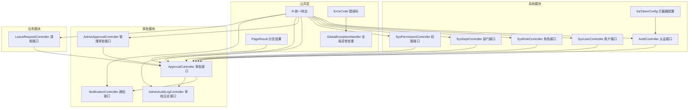
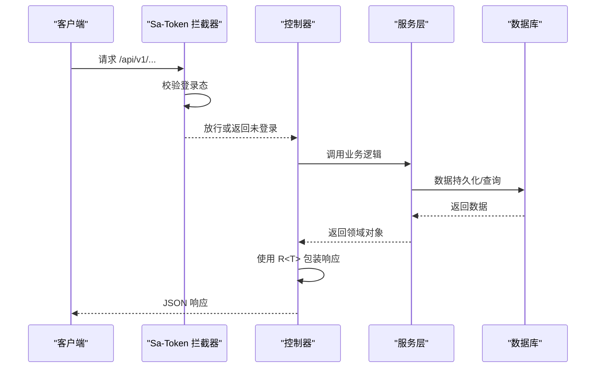
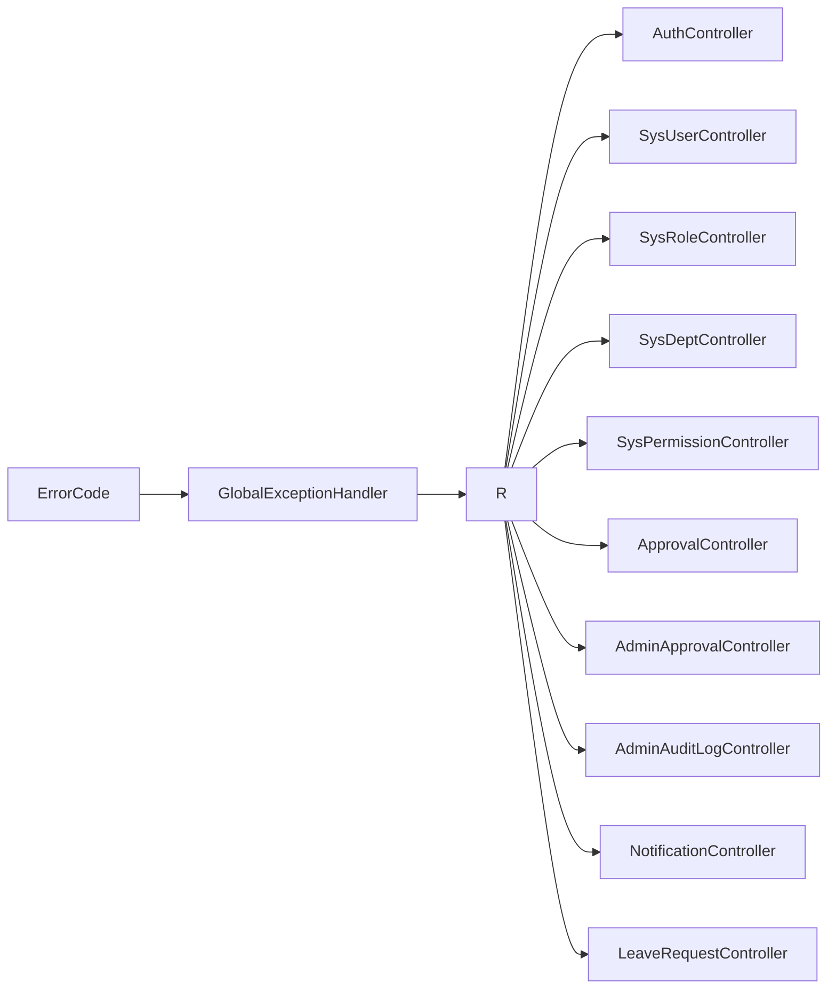

# API接口文档

<cite>
**本文档引用的文件**
- [R.java](file://oa-common/src/main/java/com/oa/admin/common/result/R.java)
- [ErrorCode.java](file://oa-common/src/main/java/com/oa/admin/common/result/ErrorCode.java)
- [GlobalExceptionHandler.java](file://oa-common/src/main/java/com/oa/admin/common/exception/GlobalExceptionHandler.java)
- [PageResult.java](file://oa-common/src/main/java/com/oa/admin/common/result/PageResult.java)
- [SaTokenConfig.java](file://oa-system/src/main/java/com/oa/admin/system/config/SaTokenConfig.java)
- [AuthController.java](file://oa-system/src/main/java/com/oa/admin/system/controller/AuthController.java)
- [SysUserController.java](file://oa-system/src/main/java/com/oa/admin/system/controller/SysUserController.java)
- [SysRoleController.java](file://oa-system/src/main/java/com/oa/admin/system/controller/SysRoleController.java)
- [SysDeptController.java](file://oa-system/src/main/java/com/oa/admin/system/controller/SysDeptController.java)
- [SysPermissionController.java](file://oa-system/src/main/java/com/oa/admin/system/controller/SysPermissionController.java)
- [ApprovalController.java](file://oa-approval/src/main/java/com/oa/admin/approval/controller/ApprovalController.java)
- [AdminApprovalController.java](file://oa-approval/src/main/java/com/oa/admin/approval/controller/AdminApprovalController.java)
- [AdminAuditLogController.java](file://oa-approval/src/main/java/com/oa/admin/approval/controller/AdminAuditLogController.java)
- [NotificationController.java](file://oa-approval/src/main/java/com/oa/admin/approval/controller/NotificationController.java)
- [LeaveRequestController.java](file://oa-leave/src/main/java/com/oa/admin/leave/controller/LeaveRequestController.java)
</cite>

## 目录
1. [简介](#简介)
2. [项目结构](#项目结构)
3. [核心组件](#核心组件)
4. [架构总览](#架构总览)
5. [详细组件分析](#详细组件分析)
6. [依赖分析](#依赖分析)
7. [性能考虑](#性能考虑)
8. [故障排除指南](#故障排除指南)
9. [结论](#结论)
10. [附录](#附录)

## 简介
本文件为 OA 审批管理系统提供的完整 API 接口文档，涵盖认证授权、系统管理、审批工作流、业务模块（如请假）等模块的 RESTful 接口设计与统一约定。文档统一采用 JSON 响应格式，基于 Sa-Token 进行认证授权拦截，并通过全局异常处理器实现错误码与统一响应包装。

## 项目结构
系统采用多模块划分：公共模块（统一响应、错误码、异常处理）、系统模块（认证与组织权限）、审批模块（工作流、模板、通知、审计日志）、业务模块（如请假），前端位于 oa-ui 模块。

图表来源
- [SaTokenConfig.java:13-24](file://oa-system/src/main/java/com/oa/admin/system/config/SaTokenConfig.java#L13-L24)
- [AuthController.java:14-37](file://oa-system/src/main/java/com/oa/admin/system/controller/AuthController.java#L14-L37)
- [SysUserController.java:17-84](file://oa-system/src/main/java/com/oa/admin/system/controller/SysUserController.java#L17-L84)
- [SysRoleController.java:17-77](file://oa-system/src/main/java/com/oa/admin/system/controller/SysRoleController.java#L17-L77)
- [SysDeptController.java:16-69](file://oa-system/src/main/java/com/oa/admin/system/controller/SysDeptController.java#L16-L69)
- [SysPermissionController.java:15-62](file://oa-system/src/main/java/com/oa/admin/system/controller/SysPermissionController.java#L15-L62)
- [ApprovalController.java:29-251](file://oa-approval/src/main/java/com/oa/admin/approval/controller/ApprovalController.java#L29-L251)
- [AdminApprovalController.java:15-55](file://oa-approval/src/main/java/com/oa/admin/approval/controller/AdminApprovalController.java#L15-L55)
- [AdminAuditLogController.java:14-34](file://oa-approval/src/main/java/com/oa/admin/approval/controller/AdminAuditLogController.java#L14-L34)
- [NotificationController.java:14-46](file://oa-approval/src/main/java/com/oa/admin/approval/controller/NotificationController.java#L14-L46)
- [LeaveRequestController.java:18-67](file://oa-leave/src/main/java/com/oa/admin/leave/controller/LeaveRequestController.java#L18-L67)

章节来源
- [SaTokenConfig.java:13-24](file://oa-system/src/main/java/com/oa/admin/system/config/SaTokenConfig.java#L13-L24)
- [R.java:11-43](file://oa-common/src/main/java/com/oa/admin/common/result/R.java#L11-L43)
- [ErrorCode.java:11-44](file://oa-common/src/main/java/com/oa/admin/common/result/ErrorCode.java#L11-L44)
- [GlobalExceptionHandler.java:21-73](file://oa-common/src/main/java/com/oa/admin/common/exception/GlobalExceptionHandler.java#L21-L73)
- [PageResult.java:10-22](file://oa-common/src/main/java/com/oa/admin/common/result/PageResult.java#L10-L22)

## 核心组件
- 统一响应 R<T>：封装 code、msg、data、timestamp 字段，提供成功与失败静态工厂方法。
- 错误码 ErrorCode：按模块划分系统、认证、审批等错误码范围。
- 全局异常处理 GlobalExceptionHandler：将未登录、权限不足、业务异常、参数校验异常等映射为统一响应。
- 分页结果 PageResult：封装 list、total、page、pageSize 字段。
- Sa-Token 拦截器：对 /api/v1/** 路径进行登录态校验，默认放行登录/注册接口。

章节来源
- [R.java:11-43](file://oa-common/src/main/java/com/oa/admin/common/result/R.java#L11-L43)
- [ErrorCode.java:11-44](file://oa-common/src/main/java/com/oa/admin/common/result/ErrorCode.java#L11-L44)
- [GlobalExceptionHandler.java:23-72](file://oa-common/src/main/java/com/oa/admin/common/exception/GlobalExceptionHandler.java#L23-L72)
- [PageResult.java:10-22](file://oa-common/src/main/java/com/oa/admin/common/result/PageResult.java#L10-L22)
- [SaTokenConfig.java:16-23](file://oa-system/src/main/java/com/oa/admin/system/config/SaTokenConfig.java#L16-L23)

## 架构总览
系统采用前后端分离，后端以 Spring MVC 提供 RESTful API，前端通过 axios 封装的请求工具调用后端接口。认证采用 Sa-Token 的会话令牌机制，接口通过注解进行权限控制。

图表来源
- [SaTokenConfig.java:16-23](file://oa-system/src/main/java/com/oa/admin/system/config/SaTokenConfig.java#L16-L23)
- [R.java:21-42](file://oa-common/src/main/java/com/oa/admin/common/result/R.java#L21-L42)

## 详细组件分析

### 认证授权模块
- 路由前缀：/api/v1/auth
- 登录
  - 方法：POST
  - 路径：/api/v1/auth/login
  - 请求体：{"username": "字符串", "password": "字符串"}
  - 响应：{"code": 200, "msg": "success", "data": {"token": "字符串", "user": 用户信息}, "timestamp": 时间戳}
- 登出
  - 方法：POST
  - 路径：/api/v1/auth/logout
  - 响应：{"code": 200, "msg": "success", "data": null, "timestamp": 时间戳}
- 当前用户
  - 方法：GET
  - 路径：/api/v1/auth/me
  - 响应：{"code": 200, "msg": "success", "data": 用户信息, "timestamp": 时间戳}

章节来源
- [AuthController.java:20-36](file://oa-system/src/main/java/com/oa/admin/system/controller/AuthController.java#L20-L36)
- [R.java:21-42](file://oa-common/src/main/java/com/oa/admin/common/result/R.java#L21-L42)

### 系统管理模块

#### 用户管理
- 列表查询（支持分页、条件筛选）
  - 方法：GET
  - 路径：/api/v1/system/user
  - 查询参数：username（模糊）、status（整型）、page（默认1）、pageSize（默认20）
  - 响应：{"code": 200, "msg": "success", "data": 分页结果, "timestamp": 时间戳}
- 获取详情
  - 方法：GET
  - 路径：/api/v1/system/user/{id}
  - 响应：{"code": 200, "msg": "success", "data": 用户信息, "timestamp": 时间戳}
- 新增用户
  - 方法：POST
  - 路径：/api/v1/system/user
  - 请求体：用户字段（含角色ID列表）
  - 响应：{"code": 200, "msg": "success", "data": 用户信息, "timestamp": 时间戳}
- 更新用户
  - 方法：PUT
  - 路径：/api/v1/system/user/{id}
  - 请求体：用户字段（含角色ID列表）
  - 响应：{"code": 200, "msg": "success", "data": 用户信息, "timestamp": 时间戳}
- 删除用户
  - 方法：DELETE
  - 路径：/api/v1/system/user/{id}
  - 响应：{"code": 200, "msg": "success", "data": null, "timestamp": 时间戳}

章节来源
- [SysUserController.java:23-83](file://oa-system/src/main/java/com/oa/admin/system/controller/SysUserController.java#L23-L83)
- [PageResult.java:16-21](file://oa-common/src/main/java/com/oa/admin/common/result/PageResult.java#L16-L21)

#### 角色管理
- 列表查询（支持分页、条件筛选）
  - 方法：GET
  - 路径：/api/v1/system/role
  - 查询参数：roleName（模糊）、status（整型）、page（默认1）、pageSize（默认20）
  - 响应：{"code": 200, "msg": "success", "data": 分页结果, "timestamp": 时间戳}
- 获取详情
  - 方法：GET
  - 路径：/api/v1/system/role/{id}
  - 响应：{"code": 200, "msg": "success", "data": 角色信息, "timestamp": 时间戳}
- 新增角色
  - 方法：POST
  - 路径：/api/v1/system/role
  - 请求体：角色对象
  - 响应：{"code": 200, "msg": "success", "data": 角色信息, "timestamp": 时间戳}
- 更新角色
  - 方法：PUT
  - 路径：/api/v1/system/role/{id}
  - 请求体：角色对象
  - 响应：{"code": 200, "msg": "success", "data": 角色信息, "timestamp": 时间戳}
- 删除角色
  - 方法：DELETE
  - 路径：/api/v1/system/role/{id}
  - 响应：{"code": 200, "msg": "success", "data": null, "timestamp": 时间戳}
- 分配权限
  - 方法：POST
  - 路径：/api/v1/system/role/{id}/permissions
  - 请求体：{"permissionIds": [整数数组]}
  - 响应：{"code": 200, "msg": "success", "data": null, "timestamp": 时间戳}
- 分配数据范围
  - 方法：POST
  - 路径：/api/v1/system/role/{id}/data-scope
  - 请求体：{"dataScope": 整数, "deptIds": [整数数组]}
  - 响应：{"code": 200, "msg": "success", "data": null, "timestamp": 时间戳}

章节来源
- [SysRoleController.java:23-76](file://oa-system/src/main/java/com/oa/admin/system/controller/SysRoleController.java#L23-L76)

#### 部门管理
- 树形列表（可选状态过滤）
  - 方法：GET
  - 路径：/api/v1/system/dept/tree
  - 查询参数：status（整型，可选）
  - 响应：{"code": 200, "msg": "success", "data": 部门树, "timestamp": 时间戳}
- 列表查询（可选状态过滤）
  - 方法：GET
  - 路径：/api/v1/system/dept
  - 查询参数：status（整型，可选）
  - 响应：{"code": 200, "msg": "success", "data": 部门列表, "timestamp": 时间戳}
- 获取详情
  - 方法：GET
  - 路径：/api/v1/system/dept/{id}
  - 响应：{"code": 200, "msg": "success", "data": 部门信息, "timestamp": 时间戳}
- 新增部门
  - 方法：POST
  - 路径：/api/v1/system/dept
  - 请求体：部门对象
  - 响应：{"code": 200, "msg": "success", "data": 部门信息, "timestamp": 时间戳}
- 更新部门
  - 方法：PUT
  - 路径：/api/v1/system/dept/{id}
  - 请求体：部门对象
  - 响应：{"code": 200, "msg": "success", "data": 部门信息, "timestamp": 时间戳}
- 删除部门
  - 方法：DELETE
  - 路径：/api/v1/system/dept/{id}
  - 响应：{"code": 200, "msg": "success", "data": null, "timestamp": 时间戳}

章节来源
- [SysDeptController.java:22-68](file://oa-system/src/main/java/com/oa/admin/system/controller/SysDeptController.java#L22-L68)

#### 权限管理
- 树形列表（可选状态过滤）
  - 方法：GET
  - 路径：/api/v1/system/permission/tree
  - 查询参数：status（整型，可选）
  - 响应：{"code": 200, "msg": "success", "data": 权限树, "timestamp": 时间戳}
- 列表查询（可选状态过滤）
  - 方法：GET
  - 路径：/api/v1/system/permission
  - 查询参数：status（整型，可选）
  - 响应：{"code": 200, "msg": "success", "data": 权限列表, "timestamp": 时间戳}
- 获取详情
  - 方法：GET
  - 路径：/api/v1/system/permission/{id}
  - 响应：{"code": 200, "msg": "success", "data": 权限信息, "timestamp": 时间戳}
- 新增权限
  - 方法：POST
  - 路径：/api/v1/system/permission
  - 请求体：权限对象
  - 响应：{"code": 200, "msg": "success", "data": 权限信息, "timestamp": 时间戳}
- 更新权限
  - 方法：PUT
  - 路径：/api/v1/system/permission/{id}
  - 请求体：权限对象
  - 响应：{"code": 200, "msg": "success", "data": 权限信息, "timestamp": 时间戳}
- 删除权限
  - 方法：DELETE
  - 路径：/api/v1/system/permission/{id}
  - 响应：{"code": 200, "msg": "success", "data": null, "timestamp": 时间戳}

章节来源
- [SysPermissionController.java:21-61](file://oa-system/src/main/java/com/oa/admin/system/controller/SysPermissionController.java#L21-L61)

### 审批工作流模块

#### 通用审批接口
- 提交审批
  - 方法：POST
  - 路径：/api/v1/approval/submit
  - 请求体：{"templateId": 整数, "title": 字符串, "formData": JSON字符串}
  - 响应：{"code": 200, "msg": "success", "data": 审批实例, "timestamp": 时间戳}
- 审批任务处理
  - 方法：POST
  - 路径：/api/v1/approval/task/{taskId}/approve
  - 请求体：{"result": 整数, "comment": 字符串}
  - 响应：{"code": 200, "msg": "success", "data": null, "timestamp": 时间戳}
- 我的待办任务
  - 方法：GET
  - 路径：/api/v1/approval/my-todo
  - 响应：{"code": 200, "msg": "success", "data": 任务列表, "timestamp": 时间戳}
- 我的已办任务
  - 方法：GET
  - 路径：/api/v1/approval/my-done
  - 响应：{"code": 200, "msg": "success", "data": 任务列表, "timestamp": 时间戳}
- 我的待办分页
  - 方法：GET
  - 路径：/api/v1/approval/my-todo/paged
  - 查询参数：title（模糊）、page（默认1）、pageSize（默认10）
  - 响应：{"code": 200, "msg": "success", "data": 分页结果, "timestamp": 时间戳}
- 我的已办分页
  - 方法：GET
  - 路径：/api/v1/approval/my-done/paged
  - 查询参数：title（模糊）、page（默认1）、pageSize（默认10）
  - 响应：{"code": 200, "msg": "success", "data": 分页结果, "timestamp": 时间戳}
- 任务转办
  - 方法：POST
  - 路径：/api/v1/approval/task/{taskId}/transfer
  - 请求体：{"targetUserId": 整数, "reason": 字符串}
  - 响应：{"code": 200, "msg": "success", "data": null, "timestamp": 时间戳}
- 撤回申请
  - 方法：POST
  - 路径：/api/v1/approval/{instanceId}/withdraw
  - 响应：{"code": 200, "msg": "success", "data": null, "timestamp": 时间戳}
- 实例关联任务
  - 方法：GET
  - 路径：/api/v1/approval/instance/{instanceId}/tasks
  - 响应：{"code": 200, "msg": "success", "data": 任务列表, "timestamp": 时间戳}
- 我的申请记录
  - 方法：GET
  - 路径：/api/v1/approval/my-applications
  - 查询参数：title（模糊）、status（整型）、page（默认1）、pageSize（默认10）
  - 响应：{"code": 200, "msg": "success", "data": 分页结果, "timestamp": 时间戳}
- 实例详情
  - 方法：GET
  - 路径：/api/v1/approval/instance/{instanceId}
  - 响应：{"code": 200, "msg": "success", "data": 审批实例, "timestamp": 时间戳}
- 实例流程图
  - 方法：GET
  - 路径：/api/v1/approval/instance/{instanceId}/diagram
  - 响应：{"code": 200, "msg": "success", "data": 流程图信息, "timestamp": 时间戳}
- 仪表盘统计
  - 方法：GET
  - 路径：/api/v1/approval/dashboard/stats
  - 响应：{"code": 200, "msg": "success", "data": 统计数据, "timestamp": 时间戳}

审批模板管理
- 模板列表
  - 方法：GET
  - 路径：/api/v1/approval/template
  - 查询参数：templateName（模糊）、status（整型）、page（默认1）、pageSize（默认10）
  - 响应：{"code": 200, "msg": "success", "data": 分页结果, "timestamp": 时间戳}
- 获取模板
  - 方法：GET
  - 路径：/api/v1/approval/template/{id}
  - 响应：{"code": 200, "msg": "success", "data": 模板信息, "timestamp": 时间戳}
- 创建模板
  - 方法：POST
  - 路径：/api/v1/approval/template
  - 请求体：模板对象
  - 响应：{"code": 200, "msg": "success", "data": 模板信息, "timestamp": 时间戳}
- 更新模板
  - 方法：PUT
  - 路径：/api/v1/approval/template/{id}
  - 请求体：模板对象
  - 响应：{"code": 200, "msg": "success", "data": 模板信息, "timestamp": 时间戳}
- 删除模板
  - 方法：DELETE
  - 路径：/api/v1/approval/template/{id}
  - 响应：{"code": 200, "msg": "success", "data": null, "timestamp": 时间戳}
- 发布模板
  - 方法：POST
  - 路径：/api/v1/approval/template/{id}/publish
  - 响应：{"code": 200, "msg": "success", "data": 模板信息, "timestamp": 时间戳}
- 获取模板XML
  - 方法：GET
  - 路径：/api/v1/approval/template/{id}/xml
  - 响应：{"code": 200, "msg": "success", "data": XML字符串, "timestamp": 时间戳}
- 保存模板XML
  - 方法：PUT
  - 路径：/api/v1/approval/template/{id}/xml
  - 请求体：{"bpmnXml": "XML字符串"}
  - 响应：{"code": 200, "msg": "success", "data": null, "timestamp": 时间戳}
- 获取节点配置
  - 方法：GET
  - 路径：/api/v1/approval/template/{id}/node-config
  - 响应：{"code": 200, "msg": "success", "data": 节点配置列表, "timestamp": 时间戳}
- 保存节点配置
  - 方法：PUT
  - 路径：/api/v1/approval/template/{id}/node-config
  - 请求体：节点配置数组
  - 响应：{"code": 200, "msg": "success", "data": null, "timestamp": 时间戳}
- 新建模板版本
  - 方法：POST
  - 路径：/api/v1/approval/template/{id}/new-version
  - 响应：{"code": 200, "msg": "success", "data": 新版本模板, "timestamp": 时间戳}

抄送管理
- 我的抄送
  - 方法：GET
  - 路径：/api/v1/approval/cc
  - 响应：{"code": 200, "msg": "success", "data": 抄送列表, "timestamp": 时间戳}
- 标记抄送已读
  - 方法：POST
  - 路径：/api/v1/approval/cc/{ccId}/read
  - 响应：{"code": 200, "msg": "success", "data": null, "timestamp": 时间戳}

章节来源
- [ApprovalController.java:37-251](file://oa-approval/src/main/java/com/oa/admin/approval/controller/ApprovalController.java#L37-L251)
- [PageResult.java:16-21](file://oa-common/src/main/java/com/oa/admin/common/result/PageResult.java#L16-L21)

#### 管理员审批接口
- 审批实例列表（支持多维筛选）
  - 方法：GET
  - 路径：/api/v1/admin/approval/instances
  - 查询参数：title（模糊）、status（整型）、templateId（整数）、initiatorUserId（整数）、startTime（日期字符串）、endTime（日期字符串）、page（默认1）、pageSize（默认10）
  - 响应：{"code": 200, "msg": "success", "data": 分页结果, "timestamp": 时间戳}
- 终止实例
  - 方法：POST
  - 路径：/api/v1/admin/approval/instances/{instanceId}/terminate
  - 响应：{"code": 200, "msg": "success", "data": null, "timestamp": 时间戳}
- 重分配任务
  - 方法：POST
  - 路径：/api/v1/admin/approval/tasks/{taskId}/reassign
  - 查询参数：targetUserId（整数）
  - 响应：{"code": 200, "msg": "success", "data": null, "timestamp": 时间戳}
- 管理指标
  - 方法：GET
  - 路径：/api/v1/admin/approval/metrics
  - 响应：{"code": 200, "msg": "success", "data": 指标数据, "timestamp": 时间戳}

章节来源
- [AdminApprovalController.java:21-54](file://oa-approval/src/main/java/com/oa/admin/approval/controller/AdminApprovalController.java#L21-L54)

#### 审核日志接口
- 日志查询
  - 方法：GET
  - 路径：/api/v1/admin/audit-log
  - 查询参数：module（字符串）、action（字符串）、targetType（字符串）、targetId（整数）、userId（整数）、startTime（日期字符串）、endTime（日期字符串）、page（默认1）、pageSize（默认10）
  - 响应：{"code": 200, "msg": "success", "data": 分页结果, "timestamp": 时间戳}

章节来源
- [AdminAuditLogController.java:20-33](file://oa-approval/src/main/java/com/oa/admin/approval/controller/AdminAuditLogController.java#L20-L33)

#### 通知接口
- 我的通知（支持类型过滤与未读筛选）
  - 方法：GET
  - 路径：/api/v1/notification/my
  - 查询参数：type（字符串）、unreadOnly（布尔）、page（默认1）、pageSize（默认10）
  - 响应：{"code": 200, "msg": "success", "data": 分页结果, "timestamp": 时间戳}
- 未读数量
  - 方法：GET
  - 路径：/api/v1/notification/unread-count
  - 响应：{"code": 200, "msg": "success", "data": 未读数量, "timestamp": 时间戳}
- 标记已读
  - 方法：POST
  - 路径：/api/v1/notification/{id}/read
  - 响应：{"code": 200, "msg": "success", "data": null, "timestamp": 时间戳}
- 全部已读
  - 方法：POST
  - 路径：/api/v1/notification/read-all
  - 响应：{"code": 200, "msg": "success", "data": null, "timestamp": 时间戳}

章节来源
- [NotificationController.java:21-45](file://oa-approval/src/main/java/com/oa/admin/approval/controller/NotificationController.java#L21-L45)

### 业务模块（请假）

#### 请假申请
- 列表查询（支持分页、条件筛选）
  - 方法：GET
  - 路径：/api/v1/leave/leave_request
  - 查询参数：同 DTO（由服务端解析）
  - 响应：{"code": 200, "msg": "success", "data": 分页结果, "timestamp": 时间戳}
- 获取详情
  - 方法：GET
  - 路径：/api/v1/leave/leave_request/{id}
  - 响应：{"code": 200, "msg": "success", "data": 请假详情, "timestamp": 时间戳}
- 新增申请
  - 方法：POST
  - 路径：/api/v1/leave/leave_request
  - 请求体：创建 DTO
  - 响应：{"code": 200, "msg": "success", "data": 请假详情, "timestamp": 时间戳}
- 更新申请
  - 方法：PUT
  - 路径：/api/v1/leave/leave_request/{id}
  - 请求体：更新 DTO
  - 响应：{"code": 200, "msg": "success", "data": 请假详情, "timestamp": 时间戳}
- 删除申请
  - 方法：DELETE
  - 路径：/api/v1/leave/leave_request/{id}
  - 响应：{"code": 200, "msg": "success", "data": null, "timestamp": 时间戳}
- 提交审批
  - 方法：POST
  - 路径：/api/v1/leave/leave_request/{id}/submit
  - 响应：{"code": 200, "msg": "success", "data": 请假详情, "timestamp": 时间戳}
- 重新提交
  - 方法：POST
  - 路径：/api/v1/leave/leave_request/{id}/resubmit
  - 请求体：更新 DTO
  - 响应：{"code": 200, "msg": "success", "data": 请假详情, "timestamp": 时间戳}

章节来源
- [LeaveRequestController.java:25-66](file://oa-leave/src/main/java/com/oa/admin/leave/controller/LeaveRequestController.java#L25-L66)

## 依赖分析
- 统一响应与错误码：所有控制器均通过 R<T> 包装响应，错误码由 ErrorCode 提供。
- 异常处理：GlobalExceptionHandler 将各类异常转换为统一响应，保证前端一致的错误处理体验。
- 权限控制：各控制器方法通过 Sa-Token 注解进行权限校验，结合系统模块的权限接口维护权限树。
- 分页查询：PageResult 统一分页返回结构，便于前端统一处理。

图表来源
- [R.java:11-43](file://oa-common/src/main/java/com/oa/admin/common/result/R.java#L11-L43)
- [ErrorCode.java:11-44](file://oa-common/src/main/java/com/oa/admin/common/result/ErrorCode.java#L11-L44)
- [GlobalExceptionHandler.java:21-73](file://oa-common/src/main/java/com/oa/admin/common/exception/GlobalExceptionHandler.java#L21-L73)
- [AuthController.java:14-37](file://oa-system/src/main/java/com/oa/admin/system/controller/AuthController.java#L14-L37)
- [SysUserController.java:17-84](file://oa-system/src/main/java/com/oa/admin/system/controller/SysUserController.java#L17-L84)
- [SysRoleController.java:17-77](file://oa-system/src/main/java/com/oa/admin/system/controller/SysRoleController.java#L17-L77)
- [SysDeptController.java:16-69](file://oa-system/src/main/java/com/oa/admin/system/controller/SysDeptController.java#L16-L69)
- [SysPermissionController.java:15-62](file://oa-system/src/main/java/com/oa/admin/system/controller/SysPermissionController.java#L15-L62)
- [ApprovalController.java:29-251](file://oa-approval/src/main/java/com/oa/admin/approval/controller/ApprovalController.java#L29-L251)
- [AdminApprovalController.java:15-55](file://oa-approval/src/main/java/com/oa/admin/approval/controller/AdminApprovalController.java#L15-L55)
- [AdminAuditLogController.java:14-34](file://oa-approval/src/main/java/com/oa/admin/approval/controller/AdminAuditLogController.java#L14-L34)
- [NotificationController.java:14-46](file://oa-approval/src/main/java/com/oa/admin/approval/controller/NotificationController.java#L14-L46)
- [LeaveRequestController.java:18-67](file://oa-leave/src/main/java/com/oa/admin/leave/controller/LeaveRequestController.java#L18-L67)

## 性能考虑
- 分页查询：建议前端传入合理的 pageSize，避免一次性加载过多数据。
- 条件筛选：优先使用精确字段过滤，减少数据库扫描范围。
- 缓存策略：对于频繁读取但不常变更的数据（如字典、权限树），可在服务层引入缓存。
- 并发控制：审批操作涉及状态机转换，需在服务层做好幂等与并发控制。

## 故障排除指南
- 未登录或登录过期
  - 现象：返回 code=2004，msg=“登录已过期, 请重新登录”
  - 处理：前端引导用户重新登录
- 无权限访问
  - 现象：返回 code=2002，msg=“无权限访问”
  - 处理：检查用户角色与权限是否匹配
- 参数校验失败
  - 现象：返回 code=1002，msg=具体字段提示
  - 处理：根据提示修正请求参数
- 业务异常
  - 现象：返回对应业务错误码
  - 处理：查看错误码定义并按提示修复

章节来源
- [GlobalExceptionHandler.java:23-72](file://oa-common/src/main/java/com/oa/admin/common/exception/GlobalExceptionHandler.java#L23-L72)
- [ErrorCode.java:11-44](file://oa-common/src/main/java/com/oa/admin/common/result/ErrorCode.java#L11-L44)

## 结论
本接口文档基于统一响应、错误码与异常处理机制，明确了认证授权、系统管理、审批工作流与业务模块的 RESTful 设计规范。通过 Sa-Token 的拦截与权限注解，确保了接口的安全性与一致性；通过分页与条件筛选的通用参数，提升了查询效率与灵活性。

## 附录

### 统一响应格式
- 成功响应：{"code": 200, "msg": "success", "data": 对象或数组或null, "timestamp": 秒级时间戳}
- 失败响应：{"code": 错误码, "msg": 错误信息, "data": null, "timestamp": 秒级时间戳}

章节来源
- [R.java:11-43](file://oa-common/src/main/java/com/oa/admin/common/result/R.java#L11-L43)

### 错误码定义
- 系统类（10xx）：系统异常、参数校验失败、资源不存在
- 认证类（20xx）：未登录或登录已过期、无权限访问、登录失败、登录已过期
- 审批类（30xx）：模板不存在、实例不存在、任务不存在、已处理、不允许撤回、XML格式错误、模板已发布不可修改、部署失败、节点配置缺失、用户/部门相关错误、模板未发布、不允许终止、任务已处理、转办目标无效

章节来源
- [ErrorCode.java:11-44](file://oa-common/src/main/java/com/oa/admin/common/result/ErrorCode.java#L11-L44)

### 分页查询与通用参数
- 通用查询参数
  - page：页码，默认1
  - pageSize：每页条数，默认值见各接口
  - 其他条件参数：如 title、status、startTime、endTime 等，按接口要求传入
- 响应结构：list（数据列表）、total（总数）、page（当前页）、pageSize（每页大小）

章节来源
- [PageResult.java:10-22](file://oa-common/src/main/java/com/oa/admin/common/result/PageResult.java#L10-L22)
- [SysUserController.java:25-30](file://oa-system/src/main/java/com/oa/admin/system/controller/SysUserController.java#L25-L30)
- [SysRoleController.java:25-30](file://oa-system/src/main/java/com/oa/admin/system/controller/SysRoleController.java#L25-L30)
- [ApprovalController.java:69-82](file://oa-approval/src/main/java/com/oa/admin/approval/controller/ApprovalController.java#L69-L82)
- [AdminApprovalController.java:23-33](file://oa-approval/src/main/java/com/oa/admin/approval/controller/AdminApprovalController.java#L23-L33)
- [AdminAuditLogController.java:22-32](file://oa-approval/src/main/java/com/oa/admin/approval/controller/AdminAuditLogController.java#L22-L32)
- [NotificationController.java:22-27](file://oa-approval/src/main/java/com/oa/admin/approval/controller/NotificationController.java#L22-L27)

### 认证机制与权限控制
- 认证方式：基于 Sa-Token 的会话令牌，请求头携带令牌（示例：Authorization: Bearer {token}）
- 拦截规则：/api/v1/** 路径需登录，除 /api/v1/auth/login、/api/v1/auth/register 外
- 权限注解：@SaCheckPermission("权限标识") 控制接口访问

章节来源
- [SaTokenConfig.java:16-23](file://oa-system/src/main/java/com/oa/admin/system/config/SaTokenConfig.java#L16-L23)
- [AuthController.java:20-25](file://oa-system/src/main/java/com/oa/admin/system/controller/AuthController.java#L20-L25)

### 接口版本管理与兼容性
- 版本前缀：/api/v1，便于后续 v2、v3 升级
- 向后兼容：新增字段采用非必填，避免破坏现有调用方；删除字段时保留但标记废弃

### 接口调用示例与常见场景
- 登录获取令牌并拉取当前用户信息
- 管理员查询用户列表并分页筛选
- 发起请假审批并提交至流程引擎
- 审批人处理待办任务并填写意见
- 管理员终止异常实例或重分配任务