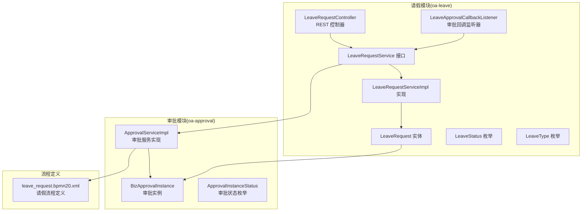
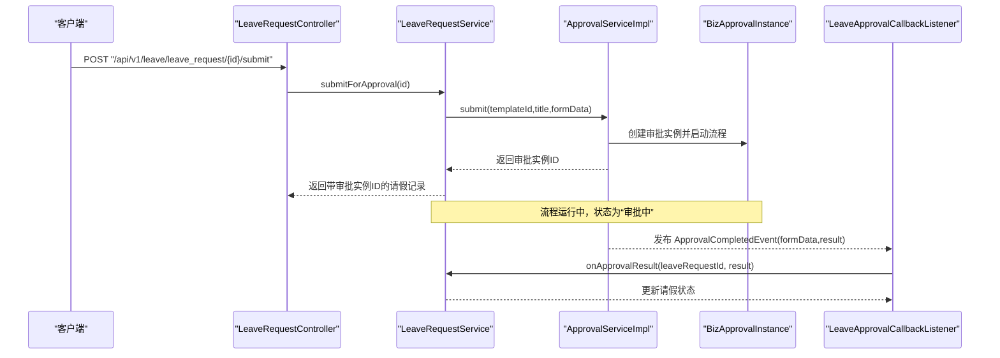
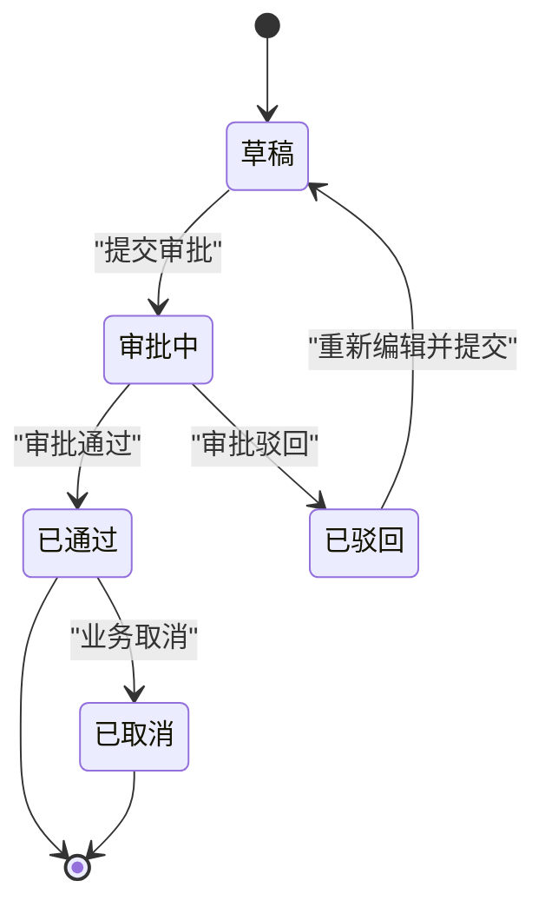
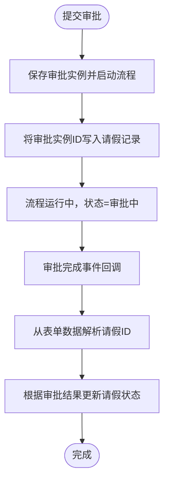
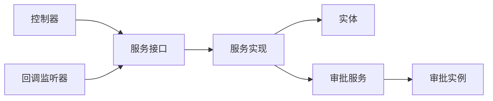
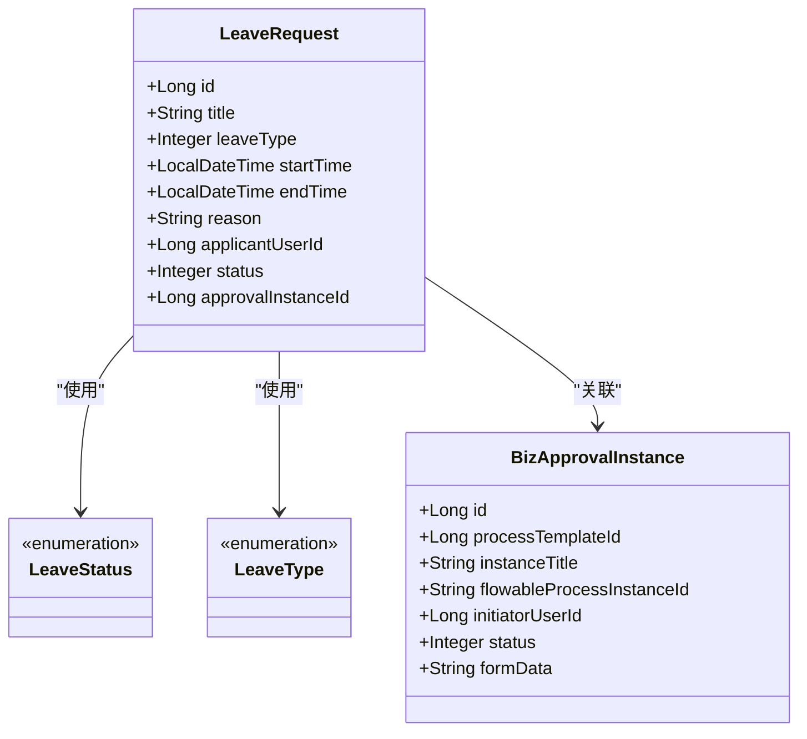

# 业务模块API

<cite>
**本文引用的文件**
- [LeaveRequestController.java](file://oa-leave/src/main/java/com/oa/admin/leave/controller/LeaveRequestController.java)
- [LeaveRequestService.java](file://oa-leave/src/main/java/com/oa/admin/leave/service/LeaveRequestService.java)
- [LeaveRequestServiceImpl.java](file://oa-leave/src/main/java/com/oa/admin/leave/service/impl/LeaveRequestServiceImpl.java)
- [LeaveRequest.java](file://oa-leave/src/main/java/com/oa/admin/leave/entity/LeaveRequest.java)
- [LeaveRequestCreateDTO.java](file://oa-leave/src/main/java/com/oa/admin/leave/dto/LeaveRequestCreateDTO.java)
- [LeaveRequestUpdateDTO.java](file://oa-leave/src/main/java/com/oa/admin/leave/dto/LeaveRequestUpdateDTO.java)
- [LeaveRequestQueryDTO.java](file://oa-leave/src/main/java/com/oa/admin/leave/dto/LeaveRequestQueryDTO.java)
- [LeaveRequestVO.java](file://oa-leave/src/main/java/com/oa/admin/leave/vo/LeaveRequestVO.java)
- [LeaveStatus.java](file://oa-leave/src/main/java/com/oa/admin/leave/enums/LeaveStatus.java)
- [LeaveType.java](file://oa-leave/src/main/java/com/oa/admin/leave/enums/LeaveType.java)
- [LeaveApprovalCallbackListener.java](file://oa-leave/src/main/java/com/oa/admin/leave/listener/LeaveApprovalCallbackListener.java)
- [BizApprovalInstance.java](file://oa-approval/src/main/java/com/oa/admin/approval/entity/BizApprovalInstance.java)
- [ApprovalInstanceStatus.java](file://oa-approval/src/main/java/com/oa/admin/approval/enums/ApprovalInstanceStatus.java)
- [ApprovalServiceImpl.java](file://oa-approval/src/main/java/com/oa/admin/approval/service/impl/ApprovalServiceImpl.java)
- [leave_request.bpmn20.xml](file://oa-app/src/main/resources/processes/leave_request.bpmn20.xml)
- [leave-request.yaml](file://generators/leave-request.yaml)
</cite>

## 目录
1. [简介](#简介)
2. [项目结构](#项目结构)
3. [核心组件](#核心组件)
4. [架构总览](#架构总览)
5. [详细组件分析](#详细组件分析)
6. [依赖分析](#依赖分析)
7. [性能考虑](#性能考虑)
8. [故障排查指南](#故障排查指南)
9. [结论](#结论)
10. [附录](#附录)

## 简介
本文件面向“业务模块API”文档目标，围绕请假业务模块（Leave）提供完整、可落地的API接口说明与设计实践。内容覆盖请假申请的CRUD、提交审批、重新提交、审批回调联动、请假类型与状态枚举、以及与审批流程的集成方式。文档同时给出流程图、时序图与类图，帮助开发者快速理解与扩展。

## 项目结构
请假业务位于独立模块中，采用分层架构：Controller -> Service -> Mapper/Entity，配合审批模块完成业务与流程的解耦。请假模块通过事件监听器与审批模块进行异步回调联动，确保状态一致性。

图表来源
- [LeaveRequestController.java:1-68](file://oa-leave/src/main/java/com/oa/admin/leave/controller/LeaveRequestController.java#L1-L68)
- [LeaveRequestService.java:1-42](file://oa-leave/src/main/java/com/oa/admin/leave/service/LeaveRequestService.java#L1-L42)
- [LeaveRequestServiceImpl.java](file://oa-leave/src/main/java/com/oa/admin/leave/service/impl/LeaveRequestServiceImpl.java)
- [LeaveRequest.java:1-48](file://oa-leave/src/main/java/com/oa/admin/leave/entity/LeaveRequest.java#L1-L48)
- [LeaveStatus.java:1-42](file://oa-leave/src/main/java/com/oa/admin/leave/enums/LeaveStatus.java#L1-L42)
- [LeaveType.java:1-40](file://oa-leave/src/main/java/com/oa/admin/leave/enums/LeaveType.java#L1-L40)
- [LeaveApprovalCallbackListener.java:1-49](file://oa-leave/src/main/java/com/oa/admin/leave/listener/LeaveApprovalCallbackListener.java#L1-L49)
- [BizApprovalInstance.java:1-33](file://oa-approval/src/main/java/com/oa/admin/approval/entity/BizApprovalInstance.java#L1-L33)
- [ApprovalInstanceStatus.java:1-29](file://oa-approval/src/main/java/com/oa/admin/approval/enums/ApprovalInstanceStatus.java#L1-L29)
- [ApprovalServiceImpl.java:1-200](file://oa-approval/src/main/java/com/oa/admin/approval/service/impl/ApprovalServiceImpl.java#L1-L200)
- [leave_request.bpmn20.xml](file://oa-app/src/main/resources/processes/leave_request.bpmn20.xml)

章节来源
- [LeaveRequestController.java:1-68](file://oa-leave/src/main/java/com/oa/admin/leave/controller/LeaveRequestController.java#L1-L68)
- [LeaveRequestService.java:1-42](file://oa-leave/src/main/java/com/oa/admin/leave/service/LeaveRequestService.java#L1-L42)
- [LeaveRequestServiceImpl.java](file://oa-leave/src/main/java/com/oa/admin/leave/service/impl/LeaveRequestServiceImpl.java)
- [LeaveRequest.java:1-48](file://oa-leave/src/main/java/com/oa/admin/leave/entity/LeaveRequest.java#L1-L48)
- [LeaveStatus.java:1-42](file://oa-leave/src/main/java/com/oa/admin/leave/enums/LeaveStatus.java#L1-L42)
- [LeaveType.java:1-40](file://oa-leave/src/main/java/com/oa/admin/leave/enums/LeaveType.java#L1-L40)
- [LeaveApprovalCallbackListener.java:1-49](file://oa-leave/src/main/java/com/oa/admin/leave/listener/LeaveApprovalCallbackListener.java#L1-L49)
- [BizApprovalInstance.java:1-33](file://oa-approval/src/main/java/com/oa/admin/approval/entity/BizApprovalInstance.java#L1-L33)
- [ApprovalInstanceStatus.java:1-29](file://oa-approval/src/main/java/com/oa/admin/approval/enums/ApprovalInstanceStatus.java#L1-L29)
- [ApprovalServiceImpl.java:1-200](file://oa-approval/src/main/java/com/oa/admin/approval/service/impl/ApprovalServiceImpl.java#L1-L200)
- [leave_request.bpmn20.xml](file://oa-app/src/main/resources/processes/leave_request.bpmn20.xml)

## 核心组件
- 控制器层：提供REST API，负责权限校验、参数接收与返回包装。
- 服务层：定义业务契约，包括分页查询、详情获取、创建、更新、删除、提交审批、重新提交、审批回调等。
- 数据模型：请假实体、查询/创建/更新DTO、响应VO、状态与类型枚举。
- 回调监听：基于审批完成事件，解析表单数据中的请假ID并同步请假状态。

章节来源
- [LeaveRequestController.java:1-68](file://oa-leave/src/main/java/com/oa/admin/leave/controller/LeaveRequestController.java#L1-L68)
- [LeaveRequestService.java:1-42](file://oa-leave/src/main/java/com/oa/admin/leave/service/LeaveRequestService.java#L1-L42)
- [LeaveRequest.java:1-48](file://oa-leave/src/main/java/com/oa/admin/leave/entity/LeaveRequest.java#L1-L48)
- [LeaveRequestCreateDTO.java:1-29](file://oa-leave/src/main/java/com/oa/admin/leave/dto/LeaveRequestCreateDTO.java#L1-L29)
- [LeaveRequestUpdateDTO.java:1-29](file://oa-leave/src/main/java/com/oa/admin/leave/dto/LeaveRequestUpdateDTO.java#L1-L29)
- [LeaveRequestQueryDTO.java:1-30](file://oa-leave/src/main/java/com/oa/admin/leave/dto/LeaveRequestQueryDTO.java#L1-L30)
- [LeaveRequestVO.java:1-45](file://oa-leave/src/main/java/com/oa/admin/leave/vo/LeaveRequestVO.java#L1-L45)
- [LeaveStatus.java:1-42](file://oa-leave/src/main/java/com/oa/admin/leave/enums/LeaveStatus.java#L1-L42)
- [LeaveType.java:1-40](file://oa-leave/src/main/java/com/oa/admin/leave/enums/LeaveType.java#L1-L40)
- [LeaveApprovalCallbackListener.java:1-49](file://oa-leave/src/main/java/com/oa/admin/leave/listener/LeaveApprovalCallbackListener.java#L1-L49)

## 架构总览
请假业务与审批流程通过事件驱动实现松耦合集成。提交审批时，业务侧保存审批实例ID；流程结束后，审批模块发布“审批完成事件”，请假模块监听并根据结果更新请假状态。

图表来源
- [LeaveRequestController.java:56-60](file://oa-leave/src/main/java/com/oa/admin/leave/controller/LeaveRequestController.java#L56-L60)
- [LeaveRequestService.java:27-41](file://oa-leave/src/main/java/com/oa/admin/leave/service/LeaveRequestService.java#L27-L41)
- [ApprovalServiceImpl.java:122-168](file://oa-approval/src/main/java/com/oa/admin/approval/service/impl/ApprovalServiceImpl.java#L122-L168)
- [BizApprovalInstance.java:1-33](file://oa-approval/src/main/java/com/oa/admin/approval/entity/BizApprovalInstance.java#L1-L33)
- [LeaveApprovalCallbackListener.java:24-33](file://oa-leave/src/main/java/com/oa/admin/leave/listener/LeaveApprovalCallbackListener.java#L24-L33)

## 详细组件分析

### API 接口清单与说明
- 列表查询
  - 方法：GET
  - 路径：/api/v1/leave/leave_request
  - 权限：leave:leave_request:list
  - 查询参数：标题、请假类型、申请人ID、状态、分页(page/pageSize)
  - 返回：分页结果，元素为请假视图对象
- 单条查询
  - 方法：GET
  - 路径：/api/v1/leave/leave_request/{id}
  - 权限：leave:leave_request:query
  - 返回：请假视图对象
- 新增
  - 方法：POST
  - 路径：/api/v1/leave/leave_request
  - 权限：leave:leave_request:add
  - 请求体：请假创建DTO（标题、类型、起止时间、原因）
  - 返回：请假视图对象（默认状态为草稿）
- 修改
  - 方法：PUT
  - 路径：/api/v1/leave/leave_request/{id}
  - 权限：leave:leave_request:edit
  - 请求体：请假更新DTO
  - 返回：请假视图对象
- 删除
  - 方法：DELETE
  - 路径：/api/v1/leave/leave_request/{id}
  - 权限：leave:leave_request:remove
  - 返回：成功空响应
- 提交审批
  - 方法：POST
  - 路径：/api/v1/leave/leave_request/{id}/submit
  - 权限：leave:leave_request:submit
  - 返回：带审批实例ID的请假视图对象
- 重新提交
  - 方法：POST
  - 路径：/api/v1/leave/leave_request/{id}/resubmit
  - 权限：leave:leave_request:edit
  - 请求体：请假更新DTO
  - 返回：更新后的请假视图对象

章节来源
- [LeaveRequestController.java:25-66](file://oa-leave/src/main/java/com/oa/admin/leave/controller/LeaveRequestController.java#L25-L66)
- [LeaveRequestQueryDTO.java:1-30](file://oa-leave/src/main/java/com/oa/admin/leave/dto/LeaveRequestQueryDTO.java#L1-L30)
- [LeaveRequestCreateDTO.java:1-29](file://oa-leave/src/main/java/com/oa/admin/leave/dto/LeaveRequestCreateDTO.java#L1-L29)
- [LeaveRequestUpdateDTO.java:1-29](file://oa-leave/src/main/java/com/oa/admin/leave/dto/LeaveRequestUpdateDTO.java#L1-L29)

### 数据模型与状态流转
- 实体字段要点
  - 标题、类型、起止时间、原因、申请人ID、状态、关联审批实例ID
- 状态枚举
  - 草稿、审批中、已通过、已驳回、已取消
- 类型枚举
  - 年假、病假、事假
- 状态转换（简化）
  - 草稿 -> 审批中（提交审批）
  - 审批中 -> 已通过/已驳回（审批完成回调）
  - 已通过/已驳回 -> 可重新编辑（重新提交）

图表来源
- [LeaveStatus.java:12-17](file://oa-leave/src/main/java/com/oa/admin/leave/enums/LeaveStatus.java#L12-L17)
- [LeaveRequestService.java:27-41](file://oa-leave/src/main/java/com/oa/admin/leave/service/LeaveRequestService.java#L27-L41)

章节来源
- [LeaveRequest.java:1-48](file://oa-leave/src/main/java/com/oa/admin/leave/entity/LeaveRequest.java#L1-L48)
- [LeaveStatus.java:1-42](file://oa-leave/src/main/java/com/oa/admin/leave/enums/LeaveStatus.java#L1-L42)
- [LeaveType.java:1-40](file://oa-leave/src/main/java/com/oa/admin/leave/enums/LeaveType.java#L1-L40)

### 审批流程集成与回调机制
- 提交流程
  - 业务侧在提交审批时，调用审批服务，传入模板标识、标题与表单数据（含请假ID），返回审批实例ID并持久化到请假记录
- 回调机制
  - 审批完成后，审批服务发布“审批完成事件”，请假模块监听该事件，从表单数据中提取请假ID并调用业务服务更新状态
- 流程定义
  - 请假流程定义文件中包含流程节点与分支逻辑，支撑“部门领导审批”“条件网关”“结束事件”等

图表来源
- [ApprovalServiceImpl.java:122-168](file://oa-approval/src/main/java/com/oa/admin/approval/service/impl/ApprovalServiceImpl.java#L122-L168)
- [BizApprovalInstance.java:1-33](file://oa-approval/src/main/java/com/oa/admin/approval/entity/BizApprovalInstance.java#L1-L33)
- [LeaveApprovalCallbackListener.java:24-33](file://oa-leave/src/main/java/com/oa/admin/leave/listener/LeaveApprovalCallbackListener.java#L24-L33)

章节来源
- [LeaveRequestController.java:56-60](file://oa-leave/src/main/java/com/oa/admin/leave/controller/LeaveRequestController.java#L56-L60)
- [LeaveRequestService.java:27-41](file://oa-leave/src/main/java/com/oa/admin/leave/service/LeaveRequestService.java#L27-L41)
- [LeaveApprovalCallbackListener.java:1-49](file://oa-leave/src/main/java/com/oa/admin/leave/listener/LeaveApprovalCallbackListener.java#L1-L49)
- [leave_request.bpmn20.xml](file://oa-app/src/main/resources/processes/leave_request.bpmn20.xml)

### 请假类型与状态管理接口
- 请假类型配置接口
  - 通过枚举定义请假类型（年假、病假、事假），支持序列化/反序列化
  - 建议在前端或管理端维护类型字典，后端以枚举提供稳定取值
- 状态管理接口
  - 通过提交审批与重新提交接口驱动状态变更
  - 审批回调自动同步最终状态

章节来源
- [LeaveType.java:1-40](file://oa-leave/src/main/java/com/oa/admin/leave/enums/LeaveType.java#L1-L40)
- [LeaveStatus.java:1-42](file://oa-leave/src/main/java/com/oa/admin/leave/enums/LeaveStatus.java#L1-L42)
- [LeaveRequestController.java:56-66](file://oa-leave/src/main/java/com/oa/admin/leave/controller/LeaveRequestController.java#L56-L66)

### 统计分析接口（建议）
- 建议在审批模块提供通用指标与仪表盘统计能力，如按类型/状态/部门/时间段的统计，便于在前端展示
- 本仓库未提供专门的“请假统计API”，可在现有审批统计接口基础上扩展

[本节为概念性建议，不直接分析具体文件]

### 业务数据验证与约束
- 输入验证
  - 标题必填、类型必填、起止时间必填且结束时间不得早于开始时间
  - 申请人ID由登录用户填充，避免越权
- 业务约束
  - 仅草稿或已驳回状态允许修改与重新提交
  - 审批中状态禁止删除
- 状态约束
  - 审批完成事件仅在存在有效请假ID时处理，防止误触发

章节来源
- [LeaveRequestCreateDTO.java:1-29](file://oa-leave/src/main/java/com/oa/admin/leave/dto/LeaveRequestCreateDTO.java#L1-L29)
- [LeaveRequestUpdateDTO.java:1-29](file://oa-leave/src/main/java/com/oa/admin/leave/dto/LeaveRequestUpdateDTO.java#L1-L29)
- [LeaveRequestQueryDTO.java:1-30](file://oa-leave/src/main/java/com/oa/admin/leave/dto/LeaveRequestQueryDTO.java#L1-L30)
- [LeaveRequestService.java:27-41](file://oa-leave/src/main/java/com/oa/admin/leave/service/LeaveRequestService.java#L27-L41)
- [LeaveApprovalCallbackListener.java:35-47](file://oa-leave/src/main/java/com/oa/admin/leave/listener/LeaveApprovalCallbackListener.java#L35-L47)

### 使用示例（步骤说明）
- 新建请假
  - 调用新增接口，填写标题、类型、起止时间、原因，得到草稿状态的请假记录
- 编辑并提交
  - 若需修改，先调用修改接口，再调用提交审批接口
- 查看进度
  - 调用列表/详情接口查看状态与审批实例ID
- 审批完成
  - 等待回调，状态自动更新为“已通过”或“已驳回”
- 重新提交
  - 若被驳回，修改后调用重新提交接口，再次进入审批流程

章节来源
- [LeaveRequestController.java:37-66](file://oa-leave/src/main/java/com/oa/admin/leave/controller/LeaveRequestController.java#L37-L66)
- [LeaveRequestService.java:27-41](file://oa-leave/src/main/java/com/oa/admin/leave/service/LeaveRequestService.java#L27-L41)

### 扩展其他业务模块的API设计模式
- 分层清晰：Controller/Service/Entity/DTO/VO/Enum，职责单一
- 权限控制：基于注解的细粒度权限校验
- 事件驱动：通过事件解耦业务与流程，保证状态一致性
- 流程集成：以模板+表单数据的方式接入流程引擎，便于复用与扩展
- 配置优先：通过YAML生成器定义枚举与表结构，统一治理

章节来源
- [LeaveRequestController.java:1-68](file://oa-leave/src/main/java/com/oa/admin/leave/controller/LeaveRequestController.java#L1-L68)
- [LeaveRequestService.java:1-42](file://oa-leave/src/main/java/com/oa/admin/leave/service/LeaveRequestService.java#L1-L42)
- [leave-request.yaml:1-74](file://generators/leave-request.yaml#L1-L74)

## 依赖分析
- 控制器依赖服务接口，服务实现依赖实体与审批服务
- 请假实体与审批实例通过“审批实例ID”建立弱耦合关联
- 回调监听器依赖审批完成事件与JSON解析工具

图表来源
- [LeaveRequestController.java:1-68](file://oa-leave/src/main/java/com/oa/admin/leave/controller/LeaveRequestController.java#L1-L68)
- [LeaveRequestService.java:1-42](file://oa-leave/src/main/java/com/oa/admin/leave/service/LeaveRequestService.java#L1-L42)
- [LeaveRequestServiceImpl.java](file://oa-leave/src/main/java/com/oa/admin/leave/service/impl/LeaveRequestServiceImpl.java)
- [LeaveRequest.java:1-48](file://oa-leave/src/main/java/com/oa/admin/leave/entity/LeaveRequest.java#L1-L48)
- [BizApprovalInstance.java:1-33](file://oa-approval/src/main/java/com/oa/admin/approval/entity/BizApprovalInstance.java#L1-L33)
- [LeaveApprovalCallbackListener.java:1-49](file://oa-leave/src/main/java/com/oa/admin/leave/listener/LeaveApprovalCallbackListener.java#L1-L49)

章节来源
- [LeaveRequestController.java:1-68](file://oa-leave/src/main/java/com/oa/admin/leave/controller/LeaveRequestController.java#L1-L68)
- [LeaveRequestService.java:1-42](file://oa-leave/src/main/java/com/oa/admin/leave/service/LeaveRequestService.java#L1-L42)
- [LeaveRequest.java:1-48](file://oa-leave/src/main/java/com/oa/admin/leave/entity/LeaveRequest.java#L1-L48)
- [BizApprovalInstance.java:1-33](file://oa-approval/src/main/java/com/oa/admin/approval/entity/BizApprovalInstance.java#L1-L33)
- [LeaveApprovalCallbackListener.java:1-49](file://oa-leave/src/main/java/com/oa/admin/leave/listener/LeaveApprovalCallbackListener.java#L1-L49)

## 性能考虑
- 分页查询：列表接口默认分页，建议前端合理设置页大小并使用筛选条件
- 索引优化：实体已定义申请人与状态索引，建议结合查询条件命中索引
- 事务边界：审批提交与状态更新均在事务内执行，注意长事务对并发的影响
- 异步回调：审批完成事件为异步处理，避免阻塞主流程

[本节为通用指导，不直接分析具体文件]

## 故障排查指南
- 提交失败
  - 检查模板是否发布、表单数据格式是否正确
  - 关注审批服务抛出的异常与错误码
- 状态不同步
  - 检查回调监听器是否收到事件、表单数据中是否存在请假ID
  - 核对审批实例状态与业务状态映射
- 权限不足
  - 确认当前用户是否具备相应菜单权限
- 参数错误
  - 校验请求体字段是否符合DTO要求，时间先后顺序是否正确

章节来源
- [ApprovalServiceImpl.java:122-168](file://oa-approval/src/main/java/com/oa/admin/approval/service/impl/ApprovalServiceImpl.java#L122-L168)
- [LeaveApprovalCallbackListener.java:24-47](file://oa-leave/src/main/java/com/oa/admin/leave/listener/LeaveApprovalCallbackListener.java#L24-L47)

## 结论
请假业务模块通过清晰的分层与事件驱动机制，实现了与审批流程的高效集成。API覆盖了请假申请的全生命周期，状态管理与流程节点相互印证。建议后续在审批模块扩展统计分析接口，并在前端提供更丰富的可视化能力。

[本节为总结性内容，不直接分析具体文件]

## 附录

### API 定义速查
- GET /api/v1/leave/leave_request?page=&pageSize=
- GET /api/v1/leave/leave_request/{id}
- POST /api/v1/leave/leave_request
- PUT /api/v1/leave/leave_request/{id}
- DELETE /api/v1/leave/leave_request/{id}
- POST /api/v1/leave/leave_request/{id}/submit
- POST /api/v1/leave/leave_request/{id}/resubmit

章节来源
- [LeaveRequestController.java:25-66](file://oa-leave/src/main/java/com/oa/admin/leave/controller/LeaveRequestController.java#L25-L66)

### 数据模型类图

图表来源
- [LeaveRequest.java:1-48](file://oa-leave/src/main/java/com/oa/admin/leave/entity/LeaveRequest.java#L1-L48)
- [LeaveStatus.java:1-42](file://oa-leave/src/main/java/com/oa/admin/leave/enums/LeaveStatus.java#L1-L42)
- [LeaveType.java:1-40](file://oa-leave/src/main/java/com/oa/admin/leave/enums/LeaveType.java#L1-L40)
- [BizApprovalInstance.java:1-33](file://oa-approval/src/main/java/com/oa/admin/approval/entity/BizApprovalInstance.java#L1-L33)