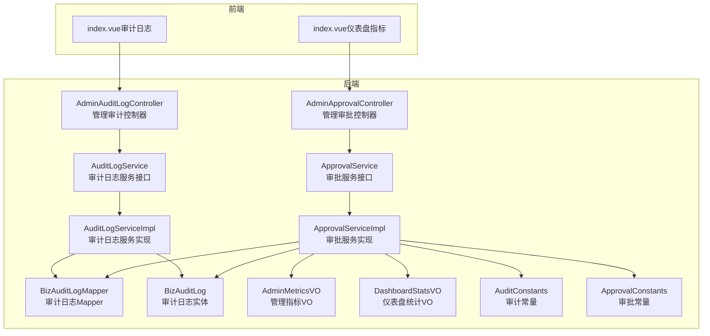
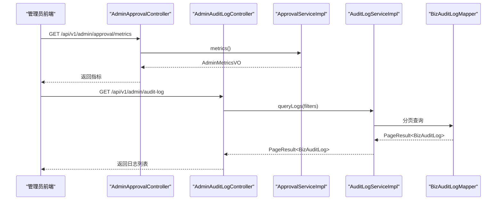
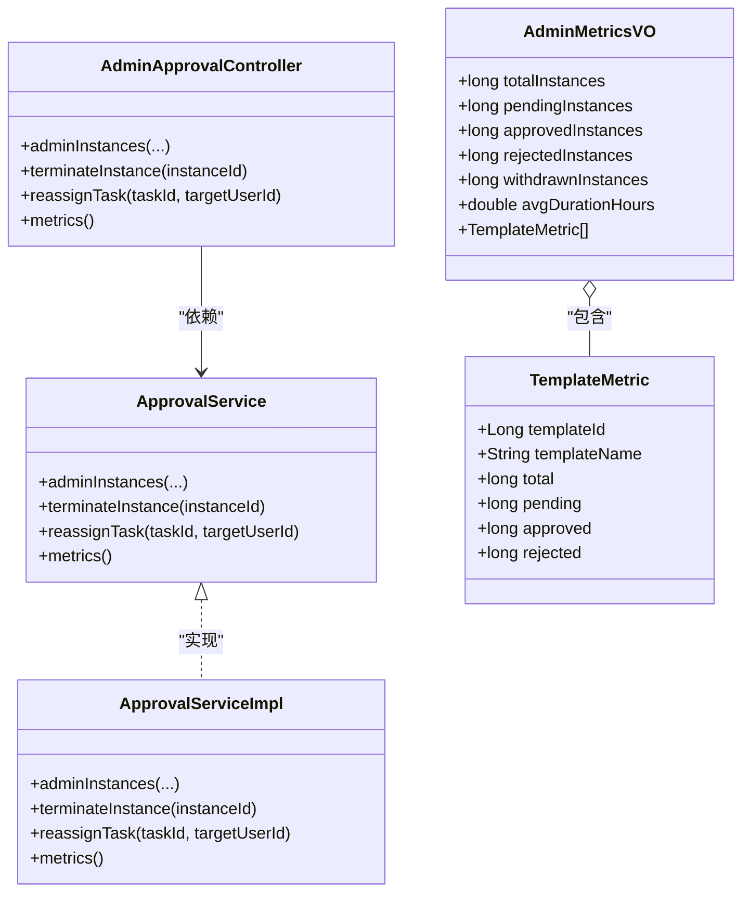
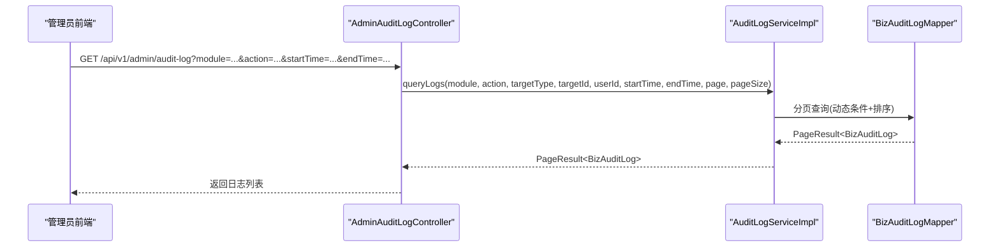
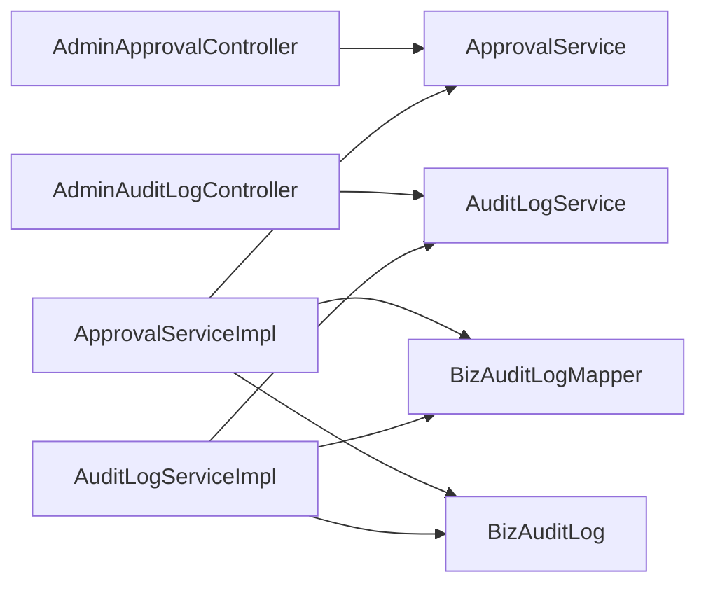

# 仪表盘与审计

<cite>
**本文引用的文件**
- [AdminApprovalController.java](file://oa-approval/src/main/java/com/oa/admin/approval/controller/AdminApprovalController.java)
- [AdminAuditLogController.java](file://oa-approval/src/main/java/com/oa/admin/approval/controller/AdminAuditLogController.java)
- [ApprovalService.java](file://oa-approval/src/main/java/com/oa/admin/approval/service/ApprovalService.java)
- [ApprovalServiceImpl.java](file://oa-approval/src/main/java/com/oa/admin/approval/service/impl/ApprovalServiceImpl.java)
- [AuditLogService.java](file://oa-approval/src/main/java/com/oa/admin/approval/service/AuditLogService.java)
- [AuditLogServiceImpl.java](file://oa-approval/src/main/java/com/oa/admin/approval/service/impl/AuditLogServiceImpl.java)
- [BizAuditLog.java](file://oa-approval/src/main/java/com/oa/admin/approval/entity/BizAuditLog.java)
- [BizAuditLogMapper.java](file://oa-approval/src/main/java/com/oa/admin/approval/mapper/BizAuditLogMapper.java)
- [AdminMetricsVO.java](file://oa-approval/src/main/java/com/oa/admin/approval/dto/AdminMetricsVO.java)
- [DashboardStatsVO.java](file://oa-approval/src/main/java/com/oa/admin/approval/dto/DashboardStatsVO.java)
- [AuditConstants.java](file://oa-approval/src/main/java/com/oa/admin/approval/constant/AuditConstants.java)
- [ApprovalConstants.java](file://oa-approval/src/main/java/com/oa/admin/approval/constant/ApprovalConstants.java)
- [index.vue（仪表盘指标）](file://oa-ui/src/views/admin/metrics/index.vue)
- [index.vue（审计日志）](file://oa-ui/src/views/admin/audit-log/index.vue)
- [V5__phase3a_instance_enhancement.sql](file://oa-app/src/main/resources/db/migration/V5__phase3a_instance_enhancement.sql)
</cite>

## 目录
1. [简介](#简介)
2. [项目结构](#项目结构)
3. [核心组件](#核心组件)
4. [架构总览](#架构总览)
5. [详细组件分析](#详细组件分析)
6. [依赖分析](#依赖分析)
7. [性能考虑](#性能考虑)
8. [故障排查指南](#故障排查指南)
9. [结论](#结论)
10. [附录](#附录)

## 简介
本文件聚焦于系统的仪表盘统计与审计日志两大能力域，面向管理员提供审批监控、流程分析与异常处理等管理功能。内容涵盖：
- 仪表盘统计：审批量统计、流程效率分析等关键指标的接口定义、数据结构与计算逻辑
- 审计日志：查询、过滤、分页展示等接口与数据模型
- 权限控制：基于注解的权限校验机制
- 监控指标含义与业务价值：帮助管理者进行运营决策与风险管控

## 项目结构
后端采用分层架构，审批与审计相关的核心代码位于 oa-approval 模块；前端页面位于 oa-ui 模块，分别对应仪表盘指标与审计日志两个管理视图。

图表来源
- [AdminApprovalController.java:15-56](file://oa-approval/src/main/java/com/oa/admin/approval/controller/AdminApprovalController.java#L15-L56)
- [AdminAuditLogController.java:14-35](file://oa-approval/src/main/java/com/oa/admin/approval/controller/AdminAuditLogController.java#L14-L35)
- [ApprovalService.java:18-57](file://oa-approval/src/main/java/com/oa/admin/approval/service/ApprovalService.java#L18-L57)
- [ApprovalServiceImpl.java:60-792](file://oa-approval/src/main/java/com/oa/admin/approval/service/impl/ApprovalServiceImpl.java#L60-L792)
- [AuditLogService.java:10-16](file://oa-approval/src/main/java/com/oa/admin/approval/service/AuditLogService.java#L10-L16)
- [AuditLogServiceImpl.java:19-67](file://oa-approval/src/main/java/com/oa/admin/approval/service/impl/AuditLogServiceImpl.java#L19-L67)
- [BizAuditLogMapper.java:10-12](file://oa-approval/src/main/java/com/oa/admin/approval/mapper/BizAuditLogMapper.java#L10-L12)
- [BizAuditLog.java:14-27](file://oa-approval/src/main/java/com/oa/admin/approval/entity/BizAuditLog.java#L14-L27)
- [AdminMetricsVO.java:11-32](file://oa-approval/src/main/java/com/oa/admin/approval/dto/AdminMetricsVO.java#L11-L32)
- [DashboardStatsVO.java:14-24](file://oa-approval/src/main/java/com/oa/admin/approval/dto/DashboardStatsVO.java#L14-L24)
- [AuditConstants.java:6-19](file://oa-approval/src/main/java/com/oa/admin/approval/constant/AuditConstants.java#L6-L19)
- [ApprovalConstants.java:6-11](file://oa-approval/src/main/java/com/oa/admin/approval/constant/ApprovalConstants.java#L6-L11)
- [index.vue（仪表盘指标）:1-61](file://oa-ui/src/views/admin/metrics/index.vue#L1-L61)
- [index.vue（审计日志）:1-88](file://oa-ui/src/views/admin/audit-log/index.vue#L1-L88)

章节来源
- [AdminApprovalController.java:15-56](file://oa-approval/src/main/java/com/oa/admin/approval/controller/AdminApprovalController.java#L15-L56)
- [AdminAuditLogController.java:14-35](file://oa-approval/src/main/java/com/oa/admin/approval/controller/AdminAuditLogController.java#L14-L35)
- [index.vue（仪表盘指标）:1-61](file://oa-ui/src/views/admin/metrics/index.vue#L1-L61)
- [index.vue（审计日志）:1-88](file://oa-ui/src/views/admin/audit-log/index.vue#L1-L88)

## 核心组件
- 管理审批控制器：提供管理员视角的审批实例查询、终止、转派等接口，并暴露仪表盘指标接口。
- 管理审计控制器：提供审计日志的查询接口，支持多维过滤与分页。
- 审批服务：负责审批生命周期管理、仪表盘统计与管理指标计算。
- 审计日志服务：负责审计日志的记录与查询。
- 数据模型：AdminMetricsVO、DashboardStatsVO、BizAuditLog。
- 常量：审计动作与目标类型、审批相关常量。

章节来源
- [AdminApprovalController.java:15-56](file://oa-approval/src/main/java/com/oa/admin/approval/controller/AdminApprovalController.java#L15-L56)
- [AdminAuditLogController.java:14-35](file://oa-approval/src/main/java/com/oa/admin/approval/controller/AdminAuditLogController.java#L14-L35)
- [ApprovalService.java:18-57](file://oa-approval/src/main/java/com/oa/admin/approval/service/ApprovalService.java#L18-L57)
- [ApprovalServiceImpl.java:60-792](file://oa-approval/src/main/java/com/oa/admin/approval/service/impl/ApprovalServiceImpl.java#L60-L792)
- [AuditLogService.java:10-16](file://oa-approval/src/main/java/com/oa/admin/approval/service/AuditLogService.java#L10-L16)
- [AuditLogServiceImpl.java:19-67](file://oa-approval/src/main/java/com/oa/admin/approval/service/impl/AuditLogServiceImpl.java#L19-L67)
- [AdminMetricsVO.java:11-32](file://oa-approval/src/main/java/com/oa/admin/approval/dto/AdminMetricsVO.java#L11-L32)
- [DashboardStatsVO.java:14-24](file://oa-approval/src/main/java/com/oa/admin/approval/dto/DashboardStatsVO.java#L14-L24)
- [BizAuditLog.java:14-27](file://oa-approval/src/main/java/com/oa/admin/approval/entity/BizAuditLog.java#L14-L27)
- [AuditConstants.java:6-19](file://oa-approval/src/main/java/com/oa/admin/approval/constant/AuditConstants.java#L6-L19)
- [ApprovalConstants.java:6-11](file://oa-approval/src/main/java/com/oa/admin/approval/constant/ApprovalConstants.java#L6-L11)

## 架构总览
系统采用前后端分离，管理员通过前端页面调用后端REST接口，后端通过服务层聚合业务逻辑，使用MyBatis-Plus访问数据库，审计日志统一记录到biz_audit_log表。

图表来源
- [AdminApprovalController.java:50-54](file://oa-approval/src/main/java/com/oa/admin/approval/controller/AdminApprovalController.java#L50-L54)
- [AdminAuditLogController.java:20-33](file://oa-approval/src/main/java/com/oa/admin/approval/controller/AdminAuditLogController.java#L20-L33)
- [ApprovalServiceImpl.java:732-791](file://oa-approval/src/main/java/com/oa/admin/approval/service/impl/ApprovalServiceImpl.java#L732-L791)
- [AuditLogServiceImpl.java:34-65](file://oa-approval/src/main/java/com/oa/admin/approval/service/impl/AuditLogServiceImpl.java#L34-L65)
- [BizAuditLogMapper.java:10-12](file://oa-approval/src/main/java/com/oa/admin/approval/mapper/BizAuditLogMapper.java#L10-L12)

## 详细组件分析

### 仪表盘统计与管理指标
- 接口定义
  - 管理员指标：GET /api/v1/admin/approval/metrics，返回AdminMetricsVO
  - 管理员实例查询：GET /api/v1/admin/approval/instances，支持标题、状态、模板、发起人、时间范围等过滤
  - 管理员操作：POST /api/v1/admin/approval/instances/{instanceId}/terminate 终止实例；POST /api/v1/admin/approval/tasks/{taskId}/reassign 转派任务
- 数据结构
  - AdminMetricsVO：包含总实例数、审批中、已通过、已驳回、已撤回、平均耗时、模板维度指标
  - DashboardStatsVO：包含待办、已办、模板数、未读抄送数及最近活动
- 计算逻辑
  - 总实例数、各类状态计数：基于实例表状态字段统计
  - 平均耗时：仅完成实例（存在开始与结束时间）计算时长分钟数的均值并换算为小时，保留两位小数
  - 模板维度指标：遍历已发布模板，按模板ID统计总数、各状态数量
- 权限控制
  - 使用注解校验管理员权限，如“admin:approval:list”、“admin:approval:terminate”、“admin:approval:reassign”
- 前端集成
  - 仪表盘指标页面直接请求 /api/v1/admin/approval/metrics 展示卡片式统计与模板维度表格

图表来源
- [AdminApprovalController.java:15-56](file://oa-approval/src/main/java/com/oa/admin/approval/controller/AdminApprovalController.java#L15-L56)
- [ApprovalService.java:18-57](file://oa-approval/src/main/java/com/oa/admin/approval/service/ApprovalService.java#L18-L57)
- [ApprovalServiceImpl.java:60-792](file://oa-approval/src/main/java/com/oa/admin/approval/service/impl/ApprovalServiceImpl.java#L60-L792)
- [AdminMetricsVO.java:11-32](file://oa-approval/src/main/java/com/oa/admin/approval/dto/AdminMetricsVO.java#L11-L32)

章节来源
- [AdminApprovalController.java:21-54](file://oa-approval/src/main/java/com/oa/admin/approval/controller/AdminApprovalController.java#L21-L54)
- [ApprovalService.java:46-55](file://oa-approval/src/main/java/com/oa/admin/approval/service/ApprovalService.java#L46-L55)
- [ApprovalServiceImpl.java:732-791](file://oa-approval/src/main/java/com/oa/admin/approval/service/impl/ApprovalServiceImpl.java#L732-L791)
- [AdminMetricsVO.java:11-32](file://oa-approval/src/main/java/com/oa/admin/approval/dto/AdminMetricsVO.java#L11-L32)
- [index.vue（仪表盘指标）:49-60](file://oa-ui/src/views/admin/metrics/index.vue#L49-L60)

### 审计日志查询与过滤
- 接口定义
  - GET /api/v1/admin/audit-log，支持模块、动作、目标类型、目标ID、用户ID、起止时间、分页参数
- 查询逻辑
  - 支持多条件动态拼装查询，按创建时间倒序
  - 时间范围解析为LocalDateTime，支持空字符串安全判断
- 数据模型
  - BizAuditLog：包含用户ID、模块、动作、目标类型、目标ID、详情、IP、创建时间等
- 权限控制
  - 注解校验“admin:audit:list”

图表来源
- [AdminAuditLogController.java:20-33](file://oa-approval/src/main/java/com/oa/admin/approval/controller/AdminAuditLogController.java#L20-L33)
- [AuditLogServiceImpl.java:34-65](file://oa-approval/src/main/java/com/oa/admin/approval/service/impl/AuditLogServiceImpl.java#L34-L65)
- [BizAuditLog.java:14-27](file://oa-approval/src/main/java/com/oa/admin/approval/entity/BizAuditLog.java#L14-L27)

章节来源
- [AdminAuditLogController.java:20-33](file://oa-approval/src/main/java/com/oa/admin/approval/controller/AdminAuditLogController.java#L20-L33)
- [AuditLogServiceImpl.java:19-67](file://oa-approval/src/main/java/com/oa/admin/approval/service/impl/AuditLogServiceImpl.java#L19-L67)
- [BizAuditLog.java:14-27](file://oa-approval/src/main/java/com/oa/admin/approval/entity/BizAuditLog.java#L14-27)
- [index.vue（审计日志）:51-82](file://oa-ui/src/views/admin/audit-log/index.vue#L51-82)

### 审计日志数据结构与业务价值
- 字段说明
  - 用户ID：执行操作的用户
  - 模块：如“approval”
  - 动作：如“submit”、“approve”、“reject”、“withdraw”、“transfer”、“admin_terminate”、“admin_reassign”
  - 目标类型：如“instance”、“task”
  - 目标ID：关联的实例或任务ID
  - 详情：JSON字符串，记录关键上下文（如标题、模板ID、结果、评论、转派人等）
  - IP：操作来源IP
  - 创建时间：审计记录生成时间
- 业务价值
  - 追溯性：完整记录审批生命周期关键动作
  - 合规审计：满足合规要求，便于内外部审计
  - 异常定位：快速定位异常操作与失败原因
  - 运营分析：结合指标分析流程效率与异常趋势

章节来源
- [BizAuditLog.java:14-27](file://oa-approval/src/main/java/com/oa/admin/approval/entity/BizAuditLog.java#L14-27)
- [AuditConstants.java:6-19](file://oa-approval/src/main/java/com/oa/admin/approval/constant/AuditConstants.java#L6-19)

### 权限控制机制
- 控制器方法使用注解进行权限校验，如“admin:approval:list”、“admin:approval:terminate”、“admin:approval:reassign”、“admin:audit:list”
- 配合鉴权框架实现登录态与角色权限判定，确保只有具备相应权限的管理员可访问管理接口

章节来源
- [AdminApprovalController.java:21-21](file://oa-approval/src/main/java/com/oa/admin/approval/controller/AdminApprovalController.java#L21)
- [AdminApprovalController.java:36-36](file://oa-approval/src/main/java/com/oa/admin/approval/controller/AdminApprovalController.java#L36)
- [AdminApprovalController.java:43-43](file://oa-approval/src/main/java/com/oa/admin/approval/controller/AdminApprovalController.java#L43)
- [AdminAuditLogController.java:20-20](file://oa-approval/src/main/java/com/oa/admin/approval/controller/AdminAuditLogController.java#L20)

### 异常处理与业务边界
- 审批操作中的常见错误码（由服务层抛出业务异常）：模板不存在、模板未发布、任务不存在、已审批、禁止操作、无法撤回、无法终止等
- 审计日志记录在关键动作发生时同步写入，保证审计完整性

章节来源
- [ApprovalServiceImpl.java:124-131](file://oa-approval/src/main/java/com/oa/admin/approval/service/impl/ApprovalServiceImpl.java#L124-L131)
- [ApprovalServiceImpl.java:170-191](file://oa-approval/src/main/java/com/oa/admin/approval/service/impl/ApprovalServiceImpl.java#L170-L191)
- [ApprovalServiceImpl.java:264-297](file://oa-approval/src/main/java/com/oa/admin/approval/service/impl/ApprovalServiceImpl.java#L264-L297)
- [ApprovalServiceImpl.java:663-705](file://oa-approval/src/main/java/com/oa/admin/approval/service/impl/ApprovalServiceImpl.java#L663-L705)
- [AuditLogServiceImpl.java:22-32](file://oa-approval/src/main/java/com/oa/admin/approval/service/impl/AuditLogServiceImpl.java#L22-L32)

## 依赖分析
- 控制器依赖服务接口，服务实现依赖Mapper与实体
- 审计日志服务依赖Mapper与实体
- 前端页面通过API调用控制器，控制器返回标准化响应体

图表来源
- [AdminApprovalController.java:15-56](file://oa-approval/src/main/java/com/oa/admin/approval/controller/AdminApprovalController.java#L15-L56)
- [AdminAuditLogController.java:14-35](file://oa-approval/src/main/java/com/oa/admin/approval/controller/AdminAuditLogController.java#L14-L35)
- [ApprovalService.java:18-57](file://oa-approval/src/main/java/com/oa/admin/approval/service/ApprovalService.java#L18-L57)
- [ApprovalServiceImpl.java:60-792](file://oa-approval/src/main/java/com/oa/admin/approval/service/impl/ApprovalServiceImpl.java#L60-L792)
- [AuditLogService.java:10-16](file://oa-approval/src/main/java/com/oa/admin/approval/service/AuditLogService.java#L10-L16)
- [AuditLogServiceImpl.java:19-67](file://oa-approval/src/main/java/com/oa/admin/approval/service/impl/AuditLogServiceImpl.java#L19-L67)
- [BizAuditLogMapper.java:10-12](file://oa-approval/src/main/java/com/oa/admin/approval/mapper/BizAuditLogMapper.java#L10-L12)

## 性能考虑
- 审批实例查询与分页：已建立复合索引以优化“发起人+状态”查询，减少全表扫描
- 审批指标计算：平均耗时仅针对已完成实例计算，避免空值与无效数据影响
- 审计日志查询：按创建时间倒序，支持时间范围过滤，建议前端合理设置分页大小

章节来源
- [V5__phase3a_instance_enhancement.sql:1-3](file://oa-app/src/main/resources/db/migration/V5__phase3a_instance_enhancement.sql#L1-L3)
- [ApprovalServiceImpl.java:744-755](file://oa-approval/src/main/java/com/oa/admin/approval/service/impl/ApprovalServiceImpl.java#L744-L755)

## 故障排查指南
- 无法查看管理指标
  - 检查是否具备“admin:approval:list”权限
  - 确认后端服务正常，接口路径为 /api/v1/admin/approval/metrics
- 审计日志为空或不完整
  - 确认查询条件（模块、动作、时间范围）是否过严
  - 检查审计常量与动作映射是否正确
- 审批操作失败
  - 关注服务层抛出的业务异常（如模板未发布、任务已处理、禁止操作等）
  - 查看审计日志中对应动作记录，定位具体原因

章节来源
- [AdminApprovalController.java:21-21](file://oa-approval/src/main/java/com/oa/admin/approval/controller/AdminApprovalController.java#L21)
- [AdminAuditLogController.java:20-20](file://oa-approval/src/main/java/com/oa/admin/approval/controller/AdminAuditLogController.java#L20)
- [AuditConstants.java:6-19](file://oa-approval/src/main/java/com/oa/admin/approval/constant/AuditConstants.java#L6-L19)
- [ApprovalServiceImpl.java:124-131](file://oa-approval/src/main/java/com/oa/admin/approval/service/impl/ApprovalServiceImpl.java#L124-L131)

## 结论
本方案提供了完整的管理员视角审批监控与审计能力：仪表盘指标清晰反映整体审批态势与流程效率，审计日志覆盖关键动作与上下文，配合权限控制与异常处理，满足合规与运营需求。建议在生产环境持续关注指标变化与异常日志，结合前端可视化进行常态化监控。

## 附录
- 监控指标含义与业务价值
  - 总实例数：衡量系统审批活跃度
  - 审批中/已通过/已驳回/已撤回：反映流程状态分布与效率
  - 平均耗时：评估流程效率与瓶颈
  - 模板维度指标：识别高发流程与异常趋势