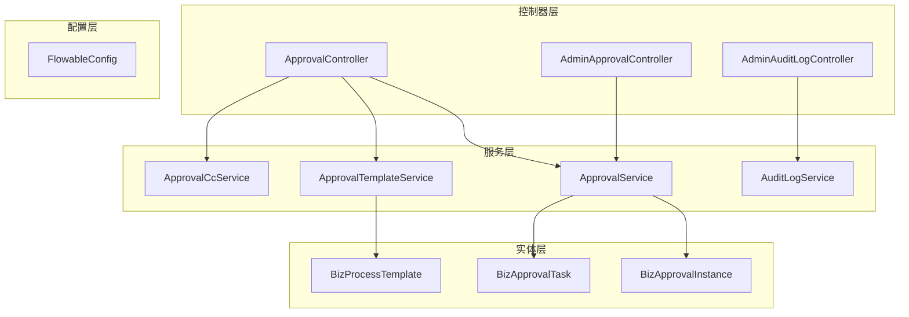
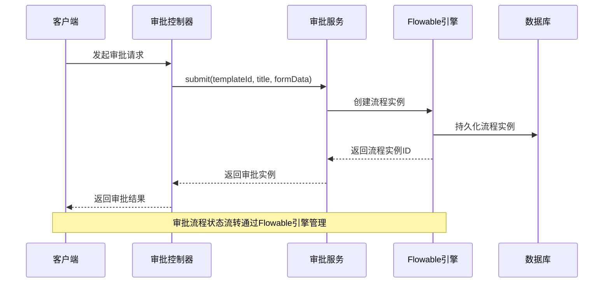
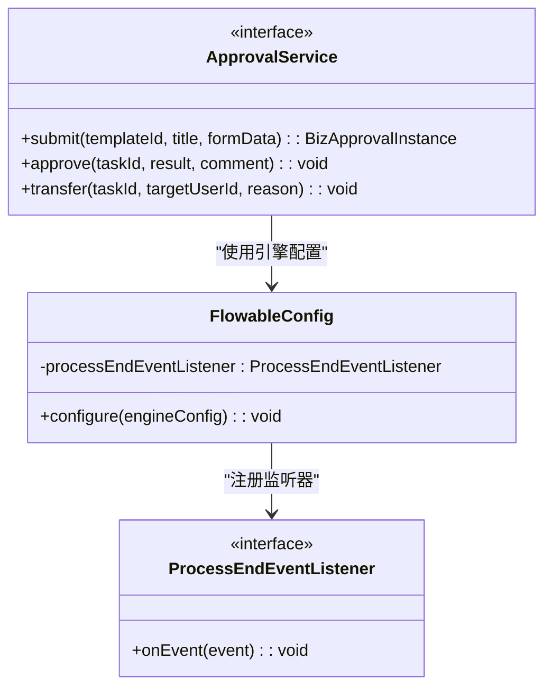
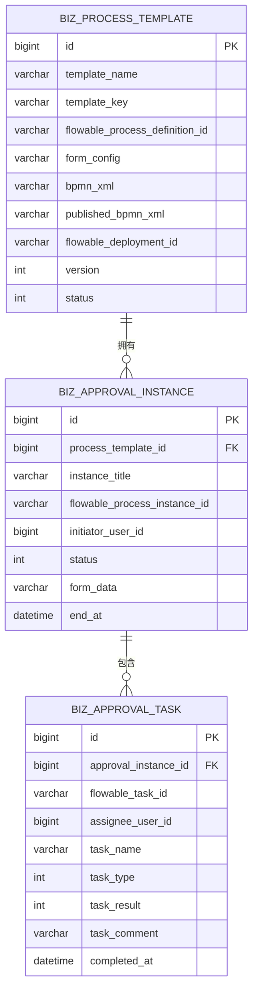

# 审批工作流API

<cite>
**本文档引用的文件**
- [ApprovalController.java](file://oa-approval/src/main/java/com/oa/admin/approval/controller/ApprovalController.java)
- [AdminApprovalController.java](file://oa-approval/src/main/java/com/oa/admin/approval/controller/AdminApprovalController.java)
- [AdminAuditLogController.java](file://oa-approval/src/main/java/com/oa/admin/approval/controller/AdminAuditLogController.java)
- [ApprovalService.java](file://oa-approval/src/main/java/com/oa/admin/approval/service/ApprovalService.java)
- [ApprovalTemplateService.java](file://oa-approval/src/main/java/com/oa/admin/approval/service/ApprovalTemplateService.java)
- [AuditLogService.java](file://oa-approval/src/main/java/com/oa/admin/approval/service/AuditLogService.java)
- [ApprovalCcService.java](file://oa-approval/src/main/java/com/oa/admin/approval/service/ApprovalCcService.java)
- [BizProcessTemplate.java](file://oa-approval/src/main/java/com/oa/admin/approval/entity/BizProcessTemplate.java)
- [BizApprovalInstance.java](file://oa-approval/src/main/java/com/oa/admin/approval/entity/BizApprovalInstance.java)
- [BizApprovalTask.java](file://oa-approval/src/main/java/com/oa/admin/approval/entity/BizApprovalTask.java)
- [TaskVO.java](file://oa-approval/src/main/java/com/oa/admin/approval/dto/TaskVO.java)
- [InstanceVO.java](file://oa-approval/src/main/java/com/oa/admin/approval/dto/InstanceVO.java)
- [FlowableConfig.java](file://oa-approval/src/main/java/com/oa/admin/approval/config/FlowableConfig.java)
- [approval.ts](file://oa-ui/src/api/approval.ts)
- [ApprovalInstanceStatus.java](file://oa-approval/src/main/java/com/oa/admin/approval/enums/ApprovalInstanceStatus.java)
</cite>

## 目录
1. [简介](#简介)
2. [项目结构](#项目结构)
3. [核心组件](#核心组件)
4. [架构概览](#架构概览)
5. [详细组件分析](#详细组件分析)
6. [依赖分析](#依赖分析)
7. [性能考虑](#性能考虑)
8. [故障排除指南](#故障排除指南)
9. [结论](#结论)
10. [附录](#附录)

## 简介
本文件为审批工作流模块的完整API接口文档，涵盖审批流程管理、任务处理、模板配置、审计日志等审批相关接口。文档详细说明了发起审批、我的申请、我的待办、我的已办、抄送管理等功能接口，并提供审批流程的状态流转、任务分配、审批意见等业务逻辑的API实现。同时说明了Flowable工作流引擎的集成方式和流程定义的API操作，以及审批模板的创建、修改、发布等管理接口。

## 项目结构
审批工作流模块采用分层架构设计，主要包含以下层次：
- 控制器层：处理HTTP请求和响应
- 服务层：实现业务逻辑和工作流操作
- 数据访问层：处理数据库交互
- 实体层：定义数据模型和枚举
- DTO层：定义数据传输对象
- 配置层：集成Flowable工作流引擎



**图表来源**
- [ApprovalController.java:29-32](file://oa-approval/src/main/java/com/oa/admin/approval/controller/ApprovalController.java#L29-L32)
- [AdminApprovalController.java:15-18](file://oa-approval/src/main/java/com/oa/admin/approval/controller/AdminApprovalController.java#L15-L18)
- [AdminAuditLogController.java:14-17](file://oa-approval/src/main/java/com/oa/admin/approval/controller/AdminAuditLogController.java#L14-L17)

**章节来源**
- [ApprovalController.java:1-252](file://oa-approval/src/main/java/com/oa/admin/approval/controller/ApprovalController.java#L1-L252)
- [AdminApprovalController.java:1-56](file://oa-approval/src/main/java/com/oa/admin/approval/controller/AdminApprovalController.java#L1-L56)
- [AdminAuditLogController.java:1-35](file://oa-approval/src/main/java/com/oa/admin/approval/controller/AdminAuditLogController.java#L1-L35)

## 核心组件
审批工作流模块的核心组件包括：

### 控制器组件
- **ApprovalController**：主要审批功能控制器，处理用户相关的审批操作
- **AdminApprovalController**：管理员审批功能控制器，处理后台管理操作
- **AdminAuditLogController**：审计日志控制器，处理审计日志查询

### 服务组件
- **ApprovalService**：审批服务接口，定义所有审批相关的业务方法
- **ApprovalTemplateService**：审批模板服务接口，处理流程模板管理
- **ApprovalCcService**：抄送服务接口，处理抄送相关功能
- **AuditLogService**：审计日志服务接口，处理审计日志记录和查询

### 数据模型组件
- **BizProcessTemplate**：流程模板实体，存储流程定义和配置
- **BizApprovalInstance**：审批实例实体，表示具体的审批流程实例
- **BizApprovalTask**：审批任务实体，表示审批流程中的具体任务

**章节来源**
- [ApprovalService.java:18-56](file://oa-approval/src/main/java/com/oa/admin/approval/service/ApprovalService.java#L18-L56)
- [ApprovalTemplateService.java:13-32](file://oa-approval/src/main/java/com/oa/admin/approval/service/ApprovalTemplateService.java#L13-L32)
- [BizProcessTemplate.java:13-28](file://oa-approval/src/main/java/com/oa/admin/approval/entity/BizProcessTemplate.java#L13-L28)
- [BizApprovalInstance.java:16-32](file://oa-approval/src/main/java/com/oa/admin/approval/entity/BizApprovalInstance.java#L16-L32)
- [BizApprovalTask.java:16-34](file://oa-approval/src/main/java/com/oa/admin/approval/entity/BizApprovalTask.java#L16-L34)

## 架构概览
审批工作流系统采用RESTful API设计，通过Spring Boot框架提供HTTP接口，集成Flowable工作流引擎进行流程管理和执行。



**图表来源**
- [ApprovalController.java:37-44](file://oa-approval/src/main/java/com/oa/admin/approval/controller/ApprovalController.java#L37-L44)
- [ApprovalService.java:20](file://oa-approval/src/main/java/com/oa/admin/approval/service/ApprovalService.java#L20)

**章节来源**
- [FlowableConfig.java:15-30](file://oa-approval/src/main/java/com/oa/admin/approval/config/FlowableConfig.java#L15-L30)

## 详细组件分析

### 审批控制器API

#### 发起审批接口
- **POST /api/v1/approval/submit**
- 权限：approval:submit
- 请求参数：
  - templateId: 流程模板ID（必填）
  - title: 审批标题（必填）
  - formData: 表单数据（必填）
- 响应：返回创建的审批实例信息

#### 我的任务接口
- **GET /api/v1/approval/my-todo**
- 权限：approval:todo
- 功能：获取当前用户的待办任务列表
- 响应：返回任务列表

- **GET /api/v1/approval/my-done**
- 权限：approval:done
- 功能：获取当前用户的已办任务列表
- 响应：返回任务列表

#### 分页查询接口
- **GET /api/v1/approval/my-todo/paged**
- 权限：approval:todo
- 参数：title（可选）、page（默认1）、pageSize（默认10）
- 响应：返回分页的任务列表

- **GET /api/v1/approval/my-done/paged**
- 权限：approval:done
- 参数：title（可选）、page（默认1）、pageSize（默认10）
- 响应：返回分页的任务列表

#### 任务处理接口
- **POST /api/v1/approval/task/{taskId}/approve**
- 权限：approval:approve
- 参数：result（审批结果）、comment（审批意见）
- 功能：处理审批任务

- **POST /api/v1/approval/task/{taskId}/transfer**
- 权限：approval:approve
- 参数：targetUserId（转交目标用户ID）、reason（转交原因）
- 功能：转交审批任务

#### 申请管理接口
- **POST /api/v1/approval/{instanceId}/withdraw**
- 权限：approval:withdraw
- 功能：撤销审批申请

- **GET /api/v1/approval/my-applications**
- 权限：approval:instance:view
- 参数：title（可选）、status（可选）、page（默认1）、pageSize（默认10）
- 功能：查询我的申请列表

#### 实例详情接口
- **GET /api/v1/approval/instance/{instanceId}**
- 权限：approval:instance:view
- 功能：获取审批实例详情

- **GET /api/v1/approval/instance/{instanceId}/tasks**
- 权限：approval:instance:view
- 功能：获取实例关联的所有任务

- **GET /api/v1/approval/instance/{instanceId}/diagram**
- 权限：approval:instance:view
- 功能：获取流程图信息

#### 仪表板接口
- **GET /api/v1/approval/dashboard/stats**
- 权限：approval:dashboard
- 功能：获取仪表板统计数据

**章节来源**
- [ApprovalController.java:37-133](file://oa-approval/src/main/java/com/oa/admin/approval/controller/ApprovalController.java#L37-L133)

### 审批模板管理API

#### 模板查询接口
- **GET /api/v1/approval/template**
- 权限：approval:template:list
- 参数：templateName（可选）、status（可选）、page（默认1）、pageSize（默认10）
- 功能：分页查询流程模板

- **GET /api/v1/approval/template/{id}**
- 权限：approval:template:list
- 功能：获取指定模板详情

#### 模板CRUD接口
- **POST /api/v1/approval/template**
- 权限：approval:template:create
- 功能：创建新的流程模板

- **PUT /api/v1/approval/template/{id}**
- 权限：approval:template:edit
- 功能：更新流程模板

- **DELETE /api/v1/approval/template/{id}**
- 权限：approval:template:delete
- 功能：删除流程模板

#### 模板发布接口
- **POST /api/v1/approval/template/{id}/publish**
- 权限：approval:template:publish
- 功能：发布流程模板

- **POST /api/v1/approval/template/{id}/new-version**
- 权限：approval:template:create
- 功能：基于现有模板创建新版本

#### BPMN XML管理接口
- **GET /api/v1/approval/template/{id}/xml**
- 权限：approval:template:edit
- 功能：获取模板的BPMN XML内容

- **PUT /api/v1/approval/template/{id}/xml**
- 权限：approval:template:edit
- 参数：bpmnXml（BPMN XML内容）
- 功能：保存模板的BPMN XML

#### 节点配置接口
- **GET /api/v1/approval/template/{id}/node-config**
- 权限：approval:template:edit
- 功能：获取节点配置信息

- **PUT /api/v1/approval/template/{id}/node-config**
- 权限：approval:template:edit
- 参数：节点配置数组
- 功能：保存节点配置

**章节来源**
- [ApprovalController.java:135-215](file://oa-approval/src/main/java/com/oa/admin/approval/controller/ApprovalController.java#L135-L215)

### 抄送管理API

#### 抄送查询接口
- **GET /api/v1/approval/cc**
- 权限：approval:cc
- 功能：获取我的抄送列表

- **POST /api/v1/approval/cc/{ccId}/read**
- 权限：approval:cc
- 功能：标记抄送为已读

**章节来源**
- [ApprovalController.java:217-228](file://oa-approval/src/main/java/com/oa/admin/approval/controller/ApprovalController.java#L217-L228)

### 管理员API

#### 实例管理接口
- **GET /api/v1/admin/approval/instances**
- 权限：admin:approval:list
- 参数：title（可选）、status（可选）、templateId（可选）、initiatorUserId（可选）、startTime（可选）、endTime（可选）、page（默认1）、pageSize（默认10）
- 功能：查询所有审批实例

- **POST /api/v1/admin/approval/instances/{instanceId}/terminate**
- 权限：admin:approval:terminate
- 功能：终止审批实例

#### 任务重分配接口
- **POST /api/v1/admin/approval/tasks/{taskId}/reassign**
- 权限：admin:approval:reassign
- 参数：targetUserId（目标用户ID）
- 功能：重新分配任务

#### 统计指标接口
- **GET /api/v1/admin/approval/metrics**
- 权限：admin:approval:list
- 功能：获取审批统计指标

**章节来源**
- [AdminApprovalController.java:21-54](file://oa-approval/src/main/java/com/oa/admin/approval/controller/AdminApprovalController.java#L21-L54)

### 审计日志API

#### 日志查询接口
- **GET /api/v1/admin/audit-log**
- 权限：admin:audit:list
- 参数：module（模块）、action（操作）、targetType（目标类型）、targetId（目标ID）、userId（用户ID）、startTime（开始时间）、endTime（结束时间）、page（默认1）、pageSize（默认10）
- 功能：查询审计日志

**章节来源**
- [AdminAuditLogController.java:20-33](file://oa-approval/src/main/java/com/oa/admin/approval/controller/AdminAuditLogController.java#L20-L33)

## 依赖分析

### Flowable集成架构
系统通过FlowableConfig类集成Flowable工作流引擎，配置事件监听器以处理流程结束事件。



**图表来源**
- [FlowableConfig.java:17-29](file://oa-approval/src/main/java/com/oa/admin/approval/config/FlowableConfig.java#L17-L29)
- [ApprovalService.java:20-55](file://oa-approval/src/main/java/com/oa/admin/approval/service/ApprovalService.java#L20-L55)

### 数据模型关系
审批工作流涉及多个实体之间的复杂关系，通过外键约束保证数据完整性。



**图表来源**
- [BizProcessTemplate.java:17-28](file://oa-approval/src/main/java/com/oa/admin/approval/entity/BizProcessTemplate.java#L17-L28)
- [BizApprovalInstance.java:20-32](file://oa-approval/src/main/java/com/oa/admin/approval/entity/BizApprovalInstance.java#L20-L32)
- [BizApprovalTask.java:21-34](file://oa-approval/src/main/java/com/oa/admin/approval/entity/BizApprovalTask.java#L21-L34)

**章节来源**
- [BizProcessTemplate.java:13-28](file://oa-approval/src/main/java/com/oa/admin/approval/entity/BizProcessTemplate.java#L13-L28)
- [BizApprovalInstance.java:16-32](file://oa-approval/src/main/java/com/oa/admin/approval/entity/BizApprovalInstance.java#L16-L32)
- [BizApprovalTask.java:16-34](file://oa-approval/src/main/java/com/oa/admin/approval/entity/BizApprovalTask.java#L16-L34)

## 性能考虑
- **分页查询**：所有列表查询接口都支持分页参数，避免大数据量查询导致的性能问题
- **权限控制**：使用Sa-Token注解进行细粒度权限控制，确保接口安全性
- **批量操作**：模板管理支持批量配置节点参数，提高配置效率
- **缓存策略**：建议对常用查询结果进行缓存，如模板配置、用户权限等

## 故障排除指南

### 常见错误处理
- **参数验证错误**：当请求参数为空或格式不正确时，会抛出业务异常
- **权限不足**：未授权用户调用受保护接口时，会返回权限错误
- **流程状态错误**：尝试对已完成或已撤销的流程执行不支持的操作

### 排查步骤
1. 检查请求参数是否符合接口要求
2. 验证用户权限是否满足接口权限需求
3. 查看流程实例状态是否允许执行相应操作
4. 检查Flowable引擎配置是否正确

**章节来源**
- [ApprovalController.java:230-250](file://oa-approval/src/main/java/com/oa/admin/approval/controller/ApprovalController.java#L230-L250)

## 结论
审批工作流模块提供了完整的审批生命周期管理功能，包括流程定义、任务处理、模板管理、审计日志等核心功能。通过RESTful API设计和Flowable工作流引擎集成，系统能够灵活支持各种复杂的审批场景。模块化的架构设计使得功能扩展和维护变得简单高效。

## 附录

### API使用示例

#### 发起审批流程
```javascript
// 前端调用示例
import { submitApproval } from '@/api/approval'

const response = await submitApproval({
  templateId: 1,
  title: '请假申请',
  formData: JSON.stringify({
    leaveType: 'annual',
    startDate: '2024-01-15',
    endDate: '2024-01-17'
  })
})
```

#### 处理审批任务
```javascript
// 前端调用示例
import { approveTask } from '@/api/approval'

await approveTask(123, {
  result: 1, // 1表示同意，2表示拒绝
  comment: '审批通过'
})
```

### 审批状态枚举
- **PENDING(1)**: 待处理
- **APPROVED(2)**: 已批准
- **REJECTED(3)**: 已拒绝
- **WITHDRAWN(4)**: 已撤回
- **CANCELLED(5)**: 已取消

**章节来源**
- [ApprovalInstanceStatus.java:11-28](file://oa-approval/src/main/java/com/oa/admin/approval/enums/ApprovalInstanceStatus.java#L11-L28)
- [approval.ts:4-70](file://oa-ui/src/api/approval.ts#L4-L70)