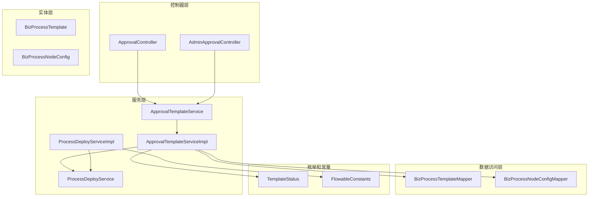
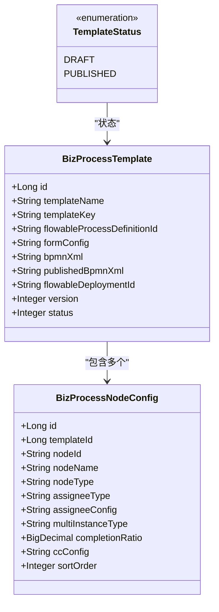
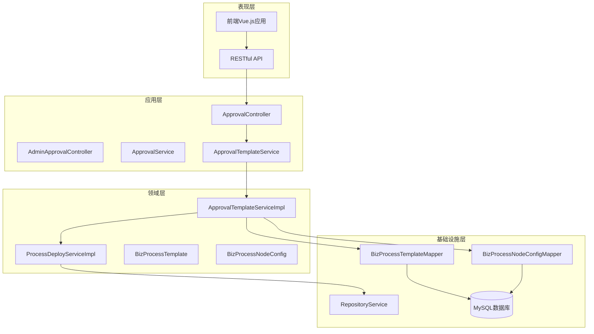
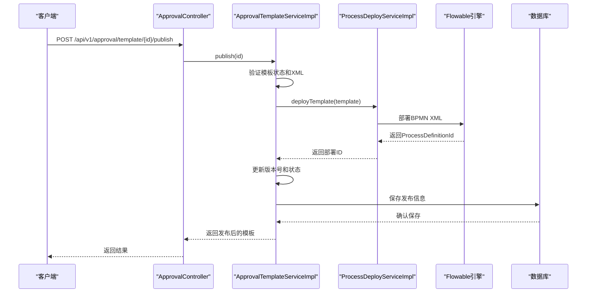
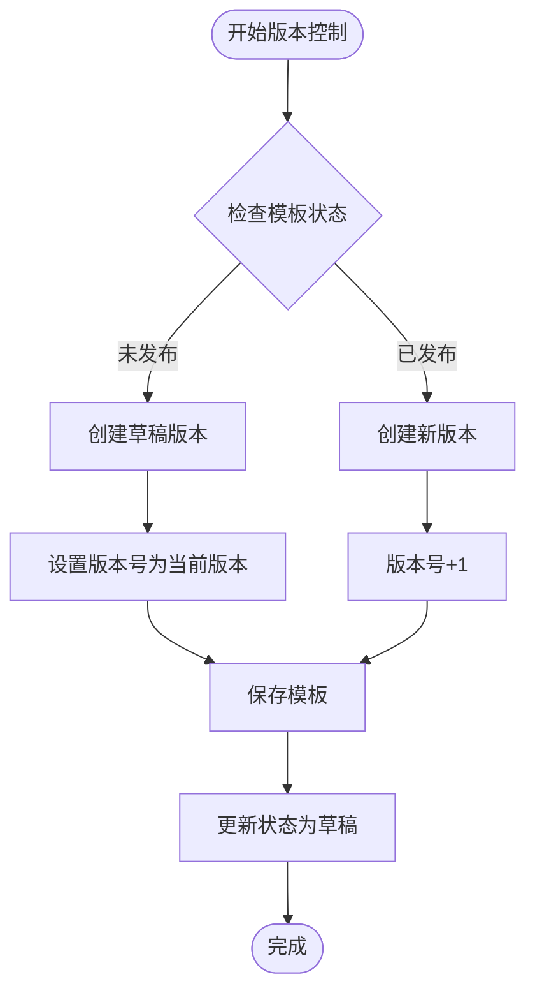
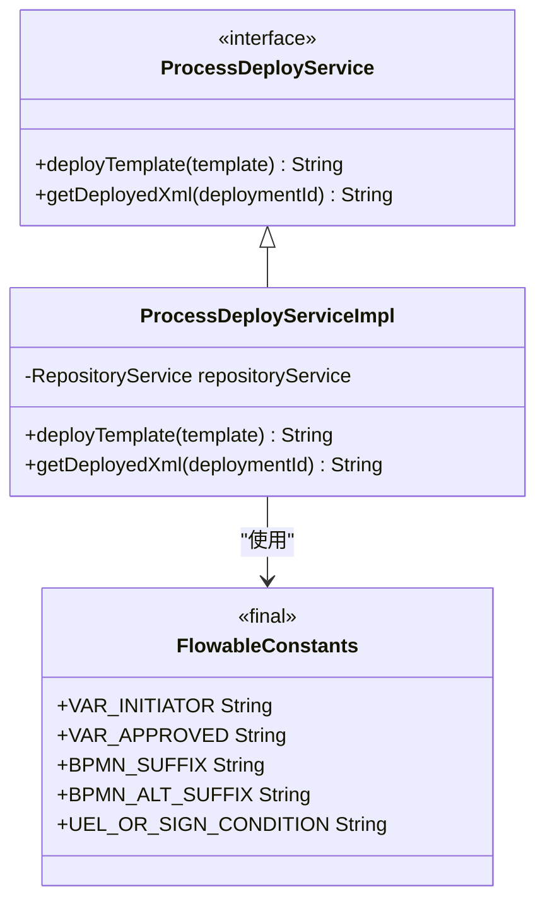
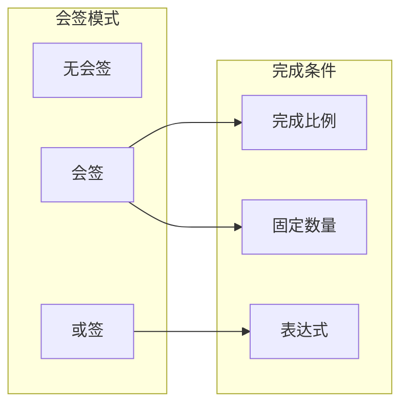
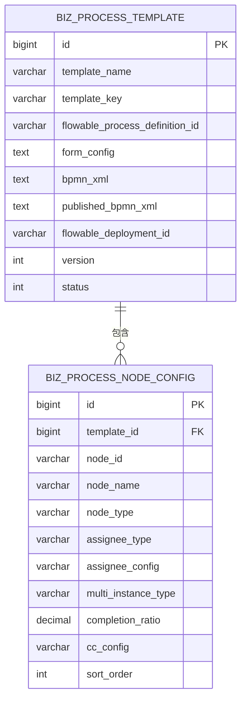
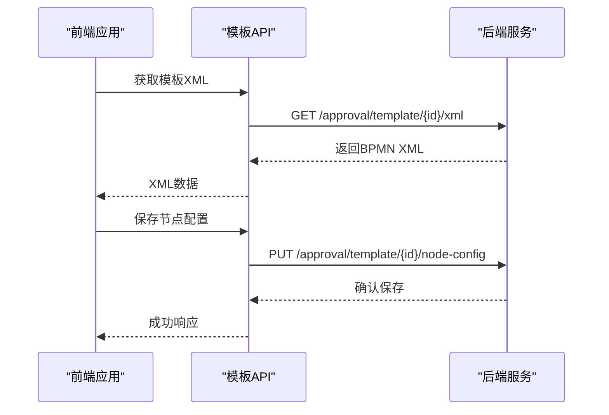

# 审批模板管理

<cite>
**本文档引用的文件**
- [ApprovalController.java](file://oa-approval/src/main/java/com/oa/admin/approval/controller/ApprovalController.java)
- [AdminApprovalController.java](file://oa-approval/src/main/java/com/oa/admin/approval/controller/AdminApprovalController.java)
- [ApprovalTemplateServiceImpl.java](file://oa-approval/src/main/java/com/oa/admin/approval/service/impl/ApprovalTemplateServiceImpl.java)
- [ProcessDeployServiceImpl.java](file://oa-approval/src/main/java/com/oa/admin/approval/service/impl/ProcessDeployServiceImpl.java)
- [BizProcessTemplate.java](file://oa-approval/src/main/java/com/oa/admin/approval/entity/BizProcessTemplate.java)
- [BizProcessNodeConfig.java](file://oa-approval/src/main/java/com/oa/admin/approval/entity/BizProcessNodeConfig.java)
- [TemplateStatus.java](file://oa-approval/src/main/java/com/oa/admin/approval/enums/TemplateStatus.java)
- [FlowableConstants.java](file://oa-approval/src/main/java/com/oa/admin/approval/constant/FlowableConstants.java)
- [BizProcessTemplateMapper.java](file://oa-approval/src/main/java/com/oa/admin/approval/mapper/BizProcessTemplateMapper.java)
- [BizProcessNodeConfigMapper.java](file://oa-approval/src/main/java/com/oa/admin/approval/mapper/BizProcessNodeConfigMapper.java)
- [ProcessDeployService.java](file://oa-approval/src/main/java/com/oa/admin/approval/service/ProcessDeployService.java)
- [ApprovalTemplateService.java](file://oa-approval/src/main/java/com/oa/admin/approval/service/ApprovalTemplateService.java)
- [template.ts](file://oa-ui/src/api/template.ts)
- [V12__leave_template_bpmn_diagram.sql](file://oa-app/src/main/resources/db/migration/V12__leave_template_bpmn_diagram.sql)
</cite>

## 目录
1. [简介](#简介)
2. [项目结构](#项目结构)
3. [核心组件](#核心组件)
4. [架构概览](#架构概览)
5. [详细组件分析](#详细组件分析)
6. [依赖关系分析](#依赖关系分析)
7. [性能考虑](#性能考虑)
8. [故障排除指南](#故障排除指南)
9. [结论](#结论)
10. [附录](#附录)

## 简介

审批模板管理系统是基于Flowable工作流引擎的企业级审批平台的核心组成部分。该系统提供了完整的审批模板生命周期管理功能，包括模板的创建、查询、更新、删除、发布、版本控制以及BPMN XML配置和节点配置管理。

系统采用前后端分离架构，后端使用Spring Boot + MyBatis-Plus + Flowable技术栈，前端使用Vue.js + TypeScript构建用户界面。通过严格的权限控制和业务约束，确保审批流程的安全性和可靠性。

## 项目结构

审批模板管理模块位于`oa-approval`子项目中，主要包含以下层次结构：



**图表来源**
- [ApprovalController.java:1-252](file://oa-approval/src/main/java/com/oa/admin/approval/controller/ApprovalController.java#L1-L252)
- [ApprovalTemplateServiceImpl.java:1-163](file://oa-approval/src/main/java/com/oa/admin/approval/service/impl/ApprovalTemplateServiceImpl.java#L1-L163)
- [ProcessDeployServiceImpl.java:1-82](file://oa-approval/src/main/java/com/oa/admin/approval/service/impl/ProcessDeployServiceImpl.java#L1-L82)

**章节来源**
- [ApprovalController.java:1-252](file://oa-approval/src/main/java/com/oa/admin/approval/controller/ApprovalController.java#L1-L252)
- [ApprovalTemplateServiceImpl.java:1-163](file://oa-approval/src/main/java/com/oa/admin/approval/service/impl/ApprovalTemplateServiceImpl.java#L1-L163)

## 核心组件

### 审批模板实体模型

审批模板系统的核心数据模型由两个主要实体组成：



**图表来源**
- [BizProcessTemplate.java:1-29](file://oa-approval/src/main/java/com/oa/admin/approval/entity/BizProcessTemplate.java#L1-L29)
- [BizProcessNodeConfig.java:1-37](file://oa-approval/src/main/java/com/oa/admin/approval/entity/BizProcessNodeConfig.java#L1-L37)
- [TemplateStatus.java:1-26](file://oa-approval/src/main/java/com/oa/admin/approval/enums/TemplateStatus.java#L1-L26)

### 权限控制机制

系统采用基于Sa-Token的权限控制框架，通过注解方式实现细粒度的权限管理：

| 权限标识 | 功能描述 | 控制器方法 |
|---------|---------|-----------|
| approval:template:list | 模板列表查看 | GET /api/v1/approval/template |
| approval:template:create | 模板创建 | POST /api/v1/approval/template |
| approval:template:edit | 模板编辑 | PUT /api/v1/approval/template/{id} |
| approval:template:delete | 模板删除 | DELETE /api/v1/approval/template/{id} |
| approval:template:publish | 模板发布 | POST /api/v1/approval/template/{id}/publish |
| approval:template:version | 版本管理 | POST /api/v1/approval/template/{id}/new-version |

**章节来源**
- [ApprovalController.java:135-179](file://oa-approval/src/main/java/com/oa/admin/approval/controller/ApprovalController.java#L135-L179)
- [AdminApprovalController.java:21-54](file://oa-approval/src/main/java/com/oa/admin/approval/controller/AdminApprovalController.java#L21-L54)

## 架构概览

审批模板管理采用经典的三层架构设计，结合领域驱动设计原则：



**图表来源**
- [ApprovalController.java:29-252](file://oa-approval/src/main/java/com/oa/admin/approval/controller/ApprovalController.java#L29-L252)
- [ApprovalTemplateServiceImpl.java:25-163](file://oa-approval/src/main/java/com/oa/admin/approval/service/impl/ApprovalTemplateServiceImpl.java#L25-L163)
- [ProcessDeployServiceImpl.java:21-82](file://oa-approval/src/main/java/com/oa/admin/approval/service/impl/ProcessDeployServiceImpl.java#L21-L82)

## 详细组件分析

### 审批模板服务实现

#### 发布流程处理

发布流程是模板管理的核心功能，涉及BPMN XML验证、Flowable部署和版本控制：



**图表来源**
- [ApprovalController.java:175-179](file://oa-approval/src/main/java/com/oa/admin/approval/controller/ApprovalController.java#L175-L179)
- [ApprovalTemplateServiceImpl.java:58-81](file://oa-approval/src/main/java/com/oa/admin/approval/service/impl/ApprovalTemplateServiceImpl.java#L58-L81)
- [ProcessDeployServiceImpl.java:28-58](file://oa-approval/src/main/java/com/oa/admin/approval/service/impl/ProcessDeployServiceImpl.java#L28-L58)

#### 版本控制机制

系统支持模板的版本管理，通过自动递增版本号实现：



**图表来源**
- [ApprovalTemplateServiceImpl.java:83-104](file://oa-approval/src/main/java/com/oa/admin/approval/service/impl/ApprovalTemplateServiceImpl.java#L83-L104)

**章节来源**
- [ApprovalTemplateServiceImpl.java:1-163](file://oa-approval/src/main/java/com/oa/admin/approval/service/impl/ApprovalTemplateServiceImpl.java#L1-L163)

### BPMN XML配置管理

#### XML存储策略

系统采用双XML存储策略，确保发布前后的XML版本分离：

| 存储字段 | 用途 | 数据类型 | 约束 |
|---------|------|---------|------|
| bpmnXml | 草稿XML | TEXT | 可为空 |
| publishedBpmnXml | 已发布XML | TEXT | 发布时复制 |

#### Flowable集成



**图表来源**
- [ProcessDeployService.java:1-14](file://oa-approval/src/main/java/com/oa/admin/approval/service/ProcessDeployService.java#L1-L14)
- [ProcessDeployServiceImpl.java:1-82](file://oa-approval/src/main/java/com/oa/admin/approval/service/impl/ProcessDeployServiceImpl.java#L1-L82)
- [FlowableConstants.java:1-16](file://oa-approval/src/main/java/com/oa/admin/approval/constant/FlowableConstants.java#L1-L16)

**章节来源**
- [ProcessDeployServiceImpl.java:1-82](file://oa-approval/src/main/java/com/oa/admin/approval/service/impl/ProcessDeployServiceImpl.java#L1-L82)
- [FlowableConstants.java:1-16](file://oa-approval/src/main/java/com/oa/admin/approval/constant/FlowableConstants.java#L1-L16)

### 节点配置管理

#### 节点类型支持

系统支持多种Flowable节点类型的配置：

| 节点类型 | 描述 | 典型用途 |
|---------|------|---------|
| userTask | 用户任务 | 审批节点 |
| exclusiveGateway | 排他网关 | 条件分支 |
| parallelGateway | 并行网关 | 并行处理 |
| startEvent | 开始事件 | 流程启动 |
| endEvent | 结束事件 | 流程结束 |

#### 会签配置

系统支持三种会签模式：



**图表来源**
- [BizProcessNodeConfig.java:24-35](file://oa-approval/src/main/java/com/oa/admin/approval/entity/BizProcessNodeConfig.java#L24-L35)

**章节来源**
- [BizProcessNodeConfig.java:1-37](file://oa-approval/src/main/java/com/oa/admin/approval/entity/BizProcessNodeConfig.java#L1-L37)

## 依赖关系分析

### 数据模型依赖



**图表来源**
- [BizProcessTemplate.java:13-28](file://oa-approval/src/main/java/com/oa/admin/approval/entity/BizProcessTemplate.java#L13-L28)
- [BizProcessNodeConfig.java:15-36](file://oa-approval/src/main/java/com/oa/admin/approval/entity/BizProcessNodeConfig.java#L15-L36)

### 前端API映射

前端通过统一的API接口与后端交互：



**图表来源**
- [template.ts:16-30](file://oa-ui/src/api/template.ts#L16-L30)
- [ApprovalController.java:182-209](file://oa-approval/src/main/java/com/oa/admin/approval/controller/ApprovalController.java#L182-L209)

**章节来源**
- [template.ts:1-51](file://oa-ui/src/api/template.ts#L1-L51)

## 性能考虑

### 查询优化

1. **分页查询**：所有列表查询都支持分页参数，避免大数据集加载
2. **索引设计**：模板名称和状态字段建立适当索引
3. **批量操作**：节点配置采用批量插入优化

### 缓存策略

1. **Flowable缓存**：利用Flowable引擎的内置缓存机制
2. **数据库连接池**：配置合理的连接池大小
3. **Redis缓存**：可扩展的Redis缓存方案用于热点数据

### 并发控制

1. **事务管理**：关键操作使用@Transactional注解确保数据一致性
2. **乐观锁**：版本号字段支持并发更新控制
3. **分布式锁**：高并发场景下可引入分布式锁

## 故障排除指南

### 常见错误及解决方案

| 错误类型 | 错误码 | 触发条件 | 解决方案 |
|---------|--------|---------|---------|
| 模板未找到 | TEMPLATE_NOT_FOUND | 模板ID不存在 | 检查模板ID有效性 |
| 模板已发布 | TEMPLATE_ALREADY_PUBLISHED | 尝试修改已发布模板 | 创建新版本再修改 |
| BPMN XML无效 | BPMN_XML_INVALID | XML格式不正确 | 使用标准BPMN格式 |
| 参数错误 | PARAM_ERROR | 请求参数缺失或格式错误 | 检查请求体格式 |

### 调试建议

1. **日志监控**：启用详细的业务日志记录
2. **异常捕获**：统一异常处理机制
3. **状态检查**：定期检查模板状态一致性

**章节来源**
- [ApprovalTemplateServiceImpl.java:42-78](file://oa-approval/src/main/java/com/oa/admin/approval/service/impl/ApprovalTemplateServiceImpl.java#L42-L78)

## 结论

审批模板管理系统提供了完整的企业级审批流程管理能力。通过清晰的分层架构、严格的权限控制和完善的业务约束，确保了系统的安全性、可靠性和可维护性。

系统的主要优势包括：
- 完整的模板生命周期管理
- 灵活的BPMN XML配置支持
- 强大的版本控制机制
- 细粒度的权限控制
- 良好的扩展性设计

未来可以考虑的功能增强：
- 模板导入导出功能
- 流程模拟和预演
- 更丰富的报表统计
- 移动端适配优化

## 附录

### API接口规范

#### 模板CRUD接口

| 方法 | 路径 | 权限 | 描述 |
|------|------|------|------|
| GET | /api/v1/approval/template | approval:template:list | 获取模板列表 |
| GET | /api/v1/approval/template/{id} | approval:template:list | 获取模板详情 |
| POST | /api/v1/approval/template | approval:template:create | 创建模板 |
| PUT | /api/v1/approval/template/{id} | approval:template:edit | 更新模板 |
| DELETE | /api/v1/approval/template/{id} | approval:template:delete | 删除模板 |

#### 模板发布接口

| 方法 | 路径 | 权限 | 描述 |
|------|------|------|------|
| POST | /api/v1/approval/template/{id}/publish | approval:template:publish | 发布模板 |
| POST | /api/v1/approval/template/{id}/new-version | approval:template:create | 创建新版本 |

#### XML和节点配置接口

| 方法 | 路径 | 权限 | 描述 |
|------|------|------|------|
| GET | /api/v1/approval/template/{id}/xml | approval:template:edit | 获取模板XML |
| PUT | /api/v1/approval/template/{id}/xml | approval:template:edit | 保存模板XML |
| GET | /api/v1/approval/template/{id}/node-config | approval:template:edit | 获取节点配置 |
| PUT | /api/v1/approval/template/{id}/node-config | approval:template:edit | 保存节点配置 |

### 数据库迁移脚本

系统包含完整的数据库迁移脚本，支持BPMN图形渲染的DI信息添加：

```sql
-- 为请假模板添加BPMN DI信息
UPDATE biz_process_template
SET bpmn_xml = REPLACE(
    REPLACE(
        bpmn_xml,
        '<definitions xmlns=',
        '<definitions xmlns:bpmndi="http://www.omg.org/spec/BPMN/20100524/DI"
         xmlns:omgdc="http://www.omg.org/spec/DD/20100524/DC"
         xmlns:omgdi="http://www.omg.org/spec/DD/20100524/DI"
         xmlns='
    ),
    '</definitions>',
    '
  <bpmndi:BPMNDiagram id="BPMNDiagram_leave_request">
    <bpmndi:BPMNPlane id="BPMNPlane_leave_request" bpmnElement="leave_request">
      <bpmndi:BPMNShape id="BPMNShape_start" bpmnElement="start">
        <omgdc:Bounds x="120" y="160" width="36" height="36"/>
      </bpmndi:BPMNShape>
      <bpmndi:BPMNShape id="BPMNShape_deptLeaderApprove" bpmnElement="deptLeaderApprove">
        <omgdc:Bounds x="240" y="138" width="120" height="80"/>
      </bpmndi:BPMNShape>
      <bpmndi:BPMNShape id="BPMNShape_gateway1" bpmnElement="gateway1" isMarkerVisible="true">
        <omgdc:Bounds x="430" y="153" width="50" height="50"/>
      </bpmndi:BPMNShape>
      <bpmndi:BPMNShape id="BPMNShape_endApproved" bpmnElement="endApproved">
        <omgdc:Bounds x="560" y="90" width="36" height="36"/>
      </bpmndi:BPMNShape>
      <bpmndi:BPMNShape id="BPMNShape_endRejected" bpmnElement="endRejected">
        <omgdc:Bounds x="560" y="230" width="36" height="36"/>
      </bpmndi:BPMNShape>
      <bpmndi:BPMNEdge id="BPMNEdge_flow1" bpmnElement="flow1">
        <omgdi:waypoint x="156" y="178"/>
        <omgdi:waypoint x="240" y="178"/>
      </bpmndi:BPMNEdge>
      <bpmndi:BPMNEdge id="BPMNEdge_flow2" bpmnElement="flow2">
        <omgdi:waypoint x="360" y="178"/>
        <omgdi:waypoint x="430" y="178"/>
      </bpmndi:BPMNEdge>
      <bpmndi:BPMNEdge id="BPMNEdge_flowApproved" bpmnElement="flowApproved">
        <omgdi:waypoint x="455" y="153"/>
        <omgdi:waypoint x="455" y="108"/>
        <omgdi:waypoint x="560" y="108"/>
      </bpmndi:BPMNEdge>
      <bpmndi:BPMNEdge id="BPMNEdge_flowRejected" bpmnElement="flowRejected">
        <omgdi:waypoint x="455" y="203"/>
        <omgdi:waypoint x="455" y="248"/>
        <omgdi:waypoint x="560" y="248"/>
      </bpmndi:BPMNEdge>
    </bpmndi:BPMNPlane>
  </bpmndi:BPMNDiagram>
</definitions>'
),
published_bpmn_xml = REPLACE(
    REPLACE(
        published_bpmn_xml,
        '<definitions xmlns=',
        '<definitions xmlns:bpmndi="http://www.omg.org/spec/BPMN/20100524/DI"
         xmlns:omgdc="http://www.omg.org/spec/DD/20100524/DC"
         xmlns:omgdi="http://www.omg.org/spec/DD/20100524/DI"
         xmlns='
    ),
    '</definitions>',
    '
  <bpmndi:BPMNDiagram id="BPMNDiagram_leave_request">
    <bpmndi:BPMNPlane id="BPMNPlane_leave_request" bpmnElement="leave_request">
      <bpmndi:BPMNShape id="BPMNShape_start" bpmnElement="start">
        <omgdc:Bounds x="120" y="160" width="36" height="36"/>
      </bpmndi:BPMNShape>
      <bpmndi:BPMNShape id="BPMNShape_deptLeaderApprove" bpmnElement="deptLeaderApprove">
        <omgdc:Bounds x="240" y="138" width="120" height="80"/>
      </bpmndi:BPMNShape>
      <bpmndi:BPMNShape id="BPMNShape_gateway1" bpmnElement="gateway1" isMarkerVisible="true">
        <omgdc:Bounds x="430" y="153" width="50" height="50"/>
      </bpmndi:BPMNShape>
      <bpmndi:BPMNShape id="BPMNShape_endApproved" bpmnElement="endApproved">
        <omgdc:Bounds x="560" y="90" width="36" height="36"/>
      </bpmndi:BPMNShape>
      <bpmndi:BPMNShape id="BPMNShape_endRejected" bpmnElement="endRejected">
        <omgdc:Bounds x="560" y="230" width="36" height="36"/>
      </bpmndi:BPMNShape>
      <bpmndi:BPMNEdge id="BPMNEdge_flow1" bpmnElement="flow1">
        <omgdi:waypoint x="156" y="178"/>
        <omgdi:waypoint x="240" y="178"/>
      </bpmndi:BPMNEdge>
      <bpmndi:BPMNEdge id="BPMNEdge_flow2" bpmnElement="flow2">
        <omgdi:waypoint x="360" y="178"/>
        <omgdi:waypoint x="430" y="178"/>
      </bpmndi:BPMNEdge>
      <bpmndi:BPMNEdge id="BPMNEdge_flowApproved" bpmnElement="flowApproved">
        <omgdi:waypoint x="455" y="153"/>
        <omgdi:waypoint x="455" y="108"/>
        <omgdi:waypoint x="560" y="108"/>
      </bpmndi:BPMNEdge>
      <bpmndi:BPMNEdge id="BPMNEdge_flowRejected" bpmnElement="flowRejected">
        <omgdi:waypoint x="455" y="203"/>
        <omgdi:waypoint x="455" y="248"/>
        <omgdi:waypoint x="560" y="248"/>
      </bpmndi:BPMNEdge>
    </bpmndi:BPMNPlane>
  </bpmndi:BPMNDiagram>
</definitions>'
)
WHERE template_key = 'leave_request';
```

**章节来源**
- [V12__leave_template_bpmn_diagram.sql:1-108](file://oa-app/src/main/resources/db/migration/V12__leave_template_bpmn_diagram.sql#L1-L108)