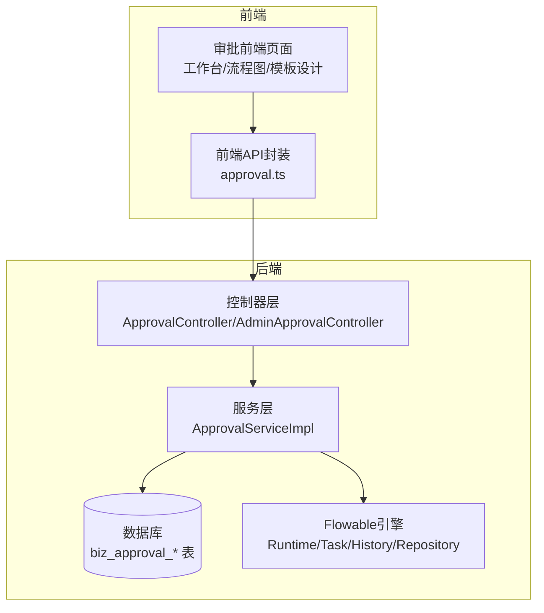
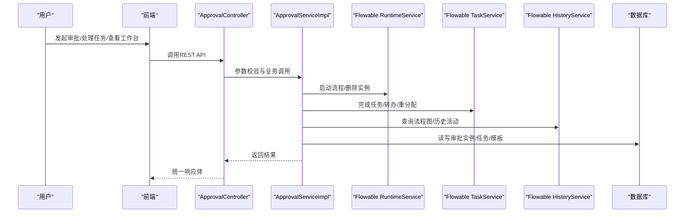
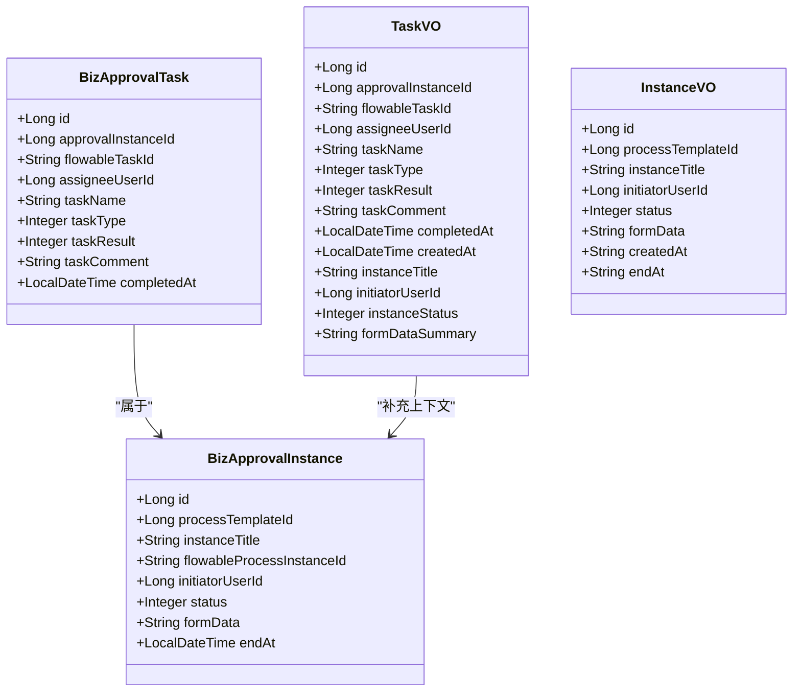
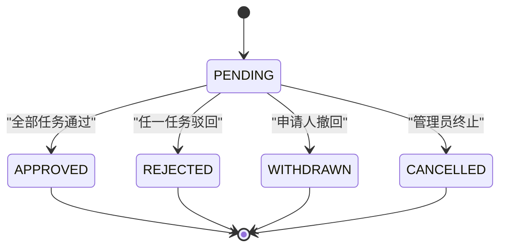
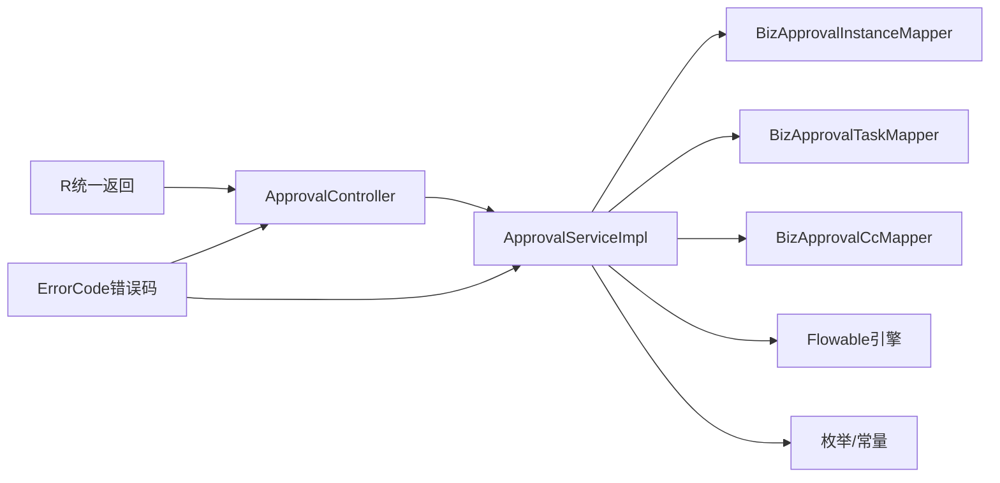

# 审批流程管理

<cite>
**本文引用的文件**
- [ApprovalController.java](file://oa-approval/src/main/java/com/oa/admin/approval/controller/ApprovalController.java)
- [AdminApprovalController.java](file://oa-approval/src/main/java/com/oa/admin/approval/controller/AdminApprovalController.java)
- [ApprovalServiceImpl.java](file://oa-approval/src/main/java/com/oa/admin/approval/service/impl/ApprovalServiceImpl.java)
- [FlowableConfig.java](file://oa-approval/src/main/java/com/oa/admin/approval/config/FlowableConfig.java)
- [BizApprovalInstance.java](file://oa-approval/src/main/java/com/oa/admin/approval/entity/BizApprovalInstance.java)
- [BizApprovalTask.java](file://oa-approval/src/main/java/com/oa/admin/approval/entity/BizApprovalTask.java)
- [ApprovalInstanceStatus.java](file://oa-approval/src/main/java/com/oa/admin/approval/enums/ApprovalInstanceStatus.java)
- [ApprovalTaskResult.java](file://oa-approval/src/main/java/com/oa/admin/approval/enums/ApprovalTaskResult.java)
- [TaskVO.java](file://oa-approval/src/main/java/com/oa/admin/approval/dto/TaskVO.java)
- [InstanceVO.java](file://oa-approval/src/main/java/com/oa/admin/approval/dto/InstanceVO.java)
- [R.java](file://oa-common/src/main/java/com/oa/admin/common/result/R.java)
- [ErrorCode.java](file://oa-common/src/main/java/com/oa/admin/common/result/ErrorCode.java)
- [leave_request.bpmn20.xml](file://oa-app/src/main/resources/processes/leave_request.bpmn20.xml)
- [approval.ts](file://oa-ui/src/api/approval.ts)
</cite>

## 目录
1. [简介](#简介)
2. [项目结构](#项目结构)
3. [核心组件](#核心组件)
4. [架构总览](#架构总览)
5. [详细组件分析](#详细组件分析)
6. [依赖分析](#依赖分析)
7. [性能考虑](#性能考虑)
8. [故障排查指南](#故障排查指南)
9. [结论](#结论)
10. [附录](#附录)

## 简介
本文件为审批流程管理API的权威技术文档，覆盖从“发起审批”到“审批完成”的完整生命周期，以及“我的待办/我的已办/我的申请”等个人工作台能力。系统基于Flowable工作流引擎实现流程编排与执行，后端采用Spring Boot + MyBatis-Plus，统一返回体与错误码体系，前端通过REST接口对接。

## 项目结构
审批模块主要由以下层次构成：
- 控制器层：对外暴露REST API，负责鉴权与参数解析
- 服务层：封装业务逻辑，协调Flowable引擎与数据库
- 数据模型：审批实例、审批任务、流程模板等实体
- 配置与监听：Flowable事件监听与流程引擎配置
- 前端API：统一的HTTP调用封装

图表来源
- [ApprovalController.java:29-252](file://oa-approval/src/main/java/com/oa/admin/approval/controller/ApprovalController.java#L29-L252)
- [AdminApprovalController.java:15-56](file://oa-approval/src/main/java/com/oa/admin/approval/controller/AdminApprovalController.java#L15-L56)
- [ApprovalServiceImpl.java:57-792](file://oa-approval/src/main/java/com/oa/admin/approval/service/impl/ApprovalServiceImpl.java#L57-L792)
- [FlowableConfig.java:15-31](file://oa-approval/src/main/java/com/oa/admin/approval/config/FlowableConfig.java#L15-L31)

章节来源
- [ApprovalController.java:29-252](file://oa-approval/src/main/java/com/oa/admin/approval/controller/ApprovalController.java#L29-L252)
- [AdminApprovalController.java:15-56](file://oa-approval/src/main/java/com/oa/admin/approval/controller/AdminApprovalController.java#L15-L56)
- [ApprovalServiceImpl.java:57-792](file://oa-approval/src/main/java/com/oa/admin/approval/service/impl/ApprovalServiceImpl.java#L57-L792)

## 核心组件
- 控制器：提供审批生命周期、个人工作台、模板管理、抄送等接口
- 服务实现：封装提交、审批、转办、撤回、终止、仪表盘统计等业务
- 实体模型：审批实例、审批任务、流程模板、节点配置、通知、审计日志
- Flowable集成：事件监听、流程部署、运行时任务、历史查询、流程图渲染
- 统一返回与错误码：R<T>统一封装，ErrorCode枚举化错误

章节来源
- [ApprovalController.java:29-252](file://oa-approval/src/main/java/com/oa/admin/approval/controller/ApprovalController.java#L29-L252)
- [ApprovalServiceImpl.java:57-792](file://oa-approval/src/main/java/com/oa/admin/approval/service/impl/ApprovalServiceImpl.java#L57-L792)
- [BizApprovalInstance.java:16-33](file://oa-approval/src/main/java/com/oa/admin/approval/entity/BizApprovalInstance.java#L16-L33)
- [BizApprovalTask.java:16-35](file://oa-approval/src/main/java/com/oa/admin/approval/entity/BizApprovalTask.java#L16-L35)
- [FlowableConfig.java:15-31](file://oa-approval/src/main/java/com/oa/admin/approval/config/FlowableConfig.java#L15-L31)
- [R.java:9-44](file://oa-common/src/main/java/com/oa/admin/common/result/R.java#L9-L44)
- [ErrorCode.java:11-45](file://oa-common/src/main/java/com/oa/admin/common/result/ErrorCode.java#L11-L45)

## 架构总览
系统采用“控制器-服务-数据-引擎”的分层架构，审批业务通过Flowable完成流程推进，同时在本地持久化审批实例与任务，确保审计与查询能力。

图表来源
- [ApprovalController.java:37-133](file://oa-approval/src/main/java/com/oa/admin/approval/controller/ApprovalController.java#L37-L133)
- [ApprovalServiceImpl.java:122-240](file://oa-approval/src/main/java/com/oa/admin/approval/service/impl/ApprovalServiceImpl.java#L122-L240)
- [R.java:9-44](file://oa-common/src/main/java/com/oa/admin/common/result/R.java#L9-L44)

## 详细组件分析

### 审批生命周期API
- 发起审批
  - 接口：POST /api/v1/approval/submit
  - 权限：approval:submit
  - 请求参数：templateId（模板ID）、title（标题）、formData（表单JSON字符串）
  - 处理流程：校验模板状态为已发布；构造流程变量（含发起人）；启动流程实例；落库审批实例
  - 响应：审批实例对象
  - 错误：模板不存在/未发布、参数错误、系统异常
- 审批任务处理
  - 接口：POST /api/v1/approval/task/{taskId}/approve
  - 权限：approval:approve
  - 请求参数：result（1通过/2驳回）、comment（意见）
  - 处理流程：校验任务存在且未处理；校验当前处理人；更新本地任务；向Flowable提交完成并传入变量；记录审计；发送通知；按节点触发抄送
  - 响应：空
  - 错误：任务不存在/已处理、非当前处理人、参数错误、系统异常
- 撤回申请
  - 接口：POST /api/v1/approval/{instanceId}/withdraw
  - 权限：approval:withdraw
  - 处理流程：校验实例存在且状态为PENDING；校验未有任务处理；更新实例状态为WITHDRAWN；删除Flowable实例；清理未处理任务
  - 响应：空
  - 错误：实例不存在、非PENDING状态、已有处理任务、无权限、系统异常
- 任务转办
  - 接口：POST /api/v1/approval/task/{taskId}/transfer
  - 权限：approval:approve
  - 请求参数：targetUserId（目标用户ID）、reason（转办原因）
  - 处理流程：校验任务未处理且当前处理人为本人；标记原任务为TRANSFERRED；新建任务给目标用户；Flowable重分配；记录审计；发送通知
  - 响应：空
  - 错误：任务不存在/已处理、非当前处理人、目标无效、参数错误、系统异常

章节来源
- [ApprovalController.java:37-99](file://oa-approval/src/main/java/com/oa/admin/approval/controller/ApprovalController.java#L37-L99)
- [ApprovalServiceImpl.java:122-307](file://oa-approval/src/main/java/com/oa/admin/approval/service/impl/ApprovalServiceImpl.java#L122-L307)
- [ApprovalServiceImpl.java:556-602](file://oa-approval/src/main/java/com/oa/admin/approval/service/impl/ApprovalServiceImpl.java#L556-L602)
- [ErrorCode.java:23-40](file://oa-common/src/main/java/com/oa/admin/common/result/ErrorCode.java#L23-L40)

### 个人工作台API
- 我的待办（列表）
  - 接口：GET /api/v1/approval/my-todo
  - 权限：approval:todo
  - 响应：当前用户的待处理任务列表
- 我的待办（分页）
  - 接口：GET /api/v1/approval/my-todo/paged
  - 权限：approval:todo
  - 查询参数：title（可选）、page、pageSize
  - 响应：分页的任务视图（TaskVO），包含实例标题、发起人、状态摘要
- 我的已办（列表）
  - 接口：GET /api/v1/approval/my-done
  - 权限：approval:done
  - 响应：当前用户的已处理任务列表
- 我的已办（分页）
  - 接口：GET /api/v1/approval/my-done/paged
  - 权限：approval:done
  - 查询参数：title（可选）、page、pageSize
  - 响应：分页的任务视图（TaskVO）
- 我的申请
  - 接口：GET /api/v1/approval/my-applications
  - 权限：approval:instance:view
  - 查询参数：title（可选）、status（可选）、page、pageSize
  - 响应：分页的审批实例列表
- 仪表盘统计
  - 接口：GET /api/v1/approval/dashboard/stats
  - 权限：approval:dashboard
  - 响应：待办数、已办数、模板数、未读抄送数、最近活动

章节来源
- [ApprovalController.java:55-133](file://oa-approval/src/main/java/com/oa/admin/approval/controller/ApprovalController.java#L55-L133)
- [ApprovalServiceImpl.java:242-262](file://oa-approval/src/main/java/com/oa/admin/approval/service/impl/ApprovalServiceImpl.java#L242-L262)
- [ApprovalServiceImpl.java:459-517](file://oa-approval/src/main/java/com/oa/admin/approval/service/impl/ApprovalServiceImpl.java#L459-L517)
- [ApprovalServiceImpl.java:416-457](file://oa-approval/src/main/java/com/oa/admin/approval/service/impl/ApprovalServiceImpl.java#L416-L457)
- [TaskVO.java:13-34](file://oa-approval/src/main/java/com/oa/admin/approval/dto/TaskVO.java#L13-L34)

### 流程实例详情与流程图
- 实例详情
  - 接口：GET /api/v1/approval/instance/{instanceId}
  - 权限：approval:instance:view
  - 响应：审批实例对象
- 实例任务列表
  - 接口：GET /api/v1/approval/instance/{instanceId}/tasks
  - 权限：approval:instance:view
  - 响应：实例下所有任务（按创建时间排序）
- 实例流程图
  - 接口：GET /api/v1/approval/instance/{instanceId}/diagram
  - 权限：approval:instance:view
  - 响应：包含BPMN XML与已完成/当前节点集合的视图对象
  - 处理：从历史查询已完成节点，从任务查询当前节点，从仓库获取流程XML并注入显示图信息

章节来源
- [ApprovalController.java:101-127](file://oa-approval/src/main/java/com/oa/admin/approval/controller/ApprovalController.java#L101-L127)
- [ApprovalServiceImpl.java:318-398](file://oa-approval/src/main/java/com/oa/admin/approval/service/impl/ApprovalServiceImpl.java#L318-L398)

### 抄送与抄送标记
- 我的抄送
  - 接口：GET /api/v1/approval/cc
  - 权限：approval:cc
  - 响应：抄送列表（含实例标题、状态、是否已读）
- 标记抄送已读
  - 接口：POST /api/v1/approval/cc/{ccId}/read
  - 权限：approval:cc
  - 响应：空

章节来源
- [ApprovalController.java:217-228](file://oa-approval/src/main/java/com/oa/admin/approval/controller/ApprovalController.java#L217-L228)

### 管理员功能
- 全局实例查询
  - 接口：GET /api/v1/admin/approval/instances
  - 权限：admin:approval:list
  - 查询参数：title、status、templateId、initiatorUserId、startTime、endTime、page、pageSize
  - 响应：分页的实例视图（InstanceVO）
- 终止实例
  - 接口：POST /api/v1/admin/approval/instances/{instanceId}/terminate
  - 权限：admin:approval:terminate
  - 处理：仅PENDING可终止；删除Flowable实例；清理未处理任务；通知发起人
- 重分配任务
  - 接口：POST /api/v1/admin/approval/tasks/{taskId}/reassign
  - 权限：admin:approval:reassign
  - 参数：targetUserId
  - 处理：直接在Flowable与本地更新任务处理人
- 管理指标
  - 接口：GET /api/v1/admin/approval/metrics
  - 权限：admin:approval:list
  - 响应：总实例数、各状态分布、平均时长、模板维度指标

章节来源
- [AdminApprovalController.java:21-54](file://oa-approval/src/main/java/com/oa/admin/approval/controller/AdminApprovalController.java#L21-L54)
- [ApprovalServiceImpl.java:619-730](file://oa-approval/src/main/java/com/oa/admin/approval/service/impl/ApprovalServiceImpl.java#L619-L730)
- [ApprovalServiceImpl.java:732-790](file://oa-approval/src/main/java/com/oa/admin/approval/service/impl/ApprovalServiceImpl.java#L732-L790)
- [InstanceVO.java:9-21](file://oa-approval/src/main/java/com/oa/admin/approval/dto/InstanceVO.java#L9-L21)

### 流程模板管理API
- 列表/详情
  - GET /api/v1/approval/template
  - GET /api/v1/approval/template/{id}
- 新增/编辑/删除
  - POST /api/v1/approval/template
  - PUT /api/v1/approval/template/{id}
  - DELETE /api/v1/approval/template/{id}
- 发布/版本
  - POST /api/v1/approval/template/{id}/publish
  - POST /api/v1/approval/template/{id}/new-version
- BPMN XML
  - GET /api/v1/approval/template/{id}/xml
  - PUT /api/v1/approval/template/{id}/xml（需提供bpmnXml字段）
- 节点配置
  - GET /api/v1/approval/template/{id}/node-config
  - PUT /api/v1/approval/template/{id}/node-config（保存节点配置列表）

章节来源
- [ApprovalController.java:135-216](file://oa-approval/src/main/java/com/oa/admin/approval/controller/ApprovalController.java#L135-L216)
- [ApprovalServiceImpl.java:122-168](file://oa-approval/src/main/java/com/oa/admin/approval/service/impl/ApprovalServiceImpl.java#L122-L168)

### Flowable集成与流程定义
- 引擎配置
  - 通过FlowableConfig注册流程结束事件监听器，扩展流程完成后的行为
- 流程定义示例
  - 提供一个可执行的请假流程定义，包含开始事件、两个审批任务与结束事件
- 流程图渲染
  - 通过历史服务与任务服务获取已完成/当前节点，结合流程XML注入显示图信息，用于前端流程图展示

章节来源
- [FlowableConfig.java:15-31](file://oa-approval/src/main/java/com/oa/admin/approval/config/FlowableConfig.java#L15-L31)
- [leave_request.bpmn20.xml:1-30](file://oa-app/src/main/resources/processes/leave_request.bpmn20.xml#L1-L30)
- [ApprovalServiceImpl.java:346-398](file://oa-approval/src/main/java/com/oa/admin/approval/service/impl/ApprovalServiceImpl.java#L346-L398)

### 数据模型与状态机
- 审批实例（BizApprovalInstance）
  - 字段：主键、模板ID、标题、Flowable实例ID、发起人、状态、表单数据、结束时间
  - 状态：PENDING、APPROVED、REJECTED、WITHDRAWN、CANCELLED
- 审批任务（BizApprovalTask）
  - 字段：主键、实例ID、Flowable任务ID、处理人、任务名、类型、结果、评论、完成时间
  - 类型：普通、会签、或签
  - 结果：批准、驳回、转办、取消
- 视图模型
  - TaskVO：在任务基础上补充实例上下文（标题、发起人、状态、摘要）
  - InstanceVO：管理员视角的实例列表项

图表来源
- [BizApprovalInstance.java:16-33](file://oa-approval/src/main/java/com/oa/admin/approval/entity/BizApprovalInstance.java#L16-L33)
- [BizApprovalTask.java:16-35](file://oa-approval/src/main/java/com/oa/admin/approval/entity/BizApprovalTask.java#L16-L35)
- [TaskVO.java:13-34](file://oa-approval/src/main/java/com/oa/admin/approval/dto/TaskVO.java#L13-L34)
- [InstanceVO.java:9-21](file://oa-approval/src/main/java/com/oa/admin/approval/dto/InstanceVO.java#L9-L21)

章节来源
- [BizApprovalInstance.java:16-33](file://oa-approval/src/main/java/com/oa/admin/approval/entity/BizApprovalInstance.java#L16-L33)
- [BizApprovalTask.java:16-35](file://oa-approval/src/main/java/com/oa/admin/approval/entity/BizApprovalTask.java#L16-L35)
- [TaskVO.java:13-34](file://oa-approval/src/main/java/com/oa/admin/approval/dto/TaskVO.java#L13-L34)
- [InstanceVO.java:9-21](file://oa-approval/src/main/java/com/oa/admin/approval/dto/InstanceVO.java#L9-L21)

### 审批状态流转机制
- 实例状态
  - PENDING → APPROVED/REJECTED/WITHDRAWN/CANCELLED
- 任务结果
  - APPROVED/REJECTED → 推进流程
  - TRANSFERRED → 生成新任务并重分配
  - CANCELLED → 清理未处理任务
- 流程图渲染
  - 通过历史活动与当前任务映射节点ID，动态高亮已完成/当前节点

图表来源
- [ApprovalInstanceStatus.java:11-28](file://oa-approval/src/main/java/com/oa/admin/approval/enums/ApprovalInstanceStatus.java#L11-L28)
- [ApprovalTaskResult.java:11-28](file://oa-approval/src/main/java/com/oa/admin/approval/enums/ApprovalTaskResult.java#L11-L28)
- [ApprovalServiceImpl.java:346-398](file://oa-approval/src/main/java/com/oa/admin/approval/service/impl/ApprovalServiceImpl.java#L346-L398)

## 依赖分析
- 控制器依赖服务层，服务层依赖Flowable引擎与数据库映射器
- 统一返回体R<T>与错误码ErrorCode贯穿全链路
- FlowableConfig注册事件监听器，增强流程结束后的业务处理

图表来源
- [ApprovalController.java:33-35](file://oa-approval/src/main/java/com/oa/admin/approval/controller/ApprovalController.java#L33-L35)
- [ApprovalServiceImpl.java:110-121](file://oa-approval/src/main/java/com/oa/admin/approval/service/impl/ApprovalServiceImpl.java#L110-L121)
- [R.java:9-44](file://oa-common/src/main/java/com/oa/admin/common/result/R.java#L9-L44)
- [ErrorCode.java:11-45](file://oa-common/src/main/java/com/oa/admin/common/result/ErrorCode.java#L11-L45)

章节来源
- [ApprovalController.java:29-252](file://oa-approval/src/main/java/com/oa/admin/approval/controller/ApprovalController.java#L29-L252)
- [ApprovalServiceImpl.java:57-792](file://oa-approval/src/main/java/com/oa/admin/approval/service/impl/ApprovalServiceImpl.java#L57-L792)
- [R.java:9-44](file://oa-common/src/main/java/com/oa/admin/common/result/R.java#L9-L44)
- [ErrorCode.java:11-45](file://oa-common/src/main/java/com/oa/admin/common/result/ErrorCode.java#L11-L45)

## 性能考虑
- 分页查询：个人工作台与管理员列表均支持分页，避免一次性加载大量数据
- 批量查询：服务端按实例ID批量查询实例以丰富任务上下文，减少多次查询
- 历史与实时分离：流程图渲染分别查询历史活动与当前任务，降低复杂度
- 事务边界：提交、审批、转办、撤回、终止等关键操作使用事务保证一致性

## 故障排查指南
- 常见错误码
  - 参数错误：模板不存在、模板未发布、任务不存在/已处理、非当前处理人、状态不允许撤回/终止、转办目标无效
  - 权限错误：FORBIDDEN（无权限访问）
  - 资源不存在：NOT_FOUND（实例/任务/模板）
- 定位建议
  - 查看控制器参数解析与权限注解
  - 核对服务层业务前置条件与状态判断
  - 关注Flowable引擎返回的异常信息（如删除实例、设置处理人）
  - 检查审计日志与通知发送情况

章节来源
- [ErrorCode.java:11-45](file://oa-common/src/main/java/com/oa/admin/common/result/ErrorCode.java#L11-L45)
- [ApprovalController.java:37-99](file://oa-approval/src/main/java/com/oa/admin/approval/controller/ApprovalController.java#L37-L99)
- [ApprovalServiceImpl.java:122-307](file://oa-approval/src/main/java/com/oa/admin/approval/service/impl/ApprovalServiceImpl.java#L122-L307)
- [ApprovalServiceImpl.java:556-602](file://oa-approval/src/main/java/com/oa/admin/approval/service/impl/ApprovalServiceImpl.java#L556-L602)
- [ApprovalServiceImpl.java:663-705](file://oa-approval/src/main/java/com/oa/admin/approval/service/impl/ApprovalServiceImpl.java#L663-L705)

## 结论
本系统以Flowable为核心，构建了完整的审批生命周期管理能力，涵盖个人工作台、管理员监控、模板管理与流程图可视化。通过清晰的权限控制、统一的返回体与错误码体系，以及严谨的状态机与事务边界，保障了业务的正确性与可维护性。

## 附录

### 统一响应与错误码
- 统一响应体R<T>包含code、msg、data、timestamp
- 错误码枚举覆盖系统、认证、审批三大类

章节来源
- [R.java:9-44](file://oa-common/src/main/java/com/oa/admin/common/result/R.java#L9-L44)
- [ErrorCode.java:11-45](file://oa-common/src/main/java/com/oa/admin/common/result/ErrorCode.java#L11-L45)

### 前端API对接参考
- 前端通过approval.ts封装各类请求，与后端控制器路径一一对应
- 建议在前端统一拦截错误码并提示用户

章节来源
- [approval.ts:1-71](file://oa-ui/src/api/approval.ts#L1-L71)