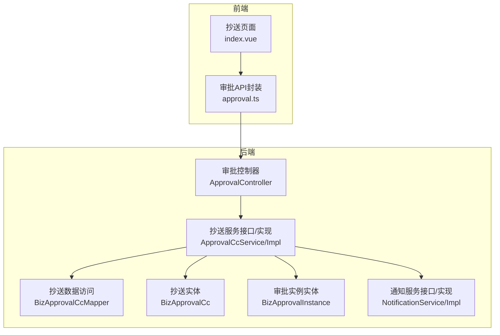
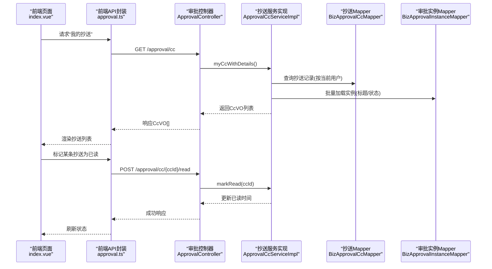
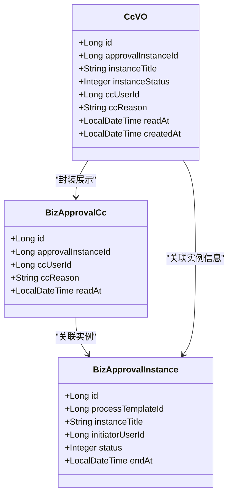
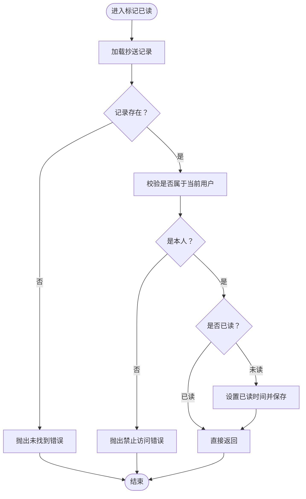
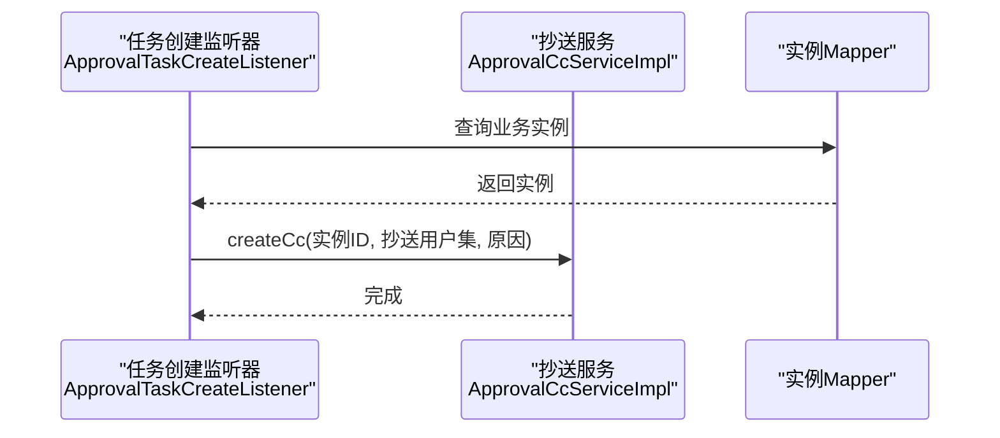
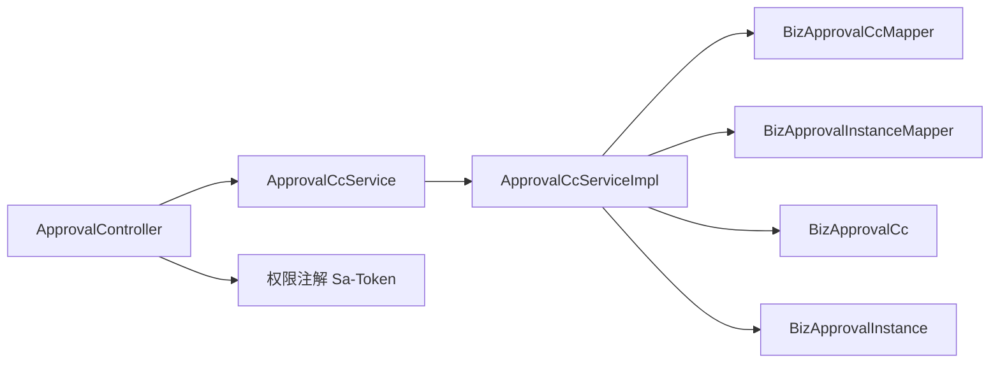

# 抄送管理

<cite>
**本文引用的文件**
- [BizApprovalCc.java](file://oa-approval/src/main/java/com/oa/admin/approval/entity/BizApprovalCc.java)
- [CcVO.java](file://oa-approval/src/main/java/com/oa/admin/approval/dto/CcVO.java)
- [ApprovalCcService.java](file://oa-approval/src/main/java/com/oa/admin/approval/service/ApprovalCcService.java)
- [ApprovalCcServiceImpl.java](file://oa-approval/src/main/java/com/oa/admin/approval/service/impl/ApprovalCcServiceImpl.java)
- [BizApprovalCcMapper.java](file://oa-approval/src/main/java/com/oa/admin/approval/mapper/BizApprovalCcMapper.java)
- [ApprovalController.java](file://oa-approval/src/main/java/com/oa/admin/approval/controller/ApprovalController.java)
- [BizApprovalInstance.java](file://oa-approval/src/main/java/com/oa/admin/approval/entity/BizApprovalInstance.java)
- [ApprovalInstanceStatus.java](file://oa-approval/src/main/java/com/oa/admin/approval/enums/ApprovalInstanceStatus.java)
- [NotificationService.java](file://oa-approval/src/main/java/com/oa/admin/approval/service/NotificationService.java)
- [NotificationServiceImpl.java](file://oa-approval/src/main/java/com/oa/admin/approval/service/impl/NotificationServiceImpl.java)
- [index.vue](file://oa-ui/src/views/approval/cc/index.vue)
- [approval.ts](file://oa-ui/src/api/approval.ts)
- [ApprovalTaskCreateListener.java](file://oa-approval/src/main/java/com/oa/admin/approval/listener/ApprovalTaskCreateListener.java)
</cite>

## 目录
1. [简介](#简介)
2. [项目结构](#项目结构)
3. [核心组件](#核心组件)
4. [架构总览](#架构总览)
5. [详细组件分析](#详细组件分析)
6. [依赖分析](#依赖分析)
7. [性能考虑](#性能考虑)
8. [故障排查指南](#故障排查指南)
9. [结论](#结论)
10. [附录：API 使用示例与最佳实践](#附录api-使用示例与最佳实践)

## 简介
本文件系统性阐述“抄送管理”能力，覆盖抄送记录的查询、标记已读、抄送人权限控制、抄送规则配置（基于流程引擎事件）、抄送通知发送机制、状态跟踪与历史记录等业务逻辑。同时提供前后端 API 使用示例、错误处理策略以及在审批流程中的作用与最佳实践。

## 项目结构
抄送管理涉及后端服务层与前端页面/接口两部分：
- 后端模块：审批模块提供抄送实体、服务接口与实现、控制器暴露查询与标记已读接口；通知模块提供站内消息能力；前端通过 API 调用后端接口展示抄送列表与执行标记已读。
- 关键文件映射如下图所示：

图表来源
- [index.vue:1-61](file://oa-ui/src/views/approval/cc/index.vue#L1-L61)
- [approval.ts:32-38](file://oa-ui/src/api/approval.ts#L32-L38)
- [ApprovalController.java:217-228](file://oa-approval/src/main/java/com/oa/admin/approval/controller/ApprovalController.java#L217-L228)
- [ApprovalCcService.java:12-21](file://oa-approval/src/main/java/com/oa/admin/approval/service/ApprovalCcService.java#L12-L21)
- [ApprovalCcServiceImpl.java:29-102](file://oa-approval/src/main/java/com/oa/admin/approval/service/impl/ApprovalCcServiceImpl.java#L29-L102)
- [BizApprovalCcMapper.java:10-12](file://oa-approval/src/main/java/com/oa/admin/approval/mapper/BizApprovalCcMapper.java#L10-L12)
- [BizApprovalCc.java:19-28](file://oa-approval/src/main/java/com/oa/admin/approval/entity/BizApprovalCc.java#L19-L28)
- [BizApprovalInstance.java:19-32](file://oa-approval/src/main/java/com/oa/admin/approval/entity/BizApprovalInstance.java#L19-L32)
- [NotificationServiceImpl.java:25-94](file://oa-approval/src/main/java/com/oa/admin/approval/service/impl/NotificationServiceImpl.java#L25-L94)

章节来源
- [ApprovalController.java:217-228](file://oa-approval/src/main/java/com/oa/admin/approval/controller/ApprovalController.java#L217-L228)
- [ApprovalCcService.java:12-21](file://oa-approval/src/main/java/com/oa/admin/approval/service/ApprovalCcService.java#L12-L21)
- [ApprovalCcServiceImpl.java:29-102](file://oa-approval/src/main/java/com/oa/admin/approval/service/impl/ApprovalCcServiceImpl.java#L29-L102)
- [BizApprovalCc.java:19-28](file://oa-approval/src/main/java/com/oa/admin/approval/entity/BizApprovalCc.java#L19-L28)
- [BizApprovalInstance.java:19-32](file://oa-approval/src/main/java/com/oa/admin/approval/entity/BizApprovalInstance.java#L19-L32)
- [index.vue:1-61](file://oa-ui/src/views/approval/cc/index.vue#L1-L61)
- [approval.ts:32-38](file://oa-ui/src/api/approval.ts#L32-L38)

## 核心组件
- 实体模型
  - 抄送记录实体：包含抄送关联的审批实例、抄送人、抄送原因、已读时间等字段。
  - 审批实例实体：包含实例标题、状态、发起人等信息，用于在抄送详情中回显。
- 数据传输对象
  - CcVO：封装抄送记录与其关联的审批实例标题与状态，便于前端展示。
- 服务接口与实现
  - 抄送服务接口定义：查询我的抄送、带详情的抄送列表、标记已读、批量创建抄送。
  - 抄送服务实现：基于登录用户上下文过滤抄送记录；按实例 ID 批量加载实例信息；校验抄送记录归属并更新已读时间；创建抄送记录。
- 控制器
  - 暴露查询“我的抄送”与“标记抄送已读”的接口，配合权限注解进行访问控制。
- 通知服务
  - 提供站内消息的发送与查询能力，可作为抄送通知的载体之一。

章节来源
- [BizApprovalCc.java:19-28](file://oa-approval/src/main/java/com/oa/admin/approval/entity/BizApprovalCc.java#L19-L28)
- [BizApprovalInstance.java:19-32](file://oa-approval/src/main/java/com/oa/admin/approval/entity/BizApprovalInstance.java#L19-L32)
- [CcVO.java:17-26](file://oa-approval/src/main/java/com/oa/admin/approval/dto/CcVO.java#L17-L26)
- [ApprovalCcService.java:12-21](file://oa-approval/src/main/java/com/oa/admin/approval/service/ApprovalCcService.java#L12-L21)
- [ApprovalCcServiceImpl.java:33-101](file://oa-approval/src/main/java/com/oa/admin/approval/service/impl/ApprovalCcServiceImpl.java#L33-L101)
- [ApprovalController.java:217-228](file://oa-approval/src/main/java/com/oa/admin/approval/controller/ApprovalController.java#L217-L228)
- [NotificationService.java:10-23](file://oa-approval/src/main/java/com/oa/admin/approval/service/NotificationService.java#L10-L23)
- [NotificationServiceImpl.java:27-92](file://oa-approval/src/main/java/com/oa/admin/approval/service/impl/NotificationServiceImpl.java#L27-L92)

## 架构总览
抄送管理在系统中的位置与交互如下：

图表来源
- [index.vue:30-57](file://oa-ui/src/views/approval/cc/index.vue#L30-L57)
- [approval.ts:32-38](file://oa-ui/src/api/approval.ts#L32-L38)
- [ApprovalController.java:217-228](file://oa-approval/src/main/java/com/oa/admin/approval/controller/ApprovalController.java#L217-L228)
- [ApprovalCcServiceImpl.java:42-87](file://oa-approval/src/main/java/com/oa/admin/approval/service/impl/ApprovalCcServiceImpl.java#L42-L87)
- [BizApprovalCcMapper.java:10-12](file://oa-approval/src/main/java/com/oa/admin/approval/mapper/BizApprovalCcMapper.java#L10-L12)

## 详细组件分析

### 实体与数据模型
- 抄送记录实体
  - 字段：主键、关联审批实例、抄送人、抄送原因、已读时间。
  - 已读时间为空表示未读，非空表示已读。
- 审批实例实体
  - 字段：主键、模板、标题、发起人、状态、结束时间等。
  - 用于在抄送详情中显示实例标题与状态。
- CcVO
  - 字段：抄送记录ID、实例ID、实例标题、实例状态、抄送人、抄送原因、已读时间、创建时间。

图表来源
- [BizApprovalCc.java:19-28](file://oa-approval/src/main/java/com/oa/admin/approval/entity/BizApprovalCc.java#L19-L28)
- [BizApprovalInstance.java:19-32](file://oa-approval/src/main/java/com/oa/admin/approval/entity/BizApprovalInstance.java#L19-L32)
- [CcVO.java:17-26](file://oa-approval/src/main/java/com/oa/admin/approval/dto/CcVO.java#L17-L26)

章节来源
- [BizApprovalCc.java:19-28](file://oa-approval/src/main/java/com/oa/admin/approval/entity/BizApprovalCc.java#L19-L28)
- [BizApprovalInstance.java:19-32](file://oa-approval/src/main/java/com/oa/admin/approval/entity/BizApprovalInstance.java#L19-L32)
- [CcVO.java:17-26](file://oa-approval/src/main/java/com/oa/admin/approval/dto/CcVO.java#L17-L26)

### 服务与控制器
- 抄送服务接口
  - 查询我的抄送列表（仅当前用户）
  - 查询我的抄送列表（带实例标题与状态）
  - 标记某条抄送为已读
  - 批量创建抄送（用于流程节点完成后自动抄送）
- 抄送服务实现
  - myCc：按当前登录用户过滤抄送记录并按创建时间倒序。
  - myCcWithDetails：批量加载实例信息，组装CcVO列表。
  - markRead：校验抄送记录是否存在、是否属于当前用户、是否已读，若未读则更新已读时间。
  - createCc：对指定实例批量创建抄送记录。
- 控制器接口
  - GET /approval/cc：返回CcVO列表
  - POST /approval/cc/{ccId}/read：标记已读

图表来源
- [ApprovalCcServiceImpl.java:74-87](file://oa-approval/src/main/java/com/oa/admin/approval/service/impl/ApprovalCcServiceImpl.java#L74-L87)
- [ApprovalController.java:223-228](file://oa-approval/src/main/java/com/oa/admin/approval/controller/ApprovalController.java#L223-L228)

章节来源
- [ApprovalCcService.java:12-21](file://oa-approval/src/main/java/com/oa/admin/approval/service/ApprovalCcService.java#L12-L21)
- [ApprovalCcServiceImpl.java:33-101](file://oa-approval/src/main/java/com/oa/admin/approval/service/impl/ApprovalCcServiceImpl.java#L33-L101)
- [ApprovalController.java:217-228](file://oa-approval/src/main/java/com/oa/admin/approval/controller/ApprovalController.java#L217-L228)

### 抄送规则配置与流程集成
- 规则触发点
  - 在流程节点完成后，根据节点配置向指定用户集合发送抄送。
- 触发时机
  - 当流程任务创建监听器检测到多实例或会签场景时，可在节点完成后调用抄送服务创建抄送记录。
- 配置要点
  - 节点配置中可定义抄送目标用户集合与抄送原因文案。
  - 可结合流程变量与条件表达式动态决定抄送范围。

图表来源
- [ApprovalTaskCreateListener.java:25-64](file://oa-approval/src/main/java/com/oa/admin/approval/listener/ApprovalTaskCreateListener.java#L25-L64)
- [ApprovalCcServiceImpl.java:89-101](file://oa-approval/src/main/java/com/oa/admin/approval/service/impl/ApprovalCcServiceImpl.java#L89-L101)

章节来源
- [ApprovalTaskCreateListener.java:25-64](file://oa-approval/src/main/java/com/oa/admin/approval/listener/ApprovalTaskCreateListener.java#L25-L64)
- [ApprovalCcServiceImpl.java:89-101](file://oa-approval/src/main/java/com/oa/admin/approval/service/impl/ApprovalCcServiceImpl.java#L89-L101)

### 通知发送机制与状态跟踪
- 站内通知
  - 通知服务支持单用户发送、批量发送、分页查询、未读计数、标记已读、全部已读。
  - 抄送记录本身有独立的已读时间字段，与站内通知的已读状态相互独立。
- 状态跟踪
  - 抄送记录：未读/已读（readAt）。
  - 站内通知：isRead（0/1）+ readAt。
- 历史记录
  - 抄送记录随实例生命周期保留，便于审计与追溯。

章节来源
- [NotificationService.java:10-23](file://oa-approval/src/main/java/com/oa/admin/approval/service/NotificationService.java#L10-L23)
- [NotificationServiceImpl.java:27-92](file://oa-approval/src/main/java/com/oa/admin/approval/service/impl/NotificationServiceImpl.java#L27-L92)
- [BizApprovalCc.java:26-27](file://oa-approval/src/main/java/com/oa/admin/approval/entity/BizApprovalCc.java#L26-L27)

## 依赖分析
- 组件耦合
  - 控制器依赖服务接口；服务实现依赖Mapper与实例Mapper；CcVO依赖实体信息。
- 外部依赖
  - 权限控制：基于注解的权限校验（如“approval:cc”）。
  - 用户上下文：通过统一的登录用户ID获取当前用户。
- 潜在循环依赖
  - 未发现循环依赖迹象；各层职责清晰。

图表来源
- [ApprovalController.java:217-228](file://oa-approval/src/main/java/com/oa/admin/approval/controller/ApprovalController.java#L217-L228)
- [ApprovalCcServiceImpl.java:29-102](file://oa-approval/src/main/java/com/oa/admin/approval/service/impl/ApprovalCcServiceImpl.java#L29-L102)
- [BizApprovalCcMapper.java:10-12](file://oa-approval/src/main/java/com/oa/admin/approval/mapper/BizApprovalCcMapper.java#L10-L12)
- [BizApprovalInstance.java:19-32](file://oa-approval/src/main/java/com/oa/admin/approval/entity/BizApprovalInstance.java#L19-L32)

章节来源
- [ApprovalController.java:217-228](file://oa-approval/src/main/java/com/oa/admin/approval/controller/ApprovalController.java#L217-L228)
- [ApprovalCcServiceImpl.java:29-102](file://oa-approval/src/main/java/com/oa/admin/approval/service/impl/ApprovalCcServiceImpl.java#L29-L102)

## 性能考虑
- 查询优化
  - myCcWithDetails：先查询抄送列表，再批量加载实例信息，减少多次数据库往返。
- 写入优化
  - createCc：对同一实例批量创建抄送记录，避免逐条插入。
- 分页与排序
  - 控制器层提供分页查询接口，建议前端在大量抄送场景下启用分页。
- 并发与幂等
  - 标记已读时检查是否已读，避免重复写入；权限校验确保并发安全。

## 故障排查指南
- 常见错误
  - 未找到抄送记录：当ccId不存在时抛出未找到错误。
  - 权限不足：当ccId不属于当前用户时抛出禁止访问错误。
  - 参数错误：请求参数解析失败时抛出参数错误。
- 排查步骤
  - 确认当前登录用户是否正确传递。
  - 确认ccId是否有效且属于当前用户。
  - 检查流程节点是否正确触发createCc。
- 相关定位
  - 标记已读异常路径：[ApprovalCcServiceImpl.java:74-87](file://oa-approval/src/main/java/com/oa/admin/approval/service/impl/ApprovalCcServiceImpl.java#L74-L87)
  - 参数解析异常路径：[ApprovalController.java:230-250](file://oa-approval/src/main/java/com/oa/admin/approval/controller/ApprovalController.java#L230-L250)

章节来源
- [ApprovalCcServiceImpl.java:74-87](file://oa-approval/src/main/java/com/oa/admin/approval/service/impl/ApprovalCcServiceImpl.java#L74-L87)
- [ApprovalController.java:230-250](file://oa-approval/src/main/java/com/oa/admin/approval/controller/ApprovalController.java#L230-L250)

## 结论
抄送管理通过“实体-服务-控制器-前端”的完整链路实现了抄送记录的查询与标记已读，并与流程引擎事件联动实现自动抄送。权限控制与状态跟踪清晰，具备良好的扩展性与可维护性。建议在大规模场景下结合分页与缓存策略进一步优化性能。

## 附录：API 使用示例与最佳实践

### API 列表
- 查询我的抄送
  - 方法与路径：GET /approval/cc
  - 权限：approval:cc
  - 响应：CcVO 数组
  - 示例响应字段：id、approvalInstanceId、instanceTitle、instanceStatus、ccUserId、ccReason、readAt、createdAt
- 标记抄送已读
  - 方法与路径：POST /approval/cc/{ccId}/read
  - 权限：approval:cc
  - 参数：ccId（路径参数）
  - 响应：成功（无内容）

章节来源
- [ApprovalController.java:217-228](file://oa-approval/src/main/java/com/oa/admin/approval/controller/ApprovalController.java#L217-L228)
- [CcVO.java:17-26](file://oa-approval/src/main/java/com/oa/admin/approval/dto/CcVO.java#L17-L26)

### 前端调用示例
- 获取我的抄送
  - 调用：getMyCc()
  - 返回：ApprovalCc[]（CcVO 的前端类型）
- 标记已读
  - 调用：markCcRead(ccId)
  - 行为：调用后刷新列表，显示已读状态

章节来源
- [approval.ts:32-38](file://oa-ui/src/api/approval.ts#L32-L38)
- [index.vue:30-57](file://oa-ui/src/views/approval/cc/index.vue#L30-L57)

### 错误处理
- 未找到：当ccId不存在或不属于当前用户时，返回未找到错误。
- 权限不足：当ccId不属于当前用户时，返回禁止访问错误。
- 参数错误：当请求参数无法解析为数值时，返回参数错误。

章节来源
- [ApprovalCcServiceImpl.java:74-87](file://oa-approval/src/main/java/com/oa/admin/approval/service/impl/ApprovalCcServiceImpl.java#L74-L87)
- [ApprovalController.java:230-250](file://oa-approval/src/main/java/com/oa/admin/approval/controller/ApprovalController.java#L230-L250)

### 在审批流程中的作用与最佳实践
- 作用
  - 使相关人员及时获知审批进展，提升透明度与协作效率。
- 最佳实践
  - 流程节点完成后自动触发抄送，抄送原因应明确（如“XX节点完成抄送”）。
  - 对批量抄送进行去重与幂等处理，避免重复记录。
  - 将抄送与站内通知结合使用，满足不同场景下的提醒需求。
  - 对大量抄送记录启用分页查询，避免一次性加载过多数据。

章节来源
- [ApprovalCcServiceImpl.java:89-101](file://oa-approval/src/main/java/com/oa/admin/approval/service/impl/ApprovalCcServiceImpl.java#L89-L101)
- [ApprovalTaskCreateListener.java:25-64](file://oa-approval/src/main/java/com/oa/admin/approval/listener/ApprovalTaskCreateListener.java#L25-L64)