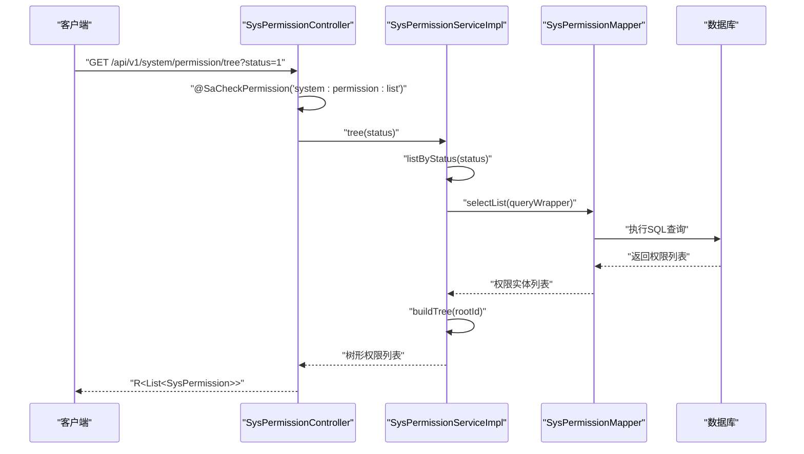
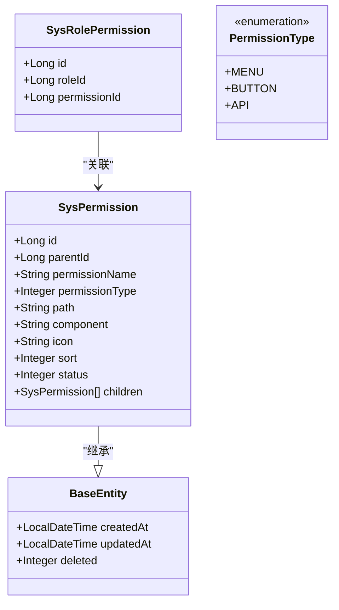
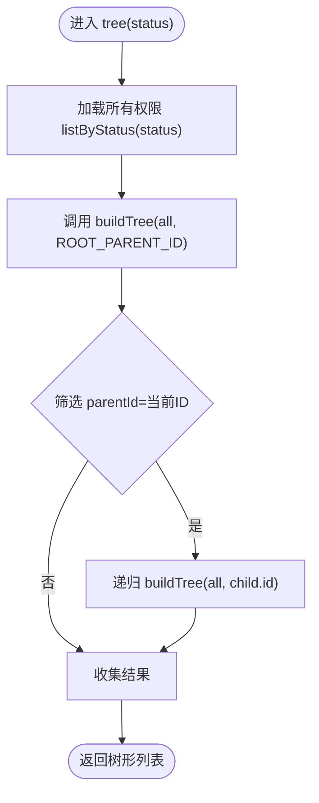
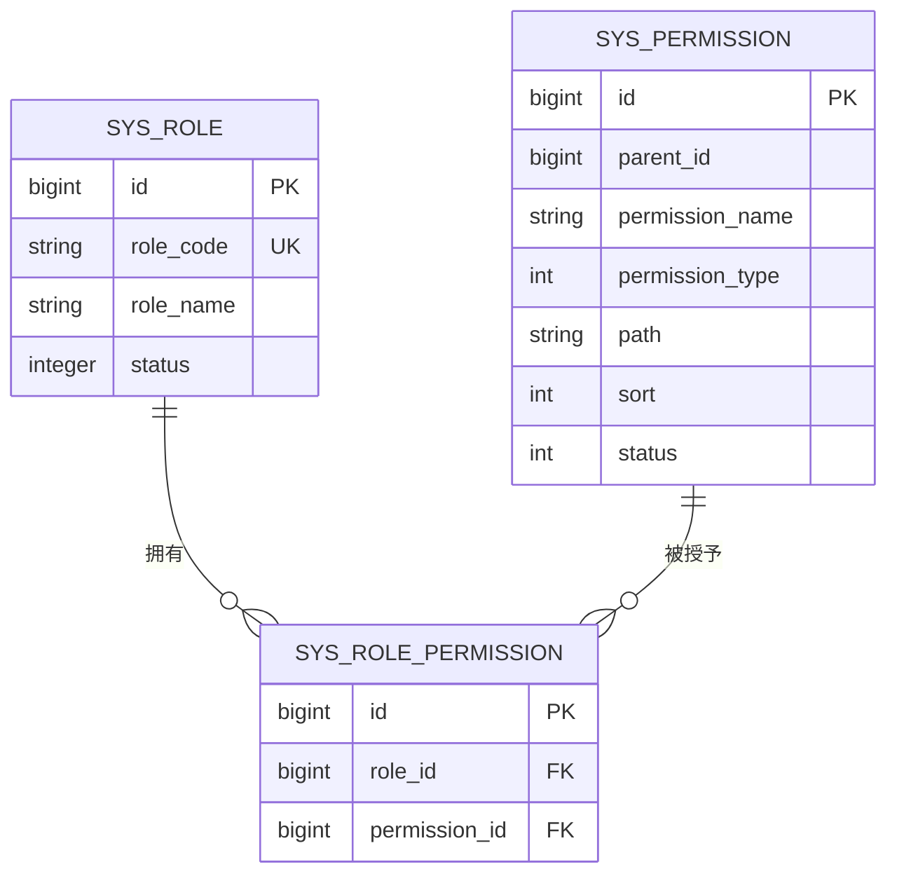
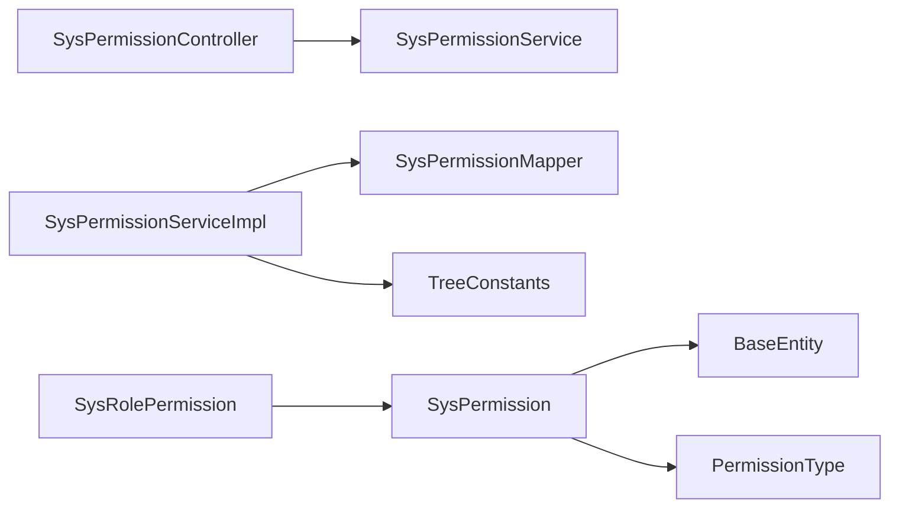

# 权限管理API

<cite>
**本文档引用的文件**
- [SysPermissionController.java](file://oa-system/src/main/java/com/oa/admin/system/controller/SysPermissionController.java)
- [SysPermission.java](file://oa-system/src/main/java/com/oa/admin/system/entity/SysPermission.java)
- [PermissionType.java](file://oa-system/src/main/java/com/oa/admin/system/enums/PermissionType.java)
- [SysPermissionService.java](file://oa-system/src/main/java/com/oa/admin/system/service/SysPermissionService.java)
- [SysPermissionServiceImpl.java](file://oa-system/src/main/java/com/oa/admin/system/service/impl/SysPermissionServiceImpl.java)
- [SysPermissionMapper.java](file://oa-system/src/main/java/com/oa/admin/system/mapper/SysPermissionMapper.java)
- [TreeConstants.java](file://oa-common/src/main/java/com/oa/admin/common/constant/TreeConstants.java)
- [BaseEntity.java](file://oa-common/src/main/java/com/oa/admin/common/entity/BaseEntity.java)
- [V11__system_management_permissions.sql](file://oa-app/src/main/resources/db/migration/V11__system_management_permissions.sql)
- [system.ts](file://oa-ui/src/api/system.ts)
- [SysRolePermission.java](file://oa-system/src/main/java/com/oa/admin/system/entity/SysRolePermission.java)
</cite>

## 目录
1. [简介](#简介)
2. [项目结构](#项目结构)
3. [核心组件](#核心组件)
4. [架构总览](#架构总览)
5. [详细组件分析](#详细组件分析)
6. [依赖关系分析](#依赖关系分析)
7. [性能考虑](#性能考虑)
8. [故障排除指南](#故障排除指南)
9. [结论](#结论)
10. [附录](#附录)

## 简介
本文件为权限管理模块的API接口文档，覆盖权限CRUD操作接口与权限树形结构管理。系统采用三级权限模型：菜单权限、按钮权限、API权限；支持权限列表查询、权限详情获取、权限创建、权限更新、权限删除；提供基于角色的权限分配与继承机制，并通过统一鉴权注解进行权限验证。

## 项目结构
权限管理模块位于 oa-system 子模块中，采用典型的分层架构：
- 控制器层：SysPermissionController 提供RESTful接口
- 服务层：SysPermissionService 及其实现类 SysPermissionServiceImpl 处理业务逻辑
- 数据访问层：SysPermissionMapper 基于MyBatis-Plus
- 实体层：SysPermission 定义权限数据模型
- 枚举层：PermissionType 定义权限类型枚举
- 常量层：TreeConstants 提供树根节点常量
- 基类：BaseEntity 提供通用字段（创建时间、更新时间、逻辑删除）

```mermaid
graph TB
subgraph "控制器层"
C1["SysPermissionController"]
end
subgraph "服务层"
S1["SysPermissionService"]
S2["SysPermissionServiceImpl"]
end
subgraph "数据访问层"
M1["SysPermissionMapper"]
end
subgraph "实体层"
E1["SysPermission"]
E2["SysRolePermission"]
E3["PermissionType"]
end
subgraph "常量与基类"
K1["TreeConstants"]
K2["BaseEntity"]
end
C1 --> S1
S1 < --> S2
S2 --> M1
S2 --> K1
E1 --> K2
E2 --> E1
E3 --> E1
```

**图表来源**
- [SysPermissionController.java:1-63](file://oa-system/src/main/java/com/oa/admin/system/controller/SysPermissionController.java#L1-L63)
- [SysPermissionService.java:1-17](file://oa-system/src/main/java/com/oa/admin/system/service/SysPermissionService.java#L1-L17)
- [SysPermissionServiceImpl.java:1-41](file://oa-system/src/main/java/com/oa/admin/system/service/impl/SysPermissionServiceImpl.java#L1-L41)
- [SysPermissionMapper.java:1-13](file://oa-system/src/main/java/com/oa/admin/system/mapper/SysPermissionMapper.java#L1-L13)
- [SysPermission.java:1-35](file://oa-system/src/main/java/com/oa/admin/system/entity/SysPermission.java#L1-L35)
- [SysRolePermission.java:1-19](file://oa-system/src/main/java/com/oa/admin/system/entity/SysRolePermission.java#L1-L19)
- [PermissionType.java:1-27](file://oa-system/src/main/java/com/oa/admin/system/enums/PermissionType.java#L1-L27)
- [TreeConstants.java:1-12](file://oa-common/src/main/java/com/oa/admin/common/constant/TreeConstants.java#L1-L12)
- [BaseEntity.java:1-26](file://oa-common/src/main/java/com/oa/admin/common/entity/BaseEntity.java#L1-L26)

**章节来源**
- [SysPermissionController.java:1-63](file://oa-system/src/main/java/com/oa/admin/system/controller/SysPermissionController.java#L1-L63)
- [SysPermissionService.java:1-17](file://oa-system/src/main/java/com/oa/admin/system/service/SysPermissionService.java#L1-L17)
- [SysPermissionServiceImpl.java:1-41](file://oa-system/src/main/java/com/oa/admin/system/service/impl/SysPermissionServiceImpl.java#L1-L41)
- [SysPermissionMapper.java:1-13](file://oa-system/src/main/java/com/oa/admin/system/mapper/SysPermissionMapper.java#L1-L13)
- [SysPermission.java:1-35](file://oa-system/src/main/java/com/oa/admin/system/entity/SysPermission.java#L1-L35)
- [SysRolePermission.java:1-19](file://oa-system/src/main/java/com/oa/admin/system/entity/SysRolePermission.java#L1-L19)
- [PermissionType.java:1-27](file://oa-system/src/main/java/com/oa/admin/system/enums/PermissionType.java#L1-L27)
- [TreeConstants.java:1-12](file://oa-common/src/main/java/com/oa/admin/common/constant/TreeConstants.java#L1-L12)
- [BaseEntity.java:1-26](file://oa-common/src/main/java/com/oa/admin/common/entity/BaseEntity.java#L1-L26)

## 核心组件
- 权限实体 SysPermission：包含权限标识、名称、类型、URL、组件、图标、排序号、状态及子权限集合
- 权限类型枚举 PermissionType：MENU(1)、BUTTON(2)、API(3)
- 权限服务接口与实现：提供按状态查询与树形构建能力
- 权限映射器：基于MyBatis-Plus的持久化接口
- 树常量：TreeConstants.ROOT_PARENT_ID 定义根节点父ID
- 基类 BaseEntity：提供通用字段与逻辑删除

**章节来源**
- [SysPermission.java:1-35](file://oa-system/src/main/java/com/oa/admin/system/entity/SysPermission.java#L1-L35)
- [PermissionType.java:1-27](file://oa-system/src/main/java/com/oa/admin/system/enums/PermissionType.java#L1-L27)
- [SysPermissionService.java:1-17](file://oa-system/src/main/java/com/oa/admin/system/service/SysPermissionService.java#L1-L17)
- [SysPermissionServiceImpl.java:1-41](file://oa-system/src/main/java/com/oa/admin/system/service/impl/SysPermissionServiceImpl.java#L1-L41)
- [SysPermissionMapper.java:1-13](file://oa-system/src/main/java/com/oa/admin/system/mapper/SysPermissionMapper.java#L1-L13)
- [TreeConstants.java:1-12](file://oa-common/src/main/java/com/oa/admin/common/constant/TreeConstants.java#L1-L12)
- [BaseEntity.java:1-26](file://oa-common/src/main/java/com/oa/admin/common/entity/BaseEntity.java#L1-L26)

## 架构总览
权限管理API遵循RESTful设计规范，控制器通过Sa-Token注解进行权限校验，服务层负责业务处理与树形结构构建，数据访问层完成数据库交互。



**图表来源**
- [SysPermissionController.java:21-26](file://oa-system/src/main/java/com/oa/admin/system/controller/SysPermissionController.java#L21-L26)
- [SysPermissionServiceImpl.java:28-39](file://oa-system/src/main/java/com/oa/admin/system/service/impl/SysPermissionServiceImpl.java#L28-L39)
- [SysPermissionMapper.java:1-13](file://oa-system/src/main/java/com/oa/admin/system/mapper/SysPermissionMapper.java#L1-L13)

## 详细组件分析

### 权限实体模型
权限实体 SysPermission 继承 BaseEntity，包含以下关键字段：
- id：主键
- parentId：父级权限ID，用于构建树形结构
- permissionName：权限名称
- permissionType：权限类型（1=菜单，2=按钮，3=API）
- path：权限URL或标识符
- component：前端组件路径
- icon：图标
- sort：排序号
- status：状态
- children：子权限集合（仅用于树形展示）



**图表来源**
- [SysPermission.java:1-35](file://oa-system/src/main/java/com/oa/admin/system/entity/SysPermission.java#L1-L35)
- [BaseEntity.java:1-26](file://oa-common/src/main/java/com/oa/admin/common/entity/BaseEntity.java#L1-L26)
- [SysRolePermission.java:1-19](file://oa-system/src/main/java/com/oa/admin/system/entity/SysRolePermission.java#L1-L19)
- [PermissionType.java:1-27](file://oa-system/src/main/java/com/oa/admin/system/enums/PermissionType.java#L1-L27)

**章节来源**
- [SysPermission.java:1-35](file://oa-system/src/main/java/com/oa/admin/system/entity/SysPermission.java#L1-L35)
- [BaseEntity.java:1-26](file://oa-common/src/main/java/com/oa/admin/common/entity/BaseEntity.java#L1-L26)
- [SysRolePermission.java:1-19](file://oa-system/src/main/java/com/oa/admin/system/entity/SysRolePermission.java#L1-L19)
- [PermissionType.java:1-27](file://oa-system/src/main/java/com/oa/admin/system/enums/PermissionType.java#L1-L27)

### 权限服务与树形构建
- listByStatus：根据状态过滤并按sort升序排列
- tree：基于根节点parentId=0递归构建树形结构
- buildTree：递归筛选子节点并填充children



**图表来源**
- [SysPermissionServiceImpl.java:28-39](file://oa-system/src/main/java/com/oa/admin/system/service/impl/SysPermissionServiceImpl.java#L28-L39)
- [TreeConstants.java:6-7](file://oa-common/src/main/java/com/oa/admin/common/constant/TreeConstants.java#L6-L7)

**章节来源**
- [SysPermissionServiceImpl.java:1-41](file://oa-system/src/main/java/com/oa/admin/system/service/impl/SysPermissionServiceImpl.java#L1-L41)
- [TreeConstants.java:1-12](file://oa-common/src/main/java/com/oa/admin/common/constant/TreeConstants.java#L1-L12)

### 权限验证与鉴权
- 使用 Sa-Token 注解进行权限校验
- 验证规则：
  - system:permission:list：列表与树形查询
  - system:permission:query：详情查询
  - system:permission:add：创建权限
  - system:permission:edit：更新权限
  - system:permission:remove：删除权限

**章节来源**
- [SysPermissionController.java:22-26](file://oa-system/src/main/java/com/oa/admin/system/controller/SysPermissionController.java#L22-L26)
- [SysPermissionController.java:36-38](file://oa-system/src/main/java/com/oa/admin/system/controller/SysPermissionController.java#L36-L38)
- [SysPermissionController.java:42-46](file://oa-system/src/main/java/com/oa/admin/system/controller/SysPermissionController.java#L42-L46)
- [SysPermissionController.java:48-54](file://oa-system/src/main/java/com/oa/admin/system/controller/SysPermissionController.java#L48-L54)
- [SysPermissionController.java:56-61](file://oa-system/src/main/java/com/oa/admin/system/controller/SysPermissionController.java#L56-L61)

### 权限与角色关联与继承
- 角色-权限中间表：sys_role_permission
- 字段：id、roleId、permissionId
- 通过中间表实现多对多关联，角色继承其关联的所有权限



**图表来源**
- [SysRolePermission.java:1-19](file://oa-system/src/main/java/com/oa/admin/system/entity/SysRolePermission.java#L1-L19)

**章节来源**
- [SysRolePermission.java:1-19](file://oa-system/src/main/java/com/oa/admin/system/entity/SysRolePermission.java#L1-L19)

## 依赖关系分析
- 控制器依赖服务接口
- 服务实现依赖映射器与树常量
- 实体依赖基类与枚举
- 权限类型枚举用于类型判断与转换



**图表来源**
- [SysPermissionController.java:1-63](file://oa-system/src/main/java/com/oa/admin/system/controller/SysPermissionController.java#L1-L63)
- [SysPermissionService.java:1-17](file://oa-system/src/main/java/com/oa/admin/system/service/SysPermissionService.java#L1-L17)
- [SysPermissionServiceImpl.java:1-41](file://oa-system/src/main/java/com/oa/admin/system/service/impl/SysPermissionServiceImpl.java#L1-L41)
- [SysPermissionMapper.java:1-13](file://oa-system/src/main/java/com/oa/admin/system/mapper/SysPermissionMapper.java#L1-L13)
- [SysPermission.java:1-35](file://oa-system/src/main/java/com/oa/admin/system/entity/SysPermission.java#L1-L35)
- [SysRolePermission.java:1-19](file://oa-system/src/main/java/com/oa/admin/system/entity/SysRolePermission.java#L1-L19)
- [PermissionType.java:1-27](file://oa-system/src/main/java/com/oa/admin/system/enums/PermissionType.java#L1-L27)
- [TreeConstants.java:1-12](file://oa-common/src/main/java/com/oa/admin/common/constant/TreeConstants.java#L1-L12)
- [BaseEntity.java:1-26](file://oa-common/src/main/java/com/oa/admin/common/entity/BaseEntity.java#L1-L26)

**章节来源**
- [SysPermissionController.java:1-63](file://oa-system/src/main/java/com/oa/admin/system/controller/SysPermissionController.java#L1-L63)
- [SysPermissionService.java:1-17](file://oa-system/src/main/java/com/oa/admin/system/service/SysPermissionService.java#L1-L17)
- [SysPermissionServiceImpl.java:1-41](file://oa-system/src/main/java/com/oa/admin/system/service/impl/SysPermissionServiceImpl.java#L1-L41)
- [SysPermissionMapper.java:1-13](file://oa-system/src/main/java/com/oa/admin/system/mapper/SysPermissionMapper.java#L1-L13)
- [SysPermission.java:1-35](file://oa-system/src/main/java/com/oa/admin/system/entity/SysPermission.java#L1-L35)
- [SysRolePermission.java:1-19](file://oa-system/src/main/java/com/oa/admin/system/entity/SysRolePermission.java#L1-L19)
- [PermissionType.java:1-27](file://oa-system/src/main/java/com/oa/admin/system/enums/PermissionType.java#L1-L27)
- [TreeConstants.java:1-12](file://oa-common/src/main/java/com/oa/admin/common/constant/TreeConstants.java#L1-L12)
- [BaseEntity.java:1-26](file://oa-common/src/main/java/com/oa/admin/common/entity/BaseEntity.java#L1-L26)

## 性能考虑
- 树形构建使用递归与流式过滤，时间复杂度近似O(n^2)，建议在权限规模较大时：
  - 后端分页查询与懒加载子节点
  - 前端仅展开可见层级
  - 缓存热点权限树
- 排序字段sort用于稳定输出顺序，避免前端二次排序
- 状态过滤减少无效节点遍历

## 故障排除指南
- 权限类型非法：确认permissionType值在1-3范围内
- 树形异常：检查parentId是否正确设置，确保根节点parentId=0
- 权限分配失败：确认角色-权限中间表记录存在且有效
- 鉴权失败：确认用户具备对应system:permission:*权限

## 结论
权限管理模块提供了完整的权限CRUD与树形管理能力，结合角色-权限关联实现灵活的权限继承机制。通过统一的鉴权注解与RESTful接口设计，满足后台管理系统对权限控制的需求。

## 附录

### RESTful API 设计规范

- 基础路径
  - /api/v1/system/permission

- 权限列表查询
  - 方法：GET
  - 路径：/api/v1/system/permission
  - 查询参数：
    - status：可选，整数，权限状态
  - 认证要求：system:permission:list
  - 响应：R<List<SysPermission>>

- 权限树形结构查询
  - 方法：GET
  - 路径：/api/v1/system/permission/tree
  - 查询参数：
    - status：可选，整数，权限状态
  - 认证要求：system:permission:list
  - 响应：R<List<SysPermission>>

- 权限详情获取
  - 方法：GET
  - 路径：/api/v1/system/permission/{id}
  - 路径参数：
    - id：必填，长整型，权限ID
  - 认证要求：system:permission:query
  - 响应：R<SysPermission>

- 权限创建
  - 方法：POST
  - 路径：/api/v1/system/permission
  - 请求体：SysPermission 对象
  - 认证要求：system:permission:add
  - 响应：R<SysPermission>

- 权限更新
  - 方法：PUT
  - 路径：/api/v1/system/permission/{id}
  - 路径参数：
    - id：必填，长整型，权限ID
  - 请求体：SysPermission 对象（无需包含id，服务端会注入）
  - 认证要求：system:permission:edit
  - 响应：R<SysPermission>

- 权限删除
  - 方法：DELETE
  - 路径：/api/v1/system/permission/{id}
  - 路径参数：
    - id：必填，长整型，权限ID
  - 认证要求：system:permission:remove
  - 响应：R<Void>

- 响应封装
  - 成功响应：R.ok(data)
  - 错误响应：R.error(code, message)

**章节来源**
- [SysPermissionController.java:21-61](file://oa-system/src/main/java/com/oa/admin/system/controller/SysPermissionController.java#L21-L61)

### 权限字段映射关系
- 权限名称：permissionName
- 权限标识符：path
- 权限类型：permissionType（1=菜单，2=按钮，3=API）
- 权限URL：path（API权限场景下）
- 权限方法：未在实体中显式存储，通常由API路由定义
- 父级权限ID：parentId
- 排序号：sort
- 状态：status
- 创建/更新时间：createdAt/updatedAt（继承自BaseEntity）
- 子权限集合：children（仅树形展示使用）

**章节来源**
- [SysPermission.java:22-33](file://oa-system/src/main/java/com/oa/admin/system/entity/SysPermission.java#L22-L33)
- [BaseEntity.java:14-25](file://oa-common/src/main/java/com/oa/admin/common/entity/BaseEntity.java#L14-L25)

### 权限与角色关联示例
- 角色-权限中间表记录示例：
  - roleId=1, permissionId=130（权限新增）
  - roleId=1, permissionId=131（权限编辑）
  - roleId=1, permissionId=132（权限删除）
  - roleId=1, permissionId=133（权限查询）
  - roleId=1, permissionId=134（权限列表）

- 数据库迁移脚本片段：
  - 插入权限数据并去重更新
  - 将上述权限批量授予admin角色（roleId=1）

**章节来源**
- [V11__system_management_permissions.sql:3-25](file://oa-app/src/main/resources/db/migration/V11__system_management_permissions.sql#L3-L25)
- [V11__system_management_permissions.sql:27-46](file://oa-app/src/main/resources/db/migration/V11__system_management_permissions.sql#L27-L46)

### 前端API调用示例
- 获取权限树：GET /system/permission/tree?status=1
- 获取权限列表：GET /system/permission?status=1
- 创建权限：POST /system/permission
- 更新权限：PUT /system/permission/:id
- 删除权限：DELETE /system/permission/:id

**章节来源**
- [system.ts:32-51](file://oa-ui/src/api/system.ts#L32-L51)