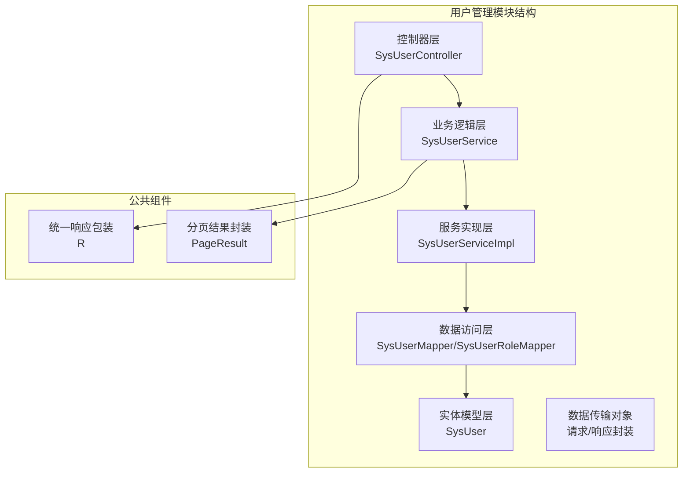
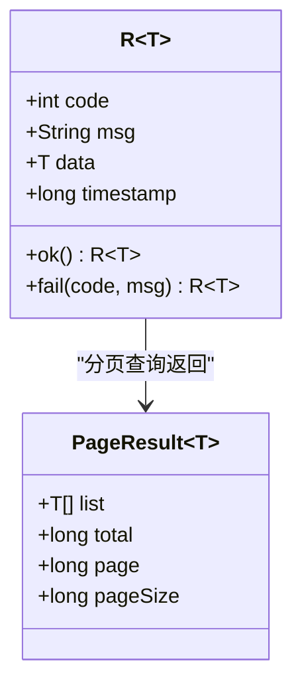
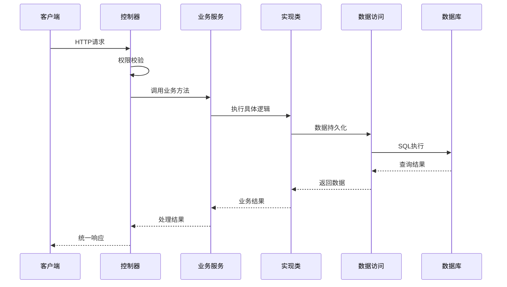
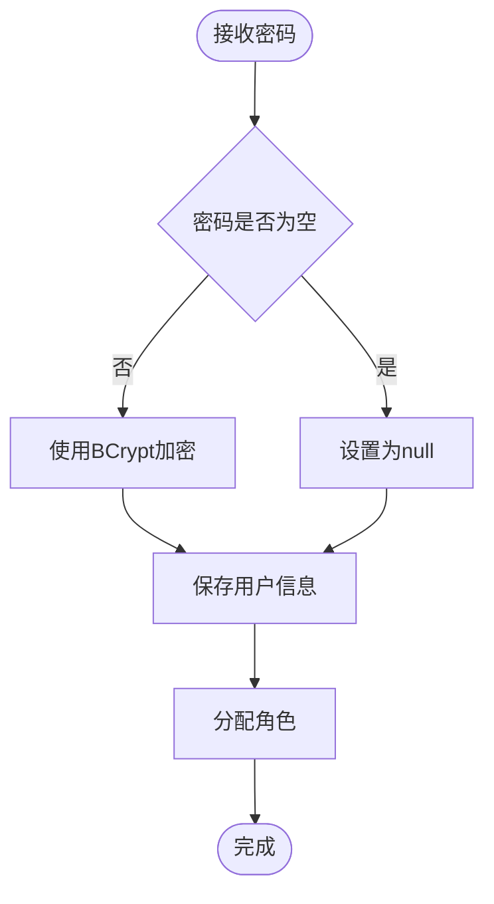
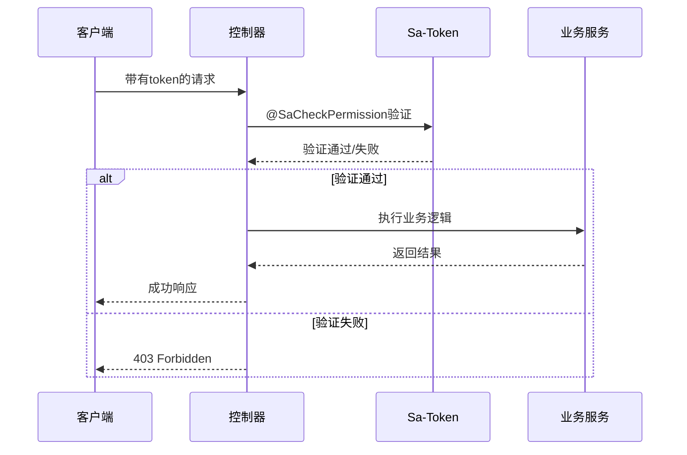
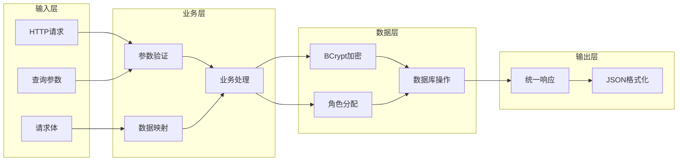
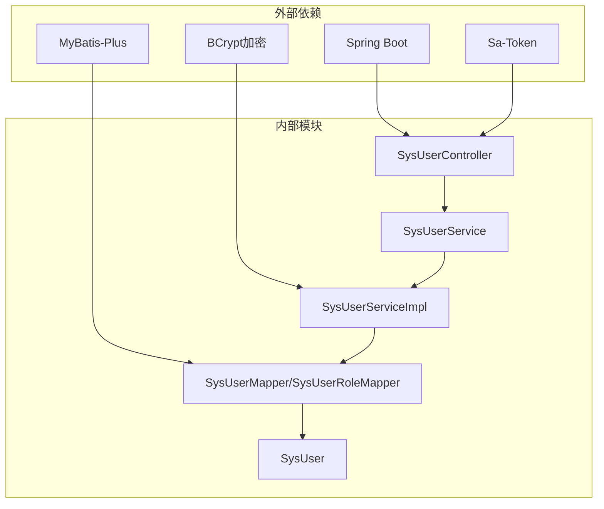
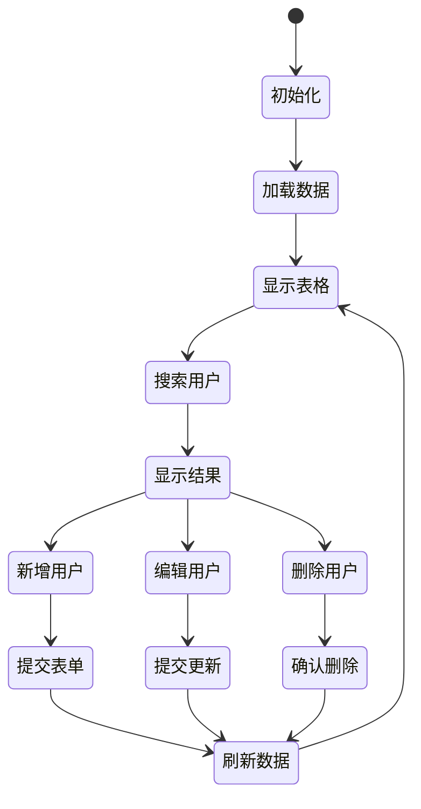

# 用户管理API

<cite>
**本文档引用的文件**
- [SysUserController.java](file://oa-system/src/main/java/com/oa/admin/system/controller/SysUserController.java)
- [SysUserService.java](file://oa-system/src/main/java/com/oa/admin/system/service/SysUserService.java)
- [SysUserServiceImpl.java](file://oa-system/src/main/java/com/oa/admin/system/service/impl/SysUserServiceImpl.java)
- [SysUser.java](file://oa-system/src/main/java/com/oa/admin/system/entity/SysUser.java)
- [SysUserMapper.java](file://oa-system/src/main/java/com/oa/admin/system/mapper/SysUserMapper.java)
- [SysUserRoleMapper.java](file://oa-system/src/main/java/com/oa/admin/system/mapper/SysUserRoleMapper.java)
- [R.java](file://oa-common/src/main/java/com/oa/admin/common/result/R.java)
- [PageResult.java](file://oa-common/src/main/java/com/oa/admin/common/result/PageResult.java)
- [user.ts](file://oa-ui/src/api/user.ts)
- [index.vue](file://oa-ui/src/views/system/user/index.vue)
- [system.ts](file://oa-ui/src/types/system.ts)
</cite>

## 目录
1. [简介](#简介)
2. [项目结构](#项目结构)
3. [核心组件](#核心组件)
4. [架构概览](#架构概览)
5. [详细组件分析](#详细组件分析)
6. [依赖关系分析](#依赖关系分析)
7. [性能考虑](#性能考虑)
8. [故障排除指南](#故障排除指南)
9. [结论](#结论)

## 简介

用户管理API是OA管理系统中的核心功能模块，提供完整的用户CRUD操作接口。该模块基于Spring Boot框架构建，采用分层架构设计，实现了用户信息的增删改查、分页查询、角色分配等核心功能。系统使用BCrypt进行密码加密存储，支持基于权限注解的安全控制。

## 项目结构

用户管理模块位于oa-system子项目中，采用标准的MVC架构模式：



**图表来源**
- [SysUserController.java:17-20](file://oa-system/src/main/java/com/oa/admin/system/controller/SysUserController.java#L17-L20)
- [SysUserService.java:12-19](file://oa-system/src/main/java/com/oa/admin/system/service/SysUserService.java#L12-L19)
- [SysUserServiceImpl.java:22-24](file://oa-system/src/main/java/com/oa/admin/system/service/impl/SysUserServiceImpl.java#L22-L24)

**章节来源**
- [SysUserController.java:1-85](file://oa-system/src/main/java/com/oa/admin/system/controller/SysUserController.java#L1-L85)
- [SysUserService.java:1-20](file://oa-system/src/main/java/com/oa/admin/system/service/SysUserService.java#L1-L20)

## 核心组件

### 用户实体模型

用户实体采用MyBatis-Plus注解映射数据库表结构，包含以下核心字段：

| 字段名 | 类型 | 描述 | 必填 |
|--------|------|------|------|
| id | Long | 用户唯一标识 | 否 |
| username | String | 用户名 | 是 |
| passwordHash | String | 密码哈希值 | 是 |
| nickname | String | 昵称 | 否 |
| email | String | 邮箱地址 | 否 |
| phone | String | 电话号码 | 否 |
| deptId | Long | 部门ID | 否 |
| status | Integer | 用户状态(1正常,0禁用) | 否 |

### 统一响应格式

系统采用统一的响应包装机制，所有API接口返回标准化的JSON格式：



**图表来源**
- [R.java:9-44](file://oa-common/src/main/java/com/oa/admin/common/result/R.java#L9-L44)
- [PageResult.java:9-23](file://oa-common/src/main/java/com/oa/admin/common/result/PageResult.java#L9-L23)

**章节来源**
- [SysUser.java:13-26](file://oa-system/src/main/java/com/oa/admin/system/entity/SysUser.java#L13-L26)
- [R.java:1-44](file://oa-common/src/main/java/com/oa/admin/common/result/R.java#L1-L44)
- [PageResult.java:1-23](file://oa-common/src/main/java/com/oa/admin/common/result/PageResult.java#L1-L23)

## 架构概览

用户管理模块采用经典的三层架构设计，各层职责清晰分离：



**图表来源**
- [SysUserController.java:23-83](file://oa-system/src/main/java/com/oa/admin/system/controller/SysUserController.java#L23-L83)
- [SysUserServiceImpl.java:27-58](file://oa-system/src/main/java/com/oa/admin/system/service/impl/SysUserServiceImpl.java#L27-L58)

## 详细组件分析

### RESTful API设计规范

#### 用户列表查询

**接口定义**
- 方法：GET
- 路径：`/api/v1/system/user`
- 权限：`system:user:list`

**请求参数**

| 参数名 | 类型 | 必填 | 默认值 | 描述 |
|--------|------|------|--------|------|
| username | String | 否 | "" | 用户名模糊搜索 |
| status | Integer | 否 | null | 用户状态筛选(1正常,0禁用) |
| page | Long | 否 | 1 | 页码 |
| pageSize | Long | 否 | 20 | 每页数量 |

**响应数据结构**
```json
{
  "code": 200,
  "msg": "success",
  "data": {
    "list": [
      {
        "id": 1,
        "username": "admin",
        "nickname": "管理员",
        "email": "admin@example.com",
        "phone": "13800000000",
        "deptId": 1,
        "status": 1,
        "createdAt": "2024-01-01T00:00:00Z",
        "updatedAt": "2024-01-01T00:00:00Z"
      }
    ],
    "total": 1,
    "page": 1,
    "pageSize": 20
  },
  "timestamp": 1700000000
}
```

**接口调用示例**
```javascript
// 前端调用示例
getUserList({
  username: 'admin',
  status: 1,
  page: 1,
  pageSize: 10
})
```

#### 用户详情获取

**接口定义**
- 方法：GET
- 路径：`/api/v1/system/user/{id}`
- 权限：`system:user:query`

**路径参数**
- id: Long - 用户唯一标识

**响应说明**
- 密码字段在返回时会被置为null，确保安全性

#### 用户创建

**接口定义**
- 方法：POST
- 路径：`/api/v1/system/user`
- 权限：`system:user:add`

**请求体参数**

| 参数名 | 类型 | 必填 | 描述 |
|--------|------|------|------|
| username | String | 是 | 用户名 |
| nickname | String | 否 | 昵称 |
| password | String | 是 | 密码（明文，后端会进行BCrypt加密） |
| email | String | 否 | 邮箱地址 |
| phone | String | 否 | 电话号码 |
| deptId | Long | 否 | 部门ID |
| status | Integer | 否 | 用户状态，默认1（正常） |
| roleIds | List<Long> | 否 | 角色ID列表 |

**密码处理流程**


**图表来源**
- [SysUserServiceImpl.java:39-58](file://oa-system/src/main/java/com/oa/admin/system/service/impl/SysUserServiceImpl.java#L39-L58)

#### 用户更新

**接口定义**
- 方法：PUT
- 路径：`/api/v1/system/user/{id}`
- 权限：`system:user:edit`

**请求体参数**
- 与创建接口相同，但roleIds为可选参数

**更新逻辑**
- 如果提供新密码则进行BCrypt加密
- 如果未提供密码则保持原有密码不变
- 支持部分字段更新

#### 用户删除

**接口定义**
- 方法：DELETE
- 路径：`/api/v1/system/user/{id}`
- 权限：`system:user:remove`

**响应说明**
- 删除成功返回空数据

**章节来源**
- [SysUserController.java:23-83](file://oa-system/src/main/java/com/oa/admin/system/controller/SysUserController.java#L23-L83)
- [SysUserServiceImpl.java:27-71](file://oa-system/src/main/java/com/oa/admin/system/service/impl/SysUserServiceImpl.java#L27-L71)

### 权限验证机制

系统采用Sa-Token框架进行权限控制，每个API接口都配置了相应的权限注解：

| 接口 | 权限标识 | 描述 |
|------|----------|------|
| GET /api/v1/system/user | system:user:list | 用户列表查询 |
| GET /api/v1/system/user/{id} | system:user:query | 用户详情查询 |
| POST /api/v1/system/user | system:user:add | 创建用户 |
| PUT /api/v1/system/user/{id} | system:user:edit | 更新用户 |
| DELETE /api/v1/system/user/{id} | system:user:remove | 删除用户 |

**权限检查流程**


**图表来源**
- [SysUserController.java:24-79](file://oa-system/src/main/java/com/oa/admin/system/controller/SysUserController.java#L24-L79)

**章节来源**
- [SysUserController.java:3-4](file://oa-system/src/main/java/com/oa/admin/system/controller/SysUserController.java#L3-L4)

### 数据流处理

用户管理的数据流遵循标准的CRUD模式：



**图表来源**
- [SysUserServiceImpl.java:40-58](file://oa-system/src/main/java/com/oa/admin/system/service/impl/SysUserServiceImpl.java#L40-L58)
- [SysUserController.java:43-75](file://oa-system/src/main/java/com/oa/admin/system/controller/SysUserController.java#L43-L75)

**章节来源**
- [SysUserServiceImpl.java:1-73](file://oa-system/src/main/java/com/oa/admin/system/service/impl/SysUserServiceImpl.java#L1-L73)

## 依赖关系分析

用户管理模块的依赖关系清晰明确，遵循依赖倒置原则：



**图表来源**
- [SysUserController.java:1-12](file://oa-system/src/main/java/com/oa/admin/system/controller/SysUserController.java#L1-L12)
- [SysUserServiceImpl.java:1-17](file://oa-system/src/main/java/com/oa/admin/system/service/impl/SysUserServiceImpl.java#L1-L17)

**章节来源**
- [SysUserController.java:1-85](file://oa-system/src/main/java/com/oa/admin/system/controller/SysUserController.java#L1-L85)
- [SysUserServiceImpl.java:1-73](file://oa-system/src/main/java/com/oa/admin/system/service/impl/SysUserServiceImpl.java#L1-L73)

## 性能考虑

### 分页查询优化

系统采用MyBatis-Plus的分页插件，支持大数据量场景下的高效查询：

- 使用LambdaQueryWrapper进行条件查询
- 支持模糊匹配和精确匹配
- 默认按创建时间倒序排列

### 密码安全处理

- 采用BCrypt算法进行密码哈希
- 密码字段在数据库中只存储哈希值
- 响应中自动过滤敏感信息

### 缓存策略

当前实现未包含缓存层，建议在高并发场景下考虑：
- 用户信息缓存（短期）
- 角色权限缓存
- 部门树结构缓存

## 故障排除指南

### 常见错误及解决方案

| 错误类型 | 错误码 | 可能原因 | 解决方案 |
|----------|--------|----------|----------|
| 权限不足 | 403 | 缺少相应权限 | 检查用户权限配置 |
| 参数错误 | 400 | 请求参数格式错误 | 验证请求体格式 |
| 用户不存在 | 404 | 用户ID无效 | 确认用户存在性 |
| 数据库错误 | 500 | 数据库连接问题 | 检查数据库状态 |

### 前端集成注意事项

前端用户管理页面提供了完整的CRUD操作界面：



**图表来源**
- [index.vue:128-194](file://oa-ui/src/views/system/user/index.vue#L128-L194)

**章节来源**
- [user.ts:1-22](file://oa-ui/src/api/user.ts#L1-L22)
- [index.vue:1-203](file://oa-ui/src/views/system/user/index.vue#L1-L203)

## 结论

用户管理API模块设计合理，实现了完整的用户生命周期管理功能。系统采用现代化的技术栈，具有良好的扩展性和维护性。主要特点包括：

1. **标准化设计**：遵循RESTful API设计原则，接口清晰易用
2. **安全性保障**：完善的权限控制和密码加密机制
3. **用户体验**：前后端分离，提供友好的管理界面
4. **可扩展性**：模块化设计，便于功能扩展和维护

建议在后续开发中重点关注性能优化和监控告警系统的完善，以支持更大规模的用户管理需求。