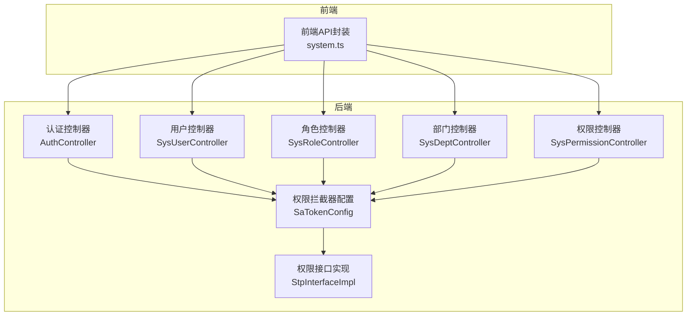
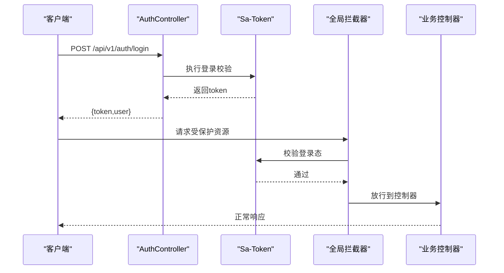
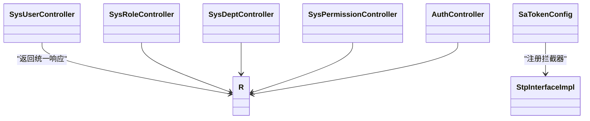

# 系统管理API

<cite>
**本文档引用的文件**
- [SysUserController.java](file://oa-system/src/main/java/com/oa/admin/system/controller/SysUserController.java)
- [SysRoleController.java](file://oa-system/src/main/java/com/oa/admin/system/controller/SysRoleController.java)
- [SysDeptController.java](file://oa-system/src/main/java/com/oa/admin/system/controller/SysDeptController.java)
- [SysPermissionController.java](file://oa-system/src/main/java/com/oa/admin/system/controller/SysPermissionController.java)
- [AuthController.java](file://oa-system/src/main/java/com/oa/admin/system/controller/AuthController.java)
- [SysUser.java](file://oa-system/src/main/java/com/oa/admin/system/entity/SysUser.java)
- [SysRole.java](file://oa-system/src/main/java/com/oa/admin/system/entity/SysRole.java)
- [SysDept.java](file://oa-system/src/main/java/com/oa/admin/system/entity/SysDept.java)
- [SysPermission.java](file://oa-system/src/main/java/com/oa/admin/system/entity/SysPermission.java)
- [DataScope.java](file://oa-system/src/main/java/com/oa/admin/system/enums/DataScope.java)
- [PermissionType.java](file://oa-system/src/main/java/com/oa/admin/system/enums/PermissionType.java)
- [SaTokenConfig.java](file://oa-system/src/main/java/com/oa/admin/system/config/SaTokenConfig.java)
- [StpInterfaceImpl.java](file://oa-system/src/main/java/com/oa/admin/system/config/StpInterfaceImpl.java)
- [R.java](file://oa-common/src/main/java/com/oa/admin/common/result/R.java)
- [system.ts](file://oa-ui/src/api/system.ts)
</cite>

## 目录
1. [简介](#简介)
2. [项目结构](#项目结构)
3. [核心组件](#核心组件)
4. [架构总览](#架构总览)
5. [详细组件分析](#详细组件分析)
6. [依赖分析](#依赖分析)
7. [性能考虑](#性能考虑)
8. [故障排除指南](#故障排除指南)
9. [结论](#结论)
10. [附录](#附录)

## 简介
本文件为系统管理模块的API接口文档，覆盖用户管理、角色管理、部门管理、权限管理等RBAC相关接口。内容包含：
- 用户CRUD操作与角色关联
- 角色权限分配与数据范围配置
- 部门树形结构管理（含层级与状态筛选）
- 权限菜单配置（菜单/按钮/API类型）
- 完整RESTful API设计规范（HTTP方法、URL路径、请求参数、响应格式）
- 分页查询、条件筛选、排序等通用参数使用
- 权限验证机制与数据安全控制
- 接口调用示例与常见业务场景
- RBAC权限模型在API层面的具体实现

## 项目结构
系统管理模块位于后端oa-system子模块，采用标准的分层架构：Controller（控制器）- Service（服务）- Mapper（数据访问）- Entity（实体）。前端通过oa-ui中的API封装调用后端接口。

图表来源
- [AuthController.java:1-38](file://oa-system/src/main/java/com/oa/admin/system/controller/AuthController.java#L1-L38)
- [SysUserController.java:1-85](file://oa-system/src/main/java/com/oa/admin/system/controller/SysUserController.java#L1-L85)
- [SysRoleController.java:1-78](file://oa-system/src/main/java/com/oa/admin/system/controller/SysRoleController.java#L1-L78)
- [SysDeptController.java:1-70](file://oa-system/src/main/java/com/oa/admin/system/controller/SysDeptController.java#L1-L70)
- [SysPermissionController.java:1-63](file://oa-system/src/main/java/com/oa/admin/system/controller/SysPermissionController.java#L1-L63)
- [SaTokenConfig.java:1-25](file://oa-system/src/main/java/com/oa/admin/system/config/SaTokenConfig.java#L1-L25)
- [StpInterfaceImpl.java:1-75](file://oa-system/src/main/java/com/oa/admin/system/config/StpInterfaceImpl.java#L1-L75)

章节来源
- [SysUserController.java:1-85](file://oa-system/src/main/java/com/oa/admin/system/controller/SysUserController.java#L1-L85)
- [SysRoleController.java:1-78](file://oa-system/src/main/java/com/oa/admin/system/controller/SysRoleController.java#L1-L78)
- [SysDeptController.java:1-70](file://oa-system/src/main/java/com/oa/admin/system/controller/SysDeptController.java#L1-L70)
- [SysPermissionController.java:1-63](file://oa-system/src/main/java/com/oa/admin/system/controller/SysPermissionController.java#L1-L63)
- [AuthController.java:1-38](file://oa-system/src/main/java/com/oa/admin/system/controller/AuthController.java#L1-L38)

## 核心组件
- 认证与授权
  - 登录/登出/当前用户信息接口，基于Sa-Token进行会话管理与权限校验
  - 全局拦截器对/api/v1/**路径进行登录态校验，除登录/注册外均需鉴权
  - 自定义权限接口实现，根据用户角色映射到具体权限路径集合
- 实体模型
  - 用户：用户名、昵称、邮箱、电话、所属部门、状态等
  - 角色：角色名、角色键、数据范围（全部/部门/自定义）、状态等
  - 部门：父级ID、名称、排序、负责人、状态、子节点集合
  - 权限：父级ID、名称、类型（菜单/按钮/API）、路径、组件、图标、排序、状态、子节点集合
- 响应统一格式
  - 统一返回体包含code、msg、data、timestamp字段，成功默认code=200

章节来源
- [AuthController.java:1-38](file://oa-system/src/main/java/com/oa/admin/system/controller/AuthController.java#L1-L38)
- [SaTokenConfig.java:1-25](file://oa-system/src/main/java/com/oa/admin/system/config/SaTokenConfig.java#L1-L25)
- [StpInterfaceImpl.java:1-75](file://oa-system/src/main/java/com/oa/admin/system/config/StpInterfaceImpl.java#L1-L75)
- [SysUser.java:1-27](file://oa-system/src/main/java/com/oa/admin/system/entity/SysUser.java#L1-L27)
- [SysRole.java:1-26](file://oa-system/src/main/java/com/oa/admin/system/entity/SysRole.java#L1-L26)
- [SysDept.java:1-31](file://oa-system/src/main/java/com/oa/admin/system/entity/SysDept.java#L1-L31)
- [SysPermission.java:1-35](file://oa-system/src/main/java/com/oa/admin/system/entity/SysPermission.java#L1-L35)
- [R.java:1-44](file://oa-common/src/main/java/com/oa/admin/common/result/R.java#L1-L44)

## 架构总览
RBAC权限模型在API层面的实现要点：
- 路由级权限：通过注解@SaCheckPermission为各接口绑定权限点，如system:user:list、system:role:edit等
- 拦截器级鉴权：全局拦截器强制要求登录态，未登录统一拒绝
- 动态权限解析：StpInterfaceImpl根据用户角色查询其拥有的权限路径集合，供框架判断是否放行
- 数据范围控制：角色支持三种数据范围策略（全部/部门/自定义），配合部门树实现数据隔离

图表来源
- [AuthController.java:1-38](file://oa-system/src/main/java/com/oa/admin/system/controller/AuthController.java#L1-L38)
- [SaTokenConfig.java:1-25](file://oa-system/src/main/java/com/oa/admin/system/config/SaTokenConfig.java#L1-L25)
- [StpInterfaceImpl.java:1-75](file://oa-system/src/main/java/com/oa/admin/system/config/StpInterfaceImpl.java#L1-L75)

## 详细组件分析

### 认证与授权接口
- 登录
  - 方法与路径：POST /api/v1/auth/login
  - 请求体：{ username, password }
  - 响应：{ token, user }
- 登出
  - 方法与路径：POST /api/v1/auth/logout
  - 响应：{ code, msg, data=null }
- 当前用户
  - 方法与路径：GET /api/v1/auth/me
  - 响应：{ code, msg, data: 当前用户信息 }

章节来源
- [AuthController.java:1-38](file://oa-system/src/main/java/com/oa/admin/system/controller/AuthController.java#L1-L38)

### 用户管理接口
- 列表查询（分页+条件筛选）
  - 方法与路径：GET /api/v1/system/user
  - 查询参数：
    - username：字符串，模糊匹配用户名
    - status：整数，可选，用户状态
    - page：整数，默认1
    - pageSize：整数，默认20
  - 响应：分页结果对象，包含列表与分页信息
- 单条查询
  - 方法与路径：GET /api/v1/system/user/{id}
  - 路径参数：id（用户ID）
  - 响应：用户对象（密码字段置空）
- 新增用户
  - 方法与路径：POST /api/v1/system/user
  - 请求体：包含username、nickname、password、email、phone、deptId、status、roleIds
  - 响应：新增用户对象（密码字段置空）
- 更新用户
  - 方法与路径：PUT /api/v1/system/user/{id}
  - 路径参数：id（用户ID）
  - 请求体：同新增，部分字段可为空表示不更新
  - 响应：更新后的用户对象（密码字段置空）
- 删除用户
  - 方法与路径：DELETE /api/v1/system/user/{id}
  - 路径参数：id（用户ID）
  - 响应：成功无内容

安全与数据安全
- 使用@SaCheckPermission注解控制访问权限点
- 密码字段在查询时自动置空，避免敏感信息泄露

章节来源
- [SysUserController.java:1-85](file://oa-system/src/main/java/com/oa/admin/system/controller/SysUserController.java#L1-L85)
- [SysUser.java:1-27](file://oa-system/src/main/java/com/oa/admin/system/entity/SysUser.java#L1-L27)

### 角色管理接口
- 列表查询（分页+条件筛选）
  - 方法与路径：GET /api/v1/system/role
  - 查询参数：
    - roleName：字符串，模糊匹配角色名
    - status：整数，可选，角色状态
    - page：整数，默认1
    - pageSize：整数，默认20
  - 响应：分页结果对象
- 单条查询
  - 方法与路径：GET /api/v1/system/role/{id}
  - 路径参数：id（角色ID）
  - 响应：角色对象
- 新增角色
  - 方法与路径：POST /api/v1/system/role
  - 请求体：角色对象（roleName、roleKey、sort、status等）
  - 响应：新增角色对象
- 更新角色
  - 方法与路径：PUT /api/v1/system/role/{id}
  - 路径参数：id（角色ID）
  - 请求体：角色对象（部分字段可为空）
  - 响应：更新后的角色对象
- 删除角色
  - 方法与路径：DELETE /api/v1/system/role/{id}
  - 路径参数：id（角色ID）
  - 响应：成功无内容
- 分配权限
  - 方法与路径：POST /api/v1/system/role/{id}/permissions
  - 路径参数：id（角色ID）
  - 请求体：{ permissionIds: [long[]] }
  - 响应：成功无内容
- 分配数据范围
  - 方法与路径：POST /api/v1/system/role/{id}/data-scope
  - 路径参数：id（角色ID）
  - 请求体：{ dataScope: number, deptIds?: number[] }
  - dataScope取值：1=全部 2=部门 3=自定义
  - 响应：成功无内容

数据范围策略
- 全部：可访问所有数据
- 部门：仅能访问所属部门及其子部门数据
- 自定义：由deptIds指定可访问的部门集合

章节来源
- [SysRoleController.java:1-78](file://oa-system/src/main/java/com/oa/admin/system/controller/SysRoleController.java#L1-L78)
- [SysRole.java:1-26](file://oa-system/src/main/java/com/oa/admin/system/entity/SysRole.java#L1-L26)
- [DataScope.java:1-27](file://oa-system/src/main/java/com/oa/admin/system/enums/DataScope.java#L1-L27)

### 部门管理接口
- 部门树
  - 方法与路径：GET /api/v1/system/dept/tree
  - 查询参数：status（可选，部门状态）
  - 响应：部门树形结构列表
- 部门列表
  - 方法与路径：GET /api/v1/system/dept
  - 查询参数：status（可选，部门状态）
  - 响应：按sort升序排列的部门列表
- 单条查询
  - 方法与路径：GET /api/v1/system/dept/{id}
  - 路径参数：id（部门ID）
  - 响应：部门对象
- 新增部门
  - 方法与路径：POST /api/v1/system/dept
  - 请求体：部门对象（parentId、deptName、sort、leaderUserId、status等）
  - 响应：新增部门对象
- 更新部门
  - 方法与路径：PUT /api/v1/system/dept/{id}
  - 路径参数：id（部门ID）
  - 请求体：部门对象（部分字段可为空）
  - 响应：更新后的部门对象
- 删除部门
  - 方法与路径：DELETE /api/v1/system/dept/{id}
  - 路径参数：id（部门ID）
  - 响应：成功无内容

章节来源
- [SysDeptController.java:1-70](file://oa-system/src/main/java/com/oa/admin/system/controller/SysDeptController.java#L1-L70)
- [SysDept.java:1-31](file://oa-system/src/main/java/com/oa/admin/system/entity/SysDept.java#L1-L31)

### 权限管理接口
- 权限树
  - 方法与路径：GET /api/v1/system/permission/tree
  - 查询参数：status（可选，权限状态）
  - 响应：权限树形结构列表
- 权限列表
  - 方法与路径：GET /api/v1/system/permission
  - 查询参数：status（可选，权限状态）
  - 响应：按sort升序排列的权限列表
- 单条查询
  - 方法与路径：GET /api/v1/system/permission/{id}
  - 路径参数：id（权限ID）
  - 响应：权限对象
- 新增权限
  - 方法与路径：POST /api/v1/system/permission
  - 请求体：权限对象（parentId、permissionName、permissionType、path、component、icon、sort、status等）
  - 响应：新增权限对象
- 更新权限
  - 方法与路径：PUT /api/v1/system/permission/{id}
  - 路径参数：id（权限ID）
  - 请求体：权限对象（部分字段可为空）
  - 响应：更新后的权限对象
- 删除权限
  - 方法与路径：DELETE /api/v1/system/permission/{id}
  - 路径参数：id（权限ID）
  - 响应：成功无内容

权限类型
- 菜单：1
- 按钮：2
- API：3

章节来源
- [SysPermissionController.java:1-63](file://oa-system/src/main/java/com/oa/admin/system/controller/SysPermissionController.java#L1-L63)
- [SysPermission.java:1-35](file://oa-system/src/main/java/com/oa/admin/system/entity/SysPermission.java#L1-L35)
- [PermissionType.java:1-27](file://oa-system/src/main/java/com/oa/admin/system/enums/PermissionType.java#L1-L27)

### 权限验证机制与数据安全
- 权限点注解
  - 各接口通过@SaCheckPermission绑定权限点，如system:user:list、system:role:edit等
- 全局拦截器
  - 对/api/v1/**路径启用登录态校验，除登录/注册外均需鉴权
- 动态权限解析
  - StpInterfaceImpl根据用户角色查询其拥有的权限路径集合，用于路由与按钮级权限控制
- 敏感信息处理
  - 用户查询接口自动清除密码字段
  - 统一响应体包含code/msg/data/timestamp，便于前端统一处理

章节来源
- [SysUserController.java:1-85](file://oa-system/src/main/java/com/oa/admin/system/controller/SysUserController.java#L1-L85)
- [SysRoleController.java:1-78](file://oa-system/src/main/java/com/oa/admin/system/controller/SysRoleController.java#L1-L78)
- [SysDeptController.java:1-70](file://oa-system/src/main/java/com/oa/admin/system/controller/SysDeptController.java#L1-L70)
- [SysPermissionController.java:1-63](file://oa-system/src/main/java/com/oa/admin/system/controller/SysPermissionController.java#L1-L63)
- [SaTokenConfig.java:1-25](file://oa-system/src/main/java/com/oa/admin/system/config/SaTokenConfig.java#L1-L25)
- [StpInterfaceImpl.java:1-75](file://oa-system/src/main/java/com/oa/admin/system/config/StpInterfaceImpl.java#L1-L75)
- [R.java:1-44](file://oa-common/src/main/java/com/oa/admin/common/result/R.java#L1-L44)

## 依赖分析
- 控制器依赖
  - 各控制器依赖对应Service进行业务处理
  - 使用统一响应体R包装结果
- 权限控制
  - SaTokenConfig注册全局拦截器
  - StpInterfaceImpl实现动态权限解析
- 前端对接
  - 前端API封装system.ts与后端控制器路径一一对应

图表来源
- [SysUserController.java:1-85](file://oa-system/src/main/java/com/oa/admin/system/controller/SysUserController.java#L1-L85)
- [SysRoleController.java:1-78](file://oa-system/src/main/java/com/oa/admin/system/controller/SysRoleController.java#L1-L78)
- [SysDeptController.java:1-70](file://oa-system/src/main/java/com/oa/admin/system/controller/SysDeptController.java#L1-L70)
- [SysPermissionController.java:1-63](file://oa-system/src/main/java/com/oa/admin/system/controller/SysPermissionController.java#L1-L63)
- [AuthController.java:1-38](file://oa-system/src/main/java/com/oa/admin/system/controller/AuthController.java#L1-L38)
- [SaTokenConfig.java:1-25](file://oa-system/src/main/java/com/oa/admin/system/config/SaTokenConfig.java#L1-L25)
- [StpInterfaceImpl.java:1-75](file://oa-system/src/main/java/com/oa/admin/system/config/StpInterfaceImpl.java#L1-L75)
- [R.java:1-44](file://oa-common/src/main/java/com/oa/admin/common/result/R.java#L1-L44)

章节来源
- [system.ts:1-73](file://oa-ui/src/api/system.ts#L1-L73)

## 性能考虑
- 分页查询
  - 列表接口均支持page/pageSize参数，建议前端按需加载，避免一次性拉取大量数据
- 条件筛选
  - 提供status等常用筛选字段，减少无效数据传输
- 排序
  - 部门与权限列表按sort字段排序，保证展示一致性
- 缓存建议
  - 可在权限解析层引入缓存（如角色-权限映射），降低数据库查询压力
- 并发控制
  - 对高并发写操作（用户角色分配、权限分配）建议增加幂等性与事务控制

## 故障排除指南
- 401未授权
  - 现象：访问受保护接口返回未授权
  - 处理：确认已登录并持有有效token；检查全局拦截器是否生效
- 403权限不足
  - 现象：提示无权限访问
  - 处理：确认当前用户是否具备对应权限点；检查角色权限分配与数据范围设置
- 参数错误
  - 现象：请求参数缺失或类型不符
  - 处理：核对查询参数与请求体字段；参考接口定义
- 数据异常
  - 现象：返回统一错误体
  - 处理：查看响应中的code/msg定位问题

章节来源
- [R.java:1-44](file://oa-common/src/main/java/com/oa/admin/common/result/R.java#L1-L44)

## 结论
本系统管理API以RBAC为核心，结合Sa-Token实现统一鉴权与动态权限解析，提供完善的用户、角色、部门、权限管理能力。通过统一响应体与清晰的RESTful设计，既满足前端调用需求，又确保数据安全与可维护性。

## 附录

### API调用示例（基于前端封装）
- 获取角色列表
  - GET /system/role?roleName=&status=&page=1&pageSize=20
- 创建角色并分配权限
  - POST /system/role
  - POST /system/role/{id}/permissions { permissionIds: [...] }
- 获取部门树
  - GET /system/dept/tree?status=
- 获取权限树
  - GET /system/permission/tree?status=

章节来源
- [system.ts:1-73](file://oa-ui/src/api/system.ts#L1-L73)