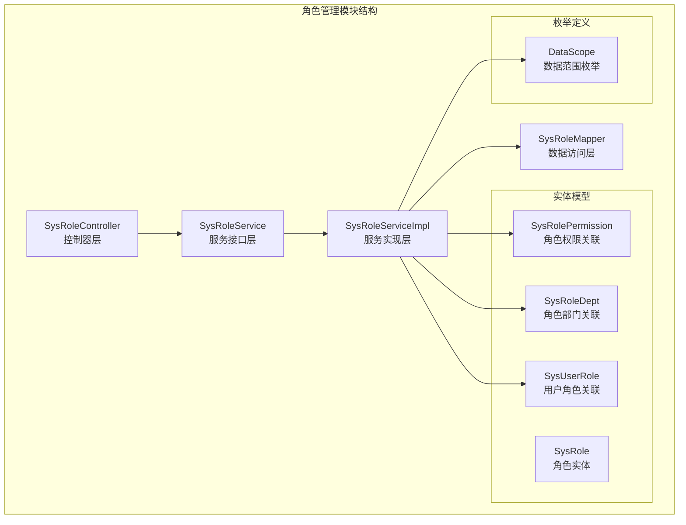
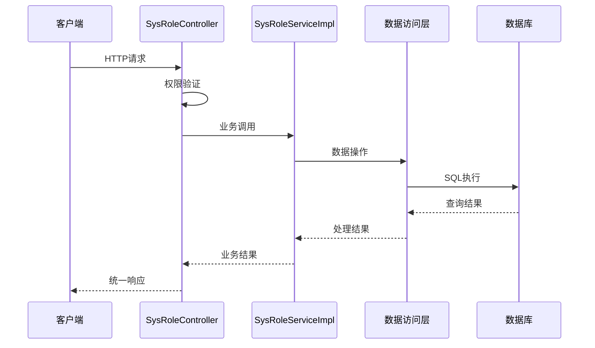
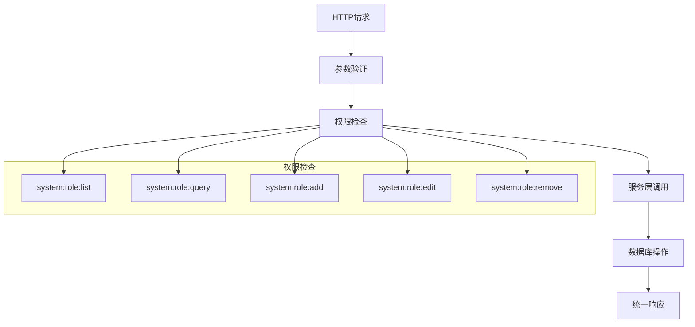
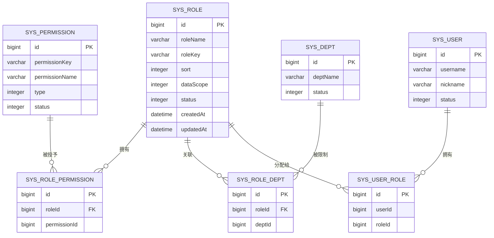
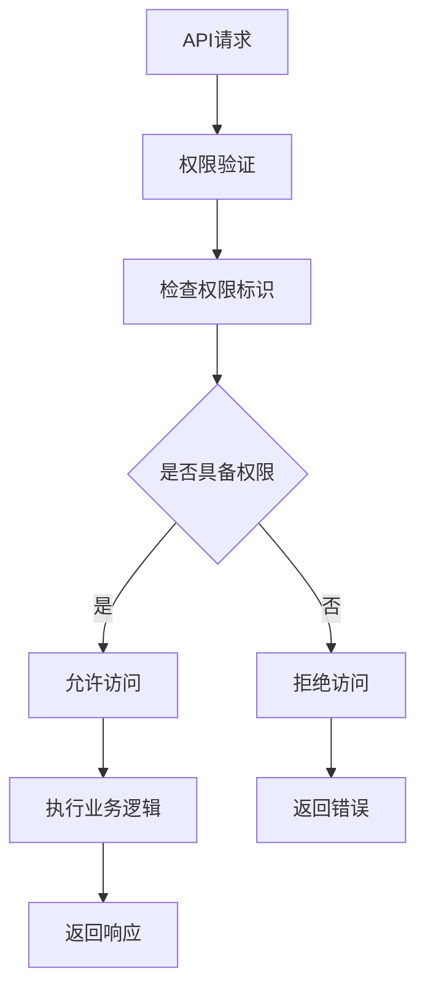
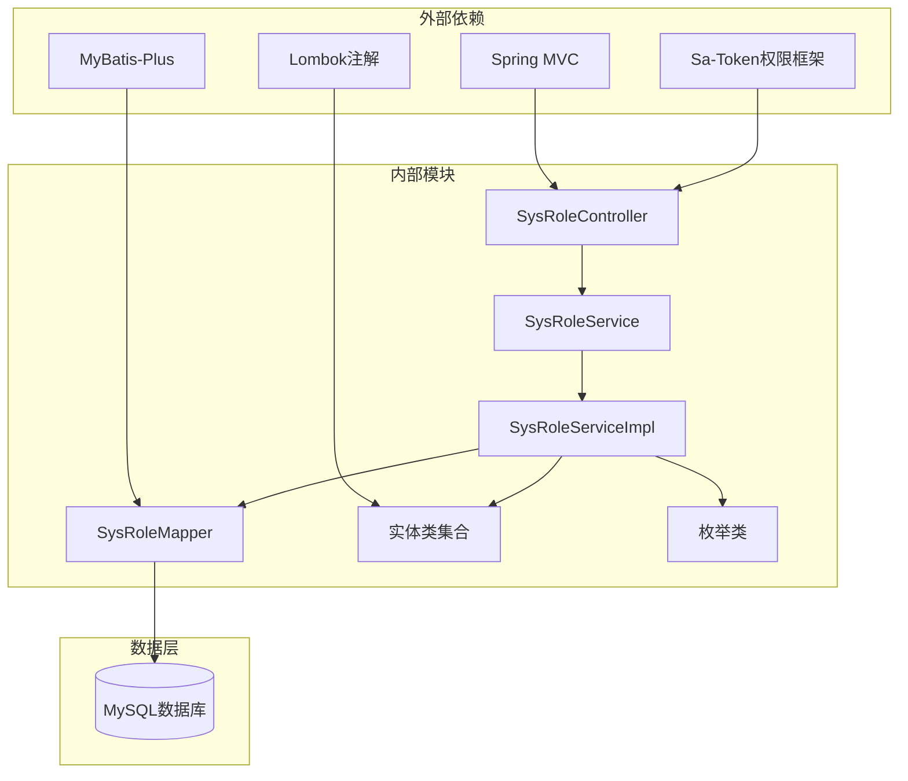
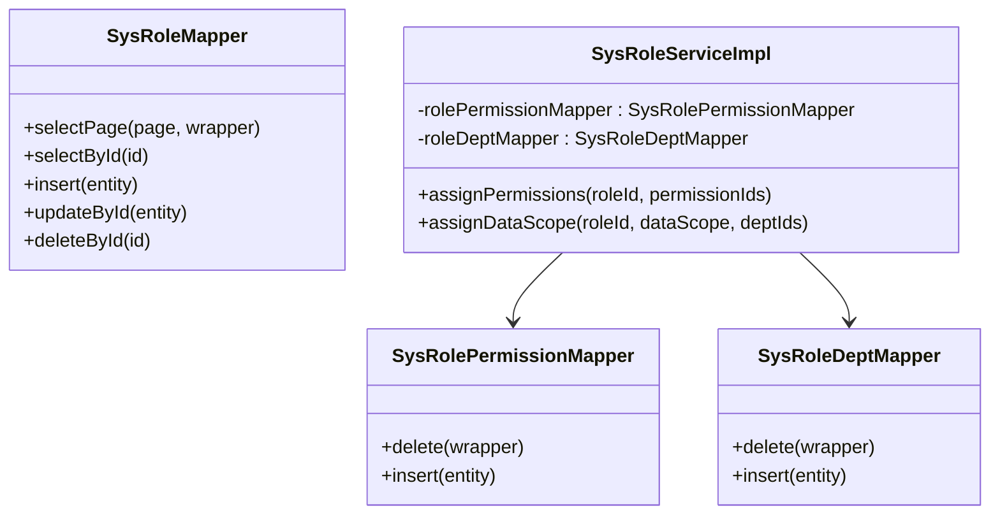
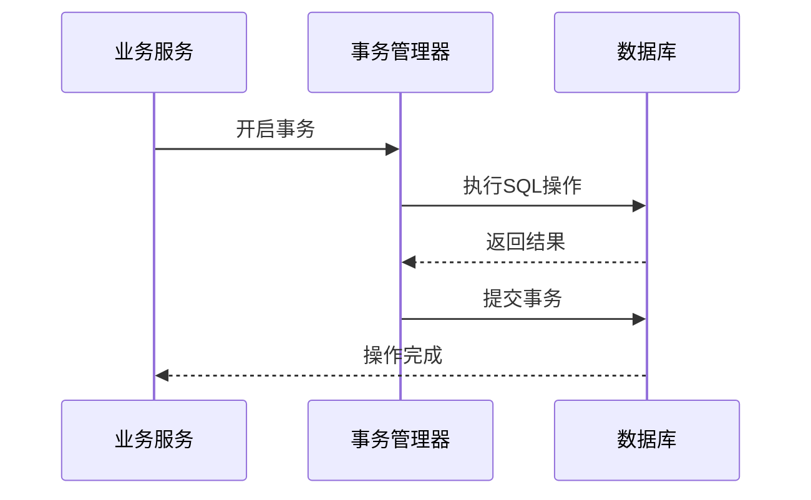

# 角色管理API

<cite>
**本文档引用的文件**
- [SysRoleController.java](file://oa-system/src/main/java/com/oa/admin/system/controller/SysRoleController.java)
- [SysRoleService.java](file://oa-system/src/main/java/com/oa/admin/system/service/SysRoleService.java)
- [SysRoleServiceImpl.java](file://oa-system/src/main/java/com/oa/admin/system/service/impl/SysRoleServiceImpl.java)
- [SysRole.java](file://oa-system/src/main/java/com/oa/admin/system/entity/SysRole.java)
- [SysRolePermission.java](file://oa-system/src/main/java/com/oa/admin/system/entity/SysRolePermission.java)
- [SysRoleDept.java](file://oa-system/src/main/java/com/oa/admin/system/entity/SysRoleDept.java)
- [SysUserRole.java](file://oa-system/src/main/java/com/oa/admin/system/entity/SysUserRole.java)
- [SysRoleMapper.java](file://oa-system/src/main/java/com/oa/admin/system/mapper/SysRoleMapper.java)
- [SysRolePermissionMapper.java](file://oa-system/src/main/java/com/oa/admin/system/mapper/SysRolePermissionMapper.java)
- [SysRoleDeptMapper.java](file://oa-system/src/main/java/com/oa/admin/system/mapper/SysRoleDeptMapper.java)
- [SysUserRoleMapper.java](file://oa-system/src/main/java/com/oa/admin/system/mapper/SysUserRoleMapper.java)
- [DataScope.java](file://oa-system/src/main/java/com/oa/admin/system/enums/DataScope.java)
- [BaseEntity.java](file://oa-common/src/main/java/com/oa/admin/common/entity/BaseEntity.java)
- [SysPermissionService.java](file://oa-system/src/main/java/com/oa/admin/system/service/SysPermissionService.java)
</cite>

## 目录
1. [简介](#简介)
2. [项目结构](#项目结构)
3. [核心组件](#核心组件)
4. [架构概览](#架构概览)
5. [详细组件分析](#详细组件分析)
6. [依赖关系分析](#依赖关系分析)
7. [性能考虑](#性能考虑)
8. [故障排除指南](#故障排除指南)
9. [结论](#结论)

## 简介

角色管理API是OA管理系统中的核心功能模块，负责系统中角色的全生命周期管理。该模块实现了完整的RESTful API设计，支持角色的增删改查操作，并提供了灵活的权限分配和数据范围控制机制。

本API遵循统一的响应格式规范，采用分页查询模式，支持按角色名称和状态进行过滤查询。系统通过权限注解实现细粒度的访问控制，确保只有具备相应权限的用户才能执行特定的操作。

## 项目结构

角色管理模块位于oa-system子项目中，采用标准的MVC架构模式：



**图表来源**
- [SysRoleController.java:17-78](file://oa-system/src/main/java/com/oa/admin/system/controller/SysRoleController.java#L17-L78)
- [SysRoleService.java:12-19](file://oa-system/src/main/java/com/oa/admin/system/service/SysRoleService.java#L12-L19)
- [SysRoleServiceImpl.java:26-79](file://oa-system/src/main/java/com/oa/admin/system/service/impl/SysRoleServiceImpl.java#L26-L79)

**章节来源**
- [SysRoleController.java:1-78](file://oa-system/src/main/java/com/oa/admin/system/controller/SysRoleController.java#L1-L78)
- [SysRoleService.java:1-20](file://oa-system/src/main/java/com/oa/admin/system/service/SysRoleService.java#L1-L20)
- [SysRoleServiceImpl.java:1-79](file://oa-system/src/main/java/com/oa/admin/system/service/impl/SysRoleServiceImpl.java#L1-L79)

## 核心组件

### 控制器层 - SysRoleController

控制器层负责处理HTTP请求和响应，提供RESTful API接口。每个接口都配备了相应的权限注解，确保系统的安全性。

主要特性：
- 基于Spring MVC的RESTful设计
- 统一的响应格式封装
- 权限级别的访问控制
- 分页查询支持

### 服务层 - SysRoleService

服务层定义了角色管理的核心业务逻辑接口，包括基础CRUD操作和高级功能如权限分配。

关键接口：
- 分页查询角色列表
- 角色权限分配
- 数据范围配置

### 实体层 - SysRole

角色实体类定义了角色的基本属性和数据库映射关系，继承自通用的基础实体类。

**章节来源**
- [SysRoleController.java:23-76](file://oa-system/src/main/java/com/oa/admin/system/controller/SysRoleController.java#L23-L76)
- [SysRoleService.java:12-19](file://oa-system/src/main/java/com/oa/admin/system/service/SysRoleService.java#L12-L19)
- [SysRole.java:13-25](file://oa-system/src/main/java/com/oa/admin/system/entity/SysRole.java#L13-L25)

## 架构概览

角色管理模块采用经典的三层架构设计，各层职责清晰分离：



**图表来源**
- [SysRoleController.java:23-76](file://oa-system/src/main/java/com/oa/admin/system/controller/SysRoleController.java#L23-L76)
- [SysRoleServiceImpl.java:32-77](file://oa-system/src/main/java/com/oa/admin/system/service/impl/SysRoleServiceImpl.java#L32-L77)

### 数据流图



**图表来源**
- [SysRoleController.java:24-56](file://oa-system/src/main/java/com/oa/admin/system/controller/SysRoleController.java#L24-L56)

## 详细组件分析

### 角色CRUD操作接口

#### 角色列表查询

**接口定义**
- 方法：GET
- 路径：`/api/v1/system/role`
- 权限：`system:role:list`

**请求参数**
| 参数名 | 类型 | 必填 | 默认值 | 描述 |
|--------|------|------|--------|------|
| roleName | String | 否 | "" | 角色名称关键词 |
| status | Integer | 否 | null | 角色状态 |
| page | Long | 否 | 1 | 页码 |
| pageSize | Long | 否 | 20 | 每页条数 |

**响应格式**
```json
{
  "code": 200,
  "msg": "成功",
  "data": {
    "records": [
      {
        "id": 1,
        "roleName": "管理员",
        "roleKey": "admin",
        "sort": 1,
        "dataScope": 1,
        "status": 1,
        "createdAt": "2024-01-01 12:00:00",
        "updatedAt": "2024-01-01 12:00:00"
      }
    ],
    "total": 1,
    "page": 1,
    "pageSize": 20
  }
}
```

#### 角色详情获取

**接口定义**
- 方法：GET
- 路径：`/api/v1/system/role/{id}`
- 权限：`system:role:query`

**路径参数**
| 参数名 | 类型 | 必填 | 描述 |
|--------|------|------|------|
| id | Long | 是 | 角色ID |

**响应格式**
```json
{
  "code": 200,
  "msg": "成功",
  "data": {
    "id": 1,
    "roleName": "管理员",
    "roleKey": "admin",
    "sort": 1,
    "dataScope": 1,
    "status": 1,
    "createdAt": "2024-01-01 12:00:00",
    "updatedAt": "2024-01-01 12:00:00"
  }
}
```

#### 角色创建

**接口定义**
- 方法：POST
- 路径：`/api/v1/system/role`
- 权限：`system:role:add`

**请求体参数**
| 参数名 | 类型 | 必填 | 描述 |
|--------|------|------|------|
| roleName | String | 是 | 角色名称 |
| roleKey | String | 是 | 角色标识符 |
| sort | Integer | 否 | 排序号 |
| dataScope | Integer | 否 | 数据范围 |
| status | Integer | 否 | 状态 |

**响应格式**
```json
{
  "code": 200,
  "msg": "成功",
  "data": {
    "id": 1,
    "roleName": "管理员",
    "roleKey": "admin",
    "sort": 1,
    "dataScope": 1,
    "status": 1,
    "createdAt": "2024-01-01 12:00:00",
    "updatedAt": "2024-01-01 12:00:00"
  }
}
```

#### 角色更新

**接口定义**
- 方法：PUT
- 路径：`/api/v1/system/role/{id}`
- 权限：`system:role:edit`

**路径参数**
| 参数名 | 类型 | 必填 | 描述 |
|--------|------|------|------|
| id | Long | 是 | 角色ID |

**请求体参数**
| 参数名 | 类型 | 必填 | 描述 |
|--------|------|------|------|
| roleName | String | 是 | 角色名称 |
| roleKey | String | 是 | 角色标识符 |
| sort | Integer | 否 | 排序号 |
| dataScope | Integer | 否 | 数据范围 |
| status | Integer | 否 | 状态 |

**响应格式**
```json
{
  "code": 200,
  "msg": "成功",
  "data": {
    "id": 1,
    "roleName": "管理员",
    "roleKey": "admin",
    "sort": 1,
    "dataScope": 1,
    "status": 1,
    "createdAt": "2024-01-01 12:00:00",
    "updatedAt": "2024-01-01 12:00:00"
  }
}
```

#### 角色删除

**接口定义**
- 方法：DELETE
- 路径：`/api/v1/system/role/{id}`
- 权限：`system:role:remove`

**路径参数**
| 参数名 | 类型 | 必填 | 描述 |
|--------|------|------|------|
| id | Long | 是 | 角色ID |

**响应格式**
```json
{
  "code": 200,
  "msg": "成功",
  "data": null
}
```

### 角色权限分配接口

#### 权限分配

**接口定义**
- 方法：POST
- 路径：`/api/v1/system/role/{id}/permissions`
- 权限：`system:role:edit`

**请求体参数**
```json
{
  "permissionIds": [1, 2, 3, 4]
}
```

**响应格式**
```json
{
  "code": 200,
  "msg": "成功",
  "data": null
}
```

#### 数据范围分配

**接口定义**
- 方法：POST
- 路径：`/api/v1/system/role/{id}/data-scope`
- 权限：`system:role:edit`

**请求体参数**
```json
{
  "dataScope": 3,
  "deptIds": [1, 2, 3]
}
```

**数据范围枚举**
- 1: 全部数据
- 2: 部门数据
- 3: 自定义数据

**响应格式**
```json
{
  "code": 200,
  "msg": "成功",
  "data": null
}
```

**章节来源**
- [SysRoleController.java:23-76](file://oa-system/src/main/java/com/oa/admin/system/controller/SysRoleController.java#L23-L76)

### 数据模型关系



**图表来源**
- [SysRole.java:16-25](file://oa-system/src/main/java/com/oa/admin/system/entity/SysRole.java#L16-L25)
- [SysRolePermission.java:14-18](file://oa-system/src/main/java/com/oa/admin/system/entity/SysRolePermission.java#L14-L18)
- [SysRoleDept.java:14-18](file://oa-system/src/main/java/com/oa/admin/system/entity/SysRoleDept.java#L14-L18)
- [SysUserRole.java:14-18](file://oa-system/src/main/java/com/oa/admin/system/entity/SysUserRole.java#L14-L18)

### 权限验证机制

系统采用基于注解的权限验证机制，每个API接口都配置了相应的权限标识：



**权限标识对照表**

| 功能模块 | 权限标识 | 描述 |
|----------|----------|------|
| 角色列表查询 | `system:role:list` | 查询角色列表权限 |
| 角色详情获取 | `system:role:query` | 获取角色详情权限 |
| 角色创建 | `system:role:add` | 创建角色权限 |
| 角色更新 | `system:role:edit` | 更新角色权限 |
| 角色删除 | `system:role:remove` | 删除角色权限 |

**章节来源**
- [SysRoleController.java:24-56](file://oa-system/src/main/java/com/oa/admin/system/controller/SysRoleController.java#L24-L56)

## 依赖关系分析

### 组件依赖图



**图表来源**
- [SysRoleController.java:3-21](file://oa-system/src/main/java/com/oa/admin/system/controller/SysRoleController.java#L3-L21)
- [SysRoleServiceImpl.java:26-31](file://oa-system/src/main/java/com/oa/admin/system/service/impl/SysRoleServiceImpl.java#L26-L31)

### 数据访问层设计



**图表来源**
- [SysRoleMapper.java:10-12](file://oa-system/src/main/java/com/oa/admin/system/mapper/SysRoleMapper.java#L10-L12)
- [SysRolePermissionMapper.java:10-12](file://oa-system/src/main/java/com/oa/admin/system/mapper/SysRolePermissionMapper.java#L10-L12)
- [SysRoleServiceImpl.java:29-30](file://oa-system/src/main/java/com/oa/admin/system/service/impl/SysRoleServiceImpl.java#L29-L30)

**章节来源**
- [SysRoleServiceImpl.java:42-77](file://oa-system/src/main/java/com/oa/admin/system/service/impl/SysRoleServiceImpl.java#L42-L77)
- [SysRolePermissionMapper.java:1-13](file://oa-system/src/main/java/com/oa/admin/system/mapper/SysRolePermissionMapper.java#L1-L13)
- [SysRoleDeptMapper.java:1-13](file://oa-system/src/main/java/com/oa/admin/system/mapper/SysRoleDeptMapper.java#L1-L13)

## 性能考虑

### 查询优化策略

1. **分页查询优化**
   - 使用MyBatis-Plus内置分页插件
   - 支持大数据量场景下的高效查询
   - 默认每页20条记录，可根据需求调整

2. **索引设计建议**
   - 在`role_name`和`status`字段上建立复合索引
   - 在`role_key`字段上建立唯一索引
   - 在关联表的外键字段上建立索引

3. **缓存策略**
   - 对常用的角色查询结果进行缓存
   - 缓存角色权限映射关系
   - 实现缓存失效和更新机制

### 事务管理

服务层采用声明式事务管理，确保数据一致性：



**图表来源**
- [SysRoleServiceImpl.java:43-55](file://oa-system/src/main/java/com/oa/admin/system/service/impl/SysRoleServiceImpl.java#L43-L55)

## 故障排除指南

### 常见问题及解决方案

1. **权限不足错误**
   - 现象：返回403 Forbidden状态
   - 原因：用户缺少相应权限标识
   - 解决：为用户分配对应的角色权限

2. **数据重复错误**
   - 现象：插入或更新失败
   - 原因：role_key存在重复
   - 解决：确保role_key的唯一性

3. **外键约束错误**
   - 现象：删除角色时报错
   - 原因：存在用户关联或权限关联
   - 解决：先清理关联数据再删除

### 错误码定义

| 错误码 | 描述 | 说明 |
|--------|------|------|
| 200 | 成功 | 操作成功 |
| 401 | 未授权 | 用户未登录 |
| 403 | 禁止访问 | 权限不足 |
| 404 | 未找到 | 资源不存在 |
| 500 | 服务器错误 | 服务器异常 |

**章节来源**
- [SysRoleServiceImpl.java:61-62](file://oa-system/src/main/java/com/oa/admin/system/service/impl/SysRoleServiceImpl.java#L61-L62)

## 结论

角色管理API模块设计合理，实现了完整的角色生命周期管理功能。通过清晰的分层架构、完善的权限控制和标准化的响应格式，为整个OA系统提供了可靠的角色管理基础。

模块的主要优势包括：
- 完整的CRUD操作支持
- 灵活的权限分配机制
- 统一的响应格式规范
- 细粒度的权限控制
- 良好的扩展性设计

未来可以考虑的功能增强：
- 添加角色继承机制
- 实现权限的动态缓存
- 增加审计日志功能
- 优化批量操作性能