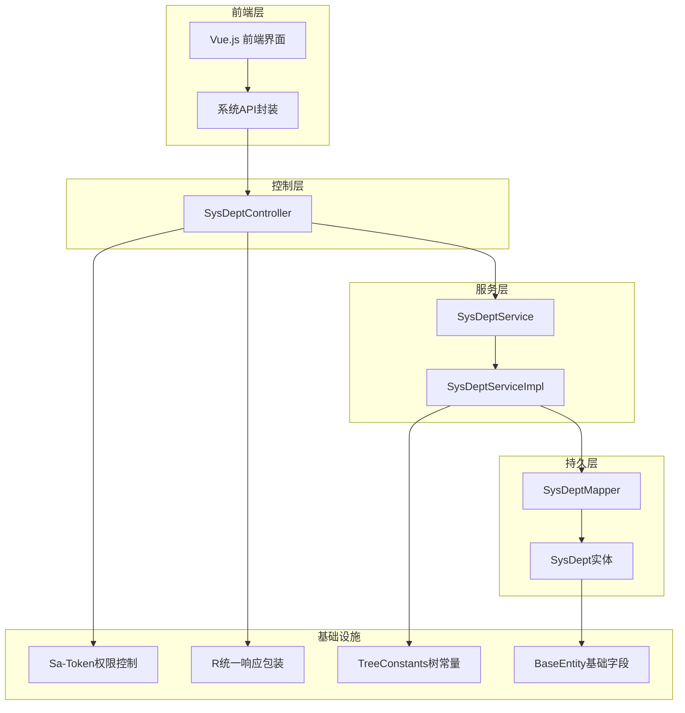
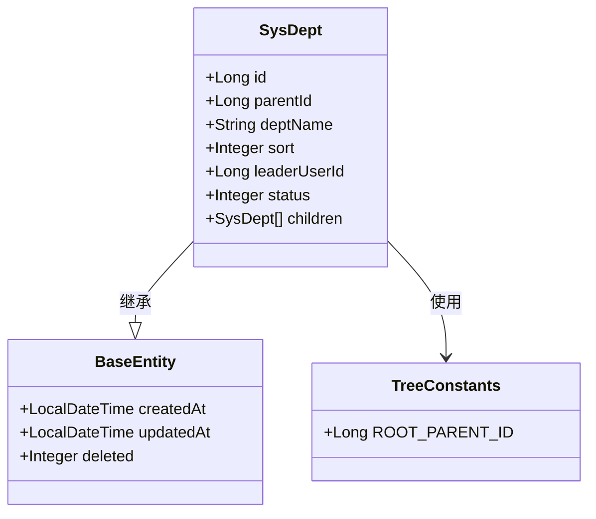
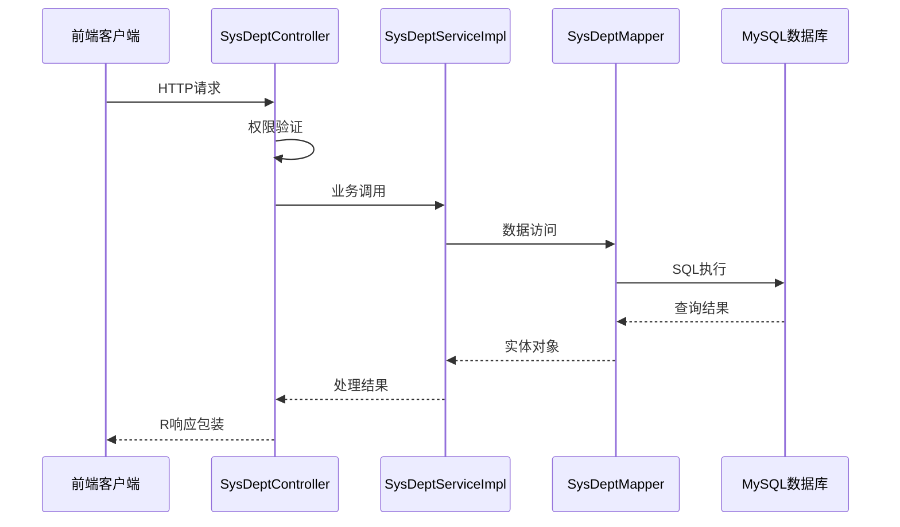
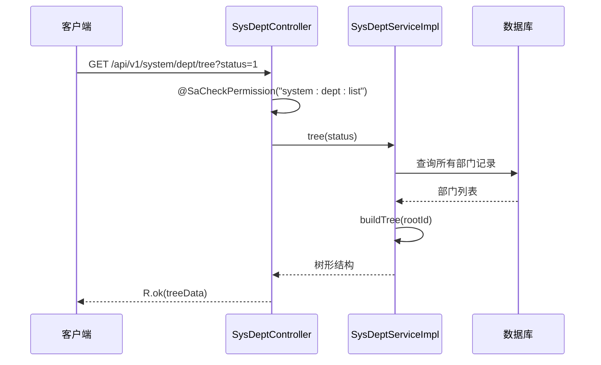
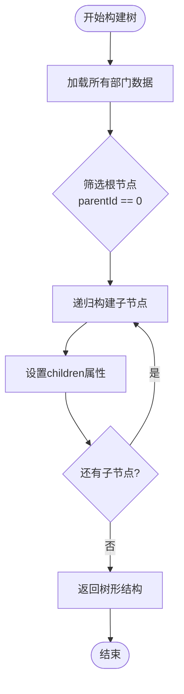
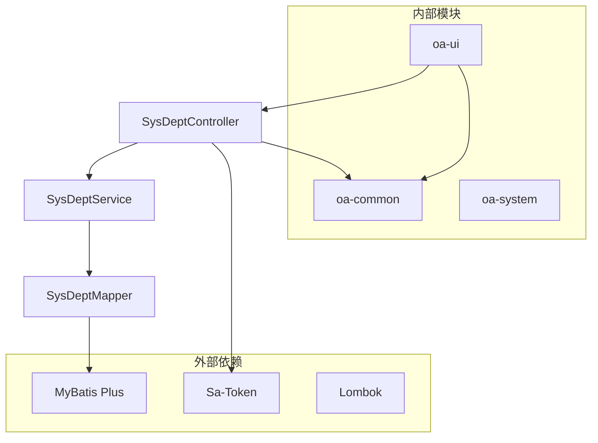

# 部门管理API

<cite>
**本文档引用的文件**
- [SysDeptController.java](file://oa-system/src/main/java/com/oa/admin/system/controller/SysDeptController.java)
- [SysDeptService.java](file://oa-system/src/main/java/com/oa/admin/system/service/SysDeptService.java)
- [SysDeptServiceImpl.java](file://oa-system/src/main/java/com/oa/admin/system/service/impl/SysDeptServiceImpl.java)
- [SysDeptMapper.java](file://oa-system/src/main/java/com/oa/admin/system/mapper/SysDeptMapper.java)
- [SysDept.java](file://oa-system/src/main/java/com/oa/admin/system/entity/SysDept.java)
- [TreeConstants.java](file://oa-common/src/main/java/com/oa/admin/common/constant/TreeConstants.java)
- [BaseEntity.java](file://oa-common/src/main/java/com/oa/admin/common/entity/BaseEntity.java)
- [R.java](file://oa-common/src/main/java/com/oa/admin/common/result/R.java)
- [V1__init_sys_tables.sql](file://oa-app/src/main/resources/db/migration/V1__init_sys_tables.sql)
- [V11__system_management_permissions.sql](file://oa-app/src/main/resources/db/migration/V11__system_management_permissions.sql)
- [SaTokenConfig.java](file://oa-system/src/main/java/com/oa/admin/system/config/SaTokenConfig.java)
- [StpInterfaceImpl.java](file://oa-system/src/main/java/com/oa/admin/system/config/StpInterfaceImpl.java)
- [system.ts](file://oa-ui/src/types/system.ts)
- [system.ts](file://oa-ui/src/api/system.ts)
- [index.vue](file://oa-ui/src/views/system/dept/index.vue)
</cite>

## 目录
1. [简介](#简介)
2. [项目结构](#项目结构)
3. [核心组件](#核心组件)
4. [架构概览](#架构概览)
5. [详细组件分析](#详细组件分析)
6. [依赖分析](#依赖分析)
7. [性能考虑](#性能考虑)
8. [故障排除指南](#故障排除指南)
9. [结论](#结论)

## 简介

本文件为OA系统部门管理模块的完整API接口文档。该模块实现了企业组织架构中的部门CRUD操作，支持树形结构管理，包括父子部门关系、部门层级查询、部门移动调整等功能。系统采用Spring Boot + MyBatis Plus + Sa-Token的架构设计，提供RESTful API接口，并通过权限控制确保数据安全。

## 项目结构

部门管理模块位于oa-system子项目中，采用标准的分层架构设计：

**图表来源**
- [SysDeptController.java:16-69](file://oa-system/src/main/java/com/oa/admin/system/controller/SysDeptController.java#L16-L69)
- [SysDeptServiceImpl.java:17-43](file://oa-system/src/main/java/com/oa/admin/system/service/impl/SysDeptServiceImpl.java#L17-L43)
- [SysDeptMapper.java:10-12](file://oa-system/src/main/java/com/oa/admin/system/mapper/SysDeptMapper.java#L10-L12)

**章节来源**
- [SysDeptController.java:1-70](file://oa-system/src/main/java/com/oa/admin/system/controller/SysDeptController.java#L1-L70)
- [SysDeptService.java:1-17](file://oa-system/src/main/java/com/oa/admin/system/service/SysDeptService.java#L1-L17)
- [SysDeptServiceImpl.java:1-44](file://oa-system/src/main/java/com/oa/admin/system/service/impl/SysDeptServiceImpl.java#L1-L44)

## 核心组件

### 数据模型

部门实体采用MyBatis Plus注解映射，支持树形结构扩展：

**图表来源**
- [SysDept.java:19-30](file://oa-system/src/main/java/com/oa/admin/system/entity/SysDept.java#L19-L30)
- [BaseEntity.java:14-25](file://oa-common/src/main/java/com/oa/admin/common/entity/BaseEntity.java#L14-L25)
- [TreeConstants.java:6-11](file://oa-common/src/main/java/com/oa/admin/common/constant/TreeConstants.java#L6-L11)

### 权限控制

系统使用Sa-Token进行权限验证，支持细粒度的API权限控制：

| 权限标识 | 功能描述 | HTTP方法 | URL路径 |
|---------|----------|----------|---------|
| system:dept:list | 部门列表查询 | GET | `/api/v1/system/dept/tree` |
| system:dept:query | 部门详情获取 | GET | `/api/v1/system/dept/{id}` |
| system:dept:add | 部门创建 | POST | `/api/v1/system/dept` |
| system:dept:edit | 部门更新 | PUT | `/api/v1/system/dept/{id}` |
| system:dept:remove | 部门删除 | DELETE | `/api/v1/system/dept/{id}` |

**章节来源**
- [V11__system_management_permissions.sql:14-18](file://oa-app/src/main/resources/db/migration/V11__system_management_permissions.sql#L14-L18)
- [SaTokenConfig.java:15-23](file://oa-system/src/main/java/com/oa/admin/system/config/SaTokenConfig.java#L15-L23)
- [StpInterfaceImpl.java:33-51](file://oa-system/src/main/java/com/oa/admin/system/config/StpInterfaceImpl.java#L33-L51)

## 架构概览

部门管理模块采用经典的MVC架构模式，结合分层设计实现清晰的职责分离：

**图表来源**
- [SysDeptController.java:22-68](file://oa-system/src/main/java/com/oa/admin/system/controller/SysDeptController.java#L22-L68)
- [SysDeptServiceImpl.java:18-43](file://oa-system/src/main/java/com/oa/admin/system/service/impl/SysDeptServiceImpl.java#L18-L43)
- [SysDeptMapper.java:10-12](file://oa-system/src/main/java/com/oa/admin/system/mapper/SysDeptMapper.java#L10-L12)

## 详细组件分析

### 控制器层

SysDeptController提供完整的RESTful API接口，每个接口都配有相应的权限注解：

#### 部门树形结构查询

**图表来源**
- [SysDeptController.java:22-27](file://oa-system/src/main/java/com/oa/admin/system/controller/SysDeptController.java#L22-L27)
- [SysDeptServiceImpl.java:20-34](file://oa-system/src/main/java/com/oa/admin/system/service/impl/SysDeptServiceImpl.java#L20-L34)

#### 部门列表查询

支持按状态过滤的部门列表查询，自动按排序号升序排列：

**章节来源**
- [SysDeptController.java:29-40](file://oa-system/src/main/java/com/oa/admin/system/controller/SysDeptController.java#L29-L40)
- [SysDeptServiceImpl.java:36-42](file://oa-system/src/main/java/com/oa/admin/system/service/impl/SysDeptServiceImpl.java#L36-L42)

### 服务层

SysDeptServiceImpl实现部门树形结构构建算法，支持动态层级查询：

#### 树形结构构建算法

**图表来源**
- [SysDeptServiceImpl.java:29-34](file://oa-system/src/main/java/com/oa/admin/system/service/impl/SysDeptServiceImpl.java#L29-L34)
- [TreeConstants.java:7-7](file://oa-common/src/main/java/com/oa/admin/common/constant/TreeConstants.java#L7-L7)

**章节来源**
- [SysDeptService.java:11-16](file://oa-system/src/main/java/com/oa/admin/system/service/SysDeptService.java#L11-L16)
- [SysDeptServiceImpl.java:18-43](file://oa-system/src/main/java/com/oa/admin/system/service/impl/SysDeptServiceImpl.java#L18-L43)

### 持久层

SysDeptMapper继承MyBatis Plus的BaseMapper，自动获得CRUD能力：

**章节来源**
- [SysDeptMapper.java:10-12](file://oa-system/src/main/java/com/oa/admin/system/mapper/SysDeptMapper.java#L10-L12)

## 依赖分析

部门管理模块的依赖关系清晰，遵循单一职责原则：

**图表来源**
- [SysDeptController.java:3-9](file://oa-system/src/main/java/com/oa/admin/system/controller/SysDeptController.java#L3-L9)
- [SysDeptServiceImpl.java:3-8](file://oa-system/src/main/java/com/oa/admin/system/service/impl/SysDeptServiceImpl.java#L3-L8)

**章节来源**
- [SysDeptController.java:1-70](file://oa-system/src/main/java/com/oa/admin/system/controller/SysDeptController.java#L1-L70)
- [SysDeptService.java:1-17](file://oa-system/src/main/java/com/oa/admin/system/service/SysDeptService.java#L1-L17)

## 性能考虑

### 数据库优化

1. **索引设计**：部门表在parent_id字段建立索引，支持高效的层级查询
2. **查询优化**：树形结构查询采用单次全表扫描后内存构建，避免递归查询
3. **排序优化**：默认按sort字段升序排列，支持快速定位部门顺序

### 缓存策略

建议在高并发场景下引入Redis缓存：
- 部门树形结构缓存，设置合理的过期时间
- 用户部门关联信息缓存
- 权限数据缓存

## 故障排除指南

### 常见问题及解决方案

#### 权限不足错误
**现象**：返回403 Forbidden或权限验证失败
**原因**：用户缺少相应的system:dept:*权限
**解决**：检查用户角色是否分配了对应的部门管理权限

#### 数据库连接异常
**现象**：查询超时或连接失败
**原因**：数据库连接池耗尽或SQL执行时间过长
**解决**：检查数据库连接配置，优化查询语句

#### 树形结构异常
**现象**：部门层级显示错误或循环引用
**原因**：parentId设置不正确或存在循环依赖
**解决**：验证parentId的有效性，确保无环路设计

**章节来源**
- [SaTokenConfig.java:15-23](file://oa-system/src/main/java/com/oa/admin/system/config/SaTokenConfig.java#L15-L23)
- [StpInterfaceImpl.java:33-51](file://oa-system/src/main/java/com/oa/admin/system/config/StpInterfaceImpl.java#L33-L51)

## 结论

部门管理模块提供了完整的组织架构管理能力，具有以下特点：

1. **完整的CRUD功能**：支持部门的创建、查询、更新、删除操作
2. **树形结构管理**：原生支持多层级部门关系，便于组织架构展示
3. **权限安全保障**：基于Sa-Token的细粒度权限控制
4. **标准化响应**：统一的R响应包装，便于前端处理
5. **可扩展设计**：清晰的分层架构，易于功能扩展和维护

该模块为OA系统的组织管理提供了坚实的基础，能够满足大多数企业的部门管理需求。