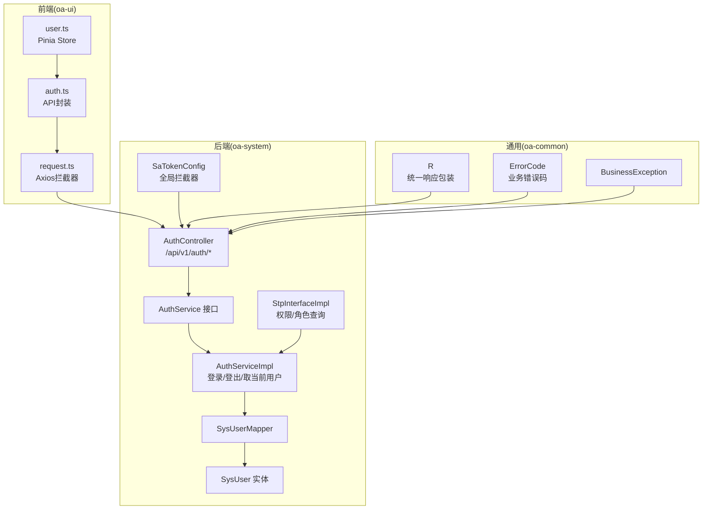
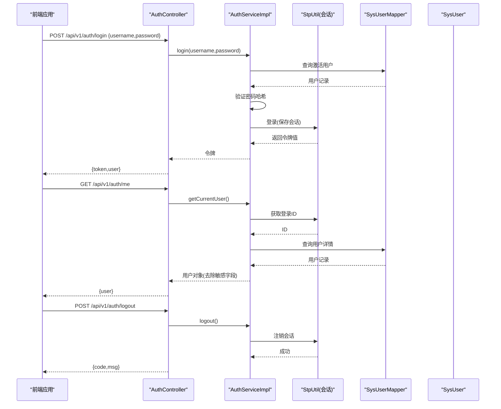
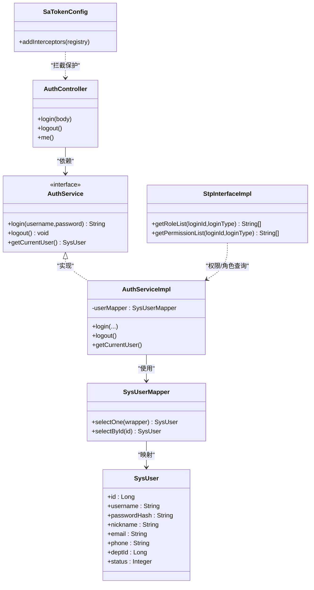

# 认证授权API

<cite>
**本文引用的文件**
- [AuthController.java](file://oa-system/src/main/java/com/oa/admin/system/controller/AuthController.java)
- [AuthService.java](file://oa-system/src/main/java/com/oa/admin/system/service/AuthService.java)
- [AuthServiceImpl.java](file://oa-system/src/main/java/com/oa/admin/system/service/impl/AuthServiceImpl.java)
- [SaTokenConfig.java](file://oa-system/src/main/java/com/oa/admin/system/config/SaTokenConfig.java)
- [StpInterfaceImpl.java](file://oa-system/src/main/java/com/oa/admin/system/config/StpInterfaceImpl.java)
- [SysUser.java](file://oa-system/src/main/java/com/oa/admin/system/entity/SysUser.java)
- [SysUserMapper.java](file://oa-system/src/main/java/com/oa/admin/system/mapper/SysUserMapper.java)
- [R.java](file://oa-common/src/main/java/com/oa/admin/common/result/R.java)
- [ErrorCode.java](file://oa-common/src/main/java/com/oa/admin/common/result/ErrorCode.java)
- [BusinessException.java](file://oa-common/src/main/java/com/oa/admin/common/exception/BusinessException.java)
- [V1__init_sys_tables.sql](file://oa-app/src/main/resources/db/migration/V1__init_sys_tables.sql)
- [auth.ts](file://oa-ui/src/api/auth.ts)
- [user.ts](file://oa-ui/src/stores/user.ts)
- [request.ts](file://oa-ui/src/utils/request.ts)
- [AuthController.java（测试）](file://oa-system/src/test/java/com/oa/admin/system/service/AuthServiceTest.java)
</cite>

## 目录
1. [简介](#简介)
2. [项目结构](#项目结构)
3. [核心组件](#核心组件)
4. [架构总览](#架构总览)
5. [详细组件分析](#详细组件分析)
6. [依赖关系分析](#依赖关系分析)
7. [性能与安全考虑](#性能与安全考虑)
8. [故障排查指南](#故障排查指南)
9. [结论](#结论)
10. [附录：接口规范与示例](#附录接口规范与示例)

## 简介
本文件为认证授权模块的API接口文档，覆盖以下核心能力：
- 用户登录：用户名/密码认证，返回令牌与当前用户信息
- 用户登出：使当前会话失效
- 获取当前用户：通过已登录会话获取用户信息
- 令牌管理：基于 Sa-Token 的 satoken 请求头传递机制
- 权限体系：基于 RBAC 的角色与权限映射
- 错误码与响应格式：统一的业务错误码与响应包装
- 常见场景与最佳实践：登录成功后用户信息结构、权限数据、令牌过期处理与刷新建议

## 项目结构
认证授权模块位于后端子模块 oa-system 中，采用 Spring MVC 控制器 + Sa-Token 拦截器 + 自定义权限接口实现的分层设计；前端通过 Pinia Store 管理用户状态与本地存储的令牌，并在请求拦截器中注入 satoken 头。

图表来源
- [AuthController.java:14-37](file://oa-system/src/main/java/com/oa/admin/system/controller/AuthController.java#L14-L37)
- [AuthService.java:8-15](file://oa-system/src/main/java/com/oa/admin/system/service/AuthService.java#L8-L15)
- [AuthServiceImpl.java:18-52](file://oa-system/src/main/java/com/oa/admin/system/service/impl/AuthServiceImpl.java#L18-L52)
- [SaTokenConfig.java:12-24](file://oa-system/src/main/java/com/oa/admin/system/config/SaTokenConfig.java#L12-L24)
- [StpInterfaceImpl.java:24-74](file://oa-system/src/main/java/com/oa/admin/system/config/StpInterfaceImpl.java#L24-L74)
- [SysUserMapper.java:10-12](file://oa-system/src/main/java/com/oa/admin/system/mapper/SysUserMapper.java#L10-L12)
- [SysUser.java:13-26](file://oa-system/src/main/java/com/oa/admin/system/entity/SysUser.java#L13-L26)
- [R.java:9-43](file://oa-common/src/main/java/com/oa/admin/common/result/R.java#L9-L43)
- [ErrorCode.java:11-44](file://oa-common/src/main/java/com/oa/admin/common/result/ErrorCode.java#L11-L44)
- [BusinessException.java:9-22](file://oa-common/src/main/java/com/oa/admin/common/exception/BusinessException.java#L9-L22)
- [auth.ts:1-14](file://oa-ui/src/api/auth.ts#L1-L14)
- [user.ts:1-32](file://oa-ui/src/stores/user.ts#L1-L32)
- [request.ts:1-42](file://oa-ui/src/utils/request.ts#L1-L42)

章节来源
- [AuthController.java:14-37](file://oa-system/src/main/java/com/oa/admin/system/controller/AuthController.java#L14-L37)
- [SaTokenConfig.java:12-24](file://oa-system/src/main/java/com/oa/admin/system/config/SaTokenConfig.java#L12-L24)
- [auth.ts:1-14](file://oa-ui/src/api/auth.ts#L1-L14)
- [request.ts:1-42](file://oa-ui/src/utils/request.ts#L1-L42)

## 核心组件
- 控制器层：提供 /api/v1/auth/login、/api/v1/auth/logout、/api/v1/auth/me 三个接口
- 服务层：实现登录、登出、获取当前用户的核心逻辑
- 权限扩展：基于 Sa-Token 的 StpInterface 扩展，按用户角色映射权限列表与角色列表
- 统一响应：R<T> 包装 code/msg/data/timestamp
- 错误码：ErrorCode 定义认证相关错误码
- 前端集成：auth.ts 封装接口；request.ts 注入 satoken 头并处理 2004 过期跳转；Pinia Store 管理 token 与用户信息

章节来源
- [AuthController.java:14-37](file://oa-system/src/main/java/com/oa/admin/system/controller/AuthController.java#L14-L37)
- [AuthService.java:8-15](file://oa-system/src/main/java/com/oa/admin/system/service/AuthService.java#L8-L15)
- [StpInterfaceImpl.java:24-74](file://oa-system/src/main/java/com/oa/admin/system/config/StpInterfaceImpl.java#L24-L74)
- [R.java:9-43](file://oa-common/src/main/java/com/oa/admin/common/result/R.java#L9-L43)
- [ErrorCode.java:11-44](file://oa-common/src/main/java/com/oa/admin/common/result/ErrorCode.java#L11-L44)
- [auth.ts:1-14](file://oa-ui/src/api/auth.ts#L1-L14)
- [request.ts:10-39](file://oa-ui/src/utils/request.ts#L10-L39)
- [user.ts:6-31](file://oa-ui/src/stores/user.ts#L6-L31)

## 架构总览
认证授权的整体交互流程如下：

图表来源
- [AuthController.java:20-36](file://oa-system/src/main/java/com/oa/admin/system/controller/AuthController.java#L20-L36)
- [AuthServiceImpl.java:23-51](file://oa-system/src/main/java/com/oa/admin/system/service/impl/AuthServiceImpl.java#L23-L51)
- [SysUserMapper.java:10-12](file://oa-system/src/main/java/com/oa/admin/system/mapper/SysUserMapper.java#L10-L12)
- [SysUser.java:13-26](file://oa-system/src/main/java/com/oa/admin/system/entity/SysUser.java#L13-L26)

## 详细组件分析

### 控制器：AuthController
- 路由前缀：/api/v1/auth
- 方法：
  - POST /login：接收 {username,password}，返回 {token,user}
  - POST /logout：清空当前会话
  - GET /me：返回当前登录用户信息

章节来源
- [AuthController.java:14-37](file://oa-system/src/main/java/com/oa/admin/system/controller/AuthController.java#L14-L37)

### 服务：AuthServiceImpl
- 登录流程：
  - 根据用户名与状态查询用户
  - 使用 BCrypt 校验密码哈希
  - 登录成功后生成会话令牌
- 登出流程：
  - 调用 Sa-Token 注销当前会话
- 获取当前用户：
  - 从会话中取出登录ID
  - 查询用户详情并移除密码哈希字段

章节来源
- [AuthServiceImpl.java:23-51](file://oa-system/src/main/java/com/oa/admin/system/service/impl/AuthServiceImpl.java#L23-L51)
- [SysUserMapper.java:10-12](file://oa-system/src/main/java/com/oa/admin/system/mapper/SysUserMapper.java#L10-L12)
- [SysUser.java:13-26](file://oa-system/src/main/java/com/oa/admin/system/entity/SysUser.java#L13-L26)

### 权限扩展：StpInterfaceImpl
- 角色列表：根据用户ID查询其角色ID集合，再查询启用的角色键
- 权限列表：根据角色ID集合查询权限ID集合，再查询启用的权限路径

章节来源
- [StpInterfaceImpl.java:33-65](file://oa-system/src/main/java/com/oa/admin/system/config/StpInterfaceImpl.java#L33-L65)

### 前端集成
- 请求拦截器：自动将本地存储的 token 写入 satoken 请求头
- 响应拦截器：当收到 2004（登录过期）时清理本地 token 并跳转到登录页
- Pinia Store：维护 token 与用户信息，提供登录、获取当前用户、登出操作

章节来源
- [request.ts:10-39](file://oa-ui/src/utils/request.ts#L10-L39)
- [user.ts:6-31](file://oa-ui/src/stores/user.ts#L6-L31)
- [auth.ts:1-14](file://oa-ui/src/api/auth.ts#L1-L14)

## 依赖关系分析

图表来源
- [AuthController.java:14-37](file://oa-system/src/main/java/com/oa/admin/system/controller/AuthController.java#L14-L37)
- [AuthService.java:8-15](file://oa-system/src/main/java/com/oa/admin/system/service/AuthService.java#L8-L15)
- [AuthServiceImpl.java:18-52](file://oa-system/src/main/java/com/oa/admin/system/service/impl/AuthServiceImpl.java#L18-L52)
- [SysUserMapper.java:10-12](file://oa-system/src/main/java/com/oa/admin/system/mapper/SysUserMapper.java#L10-L12)
- [SysUser.java:13-26](file://oa-system/src/main/java/com/oa/admin/system/entity/SysUser.java#L13-L26)
- [SaTokenConfig.java:12-24](file://oa-system/src/main/java/com/oa/admin/system/config/SaTokenConfig.java#L12-L24)
- [StpInterfaceImpl.java:24-74](file://oa-system/src/main/java/com/oa/admin/system/config/StpInterfaceImpl.java#L24-L74)

## 性能与安全考虑
- 密码验证：使用 BCrypt 哈希校验，避免明文存储与暴力破解风险
- 会话存储：基于 Sa-Token 的服务端会话，支持跨请求保持登录态
- 敏感字段：返回用户信息时移除密码哈希，降低泄露风险
- 统一响应：R<T> 统一封装，便于前端统一处理
- 错误码：明确区分“未登录/过期”“无权限”“登录失败”等场景

[本节为通用指导，不直接分析具体文件]

## 故障排查指南
- 登录失败（用户名或密码错误）
  - 触发条件：用户不存在或密码哈希不匹配
  - 行为：抛出业务异常，错误码 2003
- 未登录或会话过期
  - 触发条件：访问受保护接口但未携带有效会话
  - 行为：响应错误码 2001 或 2004；前端拦截器检测到 2004 时清除 token 并跳转登录
- 当前用户不存在
  - 触发条件：会话存在但对应用户被删除或禁用
  - 行为：抛出业务异常，错误码 2001

章节来源
- [AuthServiceImpl.java:30-48](file://oa-system/src/main/java/com/oa/admin/system/service/impl/AuthServiceImpl.java#L30-L48)
- [ErrorCode.java:17-21](file://oa-common/src/main/java/com/oa/admin/common/result/ErrorCode.java#L17-L21)
- [request.ts:25-28](file://oa-ui/src/utils/request.ts#L25-L28)

## 结论
本模块以 Sa-Token 为核心实现认证与权限控制，结合统一响应与错误码体系，提供了简洁可靠的登录、登出与当前用户查询能力。前端通过拦截器自动注入令牌并在过期时自动跳转，形成闭环的用户体验。建议在生产环境中配合 HTTPS、会话超时策略与安全审计进一步加固。

[本节为总结性内容，不直接分析具体文件]

## 附录：接口规范与示例

### 统一响应格式
- 成功：code=200，msg="success"，data 为具体数据
- 失败：code 为错误码，msg 为错误描述

章节来源
- [R.java:21-42](file://oa-common/src/main/java/com/oa/admin/common/result/R.java#L21-L42)

### 错误码定义（认证相关）
- 2001 未登录或登录已过期
- 2002 无权限访问
- 2003 用户名或密码错误
- 2004 登录已过期，请重新登录

章节来源
- [ErrorCode.java:17-21](file://oa-common/src/main/java/com/oa/admin/common/result/ErrorCode.java#L17-L21)

### 登录接口
- 路径：POST /api/v1/auth/login
- 请求体：
  - username: string（必填）
  - password: string（必填）
- 成功响应：
  - data.token: string（会话令牌）
  - data.user: SysUser（不含密码哈希）
- 失败响应：
  - 错误码 2003（用户名或密码错误）

章节来源
- [AuthController.java:20-25](file://oa-system/src/main/java/com/oa/admin/system/controller/AuthController.java#L20-L25)
- [AuthServiceImpl.java:23-35](file://oa-system/src/main/java/com/oa/admin/system/service/impl/AuthServiceImpl.java#L23-L35)
- [SysUser.java:13-26](file://oa-system/src/main/java/com/oa/admin/system/entity/SysUser.java#L13-L26)

### 登出接口
- 路径：POST /api/v1/auth/logout
- 请求体：无
- 成功响应：code=200，msg="success"
- 失败响应：通常不会发生，除非会话状态异常

章节来源
- [AuthController.java:27-31](file://oa-system/src/main/java/com/oa/admin/system/controller/AuthController.java#L27-L31)
- [AuthServiceImpl.java:37-40](file://oa-system/src/main/java/com/oa/admin/system/service/impl/AuthServiceImpl.java#L37-L40)

### 获取当前用户接口
- 路径：GET /api/v1/auth/me
- 请求头：satoken: string（来自本地存储）
- 成功响应：data.user: SysUser（不含密码哈希）
- 失败响应：
  - 错误码 2001（未登录/会话过期）
  - 错误码 2004（登录已过期）

章节来源
- [AuthController.java:33-36](file://oa-system/src/main/java/com/oa/admin/system/controller/AuthController.java#L33-L36)
- [AuthServiceImpl.java:42-51](file://oa-system/src/main/java/com/oa/admin/system/service/impl/AuthServiceImpl.java#L42-L51)
- [request.ts:10-16](file://oa-ui/src/utils/request.ts#L10-L16)

### 令牌与鉴权机制
- 令牌传递：前端在请求拦截器中将 token 写入 satoken 请求头
- 全局拦截：Sa-Token 拦截器对 /api/v1/** 路径进行登录校验，排除 /auth/login 与 /auth/register
- 权限判定：通过 StpInterfaceImpl 将用户角色映射为权限路径列表

章节来源
- [request.ts:10-16](file://oa-ui/src/utils/request.ts#L10-L16)
- [SaTokenConfig.java:16-23](file://oa-system/src/main/java/com/oa/admin/system/config/SaTokenConfig.java#L16-L23)
- [StpInterfaceImpl.java:33-65](file://oa-system/src/main/java/com/oa/admin/system/config/StpInterfaceImpl.java#L33-L65)

### 用户信息结构（登录成功返回）
- 字段概览（部分）：
  - id: number（Long）
  - username: string
  - nickname: string
  - email: string
  - phone: string
  - deptId: number（Long）
  - status: number（Integer）
  - passwordHash: 已移除（不返回）
- 关联表结构参考：
  - sys_user：用户主表
  - sys_user_role：用户-角色关联
  - sys_role：角色表
  - sys_role_permission：角色-权限关联
  - sys_permission：权限表（含 path）

章节来源
- [SysUser.java:13-26](file://oa-system/src/main/java/com/oa/admin/system/entity/SysUser.java#L13-L26)
- [V1__init_sys_tables.sql:18-83](file://oa-app/src/main/resources/db/migration/V1__init_sys_tables.sql#L18-L83)

### 权限数据结构
- 角色列表：由角色键组成（roleKey）
- 权限列表：由权限路径组成（path），用于前端路由/按钮级权限控制

章节来源
- [StpInterfaceImpl.java:54-65](file://oa-system/src/main/java/com/oa/admin/system/config/StpInterfaceImpl.java#L54-L65)
- [StpInterfaceImpl.java:33-52](file://oa-system/src/main/java/com/oa/admin/system/config/StpInterfaceImpl.java#L33-L52)

### 常见认证场景与最佳实践
- 登录成功后：
  - 前端保存 token 到本地存储并在后续请求中注入 satoken 头
  - 后端通过 Sa-Token 拦截器校验登录态
- 令牌过期处理：
  - 后端返回错误码 2004；前端拦截器检测后清除 token 并跳转登录页
- 刷新令牌机制：
  - 当前实现未提供 refresh_token；建议在生产环境引入刷新令牌或延长会话有效期，并结合安全策略限制并发会话数

章节来源
- [request.ts:25-28](file://oa-ui/src/utils/request.ts#L25-L28)
- [ErrorCode.java:21-21](file://oa-common/src/main/java/com/oa/admin/common/result/ErrorCode.java#L21-L21)

### 测试要点（参考）
- 登录失败：不存在的用户或禁用用户触发登录失败
- 登出：调用 Sa-Token 注销
- 获取当前用户：返回用户信息且移除密码哈希；用户不存在时抛未授权

章节来源
- [AuthServiceTest.java:46-101](file://oa-system/src/test/java/com/oa/admin/system/service/AuthServiceTest.java#L46-L101)