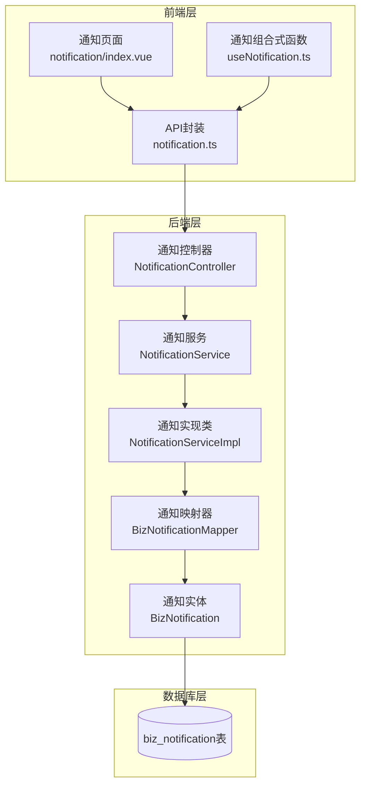
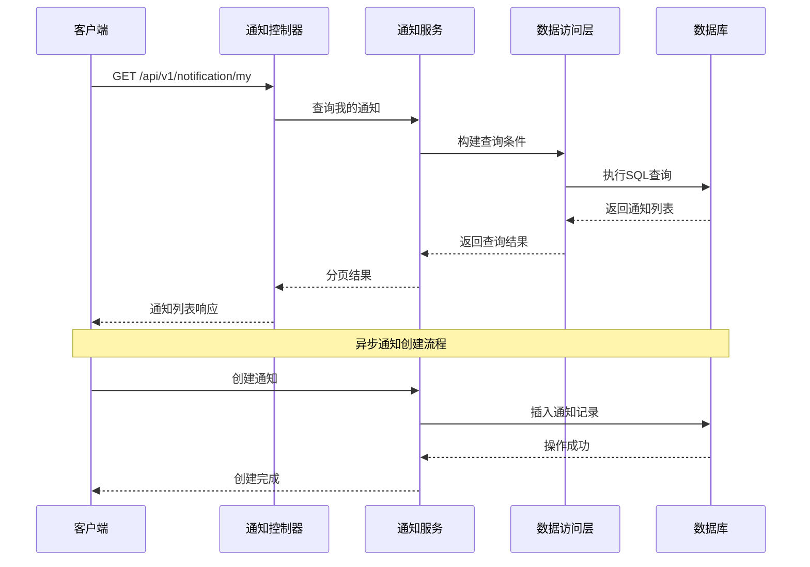
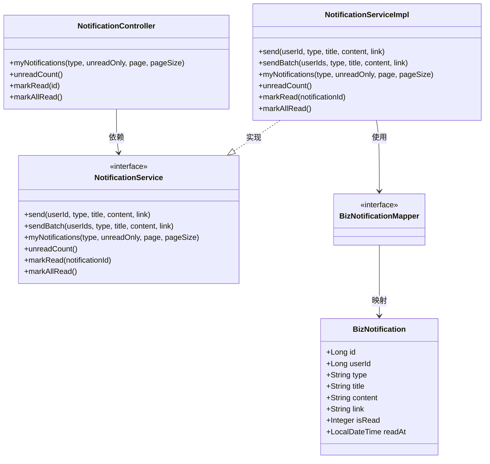

# 通知消息API

<cite>
**本文档引用的文件**
- [NotificationController.java](file://oa-approval/src/main/java/com/oa/admin/approval/controller/NotificationController.java)
- [NotificationService.java](file://oa-approval/src/main/java/com/oa/admin/approval/service/NotificationService.java)
- [NotificationServiceImpl.java](file://oa-approval/src/main/java/com/oa/admin/approval/service/impl/NotificationServiceImpl.java)
- [BizNotification.java](file://oa-approval/src/main/java/com/oa/admin/approval/entity/BizNotification.java)
- [BizNotificationMapper.java](file://oa-approval/src/main/java/com/oa/admin/approval/mapper/BizNotificationMapper.java)
- [NotificationType.java](file://oa-approval/src/main/java/com/oa/admin/approval/enums/NotificationType.java)
- [V7__phase3b_notification.sql](file://oa-app/src/main/resources/db/migration/V7__phase3b_notification.sql)
- [notification.ts](file://oa-ui/src/api/notification.ts)
- [useNotification.ts](file://oa-ui/src/composables/useNotification.ts)
- [index.vue](file://oa-ui/src/views/notification/index.vue)
- [ApprovalTaskCreateListener.java](file://oa-approval/src/main/java/com/oa/admin/approval/listener/ApprovalTaskCreateListener.java)
- [ProcessEndEventListener.java](file://oa-approval/src/main/java/com/oa/admin/approval/listener/ProcessEndEventListener.java)
</cite>

## 目录
1. [简介](#简介)
2. [项目结构](#项目结构)
3. [核心组件](#核心组件)
4. [架构概览](#架构概览)
5. [详细组件分析](#详细组件分析)
6. [依赖分析](#依赖分析)
7. [性能考虑](#性能考虑)
8. [故障排除指南](#故障排除指南)
9. [结论](#结论)
10. [附录](#附录)

## 简介
本文件为OA系统通知消息模块的完整API接口文档。系统提供审批流程通知、任务提醒、抄送通知等多类型通知功能，支持通知的创建、查询、标记已读、批量操作等核心能力。通知消息采用异步处理机制，通过数据库持久化存储，并提供前端轮询更新未读计数的交互体验。

## 项目结构
通知消息模块主要分布在以下层次：
- 控制器层：对外暴露RESTful API接口
- 服务层：业务逻辑处理和数据访问
- 实体层：数据模型定义
- 前端层：通知展示和用户交互



**图表来源**
- [NotificationController.java:14-46](file://oa-approval/src/main/java/com/oa/admin/approval/controller/NotificationController.java#L14-L46)
- [NotificationServiceImpl.java:23-93](file://oa-approval/src/main/java/com/oa/admin/approval/service/impl/NotificationServiceImpl.java#L23-L93)
- [BizNotification.java:16-31](file://oa-approval/src/main/java/com/oa/admin/approval/entity/BizNotification.java#L16-L31)

**章节来源**
- [NotificationController.java:1-47](file://oa-approval/src/main/java/com/oa/admin/approval/controller/NotificationController.java#L1-L47)
- [NotificationService.java:1-24](file://oa-approval/src/main/java/com/oa/admin/approval/service/NotificationService.java#L1-L24)
- [BizNotification.java:1-32](file://oa-approval/src/main/java/com/oa/admin/approval/entity/BizNotification.java#L1-L32)

## 核心组件
通知消息模块包含以下核心组件：

### 数据模型
通知实体包含以下关键字段：
- `id`: 主键标识
- `userId`: 接收用户ID
- `type`: 通知类型（如待办任务、已批准、已拒绝等）
- `title`: 通知标题
- `content`: 通知内容
- `link`: 跳转链接
- `isRead`: 是否已读（0未读，1已读）
- `readAt`: 已读时间

### 通知类型枚举
系统支持多种通知类型：
- 待办任务通知（pending_task）
- 审批通过通知（approved）
- 审批拒绝通知（rejected）
- 抄送接收通知（cc_received）
- 任务转交通知（task_transferred）
- 流程终止通知（instance_terminated）

**章节来源**
- [BizNotification.java:16-31](file://oa-approval/src/main/java/com/oa/admin/approval/entity/BizNotification.java#L16-L31)
- [NotificationType.java:11-17](file://oa-approval/src/main/java/com/oa/admin/approval/enums/NotificationType.java#L11-L17)

## 架构概览
通知系统采用分层架构设计，实现前后端分离和异步处理机制。



**图表来源**
- [NotificationController.java:21-28](file://oa-approval/src/main/java/com/oa/admin/approval/controller/NotificationController.java#L21-L28)
- [NotificationServiceImpl.java:47-62](file://oa-approval/src/main/java/com/oa/admin/approval/service/impl/NotificationServiceImpl.java#L47-L62)

## 详细组件分析

### API接口设计

#### 1. 获取我的通知列表
**接口地址**: `GET /api/v1/notification/my`
**认证要求**: 需要登录
**请求参数**:
- `type`: 通知类型（可选）
- `unreadOnly`: 是否仅显示未读（可选）
- `page`: 页码，默认1
- `pageSize`: 每页条数，默认10

**响应数据**:
- `records`: 通知列表
- `total`: 总记录数
- `page`: 当前页码
- `pageSize`: 每页大小

#### 2. 获取未读通知数量
**接口地址**: `GET /api/v1/notification/unread-count`
**认证要求**: 需要登录
**响应数据**: 未读通知总数

#### 3. 标记单个通知为已读
**接口地址**: `POST /api/v1/notification/{id}/read`
**认证要求**: 需要登录
**路径参数**:
- `id`: 通知ID

#### 4. 标记所有通知为已读
**接口地址**: `POST /api/v1/notification/read-all`
**认证要求**: 需要登录

**章节来源**
- [NotificationController.java:21-45](file://oa-approval/src/main/java/com/oa/admin/approval/controller/NotificationController.java#L21-L45)

### 服务层实现

#### 通知发送机制
服务层提供同步和异步两种通知发送方式：
- 单个用户通知：`send(userId, type, title, content, link)`
- 批量通知：`sendBatch(userIds, type, title, content, link)`

#### 查询和统计功能
- `myNotifications()`: 支持按类型过滤和未读筛选
- `unreadCount()`: 统计未读通知数量
- 分页查询支持按创建时间倒序排列

#### 状态管理
- `markRead()`: 标记单个通知为已读
- `markAllRead()`: 批量标记为已读

**章节来源**
- [NotificationService.java:10-23](file://oa-approval/src/main/java/com/oa/admin/approval/service/NotificationService.java#L10-L23)
- [NotificationServiceImpl.java:27-92](file://oa-approval/src/main/java/com/oa/admin/approval/service/impl/NotificationServiceImpl.java#L27-L92)

### 数据库设计

#### 表结构
通知表采用MySQL存储，包含以下关键索引：
- `idx_user_read`: 用户+已读状态复合索引
- `idx_user_created`: 用户+创建时间复合索引

#### 字段说明
- `user_id`: 接收用户标识
- `type`: 通知类型代码
- `title`: 标题内容
- `content`: 详细内容
- `link`: 跳转链接
- `is_read`: 已读状态标志
- `read_at`: 已读时间戳

**章节来源**
- [V7__phase3b_notification.sql:2-15](file://oa-app/src/main/resources/db/migration/V7__phase3b_notification.sql#L2-L15)

### 前端集成

#### API封装
前端提供完整的通知API封装，包括：
- `getMyNotifications()`: 获取通知列表
- `getUnreadCount()`: 获取未读数量
- `markNotificationRead()`: 标记已读
- `markAllRead()`: 全部已读

#### 通知状态管理
使用Vue组合式函数管理通知状态：
- 自动轮询未读数量（默认30秒间隔）
- 支持手动刷新和停止轮询
- 错误处理和重试机制

**章节来源**
- [notification.ts:16-35](file://oa-ui/src/api/notification.ts#L16-L35)
- [useNotification.ts:7-30](file://oa-ui/src/composables/useNotification.ts#L7-L30)

### 触发机制和消息模板

#### 审批流程触发
通知系统与审批流程深度集成：
- 任务创建监听器自动创建待办任务通知
- 流程结束事件发布最终审批结果通知
- 支持多人会签、或签等复杂流程场景

#### 通知模板配置
系统支持基于通知类型的模板化消息生成：
- 模板变量替换
- 动态内容生成
- 多语言支持准备

**章节来源**
- [ApprovalTaskCreateListener.java:25-63](file://oa-approval/src/main/java/com/oa/admin/approval/listener/ApprovalTaskCreateListener.java#L25-L63)
- [ProcessEndEventListener.java:34-59](file://oa-approval/src/main/java/com/oa/admin/approval/listener/ProcessEndEventListener.java#L34-L59)

## 依赖分析



**图表来源**
- [NotificationController.java:14-46](file://oa-approval/src/main/java/com/oa/admin/approval/controller/NotificationController.java#L14-L46)
- [NotificationService.java:10-23](file://oa-approval/src/main/java/com/oa/admin/approval/service/NotificationService.java#L10-L23)
- [NotificationServiceImpl.java:23-93](file://oa-approval/src/main/java/com/oa/admin/approval/service/impl/NotificationServiceImpl.java#L23-L93)
- [BizNotification.java:16-31](file://oa-approval/src/main/java/com/oa/admin/approval/entity/BizNotification.java#L16-L31)

**章节来源**
- [NotificationController.java:1-47](file://oa-approval/src/main/java/com/oa/admin/approval/controller/NotificationController.java#L1-L47)
- [NotificationServiceImpl.java:1-94](file://oa-approval/src/main/java/com/oa/admin/approval/service/impl/NotificationServiceImpl.java#L1-L94)

## 性能考虑

### 数据库优化
- 复合索引优化查询性能
- 分页查询避免大数据集加载
- 异步写入减少阻塞

### 前端优化
- 轮询间隔可配置（默认30秒）
- 错误重试机制
- 内存管理和资源清理

### 扩展性设计
- 支持通知类型扩展
- 可配置的通知模板
- 多渠道推送支持预留

## 故障排除指南

### 常见问题
1. **通知未显示**
   - 检查用户登录状态
   - 验证通知类型参数
   - 确认数据库连接正常

2. **未读计数不更新**
   - 检查轮询是否正常运行
   - 验证API响应状态
   - 查看浏览器控制台错误

3. **标记已读失败**
   - 确认通知ID有效性
   - 检查权限验证
   - 查看服务端异常日志

**章节来源**
- [NotificationServiceImpl.java:74-81](file://oa-approval/src/main/java/com/oa/admin/approval/service/impl/NotificationServiceImpl.java#L74-L81)

## 结论
通知消息模块提供了完整的审批流程通知解决方案，具备良好的扩展性和易用性。通过清晰的分层架构、完善的API设计和异步处理机制，系统能够满足企业级应用的通知需求。模块支持灵活的通知类型配置和多样的触发机制，为后续功能扩展奠定了坚实基础。

## 附录

### API使用示例

#### 基础查询
```javascript
// 获取通知列表
const notifications = await getMyNotifications({
  type: 'pending_task',
  unreadOnly: true,
  page: 1,
  pageSize: 10
});

// 获取未读数量
const unreadCount = await getUnreadCount();
```

#### 状态管理
```javascript
// 标记单个通知为已读
await markNotificationRead(123);

// 全部标记为已读
await markAllRead();
```

### 集成方案
1. **前端集成步骤**:
   - 导入通知API模块
   - 初始化轮询机制
   - 在路由守卫中检查权限
   - 处理通知点击跳转

2. **后端集成步骤**:
   - 注入通知服务依赖
   - 在业务逻辑中调用通知发送
   - 配置通知模板
   - 监听系统事件

3. **扩展开发**:
   - 新增通知类型枚举
   - 添加新的触发监听器
   - 配置消息队列集成
   - 开发通知模板引擎