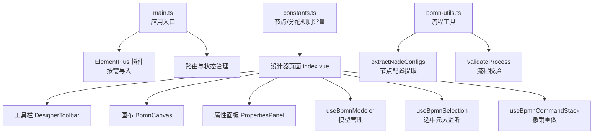
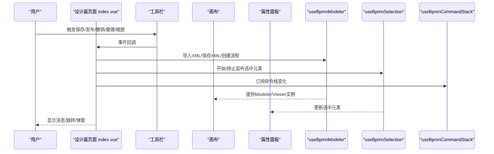
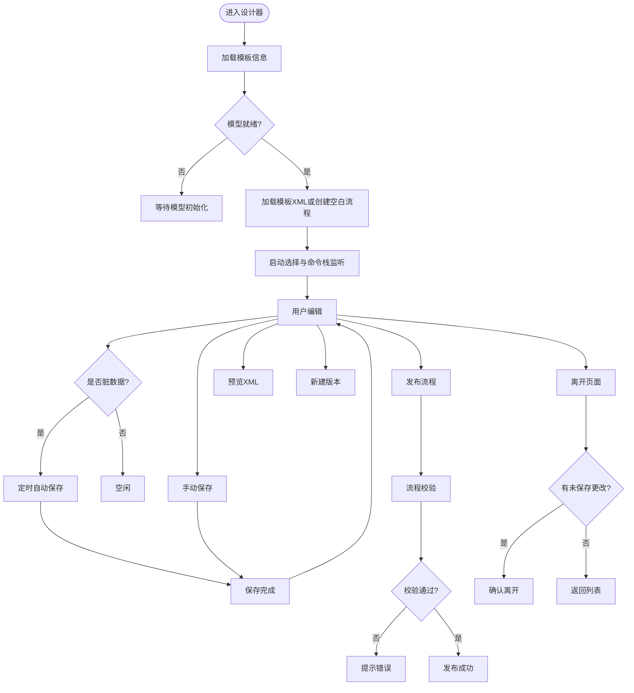
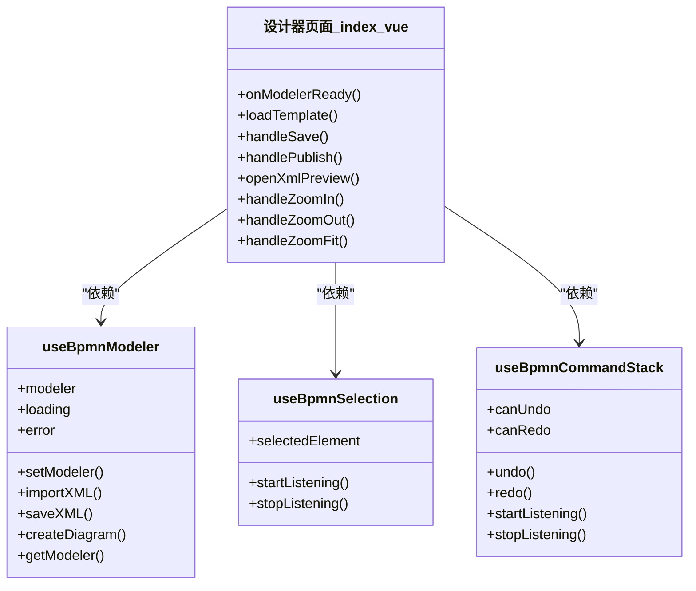
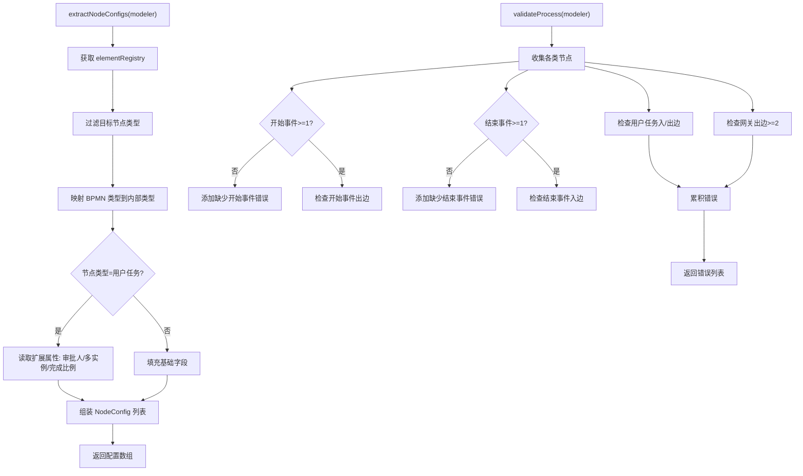
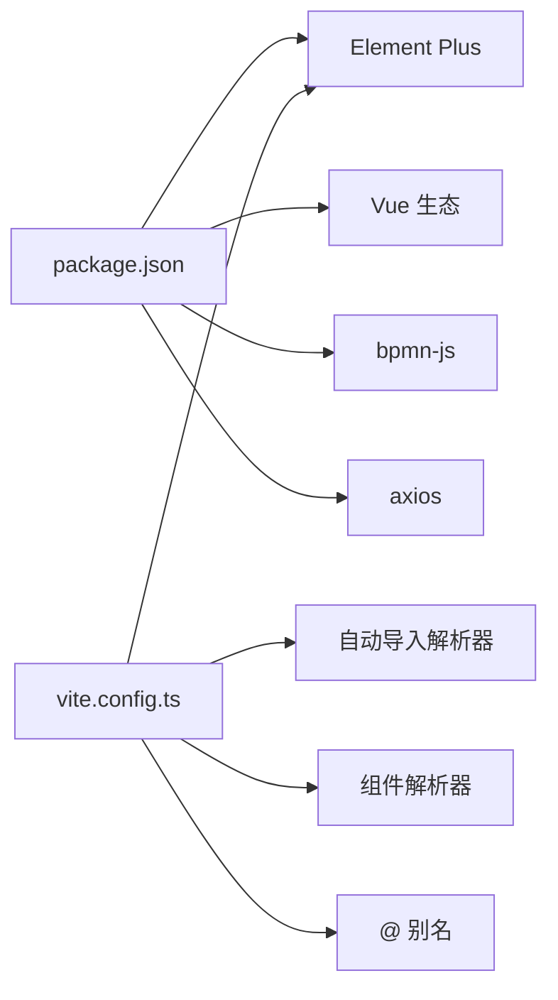

# UI组件库

<cite>
**本文引用的文件**
- [package.json](file://oa-ui/package.json)
- [vite.config.ts](file://oa-ui/vite.config.ts)
- [main.ts](file://oa-ui/src/main.ts)
- [index.vue](file://oa-ui/src/views/approval/template/designer/index.vue)
- [useBpmnModeler.ts](file://oa-ui/src/composables/bpmn/useBpmnModeler.ts)
- [useBpmnSelection.ts](file://oa-ui/src/composables/bpmn/useBpmnSelection.ts)
- [useBpmnCommandStack.ts](file://oa-ui/src/composables/bpmn/useBpmnCommandStack.ts)
- [bpmn-utils.ts](file://oa-ui/src/bpmn/bpmn-utils.ts)
- [constants.ts](file://oa-ui/src/bpmn/constants.ts)
</cite>

## 目录
1. [简介](#简介)
2. [项目结构](#项目结构)
3. [核心组件](#核心组件)
4. [架构总览](#架构总览)
5. [详细组件分析](#详细组件分析)
6. [依赖分析](#依赖分析)
7. [性能考虑](#性能考虑)
8. [故障排查指南](#故障排查指南)
9. [结论](#结论)
10. [附录](#附录)

## 简介
本文件面向UI组件库与BPMN流程设计器的集成与定制化，重点围绕以下目标展开：
- Element Plus在本项目的集成方式与按需导入配置
- BPMN流程设计器的自定义组件实现：画布、节点配置与属性面板
- 样式覆盖与主题定制方法（含暗色模式）
- 响应式设计与国际化配置
- 组件性能优化与内存管理策略
- 使用示例与最佳实践

## 项目结构
前端采用Vite + Vue 3 + TypeScript技术栈，Element Plus通过插件实现按需导入；BPMN流程设计器位于审批模板设计器页面中，由工具栏、画布与属性面板三部分组成，并通过可组合函数管理模型、选择与命令栈。

图表来源
- [main.ts:1-14](file://oa-ui/src/main.ts#L1-L14)
- [index.vue:1-324](file://oa-ui/src/views/approval/template/designer/index.vue#L1-L324)
- [useBpmnModeler.ts:1-98](file://oa-ui/src/composables/bpmn/useBpmnModeler.ts#L1-L98)
- [useBpmnSelection.ts:1-39](file://oa-ui/src/composables/bpmn/useBpmnSelection.ts#L1-L39)
- [useBpmnCommandStack.ts:1-59](file://oa-ui/src/composables/bpmn/useBpmnCommandStack.ts#L1-L59)
- [bpmn-utils.ts:1-231](file://oa-ui/src/bpmn/bpmn-utils.ts#L1-L231)
- [constants.ts:1-95](file://oa-ui/src/bpmn/constants.ts#L1-L95)

章节来源
- [package.json:1-38](file://oa-ui/package.json#L1-L38)
- [vite.config.ts:1-40](file://oa-ui/vite.config.ts#L1-L40)
- [main.ts:1-14](file://oa-ui/src/main.ts#L1-L14)

## 核心组件
- Element Plus集成与按需导入
  - 通过Vite插件自动导入与组件解析器实现Element Plus的按需引入，减少打包体积。
  - 应用入口启用Element Plus并设置语言为简体中文。
- BPMN设计器页面
  - 工具栏：保存、发布、撤销/重做、缩放、预览XML、新建版本、返回等。
  - 画布：基于bpmn-js的Modeler/Viewer实例进行渲染与交互。
  - 属性面板：根据选中元素动态展示节点属性（如用户任务的审批人类型、多实例类型等）。
- 可组合函数
  - 模型管理：导入XML、保存XML、创建空白流程、获取实例。
  - 选择监听：订阅选中元素变化，驱动属性面板更新。
  - 命令栈：订阅撤销/重做状态，控制工具栏按钮可用性。

章节来源
- [vite.config.ts:12-24](file://oa-ui/vite.config.ts#L12-L24)
- [main.ts:3-12](file://oa-ui/src/main.ts#L3-L12)
- [index.vue:52-287](file://oa-ui/src/views/approval/template/designer/index.vue#L52-L287)
- [useBpmnModeler.ts:7-97](file://oa-ui/src/composables/bpmn/useBpmnModeler.ts#L7-L97)
- [useBpmnSelection.ts:4-37](file://oa-ui/src/composables/bpmn/useBpmnSelection.ts#L4-L37)
- [useBpmnCommandStack.ts:4-57](file://oa-ui/src/composables/bpmn/useBpmnCommandStack.ts#L4-L57)

## 架构总览
下图展示了设计器页面与核心模块之间的交互关系，以及Element Plus在运行时的注入路径。

图表来源
- [index.vue:52-287](file://oa-ui/src/views/approval/template/designer/index.vue#L52-L287)
- [useBpmnModeler.ts:16-50](file://oa-ui/src/composables/bpmn/useBpmnModeler.ts#L16-L50)
- [useBpmnSelection.ts:7-31](file://oa-ui/src/composables/bpmn/useBpmnSelection.ts#L7-L31)
- [useBpmnCommandStack.ts:34-48](file://oa-ui/src/composables/bpmn/useBpmnCommandStack.ts#L34-L48)

## 详细组件分析

### Element Plus集成与定制化
- 按需导入
  - Vite插件自动导入与组件解析器确保仅引入实际使用的Element Plus组件与图标，降低首屏体积。
- 国际化
  - 应用入口设置Element Plus语言为简体中文，满足国内业务场景。
- 主题与样式覆盖
  - 项目内存在BPMN专用样式覆盖文件，可通过SCSS变量与深度选择器对默认主题进行覆盖，以适配设计器背景与面板布局。
- 暗色模式支持
  - 可通过全局CSS变量切换或Element Plus提供的深色模式开关实现，结合业务主题色调整保证对比度与可读性。

章节来源
- [vite.config.ts:15-23](file://oa-ui/vite.config.ts#L15-L23)
- [main.ts:4-5](file://oa-ui/src/main.ts#L4-L5)
- [package.json:15-23](file://oa-ui/package.json#L15-L23)

### BPMN流程设计器页面
- 页面职责
  - 负责装配工具栏、画布与属性面板；协调模型、选择与命令栈；处理保存、发布、预览XML、新建版本与返回等业务流程。
  - 自动保存机制：定时检查脏状态并在合适时机触发保存，避免数据丢失。
- 生命周期与资源清理
  - 挂载时加载模板信息、注册窗口卸载事件；卸载时停止自动保存、移除事件监听，防止内存泄漏。
- 缩放与视图控制
  - 提供放大、缩小、适应视口等操作，限制缩放范围，提升大图编辑体验。

图表来源
- [index.vue:109-142](file://oa-ui/src/views/approval/template/designer/index.vue#L109-L142)
- [index.vue:157-183](file://oa-ui/src/views/approval/template/designer/index.vue#L157-L183)
- [index.vue:185-216](file://oa-ui/src/views/approval/template/designer/index.vue#L185-L216)
- [index.vue:229-233](file://oa-ui/src/views/approval/template/designer/index.vue#L229-L233)
- [index.vue:218-227](file://oa-ui/src/views/approval/template/designer/index.vue#L218-L227)
- [index.vue:235-247](file://oa-ui/src/views/approval/template/designer/index.vue#L235-L247)
- [index.vue:249-268](file://oa-ui/src/views/approval/template/designer/index.vue#L249-L268)

章节来源
- [index.vue:1-50](file://oa-ui/src/views/approval/template/designer/index.vue#L1-L50)
- [index.vue:52-287](file://oa-ui/src/views/approval/template/designer/index.vue#L52-L287)

### 可组合函数：模型管理、选择与命令栈
- useBpmnModeler
  - 职责：封装bpmn-js Modeler/Viewer实例，提供导入XML、保存XML、创建空白流程、获取实例等能力；在导入时自动适配视口。
- useBpmnSelection
  - 职责：订阅Element Plus事件总线中的选中元素变化，将当前选中元素暴露给属性面板。
- useBpmnCommandStack
  - 职责：订阅命令栈变化事件，维护撤销/重做可用状态，提供撤销/重做操作。

图表来源
- [useBpmnModeler.ts:7-97](file://oa-ui/src/composables/bpmn/useBpmnModeler.ts#L7-L97)
- [useBpmnSelection.ts:4-37](file://oa-ui/src/composables/bpmn/useBpmnSelection.ts#L4-L37)
- [useBpmnCommandStack.ts:4-57](file://oa-ui/src/composables/bpmn/useBpmnCommandStack.ts#L4-L57)
- [index.vue:80-107](file://oa-ui/src/views/approval/template/designer/index.vue#L80-L107)

章节来源
- [useBpmnModeler.ts:1-98](file://oa-ui/src/composables/bpmn/useBpmnModeler.ts#L1-L98)
- [useBpmnSelection.ts:1-39](file://oa-ui/src/composables/bpmn/useBpmnSelection.ts#L1-L39)
- [useBpmnCommandStack.ts:1-59](file://oa-ui/src/composables/bpmn/useBpmnCommandStack.ts#L1-L59)

### 流程工具与节点配置
- 节点配置提取
  - 遍历元素注册表，筛选用户任务、排他/并行网关、开始/结束事件，提取节点ID、名称、类型与排序；对用户任务提取扩展属性（审批人类型、多实例类型、完成比例等）。
- 流程校验
  - 校验开始/结束事件数量与连通性，校验用户任务与网关的入/出边数量，输出错误集合用于提示。
- 默认XML生成与监听注入
  - 生成基础流程XML；在用户任务上注入任务监听器扩展元素，确保流程执行期触发相应逻辑。

图表来源
- [bpmn-utils.ts:56-94](file://oa-ui/src/bpmn/bpmn-utils.ts#L56-L94)
- [bpmn-utils.ts:132-215](file://oa-ui/src/bpmn/bpmn-utils.ts#L132-L215)
- [bpmn-utils.ts:217-230](file://oa-ui/src/bpmn/bpmn-utils.ts#L217-L230)

章节来源
- [bpmn-utils.ts:1-231](file://oa-ui/src/bpmn/bpmn-utils.ts#L1-L231)
- [constants.ts:1-95](file://oa-ui/src/bpmn/constants.ts#L1-L95)

### 节点类型与分配规则常量
- 节点类型选项：开始事件、结束事件、用户任务、排他/并行网关。
- 审批人类型选项：固定用户、部门主管、上级部门主管、角色、发起人、自定义表达式。
- 多实例类型：普通、会签、或签。
- 模板状态与标签映射：草稿、已发布。

章节来源
- [constants.ts:21-84](file://oa-ui/src/bpmn/constants.ts#L21-L84)
- [constants.ts:86-95](file://oa-ui/src/bpmn/constants.ts#L86-L95)

## 依赖分析
- 运行时依赖
  - Vue 3、Vue Router、Pinia、Element Plus、bpmn-js、axios等。
- 构建与开发依赖
  - Vite、Vue单文件组件插件、自动导入与组件解析器、TypeScript、Sass、测试工具链。
- 插件配置
  - Element Plus解析器与自动导入，简化组件与API的使用；别名@指向src目录，便于统一导入。

图表来源
- [package.json:15-36](file://oa-ui/package.json#L15-L36)
- [vite.config.ts:13-24](file://oa-ui/vite.config.ts#L13-L24)

章节来源
- [package.json:1-38](file://oa-ui/package.json#L1-L38)
- [vite.config.ts:1-40](file://oa-ui/vite.config.ts#L1-L40)

## 性能考虑
- 按需导入与懒加载
  - 通过自动导入与组件解析器仅引入使用到的Element Plus组件，减少初始包体。
- 图形渲染优化
  - 在导入XML后自动适配视口，避免用户手动缩放；提供缩放范围限制，防止过度放大导致的重绘压力。
- 事件监听与内存管理
  - 在组件卸载时移除事件监听与定时器，防止内存泄漏；在模型未就绪时避免执行耗时操作。
- 自动保存策略
  - 以固定间隔检测脏状态并触发保存，平衡用户体验与数据安全；在只读状态下禁用保存。

章节来源
- [vite.config.ts:15-23](file://oa-ui/vite.config.ts#L15-L23)
- [index.vue:109-123](file://oa-ui/src/views/approval/template/designer/index.vue#L109-L123)
- [index.vue:281-286](file://oa-ui/src/views/approval/template/designer/index.vue#L281-L286)
- [useBpmnModeler.ts:29-30](file://oa-ui/src/composables/bpmn/useBpmnModeler.ts#L29-L30)

## 故障排查指南
- 导入XML失败
  - 检查XML格式与命名空间；查看导入警告与错误信息；确认bpmn-js版本兼容性。
- 保存失败
  - 确认模型实例已就绪；检查保存XML是否为空；查看网络请求与后端接口返回。
- 发布前校验失败
  - 根据错误列表逐项修复：确保存在开始/结束事件且连通；用户任务与网关满足入/出边数量要求。
- 选中元素不更新
  - 确认事件总线监听已启动；检查选中元素是否唯一；确认属性面板正确接收selectedElement。
- 撤销/重做不可用
  - 确认命令栈监听已启动；检查命令栈状态；确保未在只读模式下尝试编辑。

章节来源
- [useBpmnModeler.ts:31-37](file://oa-ui/src/composables/bpmn/useBpmnModeler.ts#L31-L37)
- [index.vue:157-183](file://oa-ui/src/views/approval/template/designer/index.vue#L157-L183)
- [bpmn-utils.ts:132-215](file://oa-ui/src/bpmn/bpmn-utils.ts#L132-L215)
- [useBpmnSelection.ts:13-20](file://oa-ui/src/composables/bpmn/useBpmnSelection.ts#L13-L20)
- [useBpmnCommandStack.ts:39-40](file://oa-ui/src/composables/bpmn/useBpmnCommandStack.ts#L39-L40)

## 结论
本项目通过Element Plus与bpmn-js实现了完整的流程设计器解决方案：以可组合函数解耦模型、选择与命令栈，以工具栏与属性面板提供直观的编辑体验；配合流程校验与自动保存策略保障数据完整性；通过按需导入与样式覆盖实现良好的性能与可定制性。建议在后续迭代中进一步完善暗色模式与国际化配置，并持续优化大图场景下的渲染性能。

## 附录
- 使用示例与最佳实践
  - 组件使用
    - 在页面中直接使用Element Plus组件，无需手动引入；通过自动导入与解析器减少样板代码。
  - BPMN编辑
    - 先加载模板或创建空白流程，再启动监听；在只读状态下禁用编辑相关操作；发布前务必执行流程校验。
  - 样式与主题
    - 使用SCSS变量与深度选择器覆盖Element Plus默认样式；在设计器区域保持浅色背景与清晰的面板分隔。
  - 国际化
    - 应用入口设置语言为简体中文；如需扩展其他语言，可在入口处切换Element Plus语言包。
  - 性能与内存
    - 合理使用自动保存与事件监听生命周期；在大流程场景下谨慎开启实时预览与复杂动画。