# Vue应用架构

<cite>
**本文引用的文件**
- [package.json](file://oa-ui/package.json)
- [vite.config.ts](file://oa-ui/vite.config.ts)
- [main.ts](file://oa-ui/src/main.ts)
- [App.vue](file://oa-ui/src/App.vue)
- [tsconfig.json](file://oa-ui/tsconfig.json)
- [router/index.ts](file://oa-ui/src/router/index.ts)
- [stores/user.ts](file://oa-ui/src/stores/user.ts)
- [api/approval.ts](file://oa-ui/src/api/approval.ts)
- [utils/request.ts](file://oa-ui/src/utils/request.ts)
- [layouts/AdminLayout.vue](file://oa-ui/src/layouts/AdminLayout.vue)
- [views/login/index.vue](file://oa-ui/src/views/login/index.vue)
- [types/index.ts](file://oa-ui/src/types/index.ts)
- [env.d.ts](file://oa-ui/src/env.d.ts)
- [README.md](file://README.md)
</cite>

## 目录
1. [简介](#简介)
2. [项目结构](#项目结构)
3. [核心组件](#核心组件)
4. [架构总览](#架构总览)
5. [详细组件分析](#详细组件分析)
6. [依赖分析](#依赖分析)
7. [性能考虑](#性能考虑)
8. [故障排查指南](#故障排查指南)
9. [结论](#结论)
10. [附录](#附录)

## 简介
本文件面向Vue 3前端应用（oa-ui）进行系统性架构文档梳理，重点覆盖以下方面：
- 应用初始化：应用创建、插件注册与全局配置
- UI库集成：Element Plus的安装、按需导入与国际化配置
- 构建工具：Vite配置项与开发服务器代理设置
- 生命周期与错误边界：路由守卫、HTTP拦截器与统一错误提示
- TypeScript集成：编译配置、类型声明与强类型约束
- 开发与生产优化：构建脚本、测试与覆盖率、Docker部署
- 最佳实践：代码组织、状态管理、API封装与组件设计

## 项目结构
oa-ui采用前后端分离架构，前端使用Vue 3 + TypeScript + Vite + Element Plus + Pinia + Vue Router，后端由Spring Boot + Flowable + Sa-Token构成。前端工程位于oa-ui目录，核心入口为src/main.ts，路由集中于src/router/index.ts，状态管理使用Pinia Store，API层通过Axios封装并统一拦截。

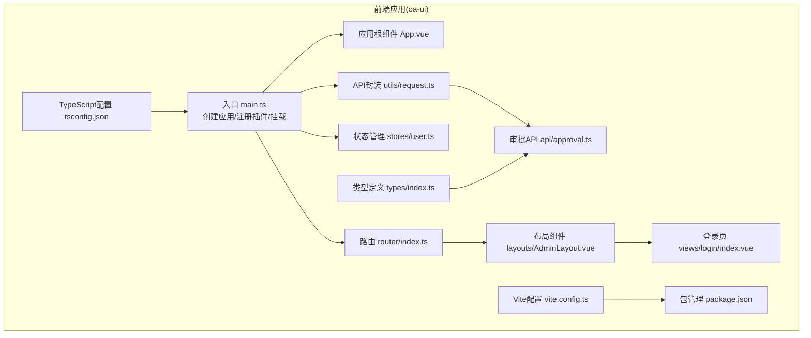

图表来源
- [main.ts:1-14](file://oa-ui/src/main.ts#L1-L14)
- [App.vue:1-4](file://oa-ui/src/App.vue#L1-L4)
- [router/index.ts:1-134](file://oa-ui/src/router/index.ts#L1-L134)
- [stores/user.ts:1-32](file://oa-ui/src/stores/user.ts#L1-L32)
- [utils/request.ts:1-42](file://oa-ui/src/utils/request.ts#L1-L42)
- [api/approval.ts:1-71](file://oa-ui/src/api/approval.ts#L1-L71)
- [layouts/AdminLayout.vue:1-130](file://oa-ui/src/layouts/AdminLayout.vue#L1-L130)
- [views/login/index.vue:1-73](file://oa-ui/src/views/login/index.vue#L1-L73)
- [types/index.ts:1-21](file://oa-ui/src/types/index.ts#L1-L21)
- [vite.config.ts:1-40](file://oa-ui/vite.config.ts#L1-L40)
- [tsconfig.json:1-24](file://oa-ui/tsconfig.json#L1-L24)
- [package.json:1-38](file://oa-ui/package.json#L1-L38)

章节来源
- [README.md:48-61](file://README.md#L48-L61)
- [package.json:1-38](file://oa-ui/package.json#L1-L38)
- [vite.config.ts:1-40](file://oa-ui/vite.config.ts#L1-L40)
- [tsconfig.json:1-24](file://oa-ui/tsconfig.json#L1-L24)

## 核心组件
- 应用入口与全局配置
  - 应用创建与挂载：在main.ts中创建Vue应用实例，注册Pinia、Router与Element Plus，并将App根组件挂载到DOM。
  - 国际化：通过Element Plus提供的中文语言包实现界面文案本地化。
  - 路由与状态：应用同时注册路由与状态管理，确保页面导航与用户信息状态一致。
- 路由系统
  - 使用history模式，定义多级菜单路由与懒加载视图组件；在beforeEach中进行登录态校验，未登录跳转至登录页。
- 状态管理
  - 使用Pinia定义用户Store，包含token与userInfo的读取与持久化，以及登录、获取用户信息与登出操作。
- API封装与拦截器
  - Axios实例以统一前缀/baseURL封装请求；在请求头注入认证令牌；在响应层统一校验业务code，错误时弹窗提示并处理401/2004等场景自动登出。
- UI组件与布局
  - AdminLayout提供侧边栏菜单、顶部导航与主内容区，结合Element Plus图标库与菜单组件实现导航与交互。
- 类型系统
  - 通过tsconfig.json启用严格模式与路径别名，配合env.d.ts声明.vue模块，确保TypeScript对Vue单文件组件的类型识别。

章节来源
- [main.ts:1-14](file://oa-ui/src/main.ts#L1-L14)
- [router/index.ts:1-134](file://oa-ui/src/router/index.ts#L1-L134)
- [stores/user.ts:1-32](file://oa-ui/src/stores/user.ts#L1-L32)
- [utils/request.ts:1-42](file://oa-ui/src/utils/request.ts#L1-L42)
- [layouts/AdminLayout.vue:1-130](file://oa-ui/src/layouts/AdminLayout.vue#L1-L130)
- [tsconfig.json:1-24](file://oa-ui/tsconfig.json#L1-L24)
- [env.d.ts:1-7](file://oa-ui/src/env.d.ts#L1-L7)

## 架构总览
下图展示从前端应用到后端服务的整体调用链：浏览器发起请求经Vite开发服务器代理转发到后端，后端返回统一格式响应，前端通过拦截器解析并处理业务逻辑与错误。

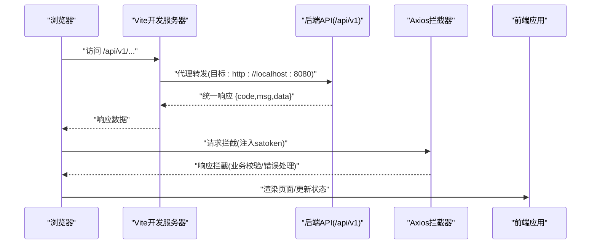

图表来源
- [vite.config.ts:30-38](file://oa-ui/vite.config.ts#L30-L38)
- [utils/request.ts:5-39](file://oa-ui/src/utils/request.ts#L5-L39)
- [main.ts:9-13](file://oa-ui/src/main.ts#L9-L13)

## 详细组件分析

### 应用初始化与插件注册
- 初始化流程
  - 创建应用实例并挂载根组件
  - 注册状态管理、路由与UI库
  - 设置Element Plus语言包为中文
- 插件与解析
  - Vite插件链：Vue单文件组件支持、自动导入Element Plus组件与组合式API、组件自动注册
  - 路径别名：@指向src目录，便于模块导入
- 国际化配置
  - 通过locale参数传入Element Plus中文语言包，确保组件文案本地化

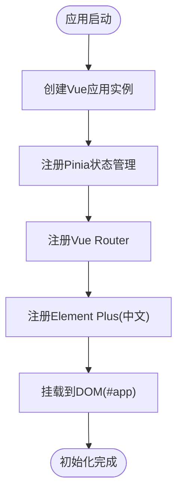

图表来源
- [main.ts:9-13](file://oa-ui/src/main.ts#L9-L13)
- [vite.config.ts:13-24](file://oa-ui/vite.config.ts#L13-L24)
- [vite.config.ts:25-29](file://oa-ui/vite.config.ts#L25-L29)

章节来源
- [main.ts:1-14](file://oa-ui/src/main.ts#L1-L14)
- [vite.config.ts:1-40](file://oa-ui/vite.config.ts#L1-L40)

### Element Plus集成与国际化
- 安装与按需导入
  - 通过unplugin-auto-import与unplugin-vue-components实现Element Plus组件与API的自动导入
  - 自动补全与组件声明文件生成，提升开发效率
- 国际化
  - 引入中文语言包并作为Element Plus的locale配置，确保组件文案为简体中文

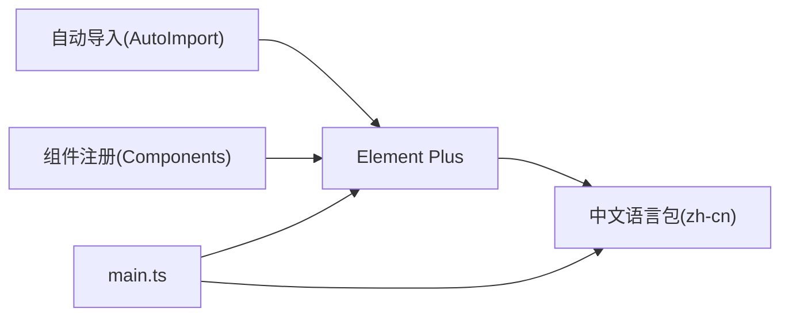

图表来源
- [main.ts:3-5](file://oa-ui/src/main.ts#L3-L5)
- [vite.config.ts:15-23](file://oa-ui/vite.config.ts#L15-L23)

章节来源
- [main.ts:1-14](file://oa-ui/src/main.ts#L1-L14)
- [vite.config.ts:1-40](file://oa-ui/vite.config.ts#L1-L40)

### Vite构建与开发服务器
- 插件配置
  - Vue单文件组件支持
  - 自动导入Element Plus与常用API
  - 组件自动注册
- 路径别名
  - @映射到src目录，简化导入路径
- 开发服务器
  - 端口：5173
  - 代理：/api前缀代理至后端服务地址，开启跨域访问

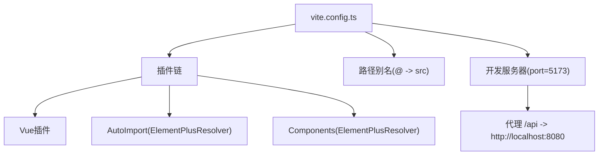

图表来源
- [vite.config.ts:12-39](file://oa-ui/vite.config.ts#L12-L39)

章节来源
- [vite.config.ts:1-40](file://oa-ui/vite.config.ts#L1-L40)

### 路由与导航守卫
- 路由结构
  - 登录页与带侧边栏的管理布局，子路由覆盖系统管理、审批管理、请假与通知等模块
  - 使用懒加载按需加载视图组件
- 导航守卫
  - beforeEach中检查localStorage中的token，未登录且访问非登录页则重定向至登录页

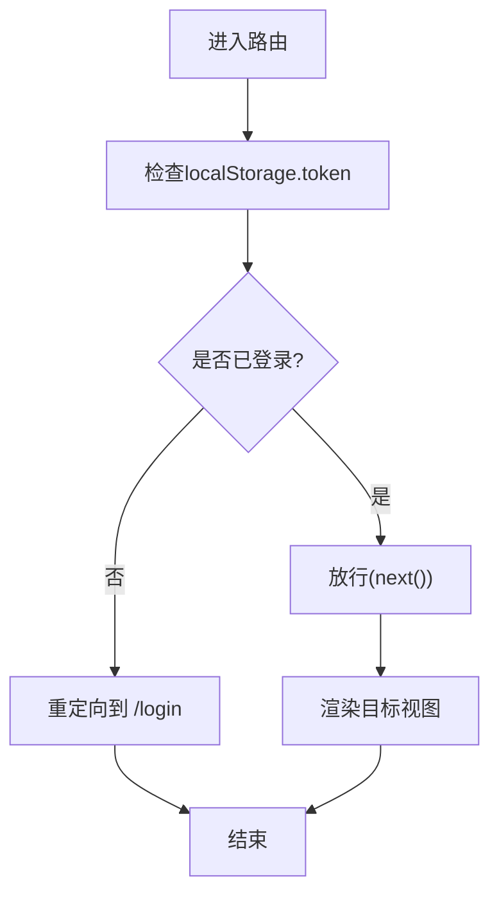

图表来源
- [router/index.ts:124-131](file://oa-ui/src/router/index.ts#L124-L131)

章节来源
- [router/index.ts:1-134](file://oa-ui/src/router/index.ts#L1-L134)

### 状态管理与用户会话
- 用户Store
  - 维护token与userInfo，支持登录、获取当前用户信息与登出
  - 登出时清理token并跳转至登录页
- 会话持久化
  - token存储于localStorage，刷新后仍可保持登录态

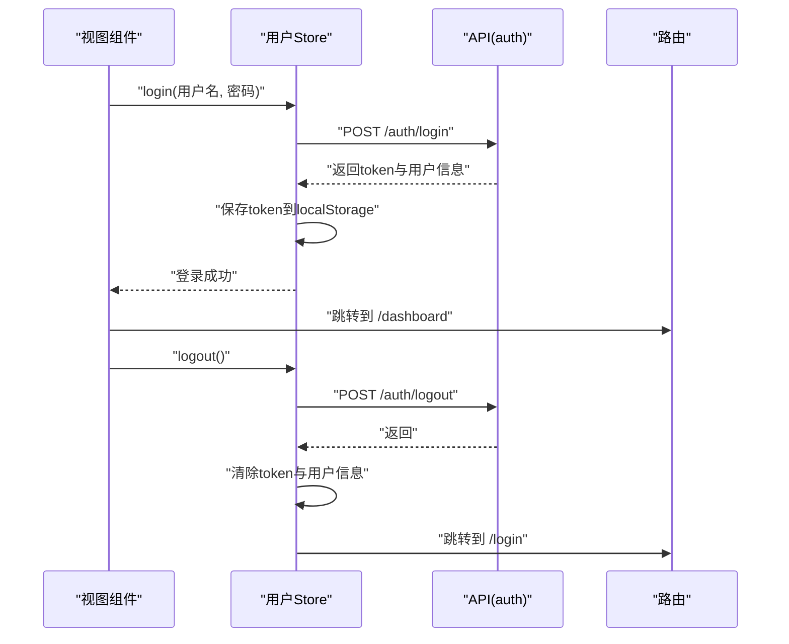

图表来源
- [stores/user.ts:6-31](file://oa-ui/src/stores/user.ts#L6-L31)
- [api/approval.ts:1-71](file://oa-ui/src/api/approval.ts#L1-L71)
- [router/index.ts:124-131](file://oa-ui/src/router/index.ts#L124-L131)

章节来源
- [stores/user.ts:1-32](file://oa-ui/src/stores/user.ts#L1-L32)
- [router/index.ts:1-134](file://oa-ui/src/router/index.ts#L1-L134)

### API封装与错误处理
- Axios实例
  - baseURL统一为/api/v1，超时时间15秒
- 请求拦截
  - 若存在token，则在请求头注入satoken
- 响应拦截
  - 校验业务code，成功返回data，失败弹窗提示
  - 对401与特定业务错误码(如2004)执行自动登出
- 错误边界
  - 统一捕获网络异常并提示，避免未处理异常导致崩溃

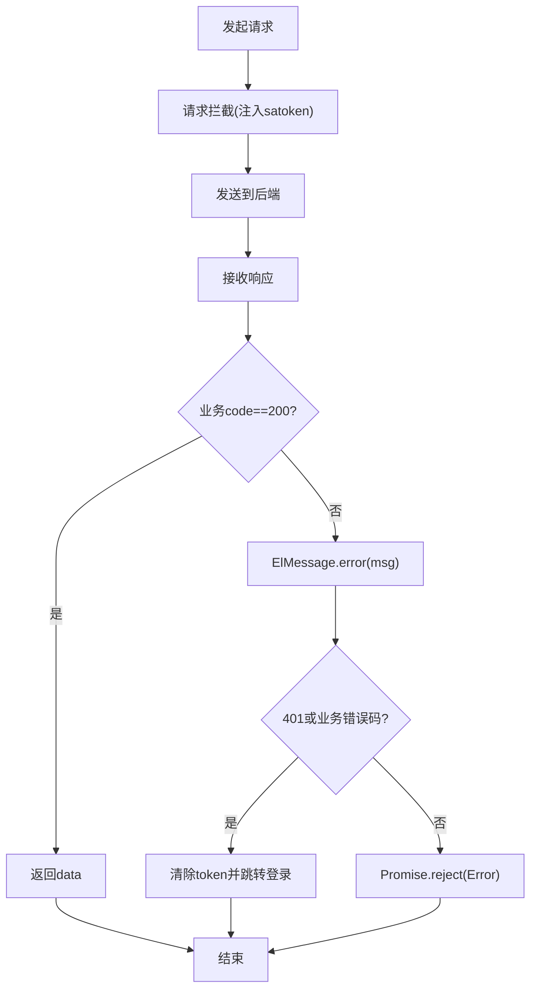

图表来源
- [utils/request.ts:5-39](file://oa-ui/src/utils/request.ts#L5-L39)

章节来源
- [utils/request.ts:1-42](file://oa-ui/src/utils/request.ts#L1-L42)

### 布局与导航组件
- AdminLayout
  - 侧边栏菜单支持折叠，顶部导航包含用户下拉菜单
  - 通过Element Plus图标库与菜单组件实现图标与标题
- 登录页
  - 表单校验、加载态与消息提示，登录成功后跳转仪表盘

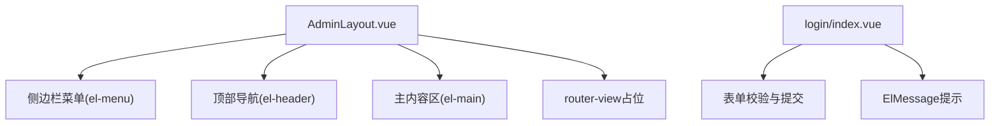

图表来源
- [layouts/AdminLayout.vue:1-130](file://oa-ui/src/layouts/AdminLayout.vue#L1-L130)
- [views/login/index.vue:1-73](file://oa-ui/src/views/login/index.vue#L1-L73)

章节来源
- [layouts/AdminLayout.vue:1-130](file://oa-ui/src/layouts/AdminLayout.vue#L1-L130)
- [views/login/index.vue:1-73](file://oa-ui/src/views/login/index.vue#L1-L73)

### TypeScript集成与类型安全
- 编译配置
  - 目标与模块：ES2022/ESNext
  - 严格模式：开启严格检查与未使用检测
  - 路径别名：@/*映射src/*
  - 模块解析：bundler，支持TS扩展名
- 类型声明
  - env.d.ts声明.vue模块，使TS能识别单文件组件
- 类型导出
  - types/index.ts统一导出API与实体类型，便于各模块复用

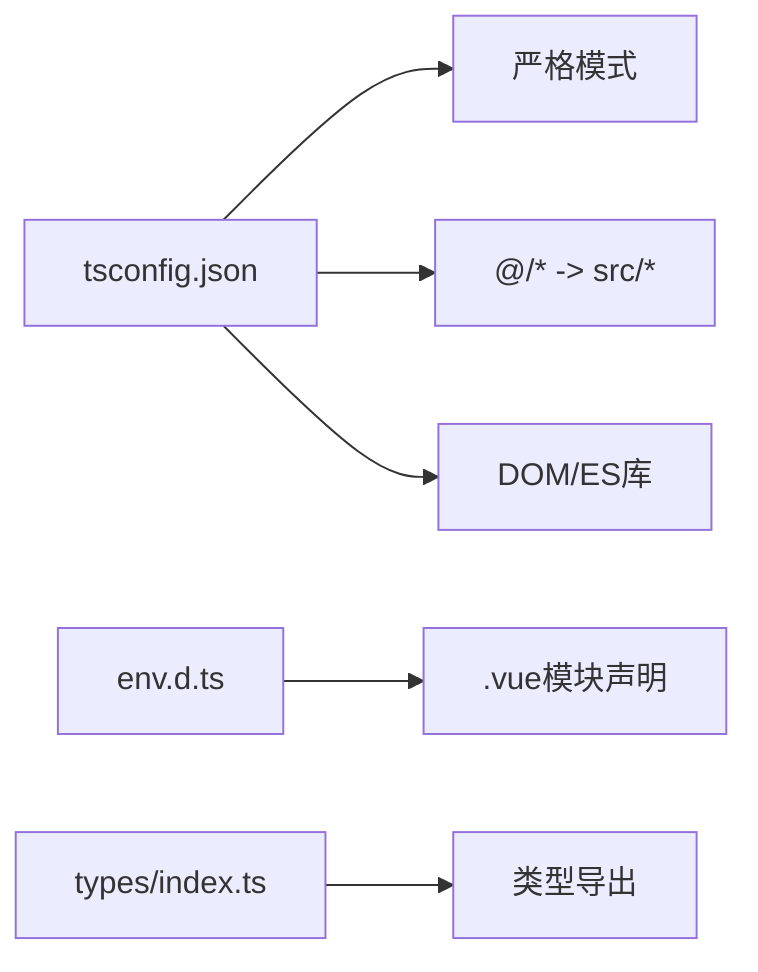

图表来源
- [tsconfig.json:2-22](file://oa-ui/tsconfig.json#L2-L22)
- [env.d.ts:1-7](file://oa-ui/src/env.d.ts#L1-L7)
- [types/index.ts:1-21](file://oa-ui/src/types/index.ts#L1-L21)

章节来源
- [tsconfig.json:1-24](file://oa-ui/tsconfig.json#L1-L24)
- [env.d.ts:1-7](file://oa-ui/src/env.d.ts#L1-L7)
- [types/index.ts:1-21](file://oa-ui/src/types/index.ts#L1-L21)

## 依赖分析
- 前端依赖
  - Vue 3、Vue Router、Pinia、Element Plus、Axios、bpmn-js等
- 开发依赖
  - Vite、@vitejs/plugin-vue、unplugin-auto-import、unplugin-vue-components、TypeScript、vitest等
- 构建脚本
  - dev：启动Vite开发服务器
  - build：先类型检查再打包
  - preview：预览生产包
  - lint/test：ESLint与单元测试

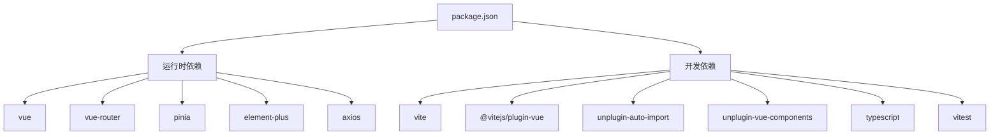

图表来源
- [package.json:15-36](file://oa-ui/package.json#L15-L36)

章节来源
- [package.json:1-38](file://oa-ui/package.json#L1-L38)

## 性能考虑
- 代码分割与懒加载
  - 路由级懒加载减少首屏体积，提升初始加载速度
- 组件按需导入
  - Element Plus通过解析器按需引入，避免全量引入导致体积膨胀
- 构建优化
  - 生产构建前先进行类型检查，确保发布质量
- 网络优化
  - 合理设置超时时间，避免长时间阻塞
  - 通过代理在开发阶段消除跨域问题，提升调试体验

## 故障排查指南
- 登录无响应或跳转异常
  - 检查路由守卫是否正确读取localStorage中的token
  - 确认登录接口返回的token是否写入localStorage
- 请求失败或频繁401
  - 查看拦截器是否正确注入satoken
  - 检查后端响应code与消息，确认业务错误码处理逻辑
- 组件样式或图标不显示
  - 确认Element Plus CSS已引入
  - 检查自动导入是否生效，组件声明文件是否存在
- 开发代理无效
  - 确认Vite代理配置与后端服务地址一致
  - 检查端口占用与跨域设置

章节来源
- [router/index.ts:124-131](file://oa-ui/src/router/index.ts#L124-L131)
- [utils/request.ts:10-39](file://oa-ui/src/utils/request.ts#L10-L39)
- [main.ts:3-5](file://oa-ui/src/main.ts#L3-L5)
- [vite.config.ts:30-38](file://oa-ui/vite.config.ts#L30-L38)

## 结论
该Vue应用采用现代化技术栈，具备清晰的分层与职责划分：入口初始化负责应用装配，路由与状态管理保障导航与会话，API封装与拦截器统一处理网络请求与错误，Element Plus提供丰富的UI能力并支持中文国际化。通过Vite与TypeScript的组合，既保证了开发效率也提升了代码质量。建议在后续迭代中持续完善测试覆盖、性能监控与可观测性建设。

## 附录
- 开发环境
  - Node.js 18+、Java 21+、Docker与Docker Compose
  - 一键启动脚本与Docker Compose配置
- 生产部署
  - 前端构建产物可通过Nginx部署，后端通过Docker Compose统一编排
- 代码生成器
  - 提供YAML DSL定义实体与枚举，自动生成后端CRUD代码与数据库迁移脚本

章节来源
- [README.md:20-46](file://README.md#L20-L46)
- [README.md:118-129](file://README.md#L118-L129)
- [README.md:137-222](file://README.md#L137-L222)