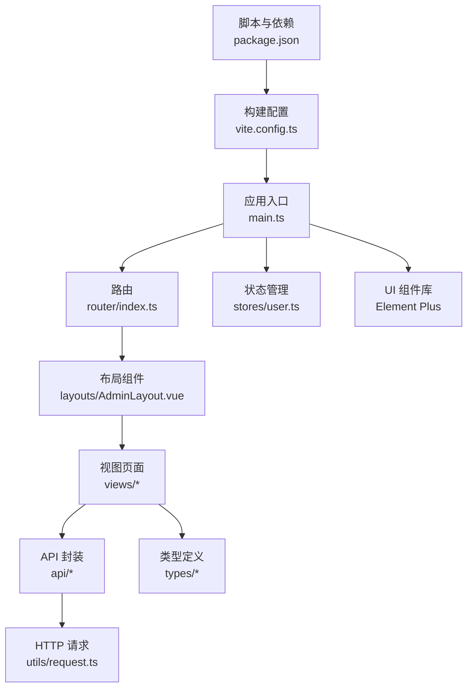
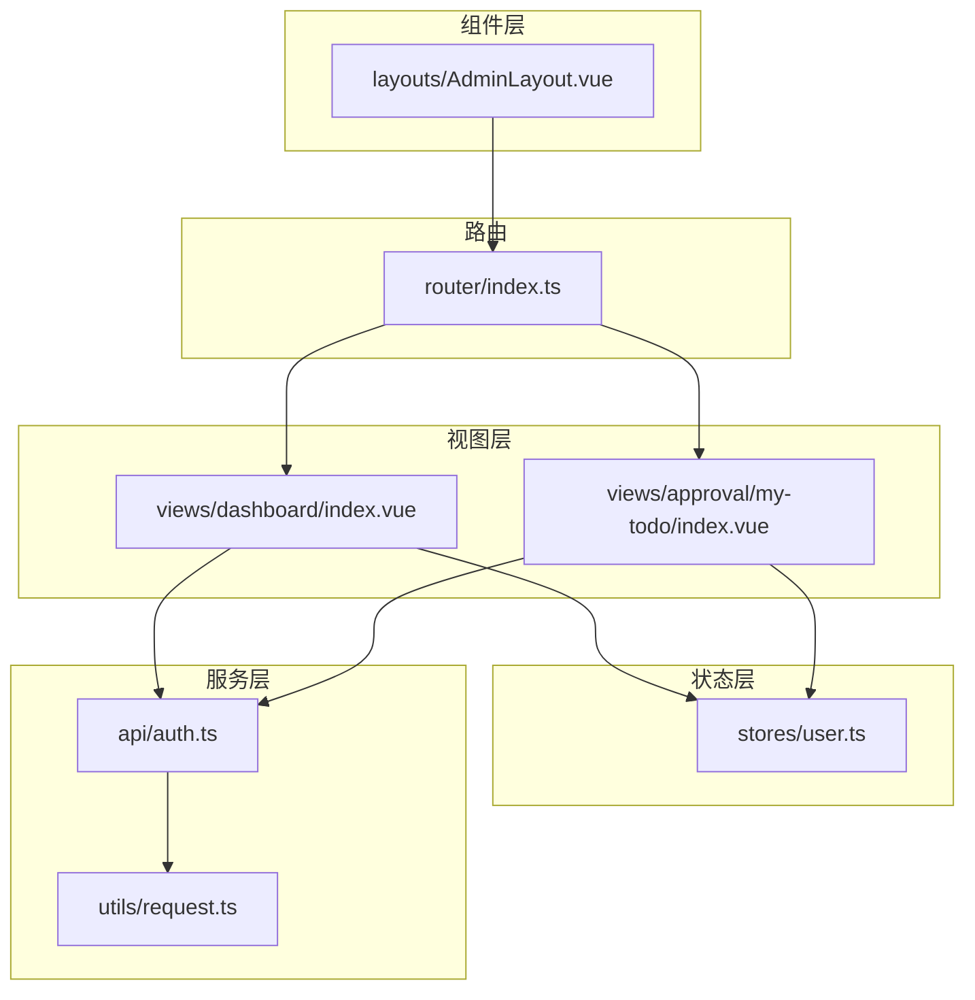
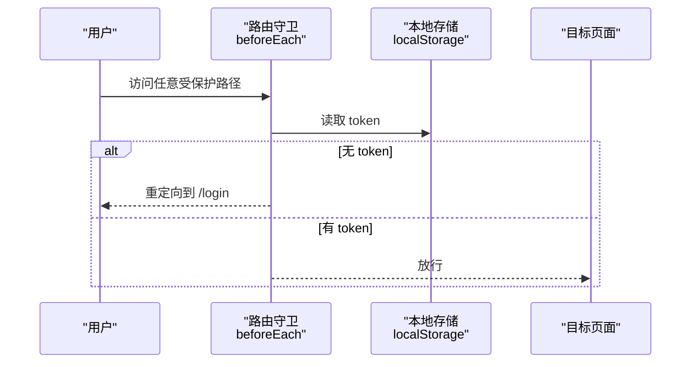
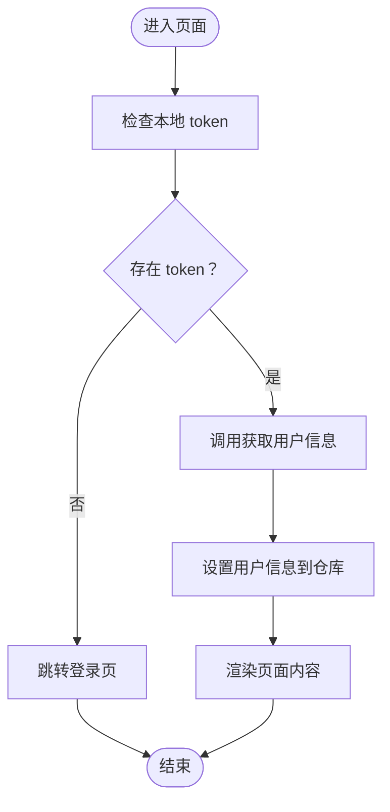
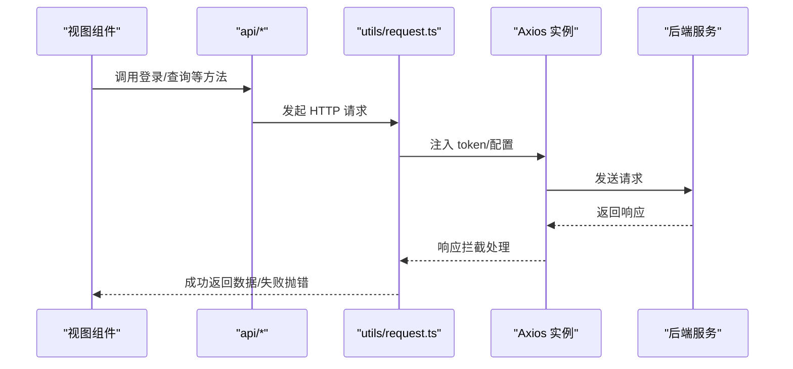
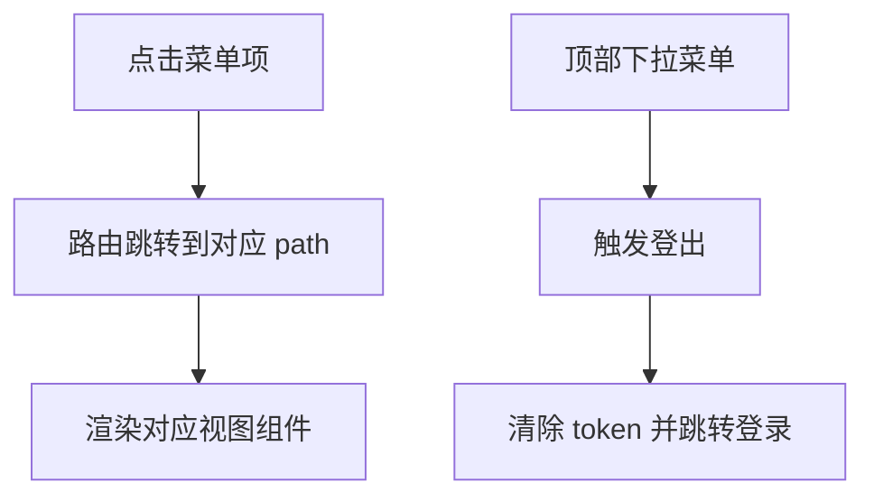
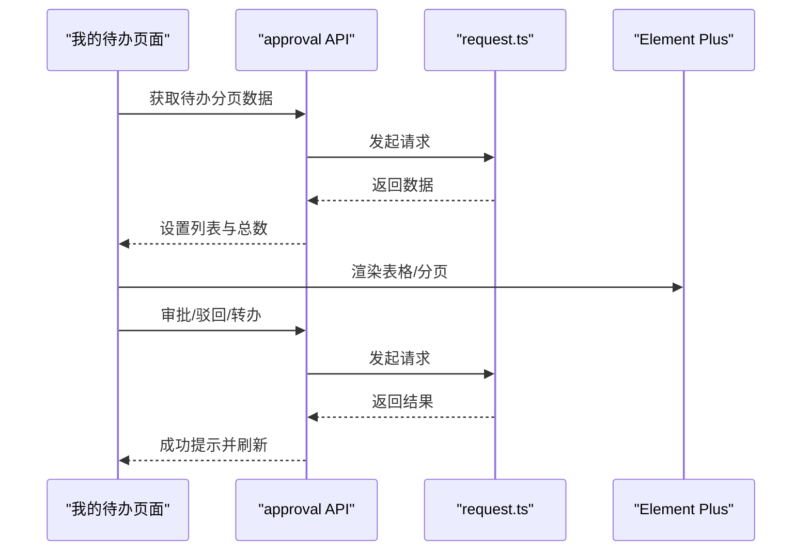
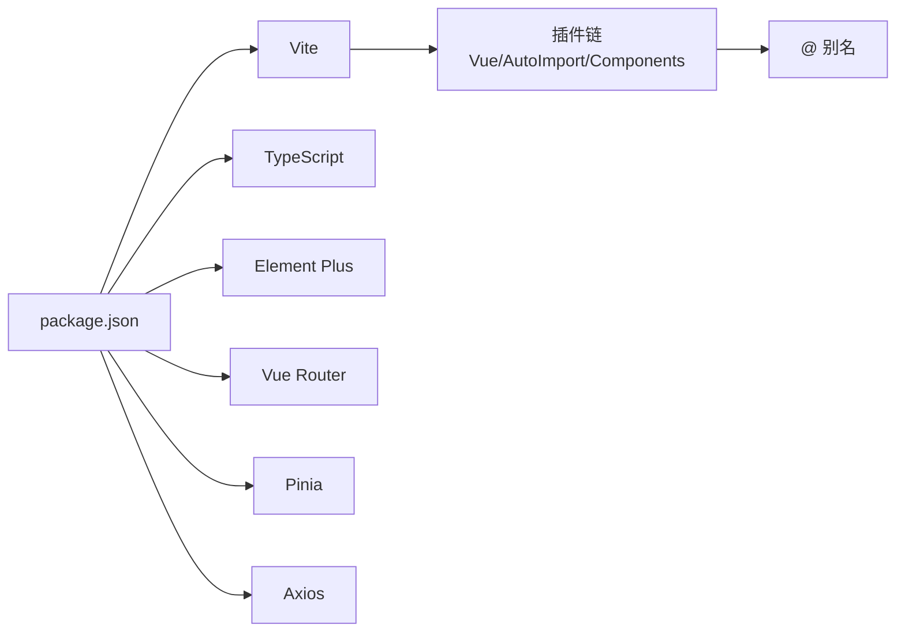

# 前端架构

<cite>
**本文引用的文件**
- [package.json](file://oa-ui/package.json)
- [vite.config.ts](file://oa-ui/vite.config.ts)
- [main.ts](file://oa-ui/src/main.ts)
- [index.ts](file://oa-ui/src/router/index.ts)
- [user.ts](file://oa-ui/src/stores/user.ts)
- [AdminLayout.vue](file://oa-ui/src/layouts/AdminLayout.vue)
- [auth.ts](file://oa-ui/src/api/auth.ts)
- [request.ts](file://oa-ui/src/utils/request.ts)
- [index.ts](file://oa-ui/src/types/index.ts)
- [my-todo/index.vue](file://oa-ui/src/views/approval/my-todo/index.vue)
- [dashboard/index.vue](file://oa-ui/src/views/dashboard/index.vue)
- [components.d.ts](file://oa-ui/src/components.d.ts)
- [auto-imports.d.ts](file://oa-ui/src/auto-imports.d.ts)
- [tsconfig.json](file://oa-ui/tsconfig.json)
</cite>

## 目录
1. [引言](#引言)
2. [项目结构](#项目结构)
3. [核心组件](#核心组件)
4. [架构总览](#架构总览)
5. [详细组件分析](#详细组件分析)
6. [依赖分析](#依赖分析)
7. [性能考虑](#性能考虑)
8. [故障排查指南](#故障排查指南)
9. [结论](#结论)
10. [附录](#附录)

## 引言
本文件面向 OA 审批管理系统前端，系统采用 Vue 3 + TypeScript + Vite 技术栈，结合 Element Plus 组件库与 Pinia 状态管理，围绕审批工作流与系统管理两大业务域构建。本文档从架构设计、目录组织、组件化理念、状态管理、路由与权限、UI 集成与定制、构建与测试到开发规范进行系统性阐述，帮助开发者快速理解并高效迭代。

## 项目结构
前端工程位于 oa-ui 目录，采用“按功能域分层 + 路由视图”的组织方式：
- 根配置：package.json、vite.config.ts、tsconfig.json
- 应用入口：main.ts
- 路由：router/index.ts
- 状态：stores/user.ts
- 视图：views 下按业务域划分（如 approval、system、leave、admin 等）
- 布局：layouts/AdminLayout.vue
- API 层：api/*（按领域拆分）
- 工具层：utils/request.ts（统一请求封装与拦截器）
- 类型：types/*（聚合导出）
- 组件注册：components.d.ts、auto-imports.d.ts（自动导入与组件解析）

图表来源
- [main.ts:1-14](file://oa-ui/src/main.ts#L1-L14)
- [index.ts:1-134](file://oa-ui/src/router/index.ts#L1-L134)
- [user.ts:1-32](file://oa-ui/src/stores/user.ts#L1-L32)
- [AdminLayout.vue:1-130](file://oa-ui/src/layouts/AdminLayout.vue#L1-L130)
- [auth.ts:1-14](file://oa-ui/src/api/auth.ts#L1-L14)
- [request.ts:1-42](file://oa-ui/src/utils/request.ts#L1-L42)
- [index.ts:1-21](file://oa-ui/src/types/index.ts#L1-L21)
- [vite.config.ts:1-40](file://oa-ui/vite.config.ts#L1-L40)
- [package.json:1-38](file://oa-ui/package.json#L1-L38)

章节来源
- [package.json:1-38](file://oa-ui/package.json#L1-L38)
- [vite.config.ts:1-40](file://oa-ui/vite.config.ts#L1-L40)
- [main.ts:1-14](file://oa-ui/src/main.ts#L1-L14)
- [index.ts:1-134](file://oa-ui/src/router/index.ts#L1-L134)
- [user.ts:1-32](file://oa-ui/src/stores/user.ts#L1-L32)
- [AdminLayout.vue:1-130](file://oa-ui/src/layouts/AdminLayout.vue#L1-L130)
- [auth.ts:1-14](file://oa-ui/src/api/auth.ts#L1-L14)
- [request.ts:1-42](file://oa-ui/src/utils/request.ts#L1-L42)
- [index.ts:1-21](file://oa-ui/src/types/index.ts#L1-L21)
- [tsconfig.json:1-24](file://oa-ui/tsconfig.json#L1-L24)

## 核心组件
- 应用入口与全局安装
  - 创建 Vue 应用，安装 Pinia、路由、Element Plus，并挂载根组件。
- 路由与权限
  - 基于 beforeEach 的简单令牌校验，非登录路径无令牌则重定向至登录页。
- 状态管理（Pinia）
  - 用户登录态、用户信息、登出与拉取个人信息的仓库。
- 布局与导航
  - AdminLayout 提供侧边菜单、顶部导航、折叠切换与下拉菜单。
- 请求与拦截
  - Axios 实例封装，统一注入 satoken 头，响应拦截处理业务码与鉴权异常。
- 类型体系
  - types/index.ts 聚合导出审批、系统相关类型与枚举，便于跨模块复用。

章节来源
- [main.ts:1-14](file://oa-ui/src/main.ts#L1-L14)
- [index.ts:124-131](file://oa-ui/src/router/index.ts#L124-L131)
- [user.ts:1-32](file://oa-ui/src/stores/user.ts#L1-L32)
- [AdminLayout.vue:1-130](file://oa-ui/src/layouts/AdminLayout.vue#L1-L130)
- [request.ts:1-42](file://oa-ui/src/utils/request.ts#L1-L42)
- [index.ts:1-21](file://oa-ui/src/types/index.ts#L1-L21)

## 架构总览
整体采用“视图-组件-状态-服务”分层，视图组件负责交互与展示；状态管理集中处理用户会话；API 层封装后端接口；工具层统一处理请求与响应；路由负责页面级导航与鉴权守卫。

图表来源
- [dashboard/index.vue:1-86](file://oa-ui/src/views/dashboard/index.vue#L1-L86)
- [my-todo/index.vue:1-160](file://oa-ui/src/views/approval/my-todo/index.vue#L1-L160)
- [AdminLayout.vue:1-130](file://oa-ui/src/layouts/AdminLayout.vue#L1-L130)
- [user.ts:1-32](file://oa-ui/src/stores/user.ts#L1-L32)
- [auth.ts:1-14](file://oa-ui/src/api/auth.ts#L1-L14)
- [request.ts:1-42](file://oa-ui/src/utils/request.ts#L1-L42)
- [index.ts:1-134](file://oa-ui/src/router/index.ts#L1-L134)

## 详细组件分析

### 路由与权限控制
- 路由结构
  - 登录页、后台布局包裹的子路由（仪表盘、系统管理、审批管理、请假管理、管理员页、通知等）。
- 权限控制
  - 全局前置守卫检查本地 token，非登录访问且无 token 则跳转登录。

图表来源
- [index.ts:124-131](file://oa-ui/src/router/index.ts#L124-L131)

章节来源
- [index.ts:1-134](file://oa-ui/src/router/index.ts#L1-L134)

### 状态管理（Pinia）与数据流
- 用户仓库
  - 管理 token 与用户信息，提供登录、拉取用户、登出方法。
  - 登录成功写入 localStorage 并设置 token；登出清理并跳转登录。
- 数据流
  - 页面组件通过仓库方法发起 API 调用，更新本地状态，驱动 UI 变化。

图表来源
- [user.ts:10-28](file://oa-ui/src/stores/user.ts#L10-L28)

章节来源
- [user.ts:1-32](file://oa-ui/src/stores/user.ts#L1-L32)

### 请求封装与拦截器
- 基础配置
  - baseURL 指向 /api/v1，超时 15 秒。
- 请求拦截
  - 自动注入 satoken 请求头。
- 响应拦截
  - 业务码 200 透传 data；其他情况弹出错误消息并处理 2004/401 场景（清除 token 并跳转登录）。
- 与 API 模块协作
  - api/* 模块通过 utils/request.ts 发起请求，避免重复逻辑。

图表来源
- [auth.ts:1-14](file://oa-ui/src/api/auth.ts#L1-L14)
- [request.ts:10-39](file://oa-ui/src/utils/request.ts#L10-L39)

章节来源
- [auth.ts:1-14](file://oa-ui/src/api/auth.ts#L1-L14)
- [request.ts:1-42](file://oa-ui/src/utils/request.ts#L1-L42)

### 布局与导航
- AdminLayout
  - 侧边菜单按系统管理、审批管理分组，支持折叠与路由跳转。
  - 顶部下拉菜单触发用户登出，联动仓库执行登出流程。
- 与路由配合
  - 菜单项与路由 path 对齐，点击即路由跳转。

图表来源
- [AdminLayout.vue:16-46](file://oa-ui/src/layouts/AdminLayout.vue#L16-L46)
- [AdminLayout.vue:86-90](file://oa-ui/src/layouts/AdminLayout.vue#L86-L90)
- [index.ts:124-131](file://oa-ui/src/router/index.ts#L124-L131)

章节来源
- [AdminLayout.vue:1-130](file://oa-ui/src/layouts/AdminLayout.vue#L1-L130)
- [index.ts:1-134](file://oa-ui/src/router/index.ts#L1-L134)

### 页面组件示例：我的待办
- 功能要点
  - 分页表格展示待办任务，支持搜索、查看、审批、驳回、转办。
  - 使用 Element Plus 表格、分页、对话框等组件。
- 数据流
  - 加载数据 -> 更新表格与分页 -> 操作弹窗 -> 调用 API -> 成功提示 -> 刷新列表。

图表来源
- [my-todo/index.vue:91-152](file://oa-ui/src/views/approval/my-todo/index.vue#L91-L152)

章节来源
- [my-todo/index.vue:1-160](file://oa-ui/src/views/approval/my-todo/index.vue#L1-L160)

### 页面组件示例：仪表盘
- 功能要点
  - 展示待办/已办/模板/抄送未读等统计卡片，以及最近审批动态。
- 数据流
  - 组件挂载时拉取统计数据，合并到响应式对象中渲染。

章节来源
- [dashboard/index.vue:1-86](file://oa-ui/src/views/dashboard/index.vue#L1-L86)

### 类型体系与复用
- types/index.ts
  - 聚合导出审批、系统相关类型与枚举，便于在 API、视图、组件间共享。
- 自动生成声明
  - components.d.ts 与 auto-imports.d.ts 由插件生成，减少手动导入与 TS 编译声明成本。

章节来源
- [index.ts:1-21](file://oa-ui/src/types/index.ts#L1-L21)
- [components.d.ts:1-59](file://oa-ui/src/components.d.ts#L1-L59)
- [auto-imports.d.ts:1-89](file://oa-ui/src/auto-imports.d.ts#L1-L89)

## 依赖分析
- 运行时依赖
  - Vue 3、Vue Router、Pinia、Element Plus、Axios、bpmn-js 等。
- 开发依赖
  - Vite、TypeScript、unplugin-auto-import、unplugin-vue-components、vitest、sass 等。
- 插件与别名
  - Vite 插件链启用 Vue、自动导入与组件解析，@ 别名指向 src。

图表来源
- [package.json:1-38](file://oa-ui/package.json#L1-L38)
- [vite.config.ts:13-24](file://oa-ui/vite.config.ts#L13-L24)
- [tsconfig.json:18-20](file://oa-ui/tsconfig.json#L18-L20)

章节来源
- [package.json:1-38](file://oa-ui/package.json#L1-L38)
- [vite.config.ts:1-40](file://oa-ui/vite.config.ts#L1-L40)
- [tsconfig.json:1-24](file://oa-ui/tsconfig.json#L1-L24)

## 性能考虑
- 代码分割与懒加载
  - 路由组件采用异步加载，减少首屏体积。
- 组件与 API 自动注册
  - Element Plus 解析器按需引入，降低打包体积。
- 构建与预览
  - Vite 构建开启类型检查与产物压缩，预览用于验证生产行为。
- 开发体验
  - 本地代理指向后端服务端口，避免跨域与环境差异。

章节来源
- [index.ts:9-119](file://oa-ui/src/router/index.ts#L9-L119)
- [vite.config.ts:13-39](file://oa-ui/vite.config.ts#L13-L39)

## 故障排查指南
- 登录后无法访问受保护页面
  - 检查 localStorage 中 token 是否存在；确认路由守卫逻辑与后端签发的 token 一致。
- 请求失败或频繁跳转登录
  - 查看响应拦截器对业务码与 401 的处理；确认 satoken 头是否正确注入。
- 组件/组合式 API 未识别
  - 确认 auto-imports.d.ts 与 components.d.ts 是否生成；TS 配置是否包含生成声明文件。
- 构建报错或类型不通过
  - 检查 tsconfig 的 moduleResolution 与 bundler 模式；确保路径映射与别名一致。

章节来源
- [index.ts:124-131](file://oa-ui/src/router/index.ts#L124-L131)
- [request.ts:18-39](file://oa-ui/src/utils/request.ts#L18-L39)
- [auto-imports.d.ts:1-89](file://oa-ui/src/auto-imports.d.ts#L1-L89)
- [components.d.ts:1-59](file://oa-ui/src/components.d.ts#L1-L59)
- [tsconfig.json:1-24](file://oa-ui/tsconfig.json#L1-L24)

## 结论
该前端架构以 Vue 3 + TypeScript + Vite 为基础，结合 Pinia 与 Element Plus，形成清晰的分层与职责边界：路由与权限在入口层统一处理，状态集中在仓库，请求在工具层统一收敛，类型在聚合层共享。页面组件围绕审批与系统管理展开，具备良好的可扩展性与可维护性。建议后续持续完善权限细化、国际化、主题定制与测试覆盖率，以支撑更大规模的业务演进。

## 附录
- 开发命令
  - dev、build、preview、lint、test、test:watch、test:coverage
- 关键配置
  - Vite 插件链、代理、别名；TS 路径映射；Element Plus 解析器

章节来源
- [package.json:6-14](file://oa-ui/package.json#L6-L14)
- [vite.config.ts:12-39](file://oa-ui/vite.config.ts#L12-L39)
- [tsconfig.json:17-21](file://oa-ui/tsconfig.json#L17-L21)