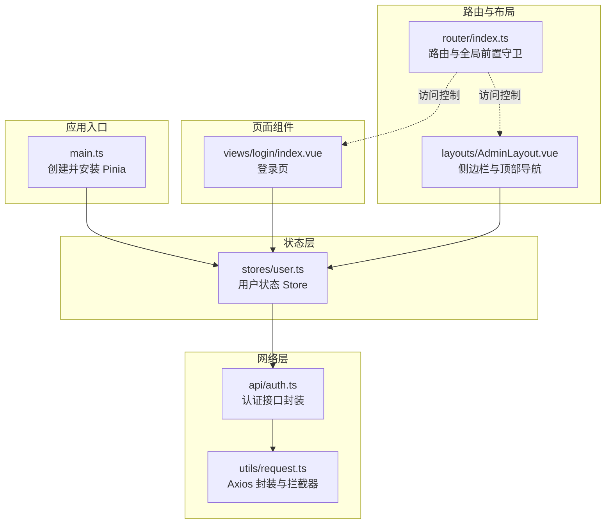
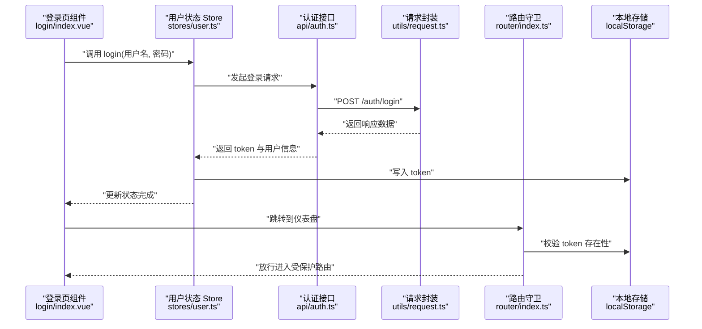
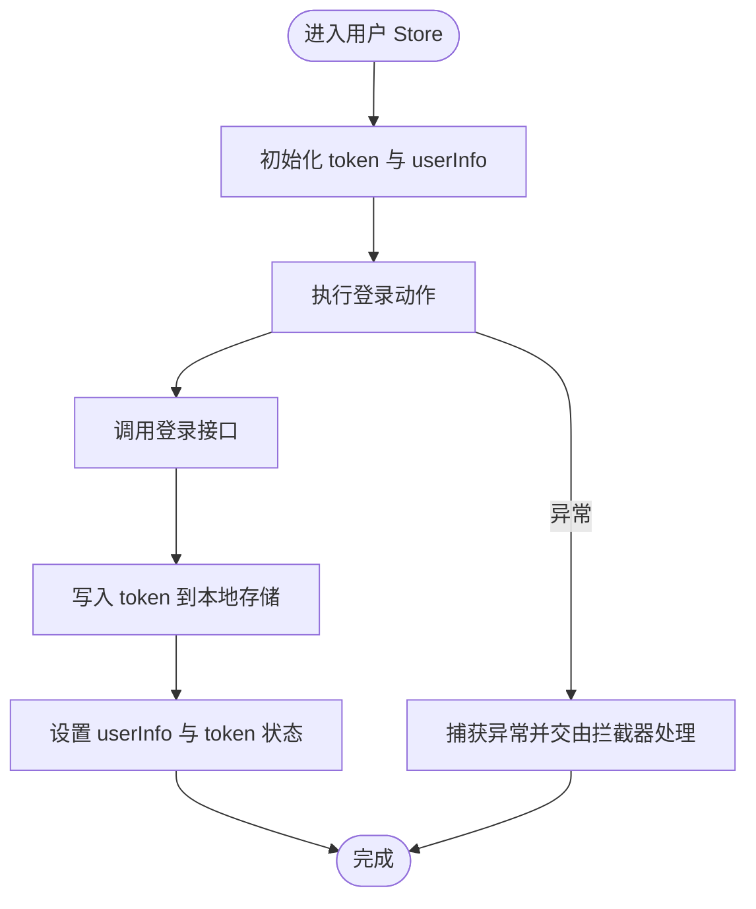
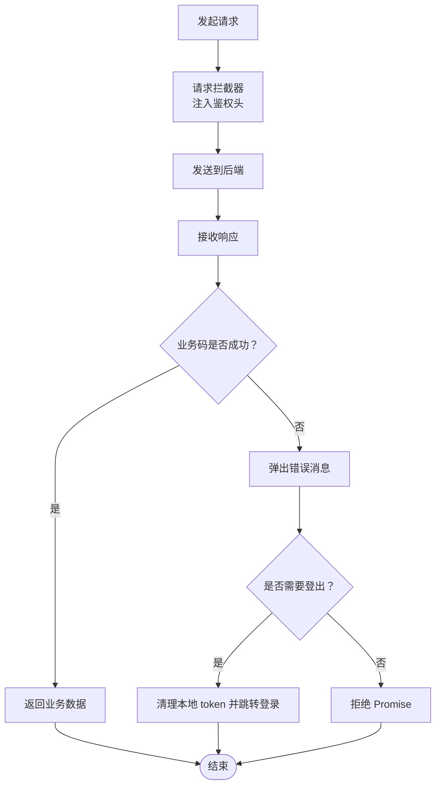
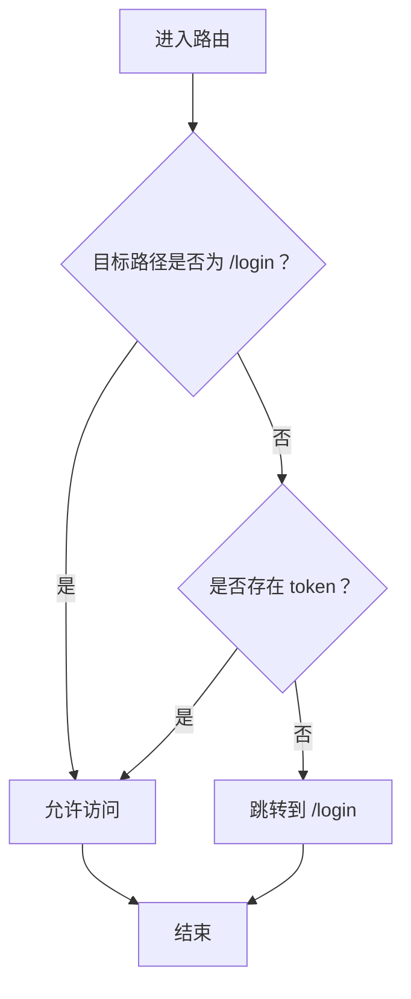
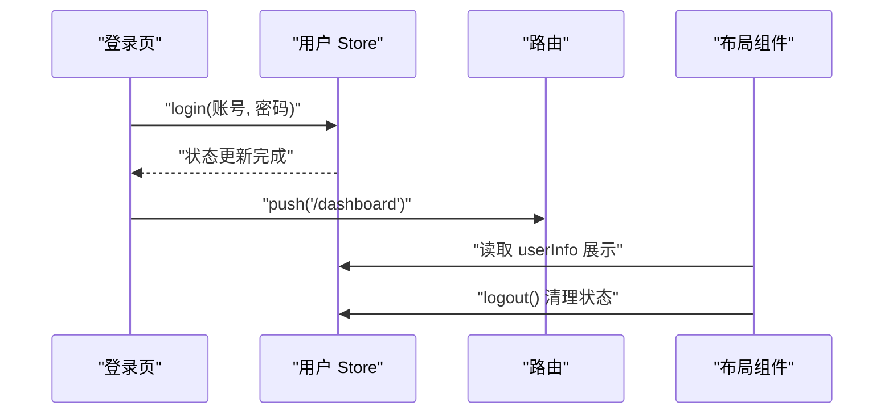
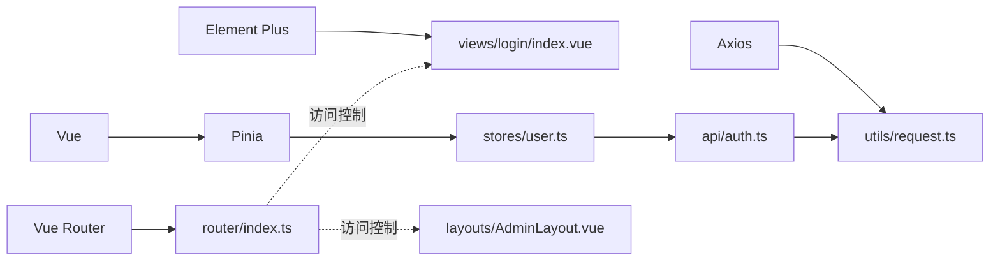

# 状态管理

<cite>
**本文引用的文件**
- [main.ts](file://oa-ui/src/main.ts)
- [user.ts](file://oa-ui/src/stores/user.ts)
- [auth.ts](file://oa-ui/src/api/auth.ts)
- [request.ts](file://oa-ui/src/utils/request.ts)
- [index.ts（路由）](file://oa-ui/src/router/index.ts)
- [AdminLayout.vue](file://oa-ui/src/layouts/AdminLayout.vue)
- [login/index.vue](file://oa-ui/src/views/login/index.vue)
- [index.ts（类型定义）](file://oa-ui/src/types/index.ts)
- [package.json](file://oa-ui/package.json)
</cite>

## 目录
1. [简介](#简介)
2. [项目结构](#项目结构)
3. [核心组件](#核心组件)
4. [架构总览](#架构总览)
5. [详细组件分析](#详细组件分析)
6. [依赖分析](#依赖分析)
7. [性能考虑](#性能考虑)
8. [故障排查指南](#故障排查指南)
9. [结论](#结论)
10. [附录](#附录)

## 简介
本文件围绕前端状态管理展开，重点基于当前仓库中已实现的 Pinia 状态管理方案，系统性阐述用户状态、应用状态与业务状态的管理策略，覆盖状态持久化、状态同步与恢复机制，跨组件状态共享与更新最佳实践，异步状态处理与副作用管理，并给出调试与性能优化建议。由于当前仓库仅实现了用户态状态（用户登录态与个人信息），本文将以此为基础，提供可扩展到更复杂业务场景的设计思路与落地方法。

## 项目结构
- 应用入口在应用根目录注册 Pinia，并挂载 Vue 应用。
- 用户状态集中在单个 store 中，采用组合式 API 风格（setup store）。
- 请求统一通过封装的 axios 实例发送，拦截器负责注入鉴权头与统一错误处理。
- 路由守卫结合本地存储 token 控制访问权限。
- 布局组件与页面组件通过 store 进行状态消费与交互。

**图表来源**
- [main.ts:1-14](file://oa-ui/src/main.ts#L1-L14)
- [user.ts:1-32](file://oa-ui/src/stores/user.ts#L1-L32)
- [auth.ts:1-14](file://oa-ui/src/api/auth.ts#L1-L14)
- [request.ts:1-42](file://oa-ui/src/utils/request.ts#L1-L42)
- [index.ts（路由）:1-134](file://oa-ui/src/router/index.ts#L1-L134)
- [AdminLayout.vue:1-130](file://oa-ui/src/layouts/AdminLayout.vue#L1-L130)
- [login/index.vue:1-73](file://oa-ui/src/views/login/index.vue#L1-L73)

**章节来源**
- [main.ts:1-14](file://oa-ui/src/main.ts#L1-L14)
- [package.json:1-38](file://oa-ui/package.json#L1-L38)

## 核心组件
- Pinia 安装与初始化：在应用入口创建并安装 Pinia，确保后续各组件可通过组合式 API 使用 store。
- 用户状态 Store：集中管理 token 与用户信息，提供登录、获取当前用户、登出等动作；token 持久化至本地存储。
- 请求封装与拦截器：统一封装 axios 实例，自动注入鉴权头；对响应进行统一校验与错误提示；对 401/特定业务码进行登出重定向。
- 路由守卫：非登录路径访问时检查本地 token，缺失则强制跳转登录页。
- 布局与页面：布局组件展示用户信息并触发登出；登录页调用用户 store 执行登录流程。

**章节来源**
- [user.ts:1-32](file://oa-ui/src/stores/user.ts#L1-L32)
- [auth.ts:1-14](file://oa-ui/src/api/auth.ts#L1-L14)
- [request.ts:1-42](file://oa-ui/src/utils/request.ts#L1-L42)
- [index.ts（路由）:124-131](file://oa-ui/src/router/index.ts#L124-L131)
- [AdminLayout.vue:74-91](file://oa-ui/src/layouts/AdminLayout.vue#L74-L91)
- [login/index.vue:20-49](file://oa-ui/src/views/login/index.vue#L20-L49)

## 架构总览
下图展示了从用户操作到状态变更与 UI 更新的端到端流程，涵盖登录、鉴权头注入、路由守卫与状态持久化。

**图表来源**
- [login/index.vue:37-49](file://oa-ui/src/views/login/index.vue#L37-L49)
- [user.ts:10-15](file://oa-ui/src/stores/user.ts#L10-L15)
- [auth.ts:3-5](file://oa-ui/src/api/auth.ts#L3-L5)
- [request.ts:10-16](file://oa-ui/src/utils/request.ts#L10-L16)
- [index.ts（路由）:124-131](file://oa-ui/src/router/index.ts#L124-L131)

## 详细组件分析

### 用户状态 Store 设计与实现
- 状态结构
  - token：字符串，用于鉴权头传递；初始化来自本地存储。
  - userInfo：对象或空，保存当前用户信息。
- 动作（Actions）
  - 登录：调用登录接口，成功后写入 token 并缓存用户信息，同时持久化 token。
  - 获取当前用户：调用“获取当前用户”接口，刷新本地用户信息。
  - 登出：调用登出接口，清除 token 与用户信息，移除本地 token，并跳转登录页。
- 设计要点
  - 使用组合式 API 的 setup store，返回状态与动作，便于在组件中直接解构使用。
  - 与本地存储配合实现轻量级持久化，避免刷新丢失登录态。
  - 在登录成功后立即写入本地存储，保证后续请求能携带鉴权头。

**图表来源**
- [user.ts:6-31](file://oa-ui/src/stores/user.ts#L6-L31)

**章节来源**
- [user.ts:1-32](file://oa-ui/src/stores/user.ts#L1-L32)

### 请求封装与鉴权拦截
- 统一基地址与超时配置。
- 请求拦截：若存在 token，则在请求头注入自定义字段以传递鉴权信息。
- 响应拦截：
  - 对业务成功码进行透传，否则弹出错误消息并根据特定业务码或 401 自动清空 token 并跳转登录。
  - 对网络错误统一提示并拒绝 Promise。
- 作用：将“鉴权”与“错误处理”下沉到基础设施层，组件无需重复处理。

**图表来源**
- [request.ts:10-39](file://oa-ui/src/utils/request.ts#L10-L39)

**章节来源**
- [request.ts:1-42](file://oa-ui/src/utils/request.ts#L1-L42)

### 路由守卫与访问控制
- 全局前置守卫：当访问非登录路径且本地不存在 token 时，强制跳转登录页。
- 与请求拦截器配合：即使前端未携带 token，后端返回 401 或业务登出码也会触发前端清理与跳转，确保一致的登出体验。

**图表来源**
- [index.ts（路由）:124-131](file://oa-ui/src/router/index.ts#L124-L131)

**章节来源**
- [index.ts（路由）:124-131](file://oa-ui/src/router/index.ts#L124-L131)

### 布局与页面中的状态消费
- 布局组件：从用户 store 读取用户信息并在顶部展示；通过下拉菜单触发登出动作。
- 登录页：表单校验通过后调用用户 store 的登录动作，成功后跳转到仪表盘。

**图表来源**
- [login/index.vue:37-49](file://oa-ui/src/views/login/index.vue#L37-L49)
- [AdminLayout.vue:86-90](file://oa-ui/src/layouts/AdminLayout.vue#L86-L90)
- [user.ts:22-28](file://oa-ui/src/stores/user.ts#L22-L28)

**章节来源**
- [AdminLayout.vue:74-91](file://oa-ui/src/layouts/AdminLayout.vue#L74-L91)
- [login/index.vue:20-49](file://oa-ui/src/views/login/index.vue#L20-L49)

## 依赖分析
- 外部依赖
  - Vue 3、Vue Router、Element Plus、Axios、Pinia。
- 内部依赖关系
  - 应用入口依赖 Pinia；用户 Store 依赖认证 API；认证 API 依赖请求封装；路由守卫依赖本地存储；布局与页面依赖用户 Store。

**图表来源**
- [package.json:15-23](file://oa-ui/package.json#L15-L23)
- [main.ts:1-14](file://oa-ui/src/main.ts#L1-L14)
- [user.ts:1-32](file://oa-ui/src/stores/user.ts#L1-L32)
- [auth.ts:1-14](file://oa-ui/src/api/auth.ts#L1-L14)
- [request.ts:1-42](file://oa-ui/src/utils/request.ts#L1-L42)
- [index.ts（路由）:1-134](file://oa-ui/src/router/index.ts#L1-L134)
- [AdminLayout.vue:1-130](file://oa-ui/src/layouts/AdminLayout.vue#L1-L130)
- [login/index.vue:1-73](file://oa-ui/src/views/login/index.vue#L1-L73)

**章节来源**
- [package.json:1-38](file://oa-ui/package.json#L1-L38)

## 性能考虑
- 状态粒度与订阅范围
  - 将用户信息与登录态拆分为独立状态，避免无关 UI 重复渲染。
  - 在布局组件中仅订阅必要的用户信息字段，减少不必要的响应式开销。
- 异步加载与缓存
  - 登录成功后立即持久化 token，减少后续请求失败导致的重试与闪烁。
  - 对于非关键页面（如仪表盘），可采用懒加载与骨架屏提升首屏体验。
- 请求拦截与错误短路
  - 在拦截器中尽早处理 401/业务登出码，避免无效请求堆积。
- 组件级优化
  - 使用浅层响应式对象缓存静态数据，避免深层嵌套导致的追踪成本上升。
  - 合理使用 computed 与派生状态，减少重复计算。

## 故障排查指南
- 登录后仍被重定向到登录页
  - 检查登录动作是否成功写入 token 至本地存储。
  - 确认路由守卫逻辑与本地存储键值一致。
- 请求始终失败或频繁弹错
  - 检查请求拦截器是否正确注入鉴权头。
  - 查看响应拦截器对业务码与 401 的处理分支是否触发。
- 登出后状态未清空
  - 确认登出动作是否调用了清理 token 与用户信息，并跳转登录页。
- 顶部显示用户信息为空
  - 检查是否在登录后调用了获取当前用户接口以刷新 userInfo。

**章节来源**
- [user.ts:10-28](file://oa-ui/src/stores/user.ts#L10-L28)
- [request.ts:10-39](file://oa-ui/src/utils/request.ts#L10-L39)
- [index.ts（路由）:124-131](file://oa-ui/src/router/index.ts#L124-L131)
- [AdminLayout.vue:54-58](file://oa-ui/src/layouts/AdminLayout.vue#L54-L58)

## 结论
当前仓库以最小可行方式实现了基于 Pinia 的用户态状态管理：通过组合式 Store 管理 token 与用户信息，借助 axios 拦截器实现统一鉴权与错误处理，配合路由守卫完成访问控制。该方案具备良好的可维护性与扩展性，适合在此基础上逐步引入应用态（如主题、语言、布局偏好）与业务态（如审批列表、模板编辑器状态）的分层设计与持久化策略。

## 附录

### 状态管理架构设计与扩展策略
- 分层设计
  - 用户态：登录态、用户信息、权限标识。
  - 应用态：主题、语言、布局折叠状态、全局配置。
  - 业务态：审批实例列表、流程设计器状态、通知中心等。
- 状态持久化
  - 用户态：token 与用户信息可持久化至本地存储，实现刷新不掉线。
  - 应用态：主题与语言偏好可持久化，提升用户体验。
  - 业务态：对高频查询参数与筛选条件进行持久化，减少重复输入。
- 状态同步与恢复
  - 在应用启动时优先从本地存储恢复用户态，再按需拉取最新数据。
  - 对于业务态，采用“内存为主、本地为辅”的策略，避免过度持久化带来的复杂性。
- 跨组件共享与更新最佳实践
  - 将公共状态收敛到单一 store，避免多处分散更新。
  - 使用派生状态与计算属性，降低组件间耦合。
  - 对高频更新的 UI 状态（如表单输入）采用局部组件状态，避免污染全局 store。
- 异步状态处理与副作用管理
  - 使用组合式 Store 的动作封装异步流程，集中处理 loading、错误与成功回调。
  - 对副作用（如定时器、事件监听）在组件卸载时及时清理，防止内存泄漏。
- 调试与性能监控
  - 使用浏览器开发工具观察 Pinia 状态变化，定位异常更新。
  - 对关键接口埋点统计耗时与成功率，结合错误拦截器记录异常堆栈。
  - 对大型列表与复杂表单采用虚拟滚动与节流/防抖优化渲染性能。