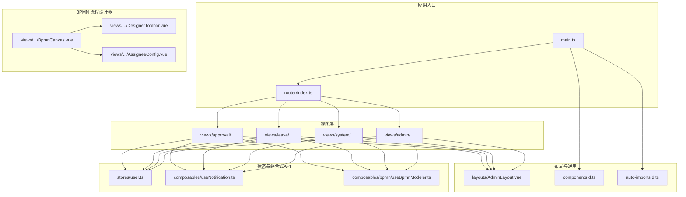
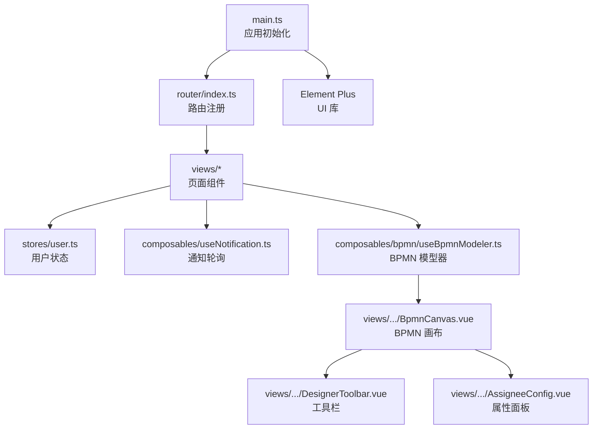
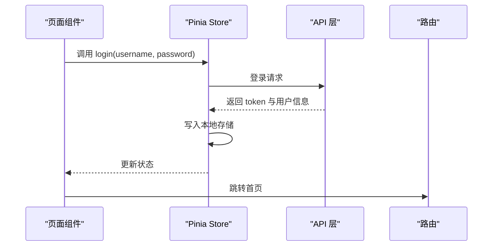
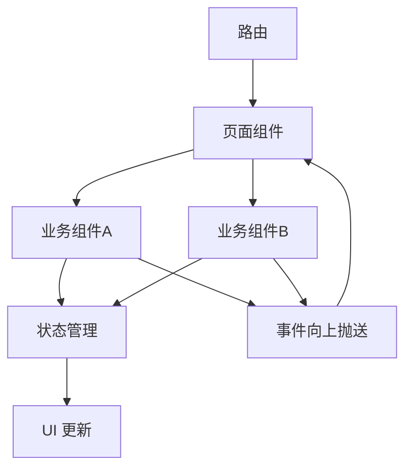
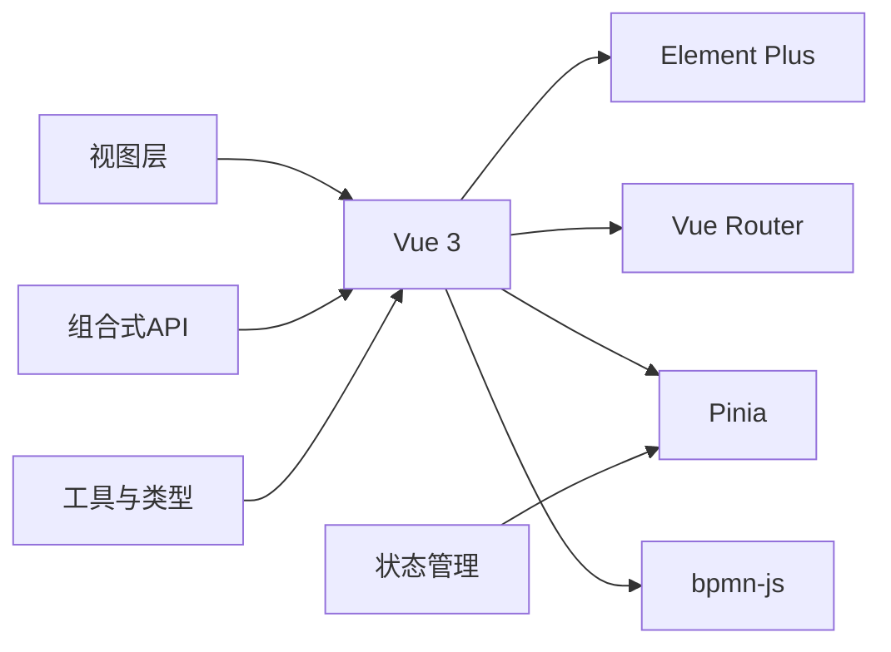

# 组件设计

<cite>
**本文引用的文件**
- [package.json](file://oa-ui/package.json)
- [main.ts](file://oa-ui/src/main.ts)
- [router/index.ts](file://oa-ui/src/router/index.ts)
- [stores/user.ts](file://oa-ui/src/stores/user.ts)
- [composables/useNotification.ts](file://oa-ui/src/composables/useNotification.ts)
- [composables/bpmn/useBpmnModeler.ts](file://oa-ui/src/composables/bpmn/useBpmnModeler.ts)
- [views/approval/instance/components/ApprovalTimeline.vue](file://oa-ui/src/views/approval/instance/components/ApprovalTimeline.vue)
- [views/approval/template/designer/components/BpmnCanvas.vue](file://oa-ui/src/views/approval/template/designer/components/BpmnCanvas.vue)
- [views/approval/template/designer/components/DesignerToolbar.vue](file://oa-ui/src/views/approval/template/designer/components/DesignerToolbar.vue)
- [views/approval/template/designer/components/panels/AssigneeConfig.vue](file://oa-ui/src/views/approval/template/designer/components/panels/AssigneeConfig.vue)
- [views/leave/components/LeaveFormDialog.vue](file://oa-ui/src/views/leave/components/LeaveFormDialog.vue)
- [components.d.ts](file://oa-ui/src/components.d.ts)
- [auto-imports.d.ts](file://oa-ui/src/auto-imports.d.ts)
- [bpmn/constants.ts](file://oa-ui/src/bpmn/constants.ts)
- [bpmn/bpmn-utils.ts](file://oa-ui/src/bpmn/bpmn-utils.ts)
- [styles/bpmn-overrides.scss](file://oa-ui/src/styles/bpmn-overrides.scss)
</cite>

## 目录
1. [引言](#引言)
2. [项目结构](#项目结构)
3. [核心组件](#核心组件)
4. [架构总览](#架构总览)
5. [组件详细分析](#组件详细分析)
6. [依赖关系分析](#依赖关系分析)
7. [性能考虑](#性能考虑)
8. [故障排查指南](#故障排查指南)
9. [结论](#结论)
10. [附录](#附录)

## 引言
本文件面向前端组件设计与开发，系统性梳理本项目的组件分类体系、设计原则、复用策略、props 设计、事件通信与插槽使用模式，并结合实际代码示例说明组合式 API 的使用场景与实现方式；同时阐述组件间依赖关系与数据流向、响应式设计与移动端适配方案、组件测试策略与性能优化技巧，以及开发规范与命名约定。

## 项目结构
前端工程位于 oa-ui 目录，采用 Vue 3 + TypeScript + Vite 架构，配合 Element Plus、Pinia、Vue Router、bpmn-js 等生态库。项目按“视图层（views）+ 布局（layouts）+ 组合式API（composables）+ 类型（types）+ 工具（utils）+ 样式（styles）”组织，形成清晰的分层与职责边界。

图表来源
- [main.ts:1-14](file://oa-ui/src/main.ts#L1-L14)
- [router/index.ts:1-134](file://oa-ui/src/router/index.ts#L1-L134)
- [stores/user.ts:1-32](file://oa-ui/src/stores/user.ts#L1-L32)
- [composables/useNotification.ts:1-31](file://oa-ui/src/composables/useNotification.ts#L1-L31)
- [composables/bpmn/useBpmnModeler.ts:1-98](file://oa-ui/src/composables/bpmn/useBpmnModeler.ts#L1-L98)
- [views/approval/template/designer/components/BpmnCanvas.vue:1-107](file://oa-ui/src/views/approval/template/designer/components/BpmnCanvas.vue#L1-L107)
- [views/approval/template/designer/components/DesignerToolbar.vue:1-132](file://oa-ui/src/views/approval/template/designer/components/DesignerToolbar.vue#L1-L132)
- [views/approval/template/designer/components/panels/AssigneeConfig.vue:1-172](file://oa-ui/src/views/approval/template/designer/components/panels/AssigneeConfig.vue#L1-L172)

章节来源
- [main.ts:1-14](file://oa-ui/src/main.ts#L1-L14)
- [router/index.ts:1-134](file://oa-ui/src/router/index.ts#L1-L134)
- [package.json:1-38](file://oa-ui/package.json#L1-L38)

## 核心组件
- 页面组件：以路由为单位的视图页面，如“我的待办”“流程设计器”“请假管理”等，负责承载业务主内容与交互。
- 业务组件：围绕具体业务域的可复用组件，如“审批时间线”“BPMN 画布”“表单对话框”等，封装业务逻辑与 UI。
- 通用组件：基于 Element Plus 的通用 UI 组件，通过自动导入与全局类型声明在全项目可用。

设计原则与复用策略
- 单一职责：每个组件聚焦一个明确的功能或展示面。
- 可配置性：通过 props 提供最小必要配置，避免硬编码。
- 事件驱动：通过 emits 与父组件解耦，便于组合与测试。
- 插槽扩展：在关键位置提供默认插槽或具名插槽，支持定制化渲染。
- 组合式 API：将跨组件共享的状态与逻辑抽取到 composable 中，提升复用与可测性。

章节来源
- [components.d.ts:1-59](file://oa-ui/src/components.d.ts#L1-L59)
- [auto-imports.d.ts:1-89](file://oa-ui/src/auto-imports.d.ts#L1-L89)

## 架构总览
应用启动后，通过 main.ts 注册 Pinia、路由与 Element Plus；路由定义了完整的页面导航；状态通过 Pinia store 管理；组合式 API 负责跨页面的共享逻辑；视图层组件通过 props、events、slots 进行协作；BPMN 相关组件负责流程可视化与编辑。

图表来源
- [main.ts:1-14](file://oa-ui/src/main.ts#L1-L14)
- [router/index.ts:1-134](file://oa-ui/src/router/index.ts#L1-L134)
- [stores/user.ts:1-32](file://oa-ui/src/stores/user.ts#L1-L32)
- [composables/useNotification.ts:1-31](file://oa-ui/src/composables/useNotification.ts#L1-L31)
- [composables/bpmn/useBpmnModeler.ts:1-98](file://oa-ui/src/composables/bpmn/useBpmnModeler.ts#L1-L98)
- [views/approval/template/designer/components/BpmnCanvas.vue:1-107](file://oa-ui/src/views/approval/template/designer/components/BpmnCanvas.vue#L1-L107)
- [views/approval/template/designer/components/DesignerToolbar.vue:1-132](file://oa-ui/src/views/approval/template/designer/components/DesignerToolbar.vue#L1-L132)
- [views/approval/template/designer/components/panels/AssigneeConfig.vue:1-172](file://oa-ui/src/views/approval/template/designer/components/panels/AssigneeConfig.vue#L1-L172)

## 组件详细分析

### 组件分类与职责
- 页面组件
  - “我的待办/我的申请/我的已办”等列表页：负责数据拉取、分页、筛选与操作按钮。
  - “流程设计器”：集成 BPMN 画布、工具栏、属性面板，完成流程编辑与发布。
  - “请假管理”：列表与表单对话框，支持新建、编辑、重新提交。
- 业务组件
  - 审批时间线：展示审批任务结果与评论。
  - BPMN 画布：封装 bpmn-js 初始化、缩放、销毁与事件暴露。
  - 属性面板：根据节点类型动态渲染配置项。
- 通用组件
  - 基于 Element Plus 的表单、表格、对话框、标签等，通过自动导入全局可用。

章节来源
- [router/index.ts:1-134](file://oa-ui/src/router/index.ts#L1-L134)
- [views/approval/instance/components/ApprovalTimeline.vue:1-100](file://oa-ui/src/views/approval/instance/components/ApprovalTimeline.vue#L1-L100)
- [views/approval/template/designer/components/BpmnCanvas.vue:1-107](file://oa-ui/src/views/approval/template/designer/components/BpmnCanvas.vue#L1-L107)
- [views/approval/template/designer/components/panels/AssigneeConfig.vue:1-172](file://oa-ui/src/views/approval/template/designer/components/panels/AssigneeConfig.vue#L1-L172)
- [views/leave/components/LeaveFormDialog.vue:1-160](file://oa-ui/src/views/leave/components/LeaveFormDialog.vue#L1-L160)

### Props 设计、事件通信与插槽使用
- Props 设计
  - 明确必填与可选字段，使用类型约束，避免运行时错误。
  - 对复杂对象建议拆分为多个简单 props，降低耦合。
- 事件通信
  - 使用 defineEmits 声明事件签名，保证父子通信契约清晰。
  - 通过事件向上传递状态变化与用户操作意图。
- 插槽使用
  - 在通用容器组件中提供默认插槽，允许外部自定义内容。
  - 在业务组件中按需提供具名插槽，增强可扩展性。

示例参考
- 表单对话框通过 props 控制可见性与初始数据，通过事件通知父组件更新与保存完成。
- BPMN 画布通过 emits 暴露 modeler 实例，供上层工具栏调用撤销/重做/缩放等能力。

章节来源
- [views/leave/components/LeaveFormDialog.vue:65-73](file://oa-ui/src/views/leave/components/LeaveFormDialog.vue#L65-L73)
- [views/approval/template/designer/components/BpmnCanvas.vue:27-29](file://oa-ui/src/views/approval/template/designer/components/BpmnCanvas.vue#L27-L29)
- [views/approval/template/designer/components/DesignerToolbar.vue:80-91](file://oa-ui/src/views/approval/template/designer/components/DesignerToolbar.vue#L80-L91)

### 组合式 API 使用场景与实现
- useNotification：封装通知未读数轮询，提供 startPolling/stopPolling 方法，避免在多个页面重复实现。
- useBpmnModeler：封装 BPMN Modeler/Viewer 生命周期、XML 导入导出、错误处理与缩放控制，统一模型操作入口。
- 用户状态：Pinia store 管理登录态与用户信息，提供登录、登出、获取当前用户等方法。

图表来源
- [stores/user.ts:10-15](file://oa-ui/src/stores/user.ts#L10-L15)
- [router/index.ts:124-131](file://oa-ui/src/router/index.ts#L124-L131)

章节来源
- [composables/useNotification.ts:1-31](file://oa-ui/src/composables/useNotification.ts#L1-L31)
- [composables/bpmn/useBpmnModeler.ts:1-98](file://oa-ui/src/composables/bpmn/useBpmnModeler.ts#L1-L98)
- [stores/user.ts:1-32](file://oa-ui/src/stores/user.ts#L1-L32)

### 组件间依赖关系与数据流向
- 视图层组件通过路由组织，共享 AdminLayout 布局。
- 业务组件之间通过 props 与 events 解耦：如 DesignerToolbar 与 BpmnCanvas 通过事件协调工具行为。
- 数据流向通常为：路由 -> 页面组件 -> 业务组件 -> API -> 状态管理 -> UI 更新。

图表来源
- [router/index.ts:1-134](file://oa-ui/src/router/index.ts#L1-L134)
- [views/approval/template/designer/components/DesignerToolbar.vue:1-132](file://oa-ui/src/views/approval/template/designer/components/DesignerToolbar.vue#L1-L132)
- [views/approval/template/designer/components/BpmnCanvas.vue:1-107](file://oa-ui/src/views/approval/template/designer/components/BpmnCanvas.vue#L1-L107)

### 响应式设计与移动端适配
- 使用 Element Plus 的栅格系统与弹性布局，确保在不同屏幕尺寸下保持良好可读性。
- 对于 BPMN 画布等大屏专用组件，提供缩放与自适应功能，避免移动端过度拥挤。
- 全局样式覆盖与主题变量结合，统一视觉风格。

章节来源
- [styles/bpmn-overrides.scss](file://oa-ui/src/styles/bpmn-overrides.scss)
- [views/approval/template/designer/components/BpmnCanvas.vue:82-105](file://oa-ui/src/views/approval/template/designer/components/BpmnCanvas.vue#L82-L105)

### 组件测试策略
- 单元测试：对组合式 API 与纯函数进行独立测试，验证状态变更与边界条件。
- 集成测试：对组件交互流程进行端到端测试，覆盖关键用户路径。
- 覆盖率：通过 Vitest 与覆盖率工具确保核心逻辑被充分覆盖。

章节来源
- [package.json:11-13](file://oa-ui/package.json#L11-L13)

## 依赖关系分析
- 外部依赖：Vue 3、Element Plus、Pinia、Vue Router、bpmn-js。
- 内部依赖：视图层依赖路由与状态；业务组件依赖组合式 API；通用组件依赖 Element Plus 自动导入。

图表来源
- [package.json:15-23](file://oa-ui/package.json#L15-L23)
- [main.ts:1-14](file://oa-ui/src/main.ts#L1-L14)

章节来源
- [package.json:1-38](file://oa-ui/package.json#L1-L38)
- [main.ts:1-14](file://oa-ui/src/main.ts#L1-L14)

## 性能考虑
- 组件懒加载：路由级异步加载页面组件，减少首屏体积。
- 状态持久化：仅缓存必要状态，避免内存泄漏。
- 渲染优化：合理使用 v-if/v-show、计算属性与浅拷贝，避免不必要的重渲染。
- 资源加载：BPMN 字体与样式按需引入，避免全局污染。
- 轮询节流：通知轮询设置合理间隔，失败时静默处理，避免频繁请求。

章节来源
- [router/index.ts:6-122](file://oa-ui/src/router/index.ts#L6-L122)
- [composables/useNotification.ts:16-27](file://oa-ui/src/composables/useNotification.ts#L16-L27)
- [views/approval/template/designer/components/BpmnCanvas.vue:18-20](file://oa-ui/src/views/approval/template/designer/components/BpmnCanvas.vue#L18-L20)

## 故障排查指南
- 登录态异常：检查路由守卫与本地存储 token，确认登出后跳转登录页。
- BPMN 画布不显示：确认容器元素存在且具备宽高，检查 ResizeObserver 与模型器实例生命周期。
- 表单校验失败：核对表单规则与触发时机，确保在提交前执行 validate。
- 通知未刷新：确认轮询是否启动，网络错误是否被捕获并忽略。

章节来源
- [router/index.ts:124-131](file://oa-ui/src/router/index.ts#L124-L131)
- [views/approval/template/designer/components/BpmnCanvas.vue:39-77](file://oa-ui/src/views/approval/template/designer/components/BpmnCanvas.vue#L39-L77)
- [views/leave/components/LeaveFormDialog.vue:102-119](file://oa-ui/src/views/leave/components/LeaveFormDialog.vue#L102-L119)
- [composables/useNotification.ts:8-14](file://oa-ui/src/composables/useNotification.ts#L8-L14)

## 结论
本项目通过清晰的组件分层、规范的 props/事件/插槽设计、可复用的组合式 API 与 Pinia 状态管理，构建了高内聚、低耦合的前端组件体系。配合路由与布局的统一组织，实现了良好的可维护性与扩展性。建议在后续迭代中持续完善测试覆盖率与性能监控，进一步提升用户体验。

## 附录
- 开发规范与命名约定
  - 文件命名：组件文件使用帕斯卡命名法（如 XxxComponent.vue），页面文件使用小驼峰或目录名（如 index.vue）。
  - 组件导出：优先使用默认导出，避免命名冲突。
  - Props 命名：使用 camelCase，布尔值使用 isXxx 或 hasXxx 前缀以增强可读性。
  - 事件命名：使用动词短语，如 updateVisible、saved、published。
  - 插槽命名：使用描述性名称，如 header、default、footer。
  - 组合式 API：以 use 前缀命名，返回对象包含状态与方法。
  - 样式：使用 scoped 作用域，类名采用 BEM 风格或组件前缀命名。
  - 路由命名：采用层级结构，如 system/user、approval/template/designer。