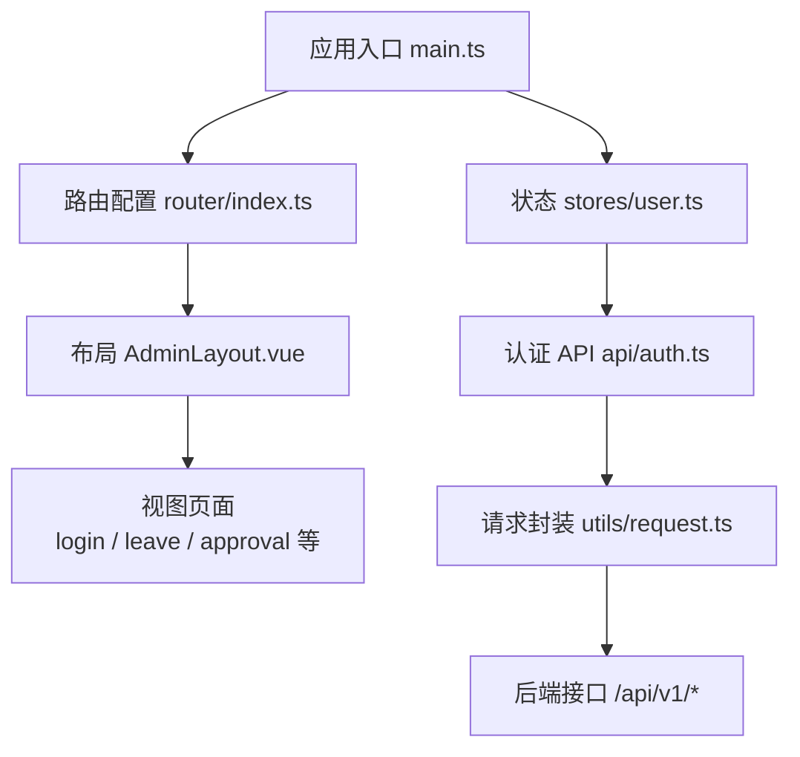
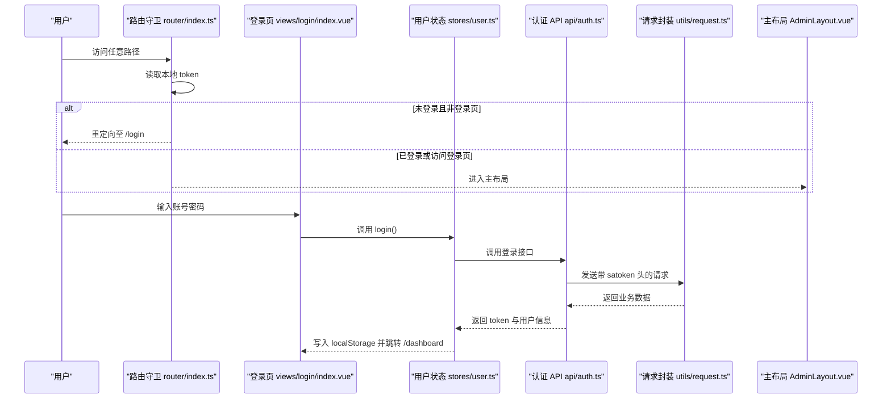
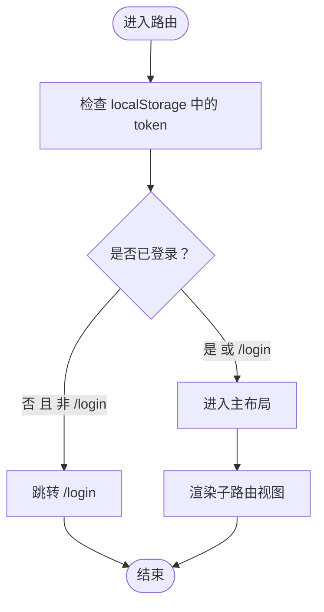
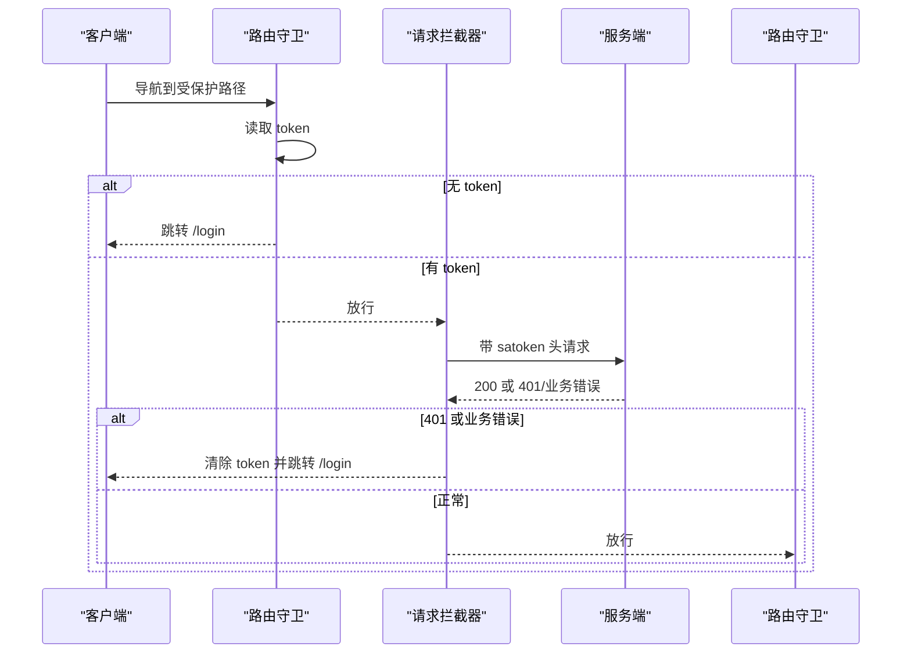
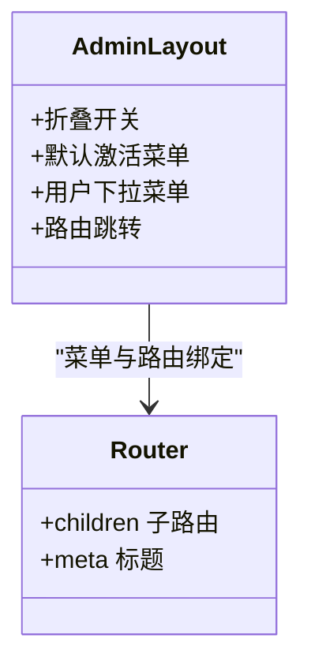
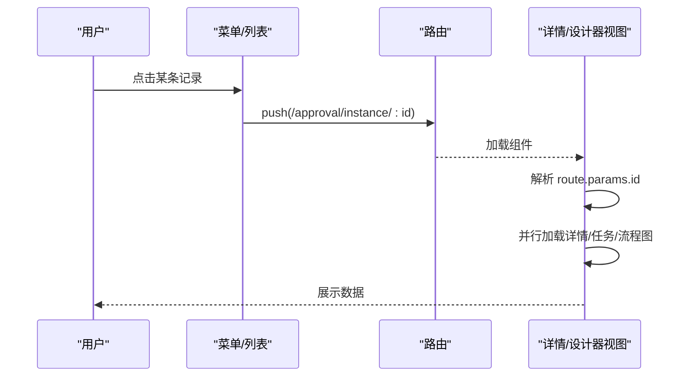
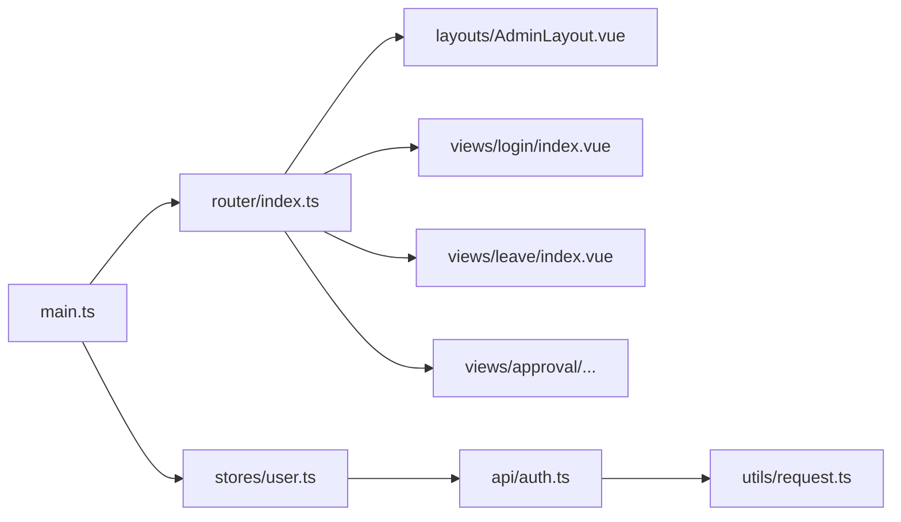

# 路由配置

<cite>
**本文引用的文件**
- [路由配置 index.ts](file://oa-ui/src/router/index.ts)
- [布局组件 AdminLayout.vue](file://oa-ui/src/layouts/AdminLayout.vue)
- [应用入口 main.ts](file://oa-ui/src/main.ts)
- [用户状态 stores/user.ts](file://oa-ui/src/stores/user.ts)
- [登录页 views/login/index.vue](file://oa-ui/src/views/login/index.vue)
- [审批详情 views/approval/instance/detail.vue](file://oa-ui/src/views/approval/instance/detail.vue)
- [审批模板设计器 views/approval/template/designer/index.vue](file://oa-ui/src/views/approval/template/designer/index.vue)
- [请假管理 views/leave/index.vue](file://oa-ui/src/views/leave/index.vue)
- [认证 API api/auth.ts](file://oa-ui/src/api/auth.ts)
- [请求封装 utils/request.ts](file://oa-ui/src/utils/request.ts)
- [系统权限 API api/system.ts](file://oa-ui/src/api/system.ts)
- [应用根组件 App.vue](file://oa-ui/src/App.vue)
- [Vite 配置 vite.config.ts](file://oa-ui/vite.config.ts)
- [包配置 package.json](file://oa-ui/package.json)
</cite>

## 目录
1. [简介](#简介)
2. [项目结构](#项目结构)
3. [核心组件](#核心组件)
4. [架构总览](#架构总览)
5. [详细组件分析](#详细组件分析)
6. [依赖关系分析](#依赖关系分析)
7. [性能考虑](#性能考虑)
8. [故障排查指南](#故障排查指南)
9. [结论](#结论)
10. [附录](#附录)

## 简介
本文件面向前端路由配置与权限体系，围绕 Vue Router 的配置结构、路由守卫、权限控制、布局与嵌套路由、懒加载与代码分割、路由参数与查询处理、导航行为、以及面包屑与菜单联动等主题进行系统化说明，并结合项目现有实现给出可操作的优化建议与最佳实践。

## 项目结构
本项目采用典型的前端单页应用（SPA）结构：
- 应用入口负责挂载应用、注册插件与路由。
- 路由层定义页面级路径、嵌套路由与全局前置守卫。
- 布局层提供侧边栏菜单、顶部导航与主内容区。
- 视图层承载具体业务页面，使用路由参数与查询进行数据传递。
- 状态层通过 Pinia 管理用户会话与全局状态。
- 请求层统一注入鉴权头并在异常时触发登出与跳转。

图表来源
- [应用入口 main.ts:1-14](file://oa-ui/src/main.ts#L1-L14)
- [路由配置 index.ts:1-134](file://oa-ui/src/router/index.ts#L1-L134)
- [用户状态 stores/user.ts:1-32](file://oa-ui/src/stores/user.ts#L1-L32)
- [认证 API api/auth.ts:1-14](file://oa-ui/src/api/auth.ts#L1-L14)
- [请求封装 utils/request.ts:1-42](file://oa-ui/src/utils/request.ts#L1-L42)

章节来源
- [应用入口 main.ts:1-14](file://oa-ui/src/main.ts#L1-L14)
- [路由配置 index.ts:1-134](file://oa-ui/src/router/index.ts#L1-L134)
- [布局组件 AdminLayout.vue:1-130](file://oa-ui/src/layouts/AdminLayout.vue#L1-L130)
- [应用根组件 App.vue:1-4](file://oa-ui/src/App.vue#L1-L4)

## 核心组件
- 路由配置：定义基础路径、嵌套路由、懒加载组件与全局前置守卫。
- 布局组件：提供侧边栏菜单、顶部导航、折叠切换与用户下拉菜单。
- 用户状态：集中管理 token、用户信息、登录/登出与自动跳转。
- 登录页：表单校验、调用登录接口、成功后跳转到仪表盘。
- 视图组件：使用路由参数（如审批实例 id、模板设计器 id）进行数据加载与导航。
- 请求封装：统一注入鉴权头并在 401 或特定业务码时触发登出与跳转。

章节来源
- [路由配置 index.ts:1-134](file://oa-ui/src/router/index.ts#L1-L134)
- [布局组件 AdminLayout.vue:1-130](file://oa-ui/src/layouts/AdminLayout.vue#L1-L130)
- [用户状态 stores/user.ts:1-32](file://oa-ui/src/stores/user.ts#L1-L32)
- [登录页 views/login/index.vue:1-73](file://oa-ui/src/views/login/index.vue#L1-L73)
- [请求封装 utils/request.ts:1-42](file://oa-ui/src/utils/request.ts#L1-L42)

## 架构总览
下图展示从浏览器访问到页面渲染、鉴权与导航的关键交互：

图表来源
- [路由配置 index.ts:124-131](file://oa-ui/src/router/index.ts#L124-L131)
- [登录页 views/login/index.vue:37-49](file://oa-ui/src/views/login/index.vue#L37-L49)
- [用户状态 stores/user.ts:10-15](file://oa-ui/src/stores/user.ts#L10-L15)
- [认证 API api/auth.ts:3-5](file://oa-ui/src/api/auth.ts#L3-L5)
- [请求封装 utils/request.ts:10-16](file://oa-ui/src/utils/request.ts#L10-L16)

## 详细组件分析

### 路由配置与嵌套路由
- 基础路径与懒加载：登录页与各业务模块均采用动态导入实现懒加载，减少首屏体积。
- 主布局与子路由：根路径指向主布局组件，内部通过 children 定义多级菜单对应的子路由。
- 全局前置守卫：在进入任何路由前检查 token，若未登录且目标非登录页则强制跳转登录页。
- 路由元信息：每个路由定义了标题（用于面包屑与页面标题），便于统一管理。

图表来源
- [路由配置 index.ts:124-131](file://oa-ui/src/router/index.ts#L124-L131)
- [路由配置 index.ts:5-122](file://oa-ui/src/router/index.ts#L5-L122)

章节来源
- [路由配置 index.ts:1-134](file://oa-ui/src/router/index.ts#L1-L134)

### 权限控制与路由守卫
- 会话与令牌：登录成功后写入 token，后续请求通过拦截器统一注入自定义鉴权头。
- 后端鉴权：响应拦截器对 401 或特定业务码进行登出与跳转处理，确保前后端一致。
- 前置守卫：避免直接访问受保护路径；结合后端拦截，形成双重保障。
- 动态路由生成：当前路由配置为静态定义；若需按用户权限动态生成菜单与路由，可在登录后根据用户权限列表过滤并动态添加路由项。

图表来源
- [路由配置 index.ts:124-131](file://oa-ui/src/router/index.ts#L124-L131)
- [请求封装 utils/request.ts:18-39](file://oa-ui/src/utils/request.ts#L18-L39)

章节来源
- [请求封装 utils/request.ts:1-42](file://oa-ui/src/utils/request.ts#L1-L42)
- [认证 API api/auth.ts:1-14](file://oa-ui/src/api/auth.ts#L1-L14)
- [用户状态 stores/user.ts:22-28](file://oa-ui/src/stores/user.ts#L22-L28)

### 布局组件与菜单联动
- 侧边栏菜单：基于 Element Plus 菜单组件，支持折叠与子菜单分组，点击即路由跳转。
- 顶部导航：包含折叠按钮与用户下拉菜单，下拉触发登出逻辑。
- 默认激活：菜单默认激活与当前路由保持一致，提升导航一致性。
- 与路由的关系：菜单项的 index 与路由 path 对应，实现“菜单即路由”的直观体验。

图表来源
- [布局组件 AdminLayout.vue:8-46](file://oa-ui/src/layouts/AdminLayout.vue#L8-L46)
- [路由配置 index.ts:16-119](file://oa-ui/src/router/index.ts#L16-L119)

章节来源
- [布局组件 AdminLayout.vue:1-130](file://oa-ui/src/layouts/AdminLayout.vue#L1-L130)
- [路由配置 index.ts:1-134](file://oa-ui/src/router/index.ts#L1-L134)

### 路由参数传递与导航
- 路由参数：审批实例详情与模板设计器均使用路由参数（如 :id）获取业务 id，组件内解析并发起数据请求。
- 导航跳转：在组件内使用路由实例进行 push/back 等导航，保证用户体验连贯。
- 查询字符串：当前示例主要使用路由参数；如需传递复杂筛选条件，可扩展为查询参数并在组件内读取。

图表来源
- [审批详情 views/approval/instance/detail.vue:80-97](file://oa-ui/src/views/approval/instance/detail.vue#L80-L97)
- [审批模板设计器 views/approval/template/designer/index.vue:66-69](file://oa-ui/src/views/approval/template/designer/index.vue#L66-L69)

章节来源
- [审批详情 views/approval/instance/detail.vue:1-124](file://oa-ui/src/views/approval/instance/detail.vue#L1-L124)
- [审批模板设计器 views/approval/template/designer/index.vue:1-324](file://oa-ui/src/views/approval/template/designer/index.vue#L1-L324)

### 面包屑导航与路由元信息
- 路由元信息：每个路由定义了标题字段，可用于生成面包屑与页面标题。
- 面包屑实现：可基于当前路由层级与父级路由标题拼接生成；当前项目未见专门的面包屑组件，建议在布局或页面中按需引入。

章节来源
- [路由配置 index.ts:10, 21, 27, 33, 39, 45, 51, 63, 69, 75, 81, 87, 93, 99, 105, 111, 117:10-117](file://oa-ui/src/router/index.ts#L10-L117)

### 路由懒加载与代码分割
- 懒加载：所有视图组件均通过动态导入实现按需加载，降低首屏资源压力。
- 代码分割：配合 Vite 插件自动导入与组件解析，进一步优化打包与运行时性能。
- 构建代理：开发环境通过代理将 /api 前缀转发至后端服务，便于联调。

章节来源
- [路由配置 index.ts:9, 20, 26, 32, 38, 44, 50, 56, 62, 68, 74, 80, 86, 92, 98, 104, 110, 116:9-116](file://oa-ui/src/router/index.ts#L9-L116)
- [Vite 配置 vite.config.ts:13-24](file://oa-ui/vite.config.ts#L13-L24)
- [Vite 配置 vite.config.ts:30-38](file://oa-ui/vite.config.ts#L30-L38)

### 路由导航与用户体验
- 登录成功后自动跳转到仪表盘，避免重复输入。
- 退出登录时清除 token 并跳转登录页，确保安全。
- 在复杂流程（如模板设计器）中，离开前进行脏检查与二次确认，防止误操作丢失数据。

章节来源
- [登录页 views/login/index.vue:42-43](file://oa-ui/src/views/login/index.vue#L42-L43)
- [用户状态 stores/user.ts:22-28](file://oa-ui/src/stores/user.ts#L22-L28)
- [审批模板设计器 views/approval/template/designer/index.vue:235-247](file://oa-ui/src/views/approval/template/designer/index.vue#L235-L247)

## 依赖关系分析
- 组件耦合：路由配置与布局组件强关联；视图组件依赖路由参数与状态管理。
- 外部依赖：Vue Router、Element Plus、Axios、Pinia。
- 构建工具：Vite 插件负责自动导入与组件解析，提升开发效率。

图表来源
- [路由配置 index.ts:1-134](file://oa-ui/src/router/index.ts#L1-L134)
- [布局组件 AdminLayout.vue:1-130](file://oa-ui/src/layouts/AdminLayout.vue#L1-L130)
- [应用入口 main.ts:1-14](file://oa-ui/src/main.ts#L1-L14)
- [用户状态 stores/user.ts:1-32](file://oa-ui/src/stores/user.ts#L1-L32)
- [认证 API api/auth.ts:1-14](file://oa-ui/src/api/auth.ts#L1-L14)
- [请求封装 utils/request.ts:1-42](file://oa-ui/src/utils/request.ts#L1-L42)

章节来源
- [包配置 package.json:15-22](file://oa-ui/package.json#L15-L22)
- [Vite 配置 vite.config.ts:13-24](file://oa-ui/vite.config.ts#L13-L24)

## 性能考虑
- 懒加载与代码分割：已通过动态导入实现，建议结合路由分块命名与缓存策略进一步优化。
- 请求拦截：统一注入鉴权头与错误处理，减少重复逻辑，提高稳定性。
- 组件复用：将通用的加载状态、错误提示与表格分页抽离为可复用组件，降低重复渲染。
- SEO 友好：当前为 SPA，默认不包含服务端渲染。若需 SEO，可引入 Nuxt 或在服务端增加 SSR 支持；同时为关键页面提供预渲染或静态导出策略。

## 故障排查指南
- 登录后仍被重定向到登录页
  - 检查本地存储 token 是否正确写入与读取。
  - 确认请求拦截器是否正确注入 satoken 头。
  - 查看响应拦截器对 401/业务错误的处理逻辑。
- 401 未触发登出
  - 确认后端返回的状态码与业务码是否符合拦截器预期。
  - 检查拦截器顺序与异常分支是否覆盖全面。
- 路由跳转无效或参数丢失
  - 确认路由定义与菜单 index 的一致性。
  - 检查组件内对 route.params 的解析与类型转换。
- 侧边栏菜单不随路由变化高亮
  - 确保菜单的默认激活值与当前路由 path 一致。
  - 检查菜单 router 属性与 Element Plus 版本兼容性。

章节来源
- [请求封装 utils/request.ts:18-39](file://oa-ui/src/utils/request.ts#L18-L39)
- [用户状态 stores/user.ts:7-8](file://oa-ui/src/stores/user.ts#L7-L8)
- [布局组件 AdminLayout.vue:8-11](file://oa-ui/src/layouts/AdminLayout.vue#L8-L11)

## 结论
本项目在路由配置上实现了清晰的嵌套路由结构与懒加载策略，配合全局前置守卫与请求拦截器形成了较为完善的鉴权闭环。布局组件与菜单联动直观易用，路由元信息为面包屑与标题管理提供了基础。建议在现有基础上补充动态路由生成能力、完善面包屑组件与 SEO 策略，并持续优化请求与渲染性能，以满足更复杂的业务场景与用户体验需求。

## 附录
- 动态路由生成建议
  - 登录成功后根据用户权限列表过滤可用菜单，再通过编程式路由添加动态路由项。
  - 使用路由元信息标识权限标识符，便于在导航与页面中做细粒度控制。
- 面包屑与菜单联动
  - 基于当前路由层级与父级路由标题拼接生成面包屑。
  - 将菜单与路由 path 映射，实现点击即跳转与高亮同步。
- 路由参数与查询处理
  - 对于复杂筛选条件，可扩展为查询参数并在组件内统一读取与序列化。
- 性能与 SEO
  - 引入 SSR/Nuxt 或预渲染，提升 SEO 与首屏速度。
  - 对热点页面进行缓存与预加载，减少重复请求。