# BPMN工具函数

<cite>
**本文档引用的文件**
- [bpmn-utils.ts](file://oa-ui/src/bpmn/bpmn-utils.ts)
- [constants.ts](file://oa-ui/src/bpmn/constants.ts)
- [bpmn-utils.test.ts](file://oa-ui/src/bpmn/bpmn-utils.test.ts)
- [constants.test.ts](file://oa-ui/src/bpmn/constants.test.ts)
- [template.ts](file://oa-ui/src/api/template.ts)
- [useBpmnModeler.ts](file://oa-ui/src/composables/bpmn/useBpmnModeler.ts)
- [useBpmnCommandStack.ts](file://oa-ui/src/composables/bpmn/useBpmnCommandStack.ts)
- [useBpmnSelection.ts](file://oa-ui/src/composables/bpmn/useBpmnSelection.ts)
- [BpmnCanvas.vue](file://oa-ui/src/views/approval/template/designer/components/BpmnCanvas.vue)
- [DesignerToolbar.vue](file://oa-ui/src/views/approval/template/designer/components/DesignerToolbar.vue)
- [PropertiesPanel.vue](file://oa-ui/src/views/approval/template/designer/components/PropertiesPanel.vue)
- [FlowableConstants.java](file://oa-approval/src/main/java/com/oa/admin/approval/constant/FlowableConstants.java)
- [ApprovalConstants.java](file://oa-approval/src/main/java/com/oa/admin/approval/constant/ApprovalConstants.java)
</cite>

## 目录
1. [简介](#简介)
2. [项目结构](#项目结构)
3. [核心组件](#核心组件)
4. [架构概览](#架构概览)
5. [详细组件分析](#详细组件分析)
6. [依赖分析](#依赖分析)
7. [性能考虑](#性能考虑)
8. [故障排除指南](#故障排除指南)
9. [结论](#结论)
10. [附录](#附录)

## 简介

本文档为OA审批管理系统中的BPMN工具函数提供全面的技术文档。该工具集主要负责BPMN流程的转换、验证和配置管理，支持从XML到JSON的数据转换、节点属性提取、流程验证等功能。

系统采用前后端分离架构，前端使用Vue 3 + TypeScript构建BPMN设计器，后端基于Spring Boot + Flowable引擎提供审批流程管理服务。BPMN工具函数作为前端设计器的核心组件，提供了完整的流程设计、验证和配置功能。

## 项目结构

BPMN工具函数相关的核心文件分布如下：

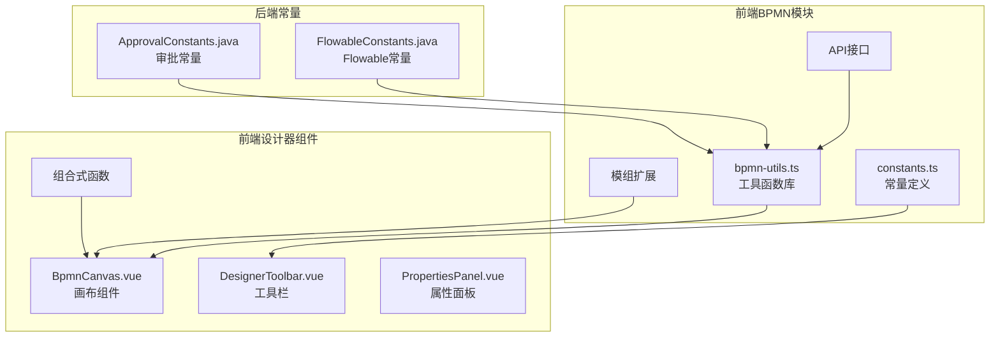

**图表来源**
- [bpmn-utils.ts:1-231](file://oa-ui/src/bpmn/bpmn-utils.ts#L1-L231)
- [constants.ts:1-95](file://oa-ui/src/bpmn/constants.ts#L1-L95)
- [BpmnCanvas.vue:1-107](file://oa-ui/src/views/approval/template/designer/components/BpmnCanvas.vue#L1-L107)

**章节来源**
- [bpmn-utils.ts:1-231](file://oa-ui/src/bpmn/bpmn-utils.ts#L1-L231)
- [constants.ts:1-95](file://oa-ui/src/bpmn/constants.ts#L1-L95)

## 核心组件

### 工具函数库 (bpmn-utils.ts)

BPMN工具函数库提供了以下核心功能：

1. **XML生成器**: 生成标准BPMN 2.0 XML模板
2. **节点配置提取**: 从BPMN模型中提取节点配置信息
3. **流程验证器**: 验证BPMN流程的完整性
4. **监听器注入器**: 自动注入审批任务监听器

### 常量定义系统 (constants.ts)

系统采用统一的常量定义规范，包括：

1. **节点类型常量**: 定义支持的BPMN节点类型及其映射关系
2. **分配人类型常量**: 定义审批人分配策略
3. **多实例类型常量**: 定义并行/串行审批配置
4. **状态常量**: 定义流程模板状态管理

**章节来源**
- [bpmn-utils.ts:23-231](file://oa-ui/src/bpmn/bpmn-utils.ts#L23-L231)
- [constants.ts:21-95](file://oa-ui/src/bpmn/constants.ts#L21-L95)

## 架构概览

BPMN工具函数在整个系统中的架构位置如下：

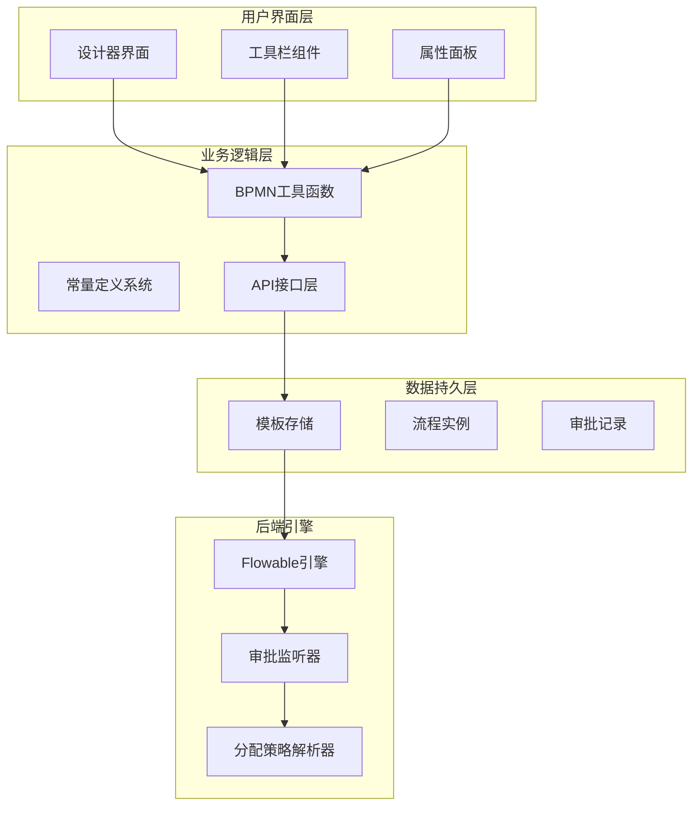

**图表来源**
- [useBpmnModeler.ts:1-98](file://oa-ui/src/composables/bpmn/useBpmnModeler.ts#L1-L98)
- [DesignerToolbar.vue:1-132](file://oa-ui/src/views/approval/template/designer/components/DesignerToolbar.vue#L1-L132)
- [PropertiesPanel.vue:1-80](file://oa-ui/src/views/approval/template/designer/components/PropertiesPanel.vue#L1-L80)

## 详细组件分析

### XML生成器组件

XML生成器负责创建标准的BPMN 2.0流程模板：

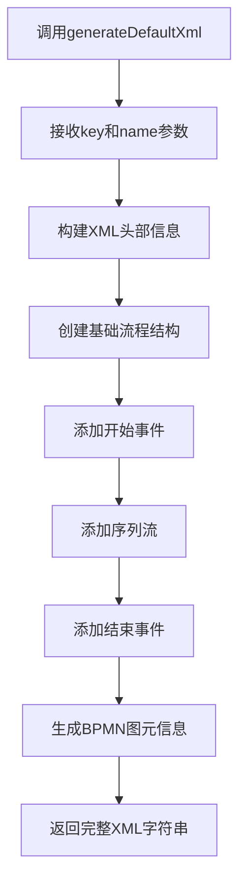

**图表来源**
- [bpmn-utils.ts:23-54](file://oa-ui/src/bpmn/bpmn-utils.ts#L23-L54)

XML生成器特性：
- 支持自定义流程标识符和名称
- 自动生成标准BPMN 2.0命名空间
- 包含完整的BPMN DI图形信息
- 设置流程可执行标志

**章节来源**
- [bpmn-utils.ts:23-54](file://oa-ui/src/bpmn/bpmn-utils.ts#L23-L54)

### 节点配置提取器

节点配置提取器从BPMN模型中提取节点信息：

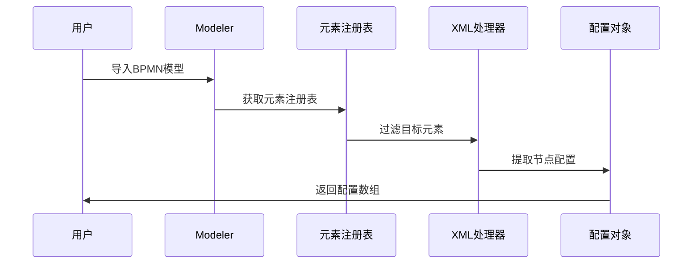

**图表来源**
- [bpmn-utils.ts:56-94](file://oa-ui/src/bpmn/bpmn-utils.ts#L56-L94)

提取功能包括：
- 支持的节点类型：用户任务、网关、开始/结束事件
- BPMN类型到内部类型的映射
- 用户任务的扩展属性提取
- 排序字段的自动分配

**章节来源**
- [bpmn-utils.ts:56-94](file://oa-ui/src/bpmn/bpmn-utils.ts#L56-L94)

### 流程验证器

流程验证器确保BPMN流程的完整性：

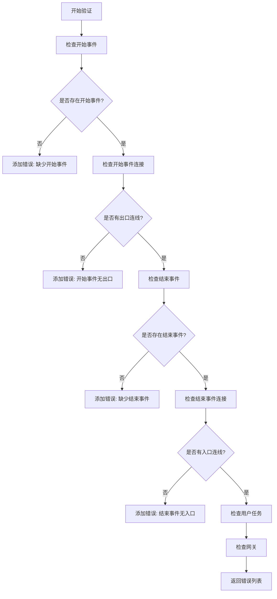

**图表来源**
- [bpmn-utils.ts:132-215](file://oa-ui/src/bpmn/bpmn-utils.ts#L132-L215)

验证规则：
- 必须存在且仅有一个开始事件
- 必须存在至少一个结束事件
- 所有节点必须有完整的连接关系
- 网关必须有至少两个出口

**章节来源**
- [bpmn-utils.ts:132-215](file://oa-ui/src/bpmn/bpmn-utils.ts#L132-L215)

### 监听器注入器

监听器注入器自动为用户任务注入审批监听器：

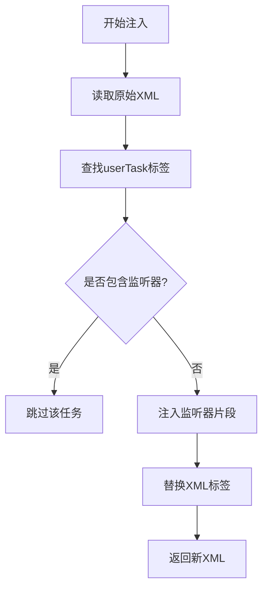

**图表来源**
- [bpmn-utils.ts:217-230](file://oa-ui/src/bpmn/bpmn-utils.ts#L217-L230)

注入特性：
- 自动检测现有监听器避免重复注入
- 支持自闭合和开放的userTask标签
- 使用正则表达式精确匹配
- 保持XML结构完整性

**章节来源**
- [bpmn-utils.ts:217-230](file://oa-ui/src/bpmn/bpmn-utils.ts#L217-L230)

### 常量定义系统

常量定义系统采用统一的组织方式：

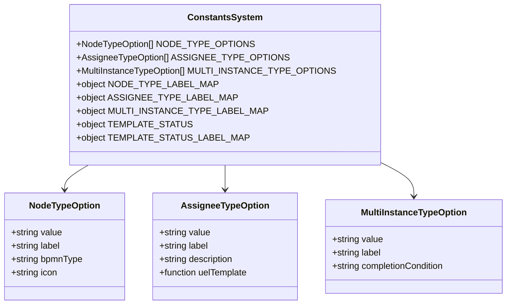

**图表来源**
- [constants.ts:1-95](file://oa-ui/src/bpmn/constants.ts#L1-L95)

**章节来源**
- [constants.ts:1-95](file://oa-ui/src/bpmn/constants.ts#L1-L95)

## 依赖分析

BPMN工具函数的依赖关系如下：

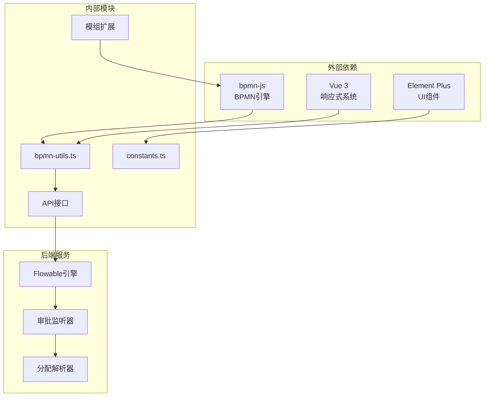

**图表来源**
- [BpmnCanvas.vue:14-20](file://oa-ui/src/views/approval/template/designer/components/BpmnCanvas.vue#L14-L20)
- [useBpmnModeler.ts:1-98](file://oa-ui/src/composables/bpmn/useBpmnModeler.ts#L1-L98)

**章节来源**
- [BpmnCanvas.vue:14-20](file://oa-ui/src/views/approval/template/designer/components/BpmnCanvas.vue#L14-L20)
- [useBpmnModeler.ts:1-98](file://oa-ui/src/composables/bpmn/useBpmnModeler.ts#L1-L98)

## 性能考虑

### 内存优化策略

1. **懒加载模式**: BPMN模型按需加载，避免不必要的内存占用
2. **对象池管理**: 复用DOM元素和模型对象
3. **事件监听器清理**: 组件卸载时及时移除事件监听器

### 计算复杂度优化

1. **O(n)遍历算法**: 节点提取和验证采用线性时间复杂度
2. **缓存机制**: 常用配置和映射关系进行缓存
3. **批量操作**: 支持批量导入和导出XML文件

### 错误处理机制

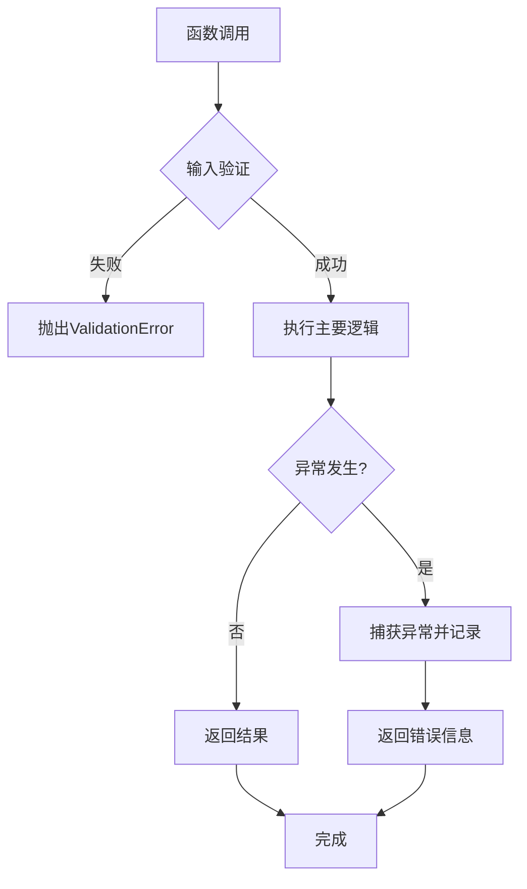

**图表来源**
- [bpmn-utils.ts:132-215](file://oa-ui/src/bpmn/bpmn-utils.ts#L132-L215)

## 故障排除指南

### 常见问题及解决方案

1. **XML导入失败**
   - 检查BPMN文件格式是否正确
   - 确认命名空间声明完整
   - 验证流程标识符唯一性

2. **节点配置提取错误**
   - 确认BPMN类型映射正确
   - 检查扩展属性格式
   - 验证节点ID唯一性

3. **流程验证失败**
   - 检查开始/结束事件数量
   - 确认所有节点都有连接
   - 验证网关出口数量

**章节来源**
- [bpmn-utils.test.ts:144-242](file://oa-ui/src/bpmn/bpmn-utils.test.ts#L144-L242)

### 单元测试覆盖

系统提供了完整的单元测试覆盖：

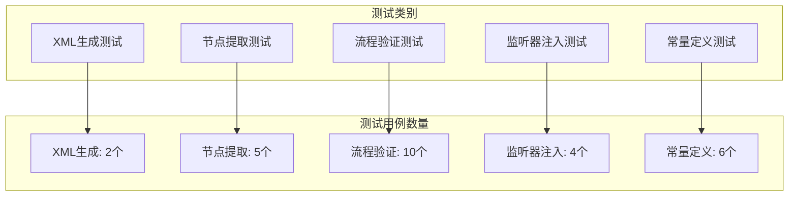

**图表来源**
- [bpmn-utils.test.ts:1-279](file://oa-ui/src/bpmn/bpmn-utils.test.ts#L1-L279)
- [constants.test.ts:1-80](file://oa-ui/src/bpmn/constants.test.ts#L1-L80)

**章节来源**
- [bpmn-utils.test.ts:1-279](file://oa-ui/src/bpmn/bpmn-utils.test.ts#L1-L279)
- [constants.test.ts:1-80](file://oa-ui/src/bpmn/constants.test.ts#L1-L80)

## 结论

BPMN工具函数系统为OA审批管理系统提供了完整的流程设计和管理能力。通过标准化的工具函数库、清晰的常量定义系统和完善的测试策略，系统实现了：

1. **高内聚低耦合**: 功能模块职责明确，便于维护和扩展
2. **强类型安全**: TypeScript提供编译时类型检查
3. **完整测试覆盖**: 单元测试确保代码质量
4. **良好的用户体验**: 直观的设计器界面和流畅的操作体验

该系统为后续的功能扩展和性能优化奠定了坚实的基础。

## 附录

### API接口定义

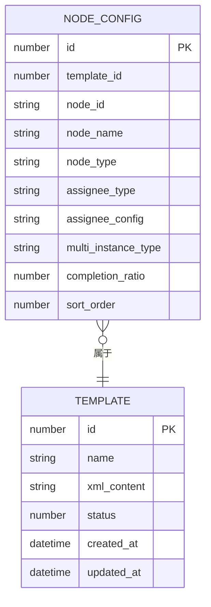

**图表来源**
- [template.ts:3-14](file://oa-ui/src/api/template.ts#L3-L14)

### 集成使用示例

1. **基本使用流程**:
   - 初始化BPMN模型器
   - 导入XML文件
   - 提取节点配置
   - 执行流程验证
   - 保存修改后的XML

2. **高级功能集成**:
   - 监听器自动注入
   - 扩展属性配置
   - 实时预览和验证

**章节来源**
- [template.ts:16-51](file://oa-ui/src/api/template.ts#L16-L51)