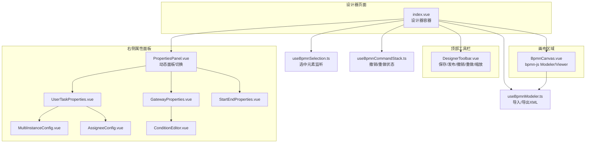
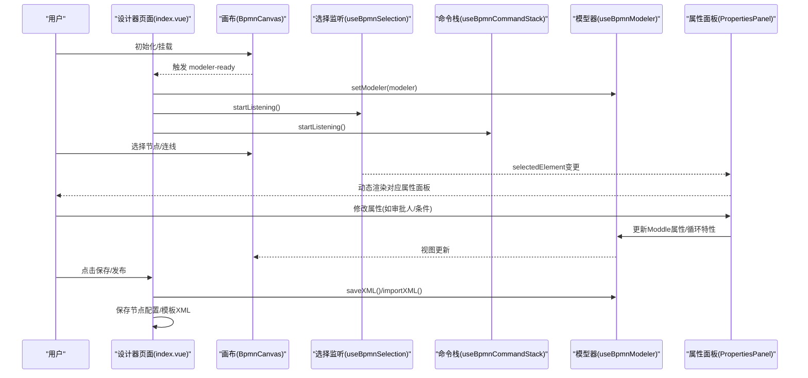
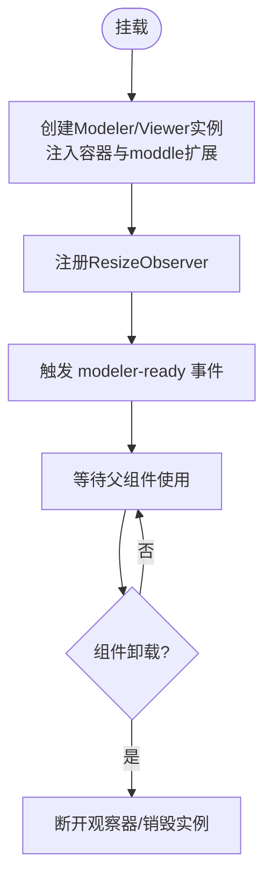
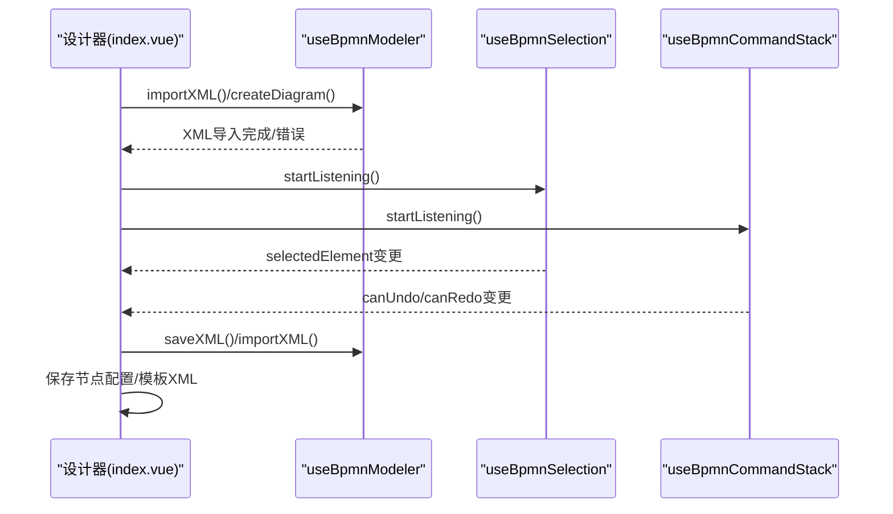
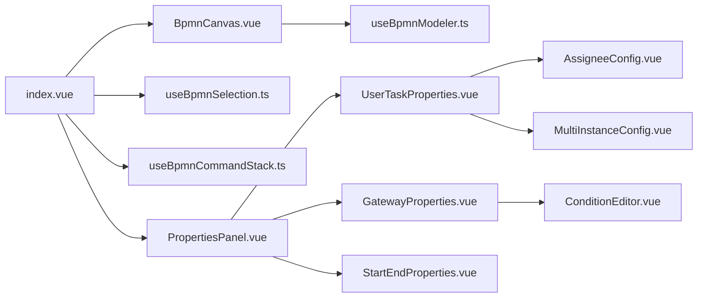

# BPMN流程设计器组件

<cite>
**本文档引用的文件**
- [BpmnCanvas.vue](file://oa-ui/src/views/approval/template/designer/components/BpmnCanvas.vue)
- [DesignerToolbar.vue](file://oa-ui/src/views/approval/template/designer/components/DesignerToolbar.vue)
- [PropertiesPanel.vue](file://oa-ui/src/views/approval/template/designer/components/PropertiesPanel.vue)
- [UserTaskProperties.vue](file://oa-ui/src/views/approval/template/designer/components/panels/UserTaskProperties.vue)
- [AssigneeConfig.vue](file://oa-ui/src/views/approval/template/designer/components/panels/AssigneeConfig.vue)
- [ConditionEditor.vue](file://oa-ui/src/views/approval/template/designer/components/panels/ConditionEditor.vue)
- [GatewayProperties.vue](file://oa-ui/src/views/approval/template/designer/components/panels/GatewayProperties.vue)
- [MultiInstanceConfig.vue](file://oa-ui/src/views/approval/template/designer/components/panels/MultiInstanceConfig.vue)
- [StartEndProperties.vue](file://oa-ui/src/views/approval/template/designer/components/panels/StartEndProperties.vue)
- [index.vue](file://oa-ui/src/views/approval/template/designer/index.vue)
- [useBpmnModeler.ts](file://oa-ui/src/composables/bpmn/useBpmnModeler.ts)
- [useBpmnSelection.ts](file://oa-ui/src/composables/bpmn/useBpmnSelection.ts)
- [useBpmnCommandStack.ts](file://oa-ui/src/composables/bpmn/useBpmnCommandStack.ts)
- [constants.ts](file://oa-ui/src/bpmn/constants.ts)
</cite>

## 目录
1. [简介](#简介)
2. [项目结构](#项目结构)
3. [核心组件](#核心组件)
4. [架构总览](#架构总览)
5. [详细组件分析](#详细组件分析)
6. [依赖关系分析](#依赖关系分析)
7. [性能考虑](#性能考虑)
8. [故障排查指南](#故障排查指南)
9. [结论](#结论)
10. [附录](#附录)

## 简介
本文件面向OA审批管理系统的BPMN流程设计器组件，系统性梳理画布组件（BpmnCanvas）、工具栏组件（DesignerToolbar）、属性面板组件（PropertiesPanel）及其子面板（用户任务属性、审批人配置、条件编辑器、网关属性、多实例配置、起止事件属性）的实现原理与交互机制。重点覆盖：
- 画布渲染与缩放控制
- 节点选择与命令栈联动
- 属性面板的动态切换与数据绑定
- 审批人与多实例等关键业务配置的表达式生成与持久化
- 组件间通信、事件处理、状态同步与错误处理策略

## 项目结构
设计器位于前端模块的审批模板设计页面，采用“页面容器 + 画布 + 工具栏 + 属性面板”的布局。页面通过组合式函数管理模型、选择与命令栈，属性面板根据选中元素动态切换对应配置组件。

图表来源
- [index.vue:1-324](file://oa-ui/src/views/approval/template/designer/index.vue#L1-L324)
- [BpmnCanvas.vue:1-107](file://oa-ui/src/views/approval/template/designer/components/BpmnCanvas.vue#L1-L107)
- [DesignerToolbar.vue:1-132](file://oa-ui/src/views/approval/template/designer/components/DesignerToolbar.vue#L1-L132)
- [PropertiesPanel.vue:1-80](file://oa-ui/src/views/approval/template/designer/components/PropertiesPanel.vue#L1-L80)
- [UserTaskProperties.vue:1-50](file://oa-ui/src/views/approval/template/designer/components/panels/UserTaskProperties.vue#L1-L50)
- [AssigneeConfig.vue:1-172](file://oa-ui/src/views/approval/template/designer/components/panels/AssigneeConfig.vue#L1-L172)
- [ConditionEditor.vue:1-143](file://oa-ui/src/views/approval/template/designer/components/panels/ConditionEditor.vue#L1-L143)
- [GatewayProperties.vue:1-98](file://oa-ui/src/views/approval/template/designer/components/panels/GatewayProperties.vue#L1-L98)
- [MultiInstanceConfig.vue:1-175](file://oa-ui/src/views/approval/template/designer/components/panels/MultiInstanceConfig.vue#L1-L175)
- [StartEndProperties.vue:1-31](file://oa-ui/src/views/approval/template/designer/components/panels/StartEndProperties.vue#L1-L31)
- [useBpmnModeler.ts:1-98](file://oa-ui/src/composables/bpmn/useBpmnModeler.ts#L1-L98)
- [useBpmnSelection.ts:1-39](file://oa-ui/src/composables/bpmn/useBpmnSelection.ts#L1-L39)
- [useBpmnCommandStack.ts:1-59](file://oa-ui/src/composables/bpmn/useBpmnCommandStack.ts#L1-L59)

章节来源
- [index.vue:1-324](file://oa-ui/src/views/approval/template/designer/index.vue#L1-L324)

## 核心组件
- 画布组件（BpmnCanvas）
  - 基于bpmn-js的Modeler/Viewer实例化，支持只读模式切换；监听容器尺寸变化触发画布重绘；向父组件暴露modeler实例与容器引用。
- 工具栏组件（DesignerToolbar）
  - 提供返回列表、撤销/重做、缩放、XML预览、保存/发布、新建版本等操作；根据模板状态显示草稿/已发布标签。
- 属性面板组件（PropertiesPanel）
  - 根据选中元素类型动态渲染对应属性面板，若无选中元素则显示空状态；支持只读模式传递。

章节来源
- [BpmnCanvas.vue:1-107](file://oa-ui/src/views/approval/template/designer/components/BpmnCanvas.vue#L1-L107)
- [DesignerToolbar.vue:1-132](file://oa-ui/src/views/approval/template/designer/components/DesignerToolbar.vue#L1-L132)
- [PropertiesPanel.vue:1-80](file://oa-ui/src/views/approval/template/designer/components/PropertiesPanel.vue#L1-L80)

## 架构总览
设计器采用“页面容器 + 组合式函数 + 业务面板”的分层架构。页面容器负责生命周期、事件监听与自动保存；组合式函数封装bpmn-js能力；属性面板按元素类型动态渲染具体配置组件。

图表来源
- [index.vue:93-107](file://oa-ui/src/views/approval/template/designer/index.vue#L93-L107)
- [useBpmnSelection.ts:7-21](file://oa-ui/src/composables/bpmn/useBpmnSelection.ts#L7-L21)
- [useBpmnCommandStack.ts:34-48](file://oa-ui/src/composables/bpmn/useBpmnCommandStack.ts#L34-L48)
- [useBpmnModeler.ts:16-50](file://oa-ui/src/composables/bpmn/useBpmnModeler.ts#L16-L50)
- [PropertiesPanel.vue:45-49](file://oa-ui/src/views/approval/template/designer/components/PropertiesPanel.vue#L45-L49)

## 详细组件分析

### 画布组件（BpmnCanvas）
- 实例化与模式
  - 根据只读标志选择Viewer或Modeler；注入Flowable扩展（moddleExtensions），确保Flowable特定属性可读写。
- 渲染与缩放
  - 监听容器ResizeObserver，调用canvas.resized触发重绘；提供getModeler/容器引用暴露给父组件。
- 生命周期
  - 挂载时初始化；卸载时断开观察器并销毁实例，避免内存泄漏。

图表来源
- [BpmnCanvas.vue:39-77](file://oa-ui/src/views/approval/template/designer/components/BpmnCanvas.vue#L39-L77)

章节来源
- [BpmnCanvas.vue:1-107](file://oa-ui/src/views/approval/template/designer/components/BpmnCanvas.vue#L1-L107)

### 工具栏组件（DesignerToolbar）
- 布局与功能
  - 左侧：返回、模板标题、状态标签；中间：撤销/重做、缩放；右侧：XML预览、保存/发布/新建版本。
- 状态控制
  - 撤销/重做按钮禁用条件：不可执行且模板已发布；保存按钮支持加载状态。
- 事件发射
  - 统一通过自定义事件向上抛出，由父组件处理。

章节来源
- [DesignerToolbar.vue:1-132](file://oa-ui/src/views/approval/template/designer/components/DesignerToolbar.vue#L1-L132)

### 属性面板组件（PropertiesPanel）
- 动态面板映射
  - 根据businessObject类型映射到对应面板：起止事件、用户任务、网关等；默认空状态。
- 数据绑定
  - 接收selectedElement/modeler/templateId/readOnly，向下传递给具体面板组件。
- 只读控制
  - 通过readOnly统一控制子面板的可编辑性。

章节来源
- [PropertiesPanel.vue:1-80](file://oa-ui/src/views/approval/template/designer/components/PropertiesPanel.vue#L1-L80)

### 用户任务属性（UserTaskProperties）
- 字段
  - 节点ID（只读）、节点名称（可编辑）、审批人配置、多实例配置三部分。
- 名称更新
  - 通过modeling.updateProperties更新节点名称。

章节来源
- [UserTaskProperties.vue:1-50](file://oa-ui/src/views/approval/template/designer/components/panels/UserTaskProperties.vue#L1-L50)

### 审批人配置（AssigneeConfig）
- 类型与描述
  - 固定用户、部门主管、上级部门主管、角色、发起人、自定义表达式；每种类型提供简要说明与模板表达式生成。
- 配置读取与回填
  - 优先从扩展属性读取assigneeType/assigneeConfig；若无则从旧字段flowable:assignee推断类型。
- 表达式生成
  - 使用ASSIGNEE_TYPE_OPTIONS中的模板函数生成UEL表达式，并写回到flowable:assignee、flowable:assigneeType、flowable:assigneeConfig。
- 多实例配置（MultiInstanceConfig）
  - 支持普通、会签、或签三种模式；动态计算完成条件表达式；从loopCharacteristics与扩展属性读取集合表达式、元素变量等。

章节来源
- [AssigneeConfig.vue:1-172](file://oa-ui/src/views/approval/template/designer/components/panels/AssigneeConfig.vue#L1-L172)
- [MultiInstanceConfig.vue:1-175](file://oa-ui/src/views/approval/template/designer/components/panels/MultiInstanceConfig.vue#L1-L175)
- [constants.ts:29-66](file://oa-ui/src/bpmn/constants.ts#L29-L66)

### 条件编辑器（ConditionEditor）
- 目标与上下文
  - 显示目标连线的目标节点名称；支持从表单字段下拉插入字段名。
- 表达式读取与写入
  - 从flow对象的conditionExpression.body读取；为空时移除表达式；否则创建FormalExpression写回。
- 插入字段
  - 将字段名拼接为UEL占位符并更新表达式。

章节来源
- [ConditionEditor.vue:1-143](file://oa-ui/src/views/approval/template/designer/components/panels/ConditionEditor.vue#L1-L143)

### 网关属性（GatewayProperties）
- 出口流展示
  - 计算element.outgoing集合，逐个渲染条件编辑器。
- 表单字段加载
  - 通过模板ID异步获取表单配置，提取字段列表用于条件编辑器插入。

章节来源
- [GatewayProperties.vue:1-98](file://oa-ui/src/views/approval/template/designer/components/panels/GatewayProperties.vue#L1-L98)

### 起止事件属性（StartEndProperties）
- 字段
  - 节点ID（只读）、节点名称（可编辑）。
- 名称更新
  - 同样通过modeling.updateProperties更新。

章节来源
- [StartEndProperties.vue:1-31](file://oa-ui/src/views/approval/template/designer/components/panels/StartEndProperties.vue#L1-L31)

### 页面容器（index.vue）
- 组合式函数
  - useBpmnModeler：导入/导出XML、创建空白流程、设置模型器实例。
  - useBpmnSelection：监听选中元素变化，驱动属性面板渲染。
  - useBpmnCommandStack：监听命令栈变化，驱动撤销/重做按钮状态。
- 生命周期与自动保存
  - 模型器就绪后启动监听与自动保存定时器；离开页面前清理定时器与监听。
- 保存与发布
  - 保存：导出XML与抽取节点配置并行保存；发布：先校验流程再保存并发布。
- 缩放控制
  - 基于canvas.zoom实现放大/缩小/适应视图。

图表来源
- [index.vue:157-183](file://oa-ui/src/views/approval/template/designer/index.vue#L157-L183)
- [index.vue:218-227](file://oa-ui/src/views/approval/template/designer/index.vue#L218-L227)
- [index.vue:249-268](file://oa-ui/src/views/approval/template/designer/index.vue#L249-L268)
- [useBpmnModeler.ts:16-50](file://oa-ui/src/composables/bpmn/useBpmnModeler.ts#L16-L50)
- [useBpmnSelection.ts:7-21](file://oa-ui/src/composables/bpmn/useBpmnSelection.ts#L7-L21)
- [useBpmnCommandStack.ts:34-48](file://oa-ui/src/composables/bpmn/useBpmnCommandStack.ts#L34-L48)

章节来源
- [index.vue:1-324](file://oa-ui/src/views/approval/template/designer/index.vue#L1-L324)

## 依赖关系分析
- 组件耦合
  - PropertiesPanel对各子面板存在直接依赖；子面板依赖组合式函数提供的modeler实例与只读状态。
- 外部依赖
  - bpmn-js Modeler/Viewer、Flowable扩展、Element Plus UI库。
- 数据流向
  - 画布事件 -> 选择监听 -> 属性面板 -> 子面板 -> Moddle更新 -> 画布刷新。

图表来源
- [index.vue:52-64](file://oa-ui/src/views/approval/template/designer/index.vue#L52-L64)
- [PropertiesPanel.vue:25-29](file://oa-ui/src/views/approval/template/designer/components/PropertiesPanel.vue#L25-L29)

章节来源
- [index.vue:52-64](file://oa-ui/src/views/approval/template/designer/index.vue#L52-L64)
- [PropertiesPanel.vue:25-29](file://oa-ui/src/views/approval/template/designer/components/PropertiesPanel.vue#L25-L29)

## 性能考虑
- 自动保存节流
  - 30秒间隔保存一次，避免频繁IO；仅在非只读且非保存中时触发。
- 事件监听去抖
  - 通过命令栈事件统一更新撤销/重做状态，减少重复渲染。
- 画布重绘优化
  - ResizeObserver仅在容器尺寸变化时触发canvas.resized，避免全量重绘。
- 异步加载
  - 模板信息与表单字段异步获取，不影响初始渲染。

章节来源
- [index.vue:109-123](file://oa-ui/src/views/approval/template/designer/index.vue#L109-L123)
- [BpmnCanvas.vue:53-60](file://oa-ui/src/views/approval/template/designer/components/BpmnCanvas.vue#L53-L60)
- [GatewayProperties.vue:66-87](file://oa-ui/src/views/approval/template/designer/components/panels/GatewayProperties.vue#L66-L87)

## 故障排查指南
- 画布不显示或空白
  - 检查容器是否正确挂载与可见；确认modeler-ready事件已触发；查看控制台是否有bpmn-js相关错误。
- 无法编辑属性
  - 检查只读模式与模板状态；确认selectedElement有效；确认modeler实例已注入。
- 保存失败
  - 查看保存接口返回与控制台错误；确认XML导出成功；检查节点配置抽取是否异常。
- 发布前校验失败
  - 根据流程校验结果提示修复问题（如缺少必要节点/连线）后再尝试发布。
- 表达式未生效
  - 确认AssigneeConfig/MultiInstanceConfig/ConditionEditor是否正确写入扩展属性与FormalExpression。

章节来源
- [index.vue:139-141](file://oa-ui/src/views/approval/template/designer/index.vue#L139-L141)
- [index.vue:177-182](file://oa-ui/src/views/approval/template/designer/index.vue#L177-L182)
- [index.vue:186-191](file://oa-ui/src/views/approval/template/designer/index.vue#L186-L191)
- [AssigneeConfig.vue:147-160](file://oa-ui/src/views/approval/template/designer/components/panels/AssigneeConfig.vue#L147-L160)
- [MultiInstanceConfig.vue:126-158](file://oa-ui/src/views/approval/template/designer/components/panels/MultiInstanceConfig.vue#L126-L158)
- [ConditionEditor.vue:77-107](file://oa-ui/src/views/approval/template/designer/components/panels/ConditionEditor.vue#L77-L107)

## 结论
该BPMN流程设计器以清晰的分层架构实现了画布渲染、节点选择、命令栈联动与属性面板动态配置。通过组合式函数抽象bpmn-js能力，配合常量定义与表达式模板，实现了审批人、多实例、条件分支等关键业务配置的可视化与持久化。建议后续可增强：
- 更细粒度的错误边界与提示
- 面板级的撤销/重做支持
- 表单字段的实时校验与高亮

## 附录
- 关键常量
  - 节点类型、审批人类型、多实例类型、模板状态等均集中定义，便于维护与扩展。
- 事件与状态
  - 通过事件总线与响应式状态驱动UI更新，保证组件间松耦合与高内聚。

章节来源
- [constants.ts:1-95](file://oa-ui/src/bpmn/constants.ts#L1-L95)