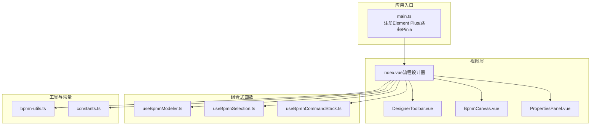
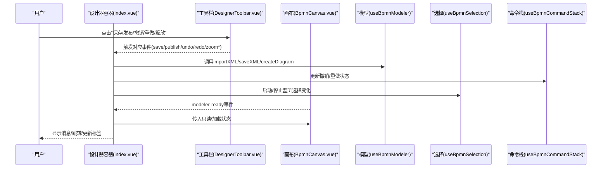
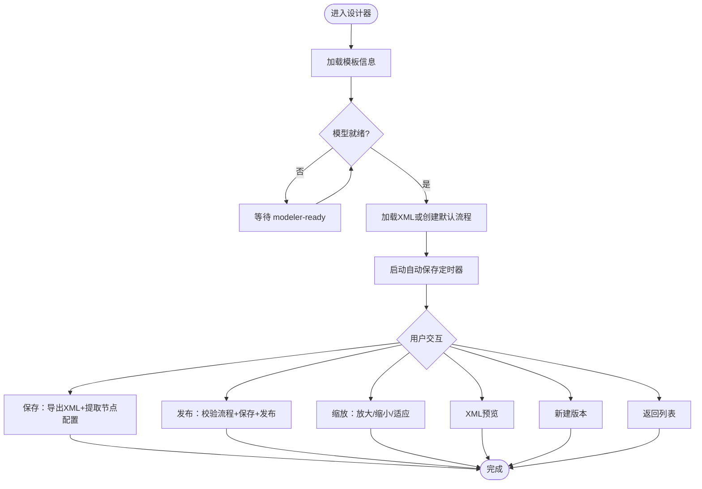
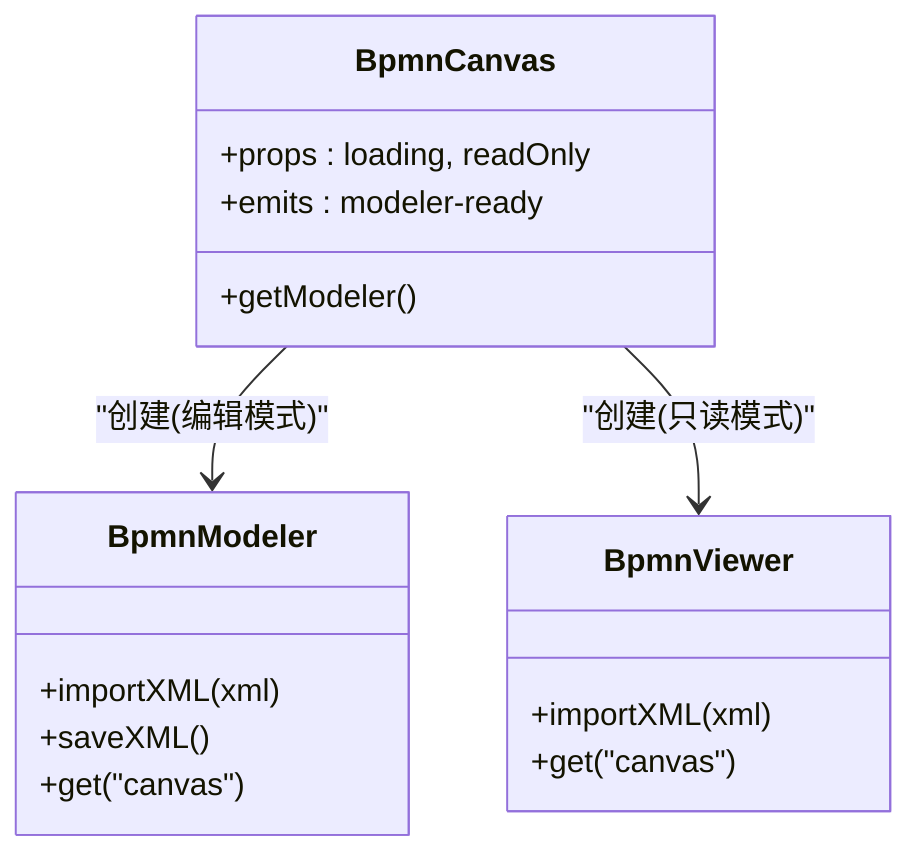
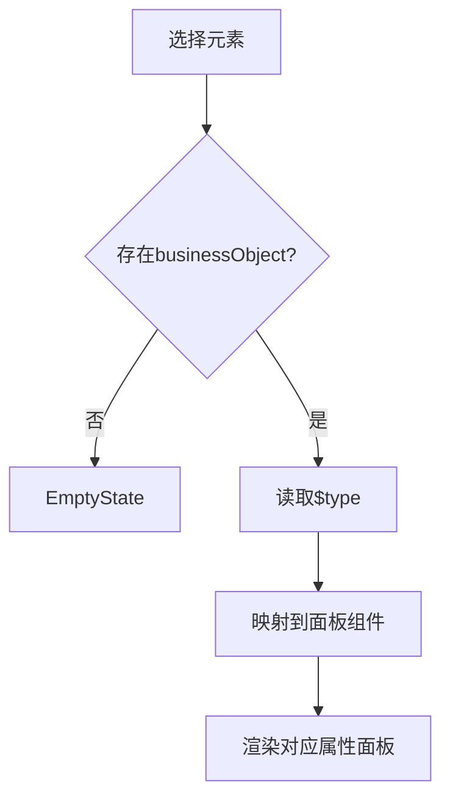
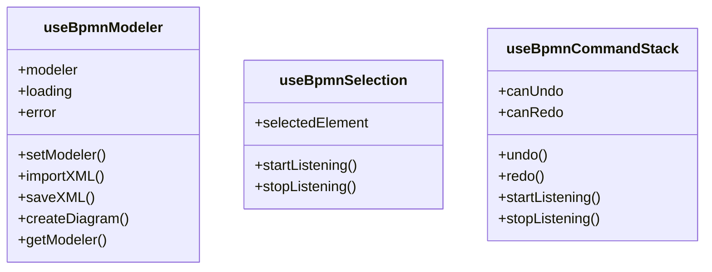
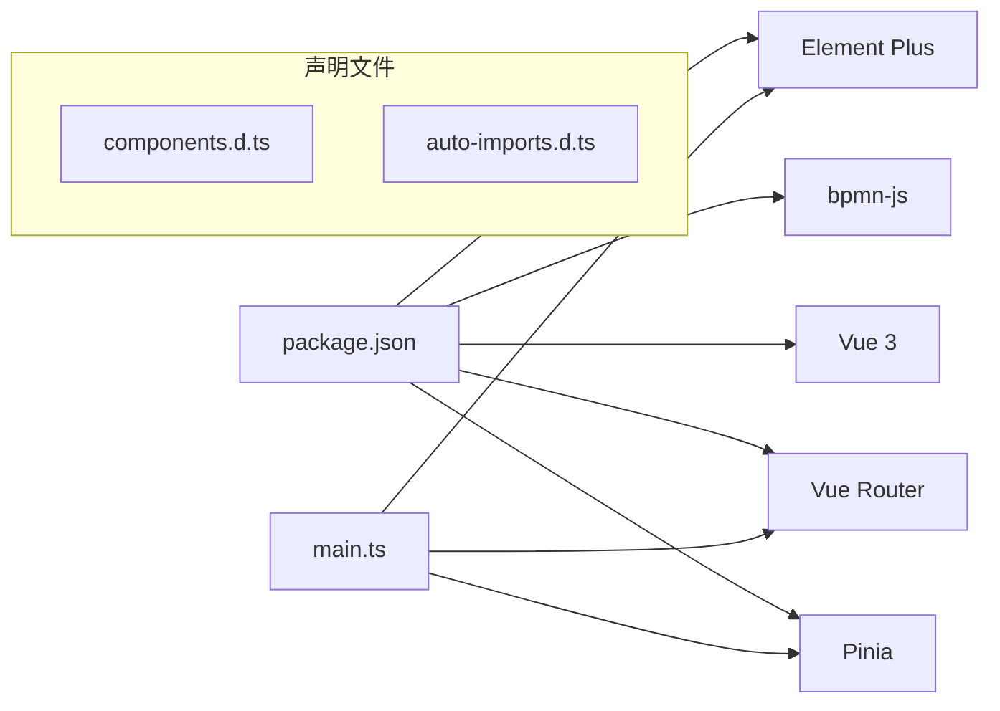

# UI组件库

<cite>
**本文引用的文件**
- [package.json](file://oa-ui/package.json)
- [main.ts](file://oa-ui/src/main.ts)
- [components.d.ts](file://oa-ui/src/components.d.ts)
- [auto-imports.d.ts](file://oa-ui/src/auto-imports.d.ts)
- [index.vue（流程设计器）](file://oa-ui/src/views/approval/template/designer/index.vue)
- [BpmnCanvas.vue](file://oa-ui/src/views/approval/template/designer/components/BpmnCanvas.vue)
- [DesignerToolbar.vue](file://oa-ui/src/views/approval/template/designer/components/DesignerToolbar.vue)
- [PropertiesPanel.vue](file://oa-ui/src/views/approval/template/designer/components/PropertiesPanel.vue)
- [useBpmnModeler.ts](file://oa-ui/src/composables/bpmn/useBpmnModeler.ts)
- [useBpmnSelection.ts](file://oa-ui/src/composables/bpmn/useBpmnSelection.ts)
- [useBpmnCommandStack.ts](file://oa-ui/src/composables/bpmn/useBpmnCommandStack.ts)
- [bpmn-utils.ts](file://oa-ui/src/bpmn/bpmn-utils.ts)
- [constants.ts](file://oa-ui/src/bpmn/constants.ts)
</cite>

## 目录
1. [简介](#简介)
2. [项目结构](#项目结构)
3. [核心组件](#核心组件)
4. [架构总览](#架构总览)
5. [组件详解](#组件详解)
6. [依赖关系分析](#依赖关系分析)
7. [性能与可用性](#性能与可用性)
8. [测试策略与维护最佳实践](#测试策略与维护最佳实践)
9. [结论](#结论)
10. [附录：API与使用示例](#附录api与使用示例)

## 简介
本文件面向OA审批管理系统前端UI组件库，重点围绕以下目标展开：
- 基于Element Plus的组件设计规范与样式定制方案
- BPMN流程设计器的核心组件实现：画布组件、工具栏组件、属性面板组件及其交互
- 自定义组件的设计原则与复用机制
- 组件的状态管理、事件处理与数据绑定模式
- 组件的API设计规范与使用示例
- 可访问性与跨浏览器兼容性建议
- 测试策略与维护最佳实践

## 项目结构
oa-ui采用Vue 3 + TypeScript + Vite构建，使用Element Plus作为基础UI库，并通过bpmn-js实现BPMN流程设计器。核心目录组织如下：
- 视图层：views/approval/template/designer 下包含设计器页面与子组件
- 组合式函数：composables/bpmn 提供模型、选择、命令栈等状态封装
- 工具与常量：bpmn 目录提供BPMN工具方法与类型映射
- 全局注册：main.ts 注册Element Plus与路由；components.d.ts、auto-imports.d.ts提供全局组件与自动导入声明

图表来源
- [main.ts:1-14](file://oa-ui/src/main.ts#L1-L14)
- [index.vue（流程设计器）:1-324](file://oa-ui/src/views/approval/template/designer/index.vue#L1-L324)
- [BpmnCanvas.vue:1-107](file://oa-ui/src/views/approval/template/designer/components/BpmnCanvas.vue#L1-L107)
- [DesignerToolbar.vue:1-132](file://oa-ui/src/views/approval/template/designer/components/DesignerToolbar.vue#L1-L132)
- [PropertiesPanel.vue:1-80](file://oa-ui/src/views/approval/template/designer/components/PropertiesPanel.vue#L1-L80)
- [useBpmnModeler.ts:1-98](file://oa-ui/src/composables/bpmn/useBpmnModeler.ts#L1-L98)
- [useBpmnSelection.ts:1-39](file://oa-ui/src/composables/bpmn/useBpmnSelection.ts#L1-L39)
- [useBpmnCommandStack.ts:1-59](file://oa-ui/src/composables/bpmn/useBpmnCommandStack.ts#L1-L59)
- [bpmn-utils.ts:1-231](file://oa-ui/src/bpmn/bpmn-utils.ts#L1-L231)
- [constants.ts:1-95](file://oa-ui/src/bpmn/constants.ts#L1-L95)

章节来源
- [package.json:1-38](file://oa-ui/package.json#L1-L38)
- [main.ts:1-14](file://oa-ui/src/main.ts#L1-L14)
- [components.d.ts:1-59](file://oa-ui/src/components.d.ts#L1-L59)
- [auto-imports.d.ts:1-89](file://oa-ui/src/auto-imports.d.ts#L1-L89)

## 核心组件
- 设计器容器：负责生命周期、自动保存、撤销/重做、缩放、保存/发布、XML预览、版本管理与离开保护
- 画布组件：封装bpmn-js Modeler/Viewer实例，响应容器尺寸变化，暴露modeler实例
- 工具栏组件：提供撤销/重做、缩放、保存/发布、返回、XML预览、新建版本等操作
- 属性面板：根据选中元素动态渲染对应属性配置面板（开始/结束事件、用户任务、网关等）

章节来源
- [index.vue（流程设计器）:1-324](file://oa-ui/src/views/approval/template/designer/index.vue#L1-L324)
- [BpmnCanvas.vue:1-107](file://oa-ui/src/views/approval/template/designer/components/BpmnCanvas.vue#L1-L107)
- [DesignerToolbar.vue:1-132](file://oa-ui/src/views/approval/template/designer/components/DesignerToolbar.vue#L1-L132)
- [PropertiesPanel.vue:1-80](file://oa-ui/src/views/approval/template/designer/components/PropertiesPanel.vue#L1-L80)

## 架构总览
设计器采用“容器组件 + 子组件 + 组合式函数”的分层架构：
- 容器组件负责业务编排、状态管理、事件处理与持久化
- 子组件负责UI呈现与用户交互
- 组合式函数封装bpmn-js相关状态与行为，提升复用性与可测试性

图表来源
- [index.vue（流程设计器）:52-287](file://oa-ui/src/views/approval/template/designer/index.vue#L52-L287)
- [DesignerToolbar.vue:67-94](file://oa-ui/src/views/approval/template/designer/components/DesignerToolbar.vue#L67-L94)
- [BpmnCanvas.vue:39-77](file://oa-ui/src/views/approval/template/designer/components/BpmnCanvas.vue#L39-L77)
- [useBpmnModeler.ts:7-97](file://oa-ui/src/composables/bpmn/useBpmnModeler.ts#L7-L97)
- [useBpmnSelection.ts:4-38](file://oa-ui/src/composables/bpmn/useBpmnSelection.ts#L4-L38)
- [useBpmnCommandStack.ts:4-58](file://oa-ui/src/composables/bpmn/useBpmnCommandStack.ts#L4-L58)

## 组件详解

### 设计器容器（index.vue）
职责与特性：
- 生命周期管理：挂载时加载模板信息与XML，卸载时清理定时器与事件监听
- 自动保存：定时检查脏标记，避免发布后保存
- 业务流程：保存、发布、新建版本、返回列表、XML预览
- 缩放控制：放大/缩小/适应视口，限制最大/最小比例
- 离开保护：存在未保存更改时提示确认

图表来源
- [index.vue（流程设计器）:93-286](file://oa-ui/src/views/approval/template/designer/index.vue#L93-L286)

章节来源
- [index.vue（流程设计器）:1-324](file://oa-ui/src/views/approval/template/designer/index.vue#L1-L324)

### 画布组件（BpmnCanvas.vue）
职责与特性：
- 动态创建bpmn-js实例（Modeler或Viewer），支持moddle扩展
- ResizeObserver监听容器尺寸变化，触发canvas.resized
- 暴露getModeler与容器引用，供父组件调用
- 支持只读模式与加载状态显示

图表来源
- [BpmnCanvas.vue:11-79](file://oa-ui/src/views/approval/template/designer/components/BpmnCanvas.vue#L11-L79)
- [useBpmnModeler.ts:16-81](file://oa-ui/src/composables/bpmn/useBpmnModeler.ts#L16-L81)

章节来源
- [BpmnCanvas.vue:1-107](file://oa-ui/src/views/approval/template/designer/components/BpmnCanvas.vue#L1-L107)

### 工具栏组件（DesignerToolbar.vue）
职责与特性：
- 左侧：返回按钮、标题、状态标签（草稿/已发布）
- 中部：撤销/重做、缩放（放大/缩小/适应）
- 右侧：XML预览、保存/发布、新建版本（发布后）
- 通过事件向上冒泡，由容器统一处理

章节来源
- [DesignerToolbar.vue:1-132](file://oa-ui/src/views/approval/template/designer/components/DesignerToolbar.vue#L1-L132)

### 属性面板（PropertiesPanel.vue）
职责与特性：
- 根据选中元素类型动态渲染对应属性面板
- 支持空状态提示
- 透传modeler、模板ID、只读状态与当前元素

图表来源
- [PropertiesPanel.vue:23-49](file://oa-ui/src/views/approval/template/designer/components/PropertiesPanel.vue#L23-L49)

章节来源
- [PropertiesPanel.vue:1-80](file://oa-ui/src/views/approval/template/designer/components/PropertiesPanel.vue#L1-L80)

### 组合式函数（状态与行为封装）
- useBpmnModeler：封装modeler实例、导入XML、保存XML、创建默认流程、加载状态与错误
- useBpmnSelection：封装选择变化监听、选中元素状态
- useBpmnCommandStack：封装撤销/重做状态与事件监听

图表来源
- [useBpmnModeler.ts:7-97](file://oa-ui/src/composables/bpmn/useBpmnModeler.ts#L7-L97)
- [useBpmnSelection.ts:4-38](file://oa-ui/src/composables/bpmn/useBpmnSelection.ts#L4-L38)
- [useBpmnCommandStack.ts:4-58](file://oa-ui/src/composables/bpmn/useBpmnCommandStack.ts#L4-L58)

章节来源
- [useBpmnModeler.ts:1-98](file://oa-ui/src/composables/bpmn/useBpmnModeler.ts#L1-L98)
- [useBpmnSelection.ts:1-39](file://oa-ui/src/composables/bpmn/useBpmnSelection.ts#L1-L39)
- [useBpmnCommandStack.ts:1-59](file://oa-ui/src/composables/bpmn/useBpmnCommandStack.ts#L1-L59)

### BPMN工具与常量
- bpmn-utils：生成默认XML、提取节点配置、校验流程、注入监听器
- constants：节点类型、审批人类型、多实例类型、模板状态与标签映射

章节来源
- [bpmn-utils.ts:1-231](file://oa-ui/src/bpmn/bpmn-utils.ts#L1-L231)
- [constants.ts:1-95](file://oa-ui/src/bpmn/constants.ts#L1-L95)

## 依赖关系分析
- 运行时依赖：Element Plus、bpmn-js、Vue 3、Pinia、Vue Router
- 开发依赖：Vitest、Vue Test Utils、Sass、TypeScript、unplugin-auto-import、unplugin-vue-components
- 全局组件与指令：通过components.d.ts与auto-imports.d.ts声明，减少重复导入

图表来源
- [package.json:15-36](file://oa-ui/package.json#L15-L36)
- [components.d.ts:8-58](file://oa-ui/src/components.d.ts#L8-L58)
- [auto-imports.d.ts:8-82](file://oa-ui/src/auto-imports.d.ts#L8-L82)
- [main.ts:1-14](file://oa-ui/src/main.ts#L1-L14)

章节来源
- [package.json:1-38](file://oa-ui/package.json#L1-L38)
- [components.d.ts:1-59](file://oa-ui/src/components.d.ts#L1-L59)
- [auto-imports.d.ts:1-89](file://oa-ui/src/auto-imports.d.ts#L1-L89)
- [main.ts:1-14](file://oa-ui/src/main.ts#L1-L14)

## 性能与可用性
- 性能
  - 画布ResizeObserver仅监听容器尺寸变化，避免频繁计算
  - 自动保存采用定时器节流，仅在非发布且非保存中时执行
  - 导入XML后自动适配视口，提升初始体验
- 可访问性
  - 使用Element Plus语义化组件，确保键盘导航与屏幕阅读器友好
  - 对图标按钮提供文本标签，保证视觉以外的信息传达
- 跨浏览器兼容
  - 使用bpmn-js官方样式与字体资源，确保跨浏览器一致性
  - 在容器组件中对事件总线与canvas接口进行安全访问判断

[本节为通用指导，不直接分析具体文件]

## 测试策略与维护最佳实践
- 单元测试
  - 组合式函数：针对useBpmnModeler、useBpmnSelection、useBpmnCommandStack的边界条件与错误路径
  - 工具函数：bpmn-utils中的XML生成、节点配置提取、流程校验与监听器注入
- 集成测试
  - 设计器容器：模拟保存/发布/撤销/重做/缩放/离开保护等端到端流程
- 维护最佳实践
  - 将UI与业务逻辑解耦，优先通过组合式函数与事件通信
  - 对外部库（bpmn-js）的调用进行健壮性封装，统一错误处理
  - 使用TypeScript严格模式，结合auto-imports.d.ts与components.d.ts减少手写导入

[本节为通用指导，不直接分析具体文件]

## 结论
本UI组件库以Element Plus为基础，结合bpmn-js实现了可编辑、可发布的BPMN流程设计器。通过组合式函数封装状态与行为，配合容器组件的业务编排，形成清晰的分层架构。建议在后续迭代中持续完善测试覆盖、增强可访问性与跨浏览器稳定性，并保持组件API的向后兼容。

[本节为总结性内容，不直接分析具体文件]

## 附录：API与使用示例

### Element Plus集成与全局声明
- Element Plus在入口文件中按需引入并设置语言
- components.d.ts与auto-imports.d.ts提供全局组件与指令声明，减少样板代码

章节来源
- [main.ts:1-14](file://oa-ui/src/main.ts#L1-L14)
- [components.d.ts:8-58](file://oa-ui/src/components.d.ts#L8-L58)
- [auto-imports.d.ts:8-82](file://oa-ui/src/auto-imports.d.ts#L8-L82)

### 设计器容器（index.vue）API
- 输入属性
  - templateStatus: 模板状态（草稿/已发布）
  - templateName: 模板名称
  - canUndo/canRedo: 撤销/重做可用性
  - saving: 保存中状态
- 事件
  - save/publish/undo/redo/zoomIn/zoomOut/zoomFit/previewXml/newVersion/back
- 方法
  - handleSave(silent?): 保存XML与节点配置
  - handlePublish(): 校验流程后发布
  - handleNewVersion(): 创建新版本并跳转
  - openXmlPreview(): 打开XML预览对话框
  - handleBack(): 离开前确认

章节来源
- [index.vue（流程设计器）:52-287](file://oa-ui/src/views/approval/template/designer/index.vue#L52-L287)

### 画布组件（BpmnCanvas.vue）API
- 输入属性
  - loading?: 加载状态
  - readOnly?: 只读模式
- 事件
  - modeler-ready(modeler): 模型准备完成
- 暴露方法
  - getModeler(): 获取bpmn-js实例
  - containerRef: 容器引用

章节来源
- [BpmnCanvas.vue:22-79](file://oa-ui/src/views/approval/template/designer/components/BpmnCanvas.vue#L22-L79)

### 工具栏组件（DesignerToolbar.vue）API
- 输入属性
  - templateStatus: 模板状态
  - templateName: 模板名称
  - canUndo/canRedo/saving: 控制按钮状态
- 事件
  - save/publish/undo/redo/zoomIn/zoomOut/zoomFit/previewXml/newVersion/back

章节来源
- [DesignerToolbar.vue:72-94](file://oa-ui/src/views/approval/template/designer/components/DesignerToolbar.vue#L72-L94)

### 属性面板（PropertiesPanel.vue）API
- 输入属性
  - selectedElement: 当前选中元素
  - modeler: bpmn-js实例
  - templateId: 模板ID
  - readOnly: 只读状态
- 渲染规则
  - 根据businessObject.$type映射到对应属性面板组件

章节来源
- [PropertiesPanel.vue:30-49](file://oa-ui/src/views/approval/template/designer/components/PropertiesPanel.vue#L30-L49)

### 组合式函数API
- useBpmnModeler
  - setModeler(modeler)
  - importXML(xml)/saveXML()/createDiagram(key,name)
  - getModeler(), loading, error
- useBpmnSelection
  - startListening()/stopListening()
  - selectedElement
- useBpmnCommandStack
  - startListening()/stopListening()
  - canUndo, canRedo, undo(), redo()

章节来源
- [useBpmnModeler.ts:7-97](file://oa-ui/src/composables/bpmn/useBpmnModeler.ts#L7-L97)
- [useBpmnSelection.ts:4-38](file://oa-ui/src/composables/bpmn/useBpmnSelection.ts#L4-L38)
- [useBpmnCommandStack.ts:4-58](file://oa-ui/src/composables/bpmn/useBpmnCommandStack.ts#L4-L58)

### BPMN工具与常量API
- bpmn-utils
  - generateDefaultXml(key,name)
  - extractNodeConfigs(modeler)
  - validateProcess(modeler)
  - injectTaskListeners(xml)
- constants
  - NODE_TYPE_OPTIONS / ASSIGNEE_TYPE_OPTIONS / MULTI_INSTANCE_TYPE_OPTIONS
  - NODE_TYPE_LABEL_MAP / ASSIGNEE_TYPE_LABEL_MAP / MULTI_INSTANCE_TYPE_LABEL_MAP
  - TEMPLATE_STATUS / TEMPLATE_STATUS_LABEL_MAP

章节来源
- [bpmn-utils.ts:23-231](file://oa-ui/src/bpmn/bpmn-utils.ts#L23-L231)
- [constants.ts:21-95](file://oa-ui/src/bpmn/constants.ts#L21-L95)