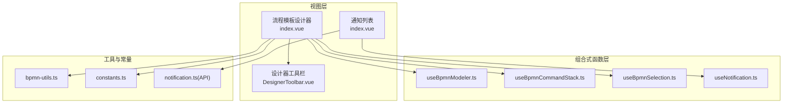
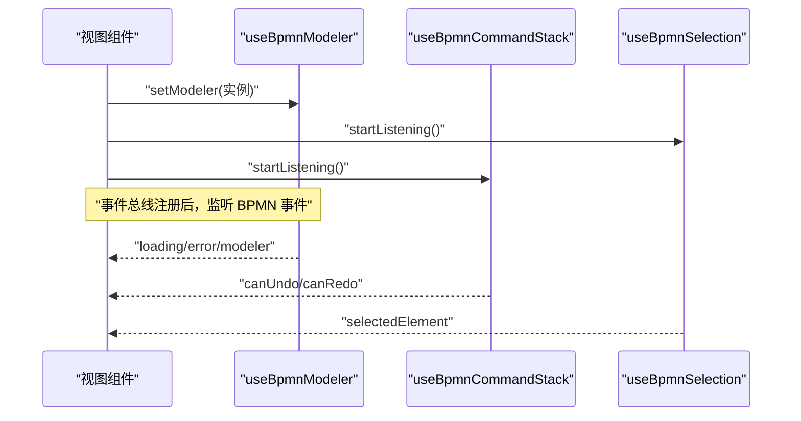
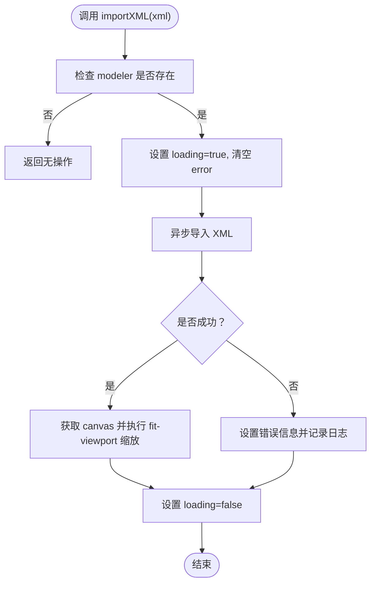
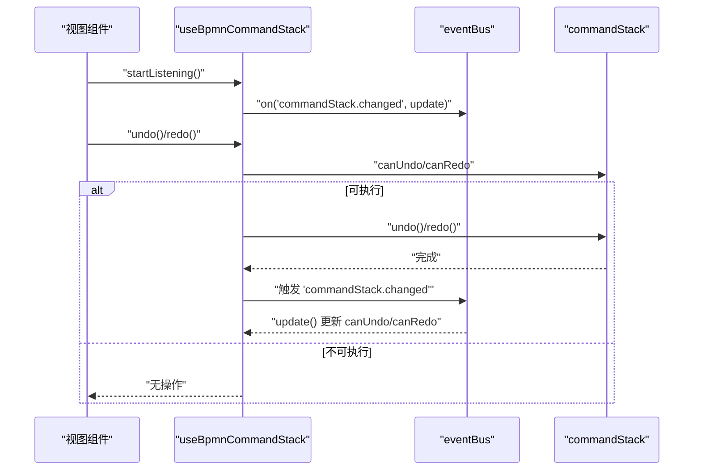
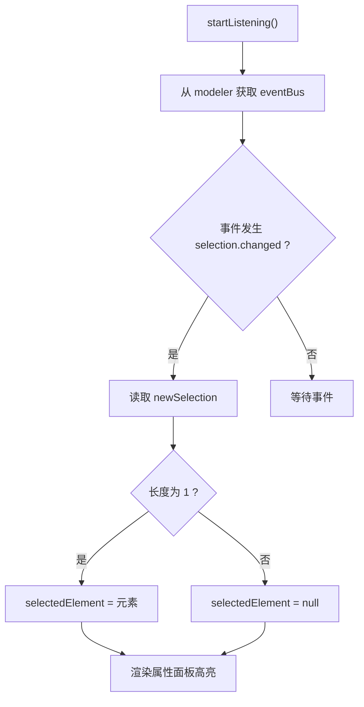
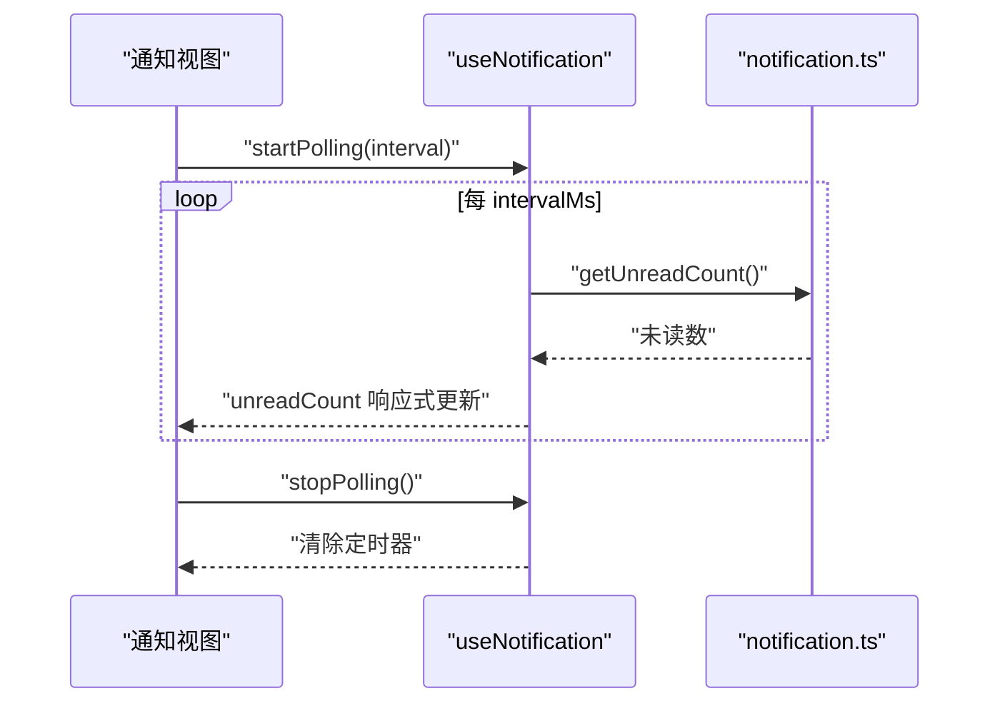
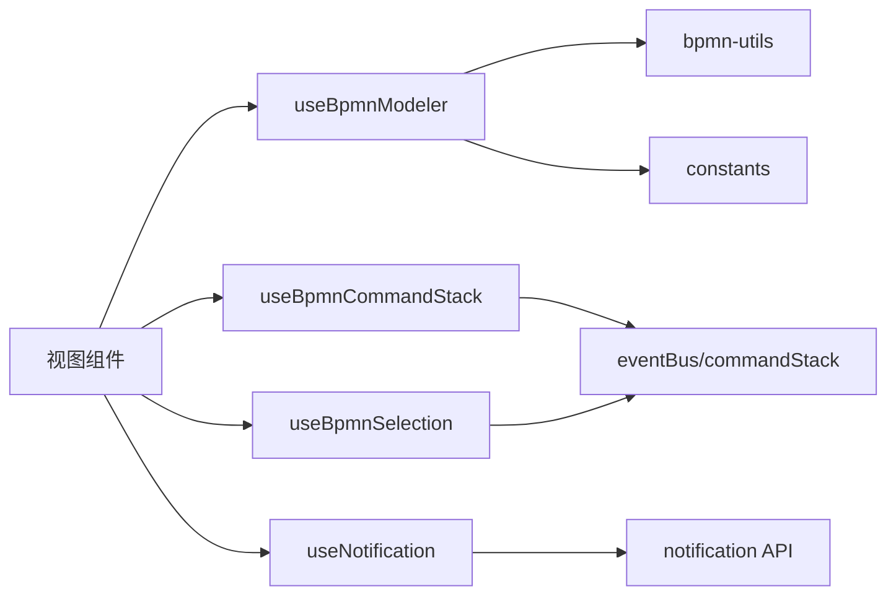

# 组合式函数

<cite>
**本文引用的文件**
- [useBpmnModeler.ts](file://oa-ui/src/composables/bpmn/useBpmnModeler.ts)
- [useBpmnCommandStack.ts](file://oa-ui/src/composables/bpmn/useBpmnCommandStack.ts)
- [useBpmnSelection.ts](file://oa-ui/src/composables/bpmn/useBpmnSelection.ts)
- [useNotification.ts](file://oa-ui/src/composables/useNotification.ts)
- [index.vue（流程模板设计器）](file://oa-ui/src/views/approval/template/designer/index.vue)
- [DesignerToolbar.vue](file://oa-ui/src/views/approval/template/designer/components/DesignerToolbar.vue)
- [bpmn-utils.ts](file://oa-ui/src/bpmn/bpmn-utils.ts)
- [constants.ts](file://oa-ui/src/bpmn/constants.ts)
- [notification.ts](file://oa-ui/src/api/notification.ts)
- [index.vue（通知列表）](file://oa-ui/src/views/notification/index.vue)
- [bpmn-composables.test.ts](file://oa-ui/src/composables/bpmn/bpmn-composables.test.ts)
</cite>

## 目录
1. [简介](#简介)
2. [项目结构](#项目结构)
3. [核心组件](#核心组件)
4. [架构总览](#架构总览)
5. [详细组件分析](#详细组件分析)
6. [依赖关系分析](#依赖关系分析)
7. [性能考量](#性能考量)
8. [故障排查指南](#故障排查指南)
9. [结论](#结论)
10. [附录](#附录)

## 简介
本技术文档聚焦于 OA 审批管理系统中的“组合式函数”（Composables），系统性阐述以下能力：
- BPMN 流程建模器状态管理：useBpmnModeler
- 命令栈历史记录与撤销/重做：useBpmnCommandStack
- 节点选择与高亮：useBpmnSelection
- 通知管理：useNotification（轮询未读数、启动/停止轮询）
- 设计原则、复用策略、生命周期管理与内存泄漏防护
- 与组件的集成模式与数据传递机制
- 使用示例与最佳实践

## 项目结构
围绕 BPMN 设计器与通知模块，组合式函数主要位于 oa-ui/src/composables 目录，并在设计器视图与通知视图中被消费。

图表来源
- [useBpmnModeler.ts:1-98](file://oa-ui/src/composables/bpmn/useBpmnModeler.ts#L1-L98)
- [useBpmnCommandStack.ts:1-59](file://oa-ui/src/composables/bpmn/useBpmnCommandStack.ts#L1-L59)
- [useBpmnSelection.ts:1-39](file://oa-ui/src/composables/bpmn/useBpmnSelection.ts#L1-L39)
- [useNotification.ts:1-31](file://oa-ui/src/composables/useNotification.ts#L1-L31)
- [index.vue（流程模板设计器）:52-107](file://oa-ui/src/views/approval/template/designer/index.vue#L52-L107)
- [DesignerToolbar.vue:1-132](file://oa-ui/src/views/approval/template/designer/components/DesignerToolbar.vue#L1-L132)
- [bpmn-utils.ts:1-231](file://oa-ui/src/bpmn/bpmn-utils.ts#L1-L231)
- [constants.ts:1-95](file://oa-ui/src/bpmn/constants.ts#L1-L95)
- [notification.ts:1-36](file://oa-ui/src/api/notification.ts#L1-L36)
- [index.vue（通知列表）:1-117](file://oa-ui/src/views/notification/index.vue#L1-L117)

章节来源
- [index.vue（流程模板设计器）:52-107](file://oa-ui/src/views/approval/template/designer/index.vue#L52-L107)
- [DesignerToolbar.vue:67-94](file://oa-ui/src/views/approval/template/designer/components/DesignerToolbar.vue#L67-L94)
- [useBpmnModeler.ts:1-98](file://oa-ui/src/composables/bpmn/useBpmnModeler.ts#L1-L98)
- [useBpmnCommandStack.ts:1-59](file://oa-ui/src/composables/bpmn/useBpmnCommandStack.ts#L1-L59)
- [useBpmnSelection.ts:1-39](file://oa-ui/src/composables/bpmn/useBpmnSelection.ts#L1-L39)
- [useNotification.ts:1-31](file://oa-ui/src/composables/useNotification.ts#L1-L31)
- [bpmn-utils.ts:1-231](file://oa-ui/src/bpmn/bpmn-utils.ts#L1-L231)
- [constants.ts:1-95](file://oa-ui/src/bpmn/constants.ts#L1-L95)
- [notification.ts:1-36](file://oa-ui/src/api/notification.ts#L1-L36)
- [index.vue（通知列表）:49-111](file://oa-ui/src/views/notification/index.vue#L49-L111)

## 核心组件
- useBpmnModeler：封装 BPMN Modeler/Viewer 实例、XML 导入/保存、初始画布缩放、错误与加载状态管理。
- useBpmnCommandStack：监听命令栈变化，提供撤销/重做能力与状态开关。
- useBpmnSelection：监听选中元素变化，维护当前选中节点。
- useNotification：封装通知未读数轮询，支持启动/停止轮询与手动刷新。

章节来源
- [useBpmnModeler.ts:7-97](file://oa-ui/src/composables/bpmn/useBpmnModeler.ts#L7-L97)
- [useBpmnCommandStack.ts:4-58](file://oa-ui/src/composables/bpmn/useBpmnCommandStack.ts#L4-L58)
- [useBpmnSelection.ts:4-38](file://oa-ui/src/composables/bpmn/useBpmnSelection.ts#L4-L38)
- [useNotification.ts:7-30](file://oa-ui/src/composables/useNotification.ts#L7-L30)

## 架构总览
组合式函数通过响应式状态与事件总线在视图层与 BPMN 引擎之间建立松耦合连接，避免直接依赖 DOM 或第三方库细节，便于测试与复用。

图表来源
- [index.vue（流程模板设计器）:93-106](file://oa-ui/src/views/approval/template/designer/index.vue#L93-L106)
- [useBpmnSelection.ts:7-31](file://oa-ui/src/composables/bpmn/useBpmnSelection.ts#L7-L31)
- [useBpmnCommandStack.ts:34-48](file://oa-ui/src/composables/bpmn/useBpmnCommandStack.ts#L34-L48)

## 详细组件分析

### useBpmnModeler：流程建模器状态管理
职责与行为
- 维护 modeler 实例、加载状态与错误信息
- 提供导入 XML（含警告收集）、保存 XML、创建空白流程图的能力
- 自动缩放至“适应视口”，提升用户体验

关键点
- 类型约束：BpmnInstance 可为 Modeler 或 Viewer，统一返回值类型
- 错误处理：捕获导入异常，设置错误信息并记录日志
- 生命周期：由调用方在模型就绪时注入实例；销毁时需清理

图表来源
- [useBpmnModeler.ts:16-38](file://oa-ui/src/composables/bpmn/useBpmnModeler.ts#L16-L38)

章节来源
- [useBpmnModeler.ts:7-97](file://oa-ui/src/composables/bpmn/useBpmnModeler.ts#L7-L97)
- [index.vue（流程模板设计器）:125-142](file://oa-ui/src/views/approval/template/designer/index.vue#L125-L142)

### useBpmnCommandStack：命令栈与撤销/重做
职责与行为
- 订阅命令栈变更事件，动态更新 canUndo/canRedo
- 提供 undo/redo 方法，内部检查可执行性并同步更新状态
- 支持 startListening/stopListening 注册/注销事件监听

图表来源
- [useBpmnCommandStack.ts:8-48](file://oa-ui/src/composables/bpmn/useBpmnCommandStack.ts#L8-L48)
- [index.vue（流程模板设计器）:100-103](file://oa-ui/src/views/approval/template/designer/index.vue#L100-L103)

章节来源
- [useBpmnCommandStack.ts:4-58](file://oa-ui/src/composables/bpmn/useBpmnCommandStack.ts#L4-L58)
- [bpmn-composables.test.ts:115-145](file://oa-ui/src/composables/bpmn/bpmn-composables.test.ts#L115-L145)

### useBpmnSelection：节点选择与高亮
职责与行为
- 订阅 selection.changed 事件，仅当单元素选中时更新 selectedElement
- 支持 stopListening 清理监听与选中状态

图表来源
- [useBpmnSelection.ts:7-31](file://oa-ui/src/composables/bpmn/useBpmnSelection.ts#L7-L31)

章节来源
- [useBpmnSelection.ts:4-38](file://oa-ui/src/composables/bpmn/useBpmnSelection.ts#L4-L38)
- [bpmn-composables.test.ts:12-75](file://oa-ui/src/composables/bpmn/bpmn-composables.test.ts#L12-L75)

### useNotification：通知管理机制
职责与行为
- 封装未读数轮询：支持启动/停止轮询与手动刷新
- 内部使用定时器，避免重复启动
- API 层提供获取未读数接口

图表来源
- [useNotification.ts:16-27](file://oa-ui/src/composables/useNotification.ts#L16-L27)
- [notification.ts:25-27](file://oa-ui/src/api/notification.ts#L25-L27)
- [index.vue（通知列表）:75-88](file://oa-ui/src/views/notification/index.vue#L75-L88)

章节来源
- [useNotification.ts:7-30](file://oa-ui/src/composables/useNotification.ts#L7-L30)
- [notification.ts:1-36](file://oa-ui/src/api/notification.ts#L1-L36)
- [index.vue（通知列表）:49-111](file://oa-ui/src/views/notification/index.vue#L49-L111)

## 依赖关系分析
- 视图层通过组合式函数与 BPMN 引擎服务交互（eventBus/commandStack/canvas），不直接依赖第三方库对象
- 工具函数与常量为 BPMN 处理提供支撑（类型映射、校验规则、默认 XML 生成）
- 通知模块独立于 BPMN，但共享通用请求封装

图表来源
- [index.vue（流程模板设计器）:59-82](file://oa-ui/src/views/approval/template/designer/index.vue#L59-L82)
- [bpmn-utils.ts:56-94](file://oa-ui/src/bpmn/bpmn-utils.ts#L56-L94)
- [constants.ts:21-84](file://oa-ui/src/bpmn/constants.ts#L21-L84)
- [useNotification.ts:1-6](file://oa-ui/src/composables/useNotification.ts#L1-L6)
- [notification.ts:1-36](file://oa-ui/src/api/notification.ts#L1-L36)

## 性能考量
- 事件监听按需开启/关闭：在组件挂载时 startListening，在卸载时 stopListening，避免内存泄漏与无效回调
- 轮询节流：通知未读数轮询间隔默认 30 秒，可根据业务调整
- 导入/保存为异步操作，配合 loading 状态避免重复提交
- 仅在单元素选中时更新选中状态，减少不必要的重渲染

## 故障排查指南
- BPMN 导入失败
  - 现象：error 值非空，控制台输出错误信息
  - 排查：检查 XML 结构合法性、命名空间与扩展元素配置
  - 参考路径：[useBpmnModeler.ts:31-37](file://oa-ui/src/composables/bpmn/useBpmnModeler.ts#L31-L37)
- 命令栈不可撤销/重做
  - 现象：canUndo/canRedo 为 false
  - 排查：确认已注册事件监听；检查是否执行过相关操作导致状态变化
  - 参考路径：[useBpmnCommandStack.ts:8-14](file://oa-ui/src/composables/bpmn/useBpmnCommandStack.ts#L8-L14)
- 选中元素不更新
  - 现象：selectedElement 始终为空
  - 排查：确认 eventBus 存在且已注册 selection.changed 监听；确保只选中一个元素
  - 参考路径：[useBpmnSelection.ts:13-20](file://oa-ui/src/composables/bpmn/useBpmnSelection.ts#L13-L20)
- 通知未读数不刷新
  - 现象：轮询未生效
  - 排查：确认 startPolling 已调用且 intervalId 未被重复设置；检查 API 返回
  - 参考路径：[useNotification.ts:16-27](file://oa-ui/src/composables/useNotification.ts#L16-L27), [notification.ts:25-27](file://oa-ui/src/api/notification.ts#L25-L27)

章节来源
- [useBpmnModeler.ts:31-37](file://oa-ui/src/composables/bpmn/useBpmnModeler.ts#L31-L37)
- [useBpmnCommandStack.ts:8-14](file://oa-ui/src/composables/bpmn/useBpmnCommandStack.ts#L8-L14)
- [useBpmnSelection.ts:13-20](file://oa-ui/src/composables/bpmn/useBpmnSelection.ts#L13-L20)
- [useNotification.ts:16-27](file://oa-ui/src/composables/useNotification.ts#L16-L27)
- [notification.ts:25-27](file://oa-ui/src/api/notification.ts#L25-L27)

## 结论
上述组合式函数以“低耦合、高内聚”的设计原则，将 BPMN 与通知两大模块的关键交互抽象为可测试、可复用的函数单元。通过事件总线与响应式状态，实现视图与引擎的解耦；通过生命周期钩子与显式清理，保障内存安全与性能稳定。建议在新场景中继续沿用此模式，优先封装状态与副作用，再暴露简洁的 API。

## 附录

### 设计原则与复用策略
- 单一职责：每个组合式函数专注一个领域（建模、命令栈、选择、通知）
- 显式依赖：通过参数注入 BPMN 实例，降低硬编码耦合
- 生命周期管理：提供 start/stop 方法，强制在组件挂载/卸载阶段成对调用
- 可测试性：以事件模拟与服务桩件驱动，覆盖边界条件与异常路径
- 可扩展性：通过常量与工具函数抽象，便于新增节点类型与校验规则

### 使用示例与最佳实践
- 流程设计器集成
  - 在组件挂载时注入 modeler 实例，启动 selection 与 commandStack 监听
  - 在 beforeUnmount 中停止监听与清理定时器
  - 参考路径：[index.vue（流程模板设计器）:93-107](file://oa-ui/src/views/approval/template/designer/index.vue#L93-L107), [index.vue（流程模板设计器）:281-286](file://oa-ui/src/views/approval/template/designer/index.vue#L281-L286)
- 工具栏联动
  - 将 canUndo/canRedo 传入 DesignerToolbar，按钮禁用态由组合式函数状态决定
  - 参考路径：[DesignerToolbar.vue:72-94](file://oa-ui/src/views/approval/template/designer/components/DesignerToolbar.vue#L72-L94)
- 通知轮询
  - 在页面挂载时启动轮询，离开页面时停止；必要时手动刷新
  - 参考路径：[index.vue（通知列表）:109-111](file://oa-ui/src/views/notification/index.vue#L109-L111), [useNotification.ts:16-27](file://oa-ui/src/composables/useNotification.ts#L16-L27)

### 生命周期管理与内存泄漏防护
- 事件总线监听必须与组件生命周期配对：mounted/startListening → beforeUnmount/stopListening
- 轮询定时器需在 stopPolling 中清理，防止重复启动
- 选中状态在 stopListening 时清空，避免脏数据残留

章节来源
- [index.vue（流程模板设计器）:281-286](file://oa-ui/src/views/approval/template/designer/index.vue#L281-L286)
- [useBpmnSelection.ts:23-31](file://oa-ui/src/composables/bpmn/useBpmnSelection.ts#L23-L31)
- [useNotification.ts:22-27](file://oa-ui/src/composables/useNotification.ts#L22-L27)