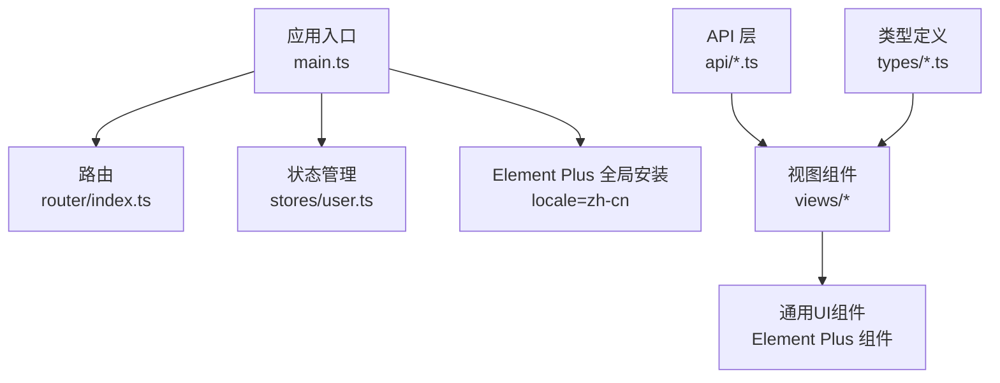
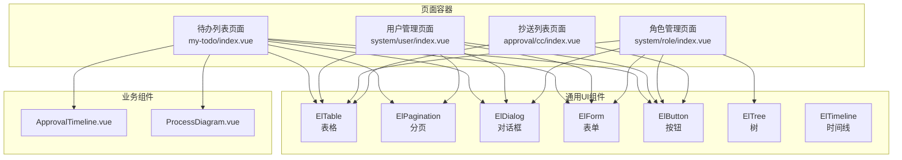
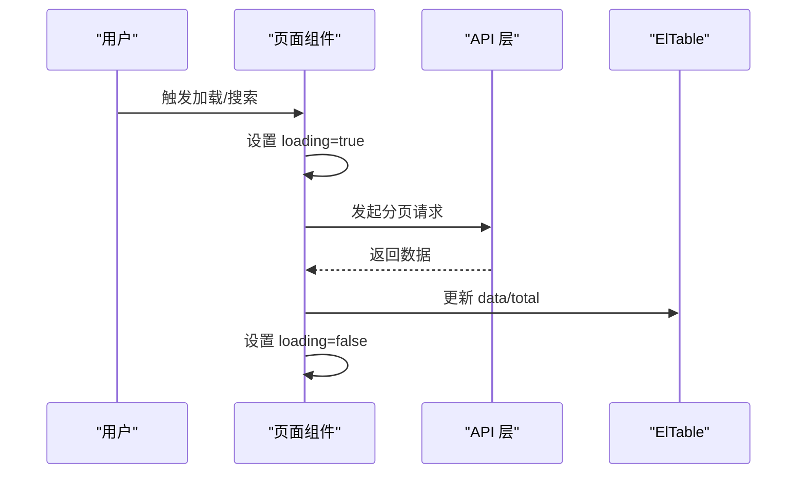
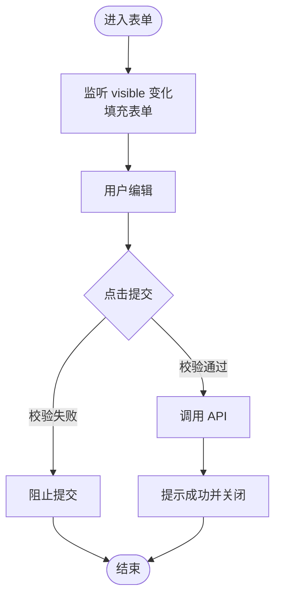
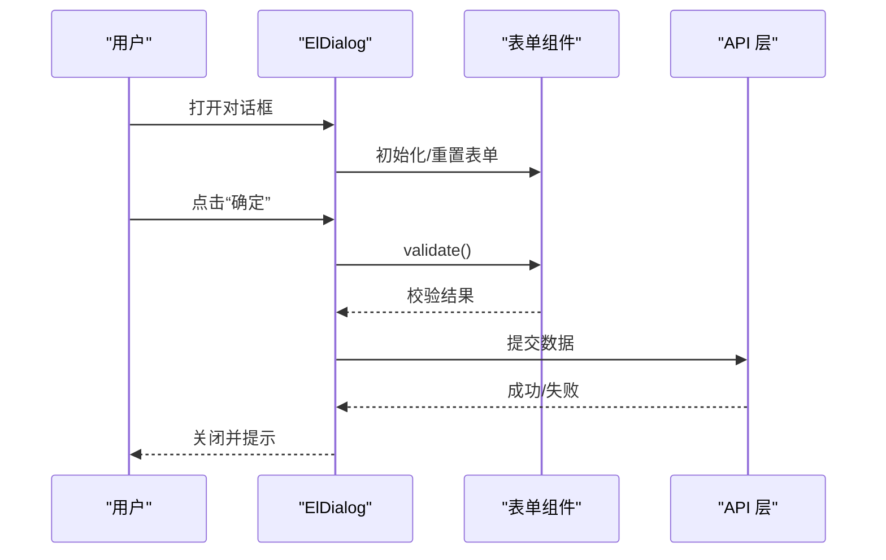
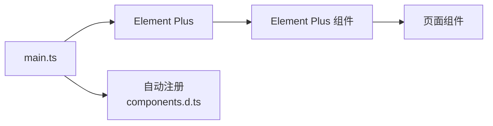

# 通用组件

<cite>
**本文引用的文件**
- [main.ts](file://oa-ui/src/main.ts)
- [package.json](file://oa-ui/package.json)
- [components.d.ts](file://oa-ui/src/components.d.ts)
- [index.vue（抄送列表）](file://oa-ui/src/views/approval/cc/index.vue)
- [index.vue（待办列表）](file://oa-ui/src/views/approval/my-todo/index.vue)
- [index.vue（用户管理）](file://oa-ui/src/views/system/user/index.vue)
- [index.vue（角色管理）](file://oa-ui/src/views/system/role/index.vue)
- [LeaveFormDialog.vue](file://oa-ui/src/views/leave/components/LeaveFormDialog.vue)
- [LeaveDetailDialog.vue](file://oa-ui/src/views/leave/components/LeaveDetailDialog.vue)
- [ApprovalTimeline.vue](file://oa-ui/src/views/approval/instance/components/ApprovalTimeline.vue)
- [ProcessDiagram.vue](file://oa-ui/src/views/approval/instance/components/ProcessDiagram.vue)
</cite>

## 目录
1. [简介](#简介)
2. [项目结构](#项目结构)
3. [核心组件](#核心组件)
4. [架构总览](#架构总览)
5. [详细组件分析](#详细组件分析)
6. [依赖分析](#依赖分析)
7. [性能考虑](#性能考虑)
8. [故障排查指南](#故障排查指南)
9. [结论](#结论)
10. [附录](#附录)

## 简介
本文件面向OA审批管理系统中的通用UI组件，围绕基于Element Plus的组件设计与使用进行系统化梳理，涵盖表格组件、表单组件、对话框组件、按钮组件、分页组件、树形组件、时间线组件等。文档重点说明：
- 组件的属性配置、事件处理与插槽设计
- 组件的状态管理、数据绑定与校验机制
- 组件的API设计规范与使用示例
- 主题定制、样式覆盖与响应式设计
- 可访问性与性能优化策略

## 项目结构
本项目前端位于 oa-ui 子工程，采用 Vue 3 + TypeScript + Vite 构建，Element Plus 作为UI基础库，并通过自动导入与自动注册机制在全局范围内使用其组件。

图表来源
- [main.ts:1-14](file://oa-ui/src/main.ts#L1-L14)
- [package.json:15-23](file://oa-ui/package.json#L15-L23)

章节来源
- [main.ts:1-14](file://oa-ui/src/main.ts#L1-L14)
- [package.json:1-38](file://oa-ui/package.json#L1-L38)

## 核心组件
本节从“表格+表单+对话框+按钮+分页+树+时间线”等维度，总结通用UI组件的设计与使用要点。

- 表格组件（ElTable）
  - 使用场景：列表展示、分页查询、固定列、行内操作
  - 关键点：数据绑定、加载态、列宽与固定列、行内按钮组
  - 示例参考：[index.vue（抄送列表）:5-22](file://oa-ui/src/views/approval/cc/index.vue#L5-L22)、[index.vue（待办列表）:10-35](file://oa-ui/src/views/approval/my-todo/index.vue#L10-L35)、[index.vue（用户管理）:29-61](file://oa-ui/src/views/system/user/index.vue#L29-L61)

- 表单组件（ElForm + ElFormItem）
  - 使用场景：新增/编辑、条件必填、输入校验、联动控制
  - 关键点：表单模型、校验规则、动态禁用、重置字段
  - 示例参考：[LeaveFormDialog.vue:10-49](file://oa-ui/src/views/leave/components/LeaveFormDialog.vue#L10-L49)

- 对话框组件（ElDialog）
  - 使用场景：弹窗表单、详情查看、二次确认
  - 关键点：v-model 控制显隐、destroy-on-close、插槽 footer
  - 示例参考：[index.vue（待办列表）:37-62](file://oa-ui/src/views/approval/my-todo/index.vue#L37-L62)、[LeaveFormDialog.vue:2-56](file://oa-ui/src/views/leave/components/LeaveFormDialog.vue#L2-L56)、[LeaveDetailDialog.vue:2-41](file://oa-ui/src/views/leave/components/LeaveDetailDialog.vue#L2-L41)

- 按钮组件（ElButton）
  - 使用场景：链接按钮、主次按钮、危险/成功/警告按钮
  - 关键点：link 类型、图标按钮、禁用状态、事件绑定
  - 示例参考：[index.vue（待办列表）:15-22](file://oa-ui/src/views/approval/my-todo/index.vue#L15-L22)、[index.vue（用户管理）:42-51](file://oa-ui/src/views/system/user/index.vue#L42-L51)

- 分页组件（ElPagination）
  - 使用场景：后端分页、页码与条数切换
  - 关键点：v-model:current-page、v-model:page-size、total、layout
  - 示例参考：[index.vue（待办列表）:24-34](file://oa-ui/src/views/approval/my-todo/index.vue#L24-L34)、[index.vue（用户管理）:53-60](file://oa-ui/src/views/system/user/index.vue#L53-L60)

- 树形组件（ElTree）
  - 使用场景：权限分配、多选勾选
  - 关键点：show-checkbox、node-key、default-checked-keys、ref 调用
  - 示例参考：[index.vue（角色管理）:84-91](file://oa-ui/src/views/system/role/index.vue#L84-L91)

- 时间线组件（ElTimeline）
  - 使用场景：审批流程可视化
  - 关键点：类型映射、标签类型、时间戳显示
  - 示例参考：[ApprovalTimeline.vue:4-26](file://oa-ui/src/views/approval/instance/components/ApprovalTimeline.vue#L4-L26)

章节来源
- [index.vue（抄送列表）:5-22](file://oa-ui/src/views/approval/cc/index.vue#L5-L22)
- [index.vue（待办列表）:10-62](file://oa-ui/src/views/approval/my-todo/index.vue#L10-L62)
- [index.vue（用户管理）:29-61](file://oa-ui/src/views/system/user/index.vue#L29-L61)
- [index.vue（角色管理）:84-91](file://oa-ui/src/views/system/role/index.vue#L84-L91)
- [LeaveFormDialog.vue:2-56](file://oa-ui/src/views/leave/components/LeaveFormDialog.vue#L2-L56)
- [LeaveDetailDialog.vue:2-41](file://oa-ui/src/views/leave/components/LeaveDetailDialog.vue#L2-L41)
- [ApprovalTimeline.vue:4-26](file://oa-ui/src/views/approval/instance/components/ApprovalTimeline.vue#L4-L26)

## 架构总览
下图展示了页面级组件如何组合Element Plus通用组件，形成完整的审批与管理界面。

图表来源
- [index.vue（待办列表）:1-160](file://oa-ui/src/views/approval/my-todo/index.vue#L1-L160)
- [index.vue（用户管理）:1-203](file://oa-ui/src/views/system/user/index.vue#L1-L203)
- [index.vue（角色管理）:1-213](file://oa-ui/src/views/system/role/index.vue#L1-L213)
- [index.vue（抄送列表）:1-61](file://oa-ui/src/views/approval/cc/index.vue#L1-L61)
- [ApprovalTimeline.vue:1-100](file://oa-ui/src/views/approval/instance/components/ApprovalTimeline.vue#L1-L100)
- [ProcessDiagram.vue:1-76](file://oa-ui/src/views/approval/instance/components/ProcessDiagram.vue#L1-L76)

## 详细组件分析

### 表格组件（ElTable）设计与使用
- 数据绑定与加载态
  - 使用 v-loading 包裹表格，避免异步渲染闪烁
  - 列宽设置与固定列，保证右侧操作区可见性
- 行内操作
  - 使用插槽 #default 渲染按钮组，区分链接按钮与语义按钮
- 响应式与可访问性
  - 合理使用 show-overflow-tooltip，确保长文本可读
  - 固定列时注意在小屏下的滚动体验

图表来源
- [index.vue（待办列表）:91-106](file://oa-ui/src/views/approval/my-todo/index.vue#L91-L106)
- [index.vue（用户管理）:128-142](file://oa-ui/src/views/system/user/index.vue#L128-L142)

章节来源
- [index.vue（待办列表）:10-35](file://oa-ui/src/views/approval/my-todo/index.vue#L10-L35)
- [index.vue（用户管理）:29-61](file://oa-ui/src/views/system/user/index.vue#L29-L61)

### 表单组件（ElForm）设计与使用
- 表单模型与双向绑定
  - 使用 reactive/refs 维护表单数据，支持只读/禁用字段
- 校验机制
  - 基于 rules 的必填与格式校验；复杂逻辑使用自定义 validator
  - 提交前调用 validate，失败则阻断
- 动态行为
  - 通过 watch 监听外部传入数据，自动填充表单
  - 重置时调用 resetFields，确保状态一致

图表来源
- [LeaveFormDialog.vue:102-119](file://oa-ui/src/views/leave/components/LeaveFormDialog.vue#L102-L119)
- [LeaveFormDialog.vue:138-158](file://oa-ui/src/views/leave/components/LeaveFormDialog.vue#L138-L158)

章节来源
- [LeaveFormDialog.vue:65-158](file://oa-ui/src/views/leave/components/LeaveFormDialog.vue#L65-L158)

### 对话框组件（ElDialog）设计与使用
- 显隐控制
  - 使用 v-model 控制显示/隐藏；destroy-on-close 在关闭时销毁DOM
- 插槽设计
  - header/footer 插槽用于自定义标题与底部按钮
- 事件与生命周期
  - close 事件用于重置表单或清理状态
- 与表单联动
  - 通过 ref 获取表单实例，统一校验与提交

图表来源
- [LeaveFormDialog.vue:2-56](file://oa-ui/src/views/leave/components/LeaveFormDialog.vue#L2-L56)
- [index.vue（待办列表）:37-62](file://oa-ui/src/views/approval/my-todo/index.vue#L37-L62)

章节来源
- [LeaveFormDialog.vue:2-56](file://oa-ui/src/views/leave/components/LeaveFormDialog.vue#L2-L56)
- [index.vue（待办列表）:37-62](file://oa-ui/src/views/approval/my-todo/index.vue#L37-L62)

### 按钮组件（ElButton）设计与使用
- 语义化按钮
  - 主要操作使用 type="primary"；危险操作使用 type="danger"
  - 链接风格使用 link，减少视觉重量
- 交互反馈
  - 结合 ElMessage 进行成功/失败提示
  - 异步操作中禁用按钮或显示加载态（如 v-loading）

章节来源
- [index.vue（待办列表）:15-22](file://oa-ui/src/views/approval/my-todo/index.vue#L15-L22)
- [index.vue（用户管理）:42-51](file://oa-ui/src/views/system/user/index.vue#L42-L51)

### 分页组件（ElPagination）设计与使用
- 参数绑定
  - v-model:current-page、v-model:page-size、total
- 事件处理
  - size-change 与 current-change 事件触发重新加载
- 布局与样式
  - 使用 layout="total, sizes, prev, pager, next"，右侧对齐

章节来源
- [index.vue（待办列表）:24-34](file://oa-ui/src/views/approval/my-todo/index.vue#L24-L34)
- [index.vue（用户管理）:53-60](file://oa-ui/src/views/system/user/index.vue#L53-L60)

### 树形组件（ElTree）设计与使用
- 多选与勾选
  - show-checkbox 开启多选；通过 default-checked-keys 初始化
- 数据结构
  - props 中指定 label 与 children 字段名
- 交互反馈
  - 通过 ref 获取勾选键值，提交前进行二次确认

章节来源
- [index.vue（角色管理）:84-91](file://oa-ui/src/views/system/role/index.vue#L84-L91)
- [index.vue（角色管理）:195-205](file://oa-ui/src/views/system/role/index.vue#L195-L205)

### 时间线组件（ElTimeline）设计与使用
- 数据驱动
  - 通过 tasks 属性传入审批任务数组
- 类型与标签
  - 根据任务结果映射不同类型与标签颜色
- 可访问性
  - 使用 timestamp 与 placement 提升信息层级

章节来源
- [ApprovalTimeline.vue:34-62](file://oa-ui/src/views/approval/instance/components/ApprovalTimeline.vue#L34-L62)

## 依赖分析
- Element Plus 全局安装与自动注册
  - 应用启动时安装 Element Plus 并设置语言为简体中文
  - 通过 unplugin-vue-components 与 components.d.ts 实现全局可用
- 组件生态
  - Element Plus 提供丰富的表单、表格、对话框、按钮、分页、树、时间线等组件
  - 业务组件（如 BPMN 流程图）与 Element Plus 组件协同工作

图表来源
- [main.ts:12](file://oa-ui/src/main.ts#L12)
- [components.d.ts:10-54](file://oa-ui/src/components.d.ts#L10-L54)

章节来源
- [main.ts:1-14](file://oa-ui/src/main.ts#L1-L14)
- [components.d.ts:1-59](file://oa-ui/src/components.d.ts#L1-L59)
- [package.json:15-23](file://oa-ui/package.json#L15-L23)

## 性能考虑
- 列表渲染
  - 使用 v-loading 与虚拟滚动（如需）减少重排
  - 合理设置列宽，避免过度重绘
- 表单提交
  - 提交前先 validate，避免无效请求
  - 对高频操作（如搜索）增加防抖
- 对话框
  - destroy-on-close 在关闭时释放资源
  - 大表单按需渲染，避免一次性挂载过多控件
- 图表组件
  - BPMN 渲染仅在数据变化时执行，避免重复初始化
- 资源加载
  - 按需引入 Element Plus 组件以减小包体积（当前为全局引入）

## 故障排查指南
- 表单校验不生效
  - 检查 rules 是否正确绑定，validator 是否返回 Promise 或回调
  - 确认提交前调用了 validate
- 对话框无法关闭
  - 检查 v-model 绑定是否正确，是否存在外部遮罩层阻止
  - 确认 @update:model-value 事件是否被拦截
- 表格数据不更新
  - 确认 total 与 data 已同步更新，loading 已置为 false
  - 检查分页参数是否随页码变化而变化
- 权限树勾选异常
  - 检查 node-key 与 default-checked-keys 是否匹配
  - 确认树数据结构与 props 配置一致
- 时间线显示异常
  - 检查任务数组是否为空，类型映射是否完整

章节来源
- [LeaveFormDialog.vue:102-119](file://oa-ui/src/views/leave/components/LeaveFormDialog.vue#L102-L119)
- [index.vue（待办列表）:91-106](file://oa-ui/src/views/approval/my-todo/index.vue#L91-L106)
- [index.vue（用户管理）:128-142](file://oa-ui/src/views/system/user/index.vue#L128-L142)
- [index.vue（角色管理）:187-205](file://oa-ui/src/views/system/role/index.vue#L187-L205)
- [ApprovalTimeline.vue:34-62](file://oa-ui/src/views/approval/instance/components/ApprovalTimeline.vue#L34-L62)

## 结论
本项目以 Element Plus 为基础，结合业务场景构建了统一的通用UI组件体系。通过规范的属性配置、事件处理与插槽设计，实现了表格、表单、对话框、按钮、分页、树与时间线等组件的高复用与一致性。建议在后续迭代中逐步引入按需加载与主题变量抽离，进一步提升可维护性与性能表现。

## 附录

### API 设计规范（示例）
- 表单提交
  - 输入：表单模型（含必填与校验规则）
  - 输出：成功/失败提示与事件回调
  - 参考路径：[LeaveFormDialog.vue:138-158](file://oa-ui/src/views/leave/components/LeaveFormDialog.vue#L138-L158)
- 列表分页
  - 输入：页码、每页数量、筛选条件
  - 输出：列表数据与总数
  - 参考路径：[index.vue（待办列表）:91-106](file://oa-ui/src/views/approval/my-todo/index.vue#L91-L106)
- 权限分配
  - 输入：角色ID、勾选的权限ID集合
  - 输出：成功提示与刷新列表
  - 参考路径：[index.vue（角色管理）:195-205](file://oa-ui/src/views/system/role/index.vue#L195-L205)

### 主题定制与样式覆盖
- Element Plus 主题
  - 通过全局安装时的语言与主题配置实现统一风格
  - 参考路径：[main.ts:12](file://oa-ui/src/main.ts#L12)
- 组件样式
  - 使用 scoped CSS 与语义化类名，避免样式污染
  - 参考路径：[ApprovalTimeline.vue:65-99](file://oa-ui/src/views/approval/instance/components/ApprovalTimeline.vue#L65-L99)

### 响应式设计
- 列宽与固定列：在窄屏下保持右侧操作区可见
- 文本截断：使用 show-overflow-tooltip 提升可读性
- 对话框宽度：根据内容体量调整宽度，保证信息密度

### 可访问性设计
- 表单标签与占位符：清晰表达字段含义
- 按钮语义：使用 type 区分操作意图
- 时间线与标签：使用语义化类型与颜色辅助理解