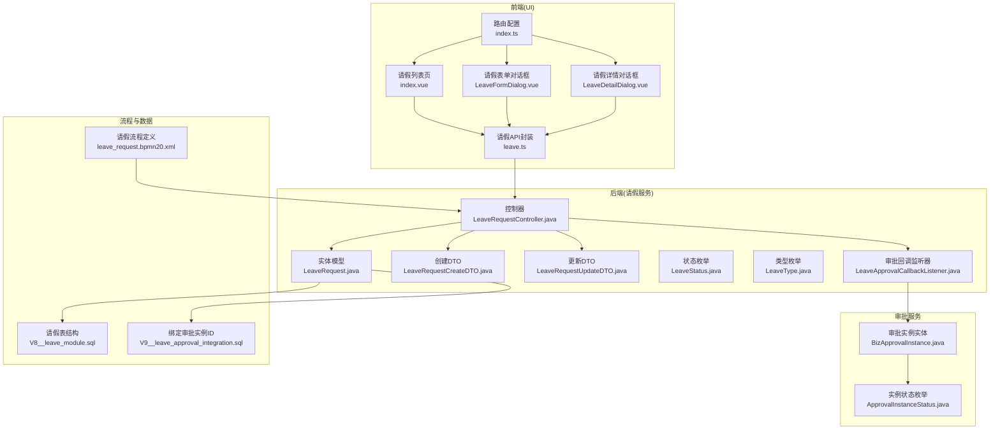
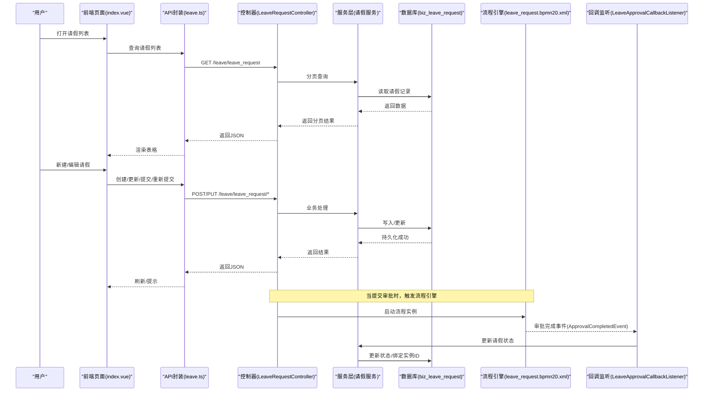
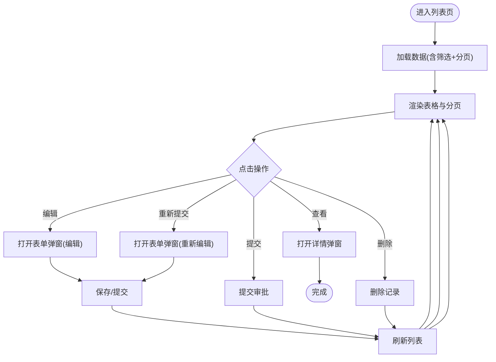
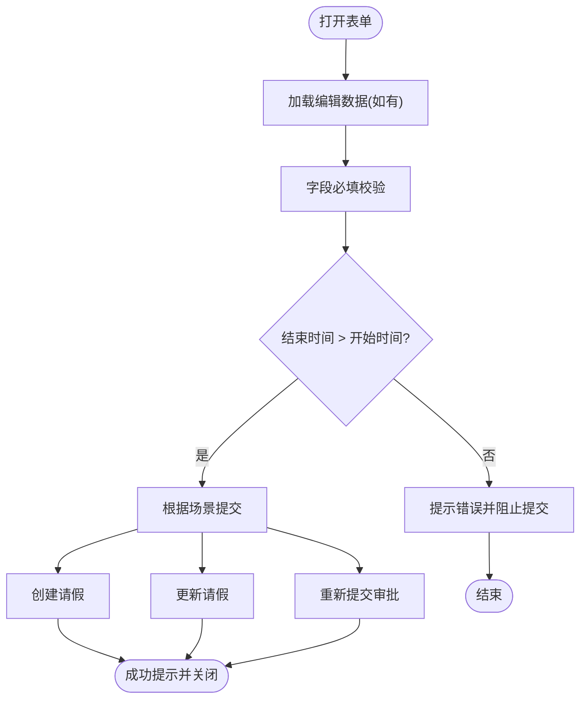
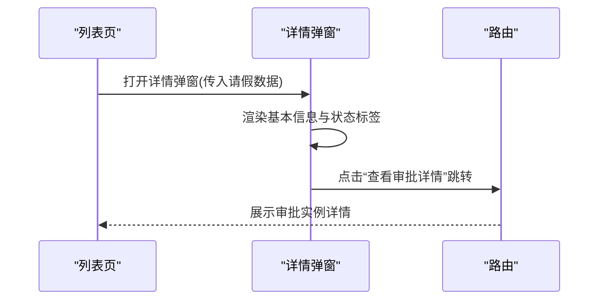
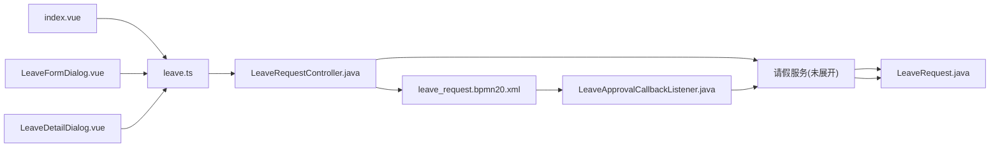

# 业务页面

<cite>
**本文引用的文件**
- [index.vue](file://oa-ui/src/views/leave/index.vue)
- [LeaveFormDialog.vue](file://oa-ui/src/views/leave/components/LeaveFormDialog.vue)
- [LeaveDetailDialog.vue](file://oa-ui/src/views/leave/components/LeaveDetailDialog.vue)
- [leave.ts](file://oa-ui/src/api/leave.ts)
- [LeaveRequestController.java](file://oa-leave/src/main/java/com/oa/admin/leave/controller/LeaveRequestController.java)
- [LeaveRequest.java](file://oa-leave/src/main/java/com/oa/admin/leave/entity/LeaveRequest.java)
- [LeaveRequestCreateDTO.java](file://oa-leave/src/main/java/com/oa/admin/leave/dto/LeaveRequestCreateDTO.java)
- [LeaveRequestUpdateDTO.java](file://oa-leave/src/main/java/com/oa/admin/leave/dto/LeaveRequestUpdateDTO.java)
- [LeaveStatus.java](file://oa-leave/src/main/java/com/oa/admin/leave/enums/LeaveStatus.java)
- [LeaveType.java](file://oa-leave/src/main/java/com/oa/admin/leave/enums/LeaveType.java)
- [LeaveApprovalCallbackListener.java](file://oa-leave/src/main/java/com/oa/admin/leave/listener/LeaveApprovalCallbackListener.java)
- [BizApprovalInstance.java](file://oa-approval/src/main/java/com/oa/admin/approval/entity/BizApprovalInstance.java)
- [ApprovalInstanceStatus.java](file://oa-approval/src/main/java/com/oa/admin/approval/enums/ApprovalInstanceStatus.java)
- [index.ts](file://oa-ui/src/router/index.ts)
- [V8__leave_module.sql](file://oa-app/src/main/resources/db/migration/V8__leave_module.sql)
- [V9__leave_approval_integration.sql](file://oa-app/src/main/resources/db/migration/V9__leave_approval_integration.sql)
- [leave_request.bpmn20.xml](file://oa-app/src/main/resources/processes/leave_request.bpmn20.xml)
</cite>

## 目录
1. [简介](#简介)
2. [项目结构](#项目结构)
3. [核心组件](#核心组件)
4. [架构总览](#架构总览)
5. [详细组件分析](#详细组件分析)
6. [依赖分析](#依赖分析)
7. [性能考虑](#性能考虑)
8. [故障排查指南](#故障排查指南)
9. [结论](#结论)
10. [附录](#附录)

## 简介
本文件面向OA审批管理系统中的业务页面，聚焦“请假管理”模块的前端页面与后端服务的协作方式。内容涵盖：
- 请假管理页面的功能设计与数据展示
- 请假表单页面的表单设计、字段验证与业务规则校验
- 请假详情页面的信息展示与状态跟踪
- 业务页面与审批流程的集成方式与数据同步机制
- 业务表单的通用设计模式与可复用组件方案
- 用户体验与交互优化策略

## 项目结构
请假管理相关代码分布在前端UI工程与后端微服务中，并通过API进行交互；同时，审批流程由独立的审批模块提供支持。

**图表来源**
- [index.vue:1-213](file://oa-ui/src/views/leave/index.vue#L1-L213)
- [LeaveFormDialog.vue:1-160](file://oa-ui/src/views/leave/components/LeaveFormDialog.vue#L1-L160)
- [LeaveDetailDialog.vue:1-67](file://oa-ui/src/views/leave/components/LeaveDetailDialog.vue#L1-L67)
- [leave.ts:1-46](file://oa-ui/src/api/leave.ts#L1-L46)
- [index.ts:108-112](file://oa-ui/src/router/index.ts#L108-L112)
- [LeaveRequestController.java:1-68](file://oa-leave/src/main/java/com/oa/admin/leave/controller/LeaveRequestController.java#L1-L68)
- [LeaveRequest.java:1-48](file://oa-leave/src/main/java/com/oa/admin/leave/entity/LeaveRequest.java#L1-L48)
- [LeaveRequestCreateDTO.java:1-29](file://oa-leave/src/main/java/com/oa/admin/leave/dto/LeaveRequestCreateDTO.java#L1-L29)
- [LeaveRequestUpdateDTO.java:1-29](file://oa-leave/src/main/java/com/oa/admin/leave/dto/LeaveRequestUpdateDTO.java#L1-L29)
- [LeaveStatus.java:1-42](file://oa-leave/src/main/java/com/oa/admin/leave/enums/LeaveStatus.java#L1-L42)
- [LeaveType.java:1-40](file://oa-leave/src/main/java/com/oa/admin/leave/enums/LeaveType.java#L1-L40)
- [LeaveApprovalCallbackListener.java:1-49](file://oa-leave/src/main/java/com/oa/admin/leave/listener/LeaveApprovalCallbackListener.java#L1-L49)
- [BizApprovalInstance.java:1-33](file://oa-approval/src/main/java/com/oa/admin/approval/entity/BizApprovalInstance.java#L1-L33)
- [ApprovalInstanceStatus.java:1-29](file://oa-approval/src/main/java/com/oa/admin/approval/enums/ApprovalInstanceStatus.java#L1-L29)
- [V8__leave_module.sql:1-20](file://oa-app/src/main/resources/db/migration/V8__leave_module.sql#L1-L20)
- [V9__leave_approval_integration.sql:1-5](file://oa-app/src/main/resources/db/migration/V9__leave_approval_integration.sql#L1-L5)
- [leave_request.bpmn20.xml:1-30](file://oa-app/src/main/resources/processes/leave_request.bpmn20.xml#L1-L30)

**章节来源**
- [index.vue:1-213](file://oa-ui/src/views/leave/index.vue#L1-L213)
- [LeaveFormDialog.vue:1-160](file://oa-ui/src/views/leave/components/LeaveFormDialog.vue#L1-L160)
- [LeaveDetailDialog.vue:1-67](file://oa-ui/src/views/leave/components/LeaveDetailDialog.vue#L1-L67)
- [leave.ts:1-46](file://oa-ui/src/api/leave.ts#L1-L46)
- [index.ts:108-112](file://oa-ui/src/router/index.ts#L108-L112)

## 核心组件
- 请假列表页：提供搜索过滤、分页展示、状态标签、操作按钮（查看、编辑、提交、重新提交、删除），并联动表单与详情弹窗。
- 请假表单对话框：负责表单渲染、字段校验、时间先后顺序校验、提交或重新提交逻辑。
- 请假详情对话框：展示请假完整信息，并可跳转到对应的审批实例详情。
- 前端API封装：统一管理请假相关的HTTP请求，包括查询、创建、更新、删除、提交审批、重新提交等。
- 后端控制器：暴露REST接口，处理请假业务请求。
- 实体与DTO：定义请假数据结构、状态与类型枚举，以及前后端传输对象。
- 审批回调监听器：接收审批完成事件，更新请假状态。

**章节来源**
- [index.vue:1-213](file://oa-ui/src/views/leave/index.vue#L1-L213)
- [LeaveFormDialog.vue:1-160](file://oa-ui/src/views/leave/components/LeaveFormDialog.vue#L1-L160)
- [LeaveDetailDialog.vue:1-67](file://oa-ui/src/views/leave/components/LeaveDetailDialog.vue#L1-L67)
- [leave.ts:1-46](file://oa-ui/src/api/leave.ts#L1-L46)
- [LeaveRequestController.java:1-68](file://oa-leave/src/main/java/com/oa/admin/leave/controller/LeaveRequestController.java#L1-L68)
- [LeaveRequest.java:1-48](file://oa-leave/src/main/java/com/oa/admin/leave/entity/LeaveRequest.java#L1-L48)
- [LeaveRequestCreateDTO.java:1-29](file://oa-leave/src/main/java/com/oa/admin/leave/dto/LeaveRequestCreateDTO.java#L1-L29)
- [LeaveRequestUpdateDTO.java:1-29](file://oa-leave/src/main/java/com/oa/admin/leave/dto/LeaveRequestUpdateDTO.java#L1-L29)
- [LeaveStatus.java:1-42](file://oa-leave/src/main/java/com/oa/admin/leave/enums/LeaveStatus.java#L1-L42)
- [LeaveType.java:1-40](file://oa-leave/src/main/java/com/oa/admin/leave/enums/LeaveType.java#L1-L40)
- [LeaveApprovalCallbackListener.java:1-49](file://oa-leave/src/main/java/com/oa/admin/leave/listener/LeaveApprovalCallbackListener.java#L1-L49)

## 架构总览
前端通过API层调用后端控制器，控制器协调服务层完成业务处理；当请假进入审批流程时，审批服务产生事件，由请假模块的监听器接收并更新请假状态，实现业务与流程的数据同步。

**图表来源**
- [index.vue:150-206](file://oa-ui/src/views/leave/index.vue#L150-L206)
- [leave.ts:19-45](file://oa-ui/src/api/leave.ts#L19-L45)
- [LeaveRequestController.java:25-66](file://oa-leave/src/main/java/com/oa/admin/leave/controller/LeaveRequestController.java#L25-L66)
- [LeaveRequest.java:18-47](file://oa-leave/src/main/java/com/oa/admin/leave/entity/LeaveRequest.java#L18-L47)
- [leave_request.bpmn20.xml:6-28](file://oa-app/src/main/resources/processes/leave_request.bpmn20.xml#L6-L28)
- [LeaveApprovalCallbackListener.java:24-33](file://oa-leave/src/main/java/com/oa/admin/leave/listener/LeaveApprovalCallbackListener.java#L24-L33)

## 详细组件分析

### 请假列表页（index.vue）
- 功能要点
  - 支持按标题、请假类型、状态筛选，分页加载数据。
  - 表格列包含标题、类型、起止时间、状态、创建时间及操作区。
  - 操作按钮根据状态动态显示：草稿可提交审批；已驳回可编辑并重新提交；草稿可删除。
  - 弹窗组件：表单弹窗用于新建/编辑；详情弹窗用于查看。
- 数据展示
  - 类型与状态使用映射表转换为中文标签，并以不同颜色标识状态。
  - 支持分页控件联动加载。
- 交互优化
  - 搜索条件变更与分页切换均触发刷新。
  - 成功操作后自动刷新列表，减少用户等待。

**图表来源**
- [index.vue:43-104](file://oa-ui/src/views/leave/index.vue#L43-L104)
- [index.vue:150-206](file://oa-ui/src/views/leave/index.vue#L150-L206)

**章节来源**
- [index.vue:1-213](file://oa-ui/src/views/leave/index.vue#L1-L213)

### 请假表单对话框（LeaveFormDialog.vue）
- 表单设计
  - 字段：标题、请假类型、开始时间、结束时间、请假原因。
  - 类型选择与日期选择器配合，日期禁选历史日期。
- 字段验证
  - 必填校验：标题、类型、开始时间、结束时间。
  - 时间先后校验：结束时间必须晚于开始时间。
- 业务规则
  - 支持三种状态下的不同行为：
    - 草稿：直接保存或提交审批。
    - 已驳回：重新编辑并提交审批。
    - 编辑已有记录：更新当前记录。
- 提交流程
  - 校验通过后根据场景调用创建、更新或重新提交接口，成功后关闭弹窗并触发父级刷新。

**图表来源**
- [LeaveFormDialog.vue:102-119](file://oa-ui/src/views/leave/components/LeaveFormDialog.vue#L102-L119)
- [LeaveFormDialog.vue:138-158](file://oa-ui/src/views/leave/components/LeaveFormDialog.vue#L138-L158)

**章节来源**
- [LeaveFormDialog.vue:1-160](file://oa-ui/src/views/leave/components/LeaveFormDialog.vue#L1-L160)

### 请假详情对话框（LeaveDetailDialog.vue）
- 信息展示
  - 展示标题、类型、状态、起止时间、原因、创建/更新时间。
  - 若存在审批实例ID，提供跳转至审批详情的入口。
- 状态跟踪
  - 使用状态映射与标签样式直观呈现当前状态。
- 集成点
  - 通过路由跳转到审批实例详情页，便于用户追踪流程进展。

**图表来源**
- [LeaveDetailDialog.vue:9-38](file://oa-ui/src/views/leave/components/LeaveDetailDialog.vue#L9-L38)
- [index.ts:84-88](file://oa-ui/src/router/index.ts#L84-L88)

**章节来源**
- [LeaveDetailDialog.vue:1-67](file://oa-ui/src/views/leave/components/LeaveDetailDialog.vue#L1-L67)

### 前端API封装（leave.ts）
- 接口职责
  - 封装请假列表查询、详情查询、创建、更新、删除、提交审批、重新提交等HTTP请求。
- 参数与返回
  - 查询参数支持标题、类型、状态、分页。
  - 表单参数包含标题、类型、起止时间、原因。
- 与页面联动
  - 列表页与表单/详情弹窗均通过该API进行数据交互。

**章节来源**
- [leave.ts:1-46](file://oa-ui/src/api/leave.ts#L1-L46)

### 后端控制器（LeaveRequestController.java）
- 接口清单
  - GET /leave/leave_request：分页查询
  - GET /leave/leave_request/{id}：详情查询
  - POST /leave/leave_request：创建
  - PUT /leave/leave_request/{id}：更新
  - DELETE /leave/leave_request/{id}：删除
  - POST /leave/leave_request/{id}/submit：提交审批
  - POST /leave/leave_request/{id}/resubmit：重新提交
- 权限控制
  - 使用注解对各接口进行权限校验，确保业务安全。

**章节来源**
- [LeaveRequestController.java:1-68](file://oa-leave/src/main/java/com/oa/admin/leave/controller/LeaveRequestController.java#L1-L68)

### 实体与DTO（LeaveRequest.java、CreateDTO、UpdateDTO）
- 实体字段
  - 包含标题、类型、起止时间、原因、申请人ID、状态、审批实例ID等。
- DTO用途
  - CreateDTO与UpdateDTO用于接收前端提交的表单数据，保持与实体的字段对应关系。

**章节来源**
- [LeaveRequest.java:18-47](file://oa-leave/src/main/java/com/oa/admin/leave/entity/LeaveRequest.java#L18-L47)
- [LeaveRequestCreateDTO.java:11-28](file://oa-leave/src/main/java/com/oa/admin/leave/dto/LeaveRequestCreateDTO.java#L11-L28)
- [LeaveRequestUpdateDTO.java:11-28](file://oa-leave/src/main/java/com/oa/admin/leave/dto/LeaveRequestUpdateDTO.java#L11-L28)

### 状态与类型枚举（LeaveStatus.java、LeaveType.java）
- 状态枚举
  - 草稿、审批中、已通过、已驳回、已取消。
- 类型枚举
  - 年假、病假、事假。
- 前端映射
  - 列表页与详情页使用映射表将数值状态/类型转换为中文标签。

**章节来源**
- [LeaveStatus.java:12-41](file://oa-leave/src/main/java/com/oa/admin/leave/enums/LeaveStatus.java#L12-L41)
- [LeaveType.java:12-39](file://oa-leave/src/main/java/com/oa/admin/leave/enums/LeaveType.java#L12-L39)
- [index.vue:130-132](file://oa-ui/src/views/leave/index.vue#L130-L132)
- [LeaveDetailDialog.vue:59-61](file://oa-ui/src/views/leave/components/LeaveDetailDialog.vue#L59-L61)

### 审批回调监听器（LeaveApprovalCallbackListener.java）
- 事件监听
  - 监听审批完成事件，解析表单数据提取请假ID。
- 事务性处理
  - 在事务中执行状态更新，保证一致性。
- 业务联动
  - 将审批结果同步到请假记录，驱动前端状态变化。

**章节来源**
- [LeaveApprovalCallbackListener.java:24-33](file://oa-leave/src/main/java/com/oa/admin/leave/listener/LeaveApprovalCallbackListener.java#L24-L33)

### 审批实例与状态（BizApprovalInstance.java、ApprovalInstanceStatus.java）
- 审批实例
  - 记录流程实例ID、发起人、标题、状态、表单数据、结束时间等。
- 实例状态
  - 待审批、已批准、已拒绝、已撤回、已取消。
- 集成点
  - 请假记录可绑定审批实例ID，实现流程与业务的双向关联。

**章节来源**
- [BizApprovalInstance.java:19-32](file://oa-approval/src/main/java/com/oa/admin/approval/entity/BizApprovalInstance.java#L19-L32)
- [ApprovalInstanceStatus.java:11-28](file://oa-approval/src/main/java/com/oa/admin/approval/enums/ApprovalInstanceStatus.java#L11-L28)

### 流程定义与数据库结构
- 流程定义
  - 请假流程包含开始事件、两个连续的用户任务（组长审批、经理审批）与结束事件。
- 数据库结构
  - 请假表包含基础字段与状态、审批实例ID等。
  - 迁移脚本新增审批实例ID字段并建立索引，支撑流程绑定与查询优化。

**章节来源**
- [leave_request.bpmn20.xml:6-28](file://oa-app/src/main/resources/processes/leave_request.bpmn20.xml#L6-L28)
- [V8__leave_module.sql:3-19](file://oa-app/src/main/resources/db/migration/V8__leave_module.sql#L3-L19)
- [V9__leave_approval_integration.sql:2-4](file://oa-app/src/main/resources/db/migration/V9__leave_approval_integration.sql#L2-L4)

## 依赖分析
- 组件耦合
  - 列表页与表单/详情弹窗通过属性与事件解耦，便于复用与维护。
  - API封装向上承接页面，向下对接控制器，形成清晰边界。
- 外部依赖
  - 前端依赖Element Plus组件库与Vue Router。
  - 后端依赖Flowable流程引擎与Spring生态。
- 数据流
  - 前端通过API向后端发送请求，后端持久化到数据库；审批完成后通过事件回调更新业务状态。

**图表来源**
- [index.vue:120-129](file://oa-ui/src/views/leave/index.vue#L120-L129)
- [LeaveFormDialog.vue:63](file://oa-ui/src/views/leave/components/LeaveFormDialog.vue#L63)
- [LeaveDetailDialog.vue:47-50](file://oa-ui/src/views/leave/components/LeaveDetailDialog.vue#L47-L50)
- [LeaveRequestController.java:23-66](file://oa-leave/src/main/java/com/oa/admin/leave/controller/LeaveRequestController.java#L23-L66)
- [LeaveRequest.java:18-47](file://oa-leave/src/main/java/com/oa/admin/leave/entity/LeaveRequest.java#L18-L47)
- [LeaveApprovalCallbackListener.java:24-33](file://oa-leave/src/main/java/com/oa/admin/leave/listener/LeaveApprovalCallbackListener.java#L24-L33)
- [leave_request.bpmn20.xml:6-28](file://oa-app/src/main/resources/processes/leave_request.bpmn20.xml#L6-L28)

**章节来源**
- [index.vue:120-129](file://oa-ui/src/views/leave/index.vue#L120-L129)
- [LeaveFormDialog.vue:63](file://oa-ui/src/views/leave/components/LeaveFormDialog.vue#L63)
- [LeaveDetailDialog.vue:47-50](file://oa-ui/src/views/leave/components/LeaveDetailDialog.vue#L47-L50)
- [LeaveRequestController.java:23-66](file://oa-leave/src/main/java/com/oa/admin/leave/controller/LeaveRequestController.java#L23-L66)
- [LeaveRequest.java:18-47](file://oa-leave/src/main/java/com/oa/admin/leave/entity/LeaveRequest.java#L18-L47)
- [LeaveApprovalCallbackListener.java:24-33](file://oa-leave/src/main/java/com/oa/admin/leave/listener/LeaveApprovalCallbackListener.java#L24-L33)
- [leave_request.bpmn20.xml:6-28](file://oa-app/src/main/resources/processes/leave_request.bpmn20.xml#L6-L28)

## 性能考虑
- 前端
  - 列表分页加载，避免一次性渲染大量数据。
  - 表单校验在客户端先行，减少无效请求。
  - 对日期选择器设置禁选范围，降低无效输入带来的后端压力。
- 后端
  - 请假表建立索引（申请人、状态、审批实例ID），提升查询效率。
  - 审批回调监听器在事务中处理，保证一致性与原子性。
- 流程
  - 流程定义采用串行审批节点，简化流转路径，降低复杂度与延迟。

[本节为通用建议，不涉及具体文件分析]

## 故障排查指南
- 列表无法刷新
  - 检查API请求是否正常返回分页数据；确认筛选条件与分页参数传递正确。
- 表单提交失败
  - 核对必填字段与时间先后校验；查看网络拦截器错误提示。
- 审批状态未更新
  - 确认审批完成事件是否触发；检查回调监听器是否正确解析表单数据并更新状态。
- 审批详情跳转异常
  - 检查路由配置与审批实例ID是否存在；确认前端路由跳转逻辑。

**章节来源**
- [index.vue:150-206](file://oa-ui/src/views/leave/index.vue#L150-L206)
- [LeaveFormDialog.vue:138-158](file://oa-ui/src/views/leave/components/LeaveFormDialog.vue#L138-L158)
- [LeaveApprovalCallbackListener.java:24-33](file://oa-leave/src/main/java/com/oa/admin/leave/listener/LeaveApprovalCallbackListener.java#L24-L33)
- [index.ts:84-88](file://oa-ui/src/router/index.ts#L84-L88)

## 结论
请假管理页面通过清晰的组件划分与完善的前后端协作，实现了从数据录入、状态管理到流程集成的完整闭环。前端以弹窗形式承载表单与详情，后端以控制器与监听器保障业务与流程的协同，数据库层面通过索引与字段设计提升性能与可维护性。整体方案具备良好的扩展性与复用性，适合在其他业务表单中推广使用。

[本节为总结性内容，不涉及具体文件分析]

## 附录

### 业务表单通用设计模式与复用组件方案
- 设计模式
  - 对话框驱动：通过统一的表单对话框承载新建/编辑/查看等场景，减少重复代码。
  - 双向绑定与校验：使用响应式数据与表单校验规则，确保数据质量。
  - 事件驱动：通过事件与属性解耦组件，便于复用与测试。
- 复用组件
  - 表单组件：支持必填、范围、自定义校验等能力，适配多类业务表单。
  - 列表组件：支持筛选、分页、状态标签、操作按钮等，可快速搭建业务列表。
  - 详情组件：统一展示字段与状态，提供跳转到关联详情的能力。

[本节为概念性内容，不涉及具体文件分析]