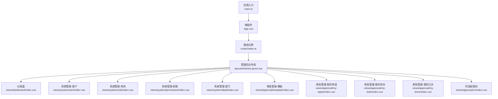
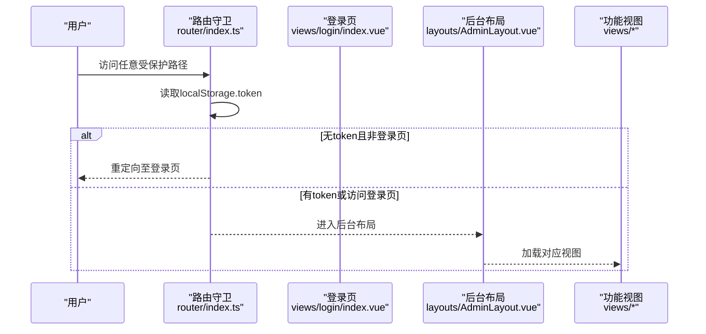
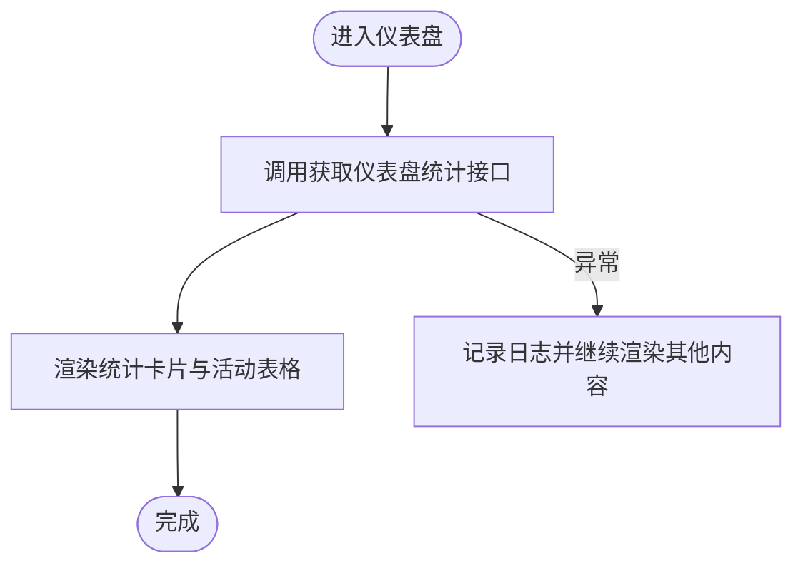
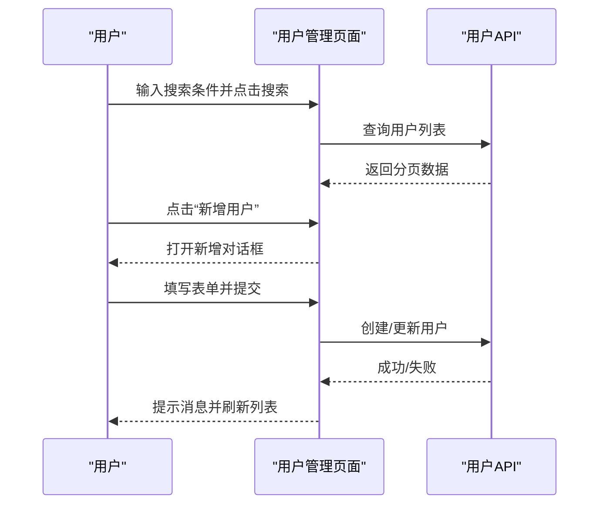
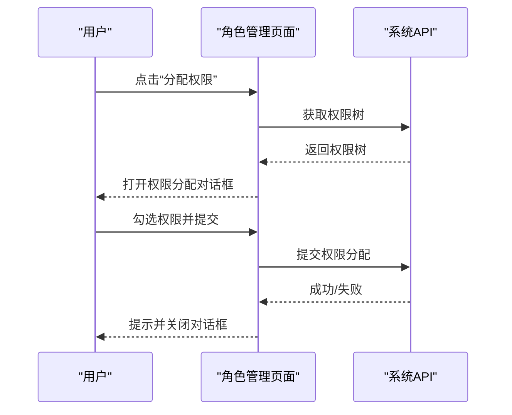
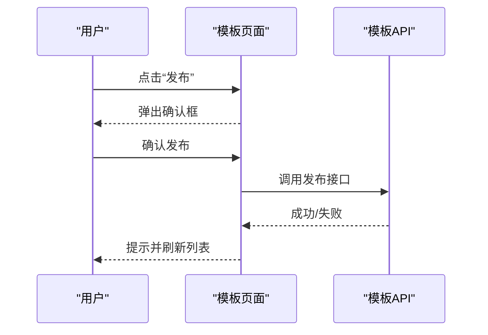
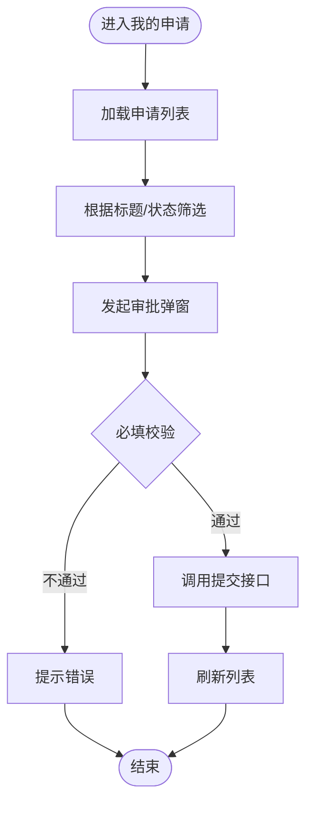
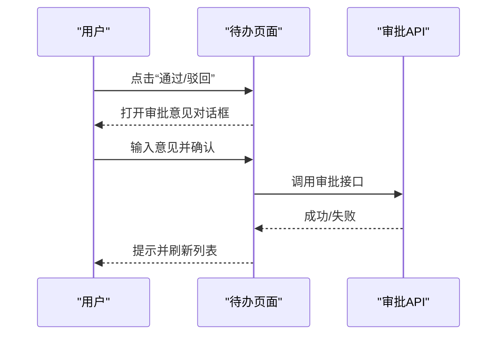
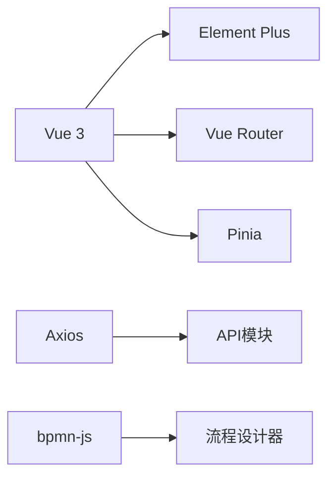

# 前端页面设计

<cite>
**本文引用的文件**
- [package.json](file://oa-ui/package.json)
- [main.ts](file://oa-ui/src/main.ts)
- [App.vue](file://oa-ui/src/App.vue)
- [index.ts](file://oa-ui/src/router/index.ts)
- [AdminLayout.vue](file://oa-ui/src/layouts/AdminLayout.vue)
- [index.vue](file://oa-ui/src/views/dashboard/index.vue)
- [index.vue](file://oa-ui/src/views/system/user/index.vue)
- [index.vue](file://oa-ui/src/views/system/role/index.vue)
- [index.vue](file://oa-ui/src/views/system/permission/index.vue)
- [index.vue](file://oa-ui/src/views/system/dept/index.vue)
- [index.vue](file://oa-ui/src/views/approval/template/index.vue)
- [index.vue](file://oa-ui/src/views/approval/my-apply/index.vue)
- [index.vue](file://oa-ui/src/views/approval/my-todo/index.vue)
- [index.vue](file://oa-ui/src/views/approval/my-done/index.vue)
- [index.vue](file://oa-ui/src/views/approval/cc/index.vue)
</cite>

## 目录
1. [引言](#引言)
2. [项目结构](#项目结构)
3. [核心组件](#核心组件)
4. [架构总览](#架构总览)
5. [详细组件分析](#详细组件分析)
6. [依赖分析](#依赖分析)
7. [性能考虑](#性能考虑)
8. [故障排查指南](#故障排查指南)
9. [结论](#结论)
10. [附录](#附录)

## 引言
本文件面向UI设计师与前端开发者，系统化梳理OA审批管理系统的前端页面设计与实现，覆盖管理后台的整体视觉风格与用户体验原则、各功能页面的设计理念与交互模式、表单与表格样式规范、按钮与导航组件使用、响应式与移动端适配策略、页面组件组合与复用机制、页面路由与权限控制、以及前端状态管理与数据绑定最佳实践。旨在提供一套可落地的设计规范与开发指南。

## 项目结构
- 技术栈：Vue 3 + TypeScript + Element Plus + Pinia + Vue Router + Vite
- 架构分层：视图层（views）、布局层（layouts）、路由层（router）、状态层（stores）、API封装（api）、类型定义（types）
- 路由采用history模式，支持嵌套路由与懒加载；全局前置守卫基于本地存储token进行简单权限拦截
- 布局采用Element Plus容器组件实现侧边栏、顶部导航与主内容区的三段式结构

图表来源
- [main.ts:1-14](file://oa-ui/src/main.ts#L1-L14)
- [App.vue:1-4](file://oa-ui/src/App.vue#L1-L4)
- [index.ts:1-134](file://oa-ui/src/router/index.ts#L1-L134)
- [AdminLayout.vue:1-130](file://oa-ui/src/layouts/AdminLayout.vue#L1-L130)

章节来源
- [package.json:1-38](file://oa-ui/package.json#L1-L38)
- [main.ts:1-14](file://oa-ui/src/main.ts#L1-L14)
- [App.vue:1-4](file://oa-ui/src/App.vue#L1-L4)
- [index.ts:1-134](file://oa-ui/src/router/index.ts#L1-L134)
- [AdminLayout.vue:1-130](file://oa-ui/src/layouts/AdminLayout.vue#L1-L130)

## 核心组件
- 应用入口与插件注册：创建Vue实例，挂载Pinia、Vue Router、Element Plus（中文语言包），并挂载到DOM
- 根组件：使用router-view承载路由视图
- 管理后台布局：侧边栏折叠、顶部导航、下拉菜单、面包屑/标题由路由meta提供
- 路由系统：定义登录页与后台主路由，后台路由嵌套AdminLayout，子路由按模块划分

章节来源
- [main.ts:1-14](file://oa-ui/src/main.ts#L1-L14)
- [App.vue:1-4](file://oa-ui/src/App.vue#L1-L4)
- [index.ts:1-134](file://oa-ui/src/router/index.ts#L1-L134)
- [AdminLayout.vue:1-130](file://oa-ui/src/layouts/AdminLayout.vue#L1-L130)

## 架构总览
- 视图层：按功能域拆分页面，统一采用卡片容器（el-card）包裹工具栏、表格、分页与对话框
- 数据流：页面通过API模块发起请求，使用Element Plus的消息与确认框处理交互反馈
- 状态管理：使用Pinia进行轻量状态管理（如用户信息store），页面内部使用ref/reactive维护局部状态
- 权限控制：路由守卫基于localStorage中的token进行访问拦截；业务层面的按钮显隐由后端返回的数据决定

图表来源
- [index.ts:124-131](file://oa-ui/src/router/index.ts#L124-L131)

章节来源
- [index.ts:124-131](file://oa-ui/src/router/index.ts#L124-L131)

## 详细组件分析

### 仪表盘页面（Dashboard）
- 设计理念：以统计卡片与活动列表为核心，快速呈现待办、已办、模板数量与抄送未读等关键指标；最近审批动态采用表格展示，结合标签区分任务结果
- 交互模式：页面挂载时异步获取统计数据，异常时静默处理；卡片数值采用强调色突出显示
- 表格样式：使用条纹表格增强可读性；标签根据结果枚举映射不同语义颜色
- 组件组合：el-row/col栅格布局卡片，el-card容器，el-table表格，el-tag标签

图表来源
- [index.vue:54-76](file://oa-ui/src/views/dashboard/index.vue#L54-L76)

章节来源
- [index.vue:1-86](file://oa-ui/src/views/dashboard/index.vue#L1-L86)

### 用户管理页面（System/User）
- 设计理念：提供用户列表查询、分页、新增/编辑/删除与状态切换；表单字段覆盖基础信息与状态
- 交互模式：搜索条件清空触发重新加载；编辑时禁用用户名输入；提交前对密码做条件处理（留空则剔除字段）
- 表单与对话框：统一使用el-dialog承载表单，底部操作区包含取消与确定按钮
- 组件组合：el-input、el-select、el-tag、el-button、el-table、el-pagination、el-popconfirm

图表来源
- [index.vue:103-196](file://oa-ui/src/views/system/user/index.vue#L103-L196)

章节来源
- [index.vue:1-203](file://oa-ui/src/views/system/user/index.vue#L1-L203)

### 角色管理页面（System/Role）
- 设计理念：角色列表与状态管理，支持分配权限树；权限分配采用多选树形控件
- 交互模式：打开权限分配对话框时加载权限树并预勾选当前角色已拥有权限；提交后刷新列表
- 组件组合：el-tree、el-dialog、el-form、el-select、el-tag

图表来源
- [index.vue:102-207](file://oa-ui/src/views/system/role/index.vue#L102-L207)

章节来源
- [index.vue:1-213](file://oa-ui/src/views/system/role/index.vue#L1-L213)

### 权限管理页面（System/Permission）
- 设计理念：权限树形展示，支持菜单、按钮、API三种类型；父子级关系清晰，支持新增子项
- 交互模式：根据类型控制“新增子项”按钮显隐；编辑时填充父级ID便于理解层级
- 组件组合：el-table树形展示、el-tag类型标签、el-form表单

章节来源
- [index.vue:1-203](file://oa-ui/src/views/system/permission/index.vue#L1-L203)

### 部门管理页面（System/Dept）
- 设计理念：部门树形结构展示，负责人下拉选择支持过滤；支持新增子部门
- 交互模式：加载用户列表用于负责人选择；负责人显示采用昵称+用户名格式
- 组件组合：el-table树形、el-select用户选项、el-form表单

章节来源
- [index.vue:1-202](file://oa-ui/src/views/system/dept/index.vue#L1-L202)

### 审批模板页面（Approval/Template）
- 设计理念：模板列表支持发布、新建版本、编辑与删除；发布前二次确认；表单配置采用JSON文本域
- 交互模式：根据模板状态动态调整操作按钮；发布后禁止修改；新建版本跳转设计器
- 组件组合：el-table、el-dialog、el-form、el-button、el-tag

图表来源
- [index.vue:96-191](file://oa-ui/src/views/approval/template/index.vue#L96-L191)

章节来源
- [index.vue:1-198](file://oa-ui/src/views/approval/template/index.vue#L1-L198)

### 我的申请页面（Approval/MyApply）
- 设计理念：展示个人发起的审批实例，支持筛选状态与标题；支持发起新申请并选择模板
- 交互模式：状态标签根据枚举映射不同颜色；草稿状态下允许撤回；提交前校验必填项
- 组件组合：el-table、el-dialog、el-form、el-select模板选项、el-pagination

图表来源
- [index.vue:67-170](file://oa-ui/src/views/approval/my-apply/index.vue#L67-L170)

章节来源
- [index.vue:1-178](file://oa-ui/src/views/approval/my-apply/index.vue#L1-L178)

### 我的待办页面（Approval/MyTodo）
- 设计理念：展示当前用户需处理的任务，支持通过/驳回与转办；提供审批意见输入
- 交互模式：审批与转办均采用二次确认对话框；完成后刷新列表
- 组件组合：el-table、el-dialog、el-form、el-input、el-button

图表来源
- [index.vue:66-152](file://oa-ui/src/views/approval/my-todo/index.vue#L66-L152)

章节来源
- [index.vue:1-160](file://oa-ui/src/views/approval/my-todo/index.vue#L1-L160)

### 我的已办页面（Approval/MyDone）
- 设计理念：展示历史处理过的任务，结果以标签形式直观呈现
- 交互模式：结果标签根据枚举映射不同语义颜色；支持查看详情跳转
- 组件组合：el-table、el-tag、el-button

章节来源
- [index.vue:1-100](file://oa-ui/src/views/approval/my-done/index.vue#L1-L100)

### 抄送给我的页面（Approval/Cc）
- 设计理念：展示抄送列表，支持标记已读；未读项以标签提示
- 交互模式：点击“标记已读”后刷新列表
- 组件组合：el-table、el-tag、el-button

章节来源
- [index.vue:1-61](file://oa-ui/src/views/approval/cc/index.vue#L1-L61)

## 依赖分析
- 外部依赖：Vue 3、Element Plus、Pinia、Vue Router、Axios、bpmn-js
- 开发依赖：Vite、TypeScript、ESLint、Vitest、Sass、unplugin-auto-import、unplugin-vue-components
- 依赖关系：main.ts集中注册插件；router/index.ts集中定义路由；AdminLayout.vue作为后台统一布局；各页面按需引入Element Plus组件与API模块

图表来源
- [package.json:15-36](file://oa-ui/package.json#L15-L36)

章节来源
- [package.json:1-38](file://oa-ui/package.json#L1-L38)

## 性能考虑
- 路由懒加载：所有视图组件采用动态导入，减少首屏体积
- 列表分页：表格配合分页组件，避免一次性加载大量数据
- 加载状态：表格普遍使用v-loading指示器，提升感知性能
- 本地存储：路由守卫基于localStorage进行轻量鉴权，避免额外网络请求
- 图标与样式：统一使用Element Plus图标库与主题变量，减少自定义样式成本

## 故障排查指南
- 登录态失效：路由守卫会拦截未登录访问，自动跳转登录页；检查localStorage中token是否存在
- 请求异常：页面普遍通过全局拦截器处理错误，建议在控制台查看网络请求与响应；必要时增加本地提示
- 表单提交失败：检查必填字段与数据格式（如JSON表单），确保接口参数正确
- 权限不足：角色/权限分配后需刷新页面生效；确认后端返回的权限树与勾选状态一致

章节来源
- [index.ts:124-131](file://oa-ui/src/router/index.ts#L124-L131)

## 结论
该前端页面设计以Element Plus为基础组件库，结合Vue 3的组合式API与Pinia状态管理，实现了从仪表盘到审批全链路的管理后台界面。页面遵循统一的卡片容器、表单与表格规范，路由与权限控制清晰，具备良好的可扩展性与可维护性。建议后续在以下方面持续优化：完善表单校验与错误提示、增强可访问性、补充单元测试与覆盖率、探索主题定制与暗色模式支持。

## 附录
- 设计规范要点
  - 色彩体系：使用Element Plus默认主题色，重要操作采用品牌色（如蓝色），状态标签使用语义化颜色
  - 字体与字号：正文使用常规字号，标题层级分明；表格列宽与固定列设置保证可读性
  - 间距与留白：卡片内外间距统一，工具栏与表格之间保持合理间距
  - 响应式：基于Element Plus栅格系统与容器组件，移动端优先适配；侧边栏支持折叠
  - 可用性：按钮语义明确，对话框尺寸适中，确认类操作提供二次确认
- 组件复用机制
  - 页面级通用结构：卡片容器、工具栏、表格、分页、对话框
  - 表单复用：统一的表单项布局与标签宽度，减少重复代码
  - 状态管理：Pinia store集中管理用户信息等全局状态，页面内部维护局部状态
- 路由与权限
  - 路由：后台主路由嵌套AdminLayout，子路由按模块划分；meta提供标题
  - 权限：路由守卫基于token；业务权限由后端返回数据控制按钮显隐