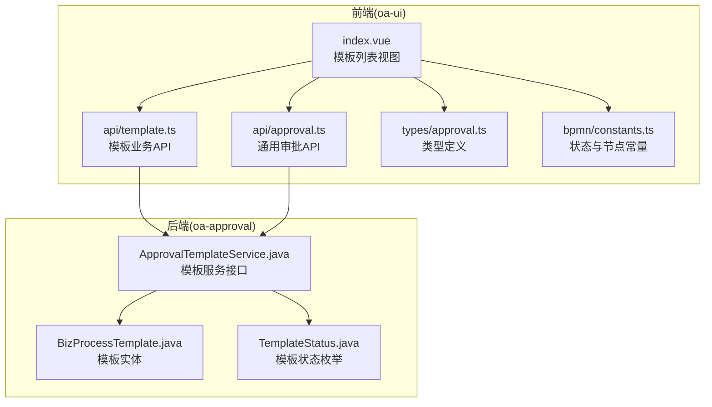
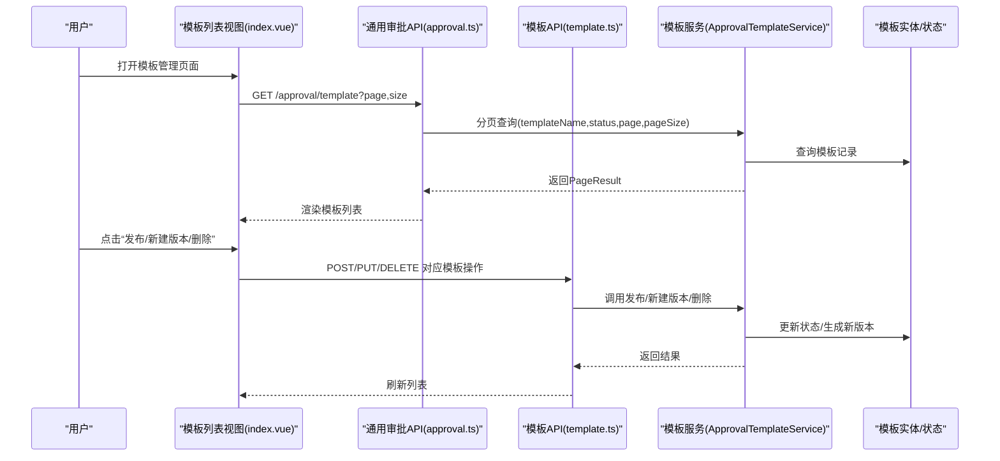
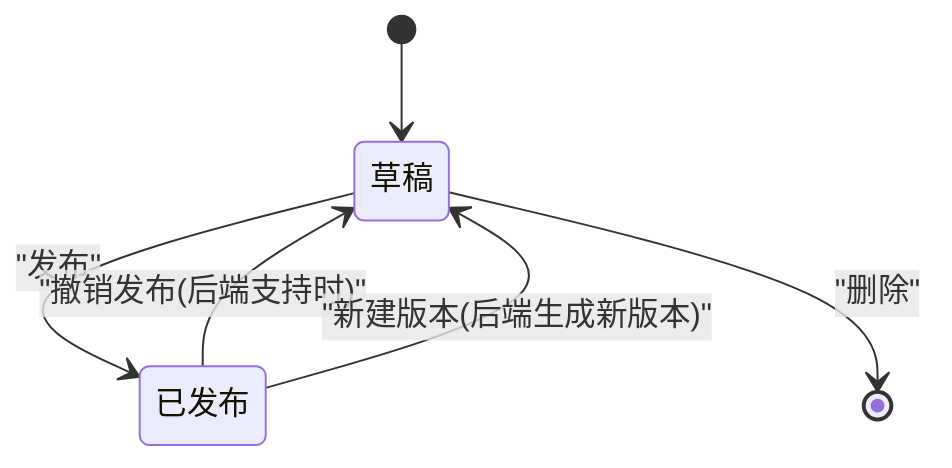
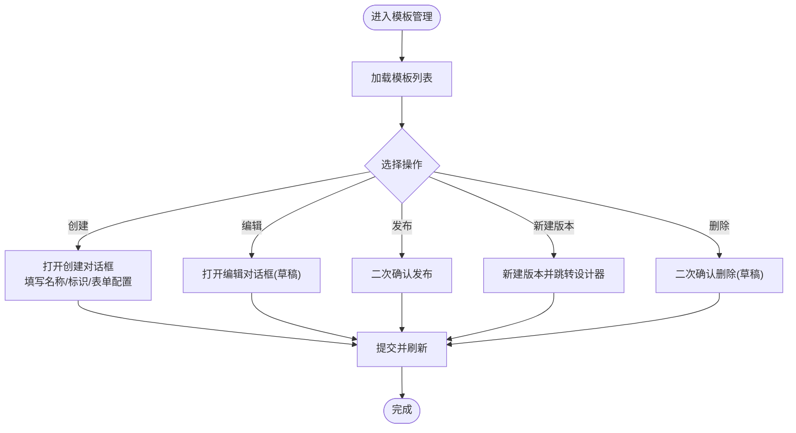
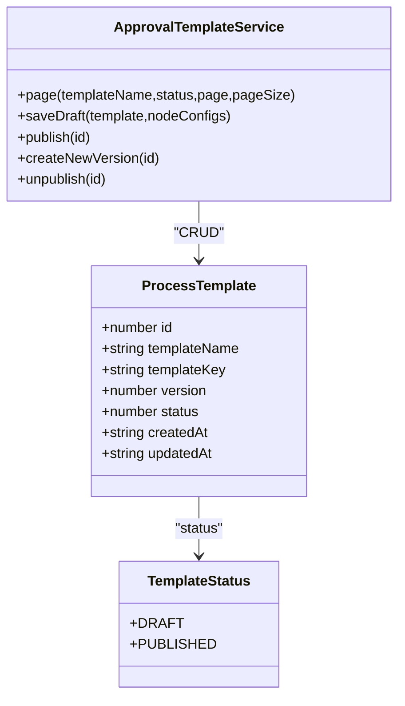

# 审批模板管理

<cite>
**本文档引用的文件**
- [oa-ui/src/views/approval/template/index.vue](file://oa-ui/src/views/approval/template/index.vue)
- [oa-ui/src/api/template.ts](file://oa-ui/src/api/template.ts)
- [oa-ui/src/api/approval.ts](file://oa-ui/src/api/approval.ts)
- [oa-ui/src/types/approval.ts](file://oa-ui/src/types/approval.ts)
- [oa-ui/src/bpmn/constants.ts](file://oa-ui/src/bpmn/constants.ts)
- [oa-approval/src/main/java/com/oa/admin/approval/entity/BizProcessTemplate.java](file://oa-approval/src/main/java/com/oa/admin/approval/entity/BizProcessTemplate.java)
- [oa-approval/src/main/java/com/oa/admin/approval/enums/TemplateStatus.java](file://oa-approval/src/main/java/com/oa/admin/approval/enums/TemplateStatus.java)
- [oa-approval/src/main/java/com/oa/admin/approval/service/ApprovalTemplateService.java](file://oa-approval/src/main/java/com/oa/admin/approval/service/ApprovalTemplateService.java)
</cite>

## 目录
1. [简介](#简介)
2. [项目结构](#项目结构)
3. [核心组件](#核心组件)
4. [架构总览](#架构总览)
5. [详细组件分析](#详细组件分析)
6. [依赖关系分析](#依赖关系分析)
7. [性能考虑](#性能考虑)
8. [故障排除指南](#故障排除指南)
9. [结论](#结论)
10. [附录](#附录)

## 简介
本文件面向OA审批管理系统的“审批模板管理”页面，系统性梳理模板列表展示、状态管理、操作能力（创建、编辑、发布、新建版本、删除）、表单配置JSON规范与校验、分页与搜索过滤、批量操作建议以及状态标签样式与交互体验优化策略。目标是帮助前端与后端开发者快速理解并维护该模块。

## 项目结构
审批模板管理涉及前后端协作：前端负责UI渲染、交互与调用API；后端提供模板数据模型、状态枚举与服务接口。

**图表来源**
- [oa-ui/src/views/approval/template/index.vue:1-198](file://oa-ui/src/views/approval/template/index.vue#L1-L198)
- [oa-ui/src/api/template.ts:1-51](file://oa-ui/src/api/template.ts#L1-L51)
- [oa-ui/src/api/approval.ts:1-71](file://oa-ui/src/api/approval.ts#L1-L71)
- [oa-ui/src/types/approval.ts:71-84](file://oa-ui/src/types/approval.ts#L71-L84)
- [oa-ui/src/bpmn/constants.ts:86-95](file://oa-ui/src/bpmn/constants.ts#L86-L95)
- [oa-approval/src/main/java/com/oa/admin/approval/entity/BizProcessTemplate.java:1-29](file://oa-approval/src/main/java/com/oa/admin/approval/entity/BizProcessTemplate.java#L1-L29)
- [oa-approval/src/main/java/com/oa/admin/approval/enums/TemplateStatus.java:1-26](file://oa-approval/src/main/java/com/oa/admin/approval/enums/TemplateStatus.java#L1-L26)
- [oa-approval/src/main/java/com/oa/admin/approval/service/ApprovalTemplateService.java:1-33](file://oa-approval/src/main/java/com/oa/admin/approval/service/ApprovalTemplateService.java#L1-L33)

**章节来源**
- [oa-ui/src/views/approval/template/index.vue:1-198](file://oa-ui/src/views/approval/template/index.vue#L1-L198)
- [oa-ui/src/api/template.ts:1-51](file://oa-ui/src/api/template.ts#L1-L51)
- [oa-ui/src/api/approval.ts:24-26](file://oa-ui/src/api/approval.ts#L24-L26)
- [oa-ui/src/types/approval.ts:71-84](file://oa-ui/src/types/approval.ts#L71-L84)
- [oa-ui/src/bpmn/constants.ts:86-95](file://oa-ui/src/bpmn/constants.ts#L86-L95)
- [oa-approval/src/main/java/com/oa/admin/approval/entity/BizProcessTemplate.java:1-29](file://oa-approval/src/main/java/com/oa/admin/approval/entity/BizProcessTemplate.java#L1-L29)
- [oa-approval/src/main/java/com/oa/admin/approval/enums/TemplateStatus.java:1-26](file://oa-approval/src/main/java/com/oa/admin/approval/enums/TemplateStatus.java#L1-L26)
- [oa-approval/src/main/java/com/oa/admin/approval/service/ApprovalTemplateService.java:1-33](file://oa-approval/src/main/java/com/oa/admin/approval/service/ApprovalTemplateService.java#L1-L33)

## 核心组件
- 模板列表视图：负责展示模板名称、模板标识、状态、版本、创建时间，并提供操作按钮（设计流程、编辑、发布、新建版本、删除）。
- 模板API层：封装模板的增删改查、发布、新建版本、XML与节点配置读写等HTTP接口。
- 通用审批API：提供模板分页查询接口，支持按模板名、状态筛选。
- 类型与常量：统一模板数据结构、状态码与标签映射、节点类型与分配人类型选项。
- 后端实体与服务：模板实体字段、状态枚举、模板分页查询、发布、新建版本等服务方法。

**章节来源**
- [oa-ui/src/views/approval/template/index.vue:8-60](file://oa-ui/src/views/approval/template/index.vue#L8-L60)
- [oa-ui/src/api/template.ts:32-38](file://oa-ui/src/api/template.ts#L32-L38)
- [oa-ui/src/api/approval.ts:24-26](file://oa-ui/src/api/approval.ts#L24-L26)
- [oa-ui/src/types/approval.ts:71-84](file://oa-ui/src/types/approval.ts#L71-L84)
- [oa-ui/src/bpmn/constants.ts:86-95](file://oa-ui/src/bpmn/constants.ts#L86-L95)
- [oa-approval/src/main/java/com/oa/admin/approval/entity/BizProcessTemplate.java:16-28](file://oa-approval/src/main/java/com/oa/admin/approval/entity/BizProcessTemplate.java#L16-L28)
- [oa-approval/src/main/java/com/oa/admin/approval/enums/TemplateStatus.java:11-13](file://oa-approval/src/main/java/com/oa/admin/approval/enums/TemplateStatus.java#L11-L13)
- [oa-approval/src/main/java/com/oa/admin/approval/service/ApprovalTemplateService.java:15-21](file://oa-approval/src/main/java/com/oa/admin/approval/service/ApprovalTemplateService.java#L15-L21)

## 架构总览
前端通过API层调用后端服务，后端以模板实体与状态枚举为核心进行数据持久化与状态流转控制。

**图表来源**
- [oa-ui/src/views/approval/template/index.vue:114-191](file://oa-ui/src/views/approval/template/index.vue#L114-L191)
- [oa-ui/src/api/approval.ts:24-26](file://oa-ui/src/api/approval.ts#L24-L26)
- [oa-ui/src/api/template.ts:32-38](file://oa-ui/src/api/template.ts#L32-L38)
- [oa-approval/src/main/java/com/oa/admin/approval/service/ApprovalTemplateService.java:15-21](file://oa-approval/src/main/java/com/oa/admin/approval/service/ApprovalTemplateService.java#L15-L21)
- [oa-approval/src/main/java/com/oa/admin/approval/entity/BizProcessTemplate.java:16-28](file://oa-approval/src/main/java/com/oa/admin/approval/entity/BizProcessTemplate.java#L16-L28)

## 详细组件分析

### 模板列表展示
- 字段呈现
  - 模板名称：用于识别模板用途
  - 模板标识：唯一键，创建后不可更改
  - 状态：草稿/已发布，使用标签展示
  - 版本：整数版本号
  - 创建时间：模板创建时间
- 状态标签样式
  - 已发布：使用成功色；草稿：使用信息色
  - 标签文本通过状态码映射为中文
- 操作列
  - 设计流程/查看流程：跳转到流程设计器或只读流程图
  - 编辑：仅草稿可编辑
  - 发布：草稿可发布
  - 新建版本：已发布可创建新版本
  - 删除：草稿可删除（已发布不可直接删除）

**章节来源**
- [oa-ui/src/views/approval/template/index.vue:8-60](file://oa-ui/src/views/approval/template/index.vue#L8-L60)
- [oa-ui/src/bpmn/constants.ts:86-95](file://oa-ui/src/bpmn/constants.ts#L86-L95)

### 模板状态管理机制
- 状态枚举
  - 草稿：1
  - 已发布：2
- 状态转换
  - 草稿 → 已发布：发布操作
  - 已发布 → 新版本：新建版本操作
  - 草稿 ↔ 编辑：编辑模板
  - 草稿 → 删除：删除模板
- 前端状态映射
  - 使用常量与标签映射表驱动UI展示与交互

**图表来源**
- [oa-ui/src/bpmn/constants.ts:86-95](file://oa-ui/src/bpmn/constants.ts#L86-L95)
- [oa-approval/src/main/java/com/oa/admin/approval/enums/TemplateStatus.java:11-13](file://oa-approval/src/main/java/com/oa/admin/approval/enums/TemplateStatus.java#L11-L13)
- [oa-ui/src/api/template.ts:32-38](file://oa-ui/src/api/template.ts#L32-L38)

**章节来源**
- [oa-ui/src/bpmn/constants.ts:86-95](file://oa-ui/src/bpmn/constants.ts#L86-L95)
- [oa-approval/src/main/java/com/oa/admin/approval/enums/TemplateStatus.java:11-13](file://oa-approval/src/main/java/com/oa/admin/approval/enums/TemplateStatus.java#L11-L13)

### 模板操作功能实现
- 创建模板
  - 触发“创建模板”按钮，弹出对话框
  - 输入模板名称、模板标识、表单配置(JSON)
  - 提交后刷新列表
- 编辑模板
  - 仅草稿可编辑
  - 填写后提交更新
- 发布模板
  - 草稿可发布
  - 发布前二次确认
  - 发布后流程不可修改
- 新建版本
  - 已发布可新建版本
  - 成功后跳转到新版本设计器
- 删除模板
  - 仅草稿可删除
  - 删除需二次确认

**图表来源**
- [oa-ui/src/views/approval/template/index.vue:114-191](file://oa-ui/src/views/approval/template/index.vue#L114-L191)
- [oa-ui/src/api/template.ts:32-38](file://oa-ui/src/api/template.ts#L32-L38)

**章节来源**
- [oa-ui/src/views/approval/template/index.vue:125-189](file://oa-ui/src/views/approval/template/index.vue#L125-L189)
- [oa-ui/src/api/template.ts:32-38](file://oa-ui/src/api/template.ts#L32-L38)

### 模板表单配置JSON格式与验证规则
- JSON结构
  - 字段：数组，每个元素包含字段名、类型、标签、是否必填等
  - 示例占位符提示了字段结构与必填性
- 验证规则
  - 前端：模板标识必填且创建后不可更改；模板名称必填；表单配置为合法JSON字符串
  - 后端：服务层保存草稿时可对表单配置进行解析与校验（具体实现由服务层负责）
- 建议
  - 前端在提交前进行基础JSON校验
  - 后端对表单配置进行严格解析与默认值填充，确保运行期可用

**章节来源**
- [oa-ui/src/views/approval/template/index.vue:76-92](file://oa-ui/src/views/approval/template/index.vue#L76-L92)
- [oa-ui/src/api/template.ts:44-46](file://oa-ui/src/api/template.ts#L44-L46)

### 分页加载、搜索过滤与批量操作
- 分页加载
  - 使用Element Plus分页组件绑定当前页、页大小与总数
  - 切换页码或页大小时重新请求模板列表
- 搜索过滤
  - 通用审批API支持按模板名、状态筛选
  - 建议在列表顶部增加搜索表单，联动分页参数
- 批量操作
  - 当前页面未实现批量勾选与批量操作
  - 建议新增复选框列，支持批量删除、批量发布（仅草稿）等

**章节来源**
- [oa-ui/src/views/approval/template/index.vue:62-73](file://oa-ui/src/views/approval/template/index.vue#L62-L73)
- [oa-ui/src/api/approval.ts:24-26](file://oa-ui/src/api/approval.ts#L24-L26)

### 状态标签样式与交互体验优化
- 标签样式
  - 已发布：成功色；草稿：信息色
  - 文案映射：草稿/已发布
- 交互优化
  - 按钮显隐：根据状态动态显示/隐藏编辑、发布、删除按钮
  - 弹窗确认：发布与删除采用二次确认
  - 成功/失败消息反馈
  - 加载态：表格与弹窗提交时显示加载

**章节来源**
- [oa-ui/src/views/approval/template/index.vue:11-17](file://oa-ui/src/views/approval/template/index.vue#L11-L17)
- [oa-ui/src/bpmn/constants.ts:91-94](file://oa-ui/src/bpmn/constants.ts#L91-L94)

## 依赖关系分析
- 前端依赖
  - 视图依赖API层与类型定义
  - API层依赖请求工具与后端接口约定
- 后端依赖
  - 实体与枚举定义数据结构与状态
  - 服务接口定义模板生命周期操作
- 数据流
  - 列表数据来自后端分页查询
  - 模板状态变更通过服务层持久化

**图表来源**
- [oa-ui/src/types/approval.ts:71-84](file://oa-ui/src/types/approval.ts#L71-L84)
- [oa-approval/src/main/java/com/oa/admin/approval/enums/TemplateStatus.java:11-13](file://oa-approval/src/main/java/com/oa/admin/approval/enums/TemplateStatus.java#L11-L13)
- [oa-approval/src/main/java/com/oa/admin/approval/service/ApprovalTemplateService.java:15-21](file://oa-approval/src/main/java/com/oa/admin/approval/service/ApprovalTemplateService.java#L15-L21)
- [oa-approval/src/main/java/com/oa/admin/approval/entity/BizProcessTemplate.java:16-28](file://oa-approval/src/main/java/com/oa/admin/approval/entity/BizProcessTemplate.java#L16-L28)

**章节来源**
- [oa-ui/src/types/approval.ts:71-84](file://oa-ui/src/types/approval.ts#L71-L84)
- [oa-approval/src/main/java/com/oa/admin/approval/enums/TemplateStatus.java:11-13](file://oa-approval/src/main/java/com/oa/admin/approval/enums/TemplateStatus.java#L11-L13)
- [oa-approval/src/main/java/com/oa/admin/approval/service/ApprovalTemplateService.java:1-33](file://oa-approval/src/main/java/com/oa/admin/approval/service/ApprovalTemplateService.java#L1-L33)
- [oa-approval/src/main/java/com/oa/admin/approval/entity/BizProcessTemplate.java:1-29](file://oa-approval/src/main/java/com/oa/admin/approval/entity/BizProcessTemplate.java#L1-L29)

## 性能考虑
- 列表渲染
  - 使用虚拟滚动（如需求增长）减少DOM数量
  - 合理设置列宽与最小宽度，避免重绘
- 请求优化
  - 分页参数与筛选条件合并请求，避免重复请求
  - 成功/失败回调中及时关闭加载态
- 状态管理
  - 在前端缓存常用状态映射，减少重复计算
  - 对频繁点击的操作（如发布、删除）添加防抖

## 故障排除指南
- 发布失败
  - 确认模板处于草稿状态
  - 检查流程XML是否完整
  - 查看后端日志定位异常
- 新建版本失败
  - 确认模板已发布
  - 检查后端版本生成逻辑
- 删除失败
  - 确认模板为草稿状态
  - 检查是否存在关联实例或流程部署
- 表单配置无效
  - 前端先进行JSON校验
  - 后端解析失败时返回明确错误信息

**章节来源**
- [oa-ui/src/views/approval/template/index.vue:153-189](file://oa-ui/src/views/approval/template/index.vue#L153-L189)
- [oa-ui/src/api/template.ts:32-38](file://oa-ui/src/api/template.ts#L32-L38)

## 结论
审批模板管理页面以简洁直观的方式展示了模板的核心信息，并围绕草稿/已发布两种状态提供了完整的生命周期操作。通过前后端清晰的接口契约与类型定义，系统实现了稳定的模板管理能力。后续可在搜索过滤、批量操作与表单配置校验方面进一步增强用户体验与数据质量。

## 附录
- 关键API一览
  - 获取模板列表：GET /approval/template
  - 创建模板：POST /approval/template
  - 更新模板：PUT /approval/template/{id}
  - 删除模板：DELETE /approval/template/{id}
  - 发布模板：POST /approval/template/{id}/publish
  - 新建版本：POST /approval/template/{id}/new-version
  - 获取模板XML：GET /approval/template/{id}/xml
  - 保存模板XML：PUT /approval/template/{id}/xml
  - 获取节点配置：GET /approval/template/{id}/node-config
  - 保存节点配置：PUT /approval/template/{id}/node-config

**章节来源**
- [oa-ui/src/api/approval.ts:24-30](file://oa-ui/src/api/approval.ts#L24-L30)
- [oa-ui/src/api/template.ts:16-30](file://oa-ui/src/api/template.ts#L16-L30)