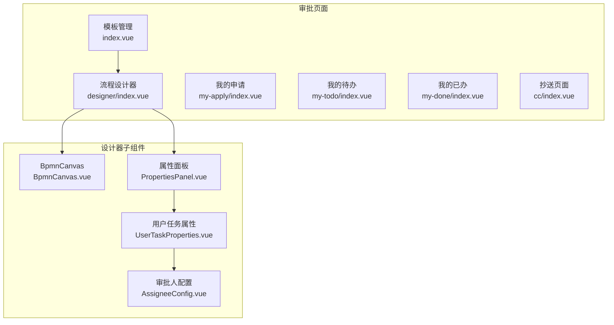
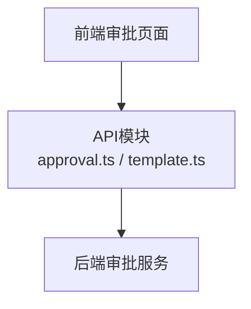
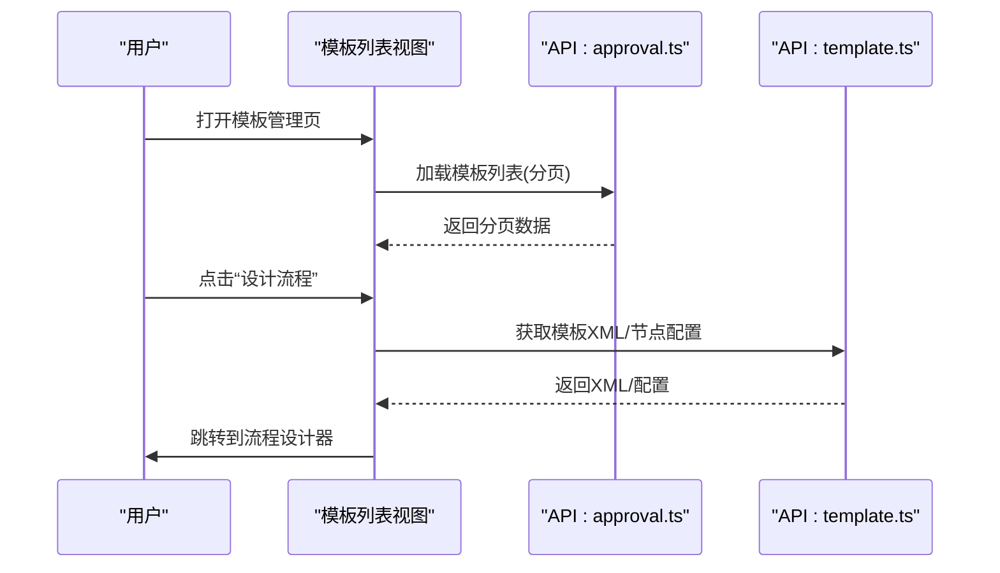
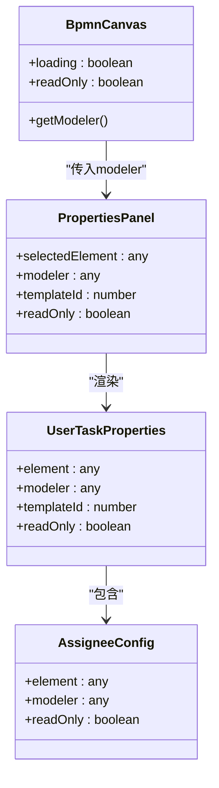
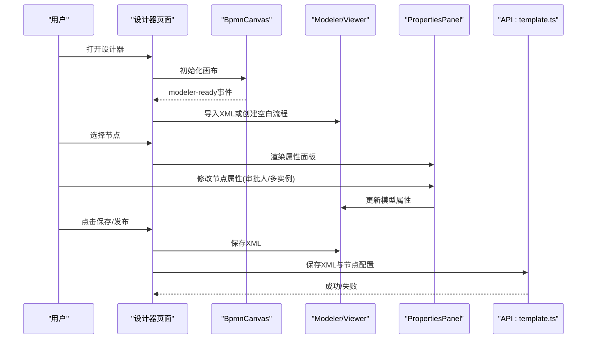
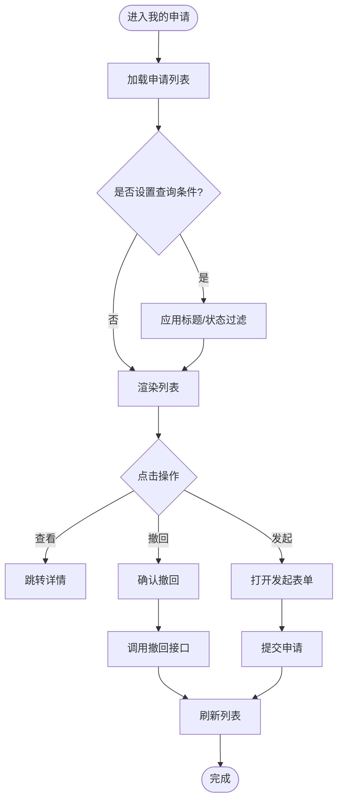
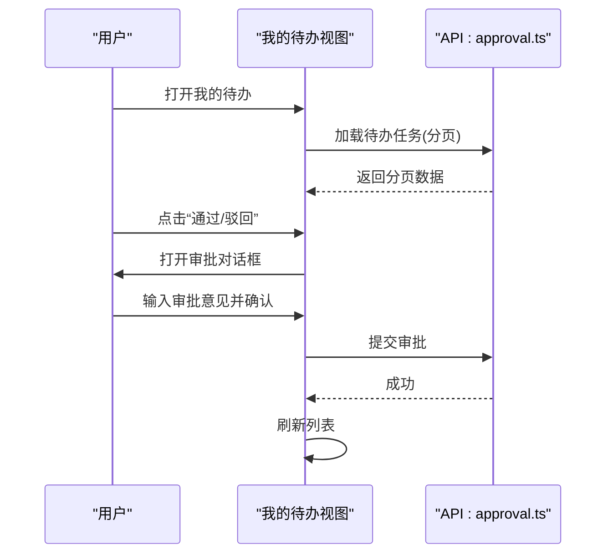
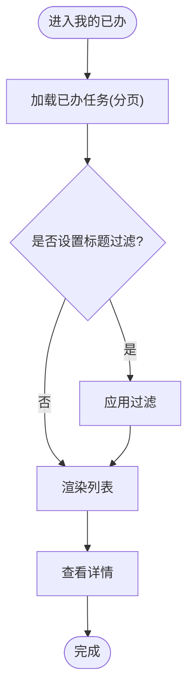
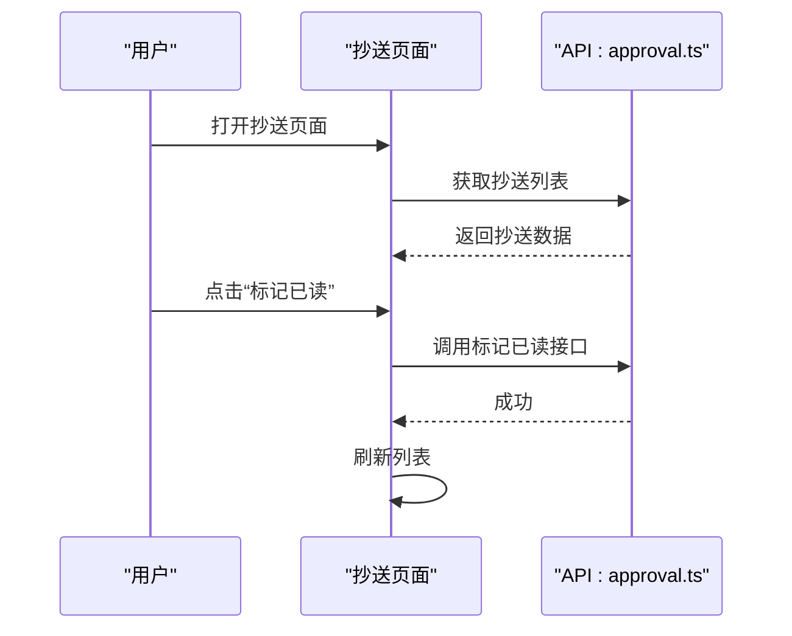
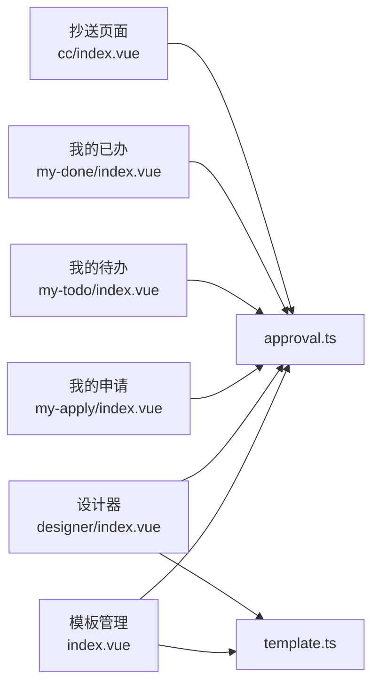

# 审批流程页面

<cite>
**本文档引用的文件**
- [README.md](file://README.md)
- [oa-ui/src/views/approval/template/index.vue](file://oa-ui/src/views/approval/template/index.vue)
- [oa-ui/src/views/approval/template/designer/index.vue](file://oa-ui/src/views/approval/template/designer/index.vue)
- [oa-ui/src/views/approval/template/designer/components/BpmnCanvas.vue](file://oa-ui/src/views/approval/template/designer/components/BpmnCanvas.vue)
- [oa-ui/src/views/approval/template/designer/components/PropertiesPanel.vue](file://oa-ui/src/views/approval/template/designer/components/PropertiesPanel.vue)
- [oa-ui/src/views/approval/template/designer/components/panels/UserTaskProperties.vue](file://oa-ui/src/views/approval/template/designer/components/panels/UserTaskProperties.vue)
- [oa-ui/src/views/approval/template/designer/components/panels/AssigneeConfig.vue](file://oa-ui/src/views/approval/template/designer/components/panels/AssigneeConfig.vue)
- [oa-ui/src/views/approval/my-apply/index.vue](file://oa-ui/src/views/approval/my-apply/index.vue)
- [oa-ui/src/views/approval/my-todo/index.vue](file://oa-ui/src/views/approval/my-todo/index.vue)
- [oa-ui/src/views/approval/my-done/index.vue](file://oa-ui/src/views/approval/my-done/index.vue)
- [oa-ui/src/views/approval/cc/index.vue](file://oa-ui/src/views/approval/cc/index.vue)
- [oa-ui/src/api/approval.ts](file://oa-ui/src/api/approval.ts)
- [oa-ui/src/api/template.ts](file://oa-ui/src/api/template.ts)
</cite>

## 目录
1. [简介](#简介)
2. [项目结构](#项目结构)
3. [核心组件](#核心组件)
4. [架构总览](#架构总览)
5. [详细组件分析](#详细组件分析)
6. [依赖关系分析](#依赖关系分析)
7. [性能考虑](#性能考虑)
8. [故障排除指南](#故障排除指南)
9. [结论](#结论)

## 简介
本文件面向OA审批管理系统的“审批流程页面”，围绕以下主题展开：审批模板管理页面的设计与模板列表展示；流程设计器页面的BPMN可视化设计与节点配置；我的申请/我的待办/我的已办的数据展示与交互；抄送页面的抄送记录管理与通知机制；以及流程图可视化与节点属性配置的实现方案与审批状态流转的可视化设计与用户体验优化策略。

## 项目结构
审批流程页面位于前端模块的审批视图下，采用按功能分层的组织方式：
- 模板管理：模板列表、创建/编辑、发布/新建版本、删除
- 流程设计器：BPMN画布、工具栏、属性面板、节点配置面板
- 我的申请：申请列表、发起申请、撤回
- 我的待办：任务列表、审批通过/驳回、转办
- 我的已办：历史任务列表、查看详情
- 抄送页面：抄送列表、标记已读

图表来源
- [oa-ui/src/views/approval/template/index.vue:1-198](file://oa-ui/src/views/approval/template/index.vue#L1-L198)
- [oa-ui/src/views/approval/template/designer/index.vue:1-324](file://oa-ui/src/views/approval/template/designer/index.vue#L1-L324)
- [oa-ui/src/views/approval/template/designer/components/BpmnCanvas.vue:1-107](file://oa-ui/src/views/approval/template/designer/components/BpmnCanvas.vue#L1-L107)
- [oa-ui/src/views/approval/template/designer/components/PropertiesPanel.vue:1-80](file://oa-ui/src/views/approval/template/designer/components/PropertiesPanel.vue#L1-L80)
- [oa-ui/src/views/approval/template/designer/components/panels/UserTaskProperties.vue:1-50](file://oa-ui/src/views/approval/template/designer/components/panels/UserTaskProperties.vue#L1-L50)
- [oa-ui/src/views/approval/template/designer/components/panels/AssigneeConfig.vue:1-172](file://oa-ui/src/views/approval/template/designer/components/panels/AssigneeConfig.vue#L1-L172)

章节来源
- [README.md:94-108](file://README.md#L94-L108)

## 核心组件
- 模板管理页面：提供模板列表、分页、状态标签、操作按钮（设计流程、编辑、发布、新建版本、删除），并支持弹窗创建/编辑模板。
- 流程设计器：集成BPMN画布、工具栏、属性面板，支持自动保存、发布校验、缩放、XML预览、版本切换。
- 我的申请：筛选标题/状态、分页展示、查看详情、撤回。
- 我的待办：筛选标题、分页展示、审批通过/驳回对话框、转办对话框。
- 我的已办：筛选标题、分页展示、结果标签、查看详情。
- 抄送页面：抄送列表、标记已读、查看详情。

章节来源
- [oa-ui/src/views/approval/template/index.vue:1-198](file://oa-ui/src/views/approval/template/index.vue#L1-L198)
- [oa-ui/src/views/approval/template/designer/index.vue:1-324](file://oa-ui/src/views/approval/template/designer/index.vue#L1-L324)
- [oa-ui/src/views/approval/my-apply/index.vue:1-178](file://oa-ui/src/views/approval/my-apply/index.vue#L1-L178)
- [oa-ui/src/views/approval/my-todo/index.vue:1-160](file://oa-ui/src/views/approval/my-todo/index.vue#L1-L160)
- [oa-ui/src/views/approval/my-done/index.vue:1-100](file://oa-ui/src/views/approval/my-done/index.vue#L1-L100)
- [oa-ui/src/views/approval/cc/index.vue:1-61](file://oa-ui/src/views/approval/cc/index.vue#L1-L61)

## 架构总览
前端通过API模块调用后端REST接口，完成审批模板与流程实例的CRUD、状态流转、抄送管理等操作。设计器基于bpmn-js，使用Flowable扩展进行节点属性持久化。

图表来源
- [oa-ui/src/api/approval.ts:1-71](file://oa-ui/src/api/approval.ts#L1-L71)
- [oa-ui/src/api/template.ts:1-51](file://oa-ui/src/api/template.ts#L1-L51)

## 详细组件分析

### 模板管理页面（审批模板列表）
- 列表字段：模板名称、模板标识、状态（草稿/已发布）、版本、创建时间。
- 操作按钮：设计流程、编辑、发布、新建版本、删除。
- 分页与加载：支持分页参数传递与总数显示。
- 对话框：创建/编辑模板，包含模板名称、模板标识、表单配置（JSON）。
- 状态标签：根据模板状态映射显示不同标签样式。

图表来源
- [oa-ui/src/views/approval/template/index.vue:114-151](file://oa-ui/src/views/approval/template/index.vue#L114-L151)
- [oa-ui/src/api/approval.ts:24-26](file://oa-ui/src/api/approval.ts#L24-L26)
- [oa-ui/src/api/template.ts:16-30](file://oa-ui/src/api/template.ts#L16-L30)

章节来源
- [oa-ui/src/views/approval/template/index.vue:1-198](file://oa-ui/src/views/approval/template/index.vue#L1-L198)
- [oa-ui/src/api/approval.ts:24-26](file://oa-ui/src/api/approval.ts#L24-L26)
- [oa-ui/src/api/template.ts:16-30](file://oa-ui/src/api/template.ts#L16-L30)

### 流程设计器（BPMN可视化设计与节点配置）
- 画布组件：根据是否只读选择Viewer或Modeler，支持容器自适应与事件发射。
- 工具栏：保存、发布、撤销/重做、缩放、XML预览、新建版本、返回。
- 属性面板：根据选中元素类型动态渲染对应属性面板（开始/结束、用户任务、网关等）。
- 节点属性：用户任务节点支持审批人配置（固定用户、部门领导、向上级、角色、表达式）与多实例配置。
- 自动保存：定时触发保存，避免未保存更改丢失。
- 发布校验：发布前进行流程完整性校验，提示错误信息。

图表来源
- [oa-ui/src/views/approval/template/designer/components/BpmnCanvas.vue:1-107](file://oa-ui/src/views/approval/template/designer/components/BpmnCanvas.vue#L1-L107)
- [oa-ui/src/views/approval/template/designer/components/PropertiesPanel.vue:1-80](file://oa-ui/src/views/approval/template/designer/components/PropertiesPanel.vue#L1-L80)
- [oa-ui/src/views/approval/template/designer/components/panels/UserTaskProperties.vue:1-50](file://oa-ui/src/views/approval/template/designer/components/panels/UserTaskProperties.vue#L1-L50)
- [oa-ui/src/views/approval/template/designer/components/panels/AssigneeConfig.vue:1-172](file://oa-ui/src/views/approval/template/designer/components/panels/AssigneeConfig.vue#L1-L172)

图表来源
- [oa-ui/src/views/approval/template/designer/index.vue:93-142](file://oa-ui/src/views/approval/template/designer/index.vue#L93-L142)
- [oa-ui/src/views/approval/template/designer/components/BpmnCanvas.vue:39-65](file://oa-ui/src/views/approval/template/designer/components/BpmnCanvas.vue#L39-L65)
- [oa-ui/src/views/approval/template/designer/components/PropertiesPanel.vue:45-49](file://oa-ui/src/views/approval/template/designer/components/PropertiesPanel.vue#L45-L49)
- [oa-ui/src/api/template.ts:16-30](file://oa-ui/src/api/template.ts#L16-L30)

章节来源
- [oa-ui/src/views/approval/template/designer/index.vue:1-324](file://oa-ui/src/views/approval/template/designer/index.vue#L1-L324)
- [oa-ui/src/views/approval/template/designer/components/BpmnCanvas.vue:1-107](file://oa-ui/src/views/approval/template/designer/components/BpmnCanvas.vue#L1-L107)
- [oa-ui/src/views/approval/template/designer/components/PropertiesPanel.vue:1-80](file://oa-ui/src/views/approval/template/designer/components/PropertiesPanel.vue#L1-L80)
- [oa-ui/src/views/approval/template/designer/components/panels/UserTaskProperties.vue:1-50](file://oa-ui/src/views/approval/template/designer/components/panels/UserTaskProperties.vue#L1-L50)
- [oa-ui/src/views/approval/template/designer/components/panels/AssigneeConfig.vue:1-172](file://oa-ui/src/views/approval/template/designer/components/panels/AssigneeConfig.vue#L1-L172)
- [oa-ui/src/api/template.ts:1-51](file://oa-ui/src/api/template.ts#L1-L51)

### 我的申请页面（数据展示与操作交互）
- 查询条件：标题搜索、状态筛选（审批中/通过/驳回/已撤回）。
- 列表字段：申请标题、状态标签、提交时间、结束时间。
- 操作：查看详情、撤回（仅当状态为审批中）。
- 发起申请：弹窗选择模板、填写标题、表单数据（JSON），提交后刷新列表。

图表来源
- [oa-ui/src/views/approval/my-apply/index.vue:110-126](file://oa-ui/src/views/approval/my-apply/index.vue#L110-L126)
- [oa-ui/src/views/approval/my-apply/index.vue:137-151](file://oa-ui/src/views/approval/my-apply/index.vue#L137-L151)

章节来源
- [oa-ui/src/views/approval/my-apply/index.vue:1-178](file://oa-ui/src/views/approval/my-apply/index.vue#L1-L178)
- [oa-ui/src/api/approval.ts:4-6](file://oa-ui/src/api/approval.ts#L4-L6)
- [oa-ui/src/api/approval.ts:20-22](file://oa-ui/src/api/approval.ts#L20-L22)

### 我的待办页面（数据展示与操作交互）
- 查询条件：标题搜索。
- 列表字段：申请标题、审批节点、表单摘要、接收时间。
- 操作：查看详情、审批通过、审批驳回、转办。
- 审批操作：弹窗输入审批意见，提交后刷新列表。
- 转办：输入目标用户ID与原因，提交后刷新列表。

图表来源
- [oa-ui/src/views/approval/my-todo/index.vue:91-106](file://oa-ui/src/views/approval/my-todo/index.vue#L91-L106)
- [oa-ui/src/views/approval/my-todo/index.vue:119-128](file://oa-ui/src/views/approval/my-todo/index.vue#L119-L128)
- [oa-ui/src/api/approval.ts:8-10](file://oa-ui/src/api/approval.ts#L8-L10)
- [oa-ui/src/api/approval.ts:68-70](file://oa-ui/src/api/approval.ts#L68-L70)

章节来源
- [oa-ui/src/views/approval/my-todo/index.vue:1-160](file://oa-ui/src/views/approval/my-todo/index.vue#L1-L160)
- [oa-ui/src/api/approval.ts:60-62](file://oa-ui/src/api/approval.ts#L60-L62)
- [oa-ui/src/api/approval.ts:8-10](file://oa-ui/src/api/approval.ts#L8-L10)
- [oa-ui/src/api/approval.ts:68-70](file://oa-ui/src/api/approval.ts#L68-L70)

### 我的已办页面（数据展示与操作交互）
- 查询条件：标题搜索。
- 列表字段：申请标题、审批节点、结果标签（通过/驳回/转办/已取消）、审批意见、处理时间。
- 操作：查看详情。

图表来源
- [oa-ui/src/views/approval/my-done/index.vue:71-86](file://oa-ui/src/views/approval/my-done/index.vue#L71-L86)

章节来源
- [oa-ui/src/views/approval/my-done/index.vue:1-100](file://oa-ui/src/views/approval/my-done/index.vue#L1-L100)
- [oa-ui/src/api/approval.ts:64-66](file://oa-ui/src/api/approval.ts#L64-L66)

### 抄送页面（抄送记录管理与通知机制）
- 列表字段：申请标题、抄送原因、阅读时间（未读以标签显示）、抄送时间。
- 操作：查看详情、标记已读。
- 未读状态：通过空值判断，标记已读后刷新列表。

图表来源
- [oa-ui/src/views/approval/cc/index.vue:37-57](file://oa-ui/src/views/approval/cc/index.vue#L37-L57)
- [oa-ui/src/api/approval.ts:32-38](file://oa-ui/src/api/approval.ts#L32-L38)

章节来源
- [oa-ui/src/views/approval/cc/index.vue:1-61](file://oa-ui/src/views/approval/cc/index.vue#L1-L61)
- [oa-ui/src/api/approval.ts:32-38](file://oa-ui/src/api/approval.ts#L32-L38)

## 依赖关系分析
- 视图组件依赖API模块进行数据获取与提交。
- 设计器组件之间存在组合关系：画布承载模型器，属性面板根据选中元素类型动态渲染具体面板。
- 审批页面路由与页面职责清晰分离，便于维护与扩展。

图表来源
- [oa-ui/src/views/approval/template/index.vue:100-102](file://oa-ui/src/views/approval/template/index.vue#L100-L102)
- [oa-ui/src/views/approval/template/designer/index.vue:62-63](file://oa-ui/src/views/approval/template/designer/index.vue#L62-L63)
- [oa-ui/src/views/approval/my-apply/index.vue:71-73](file://oa-ui/src/views/approval/my-apply/index.vue#L71-L73)
- [oa-ui/src/views/approval/my-todo/index.vue:70-71](file://oa-ui/src/views/approval/my-todo/index.vue#L70-L71)
- [oa-ui/src/views/approval/my-done/index.vue:44-45](file://oa-ui/src/views/approval/my-done/index.vue#L44-L45)
- [oa-ui/src/views/approval/cc/index.vue:30-31](file://oa-ui/src/views/approval/cc/index.vue#L30-L31)

## 性能考虑
- 列表分页：通过分页参数控制每次请求的数据量，减少首屏压力。
- 自动保存：定时保存避免长时间未保存导致的重复工作，提升可用性。
- 画布自适应：ResizeObserver监听容器尺寸变化，确保画布正确渲染。
- 仅在必要时刷新：操作成功后局部刷新，避免整页重载。

## 故障排除指南
- 发布失败：检查流程校验错误提示，修正流程后重新保存再发布。
- 保存失败：确认已生成有效XML，检查网络与权限。
- 撤回失败：确认当前任务仍处于可撤回状态（首个审批人未处理）。
- 转办失败：确认目标用户ID有效且有相应权限。
- 标记已读失败：检查抄送记录是否存在或已被删除。

章节来源
- [oa-ui/src/views/approval/template/designer/index.vue:185-216](file://oa-ui/src/views/approval/template/designer/index.vue#L185-L216)
- [oa-ui/src/views/approval/my-apply/index.vue:153-161](file://oa-ui/src/views/approval/my-apply/index.vue#L153-L161)
- [oa-ui/src/views/approval/my-todo/index.vue:137-150](file://oa-ui/src/views/approval/my-todo/index.vue#L137-L150)
- [oa-ui/src/views/approval/cc/index.vue:51-57](file://oa-ui/src/views/approval/cc/index.vue#L51-L57)

## 结论
本文档梳理了OA审批系统“审批流程页面”的整体设计与实现要点，覆盖模板管理、流程设计器、三大审批页面与抄送页面。通过清晰的组件划分、完善的交互流程与合理的错误处理策略，系统在保证易用性的同时兼顾了可维护性与可扩展性。后续可在现有基础上进一步完善节点配置能力、增强流程校验规则与通知机制，持续优化用户体验。