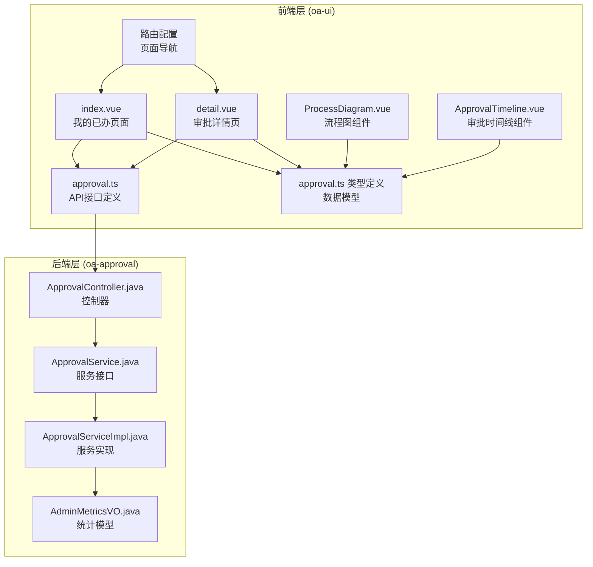
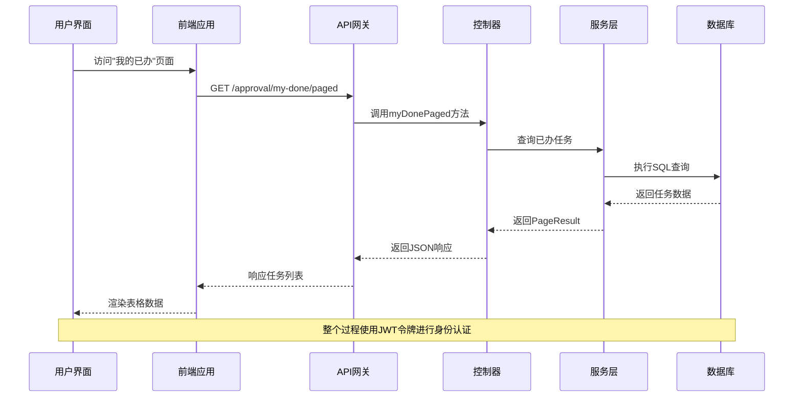
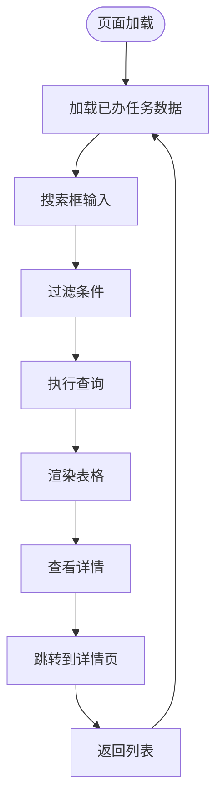
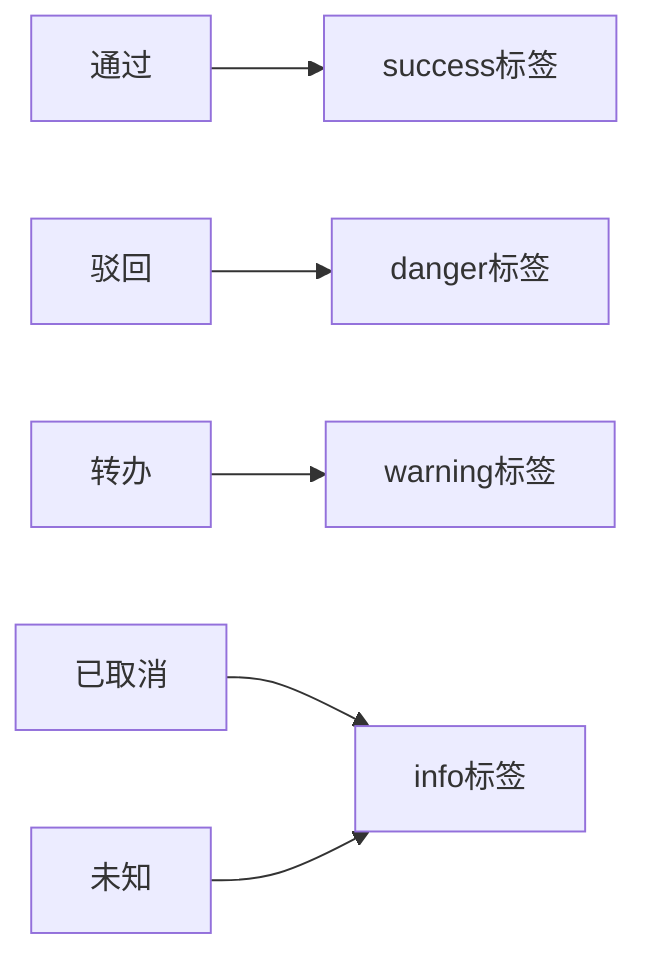
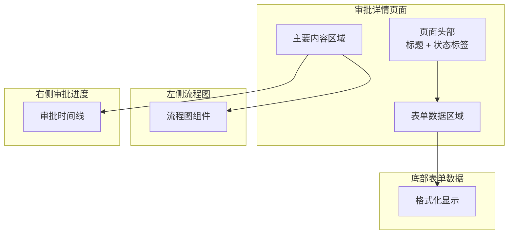
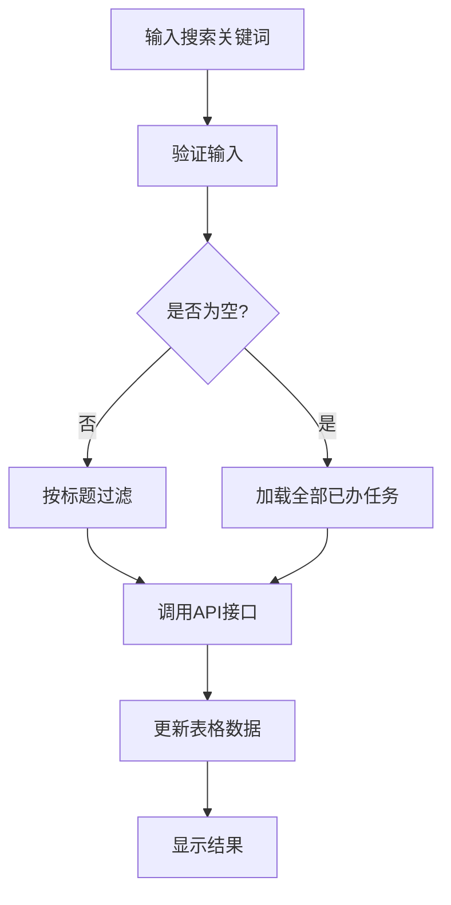
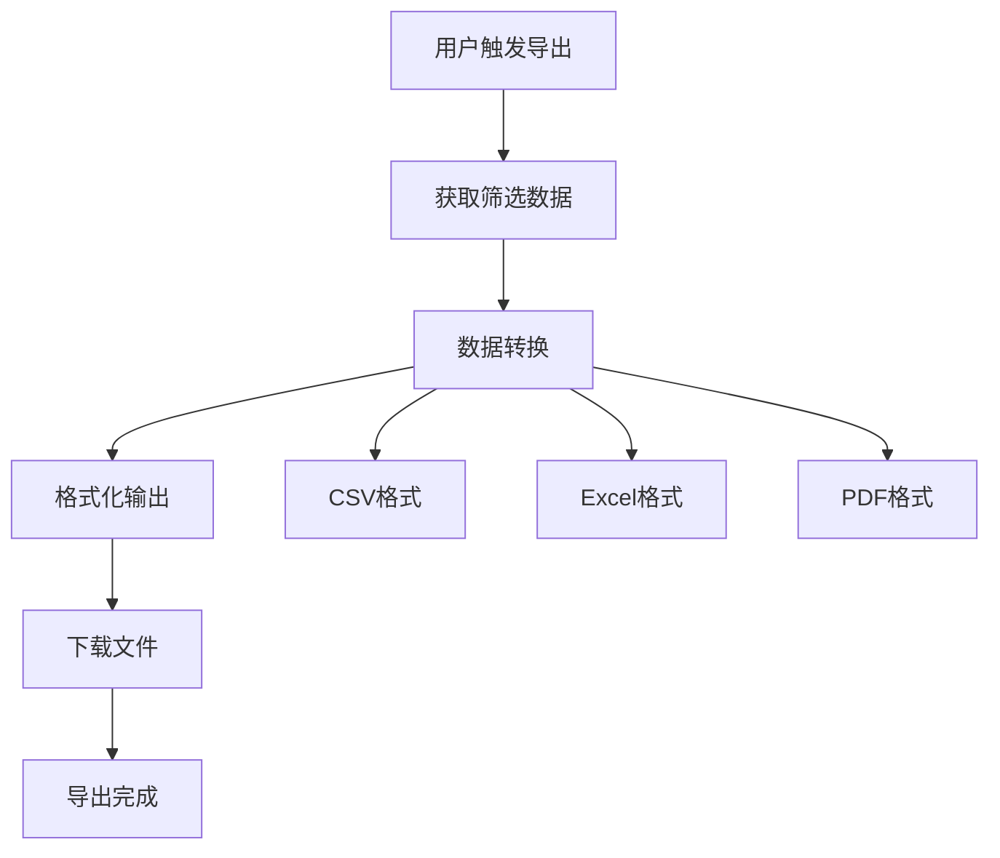
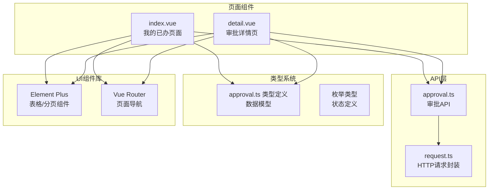
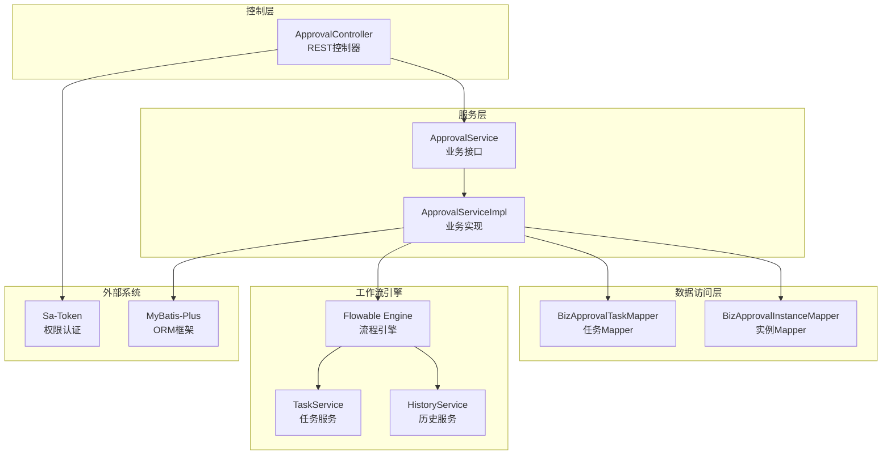

# 我的已办页面

<cite>
**本文档引用的文件**
- [index.vue](file://oa-ui/src/views/approval/my-done/index.vue)
- [approval.ts](file://oa-ui/src/api/approval.ts)
- [approval.ts 类型定义](file://oa-ui/src/types/approval.ts)
- [ApprovalController.java](file://oa-approval/src/main/java/com/oa/admin/approval/controller/ApprovalController.java)
- [ApprovalService.java](file://oa-approval/src/main/java/com/oa/admin/approval/service/ApprovalService.java)
- [ApprovalServiceImpl.java](file://oa-approval/src/main/java/com/oa/admin/approval/service/impl/ApprovalServiceImpl.java)
- [detail.vue](file://oa-ui/src/views/approval/instance/detail.vue)
- [ProcessDiagram.vue](file://oa-ui/src/views/approval/instance/components/ProcessDiagram.vue)
- [ApprovalTimeline.vue](file://oa-ui/src/views/approval/instance/components/ApprovalTimeline.vue)
- [路由配置](file://oa-ui/src/router/index.ts)
- [AdminMetricsVO.java](file://oa-approval/src/main/java/com/oa/admin/approval/dto/AdminMetricsVO.java)
</cite>

## 目录
1. [简介](#简介)
2. [项目结构](#项目结构)
3. [核心组件](#核心组件)
4. [架构概览](#架构概览)
5. [详细组件分析](#详细组件分析)
6. [依赖关系分析](#依赖关系分析)
7. [性能考虑](#性能考虑)
8. [故障排除指南](#故障排除指南)
9. [结论](#结论)

## 简介

"我的已办页面"是OA审批管理系统中的核心功能模块，专门用于展示审批人处理过的已办任务列表。该页面提供了完整的审批任务管理体验，包括任务列表展示、筛选查询、详情查看、统计分析等功能。

该页面基于Vue.js前端框架和Spring Boot后端服务构建，采用前后端分离的架构设计。系统集成了Flowable工作流引擎，实现了完整的审批流程管理和状态跟踪。

## 项目结构

"我的已办页面"涉及的核心文件组织如下：



**图表来源**
- [index.vue:1-100](file://oa-ui/src/views/approval/my-done/index.vue#L1-L100)
- [approval.ts:1-71](file://oa-ui/src/api/approval.ts#L1-L71)
- [ApprovalController.java:1-252](file://oa-approval/src/main/java/com/oa/admin/approval/controller/ApprovalController.java#L1-L252)

**章节来源**
- [index.vue:1-100](file://oa-ui/src/views/approval/my-done/index.vue#L1-L100)
- [approval.ts:1-71](file://oa-ui/src/api/approval.ts#L1-L71)
- [ApprovalController.java:1-252](file://oa-approval/src/main/java/com/oa/admin/approval/controller/ApprovalController.java#L1-L252)

## 核心组件

### 前端核心组件

**我的已办页面组件**
- 负责展示审批人处理过的所有任务
- 提供搜索、分页、排序等基础功能
- 支持任务状态标签显示和查看详情跳转

**API接口层**
- 封装了与后端交互的所有HTTP请求
- 定义了完整的TypeScript类型系统
- 提供任务列表查询、详情获取等接口

**类型定义系统**
- 统一的数据模型定义
- 枚举类型的强类型约束
- 接口契约的完整声明

**章节来源**
- [index.vue:41-93](file://oa-ui/src/views/approval/my-done/index.vue#L41-L93)
- [approval.ts:64-66](file://oa-ui/src/api/approval.ts#L64-L66)
- [approval.ts 类型定义:115-131](file://oa-ui/src/types/approval.ts#L115-L131)

### 后端核心组件

**控制器层**
- 提供RESTful API接口
- 处理权限验证和参数校验
- 协调服务层完成业务逻辑

**服务层**
- 实现核心业务逻辑
- 管理数据库事务
- 集成Flowable工作流引擎

**数据访问层**
- 基于MyBatis-Plus的ORM映射
- 提供高效的数据查询能力
- 支持复杂的分页查询

**章节来源**
- [ApprovalController.java:76-83](file://oa-approval/src/main/java/com/oa/admin/approval/controller/ApprovalController.java#L76-L83)
- [ApprovalService.java:40-42](file://oa-approval/src/main/java/com/oa/admin/approval/service/ApprovalService.java#L40-L42)
- [ApprovalServiceImpl.java:480-508](file://oa-approval/src/main/java/com/oa/admin/approval/service/impl/ApprovalServiceImpl.java#L480-L508)

## 架构概览

系统采用经典的三层架构设计，前后端完全分离：



**图表来源**
- [index.vue:71-86](file://oa-ui/src/views/approval/my-done/index.vue#L71-L86)
- [ApprovalController.java:76-83](file://oa-approval/src/main/java/com/oa/admin/approval/controller/ApprovalController.java#L76-L83)
- [ApprovalServiceImpl.java:480-508](file://oa-approval/src/main/java/com/oa/admin/approval/service/impl/ApprovalServiceImpl.java#L480-L508)

系统架构特点：
- **前后端分离**：前端Vue.js + 后端Spring Boot
- **微服务化**：审批模块独立部署
- **工作流集成**：深度集成Flowable引擎
- **权限控制**：基于Sa-Token的细粒度权限管理

## 详细组件分析

### 我的已办页面组件

#### 页面布局与功能

页面采用卡片式布局，包含工具栏、数据表格、分页控件三个主要部分：



**图表来源**
- [index.vue:71-92](file://oa-ui/src/views/approval/my-done/index.vue#L71-L92)

#### 数据表格字段说明

| 字段名 | 显示名称 | 数据类型 | 描述 |
|--------|----------|----------|------|
| instanceTitle | 申请标题 | string | 审批申请的主题或标题 |
| taskName | 审批节点 | string | 当前处理的审批节点名称 |
| taskResult | 结果 | enum | 审批处理结果（通过/驳回/转办） |
| taskComment | 审批意见 | string | 审批人填写的处理意见 |
| completedAt | 处理时间 | datetime | 任务完成的具体时间 |

#### 任务状态标签系统

系统为不同的审批结果提供可视化标签：



**图表来源**
- [index.vue:56-69](file://oa-ui/src/views/approval/my-done/index.vue#L56-L69)

**章节来源**
- [index.vue:1-39](file://oa-ui/src/views/approval/my-done/index.vue#L1-L39)
- [index.vue:10-25](file://oa-ui/src/views/approval/my-done/index.vue#L10-L25)

### 审批详情查看功能

#### 完整的审批流程展示

详情页面提供三个维度的信息展示：



**图表来源**
- [detail.vue:14-29](file://oa-ui/src/views/approval/instance/detail.vue#L14-L29)

#### 流程图组件分析

流程图组件具备以下特性：
- **动态渲染**：根据BPMN XML实时生成流程图
- **状态高亮**：已完成节点绿色高亮，当前节点蓝色高亮
- **错误处理**：渲染失败时提供友好的错误提示

#### 审批时间线组件

时间线组件展示完整的审批历史：
- 按时间倒序排列
- 每个节点显示审批人、结果、意见
- 支持空状态友好提示

**章节来源**
- [detail.vue:1-31](file://oa-ui/src/views/approval/instance/detail.vue#L1-L31)
- [ProcessDiagram.vue:1-109](file://oa-ui/src/views/approval/instance/components/ProcessDiagram.vue#L1-L109)
- [ApprovalTimeline.vue:1-100](file://oa-ui/src/views/approval/instance/components/ApprovalTimeline.vue#L1-L100)

### 筛选和查询功能

#### 前端筛选机制

当前版本支持基于标题的关键字搜索：



**图表来源**
- [index.vue:71-86](file://oa-ui/src/views/approval/my-done/index.vue#L71-L86)

#### 后端查询优化

后端服务实现了智能的查询优化策略：

| 查询场景 | SQL优化 | 性能特点 |
|----------|---------|----------|
| 标题搜索 | 使用LIKE模糊匹配 | 需要索引优化 |
| 分页查询 | 使用MyBatis-Plus分页 | 支持大数据量 |
| 排序查询 | 按完成时间降序 | 时间复杂度O(n log n) |

**章节来源**
- [ApprovalServiceImpl.java:480-508](file://oa-approval/src/main/java/com/oa/admin/approval/service/impl/ApprovalServiceImpl.java#L480-L508)

### 统计分析功能

#### 系统级统计指标

虽然"我的已办"页面主要面向个人任务，但系统提供了全面的统计分析能力：

```mermaid
graph LR
subgraph "统计指标"
Total[总实例数]
Pending[审批中]
Approved[已通过]
Rejected[已驳回]
Withdrawn[已撤回]
AvgDuration[平均耗时(h)]
end
subgraph "模板维度"
TemplateMetrics[模板统计]
TemplateName[模板名称]
TemplateTotal[总数]
TemplatePending[审批中]
TemplateApproved[已通过]
TemplateRejected[已驳回]
end
Total --> TemplateMetrics
Pending --> TemplateMetrics
Approved --> TemplateMetrics
Rejected --> TemplateMetrics
Withdrawn --> TemplateMetrics
AvgDuration --> TemplateMetrics
```

**图表来源**
- [AdminMetricsVO.java:11-32](file://oa-approval/src/main/java/com/oa/admin/approval/dto/AdminMetricsVO.java#L11-L32)

#### 平均处理时长计算

系统能够自动计算审批流程的平均处理时间：
- 基于已完成实例的开始时间和结束时间差
- 支持分钟到小时的精确换算
- 提供两位小数的精度保证

**章节来源**
- [ApprovalServiceImpl.java:724-781](file://oa-approval/src/main/java/com/oa/admin/approval/service/impl/ApprovalServiceImpl.java#L724-L781)

### 导出和报表功能

#### 报表数据结构

系统支持将审批数据导出为多种格式：

| 字段名 | 数据类型 | 导出用途 |
|--------|----------|----------|
| instanceTitle | string | 表示申请主题 |
| taskName | string | 显示审批节点 |
| taskResult | enum | 标识处理结果 |
| taskComment | string | 记录审批意见 |
| completedAt | datetime | 标注处理时间 |
| initiatorUserId | number | 申请人标识 |
| instanceStatus | enum | 实例状态 |

#### 报表生成流程



**图表来源**
- [approval.ts:64-66](file://oa-ui/src/api/approval.ts#L64-L66)

## 依赖关系分析

### 前端依赖关系



**图表来源**
- [index.vue:42-46](file://oa-ui/src/views/approval/my-done/index.vue#L42-L46)
- [detail.vue:36-40](file://oa-ui/src/views/approval/instance/detail.vue#L36-L40)

### 后端依赖关系



**图表来源**
- [ApprovalController.java:33-35](file://oa-approval/src/main/java/com/oa/admin/approval/controller/ApprovalController.java#L33-L35)
- [ApprovalServiceImpl.java:101-111](file://oa-approval/src/main/java/com/oa/admin/approval/service/impl/ApprovalServiceImpl.java#L101-L111)

**章节来源**
- [ApprovalController.java:1-252](file://oa-approval/src/main/java/com/oa/admin/approval/controller/ApprovalController.java#L1-L252)
- [ApprovalServiceImpl.java:1-783](file://oa-approval/src/main/java/com/oa/admin/approval/service/impl/ApprovalServiceImpl.java#L1-L783)

## 性能考虑

### 前端性能优化

**虚拟滚动支持**
- 大数据量表格建议实现虚拟滚动
- 减少DOM节点数量，提升渲染性能

**懒加载机制**
- 图片和复杂组件采用懒加载
- 首屏加载时间优化

**缓存策略**
- 列表数据本地缓存
- 避免重复网络请求

### 后端性能优化

**数据库索引优化**
- 已办任务查询建立复合索引
- 支持按审批人、状态、时间的高效查询

**分页查询优化**
- 使用游标分页减少偏移量扫描
- 限制单页最大数据量防止内存溢出

**连接池配置**
- 合理设置数据库连接池大小
- 连接超时和重试机制

## 故障排除指南

### 常见问题及解决方案

**页面加载缓慢**
- 检查网络请求响应时间
- 分析数据库查询执行计划
- 考虑添加适当的索引

**数据不一致**
- 验证Flowable引擎状态同步
- 检查任务完成事件处理
- 确认事务边界设置

**权限访问异常**
- 验证用户角色和权限
- 检查JWT令牌有效性
- 确认Sa-Token配置正确性

**章节来源**
- [ApprovalController.java:230-250](file://oa-approval/src/main/java/com/oa/admin/approval/controller/ApprovalController.java#L230-L250)
- [ApprovalServiceImpl.java:160-231](file://oa-approval/src/main/java/com/oa/admin/approval/service/impl/ApprovalServiceImpl.java#L160-L231)

## 结论

"我的已办页面"作为OA审批管理系统的重要组成部分，展现了现代企业级应用的设计理念和技术实现。该页面不仅提供了完整的审批任务管理功能，还体现了以下技术特色：

**技术创新点**
- 基于Flowable的工作流集成，实现了灵活的审批流程管理
- 前后端分离架构，提升了系统的可维护性和扩展性
- 强类型化的TypeScript开发，增强了代码质量和开发效率

**用户体验优势**
- 直观的任务状态可视化展示
- 完整的审批流程追踪能力
- 响应式的移动端适配

**系统可靠性**
- 完善的权限控制和审计日志
- 稳健的异常处理和错误恢复机制
- 可扩展的统计分析功能

该页面为后续的功能扩展奠定了良好的基础，包括但不限于：更丰富的筛选条件、批量操作支持、高级报表生成功能等。通过持续的优化和改进，"我的已办页面"将继续为企业提供高效的审批管理服务。