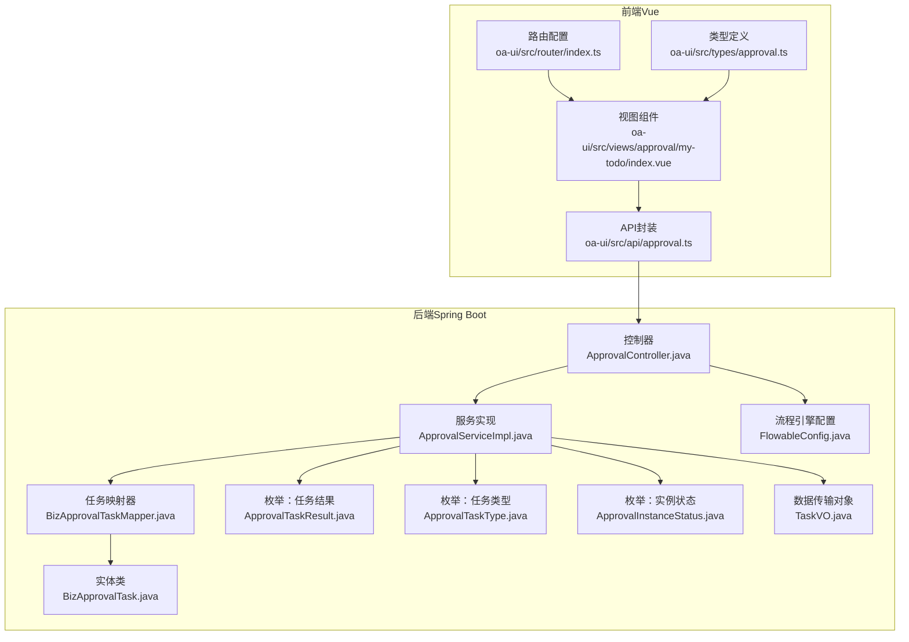
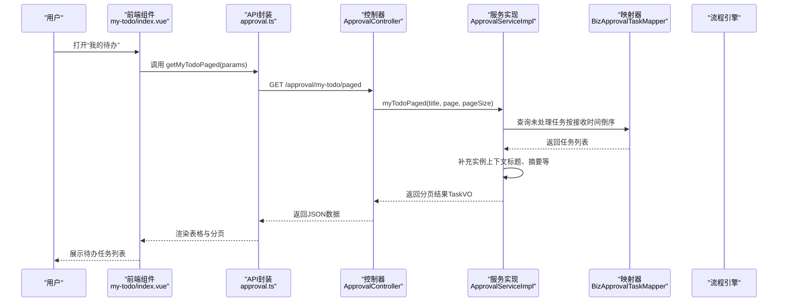
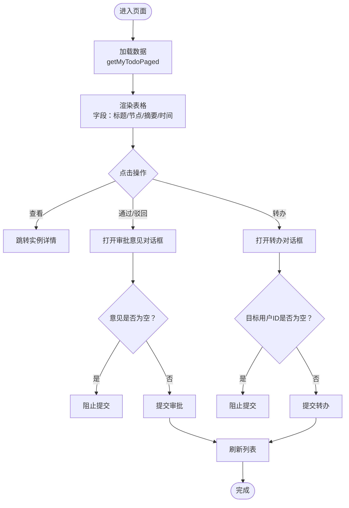
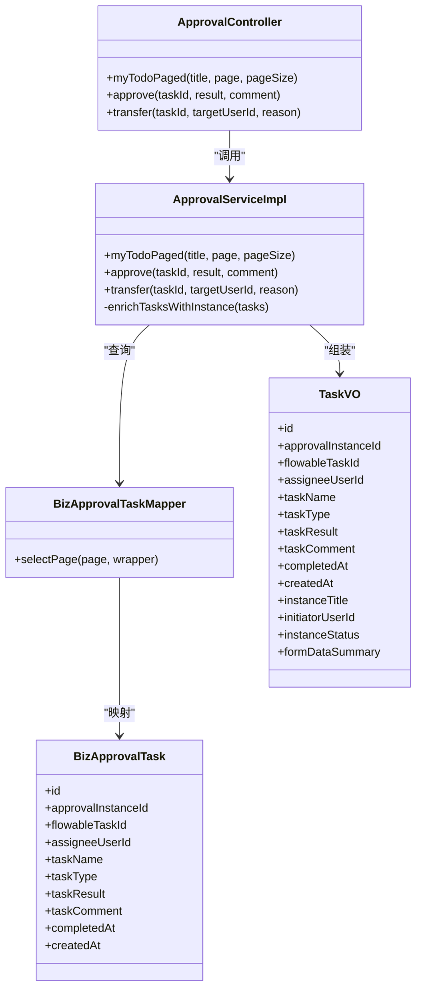
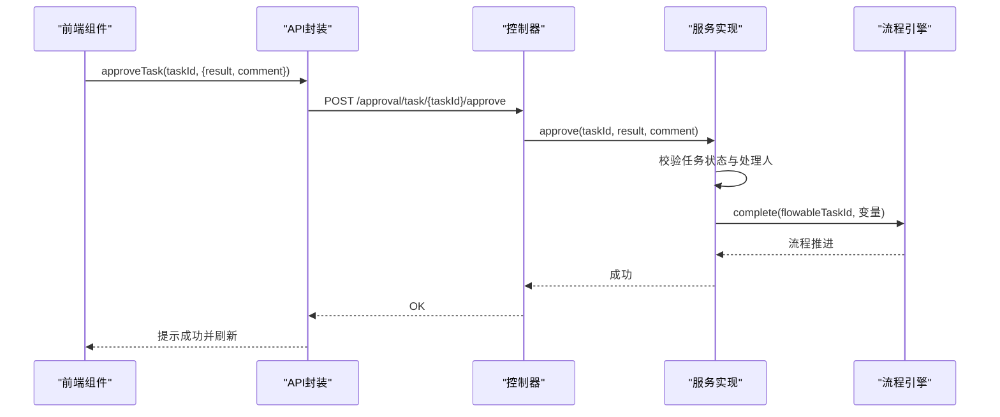
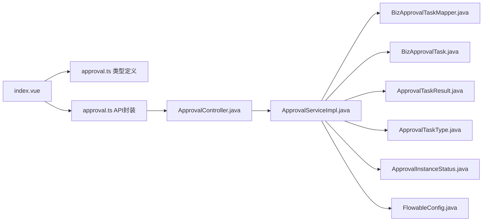

# 我的待办页面

<cite>
**本文档引用的文件**
- [index.vue](file://oa-ui/src/views/approval/my-todo/index.vue)
- [approval.ts](file://oa-ui/src/api/approval.ts)
- [ApprovalController.java](file://oa-approval/src/main/java/com/oa/admin/approval/controller/ApprovalController.java)
- [ApprovalServiceImpl.java](file://oa-approval/src/main/java/com/oa/admin/approval/service/impl/ApprovalServiceImpl.java)
- [TaskVO.java](file://oa-approval/src/main/java/com/oa/admin/approval/dto/TaskVO.java)
- [BizApprovalTask.java](file://oa-approval/src/main/java/com/oa/admin/approval/entity/BizApprovalTask.java)
- [ApprovalTaskResult.java](file://oa-approval/src/main/java/com/oa/admin/approval/enums/ApprovalTaskResult.java)
- [ApprovalTaskType.java](file://oa-approval/src/main/java/com/oa/admin/approval/enums/ApprovalTaskType.java)
- [ApprovalInstanceStatus.java](file://oa-approval/src/main/java/com/oa/admin/approval/enums/ApprovalInstanceStatus.java)
- [BizApprovalTaskMapper.java](file://oa-approval/src/main/java/com/oa/admin/approval/mapper/BizApprovalTaskMapper.java)
- [approval.ts（类型定义）](file://oa-ui/src/types/approval.ts)
- [router/index.ts](file://oa-ui/src/router/index.ts)
- [FlowableConfig.java](file://oa-approval/src/main/java/com/oa/admin/approval/config/FlowableConfig.java)
</cite>

## 目录
1. [简介](#简介)
2. [项目结构](#项目结构)
3. [核心组件](#核心组件)
4. [架构总览](#架构总览)
5. [详细组件分析](#详细组件分析)
6. [依赖关系分析](#依赖关系分析)
7. [性能考虑](#性能考虑)
8. [故障排查指南](#故障排查指南)
9. [结论](#结论)
10. [附录](#附录)

## 简介
本文件面向OA审批管理系统“我的待办”页面，聚焦审批人处理的待办任务列表展示与审批操作能力。内容涵盖：
- 待办任务字段：申请标题、审批节点、表单摘要、接收时间等
- 状态管理与排序机制：按接收时间倒序排列，区分已处理与未处理
- 审批操作：同意、驳回、转办等动作的前端交互与后端实现
- 意见输入与校验：审批意见输入框设计与必填校验
- 扩展能力：筛选、分页、批量处理、快捷审批、提醒与时效管理建议

## 项目结构
“我的待办”页面由前端Vue组件与后端Spring Boot服务共同实现，前后端通过REST接口交互。

**图表来源**
- [index.vue:1-160](file://oa-ui/src/views/approval/my-todo/index.vue#L1-L160)
- [approval.ts:1-71](file://oa-ui/src/api/approval.ts#L1-L71)
- [ApprovalController.java:1-252](file://oa-approval/src/main/java/com/oa/admin/approval/controller/ApprovalController.java#L1-L252)
- [ApprovalServiceImpl.java:1-792](file://oa-approval/src/main/java/com/oa/admin/approval/service/impl/ApprovalServiceImpl.java#L1-L792)
- [BizApprovalTaskMapper.java:1-13](file://oa-approval/src/main/java/com/oa/admin/approval/mapper/BizApprovalTaskMapper.java#L1-L13)
- [BizApprovalTask.java:1-35](file://oa-approval/src/main/java/com/oa/admin/approval/entity/BizApprovalTask.java#L1-L35)
- [ApprovalTaskResult.java:1-28](file://oa-approval/src/main/java/com/oa/admin/approval/enums/ApprovalTaskResult.java#L1-L28)
- [ApprovalTaskType.java:1-27](file://oa-approval/src/main/java/com/oa/admin/approval/enums/ApprovalTaskType.java#L1-L27)
- [ApprovalInstanceStatus.java:1-29](file://oa-approval/src/main/java/com/oa/admin/approval/enums/ApprovalInstanceStatus.java#L1-L29)
- [TaskVO.java:1-34](file://oa-approval/src/main/java/com/oa/admin/approval/dto/TaskVO.java#L1-L34)
- [FlowableConfig.java:1-31](file://oa-approval/src/main/java/com/oa/admin/approval/config/FlowableConfig.java#L1-L31)
- [router/index.ts:1-134](file://oa-ui/src/router/index.ts#L1-L134)

**章节来源**
- [index.vue:1-160](file://oa-ui/src/views/approval/my-todo/index.vue#L1-L160)
- [approval.ts:1-71](file://oa-ui/src/api/approval.ts#L1-L71)
- [ApprovalController.java:1-252](file://oa-approval/src/main/java/com/oa/admin/approval/controller/ApprovalController.java#L1-L252)
- [ApprovalServiceImpl.java:1-792](file://oa-approval/src/main/java/com/oa/admin/approval/service/impl/ApprovalServiceImpl.java#L1-L792)

## 核心组件
- 前端视图组件：负责表格渲染、分页、搜索、对话框交互、审批动作调用
- API封装：统一REST请求路径与参数格式
- 控制器：暴露“我的待办分页查询”等接口
- 服务实现：执行业务逻辑（查询、审批、转办、流程引擎交互）
- 数据模型：TaskVO用于前端表格展示；BizApprovalTask对应数据库任务记录
- 枚举体系：任务结果、任务类型、实例状态

**章节来源**
- [index.vue:66-160](file://oa-ui/src/views/approval/my-todo/index.vue#L66-L160)
- [approval.ts:60-71](file://oa-ui/src/api/approval.ts#L60-L71)
- [ApprovalController.java:67-74](file://oa-approval/src/main/java/com/oa/admin/approval/controller/ApprovalController.java#L67-L74)
- [TaskVO.java:1-34](file://oa-approval/src/main/java/com/oa/admin/approval/dto/TaskVO.java#L1-L34)
- [BizApprovalTask.java:1-35](file://oa-approval/src/main/java/com/oa/admin/approval/entity/BizApprovalTask.java#L1-L35)
- [ApprovalTaskResult.java:1-28](file://oa-approval/src/main/java/com/oa/admin/approval/enums/ApprovalTaskResult.java#L1-L28)
- [ApprovalTaskType.java:1-27](file://oa-approval/src/main/java/com/oa/admin/approval/enums/ApprovalTaskType.java#L1-L27)
- [ApprovalInstanceStatus.java:1-29](file://oa-approval/src/main/java/com/oa/admin/approval/enums/ApprovalInstanceStatus.java#L1-L29)

## 架构总览
“我的待办”页面采用前后端分离架构，前端通过API封装调用后端控制器，控制器委托服务层执行业务逻辑，服务层与数据库及流程引擎交互，最终返回给前端进行渲染。

**图表来源**
- [index.vue:91-106](file://oa-ui/src/views/approval/my-todo/index.vue#L91-L106)
- [approval.ts:60-62](file://oa-ui/src/api/approval.ts#L60-L62)
- [ApprovalController.java:67-74](file://oa-approval/src/main/java/com/oa/admin/approval/controller/ApprovalController.java#L67-L74)
- [ApprovalServiceImpl.java:459-487](file://oa-approval/src/main/java/com/oa/admin/approval/service/impl/ApprovalServiceImpl.java#L459-L487)
- [BizApprovalTaskMapper.java:1-13](file://oa-approval/src/main/java/com/oa/admin/approval/mapper/BizApprovalTaskMapper.java#L1-L13)

## 详细组件分析

### 前端页面组件（我的待办）
- 列表字段
  - 申请标题：来源于实例标题
  - 审批节点：当前流程节点名称
  - 表单摘要：从实例表单数据截取前100字符
  - 接收时间：任务创建时间
- 操作按钮
  - 查看：跳转到实例详情页
  - 通过：打开审批意见对话框，提交同意
  - 驳回：打开审批意见对话框，提交驳回
  - 转办：打开转办对话框，输入目标用户ID与原因
- 分页与搜索
  - 支持按标题模糊搜索
  - 支持切换页码与每页条数
- 对话框与校验
  - 同意/驳回：审批意见必填
  - 转办：目标用户ID必填

**图表来源**
- [index.vue:91-150](file://oa-ui/src/views/approval/my-todo/index.vue#L91-L150)
- [approval.ts:8-10](file://oa-ui/src/api/approval.ts#L8-L10)
- [approval.ts:68-70](file://oa-ui/src/api/approval.ts#L68-L70)

**章节来源**
- [index.vue:1-160](file://oa-ui/src/views/approval/my-todo/index.vue#L1-L160)
- [approval.ts（类型定义）:115-131](file://oa-ui/src/types/approval.ts#L115-L131)

### 后端接口与服务实现
- 接口定义
  - “我的待办分页”：GET /approval/my-todo/paged
  - “审批任务”：POST /approval/task/{taskId}/approve
  - “转办任务”：POST /approval/task/{taskId}/transfer
- 服务实现要点
  - 查询未处理任务：按接收时间倒序
  - 审批动作：校验任务存在性、未处理状态、仅限当前处理人；更新任务状态并推进流程引擎
  - 转办动作：校验任务状态与处理人；标记原任务为转办并创建新任务，设置流程引擎新处理人
  - 实例上下文补充：将实例标题、发起人、状态、表单摘要注入TaskVO

**图表来源**
- [ApprovalController.java:67-92](file://oa-approval/src/main/java/com/oa/admin/approval/controller/ApprovalController.java#L67-L92)
- [ApprovalServiceImpl.java:459-554](file://oa-approval/src/main/java/com/oa/admin/approval/service/impl/ApprovalServiceImpl.java#L459-L554)
- [BizApprovalTaskMapper.java:1-13](file://oa-approval/src/main/java/com/oa/admin/approval/mapper/BizApprovalTaskMapper.java#L1-L13)
- [BizApprovalTask.java:1-35](file://oa-approval/src/main/java/com/oa/admin/approval/entity/BizApprovalTask.java#L1-L35)
- [TaskVO.java:1-34](file://oa-approval/src/main/java/com/oa/admin/approval/dto/TaskVO.java#L1-L34)

**章节来源**
- [ApprovalController.java:67-92](file://oa-approval/src/main/java/com/oa/admin/approval/controller/ApprovalController.java#L67-L92)
- [ApprovalServiceImpl.java:459-554](file://oa-approval/src/main/java/com/oa/admin/approval/service/impl/ApprovalServiceImpl.java#L459-L554)

### 审批操作与状态管理
- 同意/驳回
  - 前端：打开对话框，要求填写审批意见
  - 后端：校验任务存在、未处理、处理人匹配；更新任务结果与完成时间；推进流程引擎变量
  - 结果：通知发起人审批结果
- 转办
  - 前端：输入目标用户ID与转办原因
  - 后端：校验任务状态与处理人；标记原任务为转办并创建新任务；设置流程引擎新处理人；通知目标用户
- 任务类型与结果
  - 任务类型：普通、会签、或签
  - 任务结果：同意、驳回、转办、作废

**图表来源**
- [index.vue:112-128](file://oa-ui/src/views/approval/my-todo/index.vue#L112-L128)
- [approval.ts:8-10](file://oa-ui/src/api/approval.ts#L8-L10)
- [ApprovalController.java:46-53](file://oa-approval/src/main/java/com/oa/admin/approval/controller/ApprovalController.java#L46-L53)
- [ApprovalServiceImpl.java:170-240](file://oa-approval/src/main/java/com/oa/admin/approval/service/impl/ApprovalServiceImpl.java#L170-L240)

**章节来源**
- [index.vue:112-128](file://oa-ui/src/views/approval/my-todo/index.vue#L112-L128)
- [ApprovalController.java:46-53](file://oa-approval/src/main/java/com/oa/admin/approval/controller/ApprovalController.java#L46-L53)
- [ApprovalServiceImpl.java:170-240](file://oa-approval/src/main/java/com/oa/admin/approval/service/impl/ApprovalServiceImpl.java#L170-L240)
- [ApprovalTaskResult.java:1-28](file://oa-approval/src/main/java/com/oa/admin/approval/enums/ApprovalTaskResult.java#L1-L28)
- [ApprovalTaskType.java:1-27](file://oa-approval/src/main/java/com/oa/admin/approval/enums/ApprovalTaskType.java#L1-L27)

### 字段与排序机制
- 字段映射
  - 申请标题：TaskVO.instanceTitle
  - 审批节点：TaskVO.taskName
  - 表单摘要：TaskVO.formDataSummary（实例表单数据截取）
  - 接收时间：TaskVO.createdAt
- 排序规则
  - 未处理任务：按createdAt倒序
  - 已处理任务：按completedAt倒序

**章节来源**
- [TaskVO.java:1-34](file://oa-approval/src/main/java/com/oa/admin/approval/dto/TaskVO.java#L1-L34)
- [ApprovalServiceImpl.java:459-487](file://oa-approval/src/main/java/com/oa/admin/approval/service/impl/ApprovalServiceImpl.java#L459-L487)
- [BizApprovalTask.java:1-35](file://oa-approval/src/main/java/com/oa/admin/approval/entity/BizApprovalTask.java#L1-L35)

### 搜索与分页
- 搜索
  - 支持按标题模糊搜索，后端基于实例标题匹配任务所属实例
- 分页
  - 支持切换页码与每页条数，后端返回总数与列表

**章节来源**
- [index.vue:91-106](file://oa-ui/src/views/approval/my-todo/index.vue#L91-L106)
- [ApprovalController.java:67-74](file://oa-approval/src/main/java/com/oa/admin/approval/controller/ApprovalController.java#L67-L74)
- [ApprovalServiceImpl.java:459-487](file://oa-approval/src/main/java/com/oa/admin/approval/service/impl/ApprovalServiceImpl.java#L459-L487)

### 批量处理与快捷审批
- 批量处理
  - 当前页面未提供批量勾选与批量操作入口。可在现有基础上扩展：增加全选/反选、批量同意/批量驳回/批量转办等操作。
- 快捷审批
  - 当前页面提供“通过/驳回/转办”三键式操作，满足常见快捷审批场景。

**章节来源**
- [index.vue:14-22](file://oa-ui/src/views/approval/my-todo/index.vue#L14-L22)

### 审批意见输入与必填校验
- 同意/驳回：审批意见必填，前端在提交时进行非空校验
- 转办：目标用户ID必填，前端在提交时进行非空校验

**章节来源**
- [index.vue:37-62](file://oa-ui/src/views/approval/my-todo/index.vue#L37-L62)
- [approval.ts:8-10](file://oa-ui/src/api/approval.ts#L8-L10)
- [approval.ts:68-70](file://oa-ui/src/api/approval.ts#L68-L70)

### 任务筛选与实例上下文
- 筛选
  - 支持按标题筛选，后端先根据标题匹配实例ID集合，再限定任务查询范围
- 实例上下文
  - 服务层将实例标题、发起人、状态、表单摘要注入TaskVO，供前端展示

**章节来源**
- [ApprovalServiceImpl.java:459-554](file://oa-approval/src/main/java/com/oa/admin/approval/service/impl/ApprovalServiceImpl.java#L459-L554)
- [TaskVO.java:28-33](file://oa-approval/src/main/java/com/oa/admin/approval/dto/TaskVO.java#L28-L33)

### 提醒机制与审批时效管理（建议）
- 提醒机制
  - 建议在服务层审批完成后向发起人发送站内通知；转办时向目标用户发送通知
- 审批时效
  - 建议在流程模板中配置节点时限与催办策略，结合定时任务检测超时任务并触发提醒

**章节来源**
- [ApprovalServiceImpl.java:222-239](file://oa-approval/src/main/java/com/oa/admin/approval/service/impl/ApprovalServiceImpl.java#L222-L239)
- [ApprovalServiceImpl.java:598-601](file://oa-approval/src/main/java/com/oa/admin/approval/service/impl/ApprovalServiceImpl.java#L598-L601)

## 依赖关系分析
- 前端依赖
  - 视图组件依赖API封装与类型定义
  - 路由配置将“我的待办”页面挂载到指定路径
- 后端依赖
  - 控制器依赖服务实现
  - 服务实现依赖映射器、实体、枚举与流程引擎配置

**图表来源**
- [index.vue:66-160](file://oa-ui/src/views/approval/my-todo/index.vue#L66-L160)
- [approval.ts（类型定义）:1-131](file://oa-ui/src/types/approval.ts#L1-L131)
- [approval.ts:1-71](file://oa-ui/src/api/approval.ts#L1-L71)
- [ApprovalController.java:1-252](file://oa-approval/src/main/java/com/oa/admin/approval/controller/ApprovalController.java#L1-L252)
- [ApprovalServiceImpl.java:1-792](file://oa-approval/src/main/java/com/oa/admin/approval/service/impl/ApprovalServiceImpl.java#L1-L792)
- [BizApprovalTaskMapper.java:1-13](file://oa-approval/src/main/java/com/oa/admin/approval/mapper/BizApprovalTaskMapper.java#L1-L13)
- [BizApprovalTask.java:1-35](file://oa-approval/src/main/java/com/oa/admin/approval/entity/BizApprovalTask.java#L1-L35)
- [ApprovalTaskResult.java:1-28](file://oa-approval/src/main/java/com/oa/admin/approval/enums/ApprovalTaskResult.java#L1-L28)
- [ApprovalTaskType.java:1-27](file://oa-approval/src/main/java/com/oa/admin/approval/enums/ApprovalTaskType.java#L1-L27)
- [ApprovalInstanceStatus.java:1-29](file://oa-approval/src/main/java/com/oa/admin/approval/enums/ApprovalInstanceStatus.java#L1-L29)
- [FlowableConfig.java:1-31](file://oa-approval/src/main/java/com/oa/admin/approval/config/FlowableConfig.java#L1-L31)

**章节来源**
- [router/index.ts:66-69](file://oa-ui/src/router/index.ts#L66-L69)

## 性能考虑
- 分页查询：后端使用分页组件，避免一次性加载大量任务
- 实例摘要截断：前端对表单摘要进行长度限制，减少渲染压力
- 单次查询多实例映射：服务层通过一次批量查询实例，降低多次数据库往返

**章节来源**
- [ApprovalServiceImpl.java:459-554](file://oa-approval/src/main/java/com/oa/admin/approval/service/impl/ApprovalServiceImpl.java#L459-L554)
- [index.vue:13-14](file://oa-ui/src/views/approval/my-todo/index.vue#L13-L14)

## 故障排查指南
- 常见错误与提示
  - 参数错误：如任务ID、结果值非法
  - 任务不存在：任务ID无效
  - 已处理任务：重复审批
  - 权限不足：非当前处理人操作
- 建议排查步骤
  - 检查前端传参（任务ID、结果、意见、转办目标用户ID）
  - 检查后端异常抛出与返回码
  - 核对当前登录用户与任务处理人关系
  - 核对任务状态是否仍为未处理

**章节来源**
- [ApprovalServiceImpl.java:170-240](file://oa-approval/src/main/java/com/oa/admin/approval/service/impl/ApprovalServiceImpl.java#L170-L240)
- [ApprovalServiceImpl.java:556-602](file://oa-approval/src/main/java/com/oa/admin/approval/service/impl/ApprovalServiceImpl.java#L556-L602)

## 结论
“我的待办”页面以简洁直观的方式呈现审批人需要处理的任务，支持按标题筛选、分页浏览与三种核心审批动作。后端通过严格的权限校验与流程引擎集成，确保审批过程可追溯、可通知。建议后续增强批量处理与快捷审批能力，并完善提醒与时效管理策略，进一步提升审批效率与用户体验。

## 附录
- 路由与页面映射
  - “我的待办”页面路由：/approval/my-todo
- 关键接口
  - GET /approval/my-todo/paged
  - POST /approval/task/{taskId}/approve
  - POST /approval/task/{taskId}/transfer

**章节来源**
- [router/index.ts:66-69](file://oa-ui/src/router/index.ts#L66-L69)
- [ApprovalController.java:67-92](file://oa-approval/src/main/java/com/oa/admin/approval/controller/ApprovalController.java#L67-L92)