# 我的申请页面

<cite>
**本文档引用的文件**
- [index.vue](file://oa-ui/src/views/approval/my-apply/index.vue)
- [approval.ts](file://oa-ui/src/api/approval.ts)
- [detail.vue](file://oa-ui/src/views/approval/instance/detail.vue)
- [ProcessDiagram.vue](file://oa-ui/src/views/approval/instance/components/ProcessDiagram.vue)
- [ApprovalTimeline.vue](file://oa-ui/src/views/approval/instance/components/ApprovalTimeline.vue)
- [ApprovalController.java](file://oa-approval/src/main/java/com/oa/admin/approval/controller/ApprovalController.java)
- [ApprovalService.java](file://oa-approval/src/main/java/com/oa/admin/approval/service/ApprovalService.java)
- [ApprovalServiceImpl.java](file://oa-approval/src/main/java/com/oa/admin/approval/service/impl/ApprovalServiceImpl.java)
- [ApprovalInstanceStatus.java](file://oa-approval/src/main/java/com/oa/admin/approval/enums/ApprovalInstanceStatus.java)
- [BizApprovalInstance.java](file://oa-approval/src/main/java/com/oa/admin/approval/entity/BizApprovalInstance.java)
- [InstanceVO.java](file://oa-approval/src/main/java/com/oa/admin/approval/dto/InstanceVO.java)
- [NotificationService.java](file://oa-approval/src/main/java/com/oa/admin/approval/service/NotificationService.java)
- [NotificationServiceImpl.java](file://oa-approval/src/main/java/com/oa/admin/approval/service/impl/NotificationServiceImpl.java)
- [NotificationType.java](file://oa-approval/src/main/java/com/oa/admin/approval/enums/NotificationType.java)
- [approval.ts 类型定义](file://oa-ui/src/types/approval.ts)
</cite>

## 目录
1. [简介](#简介)
2. [项目结构](#项目结构)
3. [核心组件](#核心组件)
4. [架构概览](#架构概览)
5. [详细组件分析](#详细组件分析)
6. [依赖关系分析](#依赖关系分析)
7. [性能考虑](#性能考虑)
8. [故障排除指南](#故障排除指南)
9. [结论](#结论)

## 简介

我的申请页面是OA审批管理系统中的核心功能模块，主要面向普通员工用户，用于展示和管理个人发起的审批申请。该页面提供了完整的审批申请生命周期管理能力，包括申请列表展示、状态管理、详情查看、流程跟踪等功能。

系统采用前后端分离架构，前端使用Vue.js + Element Plus构建用户界面，后端基于Spring Boot + Flowable工作流引擎实现业务逻辑。页面支持多种申请状态的可视化展示，提供直观的状态标签设计，并具备完善的权限控制和通知机制。

## 项目结构

我的申请页面位于前端项目的审批模块中，采用组件化开发模式：

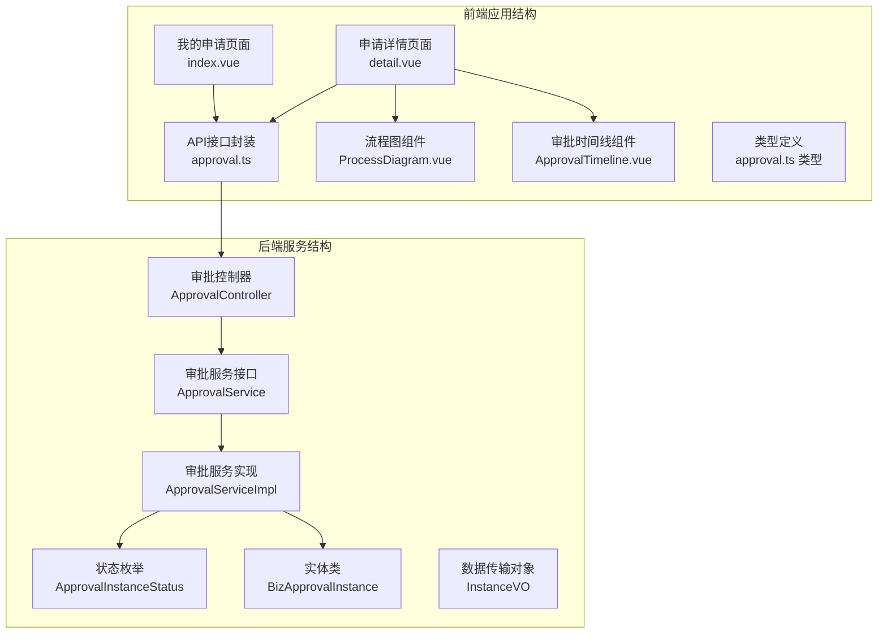

**图表来源**
- [index.vue:1-178](file://oa-ui/src/views/approval/my-apply/index.vue#L1-L178)
- [detail.vue:1-124](file://oa-ui/src/views/approval/instance/detail.vue#L1-L124)
- [ApprovalController.java:1-252](file://oa-approval/src/main/java/com/oa/admin/approval/controller/ApprovalController.java#L1-L252)

**章节来源**
- [index.vue:1-178](file://oa-ui/src/views/approval/my-apply/index.vue#L1-L178)
- [approval.ts:1-71](file://oa-ui/src/api/approval.ts#L1-L71)

## 核心组件

### 前端核心组件

**我的申请页面组件**
- **组件名称**: index.vue
- **功能定位**: 主要的申请列表展示页面
- **核心特性**: 支持搜索、筛选、分页、状态标签展示、撤回操作
- **交互设计**: 响应式布局，支持键盘快捷键操作

**申请详情页面组件**
- **组件名称**: detail.vue
- **功能定位**: 申请详情查看和流程跟踪
- **核心特性**: 流程图可视化、审批进度跟踪、历史记录展示
- **技术实现**: 使用bpmn-js渲染BPMN流程图

**状态管理组件**
- **组件名称**: ProcessDiagram.vue, ApprovalTimeline.vue
- **功能定位**: 流程图展示和审批时间线
- **核心特性**: 实时高亮已完成和当前节点、详细的审批历史记录

### 后端核心组件

**审批控制器**
- **类名**: ApprovalController
- **职责**: 处理HTTP请求，提供RESTful API接口
- **权限控制**: 基于注解的安全访问控制
- **接口数量**: 20+个API端点

**审批服务层**
- **接口**: ApprovalService
- **实现**: ApprovalServiceImpl
- **核心功能**: 业务逻辑处理、工作流集成、状态管理
- **事务管理**: 基于注解的声明式事务

**数据模型**
- **实体类**: BizApprovalInstance
- **状态枚举**: ApprovalInstanceStatus
- **数据传输对象**: InstanceVO

**章节来源**
- [index.vue:67-178](file://oa-ui/src/views/approval/my-apply/index.vue#L67-L178)
- [detail.vue:33-124](file://oa-ui/src/views/approval/instance/detail.vue#L33-L124)
- [ApprovalController.java:29-252](file://oa-approval/src/main/java/com/oa/admin/approval/controller/ApprovalController.java#L29-L252)

## 架构概览

系统采用分层架构设计，确保关注点分离和代码可维护性：

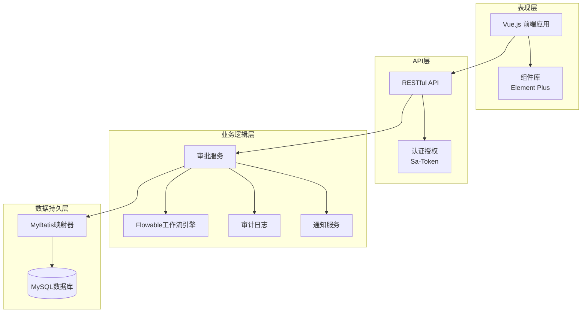

**图表来源**
- [ApprovalController.java:37-127](file://oa-approval/src/main/java/com/oa/admin/approval/controller/ApprovalController.java#L37-L127)
- [ApprovalServiceImpl.java:122-168](file://oa-approval/src/main/java/com/oa/admin/approval/service/impl/ApprovalServiceImpl.java#L122-L168)

### 数据流架构

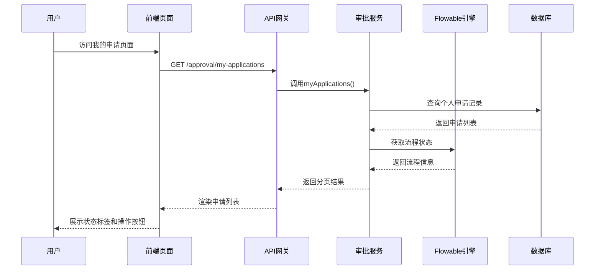

**图表来源**
- [index.vue:110-126](file://oa-ui/src/views/approval/my-apply/index.vue#L110-L126)
- [ApprovalController.java:108-115](file://oa-approval/src/main/java/com/oa/admin/approval/controller/ApprovalController.java#L108-L115)
- [ApprovalServiceImpl.java:318-335](file://oa-approval/src/main/java/com/oa/admin/approval/service/impl/ApprovalServiceImpl.java#L318-L335)

## 详细组件分析

### 申请列表展示组件

#### 组件架构设计

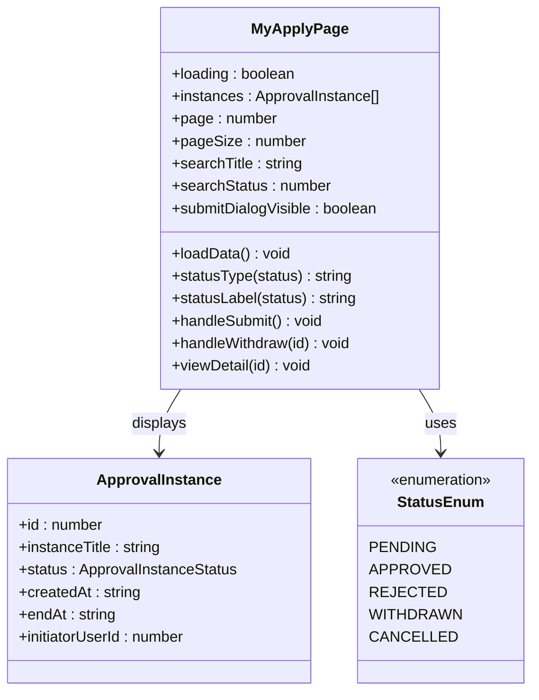

**图表来源**
- [index.vue:75-170](file://oa-ui/src/views/approval/my-apply/index.vue#L75-L170)
- [approval.ts 类型定义:32-43](file://oa-ui/src/types/approval.ts#L32-L43)
- [ApprovalInstanceStatus.java:11-28](file://oa-approval/src/main/java/com/oa/admin/approval/enums/ApprovalInstanceStatus.java#L11-L28)

#### 状态分类与视觉设计

| 状态代码 | 状态名称 | 视觉类型 | 颜色标识 | 中文显示 |
|---------|----------|----------|----------|----------|
| 1 | PENDING | info | 蓝色 | 审批中 |
| 2 | APPROVED | success | 绿色 | 通过 |
| 3 | REJECTED | danger | 红色 | 驳回 |
| 4 | WITHDRAWN | warning | 橙色 | 已撤回 |
| 5 | CANCELLED | info | 蓝色 | 已终止 |

**状态标签设计规范**
- **审批中**: 蓝色标签，表示流程正在处理中
- **通过**: 绿色标签，表示审批已通过
- **驳回**: 红色标签，表示审批被拒绝
- **已撤回**: 橙色标签，表示申请人主动撤回
- **已终止**: 蓝色标签，表示管理员终止流程

#### 搜索与筛选功能

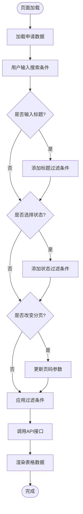

**图表来源**
- [index.vue:110-126](file://oa-ui/src/views/approval/my-apply/index.vue#L110-L126)
- [approval.ts:40-42](file://oa-ui/src/api/approval.ts#L40-L42)

**章节来源**
- [index.vue:88-108](file://oa-ui/src/views/approval/my-apply/index.vue#L88-L108)
- [index.vue:110-126](file://oa-ui/src/views/approval/my-apply/index.vue#L110-L126)

### 申请详情查看功能

#### 流程图展示组件

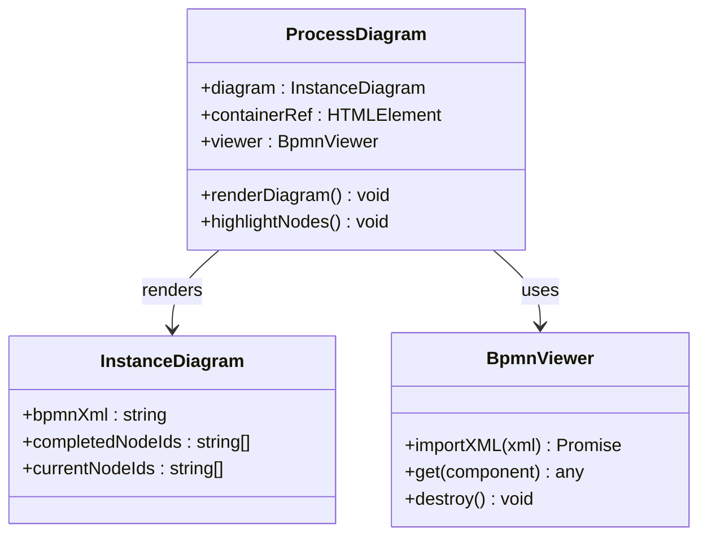

**图表来源**
- [ProcessDiagram.vue:10-64](file://oa-ui/src/views/approval/instance/components/ProcessDiagram.vue#L10-L64)
- [approval.ts 类型定义:101-105](file://oa-ui/src/types/approval.ts#L101-L105)

#### 审批进度跟踪

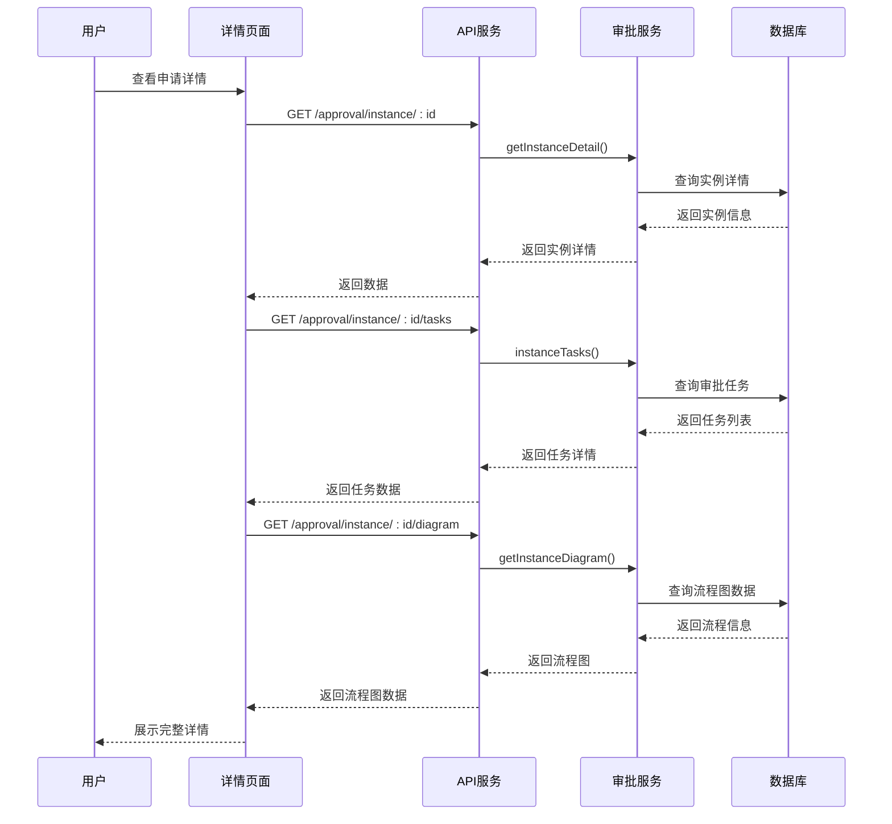

**图表来源**
- [detail.vue:80-97](file://oa-ui/src/views/approval/instance/detail.vue#L80-L97)
- [approval.ts:44-54](file://oa-ui/src/api/approval.ts#L44-L54)

**章节来源**
- [detail.vue:14-30](file://oa-ui/src/views/approval/instance/detail.vue#L14-L30)
- [ProcessDiagram.vue:17-57](file://oa-ui/src/views/approval/instance/components/ProcessDiagram.vue#L17-L57)
- [ApprovalTimeline.vue:1-100](file://oa-ui/src/views/approval/instance/components/ApprovalTimeline.vue#L1-L100)

### 申请撤回功能

#### 权限控制与业务逻辑

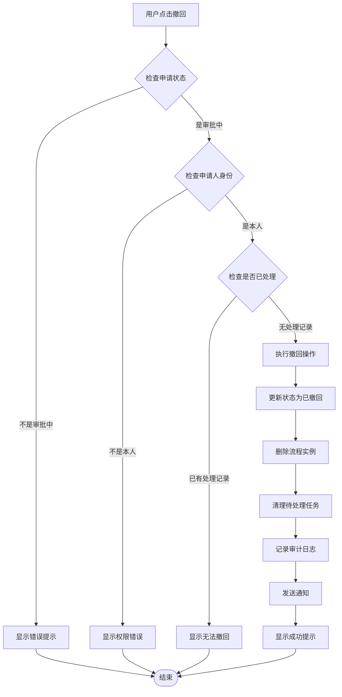

**图表来源**
- [index.vue:153-161](file://oa-ui/src/views/approval/my-apply/index.vue#L153-L161)
- [ApprovalServiceImpl.java:264-307](file://oa-approval/src/main/java/com/oa/admin/approval/service/impl/ApprovalServiceImpl.java#L264-L307)

#### 撤回权限验证

撤回功能实现了严格的权限控制机制：

1. **身份验证**: 必须是申请流程的发起人才能撤回
2. **状态验证**: 只有处于审批中状态的申请才能撤回
3. **处理状态验证**: 如果流程中已有任何审批记录，则不允许撤回
4. **流程清理**: 自动清理相关的待处理任务和流程实例

**章节来源**
- [index.vue:28-28](file://oa-ui/src/views/approval/my-apply/index.vue#L28-L28)
- [ApprovalServiceImpl.java:264-307](file://oa-approval/src/main/java/com/oa/admin/approval/service/impl/ApprovalServiceImpl.java#L264-L307)

### 通知机制与用户体验优化

#### 通知类型与触发时机

| 通知类型 | 触发时机 | 通知内容 | 目标用户 |
|---------|----------|----------|----------|
| approved | 审批通过 | "审批已通过" | 申请人 |
| rejected | 审批驳回 | "审批已驳回" | 申请人 |
| task_transferred | 任务转办 | "收到转办任务" | 接收人 |
| instance_terminated | 流程终止 | "审批已被管理员终止" | 申请人 |
| pending_task | 新任务待处理 | "您有新的待处理任务" | 处理人 |

#### 用户体验优化策略

1. **实时状态更新**: 列表自动刷新，状态变化即时反映
2. **批量操作**: 支持分页批量处理
3. **响应式设计**: 适配不同屏幕尺寸
4. **错误处理**: 友好的错误提示和恢复机制
5. **加载状态**: 显示加载指示器提升用户体验

**章节来源**
- [ApprovalServiceImpl.java:222-232](file://oa-approval/src/main/java/com/oa/admin/approval/service/impl/ApprovalServiceImpl.java#L222-L232)
- [NotificationServiceImpl.java:27-44](file://oa-approval/src/main/java/com/oa/admin/approval/service/impl/NotificationServiceImpl.java#L27-L44)

## 依赖关系分析

### 前端依赖关系

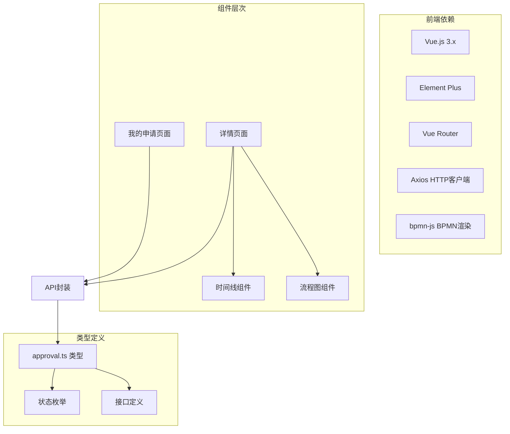

**图表来源**
- [index.vue:71-73](file://oa-ui/src/views/approval/my-apply/index.vue#L71-L73)
- [detail.vue:36-40](file://oa-ui/src/views/approval/instance/detail.vue#L36-L40)

### 后端依赖关系

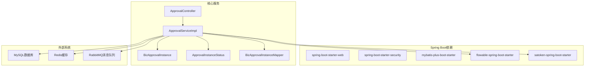

**图表来源**
- [ApprovalController.java:1-252](file://oa-approval/src/main/java/com/oa/admin/approval/controller/ApprovalController.java#L1-L252)
- [ApprovalServiceImpl.java:110-792](file://oa-approval/src/main/java/com/oa/admin/approval/service/impl/ApprovalServiceImpl.java#L110-L792)

**章节来源**
- [ApprovalController.java:1-252](file://oa-approval/src/main/java/com/oa/admin/approval/controller/ApprovalController.java#L1-L252)
- [ApprovalServiceImpl.java:1-792](file://oa-approval/src/main/java/com/oa/admin/approval/service/impl/ApprovalServiceImpl.java#L1-L792)

## 性能考虑

### 前端性能优化

1. **虚拟滚动**: 对于大量数据的表格，建议实现虚拟滚动以提升渲染性能
2. **懒加载**: 图片和复杂组件采用懒加载策略
3. **缓存策略**: 列表数据采用适当的缓存机制
4. **防抖处理**: 搜索框输入采用防抖机制减少API调用

### 后端性能优化

1. **分页查询**: 所有列表查询都支持分页，避免全量数据传输
2. **索引优化**: 关键查询字段建立适当索引
3. **连接池配置**: 合理配置数据库连接池参数
4. **缓存策略**: 对频繁访问的数据实施缓存

### 数据库设计优化

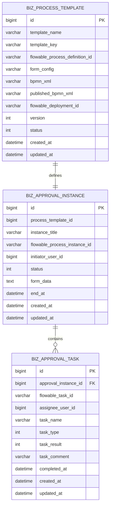

**图表来源**
- [BizApprovalInstance.java:19-33](file://oa-approval/src/main/java/com/oa/admin/approval/entity/BizApprovalInstance.java#L19-L33)
- [InstanceVO.java:11-21](file://oa-approval/src/main/java/com/oa/admin/approval/dto/InstanceVO.java#L11-L21)

## 故障排除指南

### 常见问题及解决方案

**问题1: 申请列表为空**
- **可能原因**: 用户没有发起过任何申请
- **解决方案**: 引导用户使用"发起申请"按钮创建新申请
- **前端处理**: 显示友好提示信息

**问题2: 状态显示异常**
- **可能原因**: 缓存数据未及时更新
- **解决方案**: 提供手动刷新按钮，或设置定时刷新机制
- **后端处理**: 确保状态变更后及时更新缓存

**问题3: 撤回失败**
- **可能原因**: 申请已被其他用户处理
- **解决方案**: 检查申请状态，如果已处理则无法撤回
- **错误提示**: 显示具体的失败原因

**问题4: 流程图渲染失败**
- **可能原因**: BPMN文件格式不正确
- **解决方案**: 验证BPMN文件有效性，重新部署流程定义
- **降级处理**: 提供文本形式的流程说明

**章节来源**
- [index.vue:121-125](file://oa-ui/src/views/approval/my-apply/index.vue#L121-L125)
- [ApprovalServiceImpl.java:286-307](file://oa-approval/src/main/java/com/oa/admin/approval/service/impl/ApprovalServiceImpl.java#L286-L307)

### 日志监控

系统实现了完整的审计日志记录机制：

1. **操作日志**: 记录所有重要操作的时间、用户、结果
2. **错误日志**: 捕获并记录系统异常和错误信息
3. **性能监控**: 监控API响应时间和数据库查询性能
4. **安全审计**: 记录权限访问和敏感操作

## 结论

我的申请页面作为OA审批管理系统的核心功能模块，成功实现了以下目标：

**功能完整性**: 提供了从申请发起到状态跟踪的完整审批流程管理能力，支持多种状态分类和可视化展示。

**用户体验优化**: 采用现代化的前端技术栈，提供响应式设计和流畅的交互体验，包括实时状态更新、友好的错误处理和直观的操作反馈。

**安全性保障**: 实施了严格的权限控制机制，确保只有相关用户才能访问和操作相应的审批申请。

**可扩展性设计**: 采用模块化的架构设计，便于后续功能扩展和性能优化。

**技术先进性**: 集成了Flowable工作流引擎，支持复杂的审批流程配置和动态流程管理。

该页面为企业的日常审批管理工作提供了高效、可靠的数字化解决方案，显著提升了审批效率和管理水平。