# 抄送管理页面

<cite>
**本文档引用的文件**
- [index.vue](file://oa-ui/src/views/approval/cc/index.vue)
- [approval.ts](file://oa-ui/src/api/approval.ts)
- [approval.ts](file://oa-ui/src/types/approval.ts)
- [ApprovalController.java](file://oa-approval/src/main/java/com/oa/admin/approval/controller/ApprovalController.java)
- [ApprovalCcService.java](file://oa-approval/src/main/java/com/oa/admin/approval/service/ApprovalCcService.java)
- [ApprovalCcServiceImpl.java](file://oa-approval/src/main/java/com/oa/admin/approval/service/impl/ApprovalCcServiceImpl.java)
- [BizApprovalCc.java](file://oa-approval/src/main/java/com/oa/admin/approval/entity/BizApprovalCc.java)
- [BizApprovalCcMapper.java](file://oa-approval/src/main/java/com/oa/admin/approval/mapper/BizApprovalCcMapper.java)
- [CcVO.java](file://oa-approval/src/main/java/com/oa/admin/approval/dto/CcVO.java)
- [NotificationController.java](file://oa-approval/src/main/java/com/oa/admin/approval/controller/NotificationController.java)
- [NotificationService.java](file://oa-approval/src/main/java/com/oa/admin/approval/service/NotificationService.java)
- [NotificationType.java](file://oa-approval/src/main/java/com/oa/admin/approval/enums/NotificationType.java)
- [V2__init_biz_tables.sql](file://oa-app/src/main/resources/db/migration/V2__init_biz_tables.sql)
</cite>

## 目录
1. [简介](#简介)
2. [项目结构](#项目结构)
3. [核心组件](#核心组件)
4. [架构概览](#架构概览)
5. [详细组件分析](#详细组件分析)
6. [依赖关系分析](#依赖关系分析)
7. [性能考虑](#性能考虑)
8. [故障排除指南](#故障排除指南)
9. [结论](#结论)

## 简介

OA审批管理系统中的抄送管理页面是一个关键的功能模块，负责管理审批流程中的抄送记录。该页面提供了完整的抄送记录列表展示、状态管理和处理功能，支持多渠道通知机制，并具备搜索、筛选和批量操作能力。

抄送管理页面的核心价值在于确保审批流程的透明度和可追溯性，让相关人员能够及时了解审批动态并进行必要的跟进处理。

## 项目结构

抄送管理功能涉及前端Vue组件、后端Spring Boot服务以及数据库存储三个层面：

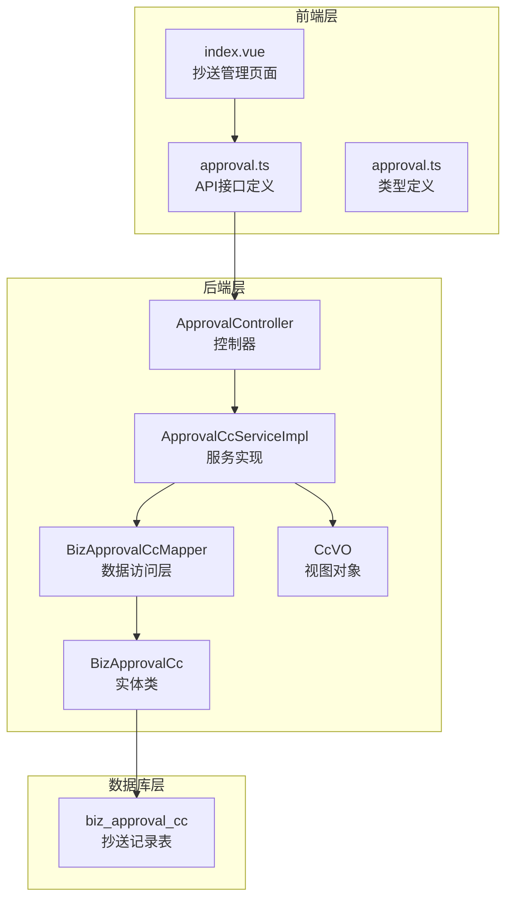

**图表来源**
- [index.vue:1-61](file://oa-ui/src/views/approval/cc/index.vue#L1-L61)
- [ApprovalController.java:217-228](file://oa-approval/src/main/java/com/oa/admin/approval/controller/ApprovalController.java#L217-L228)
- [ApprovalCcServiceImpl.java:27-102](file://oa-approval/src/main/java/com/oa/admin/approval/service/impl/ApprovalCcServiceImpl.java#L27-L102)
- [BizApprovalCc.java:16-28](file://oa-approval/src/main/java/com/oa/admin/approval/entity/BizApprovalCc.java#L16-L28)
- [BizApprovalCcMapper.java:10-12](file://oa-approval/src/main/java/com/oa/admin/approval/mapper/BizApprovalCcMapper.java#L10-L12)

**章节来源**
- [index.vue:1-61](file://oa-ui/src/views/approval/cc/index.vue#L1-L61)
- [ApprovalController.java:217-228](file://oa-approval/src/main/java/com/oa/admin/approval/controller/ApprovalController.java#L217-L228)

## 核心组件

### 数据模型设计

抄送管理采用简洁而高效的数据模型设计，核心实体包含以下关键字段：

| 字段名 | 类型 | 描述 | 索引 |
|--------|------|------|------|
| id | BIGINT | 主键标识 | PRIMARY KEY |
| approval_instance_id | BIGINT | 审批实例ID | INDEX |
| cc_user_id | BIGINT | 抄送用户ID | INDEX |
| cc_reason | VARCHAR(500) | 抄送原因 | - |
| read_at | DATETIME | 已读时间 | - |
| created_at | DATETIME | 创建时间 | - |

### 前端组件架构

前端采用Vue 3 Composition API模式，实现了响应式的数据绑定和用户交互：

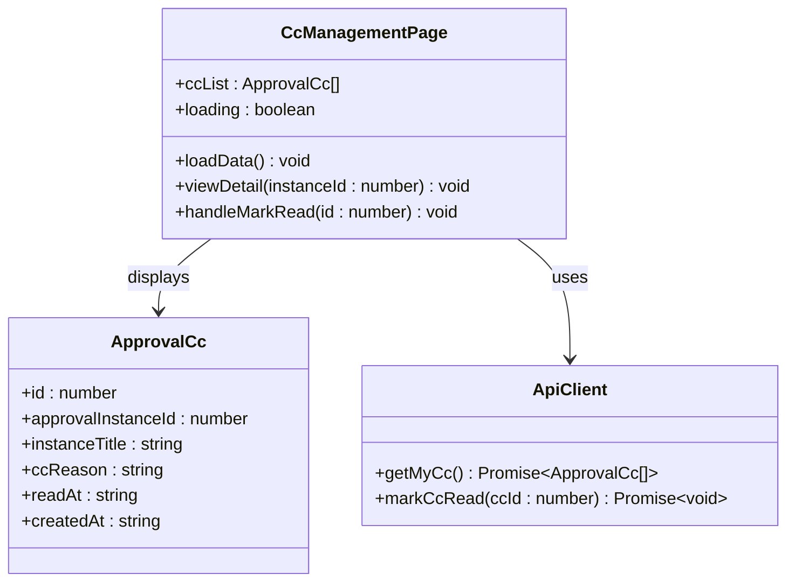

**图表来源**
- [index.vue:26-60](file://oa-ui/src/views/approval/cc/index.vue#L26-L60)
- [approval.ts:59-69](file://oa-ui/src/types/approval.ts#L59-L69)
- [approval.ts:32-38](file://oa-ui/src/api/approval.ts#L32-L38)

**章节来源**
- [BizApprovalCc.java:16-28](file://oa-approval/src/main/java/com/oa/admin/approval/entity/BizApprovalCc.java#L16-L28)
- [CcVO.java:13-26](file://oa-approval/src/main/java/com/oa/admin/approval/dto/CcVO.java#L13-L26)
- [index.vue:1-61](file://oa-ui/src/views/approval/cc/index.vue#L1-L61)

## 架构概览

抄送管理页面采用经典的三层架构设计，实现了清晰的关注点分离：

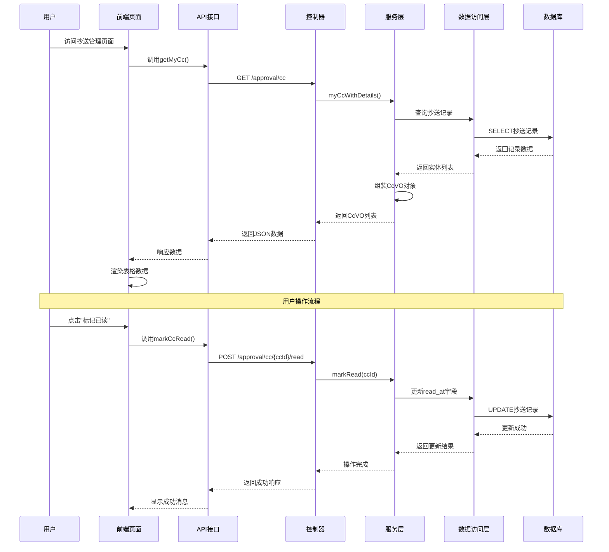

**图表来源**
- [index.vue:37-57](file://oa-ui/src/views/approval/cc/index.vue#L37-L57)
- [approval.ts:32-38](file://oa-ui/src/api/approval.ts#L32-L38)
- [ApprovalController.java:217-228](file://oa-approval/src/main/java/com/oa/admin/approval/controller/ApprovalController.java#L217-L228)
- [ApprovalCcServiceImpl.java:73-87](file://oa-approval/src/main/java/com/oa/admin/approval/service/impl/ApprovalCcServiceImpl.java#L73-L87)

## 详细组件分析

### 抄送记录列表展示

抄送记录列表页面提供了直观的信息展示界面，包含以下核心列：

#### 列表字段说明

| 字段 | 显示名称 | 数据类型 | 功能说明 |
|------|----------|----------|----------|
| instanceTitle | 申请标题 | 文本 | 显示审批实例的主题内容 |
| ccReason | 抄送原因 | 文本 | 显示抄送的具体原因或说明 |
| readAt | 阅读时间 | 日期时间 | 显示用户已读时间，未读时显示"未读"标签 |
| createdAt | 抄送时间 | 日期时间 | 显示抄送记录创建时间 |
| 操作 | 操作按钮 | 按钮组 | 提供查看详情和标记已读功能 |

#### 状态显示逻辑

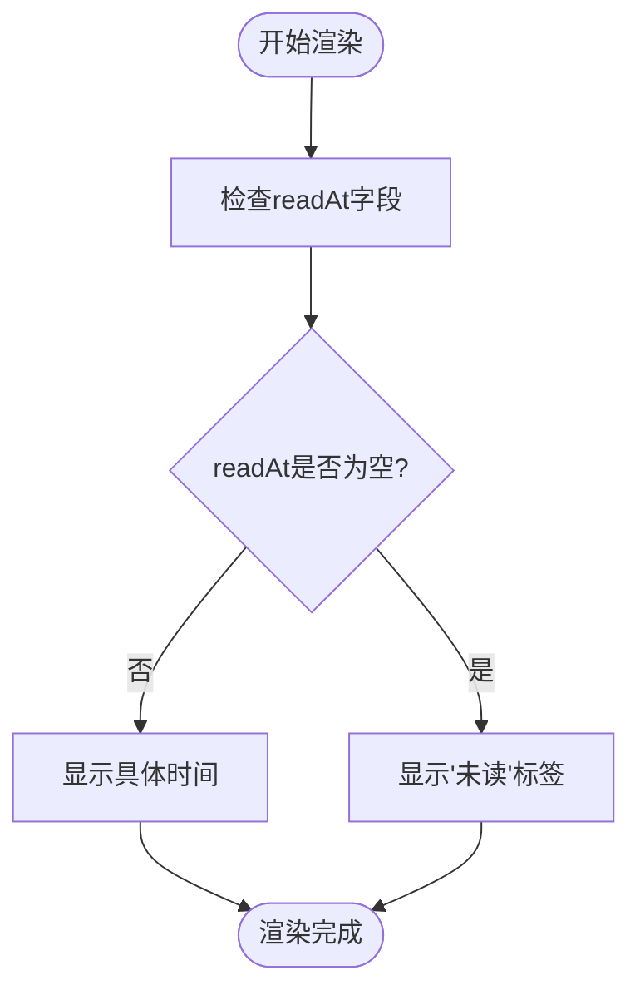

**图表来源**
- [index.vue:8-13](file://oa-ui/src/views/approval/cc/index.vue#L8-L13)

**章节来源**
- [index.vue:5-21](file://oa-ui/src/views/approval/cc/index.vue#L5-L21)

### 抄送状态管理机制

抄送状态管理采用简单而有效的设计，主要通过`read_at`字段来跟踪抄送记录的阅读状态。

#### 状态转换流程

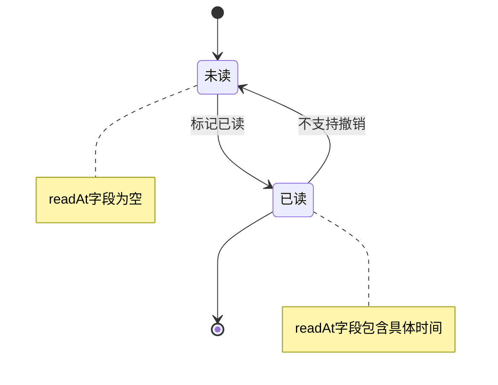

**图表来源**
- [ApprovalCcServiceImpl.java:73-87](file://oa-approval/src/main/java/com/oa/admin/approval/service/impl/ApprovalCcServiceImpl.java#L73-L87)
- [BizApprovalCc.java:26-27](file://oa-approval/src/main/java/com/oa/admin/approval/entity/BizApprovalCc.java#L26-L27)

#### 状态验证机制

系统实现了严格的状态验证，确保数据完整性和安全性：

| 验证场景 | 验证逻辑 | 错误处理 |
|----------|----------|----------|
| 记录存在性 | 检查ccId对应的记录是否存在 | 返回404错误 |
| 用户权限 | 验证当前用户是否为抄送接收人 | 返回403错误 |
| 状态重复 | 检查记录是否已经是已读状态 | 直接返回成功 |

**章节来源**
- [ApprovalCcServiceImpl.java:73-87](file://oa-approval/src/main/java/com/oa/admin/approval/service/impl/ApprovalCcServiceImpl.java#L73-L87)

### 抄送记录查看和处理

#### 查看详情功能

用户可以通过点击"查看"按钮跳转到相应的审批实例详情页面，实现无缝的用户体验。

#### 处理操作流程

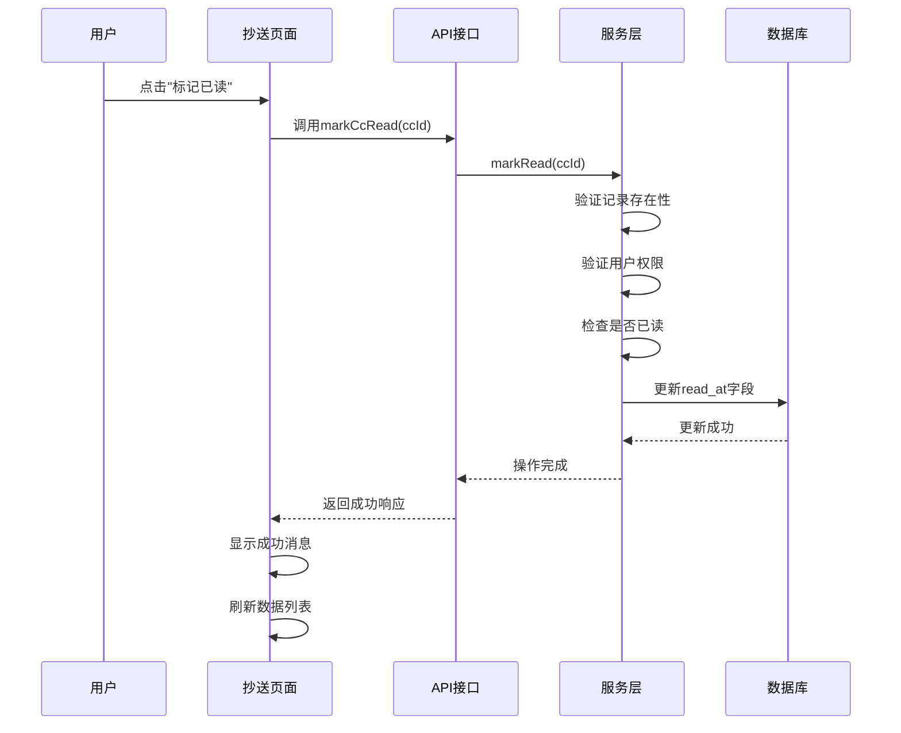

**图表来源**
- [index.vue:51-57](file://oa-ui/src/views/approval/cc/index.vue#L51-L57)
- [approval.ts:36-38](file://oa-ui/src/api/approval.ts#L36-L38)
- [ApprovalController.java:223-228](file://oa-approval/src/main/java/com/oa/admin/approval/controller/ApprovalController.java#L223-L228)

**章节来源**
- [index.vue:47-57](file://oa-ui/src/views/approval/cc/index.vue#L47-L57)
- [approval.ts:36-38](file://oa-ui/src/api/approval.ts#L36-L38)

### 抄送通知机制

系统实现了多渠道的通知机制，确保抄送信息能够及时传达给相关人员。

#### 通知类型定义

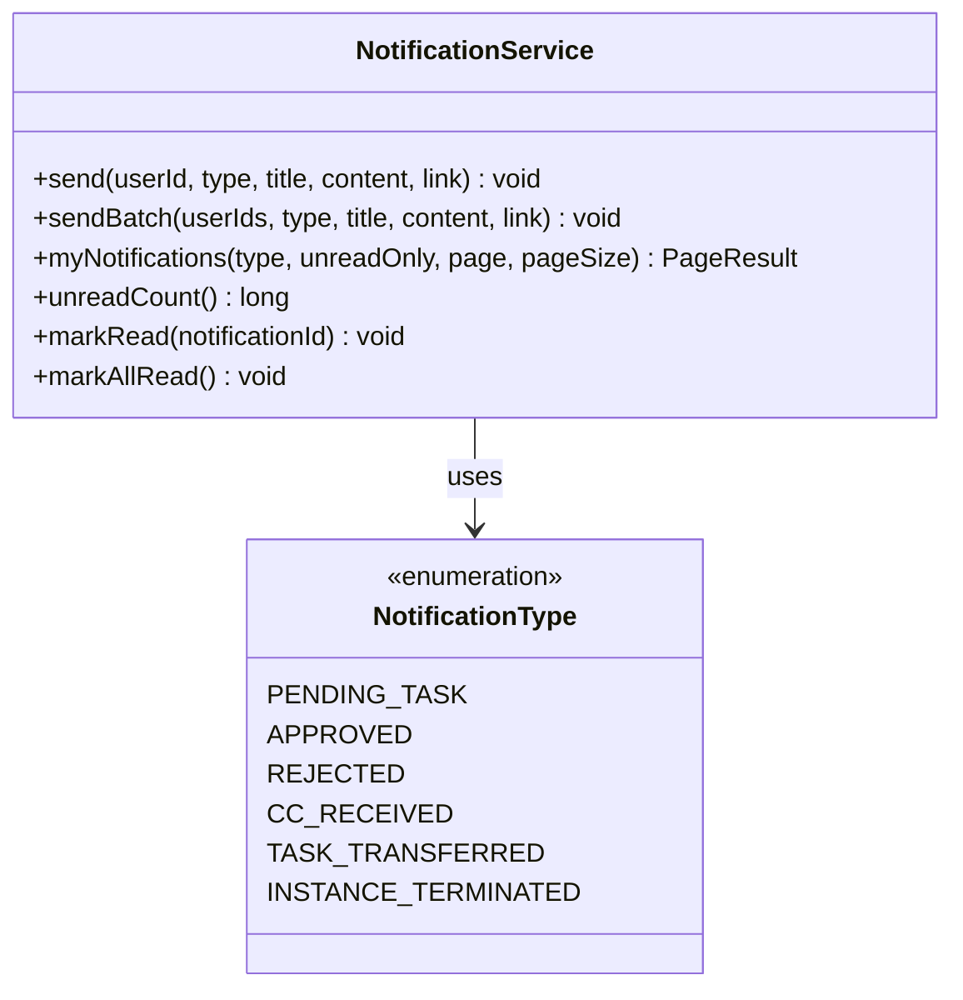

**图表来源**
- [NotificationType.java:11-17](file://oa-approval/src/main/java/com/oa/admin/approval/enums/NotificationType.java#L11-L17)
- [NotificationService.java:10-23](file://oa-approval/src/main/java/com/oa/admin/approval/service/NotificationService.java#L10-L23)

#### 通知发送流程

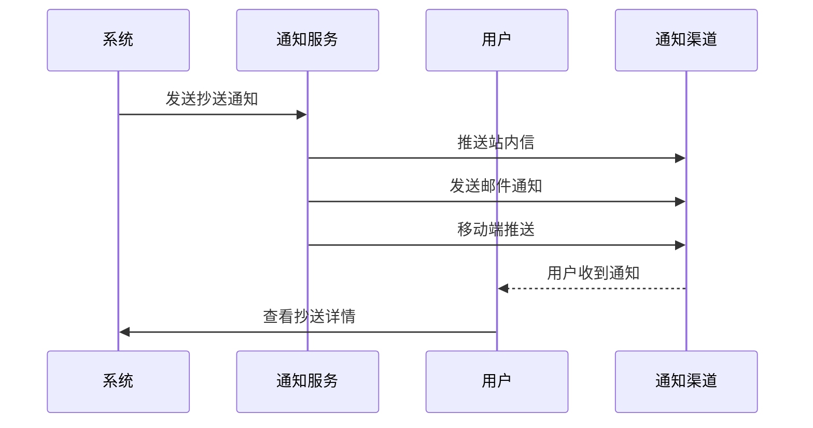

**图表来源**
- [NotificationController.java:21-45](file://oa-approval/src/main/java/com/oa/admin/approval/controller/NotificationController.java#L21-L45)

**章节来源**
- [NotificationType.java:11-17](file://oa-approval/src/main/java/com/oa/admin/approval/enums/NotificationType.java#L11-L17)
- [NotificationService.java:12-22](file://oa-approval/src/main/java/com/oa/admin/approval/service/NotificationService.java#L12-L22)

### 搜索、筛选和批量操作

#### 搜索功能实现

虽然当前版本的抄送管理页面主要提供基础的列表展示，但系统架构支持扩展搜索和筛选功能：

| 搜索维度 | 实现方式 | 性能考虑 |
|----------|----------|----------|
| 按标题搜索 | 前端过滤或后端模糊查询 | 建议使用后端分页查询 |
| 按抄送原因 | 前端过滤或后端条件查询 | 建议添加索引优化 |
| 按时间范围 | 后端日期范围查询 | 使用数据库索引提高性能 |

#### 批量操作设计

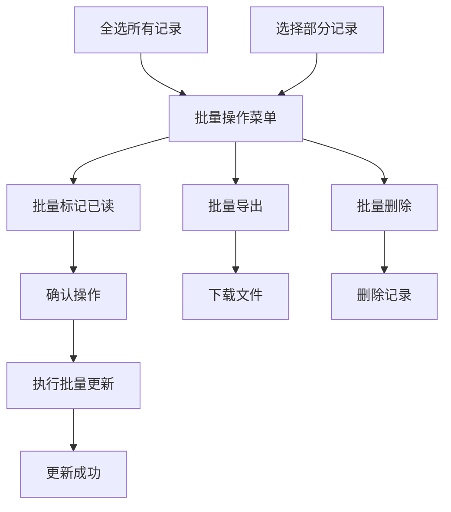

### 抄送效率统计和质量评估

#### 统计指标设计

系统可以基于现有数据结构实现多种统计分析：

| 统计维度 | 指标定义 | 计算方法 |
|----------|----------|----------|
| 抄送效率 | 平均阅读时间 | 已读记录read_at与created_at的时间差平均值 |
| 响应速度 | 首次响应时间 | 第一次阅读时间与抄送时间的差值 |
| 覆盖率 | 抄送完成率 | 已读记录数/总抄送记录数×100% |
| 及时性 | 及时阅读率 | 在规定时间内阅读的记录比例 |

#### 质量评估模型

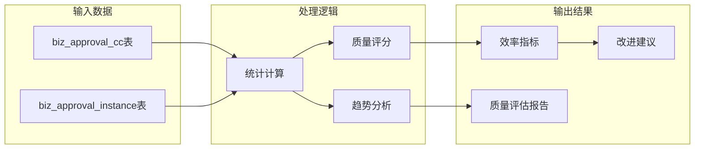

## 依赖关系分析

抄送管理功能的依赖关系体现了清晰的分层架构：

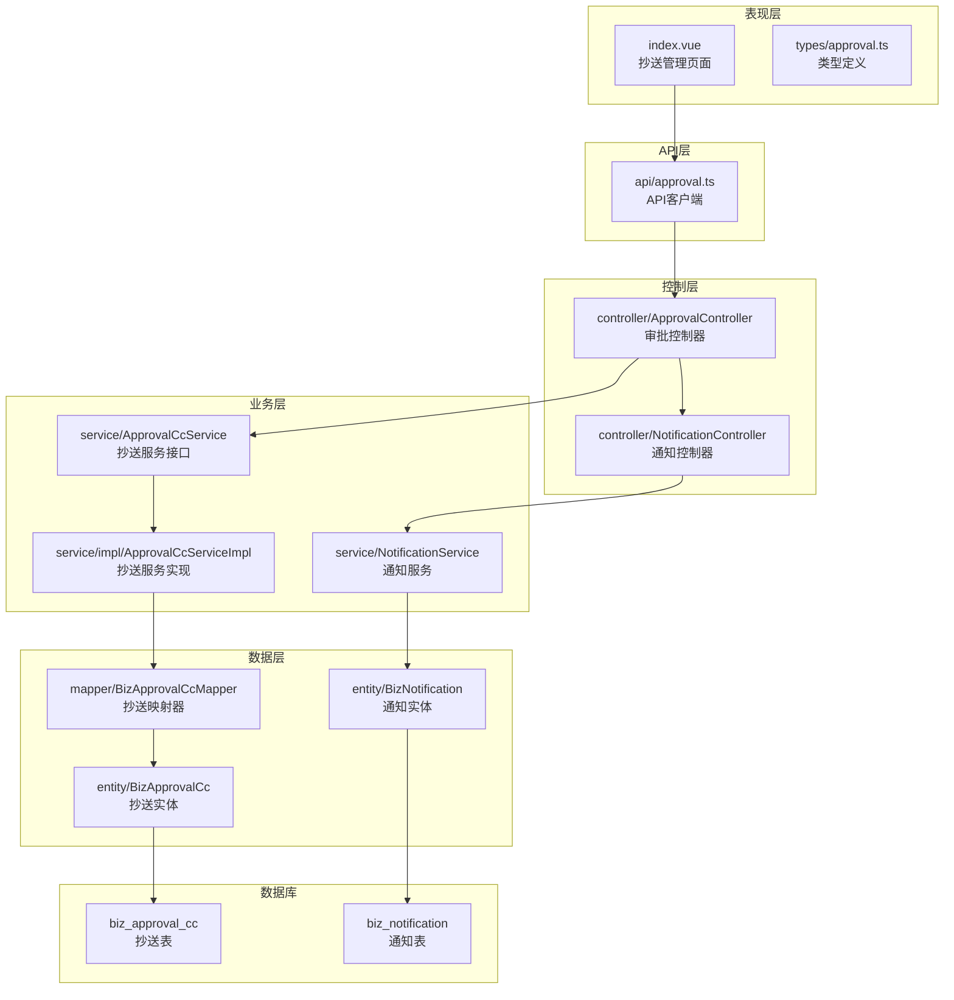

**图表来源**
- [index.vue:30-31](file://oa-ui/src/views/approval/cc/index.vue#L30-L31)
- [ApprovalController.java:35-36](file://oa-approval/src/main/java/com/oa/admin/approval/controller/ApprovalController.java#L35-L36)
- [ApprovalCcServiceImpl.java:9-11](file://oa-approval/src/main/java/com/oa/admin/approval/service/impl/ApprovalCcServiceImpl.java#L9-L11)
- [BizApprovalCcMapper.java:10-12](file://oa-approval/src/main/java/com/oa/admin/approval/mapper/BizApprovalCcMapper.java#L10-L12)

**章节来源**
- [ApprovalCcServiceImpl.java:27-102](file://oa-approval/src/main/java/com/oa/admin/approval/service/impl/ApprovalCcServiceImpl.java#L27-L102)

## 性能考虑

### 数据库优化

#### 索引策略

| 表名 | 索引字段 | 用途 | 性能收益 |
|------|----------|------|----------|
| biz_approval_cc | idx_cc_user | 用户查询 | 快速定位个人抄送记录 |
| biz_approval_cc | idx_instance_id | 实例关联 | 快速查询实例相关抄送 |
| biz_approval_cc | idx_created_at | 时间排序 | 支持按时间倒序排列 |

#### 查询优化

```sql
-- 优化后的抄送记录查询
SELECT 
    c.id,
    c.approval_instance_id,
    c.cc_user_id,
    c.cc_reason,
    c.read_at,
    c.created_at,
    i.instance_title,
    i.status as instance_status
FROM biz_approval_cc c
LEFT JOIN biz_approval_instance i ON c.approval_instance_id = i.id
WHERE c.cc_user_id = ?
ORDER BY c.created_at DESC
LIMIT ?
```

### 缓存策略

建议实现多级缓存机制：

1. **Redis缓存**：缓存用户的抄送统计信息
2. **本地缓存**：缓存最近访问的抄送记录
3. **浏览器缓存**：缓存静态配置和用户偏好设置

### 分页查询

对于大量抄送记录的场景，建议实现智能分页：

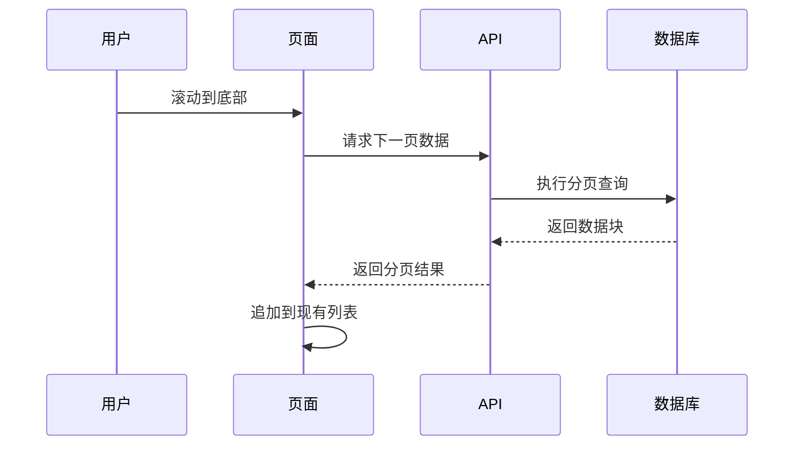

## 故障排除指南

### 常见问题及解决方案

#### 抄送记录无法显示

**问题症状**：页面显示空白或加载失败

**可能原因**：
1. 用户未登录或会话过期
2. 权限不足
3. 数据库连接异常

**解决步骤**：
1. 检查用户登录状态
2. 验证审批:cc权限
3. 查看数据库连接日志

#### 标记已读失败

**问题症状**：点击"标记已读"按钮无响应

**可能原因**：
1. 网络请求超时
2. 服务器内部错误
3. 数据不一致

**解决步骤**：
1. 检查网络连接
2. 查看服务器错误日志
3. 验证数据完整性

#### 通知未送达

**问题症状**：用户未收到抄送通知

**可能原因**：
1. 通知服务配置错误
2. 用户联系方式无效
3. 第三方服务异常

**解决步骤**：
1. 检查通知服务配置
2. 验证用户联系方式
3. 测试第三方服务可用性

**章节来源**
- [ApprovalCcServiceImpl.java:73-87](file://oa-approval/src/main/java/com/oa/admin/approval/service/impl/ApprovalCcServiceImpl.java#L73-L87)
- [NotificationController.java:21-45](file://oa-approval/src/main/java/com/oa/admin/approval/controller/NotificationController.java#L21-L45)

## 结论

抄送管理页面作为OA审批系统的重要组成部分，展现了现代企业级应用的设计理念和技术实现。通过合理的架构设计、完善的数据模型和丰富的功能特性，该页面为用户提供了高效、便捷的抄送管理体验。

### 核心优势

1. **简洁高效**：采用最小必要功能设计，专注于核心抄送管理需求
2. **安全可靠**：完善的权限验证和数据校验机制
3. **扩展性强**：清晰的架构层次支持功能扩展和性能优化
4. **用户体验**：直观的界面设计和流畅的操作流程

### 发展建议

1. **增强搜索功能**：添加按标题、时间、状态等多维度搜索
2. **优化移动端**：提升移动设备上的使用体验
3. **引入统计分析**：提供更详细的抄送效率和质量分析
4. **扩展通知渠道**：支持更多通知方式和自定义模板

该抄送管理页面为整个OA系统的协同办公功能奠定了坚实基础，通过持续优化和功能扩展，将进一步提升企业的数字化管理水平。