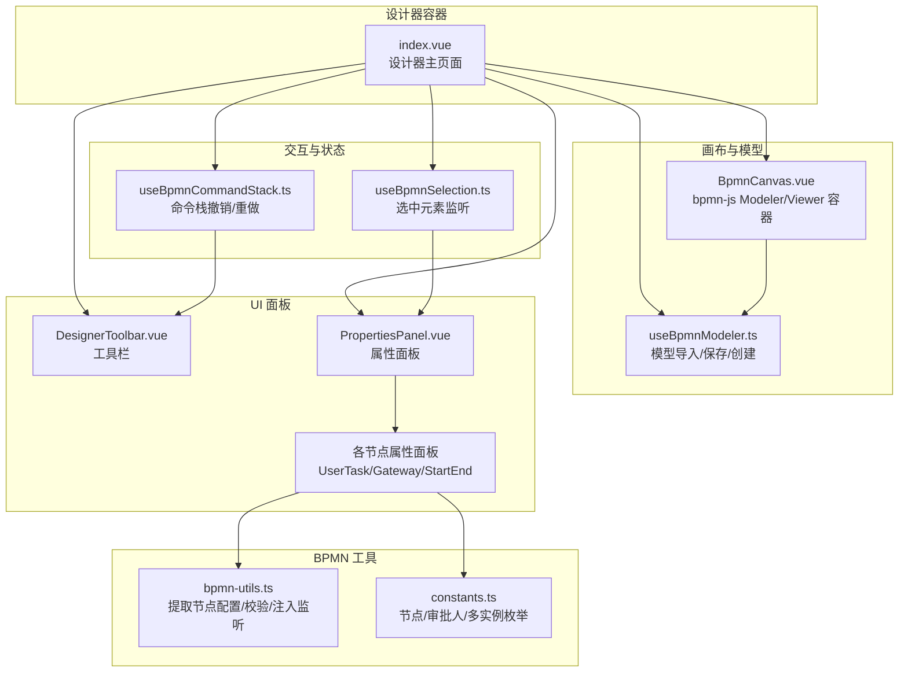
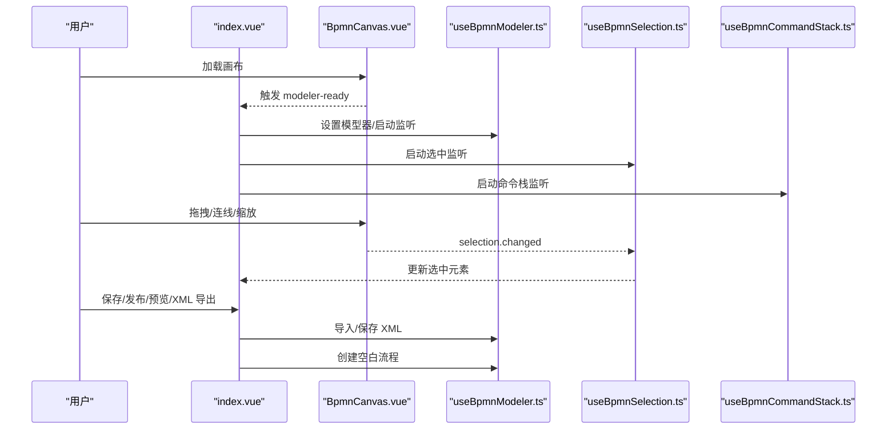
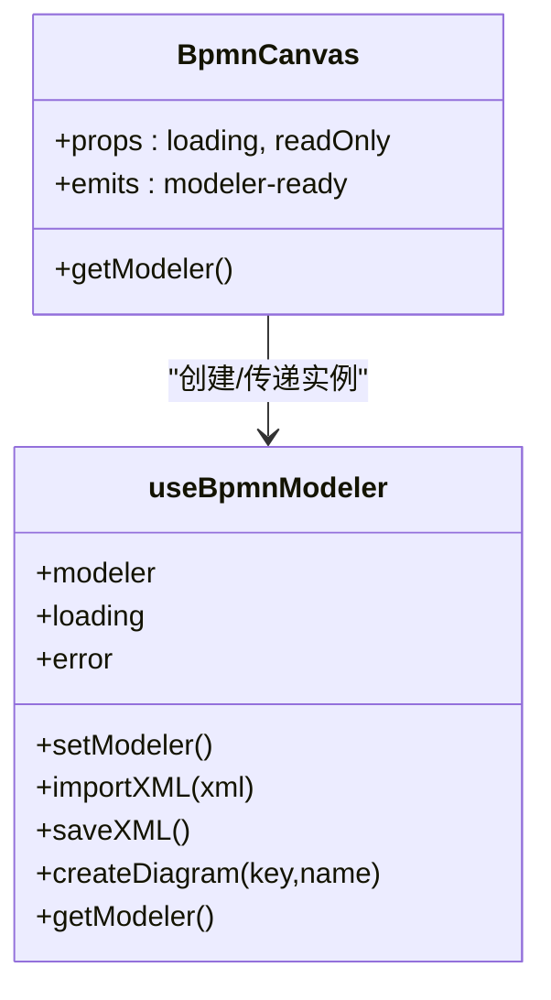
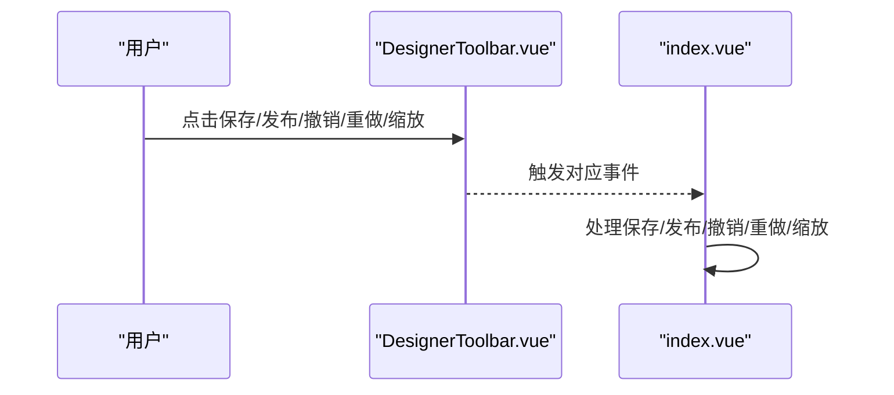
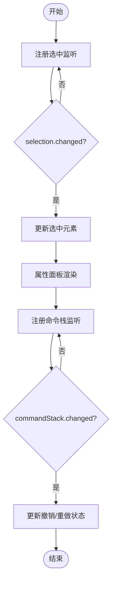
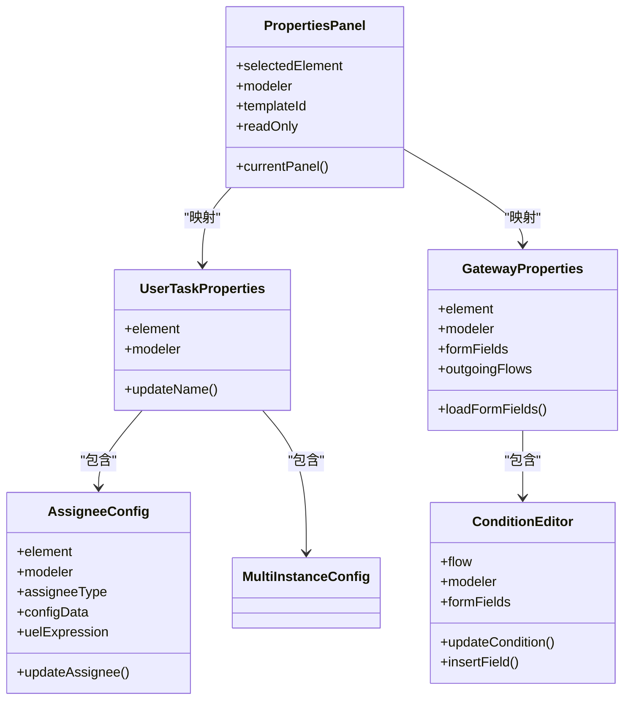
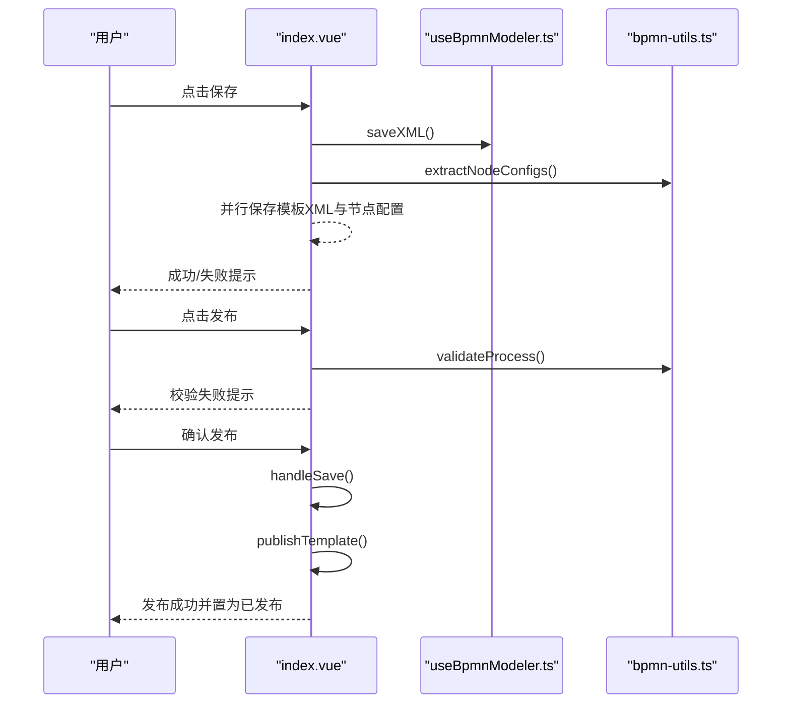
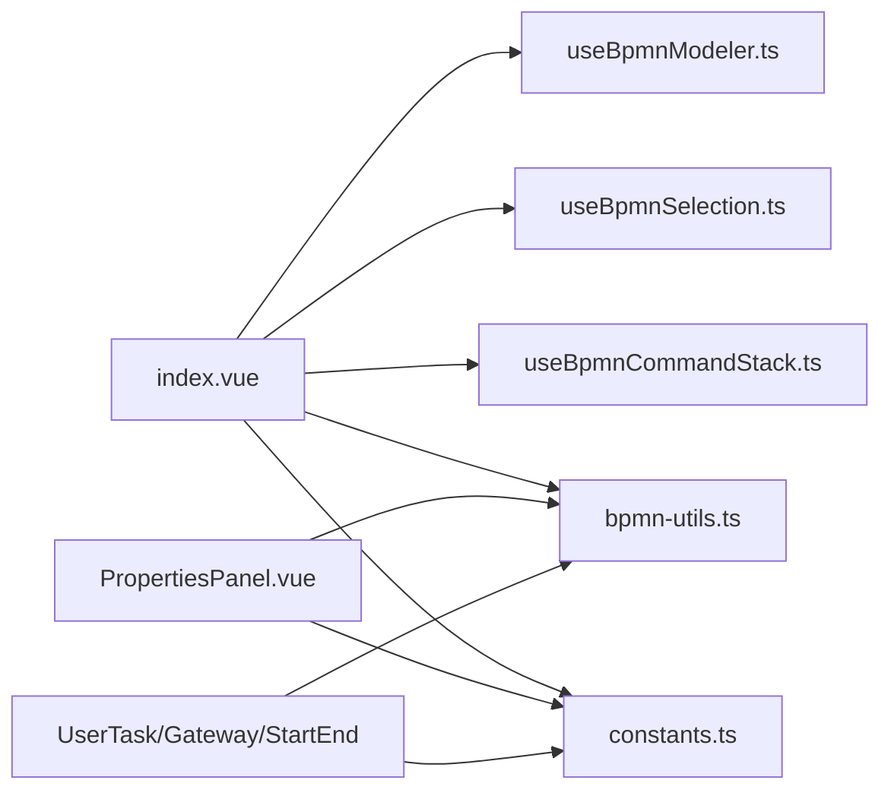

# 流程设计器

<cite>
**本文引用的文件**
- [index.vue](file://oa-ui/src/views/approval/template/designer/index.vue)
- [BpmnCanvas.vue](file://oa-ui/src/views/approval/template/designer/components/BpmnCanvas.vue)
- [DesignerToolbar.vue](file://oa-ui/src/views/approval/template/designer/components/DesignerToolbar.vue)
- [PropertiesPanel.vue](file://oa-ui/src/views/approval/template/designer/components/PropertiesPanel.vue)
- [UserTaskProperties.vue](file://oa-ui/src/views/approval/template/designer/components/panels/UserTaskProperties.vue)
- [StartEndProperties.vue](file://oa-ui/src/views/approval/template/designer/components/panels/StartEndProperties.vue)
- [GatewayProperties.vue](file://oa-ui/src/views/approval/template/designer/components/panels/GatewayProperties.vue)
- [AssigneeConfig.vue](file://oa-ui/src/views/approval/template/designer/components/panels/AssigneeConfig.vue)
- [ConditionEditor.vue](file://oa-ui/src/views/approval/template/designer/components/panels/ConditionEditor.vue)
- [useBpmnModeler.ts](file://oa-ui/src/composables/bpmn/useBpmnModeler.ts)
- [useBpmnSelection.ts](file://oa-ui/src/composables/bpmn/useBpmnSelection.ts)
- [useBpmnCommandStack.ts](file://oa-ui/src/composables/bpmn/useBpmnCommandStack.ts)
- [bpmn-utils.ts](file://oa-ui/src/bpmn/bpmn-utils.ts)
- [constants.ts](file://oa-ui/src/bpmn/constants.ts)
</cite>

## 目录
1. [简介](#简介)
2. [项目结构](#项目结构)
3. [核心组件](#核心组件)
4. [架构总览](#架构总览)
5. [详细组件分析](#详细组件分析)
6. [依赖关系分析](#依赖关系分析)
7. [性能与可用性](#性能与可用性)
8. [故障排查指南](#故障排查指南)
9. [结论](#结论)
10. [附录](#附录)

## 简介
本文件面向 OA 审批管理系统中的“流程设计器”页面，系统化阐述 BPMN 流程图的可视化编辑能力：画布渲染与交互、节点选择与属性配置、连接线条件表达式编辑、审批人与多实例配置、工具栏操作（撤销/重做/缩放/保存/发布/预览/XML 导出）、以及与后端模板与节点配置的持久化集成。文档同时给出关键流程时序图、类图与数据流图，帮助开发者与产品/运营人员快速理解与使用。

## 项目结构
流程设计器位于前端模块 oa-ui 的审批模板设计页，采用 Vue 3 + TypeScript + bpmn-js 实现。核心由“设计器容器 + 画布 + 属性面板 + 工具栏 + 组合式函数 + BPMN 工具集”构成。

图表来源
- [index.vue:1-324](file://oa-ui/src/views/approval/template/designer/index.vue#L1-L324)
- [BpmnCanvas.vue:1-107](file://oa-ui/src/views/approval/template/designer/components/BpmnCanvas.vue#L1-L107)
- [DesignerToolbar.vue:1-132](file://oa-ui/src/views/approval/template/designer/components/DesignerToolbar.vue#L1-L132)
- [PropertiesPanel.vue:1-80](file://oa-ui/src/views/approval/template/designer/components/PropertiesPanel.vue#L1-L80)
- [UserTaskProperties.vue:1-50](file://oa-ui/src/views/approval/template/designer/components/panels/UserTaskProperties.vue#L1-L50)
- [GatewayProperties.vue:1-98](file://oa-ui/src/views/approval/template/designer/components/panels/GatewayProperties.vue#L1-L98)
- [AssigneeConfig.vue:1-172](file://oa-ui/src/views/approval/template/designer/components/panels/AssigneeConfig.vue#L1-L172)
- [ConditionEditor.vue:1-143](file://oa-ui/src/views/approval/template/designer/components/panels/ConditionEditor.vue#L1-L143)
- [useBpmnModeler.ts:1-98](file://oa-ui/src/composables/bpmn/useBpmnModeler.ts#L1-L98)
- [useBpmnSelection.ts:1-39](file://oa-ui/src/composables/bpmn/useBpmnSelection.ts#L1-L39)
- [useBpmnCommandStack.ts:1-59](file://oa-ui/src/composables/bpmn/useBpmnCommandStack.ts#L1-L59)
- [bpmn-utils.ts:1-231](file://oa-ui/src/bpmn/bpmn-utils.ts#L1-L231)
- [constants.ts:1-95](file://oa-ui/src/bpmn/constants.ts#L1-L95)

章节来源
- [index.vue:1-324](file://oa-ui/src/views/approval/template/designer/index.vue#L1-L324)
- [BpmnCanvas.vue:1-107](file://oa-ui/src/views/approval/template/designer/components/BpmnCanvas.vue#L1-L107)
- [DesignerToolbar.vue:1-132](file://oa-ui/src/views/approval/template/designer/components/DesignerToolbar.vue#L1-L132)
- [PropertiesPanel.vue:1-80](file://oa-ui/src/views/approval/template/designer/components/PropertiesPanel.vue#L1-L80)

## 核心组件
- 设计器容器：负责生命周期、自动保存、保存/发布/预览/XML 导出、路由返回、缩放控制、只读模式切换。
- 画布容器：根据是否只读动态创建 Viewer 或 Modeler，处理容器尺寸变化，暴露模型实例给上层。
- 工具栏：提供撤销/重做、缩放、保存、发布、XML 预览、新建版本、返回列表等操作。
- 属性面板：根据选中元素类型动态渲染对应属性面板；空状态提示未选择节点。
- 节点属性面板：
  - 用户任务：节点基础信息、审批人配置、多实例配置。
  - 开始/结束事件：节点基础信息。
  - 网关：节点基础信息、出口连线条件表达式编辑，并联动表单字段。
- 组合式函数：模型器封装、选中元素监听、命令栈监听与状态同步。
- BPMN 工具：从模型抽取节点配置、流程校验、注入监听器、默认 XML 生成。

章节来源
- [index.vue:52-287](file://oa-ui/src/views/approval/template/designer/index.vue#L52-L287)
- [BpmnCanvas.vue:11-79](file://oa-ui/src/views/approval/template/designer/components/BpmnCanvas.vue#L11-L79)
- [DesignerToolbar.vue:67-94](file://oa-ui/src/views/approval/template/designer/components/DesignerToolbar.vue#L67-L94)
- [PropertiesPanel.vue:23-49](file://oa-ui/src/views/approval/template/designer/components/PropertiesPanel.vue#L23-L49)
- [UserTaskProperties.vue:33-48](file://oa-ui/src/views/approval/template/designer/components/panels/UserTaskProperties.vue#L33-L48)
- [GatewayProperties.vue:34-87](file://oa-ui/src/views/approval/template/designer/components/panels/GatewayProperties.vue#L34-L87)
- [AssigneeConfig.vue:70-160](file://oa-ui/src/views/approval/template/designer/components/panels/AssigneeConfig.vue#L70-L160)
- [ConditionEditor.vue:41-115](file://oa-ui/src/views/approval/template/designer/components/panels/ConditionEditor.vue#L41-L115)
- [useBpmnModeler.ts:7-97](file://oa-ui/src/composables/bpmn/useBpmnModeler.ts#L7-L97)
- [useBpmnSelection.ts:4-37](file://oa-ui/src/composables/bpmn/useBpmnSelection.ts#L4-L37)
- [useBpmnCommandStack.ts:4-57](file://oa-ui/src/composables/bpmn/useBpmnCommandStack.ts#L4-L57)
- [bpmn-utils.ts:56-230](file://oa-ui/src/bpmn/bpmn-utils.ts#L56-L230)
- [constants.ts:21-95](file://oa-ui/src/bpmn/constants.ts#L21-L95)

## 架构总览
设计器采用“容器组件 + 组合式函数 + 可复用面板”的分层设计，通过 bpmn-js 的 Modeler/Viewer 提供可视化编辑与渲染能力，配合 Element Plus 组件实现工具栏与属性面板的交互。

图表来源
- [index.vue:93-107](file://oa-ui/src/views/approval/template/designer/index.vue#L93-L107)
- [BpmnCanvas.vue:39-65](file://oa-ui/src/views/approval/template/designer/components/BpmnCanvas.vue#L39-L65)
- [useBpmnModeler.ts:16-81](file://oa-ui/src/composables/bpmn/useBpmnModeler.ts#L16-L81)
- [useBpmnSelection.ts:7-21](file://oa-ui/src/composables/bpmn/useBpmnSelection.ts#L7-L21)
- [useBpmnCommandStack.ts:34-48](file://oa-ui/src/composables/bpmn/useBpmnCommandStack.ts#L34-L48)

## 详细组件分析

### 画布与模型器（BpmnCanvas + useBpmnModeler）
- 动态创建：根据只读状态选择 Viewer 或 Modeler；注入 Flowable 扩展以支持自定义属性。
- 尺寸适配：ResizeObserver 监听容器变化并调用 canvas.resized。
- 生命周期：挂载时初始化，卸载时销毁，避免内存泄漏。
- 模型器封装：提供 importXML/saveXML/createDiagram/getModeler，统一错误与加载状态。

图表来源
- [BpmnCanvas.vue:22-79](file://oa-ui/src/views/approval/template/designer/components/BpmnCanvas.vue#L22-L79)
- [useBpmnModeler.ts:7-97](file://oa-ui/src/composables/bpmn/useBpmnModeler.ts#L7-L97)

章节来源
- [BpmnCanvas.vue:11-79](file://oa-ui/src/views/approval/template/designer/components/BpmnCanvas.vue#L11-L79)
- [useBpmnModeler.ts:16-81](file://oa-ui/src/composables/bpmn/useBpmnModeler.ts#L16-L81)

### 工具栏（DesignerToolbar）
- 功能按钮：撤销/重做、缩放（放大/缩小/适应）、保存、发布、XML 预览、新建版本、返回列表。
- 状态控制：根据模板状态与命令栈状态禁用相关按钮；显示模板名称与发布状态标签。
- 事件透传：向上级容器触发对应事件，由容器执行具体逻辑。

图表来源
- [DesignerToolbar.vue:13-63](file://oa-ui/src/views/approval/template/designer/components/DesignerToolbar.vue#L13-L63)
- [index.vue:3-19](file://oa-ui/src/views/approval/template/designer/index.vue#L3-L19)

章节来源
- [DesignerToolbar.vue:67-94](file://oa-ui/src/views/approval/template/designer/components/DesignerToolbar.vue#L67-L94)
- [index.vue:52-107](file://oa-ui/src/views/approval/template/designer/index.vue#L52-L107)

### 选中与命令栈（useBpmnSelection + useBpmnCommandStack）
- 选中监听：订阅 selection.changed，更新当前选中元素；用于属性面板渲染。
- 命令栈监听：订阅 commandStack.changed，实时更新撤销/重做可用状态。
- 生命周期：组件挂载时 startListening，卸载时 stopListening，避免事件泄漏。

图表来源
- [useBpmnSelection.ts:7-31](file://oa-ui/src/composables/bpmn/useBpmnSelection.ts#L7-L31)
- [useBpmnCommandStack.ts:34-48](file://oa-ui/src/composables/bpmn/useBpmnCommandStack.ts#L34-L48)

章节来源
- [useBpmnSelection.ts:4-37](file://oa-ui/src/composables/bpmn/useBpmnSelection.ts#L4-L37)
- [useBpmnCommandStack.ts:4-57](file://oa-ui/src/composables/bpmn/useBpmnCommandStack.ts#L4-L57)

### 属性面板与节点配置（PropertiesPanel + 各面板）
- 动态面板映射：根据 businessObject.$type 映射到 StartEnd/UserTask/Gateway 对应面板；无匹配则显示空状态。
- 用户任务面板：节点基础信息、审批人配置、多实例配置。
- 网关面板：节点基础信息、出口连线条件表达式编辑；联动表单字段下拉插入。
- 审批人配置：支持多种类型（固定用户、部门主管、上级部门主管、角色、发起人、自定义表达式），自动推断已有配置并生成 UEL 表达式模板。
- 条件编辑器：支持 UEL 表达式输入与表单字段快捷插入，更新到 flow 的 conditionExpression。

图表来源
- [PropertiesPanel.vue:37-49](file://oa-ui/src/views/approval/template/designer/components/PropertiesPanel.vue#L37-L49)
- [UserTaskProperties.vue:33-48](file://oa-ui/src/views/approval/template/designer/components/panels/UserTaskProperties.vue#L33-L48)
- [GatewayProperties.vue:54-87](file://oa-ui/src/views/approval/template/designer/components/panels/GatewayProperties.vue#L54-L87)
- [AssigneeConfig.vue:92-160](file://oa-ui/src/views/approval/template/designer/components/panels/AssigneeConfig.vue#L92-L160)
- [ConditionEditor.vue:59-115](file://oa-ui/src/views/approval/template/designer/components/panels/ConditionEditor.vue#L59-L115)

章节来源
- [PropertiesPanel.vue:23-49](file://oa-ui/src/views/approval/template/designer/components/PropertiesPanel.vue#L23-L49)
- [UserTaskProperties.vue:1-50](file://oa-ui/src/views/approval/template/designer/components/panels/UserTaskProperties.vue#L1-L50)
- [GatewayProperties.vue:1-98](file://oa-ui/src/views/approval/template/designer/components/panels/GatewayProperties.vue#L1-L98)
- [AssigneeConfig.vue:1-172](file://oa-ui/src/views/approval/template/designer/components/panels/AssigneeConfig.vue#L1-L172)
- [ConditionEditor.vue:1-143](file://oa-ui/src/views/approval/template/designer/components/panels/ConditionEditor.vue#L1-L143)

### BPMN 节点类型与属性绑定机制
- 节点类型映射：Start/End/UserTask/ExclusiveGateway/ParallelGateway。
- 属性绑定：通过 moddle 扩展写入/读取 flowable:* 自定义属性（如审批人类型、配置、多实例参数）。
- 表单字段联动：网关条件编辑器读取模板表单配置，生成字段下拉，支持一键插入表达式片段。

章节来源
- [constants.ts:21-84](file://oa-ui/src/bpmn/constants.ts#L21-L84)
- [AssigneeConfig.vue:92-160](file://oa-ui/src/views/approval/template/designer/components/panels/AssigneeConfig.vue#L92-L160)
- [GatewayProperties.vue:66-87](file://oa-ui/src/views/approval/template/designer/components/panels/GatewayProperties.vue#L66-L87)

### 流程保存、预览与发布
- 保存：生成 BPMN XML，抽取节点配置，同时保存模板 XML 与节点配置；自动保存定时器在脏状态且非发布状态下周期触发。
- 发布：先进行流程完整性校验，弹窗确认后自动保存，再调用发布接口，更新模板状态。
- 预览：打开对话框展示当前 XML 内容。
- 新建版本：调用后端创建新版本并跳转至新 ID 页面。

图表来源
- [index.vue:157-216](file://oa-ui/src/views/approval/template/designer/index.vue#L157-L216)
- [useBpmnModeler.ts:40-50](file://oa-ui/src/composables/bpmn/useBpmnModeler.ts#L40-L50)
- [bpmn-utils.ts:56-94](file://oa-ui/src/bpmn/bpmn-utils.ts#L56-L94)
- [bpmn-utils.ts:132-215](file://oa-ui/src/bpmn/bpmn-utils.ts#L132-L215)

章节来源
- [index.vue:109-142](file://oa-ui/src/views/approval/template/designer/index.vue#L109-L142)
- [index.vue:157-233](file://oa-ui/src/views/approval/template/designer/index.vue#L157-L233)
- [bpmn-utils.ts:56-94](file://oa-ui/src/bpmn/bpmn-utils.ts#L56-L94)
- [bpmn-utils.ts:132-215](file://oa-ui/src/bpmn/bpmn-utils.ts#L132-L215)

### 画布缩放与只读模式
- 缩放：支持放大/缩小/适应视口，限制最大/最小比例。
- 只读：当模板已发布时，画布切换为 Viewer，禁用编辑与撤销重做。

章节来源
- [index.vue:249-268](file://oa-ui/src/views/approval/template/designer/index.vue#L249-L268)
- [BpmnCanvas.vue:49-51](file://oa-ui/src/views/approval/template/designer/components/BpmnCanvas.vue#L49-L51)
- [DesignerToolbar.vue:17-25](file://oa-ui/src/views/approval/template/designer/components/DesignerToolbar.vue#L17-L25)

## 依赖关系分析
- 容器组件依赖组合式函数与工具函数，组合式函数依赖 bpmn-js 实例。
- 属性面板依赖常量定义与工具函数，实现类型映射与配置抽取。
- 工具函数依赖模型器实例与 Element Registry，完成 XML 抽取与流程校验。

图表来源
- [index.vue:59-64](file://oa-ui/src/views/approval/template/designer/index.vue#L59-L64)
- [useBpmnModeler.ts:1-98](file://oa-ui/src/composables/bpmn/useBpmnModeler.ts#L1-L98)
- [useBpmnSelection.ts:1-39](file://oa-ui/src/composables/bpmn/useBpmnSelection.ts#L1-L39)
- [useBpmnCommandStack.ts:1-59](file://oa-ui/src/composables/bpmn/useBpmnCommandStack.ts#L1-L59)
- [bpmn-utils.ts:1-231](file://oa-ui/src/bpmn/bpmn-utils.ts#L1-L231)
- [constants.ts:1-95](file://oa-ui/src/bpmn/constants.ts#L1-L95)

章节来源
- [index.vue:59-64](file://oa-ui/src/views/approval/template/designer/index.vue#L59-L64)
- [PropertiesPanel.vue:37-49](file://oa-ui/src/views/approval/template/designer/components/PropertiesPanel.vue#L37-L49)

## 性能与可用性
- 自动保存：每 30 秒在非发布且非保存中的情况下尝试保存，减少丢失风险。
- 事件监听：组件卸载时及时停止监听，避免内存泄漏。
- 画布适配：ResizeObserver 仅在容器变化时触发 resized，降低重绘成本。
- 只读模式：发布后切换 Viewer，避免不必要的命令栈开销。
- 用户体验：撤销/重做按钮状态实时更新；缩放范围限制防止过度放大/缩小；XML 预览便于调试。

章节来源
- [index.vue:89-123](file://oa-ui/src/views/approval/template/designer/index.vue#L89-L123)
- [index.vue:276-286](file://oa-ui/src/views/approval/template/designer/index.vue#L276-L286)
- [BpmnCanvas.vue:53-62](file://oa-ui/src/views/approval/template/designer/components/BpmnCanvas.vue#L53-L62)
- [useBpmnCommandStack.ts:34-48](file://oa-ui/src/composables/bpmn/useBpmnCommandStack.ts#L34-L48)

## 故障排查指南
- 画布不显示/空白
  - 检查容器是否正确挂载与 ResizeObserver 是否生效。
  - 确认 moddleExtensions 注入 Flowable 扩展。
- 无法编辑/撤销/重做
  - 确认当前为 Modeler（未发布）；检查命令栈监听是否启动。
- 保存失败
  - 检查 saveXML 是否返回有效 XML；确认并行保存模板 XML 与节点配置的网络请求。
- 发布失败
  - 先查看流程校验错误列表；确认保存成功后再发布。
- 属性面板不显示
  - 确认选中元素存在且 businessObject.$type 在映射表中；否则显示空状态。
- 审批人/条件表达式未生效
  - 检查 moddle 扩展属性写入是否成功；确认表达式语法正确。

章节来源
- [BpmnCanvas.vue:39-79](file://oa-ui/src/views/approval/template/designer/components/BpmnCanvas.vue#L39-L79)
- [useBpmnCommandStack.ts:34-48](file://oa-ui/src/composables/bpmn/useBpmnCommandStack.ts#L34-L48)
- [index.vue:157-216](file://oa-ui/src/views/approval/template/designer/index.vue#L157-L216)
- [bpmn-utils.ts:132-215](file://oa-ui/src/bpmn/bpmn-utils.ts#L132-L215)
- [PropertiesPanel.vue:37-49](file://oa-ui/src/views/approval/template/designer/components/PropertiesPanel.vue#L37-L49)
- [AssigneeConfig.vue:147-160](file://oa-ui/src/views/approval/template/designer/components/panels/AssigneeConfig.vue#L147-L160)
- [ConditionEditor.vue:77-107](file://oa-ui/src/views/approval/template/designer/components/panels/ConditionEditor.vue#L77-L107)

## 结论
该流程设计器以 bpmn-js 为核心，结合 Vue 组合式函数与 Element Plus 面板，实现了从画布渲染、节点选择、属性配置到流程保存/发布/预览的完整闭环。通过只读模式、撤销/重做、自动保存与严格的流程校验，兼顾了易用性与可靠性。建议后续可扩展“节点复制/粘贴”、“批量编辑”、“流程导入导出”等高级能力，进一步提升设计效率。

## 附录
- 关键流程校验规则
  - 至少一个开始事件且其必须有出口连线
  - 至少一个结束事件且其必须有入口连线
  - 用户任务必须既有入口也有出口连线
  - 网关（排他/并行）至少有两个出口连线
- 默认 XML 生成：提供最小可运行流程（开始 → 结束），便于首次进入时快速编辑

章节来源
- [bpmn-utils.ts:132-215](file://oa-ui/src/bpmn/bpmn-utils.ts#L132-L215)
- [bpmn-utils.ts:23-54](file://oa-ui/src/bpmn/bpmn-utils.ts#L23-L54)