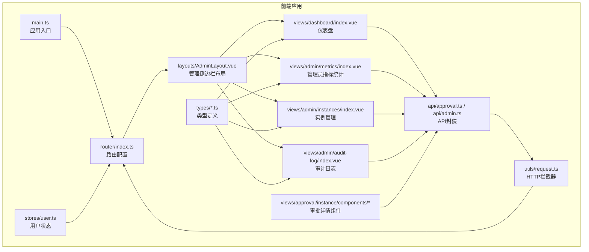
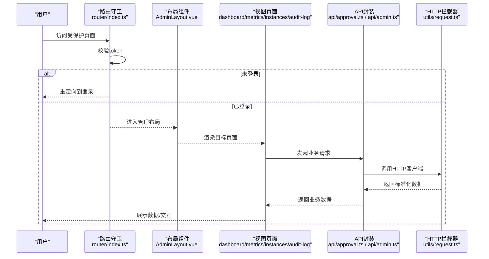
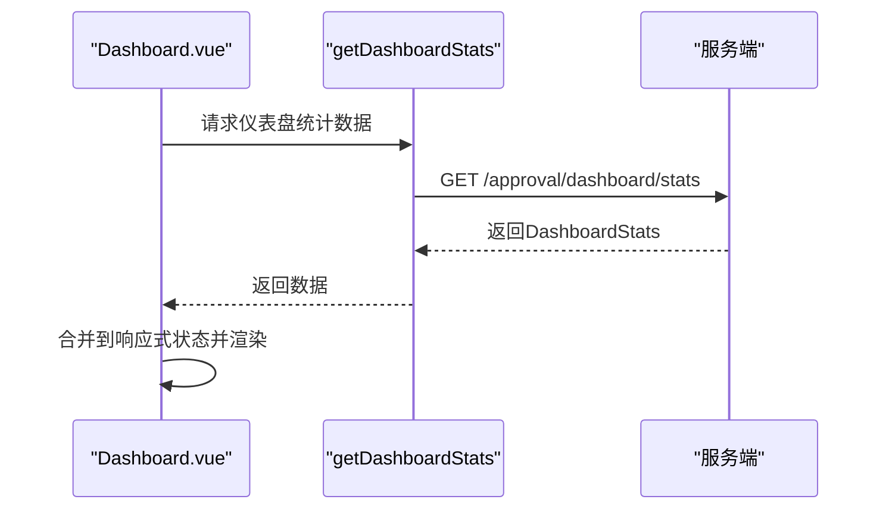
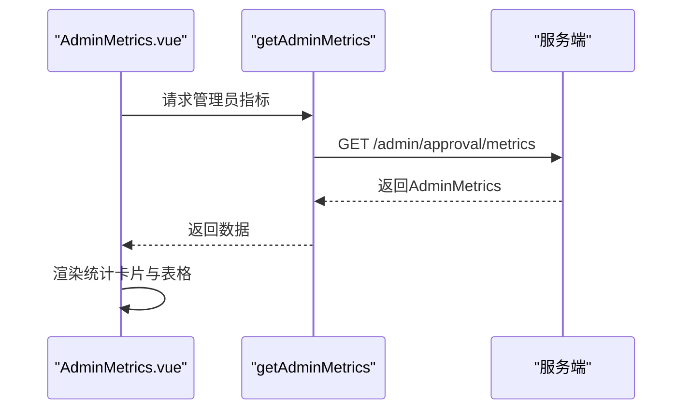
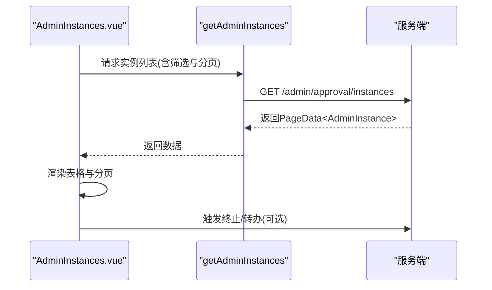
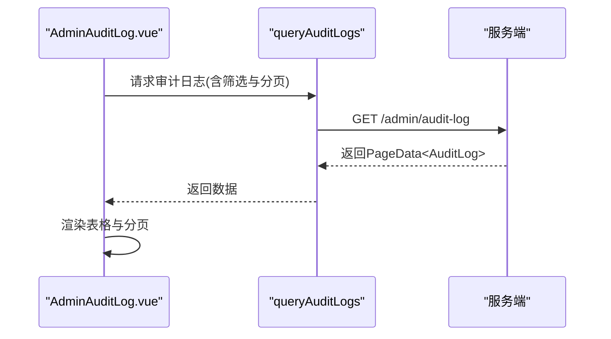
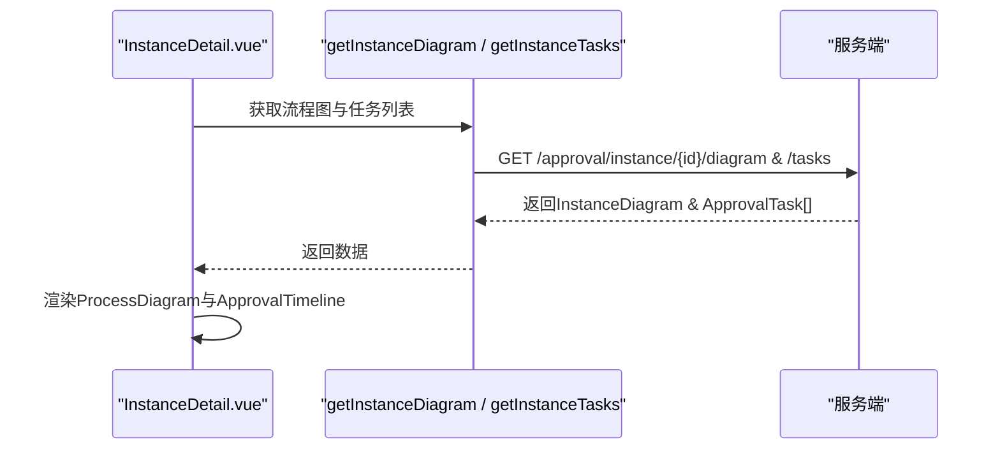
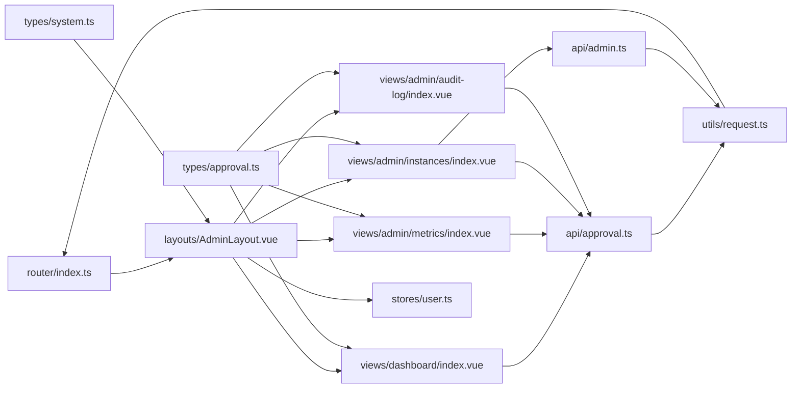

# 管理后台页面

<cite>
**本文档引用的文件**
- [dashboard/index.vue](file://oa-ui/src/views/dashboard/index.vue)
- [admin/metrics/index.vue](file://oa-ui/src/views/admin/metrics/index.vue)
- [admin/instances/index.vue](file://oa-ui/src/views/admin/instances/index.vue)
- [admin/audit-log/index.vue](file://oa-ui/src/views/admin/audit-log/index.vue)
- [router/index.ts](file://oa-ui/src/router/index.ts)
- [layouts/AdminLayout.vue](file://oa-ui/src/layouts/AdminLayout.vue)
- [types/approval.ts](file://oa-ui/src/types/approval.ts)
- [types/system.ts](file://oa-ui/src/types/system.ts)
- [api/approval.ts](file://oa-ui/src/api/approval.ts)
- [api/admin.ts](file://oa-ui/src/api/admin.ts)
- [utils/request.ts](file://oa-ui/src/utils/request.ts)
- [stores/user.ts](file://oa-ui/src/stores/user.ts)
- [approval/instance/components/ProcessDiagram.vue](file://oa-ui/src/views/approval/instance/components/ProcessDiagram.vue)
- [approval/instance/components/ApprovalTimeline.vue](file://oa-ui/src/views/approval/instance/components/ApprovalTimeline.vue)
- [main.ts](file://oa-ui/src/main.ts)
</cite>

## 目录
1. [简介](#简介)
2. [项目结构](#项目结构)
3. [核心组件](#核心组件)
4. [架构总览](#架构总览)
5. [详细组件分析](#详细组件分析)
6. [依赖关系分析](#依赖关系分析)
7. [性能考虑](#性能考虑)
8. [故障排查指南](#故障排查指南)
9. [结论](#结论)
10. [附录](#附录)

## 简介
本文件面向OA审批管理系统管理后台页面，聚焦以下目标：
- 仪表盘页面的设计理念与数据呈现：统计卡片布局、最近活动展示、非关键性降级策略
- 管理员功能页面布局：指标统计、审批实例管理、审计日志
- 响应式设计与移动端适配策略
- 数据可视化方案与交互设计原则
- 页面路由配置与权限控制实现细节
- 性能优化与用户体验最佳实践

## 项目结构
管理后台采用前端Vue 3 + Element Plus + Pinia + Vue Router的组合，页面位于oa-ui/src/views下，路由集中于oa-ui/src/router/index.ts，API封装在oa-ui/src/api目录，类型定义在oa-ui/src/types目录，全局布局在oa-ui/src/layouts/AdminLayout.vue。

**图示来源**
- [main.ts:1-14](file://oa-ui/src/main.ts#L1-L14)
- [router/index.ts:1-134](file://oa-ui/src/router/index.ts#L1-L134)
- [layouts/AdminLayout.vue:1-130](file://oa-ui/src/layouts/AdminLayout.vue#L1-L130)
- [views/dashboard/index.vue:1-86](file://oa-ui/src/views/dashboard/index.vue#L1-L86)
- [views/admin/metrics/index.vue:1-61](file://oa-ui/src/views/admin/metrics/index.vue#L1-L61)
- [views/admin/instances/index.vue:1-154](file://oa-ui/src/views/admin/instances/index.vue#L1-L154)
- [views/admin/audit-log/index.vue:1-88](file://oa-ui/src/views/admin/audit-log/index.vue#L1-L88)
- [api/approval.ts:1-71](file://oa-ui/src/api/approval.ts#L1-L71)
- [api/admin.ts:1-82](file://oa-ui/src/api/admin.ts#L1-L82)
- [utils/request.ts:1-42](file://oa-ui/src/utils/request.ts#L1-L42)
- [stores/user.ts:1-32](file://oa-ui/src/stores/user.ts#L1-L32)

**章节来源**
- [router/index.ts:1-134](file://oa-ui/src/router/index.ts#L1-L134)
- [layouts/AdminLayout.vue:1-130](file://oa-ui/src/layouts/AdminLayout.vue#L1-L130)
- [main.ts:1-14](file://oa-ui/src/main.ts#L1-L14)

## 核心组件
- 仪表盘页面：使用Element Plus栅格系统展示统计卡片，最近活动以表格形式呈现，支持非关键性降级（加载失败不阻塞主界面）
- 指标统计页面：使用统计数值卡片与表格展示审批实例总量、状态分布、模板维度统计
- 实例管理页面：提供筛选条件、分页、终止实例、转办任务等管理能力
- 审计日志页面：按模块、动作、时间范围筛选，支持分页查看审计记录
- 路由与权限：全局前置守卫校验token，未登录重定向到登录页；侧边栏菜单与路由路径一一对应
- 数据可视化：流程图组件基于bpmn-js渲染BPMN XML，审批时间轴组件展示审批历史

**章节来源**
- [dashboard/index.vue:1-86](file://oa-ui/src/views/dashboard/index.vue#L1-L86)
- [admin/metrics/index.vue:1-61](file://oa-ui/src/views/admin/metrics/index.vue#L1-L61)
- [admin/instances/index.vue:1-154](file://oa-ui/src/views/admin/instances/index.vue#L1-L154)
- [admin/audit-log/index.vue:1-88](file://oa-ui/src/views/admin/audit-log/index.vue#L1-L88)
- [router/index.ts:124-131](file://oa-ui/src/router/index.ts#L124-L131)
- [layouts/AdminLayout.vue:16-45](file://oa-ui/src/layouts/AdminLayout.vue#L16-L45)
- [approval/instance/components/ProcessDiagram.vue:1-76](file://oa-ui/src/views/approval/instance/components/ProcessDiagram.vue#L1-L76)
- [approval/instance/components/ApprovalTimeline.vue:1-100](file://oa-ui/src/views/approval/instance/components/ApprovalTimeline.vue#L1-L100)

## 架构总览
前端通过统一的HTTP客户端发送请求，后端返回标准化结构，拦截器负责鉴权头注入与错误处理。路由层负责页面导航与权限控制，布局层提供统一的侧边栏与头部区域。

**图示来源**
- [router/index.ts:124-131](file://oa-ui/src/router/index.ts#L124-L131)
- [layouts/AdminLayout.vue:1-130](file://oa-ui/src/layouts/AdminLayout.vue#L1-L130)
- [views/dashboard/index.vue:54-75](file://oa-ui/src/views/dashboard/index.vue#L54-L75)
- [api/approval.ts:56-58](file://oa-ui/src/api/approval.ts#L56-L58)
- [api/admin.ts:79-81](file://oa-ui/src/api/admin.ts#L79-L81)
- [utils/request.ts:10-39](file://oa-ui/src/utils/request.ts#L10-L39)

## 详细组件分析

### 仪表盘页面（Dashboard）
- 设计理念
  - 使用四宫格统计卡片快速呈现关键指标（待办、已办、模板、抄送未读）
  - 最近审批动态表格展示近期任务结果与时间，便于管理者快速掌握动态
  - 非关键性降级：仪表盘加载异常不影响其他页面访问
- 数据流
  - 页面挂载时调用仪表盘统计接口，将返回值合并到本地响应式状态
  - 使用Element Plus的表格与标签组件进行结果态展示
- 可视化与交互
  - 统计值采用大字号突出显示，标签颜色区分不同状态
  - 表格列自适应宽度，支持溢出省略提示

**图示来源**
- [views/dashboard/index.vue:54-75](file://oa-ui/src/views/dashboard/index.vue#L54-L75)
- [api/approval.ts:56-58](file://oa-ui/src/api/approval.ts#L56-L58)
- [types/approval.ts:107-113](file://oa-ui/src/types/approval.ts#L107-L113)

**章节来源**
- [views/dashboard/index.vue:1-86](file://oa-ui/src/views/dashboard/index.vue#L1-L86)
- [api/approval.ts:56-58](file://oa-ui/src/api/approval.ts#L56-L58)
- [types/approval.ts:107-113](file://oa-ui/src/types/approval.ts#L107-L113)

### 管理员指标统计页面（Admin Metrics）
- 功能要点
  - 六个统计卡片分别展示总实例数、审批中、已通过、已驳回、已撤回、平均耗时
  - 模板维度统计表格列出各模板的总数与状态分布
- 数据流
  - 页面挂载时调用管理员指标接口，填充统计卡片与表格
- 交互设计
  - 数值精度控制与列宽设置，确保信息可读性

**图示来源**
- [views/admin/metrics/index.vue:49-60](file://oa-ui/src/views/admin/metrics/index.vue#L49-L60)
- [api/admin.ts:79-81](file://oa-ui/src/api/admin.ts#L79-L81)
- [api/admin.ts:41-56](file://oa-ui/src/api/admin.ts#L41-L56)

**章节来源**
- [views/admin/metrics/index.vue:1-61](file://oa-ui/src/views/admin/metrics/index.vue#L1-L61)
- [api/admin.ts:79-81](file://oa-ui/src/api/admin.ts#L79-L81)
- [api/admin.ts:41-56](file://oa-ui/src/api/admin.ts#L41-L56)

### 审批实例管理页面（Admin Instances）
- 功能要点
  - 支持按标题、状态筛选，分页加载实例列表
  - 提供“查看”跳转到审批详情，“终止”撤销整个实例
  - 内置转办对话框，输入目标用户ID执行转办
- 数据流
  - 查询参数包括标题、状态、分页信息；终止与转办调用对应接口
- 交互设计
  - 状态标签根据状态码映射不同颜色；分页控件支持切换页大小与当前页

**图示来源**
- [views/admin/instances/index.vue:94-147](file://oa-ui/src/views/admin/instances/index.vue#L94-L147)
- [api/admin.ts:58-77](file://oa-ui/src/api/admin.ts#L58-L77)
- [types/approval.ts:32-43](file://oa-ui/src/types/approval.ts#L32-L43)

**章节来源**
- [views/admin/instances/index.vue:1-154](file://oa-ui/src/views/admin/instances/index.vue#L1-L154)
- [api/admin.ts:58-77](file://oa-ui/src/api/admin.ts#L58-L77)
- [types/approval.ts:32-43](file://oa-ui/src/types/approval.ts#L32-L43)

### 审计日志页面（Admin Audit Log）
- 功能要点
  - 模块与动作下拉筛选，日期范围选择，分页加载日志
  - 列表展示用户ID、模块、动作、目标类型与ID、详情、IP、时间等字段
- 数据流
  - 将筛选条件与分页参数传递给审计日志查询接口

**图示来源**
- [views/admin/audit-log/index.vue:63-79](file://oa-ui/src/views/admin/audit-log/index.vue#L63-L79)
- [api/admin.ts:16-28](file://oa-ui/src/api/admin.ts#L16-L28)

**章节来源**
- [views/admin/audit-log/index.vue:1-88](file://oa-ui/src/views/admin/audit-log/index.vue#L1-L88)
- [api/admin.ts:16-28](file://oa-ui/src/api/admin.ts#L16-L28)

### 流程图与审批时间轴（审批详情）
- 流程图组件
  - 接收实例流程图数据，使用bpmn-js渲染BPMN XML
  - 高亮已完成节点与当前节点，自动适配视图
- 审批时间轴组件
  - 展示每个任务的名称、结果、评论、审批人与完成时间
  - 结果态使用不同颜色标签区分

**图示来源**
- [approval/instance/components/ProcessDiagram.vue:17-57](file://oa-ui/src/views/approval/instance/components/ProcessDiagram.vue#L17-L57)
- [approval/instance/components/ApprovalTimeline.vue:30-62](file://oa-ui/src/views/approval/instance/components/ApprovalTimeline.vue#L30-L62)
- [api/approval.ts:52-54](file://oa-ui/src/api/approval.ts#L52-L54)
- [api/approval.ts:48-50](file://oa-ui/src/api/approval.ts#L48-L50)

**章节来源**
- [approval/instance/components/ProcessDiagram.vue:1-76](file://oa-ui/src/views/approval/instance/components/ProcessDiagram.vue#L1-L76)
- [approval/instance/components/ApprovalTimeline.vue:1-100](file://oa-ui/src/views/approval/instance/components/ApprovalTimeline.vue#L1-L100)
- [api/approval.ts:52-54](file://oa-ui/src/api/approval.ts#L52-L54)
- [api/approval.ts:48-50](file://oa-ui/src/api/approval.ts#L48-L50)

## 依赖关系分析
- 路由与布局
  - 路由配置在router/index.ts中集中管理，子路由指向各页面组件
  - AdminLayout.vue提供统一侧边栏与头部，菜单项与路由index一致
- 权限控制
  - beforeEach守卫检查token，未登录强制跳转登录页
  - 用户状态store负责登录、登出与用户信息获取
- 数据访问
  - api/approval.ts与api/admin.ts封装后端接口
  - utils/request.ts统一添加鉴权头、处理错误与401重定向
- 类型安全
  - types/approval.ts与types/system.ts定义了审批、模板、任务、用户、角色、权限等类型

**图示来源**
- [router/index.ts:1-134](file://oa-ui/src/router/index.ts#L1-L134)
- [layouts/AdminLayout.vue:1-130](file://oa-ui/src/layouts/AdminLayout.vue#L1-L130)
- [views/dashboard/index.vue:1-86](file://oa-ui/src/views/dashboard/index.vue#L1-L86)
- [views/admin/metrics/index.vue:1-61](file://oa-ui/src/views/admin/metrics/index.vue#L1-L61)
- [views/admin/instances/index.vue:1-154](file://oa-ui/src/views/admin/instances/index.vue#L1-L154)
- [views/admin/audit-log/index.vue:1-88](file://oa-ui/src/views/admin/audit-log/index.vue#L1-L88)
- [api/approval.ts:1-71](file://oa-ui/src/api/approval.ts#L1-L71)
- [api/admin.ts:1-82](file://oa-ui/src/api/admin.ts#L1-L82)
- [utils/request.ts:1-42](file://oa-ui/src/utils/request.ts#L1-L42)
- [stores/user.ts:1-32](file://oa-ui/src/stores/user.ts#L1-L32)
- [types/approval.ts:1-131](file://oa-ui/src/types/approval.ts#L1-L131)
- [types/system.ts:1-57](file://oa-ui/src/types/system.ts#L1-L57)

**章节来源**
- [router/index.ts:1-134](file://oa-ui/src/router/index.ts#L1-L134)
- [layouts/AdminLayout.vue:1-130](file://oa-ui/src/layouts/AdminLayout.vue#L1-L130)
- [utils/request.ts:1-42](file://oa-ui/src/utils/request.ts#L1-L42)
- [stores/user.ts:1-32](file://oa-ui/src/stores/user.ts#L1-L32)
- [types/approval.ts:1-131](file://oa-ui/src/types/approval.ts#L1-L131)
- [types/system.ts:1-57](file://oa-ui/src/types/system.ts#L1-L57)

## 性能考虑
- 首屏与非关键性降级
  - 仪表盘作为非关键页面，加载失败不应阻塞其他页面渲染
- 分页与懒加载
  - 实例管理与审计日志均采用分页，避免一次性加载大量数据
- 图形渲染
  - 流程图组件仅在props变化时重新渲染，卸载时销毁实例，防止内存泄漏
- 网络与缓存
  - 统一超时时间与错误提示，减少无效重试
- 响应式与移动端
  - 使用Element Plus栅格系统与flex布局，保证在小屏设备上内容可读与操作可用

[本节为通用性能建议，无需特定文件引用]

## 故障排查指南
- 登录态失效
  - HTTP拦截器在收到特定错误码或401时清除token并跳转登录页
- 页面空白或数据不更新
  - 检查路由守卫是否正确拦截未登录访问
  - 确认API接口返回格式与类型定义一致
- 流程图渲染失败
  - 检查BPMN XML是否有效，节点高亮逻辑对不存在节点有容错处理
- 终止/转办失败
  - 查看弹窗确认与错误消息提示，确保目标用户ID合法

**章节来源**
- [utils/request.ts:18-39](file://oa-ui/src/utils/request.ts#L18-L39)
- [router/index.ts:124-131](file://oa-ui/src/router/index.ts#L124-L131)
- [approval/instance/components/ProcessDiagram.vue:54-56](file://oa-ui/src/views/approval/instance/components/ProcessDiagram.vue#L54-L56)
- [admin/instances/index.vue:114-127](file://oa-ui/src/views/admin/instances/index.vue#L114-L127)

## 结论
管理后台页面围绕“清晰的统计概览、可操作的管理能力、可靠的权限与数据安全”展开设计。通过统一的路由与布局、完善的API封装与类型定义、以及合理的错误处理与性能策略，实现了良好的可维护性与用户体验。后续可在以下方面持续优化：
- 增加更多可视化图表（如趋势图、热力图）以辅助决策
- 引入缓存策略与增量刷新机制，进一步提升交互流畅度
- 扩展移动端布局细节，提升小屏体验

[本节为总结性内容，无需特定文件引用]

## 附录

### 页面路由与权限控制实现细节
- 路由配置
  - 管理后台根路径为“/”，子路由覆盖仪表盘、系统管理、审批管理、管理员功能等
  - 审批详情、流程设计器等页面独立路由
- 权限控制
  - beforeEach守卫检查localStorage中的token，未登录重定向至“/login”
  - 用户状态store负责登录、登出与用户信息持久化

**章节来源**
- [router/index.ts:1-134](file://oa-ui/src/router/index.ts#L1-L134)
- [router/index.ts:124-131](file://oa-ui/src/router/index.ts#L124-L131)
- [stores/user.ts:1-32](file://oa-ui/src/stores/user.ts#L1-L32)

### 数据可视化与交互设计原则
- 仪表盘与指标页
  - 使用统计卡片突出关键指标，标签与颜色传达状态含义
- 实例管理与审计日志
  - 表格列宽与固定列确保右侧操作区可见性；分页控件置于右下角
- 流程图与时间轴
  - 流程图自动适配视口并高亮关键节点；时间轴卡片化展示审批细节

**章节来源**
- [views/dashboard/index.vue:1-86](file://oa-ui/src/views/dashboard/index.vue#L1-L86)
- [views/admin/metrics/index.vue:1-61](file://oa-ui/src/views/admin/metrics/index.vue#L1-L61)
- [views/admin/instances/index.vue:150-154](file://oa-ui/src/views/admin/instances/index.vue#L150-L154)
- [views/admin/audit-log/index.vue:84-88](file://oa-ui/src/views/admin/audit-log/index.vue#L84-L88)
- [approval/instance/components/ProcessDiagram.vue:67-76](file://oa-ui/src/views/approval/instance/components/ProcessDiagram.vue#L67-L76)
- [approval/instance/components/ApprovalTimeline.vue:65-99](file://oa-ui/src/views/approval/instance/components/ApprovalTimeline.vue#L65-L99)