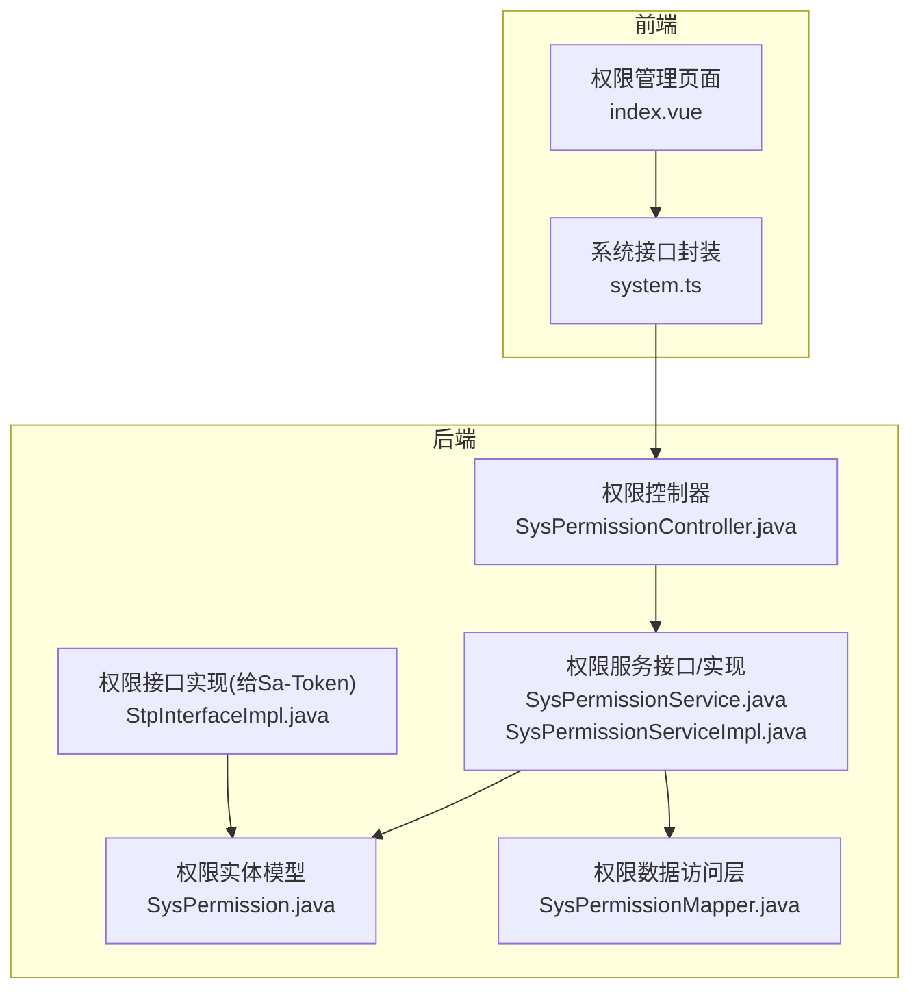
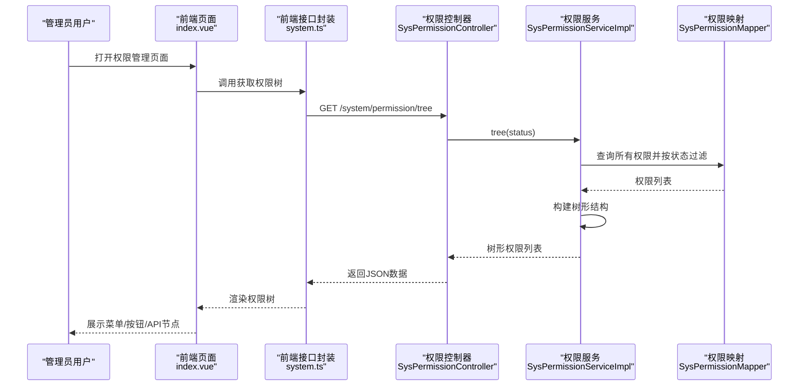
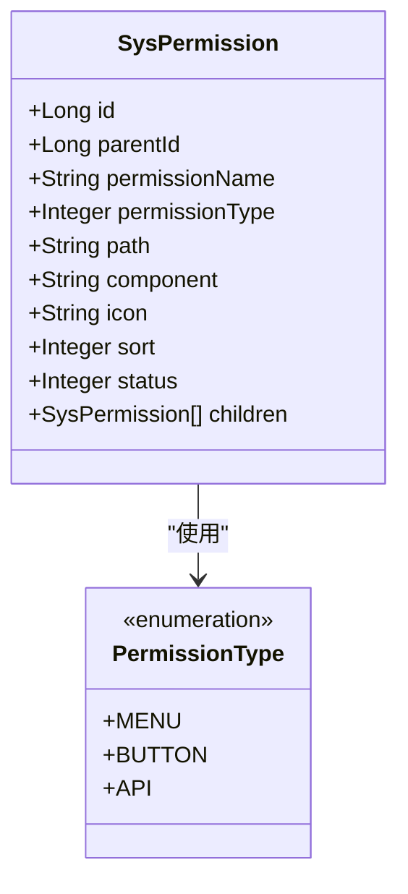
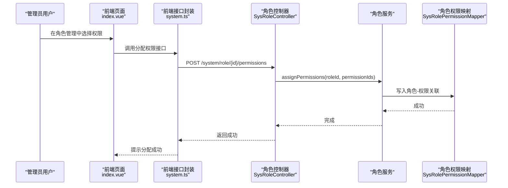
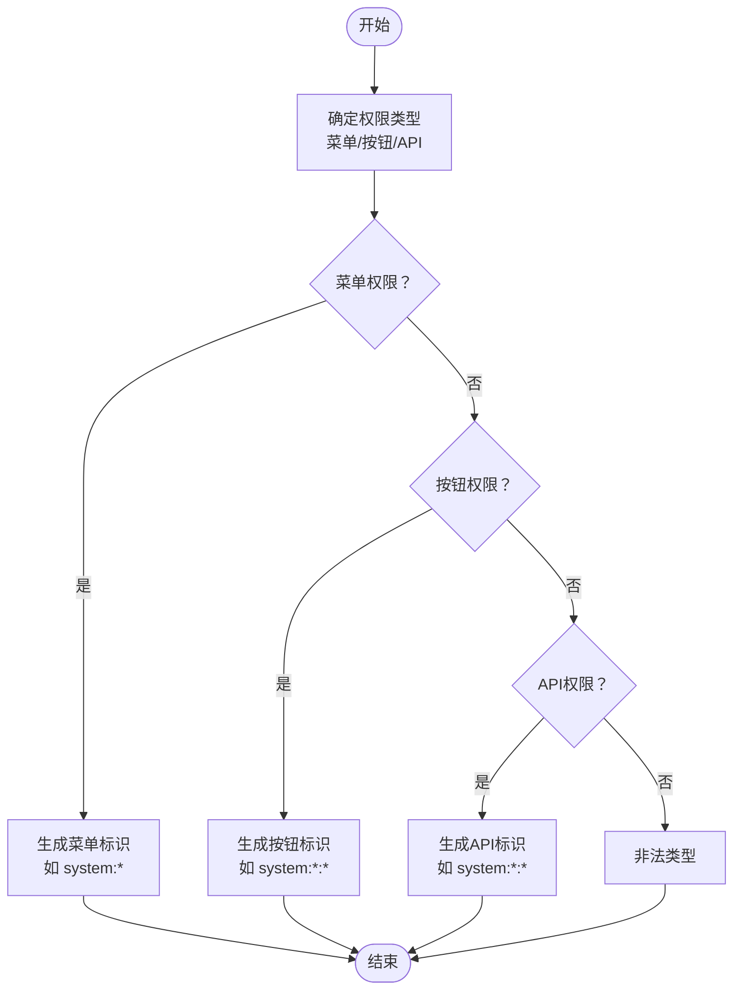
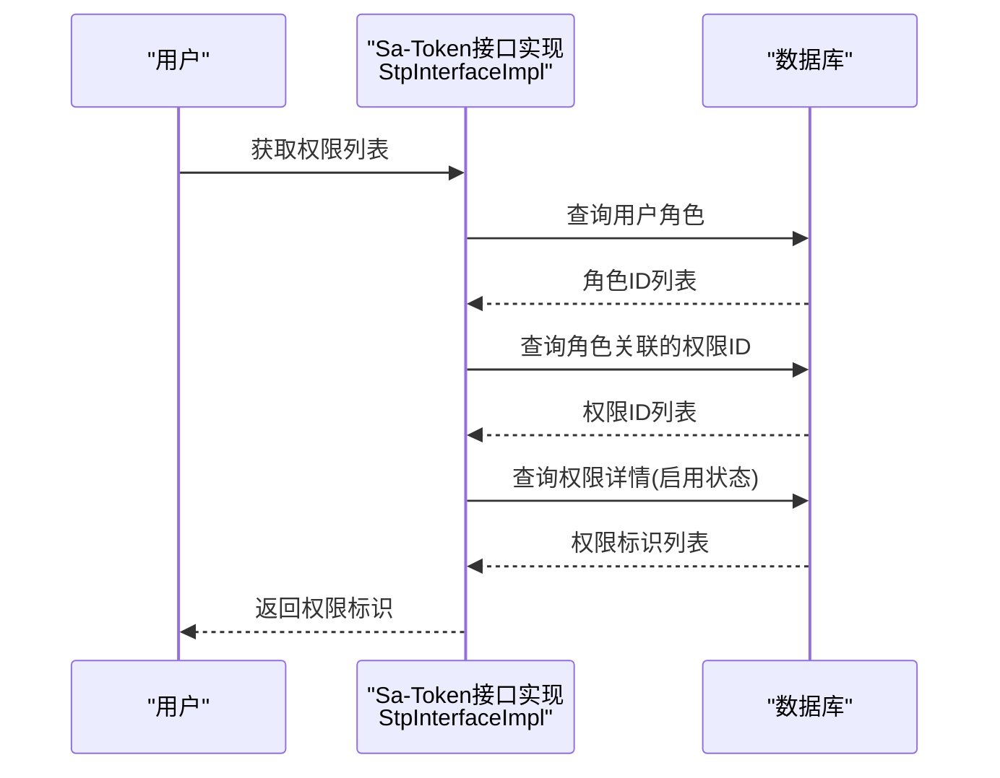
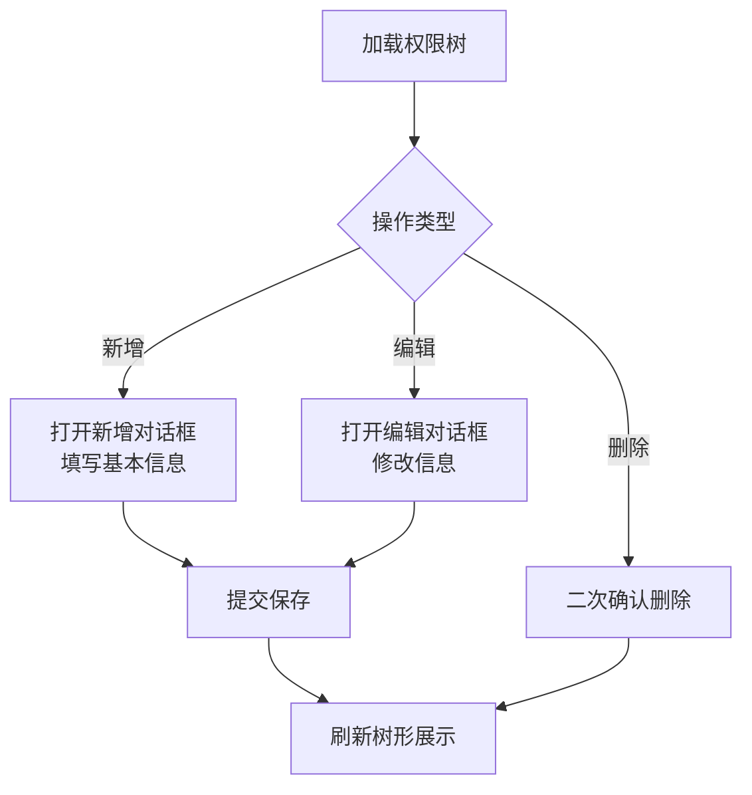
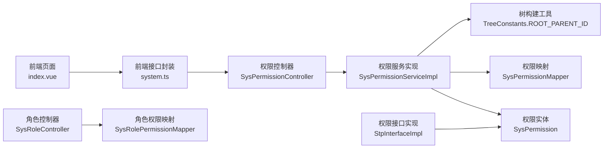

# 权限管理页面

<cite>
**本文档引用的文件**
- [index.vue](file://oa-ui/src/views/system/permission/index.vue)
- [system.ts](file://oa-ui/src/api/system.ts)
- [SysPermissionController.java](file://oa-system/src/main/java/com/oa/admin/system/controller/SysPermissionController.java)
- [SysPermission.java](file://oa-system/src/main/java/com/oa/admin/system/entity/SysPermission.java)
- [PermissionType.java](file://oa-system/src/main/java/com/oa/admin/system/enums/PermissionType.java)
- [SysPermissionService.java](file://oa-system/src/main/java/com/oa/admin/system/service/SysPermissionService.java)
- [SysPermissionServiceImpl.java](file://oa-system/src/main/java/com/oa/admin/system/service/impl/SysPermissionServiceImpl.java)
- [SysPermissionMapper.java](file://oa-system/src/main/java/com/oa/admin/system/mapper/SysPermissionMapper.java)
- [StpInterfaceImpl.java](file://oa-system/src/main/java/com/oa/admin/system/config/StpInterfaceImpl.java)
- [V11__system_management_permissions.sql](file://oa-app/src/main/resources/db/migration/V11__system_management_permissions.sql)
- [SysRoleController.java](file://oa-system/src/main/java/com/oa/admin/system/controller/SysRoleController.java)
- [SysRole.java](file://oa-system/src/main/java/com/oa/admin/system/entity/SysRole.java)
- [SysRolePermission.java](file://oa-system/src/main/java/com/oa/admin/system/entity/SysRolePermission.java)
- [SysRolePermissionMapper.java](file://oa-system/src/main/java/com/oa/admin/system/mapper/SysRolePermissionMapper.java)
</cite>

## 目录
1. [简介](#简介)
2. [项目结构](#项目结构)
3. [核心组件](#核心组件)
4. [架构总览](#架构总览)
5. [详细组件分析](#详细组件分析)
6. [依赖分析](#依赖分析)
7. [性能考虑](#性能考虑)
8. [故障排除指南](#故障排除指南)
9. [结论](#结论)

## 简介
本文件面向OA审批管理系统中的权限管理页面，系统性阐述权限管理的设计与实现，重点覆盖以下方面：
- 三级权限体系：菜单权限、按钮权限、API权限的定义与使用
- 权限树形结构：菜单节点、按钮节点、接口节点的分类展示与层级关系
- 权限分配流程：权限勾选、权限继承、权限回收的实现机制
- 权限类型与标识：权限类型的区分及权限标识的生成规则
- 权限验证机制：路由守卫、按钮级权限控制、接口访问控制
- 操作便捷性与冲突处理：权限管理界面的交互设计与权限冲突的处理策略

## 项目结构
权限管理页面位于前端系统中，采用Vue 3 + TypeScript + Element Plus技术栈；后端基于Spring Boot + MyBatis-Plus + Sa-Token实现权限控制。

图表来源
- [index.vue:1-203](file://oa-ui/src/views/system/permission/index.vue#L1-L203)
- [system.ts:1-73](file://oa-ui/src/api/system.ts#L1-L73)
- [SysPermissionController.java:1-63](file://oa-system/src/main/java/com/oa/admin/system/controller/SysPermissionController.java#L1-L63)
- [SysPermissionService.java:1-17](file://oa-system/src/main/java/com/oa/admin/system/service/SysPermissionService.java#L1-L17)
- [SysPermissionServiceImpl.java:1-41](file://oa-system/src/main/java/com/oa/admin/system/service/impl/SysPermissionServiceImpl.java#L1-L41)
- [SysPermission.java:1-35](file://oa-system/src/main/java/com/oa/admin/system/entity/SysPermission.java#L1-L35)
- [SysPermissionMapper.java:1-13](file://oa-system/src/main/java/com/oa/admin/system/mapper/SysPermissionMapper.java#L1-L13)
- [StpInterfaceImpl.java:1-75](file://oa-system/src/main/java/com/oa/admin/system/config/StpInterfaceImpl.java#L1-L75)

章节来源
- [index.vue:1-203](file://oa-ui/src/views/system/permission/index.vue#L1-L203)
- [system.ts:1-73](file://oa-ui/src/api/system.ts#L1-L73)
- [SysPermissionController.java:1-63](file://oa-system/src/main/java/com/oa/admin/system/controller/SysPermissionController.java#L1-L63)

## 核心组件
- 前端权限管理页面：负责权限树形展示、权限新增/编辑/删除、对话框表单输入与提交。
- 后端权限控制器：提供权限树查询、列表查询、新增、修改、删除等REST接口，并通过注解进行权限校验。
- 权限服务层：构建权限树、按状态过滤、持久化权限信息。
- 权限实体与映射：定义权限字段（名称、类型、路径、图标、排序、状态）以及MyBatis映射。
- 权限接口实现：为Sa-Token提供用户权限列表，用于运行时权限判断。

章节来源
- [index.vue:108-198](file://oa-ui/src/views/system/permission/index.vue#L108-L198)
- [SysPermissionController.java:21-61](file://oa-system/src/main/java/com/oa/admin/system/controller/SysPermissionController.java#L21-L61)
- [SysPermissionService.java:11-16](file://oa-system/src/main/java/com/oa/admin/system/service/SysPermissionService.java#L11-L16)
- [SysPermissionServiceImpl.java:20-39](file://oa-system/src/main/java/com/oa/admin/system/service/impl/SysPermissionServiceImpl.java#L20-L39)
- [SysPermission.java:24-30](file://oa-system/src/main/java/com/oa/admin/system/entity/SysPermission.java#L24-L30)
- [StpInterfaceImpl.java:33-52](file://oa-system/src/main/java/com/oa/admin/system/config/StpInterfaceImpl.java#L33-L52)

## 架构总览
权限管理页面采用前后端分离架构，前端通过HTTP请求调用后端接口，后端通过Sa-Token在运行时进行权限校验。

图表来源
- [index.vue:133-141](file://oa-ui/src/views/system/permission/index.vue#L133-L141)
- [system.ts:33-35](file://oa-ui/src/api/system.ts#L33-L35)
- [SysPermissionController.java:21-26](file://oa-system/src/main/java/com/oa/admin/system/controller/SysPermissionController.java#L21-L26)
- [SysPermissionServiceImpl.java:28-32](file://oa-system/src/main/java/com/oa/admin/system/service/impl/SysPermissionServiceImpl.java#L28-L32)
- [SysPermissionMapper.java:10-12](file://oa-system/src/main/java/com/oa/admin/system/mapper/SysPermissionMapper.java#L10-L12)

## 详细组件分析

### 权限树形结构与展示
- 数据模型：权限实体包含父ID、名称、类型、路径、组件、图标、排序、状态，并支持children字段用于树形渲染。
- 类型枚举：权限类型分为菜单、按钮、API三类，分别对应不同UI呈现与控制粒度。
- 前端展示：使用Element Plus表格组件以树形方式展示，列包括权限名称、类型标签、路径/标识、图标、排序、状态，支持展开/折叠与行内操作。

图表来源
- [SysPermission.java:19-34](file://oa-system/src/main/java/com/oa/admin/system/entity/SysPermission.java#L19-L34)
- [PermissionType.java:11-16](file://oa-system/src/main/java/com/oa/admin/system/enums/PermissionType.java#L11-L16)

章节来源
- [SysPermission.java:24-30](file://oa-system/src/main/java/com/oa/admin/system/entity/SysPermission.java#L24-L30)
- [index.vue:15-26](file://oa-ui/src/views/system/permission/index.vue#L15-L26)

### 权限分配与角色绑定
- 角色权限分配：后端提供角色与权限的关联接口，支持批量赋权与撤销。
- 角色数据范围：角色可配置数据范围（全部、部门、自定义），配合部门树进行数据隔离。
- 权限继承：通过角色-权限关联表实现权限继承，用户通过角色获得权限集合。

图表来源
- [SysRoleController.java:61-66](file://oa-system/src/main/java/com/oa/admin/system/controller/SysRoleController.java#L61-L66)
- [SysRole.java:22-24](file://oa-system/src/main/java/com/oa/admin/system/entity/SysRole.java#L22-L24)
- [SysRolePermission.java:13-18](file://oa-system/src/main/java/com/oa/admin/system/entity/SysRolePermission.java#L13-L18)

章节来源
- [SysRoleController.java:61-66](file://oa-system/src/main/java/com/oa/admin/system/controller/SysRoleController.java#L61-L66)
- [SysRole.java:22-24](file://oa-system/src/main/java/com/oa/admin/system/entity/SysRole.java#L22-L24)
- [SysRolePermission.java:13-18](file://oa-system/src/main/java/com/oa/admin/system/entity/SysRolePermission.java#L13-L18)

### 权限类型与标识生成规则
- 类型区分：菜单权限用于路由导航，按钮权限用于页面元素显隐，API权限用于接口访问控制。
- 标识生成：权限标识通常采用“模块:功能:动作”格式，如system:permission:list，便于统一管理与校验。
- 初始化脚本：数据库迁移脚本中预置了系统管理模块的权限标识并授予超级管理员角色。

图表来源
- [V11__system_management_permissions.sql:3-18](file://oa-app/src/main/resources/db/migration/V11__system_management_permissions.sql#L3-L18)
- [SysPermissionController.java:22](file://oa-system/src/main/java/com/oa/admin/system/controller/SysPermissionController.java#L22)

章节来源
- [V11__system_management_permissions.sql:3-18](file://oa-app/src/main/resources/db/migration/V11__system_management_permissions.sql#L3-L18)
- [SysPermissionController.java:22](file://oa-system/src/main/java/com/oa/admin/system/controller/SysPermissionController.java#L22)

### 权限验证机制
- 运行时权限：通过Sa-Token的StpInterface实现，根据用户角色查询其拥有的权限标识列表。
- 接口权限：控制器方法使用注解进行权限校验，未授权访问将被拦截。
- 路由守卫与按钮控制：前端结合用户权限动态渲染菜单与按钮，避免无效请求。

图表来源
- [StpInterfaceImpl.java:33-52](file://oa-system/src/main/java/com/oa/admin/system/config/StpInterfaceImpl.java#L33-L52)

章节来源
- [StpInterfaceImpl.java:33-52](file://oa-system/src/main/java/com/oa/admin/system/config/StpInterfaceImpl.java#L33-L52)
- [SysPermissionController.java:22](file://oa-system/src/main/java/com/oa/admin/system/controller/SysPermissionController.java#L22)

### 权限管理操作流程
- 加载权限树：前端调用后端树形接口，后端按排序与状态构建树。
- 新增/编辑权限：弹出表单填写基本信息，提交后刷新树。
- 删除权限：删除前进行二次确认，防止误删。
- 权限分配：在角色管理中勾选权限，提交后立即生效。

图表来源
- [index.vue:133-195](file://oa-ui/src/views/system/permission/index.vue#L133-L195)
- [system.ts:33-51](file://oa-ui/src/api/system.ts#L33-L51)

章节来源
- [index.vue:133-195](file://oa-ui/src/views/system/permission/index.vue#L133-L195)
- [system.ts:33-51](file://oa-ui/src/api/system.ts#L33-L51)

## 依赖分析
权限管理涉及的核心依赖关系如下：

图表来源
- [index.vue:111-116](file://oa-ui/src/views/system/permission/index.vue#L111-L116)
- [system.ts:33-51](file://oa-ui/src/api/system.ts#L33-L51)
- [SysPermissionController.java:19-61](file://oa-system/src/main/java/com/oa/admin/system/controller/SysPermissionController.java#L19-L61)
- [SysPermissionServiceImpl.java:28-39](file://oa-system/src/main/java/com/oa/admin/system/service/impl/SysPermissionServiceImpl.java#L28-L39)
- [SysPermission.java:19-34](file://oa-system/src/main/java/com/oa/admin/system/entity/SysPermission.java#L19-L34)
- [SysPermissionMapper.java:10-12](file://oa-system/src/main/java/com/oa/admin/system/mapper/SysPermissionMapper.java#L10-L12)
- [StpInterfaceImpl.java:39-51](file://oa-system/src/main/java/com/oa/admin/system/config/StpInterfaceImpl.java#L39-L51)
- [SysRoleController.java:61-66](file://oa-system/src/main/java/com/oa/admin/system/controller/SysRoleController.java#L61-L66)
- [SysRolePermissionMapper.java:10-12](file://oa-system/src/main/java/com/oa/admin/system/mapper/SysRolePermissionMapper.java#L10-L12)

章节来源
- [SysPermissionServiceImpl.java:28-39](file://oa-system/src/main/java/com/oa/admin/system/service/impl/SysPermissionServiceImpl.java#L28-L39)
- [StpInterfaceImpl.java:39-51](file://oa-system/src/main/java/com/oa/admin/system/config/StpInterfaceImpl.java#L39-L51)

## 性能考虑
- 树构建算法：后端使用递归过滤构建树，时间复杂度O(n)，适合中小规模权限集。
- 排序与筛选：按sort字段排序，支持按状态筛选，减少前端渲染压力。
- 缓存策略：可对权限标识列表进行短期缓存，降低频繁查询数据库的开销。
- 分页与懒加载：对于大型组织或权限树，建议引入分页或懒加载以优化首屏性能。

## 故障排除指南
- 权限树不显示：检查后端树形接口是否返回数据，确认状态字段与排序字段有效。
- 权限分配失败：核对角色与权限的关联表写入逻辑，确保权限ID存在且状态启用。
- 运行时权限不生效：确认Sa-Token权限接口实现正确返回权限标识，检查用户角色与权限的关联。
- 接口权限校验异常：检查控制器注解与权限标识是否一致，避免大小写或拼写错误。

章节来源
- [SysPermissionController.java:22](file://oa-system/src/main/java/com/oa/admin/system/controller/SysPermissionController.java#L22)
- [StpInterfaceImpl.java:33-52](file://oa-system/src/main/java/com/oa/admin/system/config/StpInterfaceImpl.java#L33-L52)

## 结论
权限管理页面通过清晰的三级权限体系、完善的树形展示与便捷的操作流程，实现了菜单、按钮、API的精细化权限控制。后端以Sa-Token为核心，结合角色-权限关联与树形权限模型，提供了稳定可靠的权限验证机制。建议在生产环境中进一步优化树构建与缓存策略，并完善权限冲突检测与审计日志，以提升系统的安全性与可维护性。