# 用户管理页面

<cite>
**本文档引用的文件**
- [index.vue](file://oa-ui/src/views/system/user/index.vue)
- [user.ts](file://oa-ui/src/api/user.ts)
- [system.ts](file://oa-ui/src/types/system.ts)
- [SysUserController.java](file://oa-system/src/main/java/com/oa/admin/system/controller/SysUserController.java)
- [SysUserService.java](file://oa-system/src/main/java/com/oa/admin/system/service/SysUserService.java)
- [SysUserServiceImpl.java](file://oa-system/src/main/java/com/oa/admin/system/service/impl/SysUserServiceImpl.java)
- [SysUser.java](file://oa-system/src/main/java/com/oa/admin/system/entity/SysUser.java)
- [SysUserMapper.java](file://oa-system/src/main/java/com/oa/admin/system/mapper/SysUserMapper.java)
- [CommonStatus.java](file://oa-common/src/main/java/com/oa/admin/common/enums/CommonStatus.java)
</cite>

## 目录
1. [简介](#简介)
2. [项目结构](#项目结构)
3. [核心组件](#核心组件)
4. [架构概览](#架构概览)
5. [详细组件分析](#详细组件分析)
6. [依赖关系分析](#依赖关系分析)
7. [性能考虑](#性能考虑)
8. [故障排除指南](#故障排除指南)
9. [结论](#结论)

## 简介

用户管理页面是OA审批管理系统中的核心功能模块，负责系统用户的全生命周期管理。该页面实现了完整的用户CRUD操作，包括用户列表展示、搜索过滤、分页加载、表单验证等功能。系统采用前后端分离架构，前端使用Vue.js + Element Plus构建用户界面，后端使用Spring Boot + MyBatis Plus提供RESTful API服务。

## 项目结构

用户管理功能涉及前后端两个主要部分：

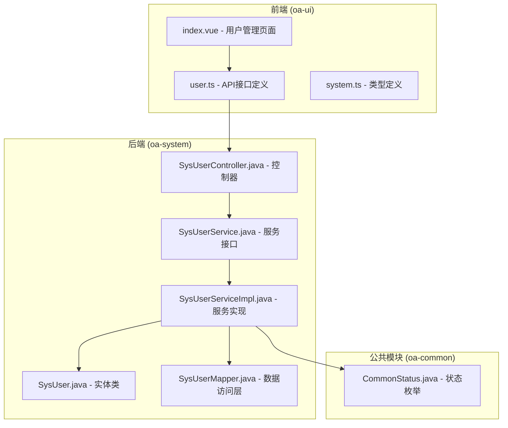

**图表来源**
- [index.vue:1-203](file://oa-ui/src/views/system/user/index.vue#L1-L203)
- [user.ts:1-22](file://oa-ui/src/api/user.ts#L1-L22)
- [system.ts:1-57](file://oa-ui/src/types/system.ts#L1-L57)
- [SysUserController.java:1-85](file://oa-system/src/main/java/com/oa/admin/system/controller/SysUserController.java#L1-L85)
- [SysUserService.java:1-20](file://oa-system/src/main/java/com/oa/admin/system/service/SysUserService.java#L1-L20)
- [SysUserServiceImpl.java:1-73](file://oa-system/src/main/java/com/oa/admin/system/service/impl/SysUserServiceImpl.java#L1-L73)
- [SysUser.java:1-27](file://oa-system/src/main/java/com/oa/admin/system/entity/SysUser.java#L1-L27)
- [SysUserMapper.java:1-13](file://oa-system/src/main/java/com/oa/admin/system/mapper/SysUserMapper.java#L1-L13)
- [CommonStatus.java:1-26](file://oa-common/src/main/java/com/oa/admin/common/enums/CommonStatus.java#L1-L26)

**章节来源**
- [index.vue:1-203](file://oa-ui/src/views/system/user/index.vue#L1-L203)
- [user.ts:1-22](file://oa-ui/src/api/user.ts#L1-L22)
- [system.ts:1-57](file://oa-ui/src/types/system.ts#L1-L57)

## 核心组件

### 前端组件架构

用户管理页面采用Vue 3 Composition API模式，主要包含以下核心组件：

- **用户列表组件**: 负责展示用户数据、支持搜索和分页
- **用户表单组件**: 提供用户信息的增删改查功能
- **搜索工具栏**: 实现用户名和状态的组合查询
- **分页控件**: 支持大数据量的分页浏览

### 后端服务架构

后端采用经典的三层架构设计：

- **控制器层**: 处理HTTP请求，执行权限校验
- **服务层**: 实现业务逻辑，处理数据验证和加密
- **数据访问层**: 提供数据库操作接口

**章节来源**
- [index.vue:103-197](file://oa-ui/src/views/system/user/index.vue#L103-L197)
- [SysUserController.java:17-84](file://oa-system/src/main/java/com/oa/admin/system/controller/SysUserController.java#L17-L84)

## 架构概览

用户管理系统的整体架构采用MVC模式，前后端通过RESTful API进行通信：

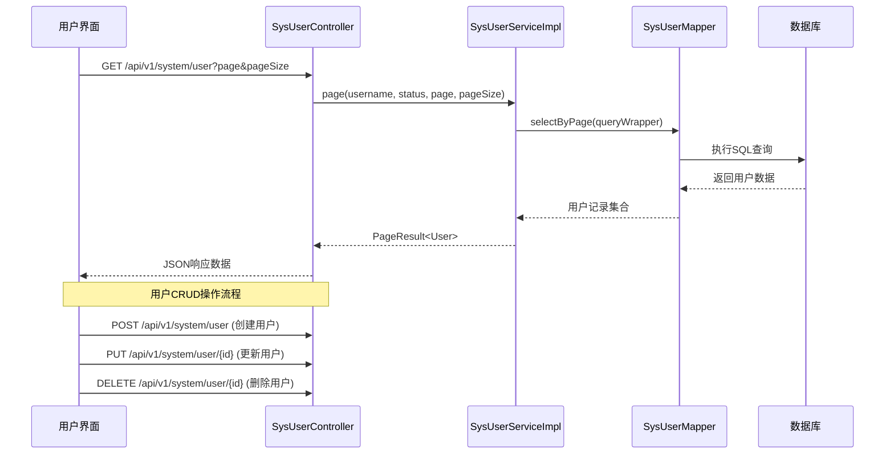

**图表来源**
- [SysUserController.java:23-83](file://oa-system/src/main/java/com/oa/admin/system/controller/SysUserController.java#L23-L83)
- [SysUserServiceImpl.java:27-58](file://oa-system/src/main/java/com/oa/admin/system/service/impl/SysUserServiceImpl.java#L27-L58)

## 详细组件分析

### 用户列表展示组件

用户列表组件实现了完整的表格展示功能：

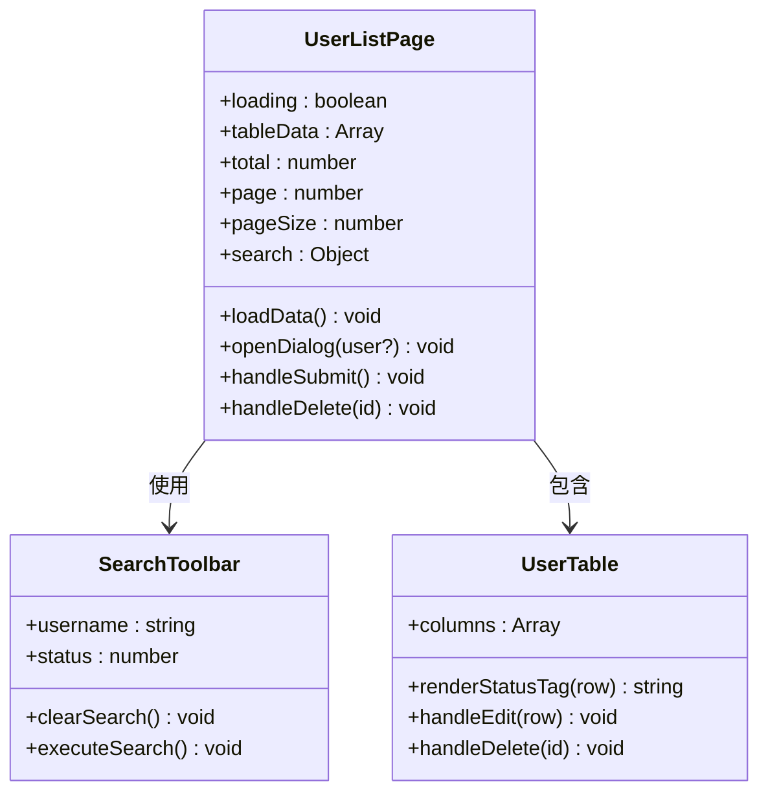

**图表来源**
- [index.vue:103-197](file://oa-ui/src/views/system/user/index.vue#L103-L197)

#### 列表展示特性

- **数据绑定**: 使用Element Plus的el-table组件展示用户信息
- **状态显示**: 通过颜色区分用户状态（正常/禁用）
- **操作按钮**: 支持编辑和删除操作
- **时间格式化**: 自动显示创建时间

#### 搜索过滤功能

搜索功能支持两种过滤条件：

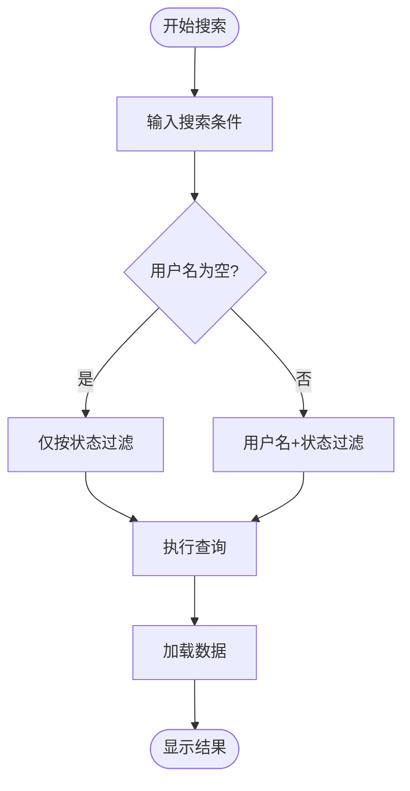

**图表来源**
- [index.vue:113-142](file://oa-ui/src/views/system/user/index.vue#L113-L142)

**章节来源**
- [index.vue:29-60](file://oa-ui/src/views/system/user/index.vue#L29-L60)

### 用户表单组件

用户表单组件提供了完整的用户信息录入和编辑功能：

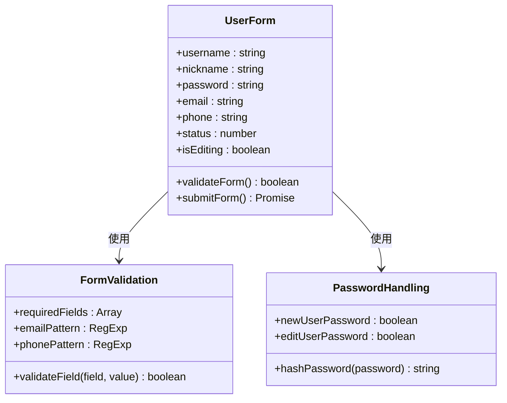

**图表来源**
- [index.vue:119-166](file://oa-ui/src/views/system/user/index.vue#L119-L166)

#### 字段设计规范

| 字段名 | 必填 | 类型 | 验证规则 | 约束条件 |
|--------|------|------|----------|----------|
| 用户名 | 是 | string | 非空且唯一 | 3-20字符，字母数字下划线 |
| 昵称 | 否 | string | 最多20字符 | 可为空 |
| 密码 | 新增必填 | string | 6-20字符 | 编辑时可留空 |
| 邮箱 | 否 | string | 邮箱格式 | 可为空 |
| 手机号 | 否 | string | 手机号码格式 | 可为空 |
| 状态 | 是 | number | 0或1 | 默认正常 |

#### 表单验证策略

- **必填字段**: 用户名在新增时必填，编辑时禁用
- **密码处理**: 新增用户必须提供密码，编辑用户可留空
- **格式验证**: 邮箱和手机号采用正则表达式验证
- **唯一性检查**: 用户名在数据库层面保证唯一性

**章节来源**
- [index.vue:68-99](file://oa-ui/src/views/system/user/index.vue#L68-L99)

### 分页加载机制

系统采用服务端分页策略，确保大数据量场景下的性能表现：

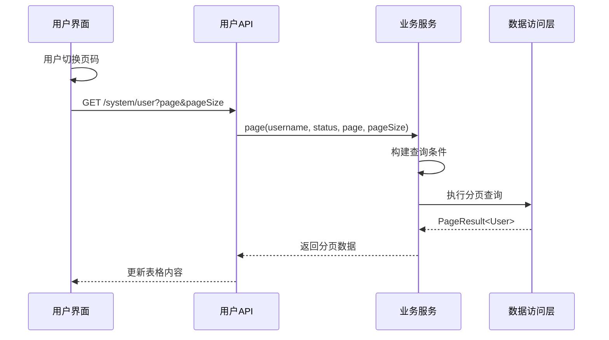

**图表来源**
- [index.vue:53-60](file://oa-ui/src/views/system/user/index.vue#L53-L60)
- [SysUserController.java:23-31](file://oa-system/src/main/java/com/oa/admin/system/controller/SysUserController.java#L23-L31)

#### 分页参数配置

- **默认页大小**: 20条记录/页
- **页码范围**: 1开始的连续整数
- **总记录数**: 支持大数据量统计
- **加载状态**: 显示加载动画提升用户体验

**章节来源**
- [index.vue:111-116](file://oa-ui/src/views/system/user/index.vue#L111-L116)

### 用户CRUD操作实现

#### 创建用户流程

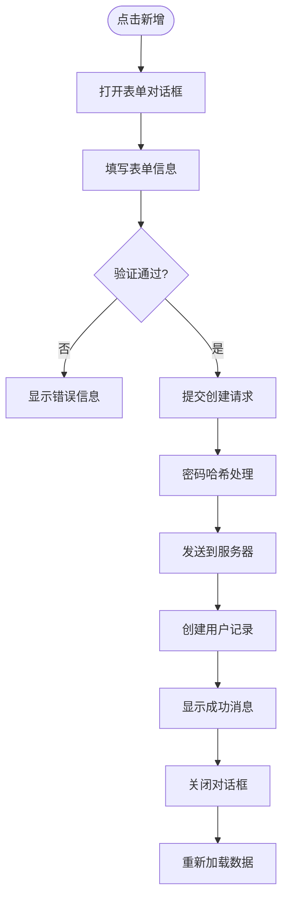

**图表来源**
- [index.vue:168-184](file://oa-ui/src/views/system/user/index.vue#L168-L184)
- [SysUserServiceImpl.java:38-44](file://oa-system/src/main/java/com/oa/admin/system/service/impl/SysUserServiceImpl.java#L38-L44)

#### 更新用户流程

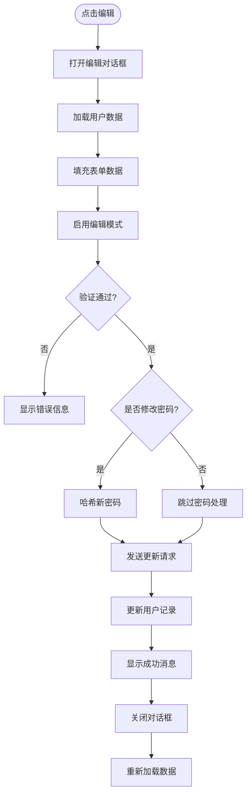

**图表来源**
- [index.vue:144-166](file://oa-ui/src/views/system/user/index.vue#L144-L166)
- [SysUserServiceImpl.java:46-58](file://oa-system/src/main/java/com/oa/admin/system/service/impl/SysUserServiceImpl.java#L46-L58)

#### 删除用户流程

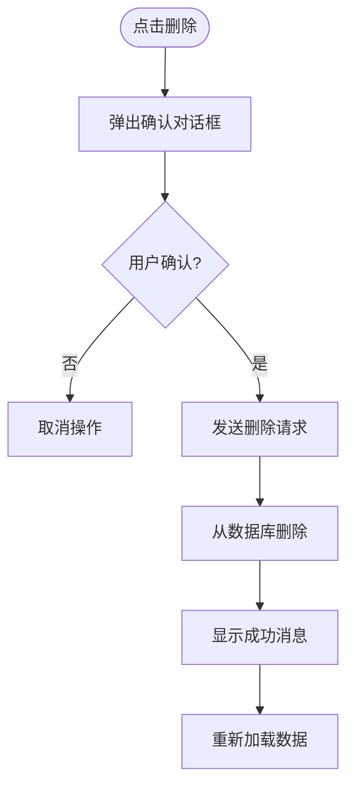

**图表来源**
- [index.vue:186-194](file://oa-ui/src/views/system/user/index.vue#L186-L194)

**章节来源**
- [SysUserController.java:41-83](file://oa-system/src/main/java/com/oa/admin/system/controller/SysUserController.java#L41-L83)
- [SysUserServiceImpl.java:38-71](file://oa-system/src/main/java/com/oa/admin/system/service/impl/SysUserServiceImpl.java#L38-L71)

### 状态管理与颜色区分

系统使用状态枚举来统一管理用户状态：

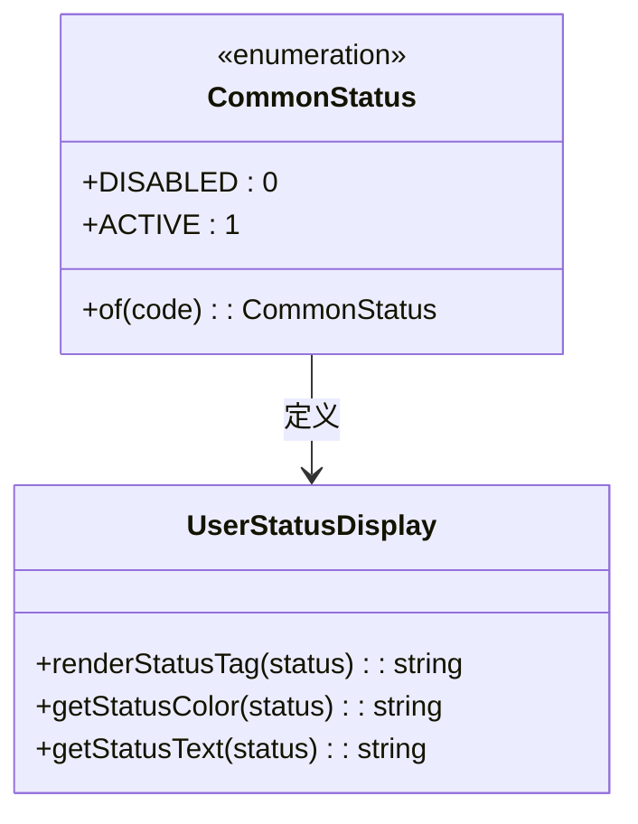

**图表来源**
- [CommonStatus.java:11-25](file://oa-common/src/main/java/com/oa/admin/common/enums/CommonStatus.java#L11-L25)
- [index.vue:34-40](file://oa-ui/src/views/system/user/index.vue#L34-L40)

#### 状态映射关系

| 状态枚举 | 数值代码 | 显示文本 | 颜色标识 |
|----------|----------|----------|----------|
| ACTIVE | 1 | 正常 | success |
| DISABLED | 0 | 禁用 | danger |

#### 状态显示逻辑

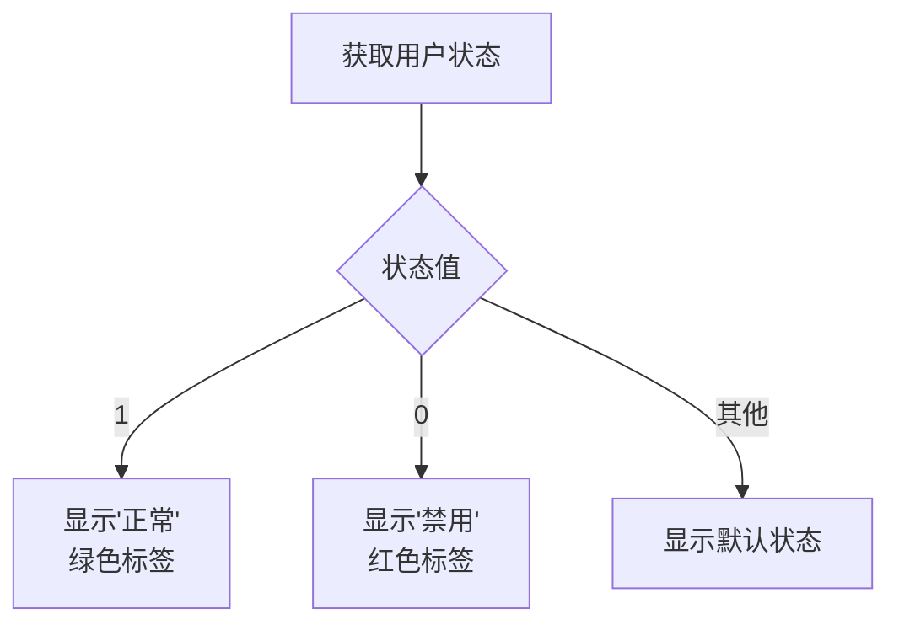

**图表来源**
- [index.vue:35-39](file://oa-ui/src/views/system/user/index.vue#L35-L39)

**章节来源**
- [CommonStatus.java:11-25](file://oa-common/src/main/java/com/oa/admin/common/enums/CommonStatus.java#L11-L25)

## 依赖关系分析

用户管理模块的依赖关系体现了清晰的分层架构：

```mermaid
graph TD
subgraph "前端依赖"
FE_Index[index.vue)
FE_API[user.ts]
FE_Type[system.ts]
end
subgraph "后端依赖"
Ctrl[SysUserController]
Service[SysUserService]
Impl[SysUserServiceImpl]
Entity[SysUser]
Mapper[SysUserMapper]
end
subgraph "公共依赖"
Status[CommonStatus]
end
FE_Index --> FE_API
FE_API --> Ctrl
Ctrl --> Service
Service --> Impl
Impl --> Entity
Impl --> Mapper
Impl --> Status
```

**图表来源**
- [index.vue:104-106](file://oa-ui/src/views/system/user/index.vue#L104-L106)
- [user.ts:1-22](file://oa-ui/src/api/user.ts#L1-L22)
- [SysUserController.java:21-21](file://oa-system/src/main/java/com/oa/admin/system/controller/SysUserController.java#L21-L21)

### 关键依赖关系

1. **前端到后端**: Vue组件通过API层调用后端服务
2. **服务到实体**: 业务逻辑处理数据实体转换
3. **实体到映射**: MyBatis Plus自动映射数据库表结构
4. **状态到枚举**: 统一的状态管理机制

**章节来源**
- [SysUserServiceImpl.java:24-24](file://oa-system/src/main/java/com/oa/admin/system/service/impl/SysUserServiceImpl.java#L24-L24)

## 性能考虑

### 前端性能优化

- **虚拟滚动**: 对于超大数据集，可考虑实现虚拟滚动提升渲染性能
- **懒加载**: 图片和复杂组件采用懒加载策略
- **缓存机制**: 利用浏览器缓存减少重复请求
- **防抖处理**: 搜索输入采用防抖技术避免频繁请求

### 后端性能优化

- **分页查询**: 服务端分页避免一次性加载大量数据
- **索引优化**: 在用户名和状态字段建立数据库索引
- **连接池**: 合理配置数据库连接池参数
- **缓存策略**: 对常用查询结果实施缓存

### 安全考虑

- **密码加密**: 使用BCrypt算法对密码进行哈希处理
- **权限控制**: 基于角色的访问控制（RBAC）
- **输入验证**: 前后端双重验证确保数据安全
- **SQL注入防护**: 使用MyBatis Plus的条件构造器

## 故障排除指南

### 常见问题及解决方案

#### 用户名重复错误

**问题现象**: 新增用户时报用户名已存在错误

**解决步骤**:
1. 检查用户名是否已被其他用户占用
2. 清除浏览器缓存后重试
3. 验证用户名格式是否符合要求

#### 密码修改失败

**问题现象**: 编辑用户时密码修改无效

**解决步骤**:
1. 确认密码字段未留空
2. 验证新密码长度和复杂度
3. 检查密码哈希处理逻辑

#### 搜索结果异常

**问题现象**: 搜索功能返回不正确的结果

**解决步骤**:
1. 检查搜索参数传递是否正确
2. 验证数据库查询条件构建
3. 确认分页参数设置

#### 权限访问错误

**问题现象**: 无权限访问用户管理功能

**解决步骤**:
1. 检查用户角色是否包含system:user权限
2. 验证权限配置是否正确
3. 重新登录系统刷新权限

**章节来源**
- [SysUserServiceImpl.java:39-58](file://oa-system/src/main/java/com/oa/admin/system/service/impl/SysUserServiceImpl.java#L39-L58)

## 结论

用户管理页面作为OA审批管理系统的核心功能模块，实现了完整的用户生命周期管理。系统采用现代化的技术栈和清晰的分层架构，具备良好的可维护性和扩展性。

### 主要优势

1. **功能完整**: 覆盖用户管理的所有核心需求
2. **用户体验**: 界面友好，操作流畅
3. **安全性强**: 多层次的安全防护机制
4. **性能优秀**: 服务端分页和缓存优化
5. **易于扩展**: 模块化设计便于功能扩展

### 技术亮点

- 前后端分离架构，职责清晰
- 基于Spring Security的权限控制
- BCrypt密码加密算法
- Element Plus组件化开发
- TypeScript类型安全保障

该用户管理页面为整个OA系统的用户管理提供了坚实的基础，为后续的功能扩展和系统集成奠定了良好基础。