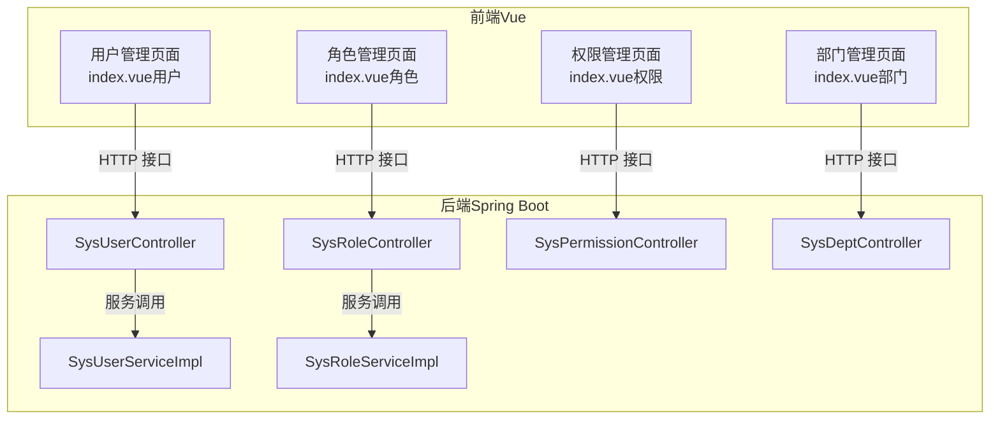
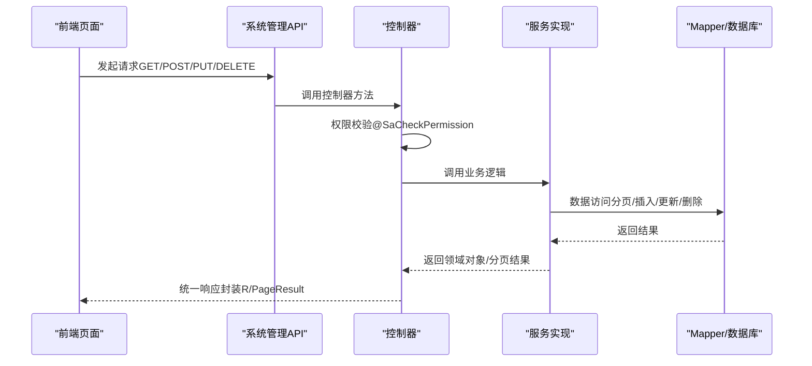
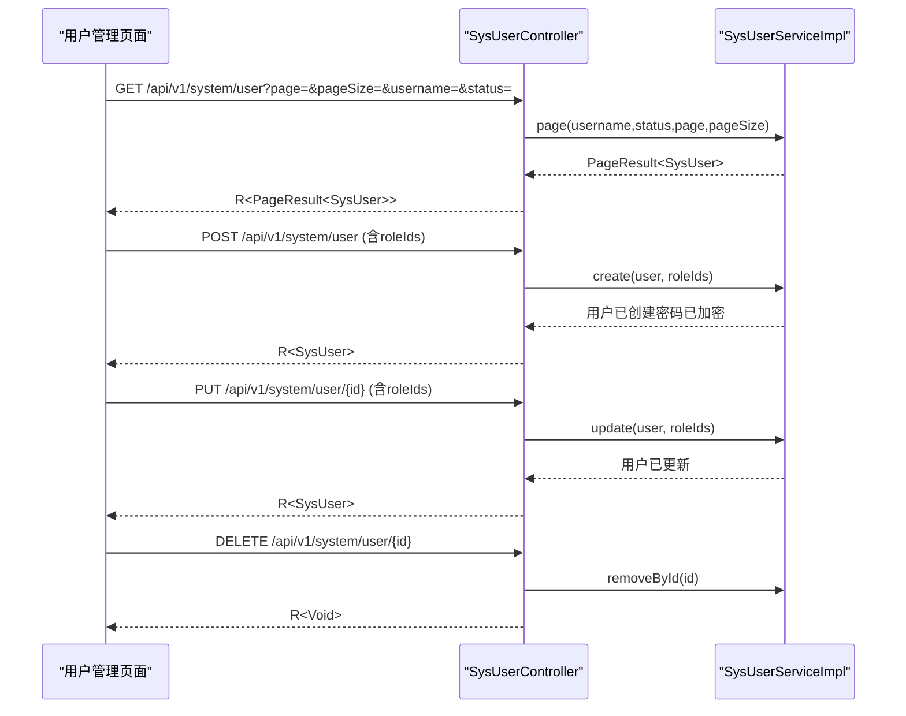
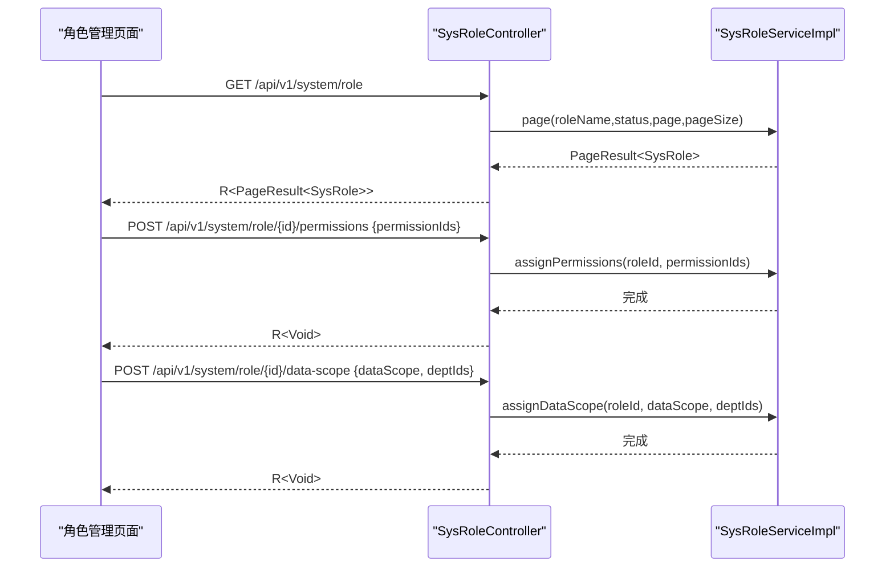
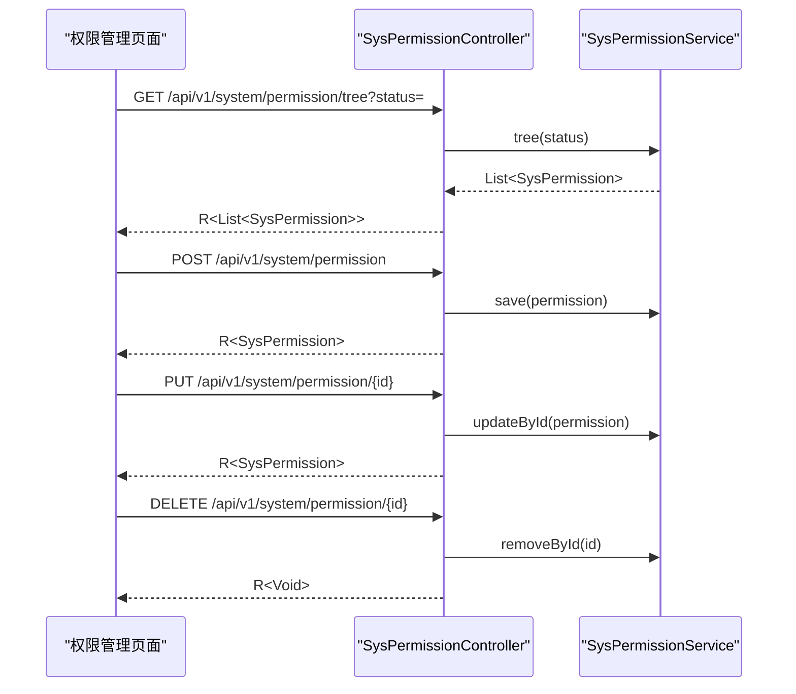
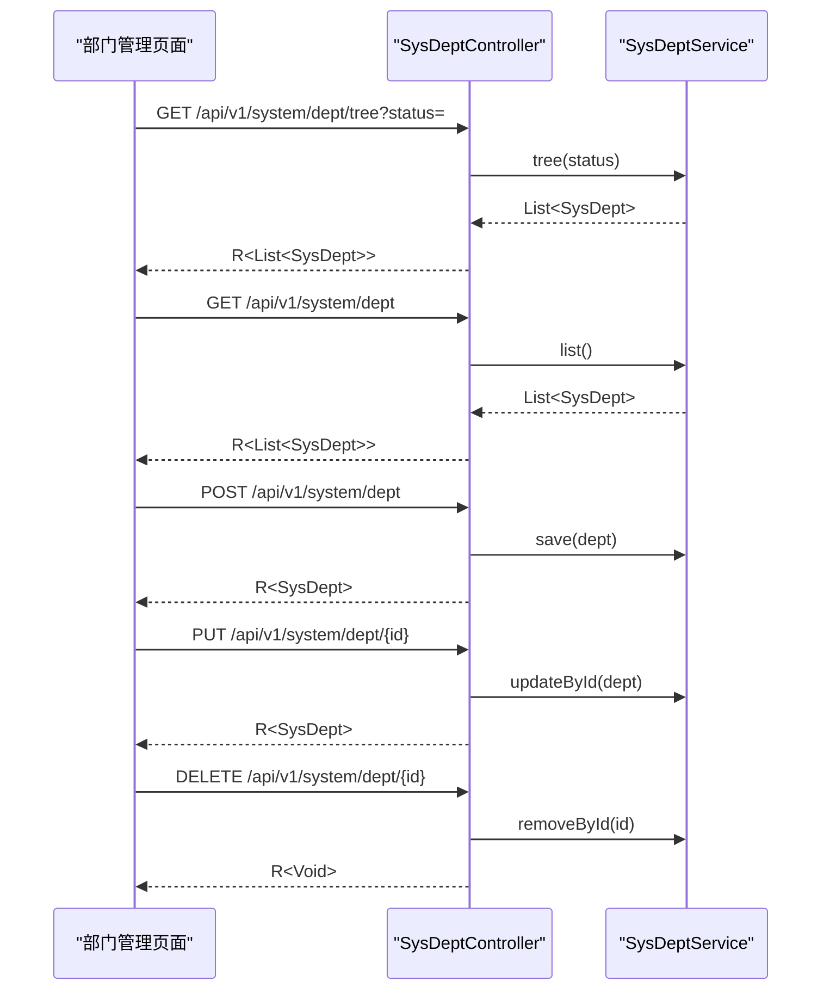
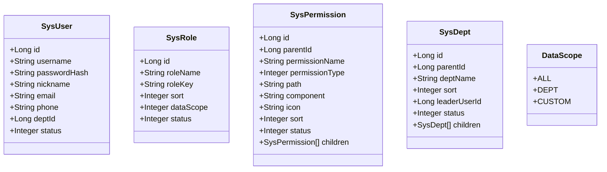

# 系统管理页面

<cite>
**本文档引用的文件**
- [SysUserController.java](file://oa-system/src/main/java/com/oa/admin/system/controller/SysUserController.java)
- [SysRoleController.java](file://oa-system/src/main/java/com/oa/admin/system/controller/SysRoleController.java)
- [SysPermissionController.java](file://oa-system/src/main/java/com/oa/admin/system/controller/SysPermissionController.java)
- [SysDeptController.java](file://oa-system/src/main/java/com/oa/admin/system/controller/SysDeptController.java)
- [SysUser.java](file://oa-system/src/main/java/com/oa/admin/system/entity/SysUser.java)
- [SysRole.java](file://oa-system/src/main/java/com/oa/admin/system/entity/SysRole.java)
- [SysPermission.java](file://oa-system/src/main/java/com/oa/admin/system/entity/SysPermission.java)
- [SysDept.java](file://oa-system/src/main/java/com/oa/admin/system/entity/SysDept.java)
- [SysUserServiceImpl.java](file://oa-system/src/main/java/com/oa/admin/system/service/impl/SysUserServiceImpl.java)
- [SysRoleServiceImpl.java](file://oa-system/src/main/java/com/oa/admin/system/service/impl/SysRoleServiceImpl.java)
- [DataScope.java](file://oa-system/src/main/java/com/oa/admin/system/enums/DataScope.java)
- [index.vue（用户管理）](file://oa-ui/src/views/system/user/index.vue)
- [index.vue（角色管理）](file://oa-ui/src/views/system/role/index.vue)
- [index.vue（权限管理）](file://oa-ui/src/views/system/permission/index.vue)
- [index.vue（部门管理）](file://oa-ui/src/views/system/dept/index.vue)
</cite>

## 目录
1. [简介](#简介)
2. [项目结构](#项目结构)
3. [核心组件](#核心组件)
4. [架构总览](#架构总览)
5. [详细组件分析](#详细组件分析)
6. [依赖分析](#依赖分析)
7. [性能考虑](#性能考虑)
8. [故障排除指南](#故障排除指南)
9. [结论](#结论)
10. [附录](#附录)

## 简介
本文件面向OA审批管理系统中的“系统管理”页面，围绕用户管理、角色管理、权限管理与部门管理四大模块，提供从后端接口到前端页面的完整实现说明。重点涵盖：
- 用户管理：用户列表展示、增删改查、角色分配
- 角色管理：角色树形权限分配、数据范围配置
- 权限管理：菜单权限、按钮权限、API权限的三级权限体系
- 部门管理：组织架构树形展示与层级关系维护
- 高级功能：表单验证、数据导入导出、批量操作的实现思路
- 交互设计与用户体验优化策略

## 项目结构
系统管理页面采用前后端分离架构，后端基于Spring Boot + MyBatis-Plus，前端基于Vue 3 + Element Plus，通过REST接口进行数据交互。

**图表来源**
- [SysUserController.java:17-84](file://oa-system/src/main/java/com/oa/admin/system/controller/SysUserController.java#L17-L84)
- [SysRoleController.java:17-77](file://oa-system/src/main/java/com/oa/admin/system/controller/SysRoleController.java#L17-L77)
- [SysPermissionController.java:15-62](file://oa-system/src/main/java/com/oa/admin/system/controller/SysPermissionController.java#L15-L62)
- [SysDeptController.java:16-69](file://oa-system/src/main/java/com/oa/admin/system/controller/SysDeptController.java#L16-L69)
- [SysUserServiceImpl.java:22-72](file://oa-system/src/main/java/com/oa/admin/system/service/impl/SysUserServiceImpl.java#L22-L72)
- [SysRoleServiceImpl.java:26-78](file://oa-system/src/main/java/com/oa/admin/system/service/impl/SysRoleServiceImpl.java#L26-L78)

**章节来源**
- [SysUserController.java:17-84](file://oa-system/src/main/java/com/oa/admin/system/controller/SysUserController.java#L17-L84)
- [SysRoleController.java:17-77](file://oa-system/src/main/java/com/oa/admin/system/controller/SysRoleController.java#L17-L77)
- [SysPermissionController.java:15-62](file://oa-system/src/main/java/com/oa/admin/system/controller/SysPermissionController.java#L15-L62)
- [SysDeptController.java:16-69](file://oa-system/src/main/java/com/oa/admin/system/controller/SysDeptController.java#L16-L69)

## 核心组件
- 用户管理控制器与服务：负责用户列表分页查询、创建、更新、删除以及角色分配
- 角色管理控制器与服务：负责角色列表、创建、更新、删除、权限分配与数据范围配置
- 权限管理控制器：负责权限树形结构与列表查询、创建、更新、删除
- 部门管理控制器：负责部门树形结构与列表查询、创建、更新、删除
- 前端页面：用户、角色、权限、部门四个管理页面，分别对应上述后端接口

**章节来源**
- [SysUser.java:13-26](file://oa-system/src/main/java/com/oa/admin/system/entity/SysUser.java#L13-L26)
- [SysRole.java:13-25](file://oa-system/src/main/java/com/oa/admin/system/entity/SysRole.java#L13-L25)
- [SysPermission.java:16-34](file://oa-system/src/main/java/com/oa/admin/system/entity/SysPermission.java#L16-L34)
- [SysDept.java:16-30](file://oa-system/src/main/java/com/oa/admin/system/entity/SysDept.java#L16-L30)

## 架构总览
系统管理页面遵循“控制器-服务-持久层”的分层架构，权限控制通过注解鉴权，前端通过统一的API模块与后端交互。

**图表来源**
- [SysUserController.java:23-83](file://oa-system/src/main/java/com/oa/admin/system/controller/SysUserController.java#L23-L83)
- [SysRoleController.java:23-76](file://oa-system/src/main/java/com/oa/admin/system/controller/SysRoleController.java#L23-L76)
- [SysPermissionController.java:21-61](file://oa-system/src/main/java/com/oa/admin/system/controller/SysPermissionController.java#L21-L61)
- [SysDeptController.java:22-68](file://oa-system/src/main/java/com/oa/admin/system/controller/SysDeptController.java#L22-L68)

## 详细组件分析

### 用户管理页面
- 功能概述
  - 列表展示：支持按用户名、状态筛选，分页加载
  - 新增/编辑：表单字段包含用户名、昵称、密码、邮箱、手机号、状态；编辑时可留空密码以跳过修改
  - 删除：软/硬删除由后端策略决定
  - 角色分配：在编辑时可选择多个角色，保存后替换该用户的现有角色映射
- 后端接口要点
  - GET /api/v1/system/user：分页查询，支持用户名模糊匹配与状态过滤
  - GET /api/v1/system/user/{id}：按ID查询用户，返回时清除敏感信息
  - POST /api/v1/system/user：创建用户，密码使用BCrypt加密
  - PUT /api/v1/system/user/{id}：更新用户，若未提供新密码则保持原密码
  - DELETE /api/v1/system/user/{id}：删除用户
- 前端页面要点
  - 使用表格展示用户列表，右侧固定操作列
  - 支持搜索框与分页控件联动
  - 对话框表单支持必填字段提示与状态标签显示
  - 提交时根据是否编辑态区分创建或更新

**图表来源**
- [SysUserController.java:23-83](file://oa-system/src/main/java/com/oa/admin/system/controller/SysUserController.java#L23-L83)
- [SysUserServiceImpl.java:27-71](file://oa-system/src/main/java/com/oa/admin/system/service/impl/SysUserServiceImpl.java#L27-L71)
- [index.vue（用户管理）:128-194](file://oa-ui/src/views/system/user/index.vue#L128-L194)

**章节来源**
- [SysUserController.java:23-83](file://oa-system/src/main/java/com/oa/admin/system/controller/SysUserController.java#L23-L83)
- [SysUserServiceImpl.java:27-71](file://oa-system/src/main/java/com/oa/admin/system/service/impl/SysUserServiceImpl.java#L27-L71)
- [index.vue（用户管理）:128-194](file://oa-ui/src/views/system/user/index.vue#L128-L194)

### 角色管理页面
- 功能概述
  - 列表展示：角色名称、角色标识、数据范围、状态
  - 新增/编辑：设置角色名称、标识、数据范围、状态
  - 权限分配：弹窗中以树形结构勾选权限，提交后替换角色的权限映射
  - 删除：删除角色
- 后端接口要点
  - GET /api/v1/system/role：分页查询，支持角色名模糊匹配与状态过滤
  - POST /api/v1/system/role/{id}/permissions：为角色分配权限（传入权限ID列表）
  - POST /api/v1/system/role/{id}/data-scope：设置角色数据范围与部门范围
- 前端页面要点
  - 表格右侧操作列包含“编辑”、“分配权限”、“删除”
  - “分配权限”对话框使用树形组件，默认勾选当前角色已拥有的权限
  - 数据范围下拉包含“全部”“本部门”“自定义部门”

**图表来源**
- [SysRoleController.java:23-76](file://oa-system/src/main/java/com/oa/admin/system/controller/SysRoleController.java#L23-L76)
- [SysRoleServiceImpl.java:42-77](file://oa-system/src/main/java/com/oa/admin/system/service/impl/SysRoleServiceImpl.java#L42-L77)
- [index.vue（角色管理）:131-205](file://oa-ui/src/views/system/role/index.vue#L131-L205)

**章节来源**
- [SysRoleController.java:23-76](file://oa-system/src/main/java/com/oa/admin/system/controller/SysRoleController.java#L23-L76)
- [SysRoleServiceImpl.java:42-77](file://oa-system/src/main/java/com/oa/admin/system/service/impl/SysRoleServiceImpl.java#L42-L77)
- [DataScope.java:11-26](file://oa-system/src/main/java/com/oa/admin/system/enums/DataScope.java#L11-L26)
- [index.vue（角色管理）:131-205](file://oa-ui/src/views/system/role/index.vue#L131-L205)

### 权限管理页面
- 功能概述
  - 权限树形展示：默认展开所有节点，支持按状态过滤
  - 类型区分：菜单、按钮、API三类权限，分别用于界面导航、按钮级控制与后端接口授权
  - 新增/编辑：支持设置父级、名称、类型、路径、组件、图标、排序、状态
  - 删除：删除权限
- 后端接口要点
  - GET /api/v1/system/permission/tree：返回权限树（可按状态过滤）
  - GET /api/v1/system/permission：返回权限列表（可按状态过滤）
  - 其余为标准的CRUD接口
- 前端页面要点
  - 使用树形表格展示权限，右侧操作列包含“编辑”“新增子项”“删除”
  - 类型以标签形式展示，便于识别

**图表来源**
- [SysPermissionController.java:21-61](file://oa-system/src/main/java/com/oa/admin/system/controller/SysPermissionController.java#L21-L61)
- [index.vue（权限管理）:133-195](file://oa-ui/src/views/system/permission/index.vue#L133-L195)

**章节来源**
- [SysPermissionController.java:21-61](file://oa-system/src/main/java/com/oa/admin/system/controller/SysPermissionController.java#L21-L61)
- [SysPermission.java:16-34](file://oa-system/src/main/java/com/oa/admin/system/entity/SysPermission.java#L16-L34)
- [index.vue（权限管理）:133-195](file://oa-ui/src/views/system/permission/index.vue#L133-L195)

### 部门管理页面
- 功能概述
  - 部门树形展示：默认展开所有节点，支持按状态过滤
  - 展示字段：部门名称、排序、负责人、状态
  - 新增/编辑：支持设置父级、名称、排序、负责人、状态
  - 删除：删除部门
- 后端接口要点
  - GET /api/v1/system/dept/tree：返回部门树（可按状态过滤）
  - GET /api/v1/system/dept：返回部门列表（可按状态过滤）
  - 其余为标准的CRUD接口
- 前端页面要点
  - 使用树形表格展示部门，右侧操作列包含“编辑”“新增子部门”“删除”
  - 负责人下拉来自用户列表，支持搜索与显示昵称+用户名

**图表来源**
- [SysDeptController.java:22-68](file://oa-system/src/main/java/com/oa/admin/system/controller/SysDeptController.java#L22-L68)
- [index.vue（部门管理）:126-191](file://oa-ui/src/views/system/dept/index.vue#L126-L191)

**章节来源**
- [SysDeptController.java:22-68](file://oa-system/src/main/java/com/oa/admin/system/controller/SysDeptController.java#L22-L68)
- [SysDept.java:16-30](file://oa-system/src/main/java/com/oa/admin/system/entity/SysDept.java#L16-L30)
- [index.vue（部门管理）:126-191](file://oa-ui/src/views/system/dept/index.vue#L126-L191)

## 依赖分析
- 控制器与服务层
  - 控制器仅负责参数接收、权限校验与响应封装，业务逻辑集中在服务实现
  - 用户服务在创建/更新时处理密码加密与角色映射更新
  - 角色服务在分配权限与数据范围时执行清理与批量插入
- 数据模型与枚举
  - 权限类型枚举明确区分菜单、按钮、API三类
  - 数据范围枚举支持全部、部门、自定义三种模式
- 前后端交互
  - 前端通过统一API模块调用后端接口，响应统一为R/PageResult封装

**图表来源**
- [SysUser.java:13-26](file://oa-system/src/main/java/com/oa/admin/system/entity/SysUser.java#L13-L26)
- [SysRole.java:13-25](file://oa-system/src/main/java/com/oa/admin/system/entity/SysRole.java#L13-L25)
- [SysPermission.java:16-34](file://oa-system/src/main/java/com/oa/admin/system/entity/SysPermission.java#L16-L34)
- [SysDept.java:16-30](file://oa-system/src/main/java/com/oa/admin/system/entity/SysDept.java#L16-L30)
- [DataScope.java:11-26](file://oa-system/src/main/java/com/oa/admin/system/enums/DataScope.java#L11-L26)

**章节来源**
- [SysUserServiceImpl.java:22-72](file://oa-system/src/main/java/com/oa/admin/system/service/impl/SysUserServiceImpl.java#L22-L72)
- [SysRoleServiceImpl.java:26-78](file://oa-system/src/main/java/com/oa/admin/system/service/impl/SysRoleServiceImpl.java#L26-L78)

## 性能考虑
- 分页查询：后端对用户、角色、部门均提供分页接口，避免一次性加载大量数据
- 树形结构：权限与部门树默认展开，建议在大数据量场景下启用懒加载或按需展开
- 密码处理：用户密码采用BCrypt加密存储，确保安全性
- 批量操作：角色权限分配与数据范围配置采用批量插入前先清理旧映射，减少冗余数据
- 前端渲染：表格默认展开树形节点，建议在数据量较大时关闭默认展开，提升首屏性能

## 故障排除指南
- 权限不足
  - 现象：访问受控接口返回失败
  - 处理：确认当前登录用户是否具备对应权限点（如system:user:list等）
- 密码更新无效
  - 现象：编辑用户时未修改密码
  - 处理：确认前端提交时是否携带新密码；后端仅在提供新密码时进行加密更新
- 角色权限未生效
  - 现象：分配权限后仍可访问被限制资源
  - 处理：检查权限树是否正确勾选；确认权限类型与目标一致（菜单/按钮/API）
- 数据范围异常
  - 现象：角色数据范围设置后查询结果不符合预期
  - 处理：核对数据范围枚举值与部门范围列表是否正确

**章节来源**
- [SysUserController.java:23-83](file://oa-system/src/main/java/com/oa/admin/system/controller/SysUserController.java#L23-L83)
- [SysRoleController.java:61-76](file://oa-system/src/main/java/com/oa/admin/system/controller/SysRoleController.java#L61-L76)
- [SysUserServiceImpl.java:48-57](file://oa-system/src/main/java/com/oa/admin/system/service/impl/SysUserServiceImpl.java#L48-L57)
- [SysRoleServiceImpl.java:57-77](file://oa-system/src/main/java/com/oa/admin/system/service/impl/SysRoleServiceImpl.java#L57-L77)

## 结论
系统管理页面通过清晰的三层权限体系（菜单、按钮、API）与树形结构管理，实现了对用户、角色、权限与部门的高效治理。后端以注解鉴权与分页查询保障安全与性能，前端以表格与对话框提供直观的交互体验。建议在后续迭代中引入更细粒度的审计日志与批量导入导出能力，进一步提升管理效率与合规性。

## 附录
- 高级功能实现建议
  - 表单验证：结合前端校验库与后端参数校验，覆盖必填、格式、长度等规则
  - 数据导入导出：提供Excel模板下载与导入解析，导出支持多条件筛选
  - 批量操作：支持批量启用/禁用、批量删除、批量分配角色/权限
- 用户体验优化
  - 加载状态：为关键操作添加加载指示器
  - 成功提示：统一使用消息提示反馈操作结果
  - 错误拦截：通过全局错误拦截器统一处理异常并提示
  - 快捷键：为常用操作提供快捷键支持（如Ctrl+Enter保存）