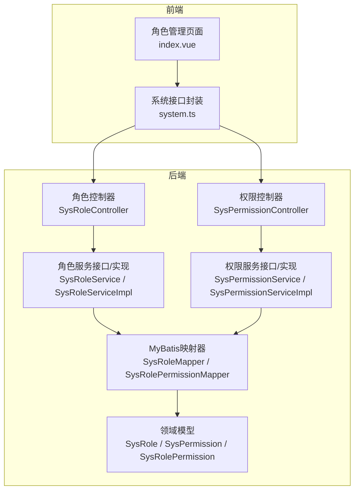
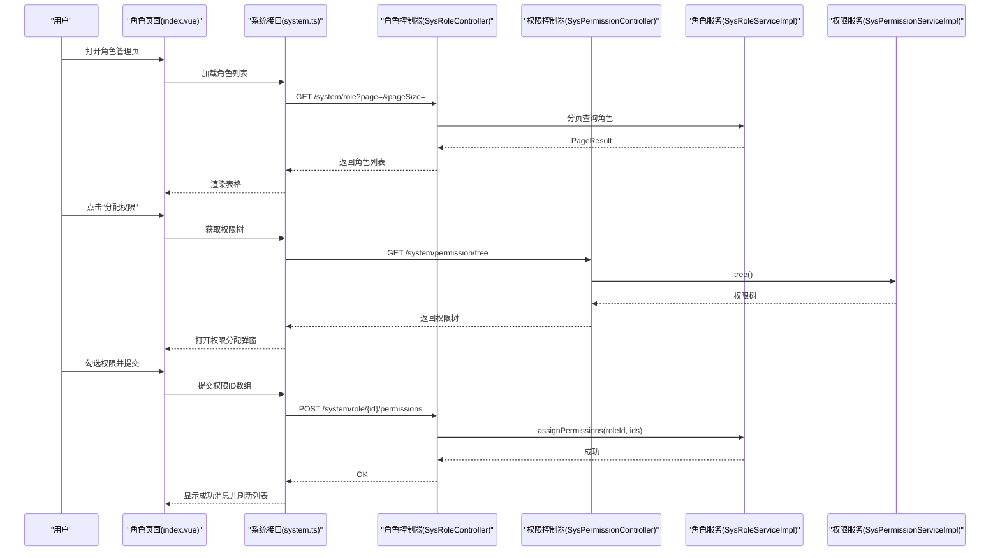
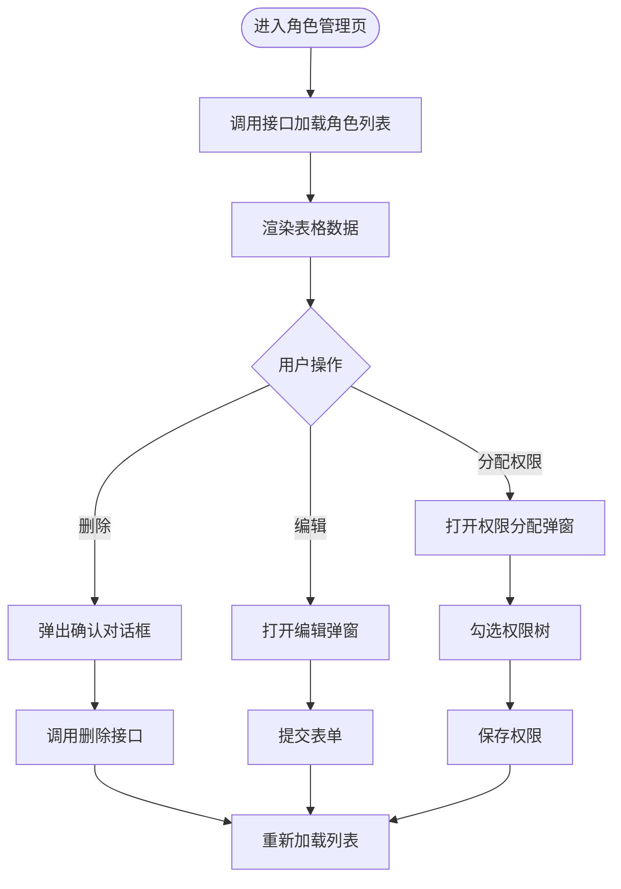
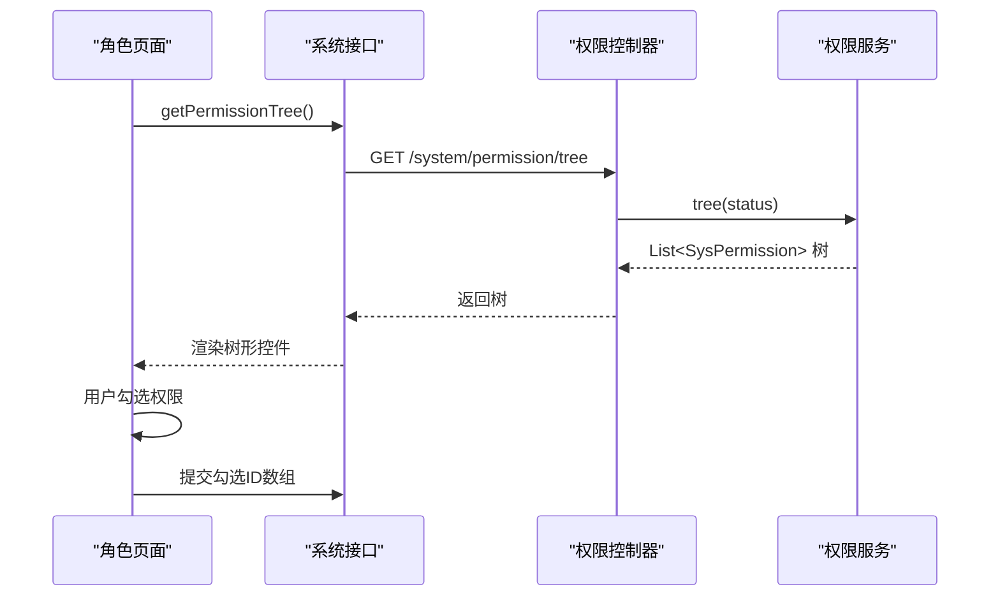
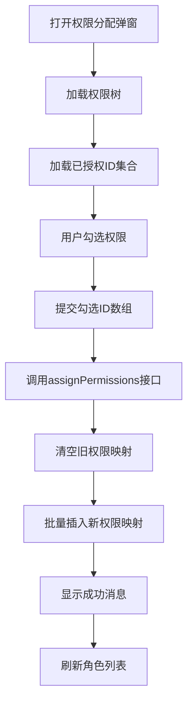
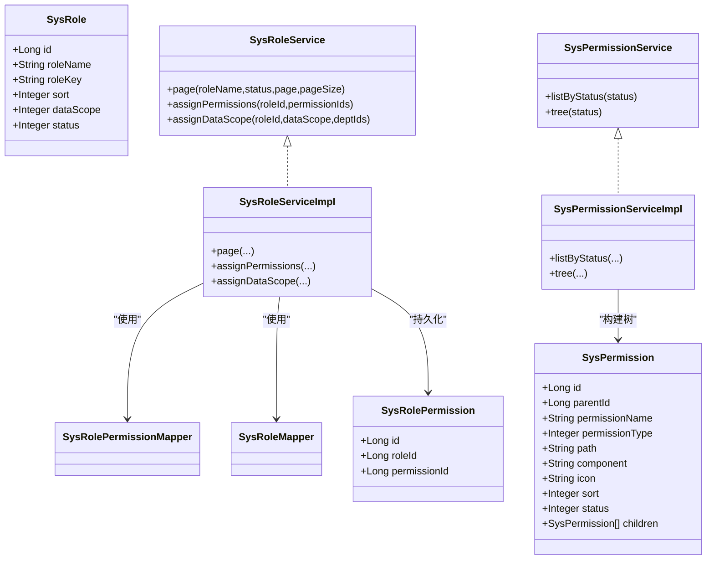

# 角色管理页面

<cite>
**本文引用的文件**
- [index.vue](file://oa-ui/src/views/system/role/index.vue)
- [system.ts](file://oa-ui/src/api/system.ts)
- [SysRoleController.java](file://oa-system/src/main/java/com/oa/admin/system/controller/SysRoleController.java)
- [SysPermissionController.java](file://oa-system/src/main/java/com/oa/admin/system/controller/SysPermissionController.java)
- [SysRoleService.java](file://oa-system/src/main/java/com/oa/admin/system/service/SysRoleService.java)
- [SysRoleServiceImpl.java](file://oa-system/src/main/java/com/oa/admin/system/service/impl/SysRoleServiceImpl.java)
- [SysPermissionService.java](file://oa-system/src/main/java/com/oa/admin/system/service/SysPermissionService.java)
- [SysPermissionServiceImpl.java](file://oa-system/src/main/java/com/oa/admin/system/service/impl/SysPermissionServiceImpl.java)
- [SysRole.java](file://oa-system/src/main/java/com/oa/admin/system/entity/SysRole.java)
- [SysPermission.java](file://oa-system/src/main/java/com/oa/admin/system/entity/SysPermission.java)
- [SysRolePermission.java](file://oa-system/src/main/java/com/oa/admin/system/entity/SysRolePermission.java)
- [SysRoleMapper.java](file://oa-system/src/main/java/com/oa/admin/system/mapper/SysRoleMapper.java)
- [SysRolePermissionMapper.java](file://oa-system/src/main/java/com/oa/admin/system/mapper/SysRolePermissionMapper.java)
- [DataScope.java](file://oa-system/src/main/java/com/oa/admin/system/enums/DataScope.java)
</cite>

## 目录
1. [简介](#简介)
2. [项目结构](#项目结构)
3. [核心组件](#核心组件)
4. [架构总览](#架构总览)
5. [详细组件分析](#详细组件分析)
6. [依赖关系分析](#依赖关系分析)
7. [性能考虑](#性能考虑)
8. [故障排查指南](#故障排查指南)
9. [结论](#结论)
10. [附录](#附录)

## 简介
本文件面向OA审批管理系统中的“角色管理页面”，系统性梳理前端页面设计与后端服务实现，覆盖以下主题：
- 角色列表展示与分页查询
- 权限树形结构渲染与权限分配
- 角色表单字段定义与校验策略
- 角色状态管理与删除保护
- 权限分配的用户体验与操作反馈
- 树形结构数据渲染与交互（展开/折叠、勾选联动）

## 项目结构
角色管理页面由前端Vue组件与后端Spring Boot控制器共同组成，前后端通过REST API进行数据交互。

图表来源
- [index.vue:102-208](file://oa-ui/src/views/system/role/index.vue#L102-L208)
- [system.ts:4-35](file://oa-ui/src/api/system.ts#L4-L35)
- [SysRoleController.java:23-76](file://oa-system/src/main/java/com/oa/admin/system/controller/SysRoleController.java#L23-L76)
- [SysPermissionController.java:21-61](file://oa-system/src/main/java/com/oa/admin/system/controller/SysPermissionController.java#L21-L61)
- [SysRoleService.java:12-18](file://oa-system/src/main/java/com/oa/admin/system/service/SysRoleService.java#L12-L18)
- [SysRoleServiceImpl.java:26-78](file://oa-system/src/main/java/com/oa/admin/system/service/impl/SysRoleServiceImpl.java#L26-L78)
- [SysPermissionService.java:11-16](file://oa-system/src/main/java/com/oa/admin/system/service/SysPermissionService.java#L11-L16)
- [SysPermissionServiceImpl.java:17-40](file://oa-system/src/main/java/com/oa/admin/system/service/impl/SysPermissionServiceImpl.java#L17-L40)
- [SysRoleMapper.java:10-12](file://oa-system/src/main/java/com/oa/admin/system/mapper/SysRoleMapper.java#L10-L12)
- [SysRolePermissionMapper.java:10-12](file://oa-system/src/main/java/com/oa/admin/system/mapper/SysRolePermissionMapper.java#L10-L12)
- [SysRole.java:16-25](file://oa-system/src/main/java/com/oa/admin/system/entity/SysRole.java#L16-L25)
- [SysPermission.java:18-34](file://oa-system/src/main/java/com/oa/admin/system/entity/SysPermission.java#L18-L34)
- [SysRolePermission.java:11-18](file://oa-system/src/main/java/com/oa/admin/system/entity/SysRolePermission.java#L11-L18)

章节来源
- [index.vue:1-213](file://oa-ui/src/views/system/role/index.vue#L1-L213)
- [system.ts:1-73](file://oa-ui/src/api/system.ts#L1-L73)

## 核心组件
- 前端角色管理页面：负责角色列表展示、角色表单弹窗、权限分配弹窗、树形权限选择与提交。
- 后端角色控制器：提供角色列表、详情、新增、修改、删除、分配权限、分配数据范围等接口。
- 后端权限控制器：提供权限树形结构查询接口。
- 角色服务层：实现分页查询、权限批量分配、数据范围分配（含自定义部门）。
- 权限服务层：实现权限列表按状态过滤与树形构建。
- 数据访问层：基于MyBatis Plus的映射器，支撑角色与权限的持久化。
- 领域模型：SysRole、SysPermission、SysRolePermission等实体。

章节来源
- [SysRoleController.java:23-76](file://oa-system/src/main/java/com/oa/admin/system/controller/SysRoleController.java#L23-L76)
- [SysPermissionController.java:21-61](file://oa-system/src/main/java/com/oa/admin/system/controller/SysPermissionController.java#L21-L61)
- [SysRoleService.java:12-18](file://oa-system/src/main/java/com/oa/admin/system/service/SysRoleService.java#L12-L18)
- [SysPermissionService.java:11-16](file://oa-system/src/main/java/com/oa/admin/system/service/SysPermissionService.java#L11-L16)
- [SysRoleServiceImpl.java:26-78](file://oa-system/src/main/java/com/oa/admin/system/service/impl/SysRoleServiceImpl.java#L26-L78)
- [SysPermissionServiceImpl.java:17-40](file://oa-system/src/main/java/com/oa/admin/system/service/impl/SysPermissionServiceImpl.java#L17-L40)

## 架构总览
角色管理页面采用典型的前后端分离架构：前端使用Element Plus表格与对话框，后端提供REST接口，通过MyBatis Plus访问数据库。

图表来源
- [index.vue:131-205](file://oa-ui/src/views/system/role/index.vue#L131-L205)
- [system.ts:4-35](file://oa-ui/src/api/system.ts#L4-L35)
- [SysRoleController.java:61-66](file://oa-system/src/main/java/com/oa/admin/system/controller/SysRoleController.java#L61-L66)
- [SysPermissionController.java:21-26](file://oa-system/src/main/java/com/oa/admin/system/controller/SysPermissionController.java#L21-L26)
- [SysRoleServiceImpl.java:42-55](file://oa-system/src/main/java/com/oa/admin/system/service/impl/SysRoleServiceImpl.java#L42-L55)
- [SysPermissionServiceImpl.java:28-39](file://oa-system/src/main/java/com/oa/admin/system/service/impl/SysPermissionServiceImpl.java#L28-L39)

## 详细组件分析

### 角色列表展示与分页查询
- 前端通过系统接口加载角色列表，支持按角色名、状态、分页参数查询。
- 表格列包含：角色名称、角色标识、数据范围、状态；操作列包含编辑、分配权限、删除。
- 删除采用气泡确认，防止误删。

图表来源
- [index.vue:8-42](file://oa-ui/src/views/system/role/index.vue#L8-L42)
- [index.vue:131-185](file://oa-ui/src/views/system/role/index.vue#L131-L185)
- [system.ts:4-22](file://oa-ui/src/api/system.ts#L4-L22)
- [SysRoleController.java:23-31](file://oa-system/src/main/java/com/oa/admin/system/controller/SysRoleController.java#L23-L31)

章节来源
- [index.vue:8-42](file://oa-ui/src/views/system/role/index.vue#L8-L42)
- [SysRoleController.java:23-31](file://oa-system/src/main/java/com/oa/admin/system/controller/SysRoleController.java#L23-L31)

### 角色表单设计与字段定义
- 字段清单：角色名称、角色标识、数据范围、状态。
- 数据范围枚举：全部数据、本部门数据、自定义部门（对应后端数据范围枚举）。
- 状态枚举：正常、禁用。
- 表单默认值：新建时数据范围与状态默认为“全部数据”、“正常”。

章节来源
- [index.vue:51-71](file://oa-ui/src/views/system/role/index.vue#L51-L71)
- [SysRole.java:19-24](file://oa-system/src/main/java/com/oa/admin/system/entity/SysRole.java#L19-L24)
- [DataScope.java:11-26](file://oa-system/src/main/java/com/oa/admin/system/enums/DataScope.java#L11-L26)

### 权限树形结构展示与交互
- 后端提供权限树接口，返回以parentId组织的树形结构。
- 前端使用Element Plus树组件展示，支持勾选、默认勾选已授权项。
- 支持父子节点联动勾选，提交时仅取叶子节点ID集合。

图表来源
- [index.vue:78-98](file://oa-ui/src/views/system/role/index.vue#L78-L98)
- [index.vue:187-205](file://oa-ui/src/views/system/role/index.vue#L187-L205)
- [system.ts:33-35](file://oa-ui/src/api/system.ts#L33-L35)
- [SysPermissionController.java:21-26](file://oa-system/src/main/java/com/oa/admin/system/controller/SysPermissionController.java#L21-L26)
- [SysPermissionServiceImpl.java:28-39](file://oa-system/src/main/java/com/oa/admin/system/service/impl/SysPermissionServiceImpl.java#L28-L39)

章节来源
- [index.vue:78-98](file://oa-ui/src/views/system/role/index.vue#L78-L98)
- [SysPermissionController.java:21-26](file://oa-system/src/main/java/com/oa/admin/system/controller/SysPermissionController.java#L21-L26)
- [SysPermissionServiceImpl.java:28-39](file://oa-system/src/main/java/com/oa/admin/system/service/impl/SysPermissionServiceImpl.java#L28-L39)

### 角色权限分配实现
- 接口路径：POST /system/role/{id}/permissions，请求体包含permissionIds数组。
- 后端逻辑：先清空该角色旧权限，再批量插入新权限映射。
- 前端交互：打开权限分配弹窗，加载权限树与当前已授权ID集合，提交后刷新列表。

图表来源
- [index.vue:187-205](file://oa-ui/src/views/system/role/index.vue#L187-L205)
- [system.ts:24-26](file://oa-ui/src/api/system.ts#L24-L26)
- [SysRoleController.java:61-66](file://oa-system/src/main/java/com/oa/admin/system/controller/SysRoleController.java#L61-L66)
- [SysRoleServiceImpl.java:42-55](file://oa-system/src/main/java/com/oa/admin/system/service/impl/SysRoleServiceImpl.java#L42-L55)

章节来源
- [SysRoleController.java:61-66](file://oa-system/src/main/java/com/oa/admin/system/controller/SysRoleController.java#L61-L66)
- [SysRoleServiceImpl.java:42-55](file://oa-system/src/main/java/com/oa/admin/system/service/impl/SysRoleServiceImpl.java#L42-L55)

### 角色状态管理与删除保护
- 状态字段：正常/禁用，用于控制角色是否生效。
- 删除流程：弹出确认对话框，确认后调用删除接口，成功后刷新列表。
- 删除保护：当前实现未见业务层面的“不可删除”约束逻辑，建议在业务需要时增加关联检查（如是否存在用户绑定、是否为内置角色等）。

章节来源
- [index.vue:22-28](file://oa-ui/src/views/system/role/index.vue#L22-L28)
- [index.vue:177-185](file://oa-ui/src/views/system/role/index.vue#L177-L185)
- [SysRoleController.java:54-59](file://oa-system/src/main/java/com/oa/admin/system/controller/SysRoleController.java#L54-L59)

### 数据范围与自定义部门
- 数据范围枚举：全部数据、本部门数据、自定义部门。
- 自定义部门场景：当数据范围为“自定义部门”时，后端会清理旧的部门映射并批量插入新的部门ID集合。
- 前端未直接暴露此功能入口，但后端提供了分配数据范围的接口。

章节来源
- [DataScope.java:11-26](file://oa-system/src/main/java/com/oa/admin/system/enums/DataScope.java#L11-L26)
- [SysRoleController.java:68-76](file://oa-system/src/main/java/com/oa/admin/system/controller/SysRoleController.java#L68-L76)
- [SysRoleServiceImpl.java:57-77](file://oa-system/src/main/java/com/oa/admin/system/service/impl/SysRoleServiceImpl.java#L57-L77)

### 角色表单字段与校验策略
- 字段定义：角色名称、角色标识、数据范围、状态。
- 默认值：新建时数据范围与状态默认为“全部数据”、“正常”。
- 校验策略：前端未配置复杂校验规则，建议在实际业务中补充必填与唯一性校验（如角色标识唯一）。

章节来源
- [index.vue:118-123](file://oa-ui/src/views/system/role/index.vue#L118-L123)
- [index.vue:141-159](file://oa-ui/src/views/system/role/index.vue#L141-L159)

## 依赖关系分析

图表来源
- [SysRole.java:16-25](file://oa-system/src/main/java/com/oa/admin/system/entity/SysRole.java#L16-L25)
- [SysPermission.java:18-34](file://oa-system/src/main/java/com/oa/admin/system/entity/SysPermission.java#L18-L34)
- [SysRolePermission.java:11-18](file://oa-system/src/main/java/com/oa/admin/system/entity/SysRolePermission.java#L11-L18)
- [SysRoleService.java:12-18](file://oa-system/src/main/java/com/oa/admin/system/service/SysRoleService.java#L12-L18)
- [SysRoleServiceImpl.java:26-78](file://oa-system/src/main/java/com/oa/admin/system/service/impl/SysRoleServiceImpl.java#L26-L78)
- [SysPermissionService.java:11-16](file://oa-system/src/main/java/com/oa/admin/system/service/SysPermissionService.java#L11-L16)
- [SysPermissionServiceImpl.java:17-40](file://oa-system/src/main/java/com/oa/admin/system/service/impl/SysPermissionServiceImpl.java#L17-L40)

章节来源
- [SysRoleServiceImpl.java:26-78](file://oa-system/src/main/java/com/oa/admin/system/service/impl/SysRoleServiceImpl.java#L26-L78)
- [SysPermissionServiceImpl.java:17-40](file://oa-system/src/main/java/com/oa/admin/system/service/impl/SysPermissionServiceImpl.java#L17-L40)

## 性能考虑
- 列表分页：后端已实现分页查询，前端应合理设置pageSize并避免一次性加载过多数据。
- 权限树构建：后端在内存中递归构建树，建议权限总量不宜过大；若权限量大，可考虑数据库层面的层级查询或缓存。
- 批量权限分配：后端采用先清空后批量插入的方式，权限数量较多时建议评估事务与索引性能。
- 前端渲染：树组件勾选时建议避免不必要的全量重绘，Element Plus默认已优化。

## 故障排查指南
- 接口403/鉴权失败：确认当前登录用户具备相应权限点（如system:role:list、system:role:edit、system:role:remove、system:permission:list）。
- 权限分配失败：检查permissionIds是否为空或越界；确认角色ID有效。
- 删除失败：检查是否存在外键约束或业务拦截逻辑（如不可删除内置角色）。
- 权限树为空：确认权限数据存在且状态正常；后端tree接口会按状态过滤。

章节来源
- [SysRoleController.java:24-25](file://oa-system/src/main/java/com/oa/admin/system/controller/SysRoleController.java#L24-L25)
- [SysPermissionController.java:22-23](file://oa-system/src/main/java/com/oa/admin/system/controller/SysPermissionController.java#L22-L23)

## 结论
角色管理页面实现了角色列表、表单编辑、权限树分配与删除等核心功能，前后端职责清晰、接口简洁。建议后续增强：
- 表单校验与角色标识唯一性约束
- 删除保护与依赖检查
- 权限树大数据量下的性能优化
- 操作反馈与错误提示的统一化

## 附录

### API定义概览
- 获取角色列表：GET /system/role
- 获取角色详情：GET /system/role/{id}
- 新增角色：POST /system/role
- 更新角色：PUT /system/role/{id}
- 删除角色：DELETE /system/role/{id}
- 分配角色权限：POST /system/role/{id}/permissions
- 分配角色数据范围：POST /system/role/{id}/data-scope
- 获取权限树：GET /system/permission/tree

章节来源
- [system.ts:4-35](file://oa-ui/src/api/system.ts#L4-L35)
- [SysRoleController.java:23-76](file://oa-system/src/main/java/com/oa/admin/system/controller/SysRoleController.java#L23-L76)
- [SysPermissionController.java:21-61](file://oa-system/src/main/java/com/oa/admin/system/controller/SysPermissionController.java#L21-L61)