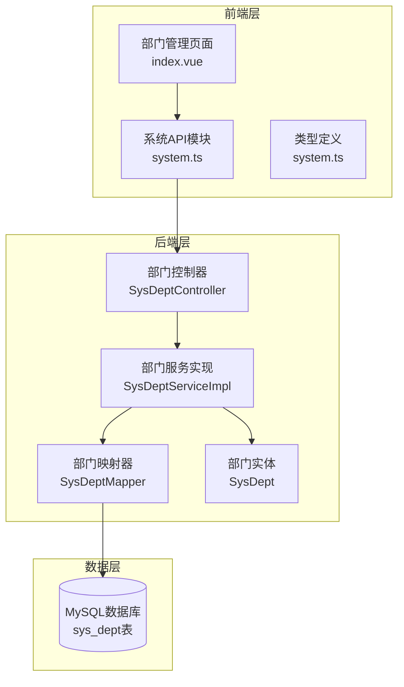
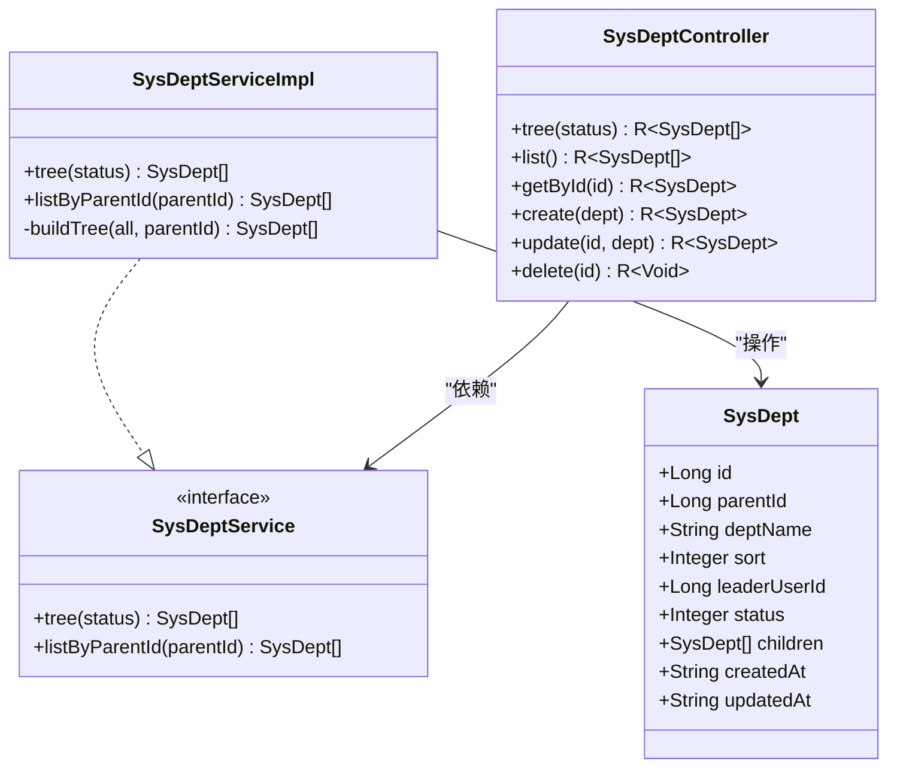
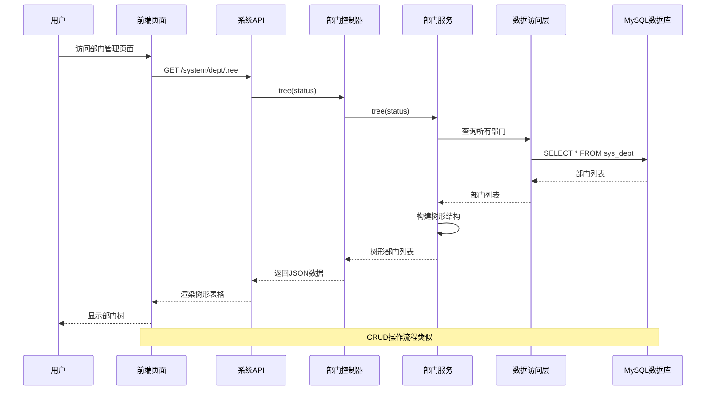
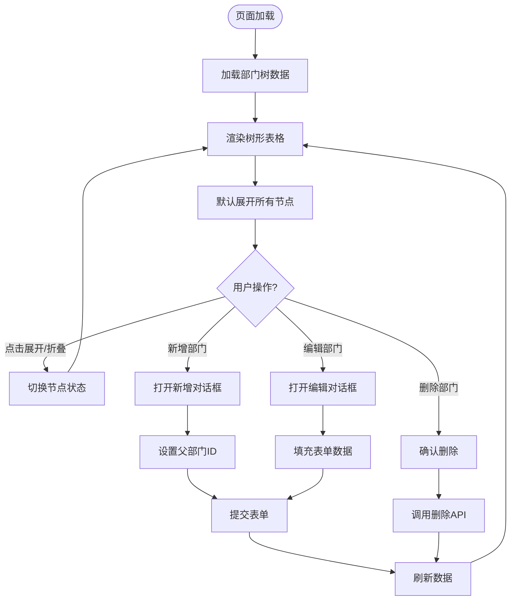
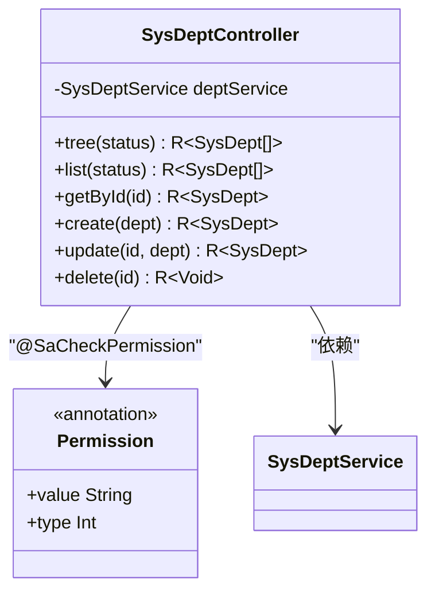
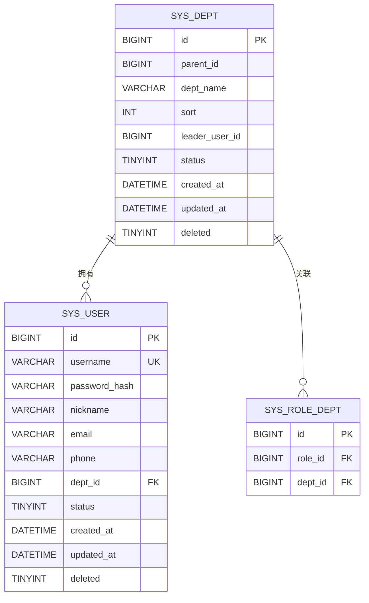
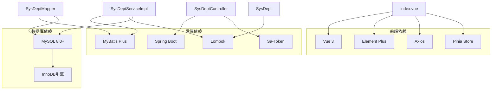
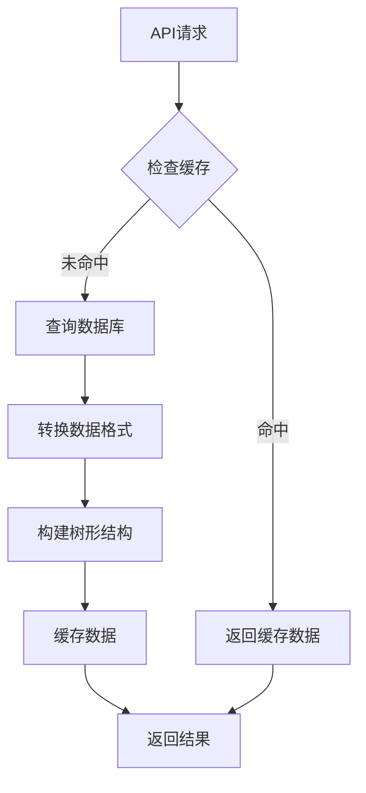
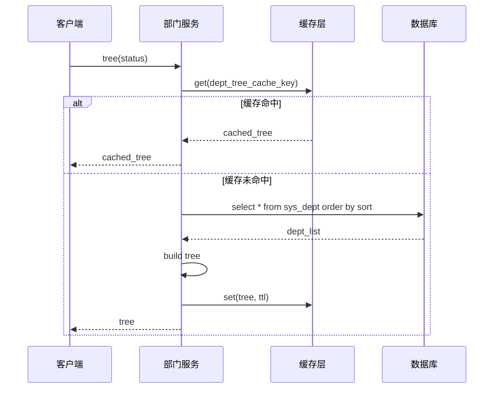
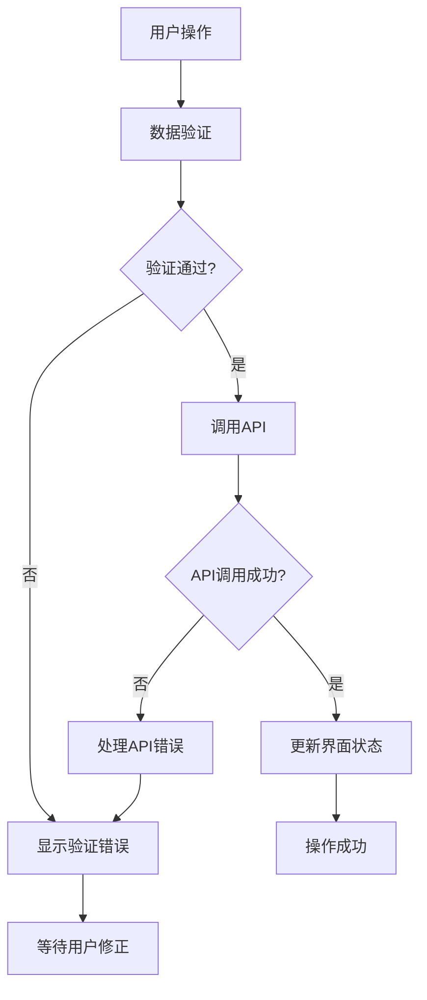

# 部门管理页面

<cite>
**本文档引用的文件**
- [SysDeptController.java](file://oa-system/src/main/java/com/oa/admin/system/controller/SysDeptController.java)
- [SysDept.java](file://oa-system/src/main/java/com/oa/admin/system/entity/SysDept.java)
- [SysDeptServiceImpl.java](file://oa-system/src/main/java/com/oa/admin/system/service/impl/SysDeptServiceImpl.java)
- [SysDeptMapper.java](file://oa-system/src/main/java/com/oa/admin/system/mapper/SysDeptMapper.java)
- [SysDeptService.java](file://oa-system/src/main/java/com/oa/admin/system/service/SysDeptService.java)
- [TreeConstants.java](file://oa-common/src/main/java/com/oa/admin/common/constant/TreeConstants.java)
- [V1__init_sys_tables.sql](file://oa-app/src/main/resources/db/migration/V1__init_sys_tables.sql)
- [index.vue](file://oa-ui/src/views/system/dept/index.vue)
- [system.ts](file://oa-ui/src/api/system.ts)
- [system.ts](file://oa-ui/src/types/system.ts)
</cite>

## 目录
1. [简介](#简介)
2. [项目结构](#项目结构)
3. [核心组件](#核心组件)
4. [架构概览](#架构概览)
5. [详细组件分析](#详细组件分析)
6. [依赖关系分析](#依赖关系分析)
7. [性能考虑](#性能考虑)
8. [故障排除指南](#故障排除指南)
9. [结论](#结论)

## 简介

本文档详细描述了OA审批管理系统中部门管理页面的设计与实现。该页面提供了完整的组织架构树形展示和层级关系管理功能，支持部门的增删改查操作、异步加载、懒加载、展开折叠等交互功能。系统采用前后端分离架构，后端使用Spring Boot + MyBatis Plus，前端使用Vue 3 + Element Plus。

## 项目结构

部门管理页面涉及前后端两个层面的实现：



**图表来源**
- [index.vue:1-202](file://oa-ui/src/views/system/dept/index.vue#L1-L202)
- [SysDeptController.java:1-70](file://oa-system/src/main/java/com/oa/admin/system/controller/SysDeptController.java#L1-L70)
- [SysDeptServiceImpl.java:1-44](file://oa-system/src/main/java/com/oa/admin/system/service/impl/SysDeptServiceImpl.java#L1-L44)

**章节来源**
- [index.vue:1-202](file://oa-ui/src/views/system/dept/index.vue#L1-L202)
- [SysDeptController.java:1-70](file://oa-system/src/main/java/com/oa/admin/system/controller/SysDeptController.java#L1-L70)

## 核心组件

### 数据模型设计

部门管理的核心数据模型基于以下字段设计：

| 字段名 | 类型 | 描述 | 约束 |
|--------|------|------|------|
| id | BIGINT | 部门ID | 主键，自增 |
| parentId | BIGINT | 父部门ID | 默认0表示顶级部门 |
| deptName | VARCHAR(100) | 部门名称 | 非空 |
| sort | INT | 排序号 | 默认0，用于显示顺序 |
| leaderUserId | BIGINT | 部门负责人ID | 可为空 |
| status | TINYINT | 状态 | 1=正常，0=禁用，默认1 |
| createdAt | DATETIME | 创建时间 | 自动设置 |
| updatedAt | DATETIME | 更新时间 | 自动更新 |
| deleted | TINYINT | 逻辑删除标志 | 0=未删，1=已删 |

### 树形结构实现

系统采用标准的树形数据结构，通过parentId字段建立父子关系：



**图表来源**
- [SysDept.java:16-30](file://oa-system/src/main/java/com/oa/admin/system/entity/SysDept.java#L16-L30)
- [SysDeptService.java:11-16](file://oa-system/src/main/java/com/oa/admin/system/service/SysDeptService.java#L11-L16)
- [SysDeptServiceImpl.java:17-44](file://oa-system/src/main/java/com/oa/admin/system/service/impl/SysDeptServiceImpl.java#L17-L44)
- [SysDeptController.java:16-69](file://oa-system/src/main/java/com/oa/admin/system/controller/SysDeptController.java#L16-L69)

**章节来源**
- [SysDept.java:16-30](file://oa-system/src/main/java/com/oa/admin/system/entity/SysDept.java#L16-L30)
- [V1__init_sys_tables.sql:5-16](file://oa-app/src/main/resources/db/migration/V1__init_sys_tables.sql#L5-L16)

## 架构概览

部门管理页面采用经典的三层架构模式：



**图表来源**
- [index.vue:126-134](file://oa-ui/src/views/system/dept/index.vue#L126-L134)
- [system.ts:54-56](file://oa-ui/src/api/system.ts#L54-L56)
- [SysDeptController.java:22-27](file://oa-system/src/main/java/com/oa/admin/system/controller/SysDeptController.java#L22-L27)
- [SysDeptServiceImpl.java:20-27](file://oa-system/src/main/java/com/oa/admin/system/service/impl/SysDeptServiceImpl.java#L20-L27)

## 详细组件分析

### 前端实现

#### 树形表格渲染

前端使用Element Plus的树形表格组件实现部门树的可视化展示：



**图表来源**
- [index.vue:8-49](file://oa-ui/src/views/system/dept/index.vue#L8-L49)
- [index.vue:145-165](file://oa-ui/src/views/system/dept/index.vue#L145-L165)
- [index.vue:183-191](file://oa-ui/src/views/system/dept/index.vue#L183-L191)

#### 表单验证与交互

部门表单支持完整的CRUD操作：

| 操作类型 | 字段 | 验证规则 | 功能描述 |
|----------|------|----------|----------|
| 新增 | deptName | 必填，长度限制 | 部门名称必填 |
| 新增 | sort | 数字，>=0 | 排序号，数字类型 |
| 新增 | leaderUserId | 可选 | 部门负责人选择 |
| 新增 | status | 选项：1/0 | 状态选择，默认正常 |
| 编辑 | 同上 | 同上 | 更新现有部门信息 |

**章节来源**
- [index.vue:52-92](file://oa-ui/src/views/system/dept/index.vue#L52-L92)
- [index.vue:108-114](file://oa-ui/src/views/system/dept/index.vue#L108-L114)

### 后端实现

#### 控制器层

部门控制器提供RESTful API接口：



**图表来源**
- [SysDeptController.java:16-69](file://oa-system/src/main/java/com/oa/admin/system/controller/SysDeptController.java#L16-L69)

#### 服务层实现

服务层负责业务逻辑处理和树形结构构建：

```mermaid
flowchart TD
TreeRequest[tree(status)] --> QueryAll[查询所有部门]
QueryAll --> FilterStatus{是否指定状态?}
FilterStatus --> |是| FilterByStatus[按状态过滤]
FilterStatus --> |否| SortBySort[按排序号排序]
FilterByStatus --> SortBySort
SortBySort --> BuildTree[构建树形结构]
BuildTree --> RootFilter[筛选根节点]
RootFilter --> RecursiveBuild[递归构建子树]
RecursiveBuild --> ReturnResult[返回结果]
subgraph "构建算法"
RootFilter --> CheckParent[检查parentId]
CheckParent --> AddChild[添加到children]
AddChild --> RecursiveCall[递归调用]
end
```

**图表来源**
- [SysDeptServiceImpl.java:20-34](file://oa-system/src/main/java/com/oa/admin/system/service/impl/SysDeptServiceImpl.java#L20-L34)
- [TreeConstants.java:6-11](file://oa-common/src/main/java/com/oa/admin/common/constant/TreeConstants.java#L6-L11)

**章节来源**
- [SysDeptController.java:22-68](file://oa-system/src/main/java/com/oa/admin/system/controller/SysDeptController.java#L22-L68)
- [SysDeptServiceImpl.java:20-42](file://oa-system/src/main/java/com/oa/admin/system/service/impl/SysDeptServiceImpl.java#L20-L42)

### 数据访问层

数据访问层使用MyBatis Plus简化数据库操作：



**图表来源**
- [V1__init_sys_tables.sql:5-16](file://oa-app/src/main/resources/db/migration/V1__init_sys_tables.sql#L5-L16)
- [V1__init_sys_tables.sql:18-32](file://oa-app/src/main/resources/db/migration/V1__init_sys_tables.sql#L18-L32)
- [V1__init_sys_tables.sql:78-83](file://oa-app/src/main/resources/db/migration/V1__init_sys_tables.sql#L78-L83)

**章节来源**
- [SysDeptMapper.java:10-12](file://oa-system/src/main/java/com/oa/admin/system/mapper/SysDeptMapper.java#L10-L12)
- [V1__init_sys_tables.sql:5-16](file://oa-app/src/main/resources/db/migration/V1__init_sys_tables.sql#L5-L16)

## 依赖关系分析

### 组件依赖图



**图表来源**
- [index.vue:96-98](file://oa-ui/src/views/system/dept/index.vue#L96-L98)
- [SysDeptController.java:3-8](file://oa-system/src/main/java/com/oa/admin/system/controller/SysDeptController.java#L3-L8)
- [SysDeptServiceImpl.java:3-9](file://oa-system/src/main/java/com/oa/admin/system/service/impl/SysDeptServiceImpl.java#L3-L9)

### 外部依赖关系

系统依赖的关键外部组件：

| 组件 | 版本 | 用途 | 重要性 |
|------|------|------|--------|
| Vue 3 | latest | 前端框架 | 核心 |
| Element Plus | latest | UI组件库 | 核心 |
| Spring Boot | 2.7.x | 后端框架 | 核心 |
| MyBatis Plus | 3.5.x | ORM框架 | 核心 |
| MySQL | 8.0+ | 数据存储 | 核心 |
| Sa-Token | 1.33.x | 权限认证 | 重要 |
| Lombok | 1.18.x | 代码简化 | 一般 |

**章节来源**
- [SysDeptController.java:3-8](file://oa-system/src/main/java/com/oa/admin/system/controller/SysDeptController.java#L3-L8)
- [index.vue:96-98](file://oa-ui/src/views/system/dept/index.vue#L96-L98)

## 性能考虑

### 前端性能优化

#### 树形渲染优化

1. **默认展开策略**
   - 使用 `default-expand-all` 属性一次性展开所有节点
   - 对于大型组织架构，建议改为懒加载模式

2. **虚拟滚动**
   - 当部门数量超过1000个时，建议实现虚拟滚动
   - 减少DOM节点数量，提升渲染性能

3. **缓存机制**
   - 实现部门数据缓存，避免重复请求
   - 支持增量更新，只更新变化的节点

#### API调优



### 后端性能优化

#### 数据库优化

1. **索引优化**
   - `idx_parent_id` 索引用于快速查找子部门
   - `sort` 字段索引用于排序查询

2. **查询优化**
   - 使用 `LIMIT` 限制查询结果集大小
   - 实现分页查询支持大数据量场景

3. **连接池配置**
   - 配置合理的连接池大小
   - 设置连接超时和空闲回收策略

#### 服务层优化



**章节来源**
- [SysDeptServiceImpl.java:20-27](file://oa-system/src/main/java/com/oa/admin/system/service/impl/SysDeptServiceImpl.java#L20-L27)
- [V1__init_sys_tables.sql:15](file://oa-app/src/main/resources/db/migration/V1__init_sys_tables.sql#L15)

## 故障排除指南

### 常见问题及解决方案

#### 部门树渲染异常

**问题现象**: 部门树无法正确显示或显示错乱

**可能原因**:
1. 数据库中存在循环引用
2. 父子关系数据不一致
3. 排序字段值异常

**排查步骤**:
1. 检查 `sys_dept` 表中的 `parent_id` 字段
2. 验证是否存在 `parent_id = id` 的记录
3. 确认排序字段 `sort` 的值是否合理

#### CRUD操作失败

**问题现象**: 新增、编辑或删除部门操作失败

**可能原因**:
1. 权限不足
2. 数据验证失败
3. 数据库约束冲突

**解决方案**:
1. 检查用户权限配置
2. 验证表单数据格式
3. 查看数据库约束错误信息

#### 性能问题

**问题现象**: 页面加载缓慢或响应迟缓

**优化建议**:
1. 实现懒加载机制
2. 添加数据缓存
3. 优化数据库查询
4. 考虑分页加载

### 错误处理机制

系统实现了完善的错误处理机制：



**章节来源**
- [index.vue:167-181](file://oa-ui/src/views/system/dept/index.vue#L167-L181)
- [SysDeptController.java:48-68](file://oa-system/src/main/java/com/oa/admin/system/controller/SysDeptController.java#L48-L68)

## 结论

OA审批管理系统的部门管理页面实现了完整的组织架构树形展示和层级关系管理功能。系统采用现代化的技术栈，具有良好的可扩展性和维护性。

### 主要优势

1. **清晰的架构设计**: 前后端分离，职责明确
2. **完整的功能实现**: 支持树形展示、CRUD操作、权限控制
3. **良好的用户体验**: 响应式设计，操作直观
4. **可扩展性强**: 模块化设计，便于功能扩展

### 改进建议

1. **实现懒加载**: 对于大型组织架构，建议实现懒加载以提升性能
2. **增强数据校验**: 添加更严格的数据完整性校验
3. **优化权限控制**: 实现更细粒度的权限管理
4. **增加审计日志**: 记录重要的部门变更操作

该部门管理页面为OA系统的组织管理提供了坚实的基础，能够满足大多数企业级应用的需求。