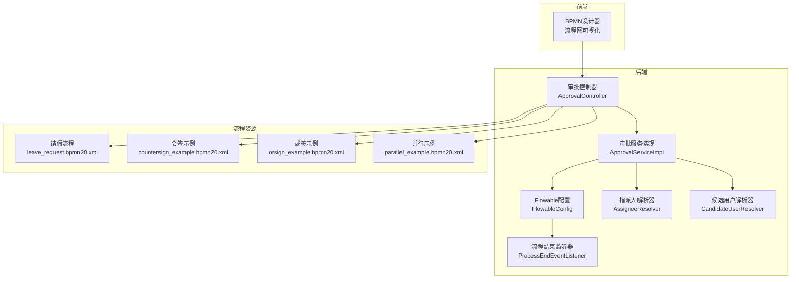
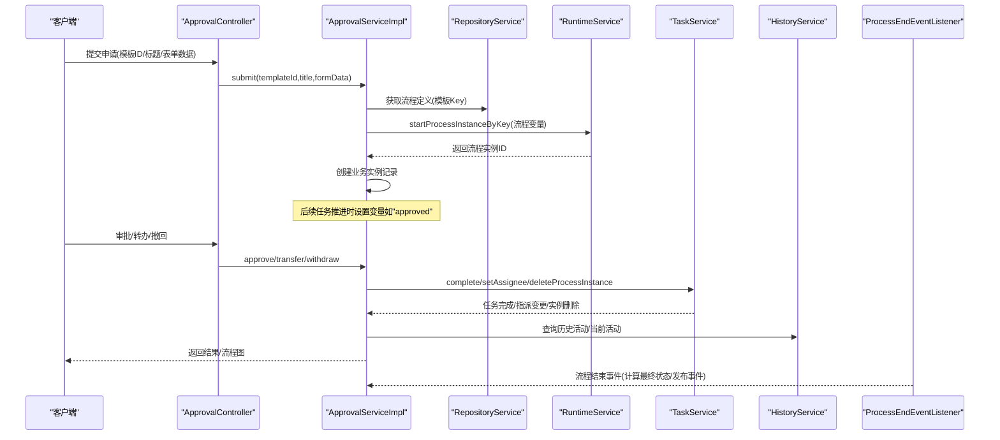
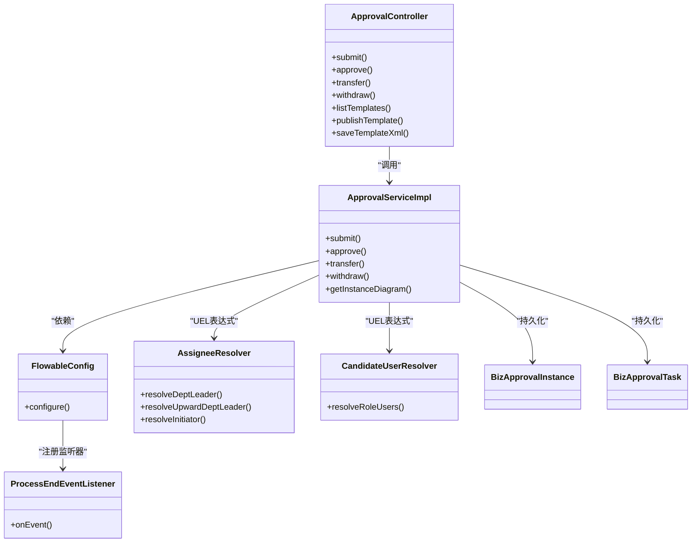
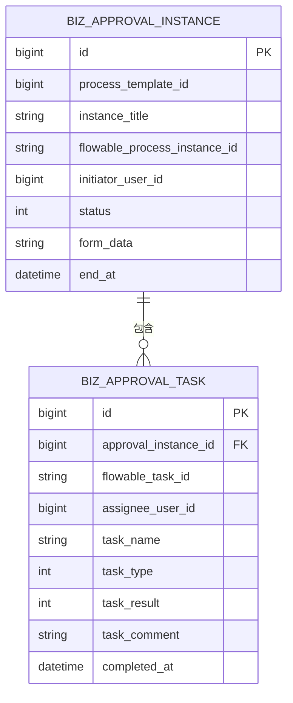

# BPMN流程设计

<cite>
**本文引用的文件**
- [leave_request.bpmn20.xml](file://oa-app/src/main/resources/processes/leave_request.bpmn20.xml)
- [countersign_example.bpmn20.xml](file://oa-app/src/main/resources/processes/countersign_example.bpmn20.xml)
- [orsign_example.bpmn20.xml](file://oa-app/src/main/resources/processes/orsign_example.bpmn20.xml)
- [parallel_example.bpmn20.xml](file://oa-app/src/main/resources/processes/parallel_example.bpmn20.xml)
- [FlowableConfig.java](file://oa-approval/src/main/java/com/oa/admin/approval/config/FlowableConfig.java)
- [FlowableConstants.java](file://oa-approval/src/main/java/com/oa/admin/approval/constant/FlowableConstants.java)
- [ProcessEndEventListener.java](file://oa-approval/src/main/java/com/oa/admin/approval/listener/ProcessEndEventListener.java)
- [AssigneeResolver.java](file://oa-approval/src/main/java/com/oa/admin/approval/resolver/AssigneeResolver.java)
- [CandidateUserResolver.java](file://oa-approval/src/main/java/com/oa/admin/approval/resolver/CandidateUserResolver.java)
- [flowable.moddle.json](file://oa-ui/src/bpmn/moddle/flowable.moddle.json)
- [ApprovalTaskType.java](file://oa-approval/src/main/java/com/oa/admin/approval/enums/ApprovalTaskType.java)
- [ApprovalInstanceStatus.java](file://oa-approval/src/main/java/com/oa/admin/approval/enums/ApprovalInstanceStatus.java)
- [ApprovalController.java](file://oa-approval/src/main/java/com/oa/admin/approval/controller/ApprovalController.java)
- [ApprovalServiceImpl.java](file://oa-approval/src/main/java/com/oa/admin/approval/service/impl/ApprovalServiceImpl.java)
- [BizApprovalInstance.java](file://oa-approval/src/main/java/com/oa/admin/approval/entity/BizApprovalInstance.java)
- [BizApprovalTask.java](file://oa-approval/src/main/java/com/oa/admin/approval/entity/BizApprovalTask.java)
</cite>

## 目录
1. [引言](#引言)
2. [项目结构](#项目结构)
3. [核心组件](#核心组件)
4. [架构总览](#架构总览)
5. [详细组件分析](#详细组件分析)
6. [依赖关系分析](#依赖关系分析)
7. [性能考量](#性能考量)
8. [故障排查指南](#故障排查指南)
9. [结论](#结论)
10. [附录](#附录)

## 引言
本文件面向BPMN 2.0流程设计与实现，结合项目中的Flowable集成实践，系统阐述以下内容：
- BPMN 2.0标准元素在项目中的使用：开始事件、结束事件、用户任务、网关、子流程等
- Flowable扩展元素与属性配置：任务监听器、多实例特性、UEL表达式、流程变量
- 常见流程模式：串行审批、并行审批、条件分支、会签、或签的设计原理与实现
- 流程图绘制最佳实践：清晰性、可维护性、用户体验
- 版本管理与向后兼容策略
- 具体XML配置示例与常见错误处理

## 项目结构
项目采用前后端分离与模块化组织，审批核心位于oa-approval模块，流程模板以BPMN文件形式存放在oa-app资源目录中；前端使用Vue与自定义BPMN建模工具链。

图表来源
- [ApprovalController.java:1-252](file://oa-approval/src/main/java/com/oa/admin/approval/controller/ApprovalController.java#L1-252)
- [ApprovalServiceImpl.java:1-792](file://oa-approval/src/main/java/com/oa/admin/approval/service/impl/ApprovalServiceImpl.java#L1-792)
- [FlowableConfig.java:1-31](file://oa-approval/src/main/java/com/oa/admin/approval/config/FlowableConfig.java#L1-31)
- [ProcessEndEventListener.java:1-80](file://oa-approval/src/main/java/com/oa/admin/approval/listener/ProcessEndEventListener.java#L1-80)
- [AssigneeResolver.java:1-62](file://oa-approval/src/main/java/com/oa/admin/approval/resolver/AssigneeResolver.java#L1-62)
- [CandidateUserResolver.java:1-31](file://oa-approval/src/main/java/com/oa/admin/approval/resolver/CandidateUserResolver.java#L1-31)
- [leave_request.bpmn20.xml:1-30](file://oa-app/src/main/resources/processes/leave_request.bpmn20.xml#L1-30)
- [countersign_example.bpmn20.xml:1-32](file://oa-app/src/main/resources/processes/countersign_example.bpmn20.xml#L1-32)
- [orsign_example.bpmn20.xml:1-32](file://oa-app/src/main/resources/processes/orsign_example.bpmn20.xml#L1-32)
- [parallel_example.bpmn20.xml:1-38](file://oa-app/src/main/resources/processes/parallel_example.bpmn20.xml#L1-38)

章节来源
- [ApprovalController.java:1-252](file://oa-approval/src/main/java/com/oa/admin/approval/controller/ApprovalController.java#L1-252)
- [ApprovalServiceImpl.java:1-792](file://oa-approval/src/main/java/com/oa/admin/approval/service/impl/ApprovalServiceImpl.java#L1-792)

## 核心组件
- 流程模板与变量
  - 模板文件存放于resources/processes，包含串行请假、会签、或签、并行审批等示例
  - 使用Flowable命名空间与扩展元素，支持任务监听器、多实例循环特性、UEL表达式
- Flowable引擎配置
  - 注册全局事件监听器，用于流程结束时的状态归档与业务事件发布
- 解析器
  - AssigneeResolver：动态解析部门负责人、向上级部门负责人等指派人
  - CandidateUserResolver：根据角色ID解析候选用户列表，供多实例任务使用
- 控制器与服务
  - 审批控制器提供提交、审批、转办、撤回、查询等接口
  - 审批服务实现负责启动流程实例、推进任务、生成流程图、统计指标等

章节来源
- [leave_request.bpmn20.xml:1-30](file://oa-app/src/main/resources/processes/leave_request.bpmn20.xml#L1-30)
- [countersign_example.bpmn20.xml:1-32](file://oa-app/src/main/resources/processes/countersign_example.bpmn20.xml#L1-32)
- [orsign_example.bpmn20.xml:1-32](file://oa-app/src/main/resources/processes/orsign_example.bpmn20.xml#L1-32)
- [parallel_example.bpmn20.xml:1-38](file://oa-app/src/main/resources/processes/parallel_example.bpmn20.xml#L1-38)
- [FlowableConfig.java:1-31](file://oa-approval/src/main/java/com/oa/admin/approval/config/FlowableConfig.java#L1-31)
- [ProcessEndEventListener.java:1-80](file://oa-approval/src/main/java/com/oa/admin/approval/listener/ProcessEndEventListener.java#L1-80)
- [AssigneeResolver.java:1-62](file://oa-approval/src/main/java/com/oa/admin/approval/resolver/AssigneeResolver.java#L1-62)
- [CandidateUserResolver.java:1-31](file://oa-approval/src/main/java/com/oa/admin/approval/resolver/CandidateUserResolver.java#L1-31)
- [ApprovalController.java:1-252](file://oa-approval/src/main/java/com/oa/admin/approval/controller/ApprovalController.java#L1-252)
- [ApprovalServiceImpl.java:1-792](file://oa-approval/src/main/java/com/oa/admin/approval/service/impl/ApprovalServiceImpl.java#L1-792)

## 架构总览
下图展示从提交到流程结束的关键交互路径，涵盖Flowable引擎、监听器、服务层与持久化。

图表来源
- [ApprovalController.java:37-195](file://oa-approval/src/main/java/com/oa/admin/approval/controller/ApprovalController.java#L37-195)
- [ApprovalServiceImpl.java:122-240](file://oa-approval/src/main/java/com/oa/admin/approval/service/impl/ApprovalServiceImpl.java#L122-240)
- [ProcessEndEventListener.java:34-63](file://oa-approval/src/main/java/com/oa/admin/approval/listener/ProcessEndEventListener.java#L34-63)

## 详细组件分析

### BPMN 2.0标准元素与Flowable扩展
- 开始事件与结束事件
  - 示例中使用起止事件标识流程边界，保证流程可执行性
- 用户任务
  - 支持静态/动态指派人，结合监听器实现任务创建后的业务逻辑
- 网关
  - 排他网关用于条件分支，配合UEL条件表达式实现“是否通过”的判断
- 多实例
  - 会签：并行多实例，完成条件为全部完成
  - 或签：并行多实例，完成条件为任一完成
- 子流程
  - 可在复杂场景中复用流程片段，提升可维护性

章节来源
- [leave_request.bpmn20.xml:6-28](file://oa-app/src/main/resources/processes/leave_request.bpmn20.xml#L6-28)
- [countersign_example.bpmn20.xml:7-31](file://oa-app/src/main/resources/processes/countersign_example.bpmn20.xml#L7-31)
- [orsign_example.bpmn20.xml:7-31](file://oa-app/src/main/resources/processes/orsign_example.bpmn20.xml#L7-31)
- [parallel_example.bpmn20.xml:7-37](file://oa-app/src/main/resources/processes/parallel_example.bpmn20.xml#L7-37)

### Flowable扩展元素与属性配置
- 任务监听器
  - 在用户任务创建时触发，便于初始化业务上下文
- 多实例循环特性
  - isSequential、集合与元素变量、完成条件UEL
- UEL表达式
  - 指派人解析、候选用户解析、条件表达式
- 流程变量
  - 如initiator、approved等，贯穿流程生命周期

章节来源
- [leave_request.bpmn20.xml:11-23](file://oa-app/src/main/resources/processes/leave_request.bpmn20.xml#L11-23)
- [countersign_example.bpmn20.xml:11-16](file://oa-app/src/main/resources/processes/countersign_example.bpmn20.xml#L11-16)
- [orsign_example.bpmn20.xml:11-16](file://oa-app/src/main/resources/processes/orsign_example.bpmn20.xml#L11-16)
- [parallel_example.bpmn20.xml:15-21](file://oa-app/src/main/resources/processes/parallel_example.bpmn20.xml#L15-21)
- [flowable.moddle.json:9-43](file://oa-ui/src/bpmn/moddle/flowable.moddle.json#L9-43)

### 流程模式设计与实现

#### 串行审批流程
- 设计要点
  - 节点顺序推进，每个节点完成后进入下一节点
- 实现参考
  - 请假流程示例展示了两段串行用户任务
- 关键点
  - 通过流程变量传递审批结果，驱动后续分支

章节来源
- [leave_request.bpmn20.xml:6-28](file://oa-app/src/main/resources/processes/leave_request.bpmn20.xml#L6-28)

#### 并行审批流程
- 设计要点
  - 分支同时进行，汇聚后统一判定
- 实现参考
  - 并行网关分叉两条用户任务，随后汇聚并判断结果
- 关键点
  - 汇聚网关确保两条分支均完成后才继续

章节来源
- [parallel_example.bpmn20.xml:7-37](file://oa-app/src/main/resources/processes/parallel_example.bpmn20.xml#L7-37)

#### 条件分支流程
- 设计要点
  - 基于排他网关与UEL条件表达式，实现“通过/驳回”分流
- 实现参考
  - 会签/或签示例中，排他网关根据变量值分流至不同结束事件

章节来源
- [countersign_example.bpmn20.xml:20-26](file://oa-app/src/main/resources/processes/countersign_example.bpmn20.xml#L20-26)
- [orsign_example.bpmn20.xml:20-26](file://oa-app/src/main/resources/processes/orsign_example.bpmn20.xml#L20-26)

#### 会签流程
- 设计要点
  - 多个审批人并行处理，全部同意才通过
- 实现参考
  - 多实例并行，完成条件为“已完成实例数等于总实例数”
- 关键点
  - 使用候选人集合与元素变量，动态分配任务

章节来源
- [countersign_example.bpmn20.xml:11-16](file://oa-app/src/main/resources/processes/countersign_example.bpmn20.xml#L11-16)

#### 或签流程
- 设计要点
  - 多个审批人并行处理，任一同意即通过
- 实现参考
  - 多实例并行，完成条件为“已完成实例数等于1”
- 关键点
  - 适用于快速决策场景

章节来源
- [orsign_example.bpmn20.xml:11-16](file://oa-app/src/main/resources/processes/orsign_example.bpmn20.xml#L11-16)

### 流程图绘制最佳实践
- 清晰性
  - 使用明确的节点名称与标签，避免歧义
  - 合理布局，减少连线交叉
- 可维护性
  - 将复杂子流程拆分为子流程节点
  - 统一命名规范，便于检索与修改
- 用户体验
  - 在前端提供流程图可视化，标注当前节点与历史节点
  - 提供流程实例详情页，展示进度与历史轨迹

章节来源
- [ApprovalServiceImpl.java:346-398](file://oa-approval/src/main/java/com/oa/admin/approval/service/impl/ApprovalServiceImpl.java#L346-398)

### 版本管理与向后兼容策略
- 版本化流程
  - 通过模板版本字段区分不同版本
  - 提供“新建版本”接口，保留历史版本
- 发布与回滚
  - 仅发布已验证的模板
  - 若发现缺陷，基于旧版本创建新版本并逐步替换
- 兼容性
  - 新旧版本并行运行期间，按模板Key区分部署
  - 业务数据与流程变量保持稳定，避免破坏历史数据

章节来源
- [ApprovalController.java:212-215](file://oa-approval/src/main/java/com/oa/admin/approval/controller/ApprovalController.java#L212-215)

## 依赖关系分析

图表来源
- [ApprovalController.java:37-215](file://oa-approval/src/main/java/com/oa/admin/approval/controller/ApprovalController.java#L37-215)
- [ApprovalServiceImpl.java:122-240](file://oa-approval/src/main/java/com/oa/admin/approval/service/impl/ApprovalServiceImpl.java#L122-240)
- [FlowableConfig.java:20-29](file://oa-approval/src/main/java/com/oa/admin/approval/config/FlowableConfig.java#L20-29)
- [ProcessEndEventListener.java:29-63](file://oa-approval/src/main/java/com/oa/admin/approval/listener/ProcessEndEventListener.java#L29-63)
- [AssigneeResolver.java:26-60](file://oa-approval/src/main/java/com/oa/admin/approval/resolver/AssigneeResolver.java#L26-60)
- [CandidateUserResolver.java:23-29](file://oa-approval/src/main/java/com/oa/admin/approval/resolver/CandidateUserResolver.java#L23-29)
- [BizApprovalInstance.java:19-32](file://oa-approval/src/main/java/com/oa/admin/approval/entity/BizApprovalInstance.java#L19-32)
- [BizApprovalTask.java:19-34](file://oa-approval/src/main/java/com/oa/admin/approval/entity/BizApprovalTask.java#L19-34)

## 性能考量
- 流程变量最小化
  - 仅存储必要字段，避免大对象导致序列化开销
- 查询优化
  - 对常用查询建立索引，如业务实例ID、流程实例ID、任务指派人
- 监听器与事件
  - 监听器应轻量，避免阻塞流程引擎线程
- 图形渲染
  - 前端按需加载流程图，避免一次性渲染过多节点

## 故障排查指南
- 常见错误与定位
  - 参数校验失败：检查请求体字段类型与非空约束
  - 模板未发布：确认模板状态为已发布后再提交
  - 任务已处理：重复审批会抛出已处理异常
  - 指派人解析失败：检查用户与部门是否存在，上级部门链路是否可达
- 日志与审计
  - 审批操作均有审计日志记录，便于追踪问题
- 事件监听器
  - 流程结束监听器用于最终状态归档，若状态异常，检查监听器是否触发

章节来源
- [ApprovalController.java:230-250](file://oa-approval/src/main/java/com/oa/admin/approval/controller/ApprovalController.java#L230-250)
- [ApprovalServiceImpl.java:126-131](file://oa-approval/src/main/java/com/oa/admin/approval/service/impl/ApprovalServiceImpl.java#L126-131)
- [ApprovalServiceImpl.java:180-191](file://oa-approval/src/main/java/com/oa/admin/approval/service/impl/ApprovalServiceImpl.java#L180-191)
- [AssigneeResolver.java:26-55](file://oa-approval/src/main/java/com/oa/admin/approval/resolver/AssigneeResolver.java#L26-55)
- [ProcessEndEventListener.java:34-63](file://oa-approval/src/main/java/com/oa/admin/approval/listener/ProcessEndEventListener.java#L34-63)

## 结论
本项目基于BPMN 2.0与Flowable实现了标准化的审批流程体系，覆盖多种流程模式与扩展能力。通过模板化、版本化与监听器机制，既保证了流程的灵活性，也确保了业务闭环与可观测性。建议在实际落地中遵循本文最佳实践，持续完善流程图设计与版本治理，以获得更好的可维护性与用户体验。

## 附录

### BPMN元素与属性速查
- 用户任务
  - 属性：id、name、assignee（静态/UEL）
  - 扩展：任务监听器、多实例循环特性
- 网关
  - 排他网关：条件表达式
  - 并行网关：分叉与汇聚
- 事件
  - 开始/结束事件：标识流程起点与终点
- 变量与表达式
  - 流程变量：initiator、approved
  - UEL表达式：指派人解析、候选用户解析、完成条件

章节来源
- [leave_request.bpmn20.xml:11-23](file://oa-app/src/main/resources/processes/leave_request.bpmn20.xml#L11-23)
- [countersign_example.bpmn20.xml:11-16](file://oa-app/src/main/resources/processes/countersign_example.bpmn20.xml#L11-16)
- [orsign_example.bpmn20.xml:11-16](file://oa-app/src/main/resources/processes/orsign_example.bpmn20.xml#L11-16)
- [parallel_example.bpmn20.xml:15-21](file://oa-app/src/main/resources/processes/parallel_example.bpmn20.xml#L15-21)
- [FlowableConstants.java:7-11](file://oa-approval/src/main/java/com/oa/admin/approval/constant/FlowableConstants.java#L7-11)

### 数据模型关系

图表来源
- [BizApprovalInstance.java:19-32](file://oa-approval/src/main/java/com/oa/admin/approval/entity/BizApprovalInstance.java#L19-32)
- [BizApprovalTask.java:19-34](file://oa-approval/src/main/java/com/oa/admin/approval/entity/BizApprovalTask.java#L19-34)