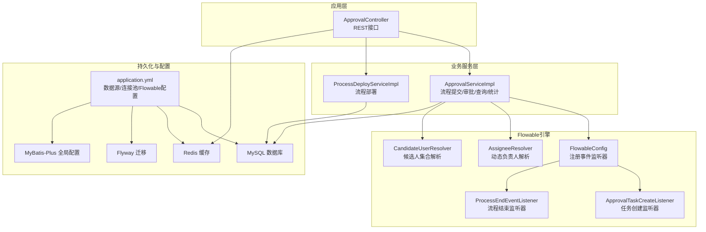
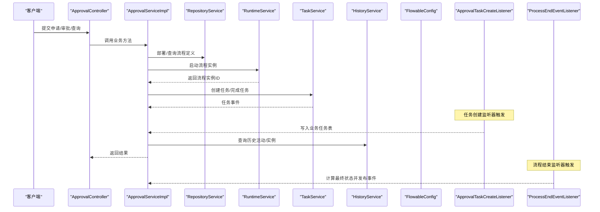
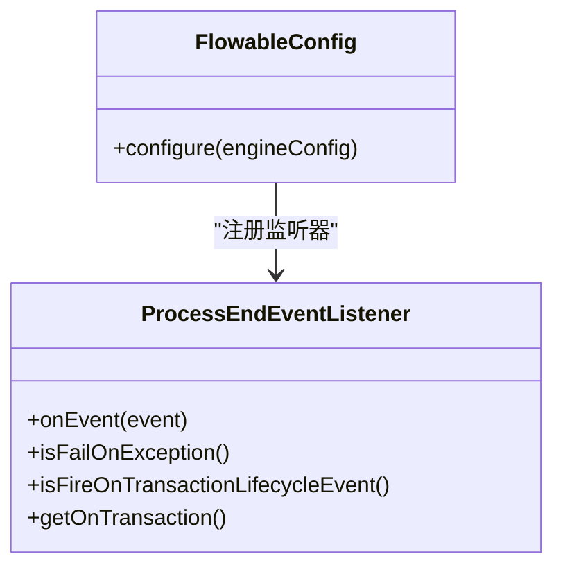
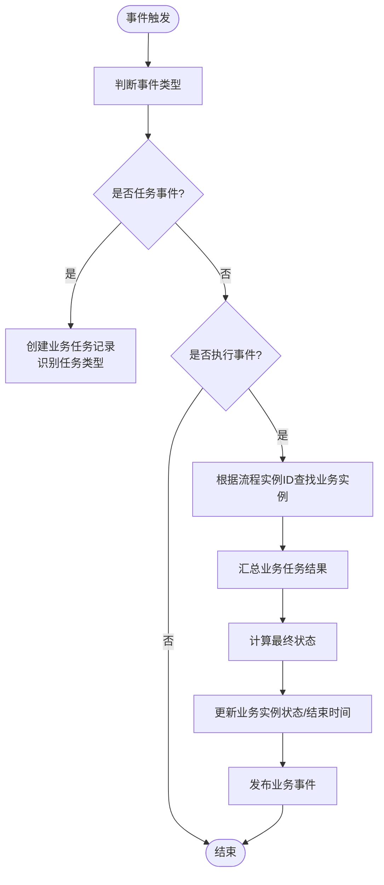
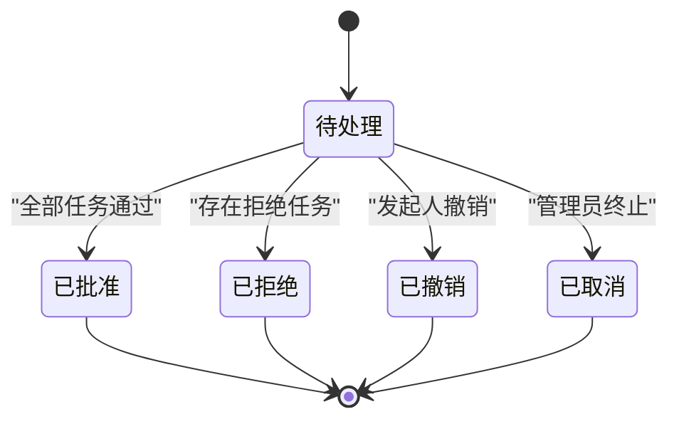
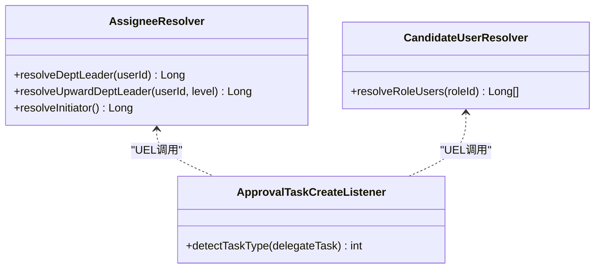
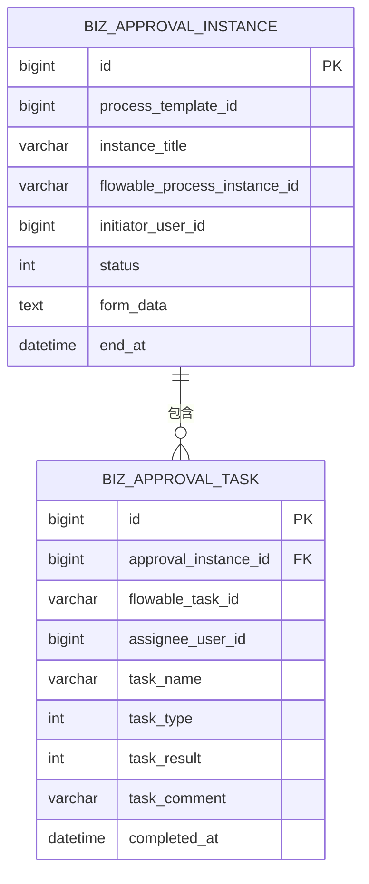
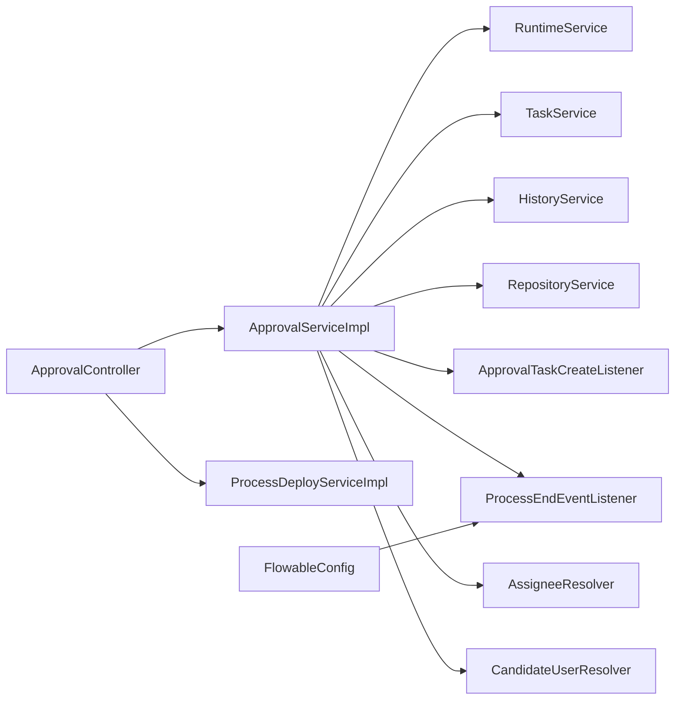

# Flowable引擎集成

<cite>
**本文引用的文件**
- [FlowableConfig.java](file://oa-approval/src/main/java/com/oa/admin/approval/config/FlowableConfig.java)
- [ApprovalTaskCreateListener.java](file://oa-approval/src/main/java/com/oa/admin/approval/listener/ApprovalTaskCreateListener.java)
- [ProcessEndEventListener.java](file://oa-approval/src/main/java/com/oa/admin/approval/listener/ProcessEndEventListener.java)
- [AssigneeResolver.java](file://oa-approval/src/main/java/com/oa/admin/approval/resolver/AssigneeResolver.java)
- [CandidateUserResolver.java](file://oa-approval/src/main/java/com/oa/admin/approval/resolver/CandidateUserResolver.java)
- [ApprovalServiceImpl.java](file://oa-approval/src/main/java/com/oa/admin/approval/service/impl/ApprovalServiceImpl.java)
- [ProcessDeployServiceImpl.java](file://oa-approval/src/main/java/com/oa/admin/approval/service/impl/ProcessDeployServiceImpl.java)
- [application.yml](file://oa-app/src/main/resources/application.yml)
- [BizApprovalInstance.java](file://oa-approval/src/main/java/com/oa/admin/approval/entity/BizApprovalInstance.java)
- [BizApprovalTask.java](file://oa-approval/src/main/java/com/oa/admin/approval/entity/BizApprovalTask.java)
- [FlowableConstants.java](file://oa-approval/src/main/java/com/oa/admin/approval/constant/FlowableConstants.java)
- [ApprovalController.java](file://oa-approval/src/main/java/com/oa/admin/approval/controller/ApprovalController.java)
- [ApprovalInstanceStatus.java](file://oa-approval/src/main/java/com/oa/admin/approval/enums/ApprovalInstanceStatus.java)
- [ApprovalTaskType.java](file://oa-approval/src/main/java/com/oa/admin/approval/enums/ApprovalTaskType.java)
</cite>

## 目录
1. [简介](#简介)
2. [项目结构](#项目结构)
3. [核心组件](#核心组件)
4. [架构总览](#架构总览)
5. [详细组件分析](#详细组件分析)
6. [依赖分析](#依赖分析)
7. [性能考虑](#性能考虑)
8. [故障排查指南](#故障排查指南)
9. [结论](#结论)
10. [附录](#附录)

## 简介
本技术文档面向在Spring Boot应用中集成Flowable工作流引擎的开发者，系统性阐述从引擎配置与初始化、数据源与事务管理、历史级别设置，到引擎监听器（任务创建监听器、流程结束监听器）的实现机制；进一步说明流程实例生命周期管理（启动、执行、暂停、恢复、终止、撤销）、任务分配策略与候选人解析机制；最后提供性能优化建议与常见问题排查方案，帮助读者快速、稳定地完成Flowable集成。

## 项目结构
本项目采用多模块结构，其中与Flowable集成直接相关的核心模块为oa-approval，包含配置、监听器、解析器、服务实现、实体与常量等。Flowable运行时所需的基础环境由顶层配置文件提供，如数据源、连接池、Flyway迁移、Redis缓存、MyBatis-Plus全局配置以及Flowable数据库初始化策略等。

图表来源
- [ApprovalController.java:1-252](file://oa-approval/src/main/java/com/oa/admin/approval/controller/ApprovalController.java#L1-L252)
- [ApprovalServiceImpl.java:1-792](file://oa-approval/src/main/java/com/oa/admin/approval/service/impl/ApprovalServiceImpl.java#L1-L792)
- [ProcessDeployServiceImpl.java:1-82](file://oa-approval/src/main/java/com/oa/admin/approval/service/impl/ProcessDeployServiceImpl.java#L1-L82)
- [FlowableConfig.java:1-31](file://oa-approval/src/main/java/com/oa/admin/approval/config/FlowableConfig.java#L1-L31)
- [ApprovalTaskCreateListener.java:1-89](file://oa-approval/src/main/java/com/oa/admin/approval/listener/ApprovalTaskCreateListener.java#L1-L89)
- [ProcessEndEventListener.java:1-80](file://oa-approval/src/main/java/com/oa/admin/approval/listener/ProcessEndEventListener.java#L1-L80)
- [AssigneeResolver.java:1-62](file://oa-approval/src/main/java/com/oa/admin/approval/resolver/AssigneeResolver.java#L1-L62)
- [CandidateUserResolver.java:1-31](file://oa-approval/src/main/java/com/oa/admin/approval/resolver/CandidateUserResolver.java#L1-L31)
- [application.yml:1-59](file://oa-app/src/main/resources/application.yml#L1-L59)

章节来源
- [application.yml:1-59](file://oa-app/src/main/resources/application.yml#L1-L59)
- [ApprovalController.java:1-252](file://oa-approval/src/main/java/com/oa/admin/approval/controller/ApprovalController.java#L1-L252)

## 核心组件
- 引擎配置与初始化：通过实现EngineConfigurationConfigurer接口，在Spring启动阶段向SpringProcessEngineConfiguration注入自定义事件监听器，确保流程事件能被统一处理。
- 事件监听器体系：
  - 任务创建监听器：在任务创建时，将Flowable任务映射为业务审批任务，记录任务类型（普通/会签/或签），并写入业务表。
  - 流程结束监听器：在流程结束事件中，汇总所有业务任务结果，计算最终状态并发布业务事件。
- 动态解析器：
  - 负责人解析器：支持按用户所在部门向上级逐级查找领导、或直接获取发起人等Uel表达式调用。
  - 候选人解析器：根据角色ID解析出候选用户列表，用于多实例（会签/或签）场景。
- 服务实现：
  - 审批服务：封装流程提交、审批、转办、撤销、终止、查询、统计等完整业务流程。
  - 部署服务：负责流程模板的部署与XML读取。
- 实体与常量：定义业务实例、任务实体及Flowable变量与BPMN后缀等常量。

章节来源
- [FlowableConfig.java:15-31](file://oa-approval/src/main/java/com/oa/admin/approval/config/FlowableConfig.java#L15-L31)
- [ApprovalTaskCreateListener.java:18-89](file://oa-approval/src/main/java/com/oa/admin/approval/listener/ApprovalTaskCreateListener.java#L18-L89)
- [ProcessEndEventListener.java:26-80](file://oa-approval/src/main/java/com/oa/admin/approval/listener/ProcessEndEventListener.java#L26-L80)
- [AssigneeResolver.java:19-62](file://oa-approval/src/main/java/com/oa/admin/approval/resolver/AssigneeResolver.java#L19-L62)
- [CandidateUserResolver.java:17-31](file://oa-approval/src/main/java/com/oa/admin/approval/resolver/CandidateUserResolver.java#L17-L31)
- [ApprovalServiceImpl.java:57-792](file://oa-approval/src/main/java/com/oa/admin/approval/service/impl/ApprovalServiceImpl.java#L57-L792)
- [ProcessDeployServiceImpl.java:21-82](file://oa-approval/src/main/java/com/oa/admin/approval/service/impl/ProcessDeployServiceImpl.java#L21-L82)
- [BizApprovalInstance.java:16-33](file://oa-approval/src/main/java/com/oa/admin/approval/entity/BizApprovalInstance.java#L16-L33)
- [BizApprovalTask.java:16-35](file://oa-approval/src/main/java/com/oa/admin/approval/entity/BizApprovalTask.java#L16-L35)
- [FlowableConstants.java:6-16](file://oa-approval/src/main/java/com/oa/admin/approval/constant/FlowableConstants.java#L6-L16)

## 架构总览
下图展示Flowable引擎在本项目中的集成位置与交互关系：控制器接收请求，调用业务服务；业务服务通过Flowable的RuntimeService、TaskService、HistoryService、RepositoryService进行流程操作；事件监听器在引擎内部事件发生时触发，完成业务数据同步与状态计算；动态解析器在BPMN中以UEL表达式方式参与任务分配与候选人解析。

图表来源
- [ApprovalController.java:37-133](file://oa-approval/src/main/java/com/oa/admin/approval/controller/ApprovalController.java#L37-L133)
- [ApprovalServiceImpl.java:122-240](file://oa-approval/src/main/java/com/oa/admin/approval/service/impl/ApprovalServiceImpl.java#L122-L240)
- [FlowableConfig.java:20-29](file://oa-approval/src/main/java/com/oa/admin/approval/config/FlowableConfig.java#L20-L29)
- [ApprovalTaskCreateListener.java:25-64](file://oa-approval/src/main/java/com/oa/admin/approval/listener/ApprovalTaskCreateListener.java#L25-L64)
- [ProcessEndEventListener.java:34-63](file://oa-approval/src/main/java/com/oa/admin/approval/listener/ProcessEndEventListener.java#L34-L63)

## 详细组件分析

### 引擎配置与初始化
- 通过实现EngineConfigurationConfigurer接口，将自定义FlowableEventListener注入到SpringProcessEngineConfiguration中，确保监听器在引擎启动时生效。
- 在配置类中注入ProcessEndEventListener，避免在多个地方重复注册，保证集中管理与可测试性。

图表来源
- [FlowableConfig.java:17-29](file://oa-approval/src/main/java/com/oa/admin/approval/config/FlowableConfig.java#L17-L29)
- [ProcessEndEventListener.java:29-79](file://oa-approval/src/main/java/com/oa/admin/approval/listener/ProcessEndEventListener.java#L29-L79)

章节来源
- [FlowableConfig.java:17-29](file://oa-approval/src/main/java/com/oa/admin/approval/config/FlowableConfig.java#L17-L29)

### 事件监听器机制
- 任务创建监听器：在任务创建事件中，读取流程实例ID、任务名称与分配人，结合业务上下文创建业务任务记录，并识别任务类型（普通/会签/或签）。
- 流程结束监听器：在ExecutionEntity事件中，定位业务实例，汇总所有业务任务结果，计算最终状态（批准/拒绝），更新业务实例并发布业务事件供其他模块消费。

图表来源
- [ApprovalTaskCreateListener.java:25-87](file://oa-approval/src/main/java/com/oa/admin/approval/listener/ApprovalTaskCreateListener.java#L25-L87)
- [ProcessEndEventListener.java:34-63](file://oa-approval/src/main/java/com/oa/admin/approval/listener/ProcessEndEventListener.java#L34-L63)

章节来源
- [ApprovalTaskCreateListener.java:25-87](file://oa-approval/src/main/java/com/oa/admin/approval/listener/ApprovalTaskCreateListener.java#L25-L87)
- [ProcessEndEventListener.java:34-63](file://oa-approval/src/main/java/com/oa/admin/approval/listener/ProcessEndEventListener.java#L34-L63)

### 流程实例生命周期管理
- 启动：服务层根据模板键启动流程实例，写入业务实例记录，记录发起人与表单数据。
- 执行：审批服务完成任务时，写入任务结果、评论与完成时间，并通知发起人。
- 撤销：仅允许未有任务处理的“待处理”实例撤销，撤销后删除流程实例并清理未处理任务。
- 终止：管理员可终止“待处理”实例，标记业务实例为取消并清理未处理任务。
- 查询与统计：提供分页查询、仪表盘统计、流程图渲染等能力。

图表来源
- [ApprovalServiceImpl.java:122-168](file://oa-approval/src/main/java/com/oa/admin/approval/service/impl/ApprovalServiceImpl.java#L122-L168)
- [ApprovalServiceImpl.java:266-307](file://oa-approval/src/main/java/com/oa/admin/approval/service/impl/ApprovalServiceImpl.java#L266-L307)
- [ApprovalServiceImpl.java:664-705](file://oa-approval/src/main/java/com/oa/admin/approval/service/impl/ApprovalServiceImpl.java#L664-L705)
- [ApprovalInstanceStatus.java:11-16](file://oa-approval/src/main/java/com/oa/admin/approval/enums/ApprovalInstanceStatus.java#L11-L16)

章节来源
- [ApprovalServiceImpl.java:122-307](file://oa-approval/src/main/java/com/oa/admin/approval/service/impl/ApprovalServiceImpl.java#L122-L307)
- [ApprovalServiceImpl.java:664-705](file://oa-approval/src/main/java/com/oa/admin/approval/service/impl/ApprovalServiceImpl.java#L664-L705)
- [ApprovalInstanceStatus.java:11-16](file://oa-approval/src/main/java/com/oa/admin/approval/enums/ApprovalInstanceStatus.java#L11-L16)

### 任务分配策略与候选人解析机制
- 动态负责人解析：通过UEL表达式调用AssigneeResolver，支持按用户所在部门向上级逐级查找领导、或直接获取当前登录用户作为负责人。
- 候选人集合解析：通过UEL表达式调用CandidateUserResolver，基于角色ID解析候选用户列表，用于多实例（会签/或签）场景。
- 任务类型识别：监听器通过读取任务变量（如nrOfInstances、completionCondition）区分普通、会签与或签任务类型。

图表来源
- [AssigneeResolver.java:21-60](file://oa-approval/src/main/java/com/oa/admin/approval/resolver/AssigneeResolver.java#L21-L60)
- [CandidateUserResolver.java:21-29](file://oa-approval/src/main/java/com/oa/admin/approval/resolver/CandidateUserResolver.java#L21-L29)
- [ApprovalTaskCreateListener.java:71-87](file://oa-approval/src/main/java/com/oa/admin/approval/listener/ApprovalTaskCreateListener.java#L71-L87)

章节来源
- [AssigneeResolver.java:21-60](file://oa-approval/src/main/java/com/oa/admin/approval/resolver/AssigneeResolver.java#L21-L60)
- [CandidateUserResolver.java:21-29](file://oa-approval/src/main/java/com/oa/admin/approval/resolver/CandidateUserResolver.java#L21-L29)
- [ApprovalTaskCreateListener.java:71-87](file://oa-approval/src/main/java/com/oa/admin/approval/listener/ApprovalTaskCreateListener.java#L71-L87)

### 数据模型
业务实例与任务的数据模型清晰映射Flowable的流程实例与任务，便于在业务层进行查询、统计与展示。

图表来源
- [BizApprovalInstance.java:19-31](file://oa-approval/src/main/java/com/oa/admin/approval/entity/BizApprovalInstance.java#L19-L31)
- [BizApprovalTask.java:18-33](file://oa-approval/src/main/java/com/oa/admin/approval/entity/BizApprovalTask.java#L18-L33)

章节来源
- [BizApprovalInstance.java:19-31](file://oa-approval/src/main/java/com/oa/admin/approval/entity/BizApprovalInstance.java#L19-L31)
- [BizApprovalTask.java:18-33](file://oa-approval/src/main/java/com/oa/admin/approval/entity/BizApprovalTask.java#L18-L33)

## 依赖分析
- 控制器依赖业务服务；业务服务依赖Flowable的RepositoryService、RuntimeService、TaskService、HistoryService以及自定义解析器与监听器。
- 配置层依赖监听器组件，确保监听器在引擎初始化时被正确注册。
- 实体与枚举为业务状态与任务类型的强类型约束，降低业务逻辑错误风险。

图表来源
- [ApprovalController.java:33-35](file://oa-approval/src/main/java/com/oa/admin/approval/controller/ApprovalController.java#L33-L35)
- [ApprovalServiceImpl.java:114-120](file://oa-approval/src/main/java/com/oa/admin/approval/service/impl/ApprovalServiceImpl.java#L114-L120)
- [FlowableConfig.java:18-28](file://oa-approval/src/main/java/com/oa/admin/approval/config/FlowableConfig.java#L18-L28)

章节来源
- [ApprovalController.java:33-35](file://oa-approval/src/main/java/com/oa/admin/approval/controller/ApprovalController.java#L33-L35)
- [ApprovalServiceImpl.java:114-120](file://oa-approval/src/main/java/com/oa/admin/approval/service/impl/ApprovalServiceImpl.java#L114-L120)
- [FlowableConfig.java:18-28](file://oa-approval/src/main/java/com/oa/admin/approval/config/FlowableConfig.java#L18-L28)

## 性能考虑
- 连接池与数据库优化：通过application.yml配置HikariCP连接池参数（最大池大小、最小空闲、连接超时、空闲超时、最大生存时间、泄漏检测阈值等），并启用预编译语句缓存，减少数据库开销。
- 异步执行器：当前配置中异步执行器处于关闭状态，适合中小规模并发；若业务需要高并发流程执行，可评估开启异步执行器并配合线程池与队列容量调优。
- 事务边界：业务服务方法标注@Transactional，确保流程操作与业务数据一致性；注意避免长事务持有锁导致阻塞。
- 查询优化：分页查询与条件过滤结合，尽量使用索引字段（如发起人ID、实例ID、任务分配人等）；批量查询时避免N+1问题。
- 缓存与日志：合理使用Redis缓存热点数据；生产环境控制日志级别，避免过多INFO/WARN输出影响性能。

章节来源
- [application.yml:10-24](file://oa-app/src/main/resources/application.yml#L10-L24)
- [application.yml:56-59](file://oa-app/src/main/resources/application.yml#L56-L59)
- [ApprovalServiceImpl.java:122-168](file://oa-approval/src/main/java/com/oa/admin/approval/service/impl/ApprovalServiceImpl.java#L122-L168)

## 故障排查指南
- 无法启动流程实例
  - 检查模板状态是否为已发布；确认模板键与流程定义一致。
  - 查看流程变量（发起人、表单数据）是否正确传入。
- 任务未创建或创建异常
  - 确认任务创建监听器已注册；检查任务分配人是否为空或格式不正确。
  - 关注监听器日志，定位业务实例关联失败或用户ID解析异常。
- 审批结果未生效
  - 确认任务完成时写入了任务结果与评论；检查流程变量（approved）是否正确传递。
  - 核对流程结束监听器是否触发，业务实例状态是否更新。
- 撤销/终止失败
  - 撤销仅适用于“待处理”且未有任何任务处理的实例；终止仅适用于“待处理”实例。
- 候选人解析失败
  - 确认UEL表达式调用的解析器Bean名称与实际一致；检查角色用户映射是否存在。
- 数据库连接问题
  - 检查application.yml中的数据源URL、用户名、密码与连接池参数；关注连接泄漏与超时告警。

章节来源
- [ProcessDeployServiceImpl.java:30-58](file://oa-approval/src/main/java/com/oa/admin/approval/service/impl/ProcessDeployServiceImpl.java#L30-L58)
- [ApprovalServiceImpl.java:122-168](file://oa-approval/src/main/java/com/oa/admin/approval/service/impl/ApprovalServiceImpl.java#L122-L168)
- [ApprovalServiceImpl.java:266-307](file://oa-approval/src/main/java/com/oa/admin/approval/service/impl/ApprovalServiceImpl.java#L266-L307)
- [ApprovalServiceImpl.java:664-705](file://oa-approval/src/main/java/com/oa/admin/approval/service/impl/ApprovalServiceImpl.java#L664-L705)
- [application.yml:5-18](file://oa-app/src/main/resources/application.yml#L5-L18)

## 结论
本项目通过集中化的引擎配置、完善的事件监听器机制、灵活的动态解析器与严谨的业务服务封装，实现了从流程部署、实例启动、任务处理到生命周期管理的全链路集成。配合合理的数据库连接池与事务管理策略，可在保证稳定性的同时满足日常审批业务的性能需求。建议在高并发场景下进一步评估异步执行器与缓存策略，并持续完善监控与日志体系以提升可观测性。

## 附录
- 关键常量与枚举
  - Flowable变量名与BPMN文件后缀：见常量类定义。
  - 业务状态与任务类型：见枚举类定义，用于强类型约束与业务逻辑分支。

章节来源
- [FlowableConstants.java:6-16](file://oa-approval/src/main/java/com/oa/admin/approval/constant/FlowableConstants.java#L6-L16)
- [ApprovalInstanceStatus.java:11-28](file://oa-approval/src/main/java/com/oa/admin/approval/enums/ApprovalInstanceStatus.java#L11-L28)
- [ApprovalTaskType.java:11-26](file://oa-approval/src/main/java/com/oa/admin/approval/enums/ApprovalTaskType.java#L11-L26)