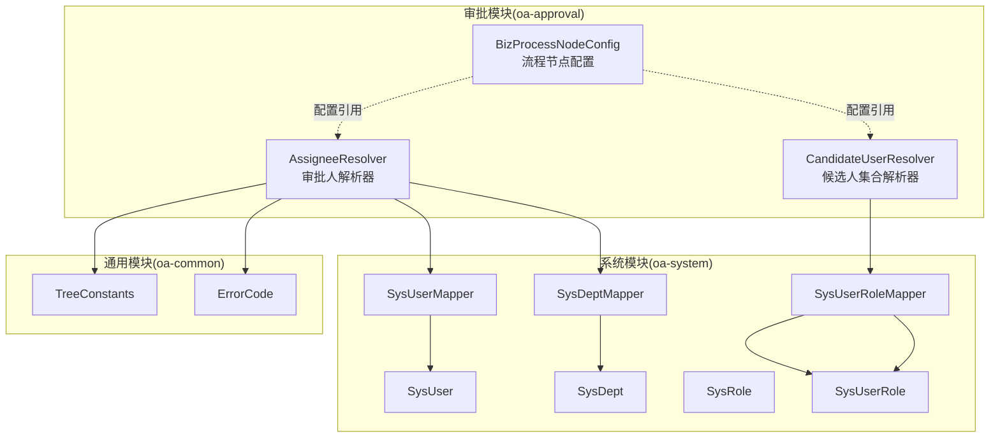
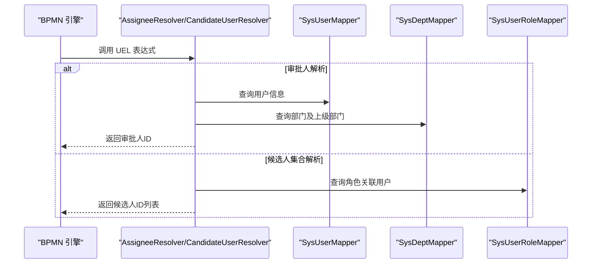
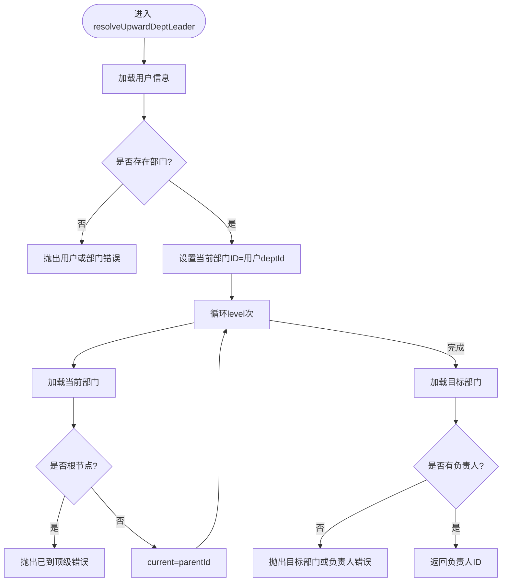
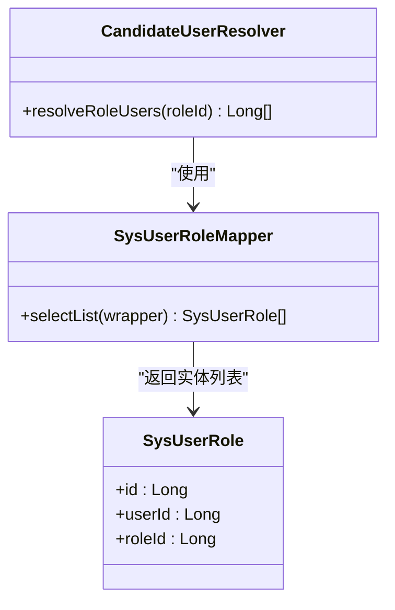
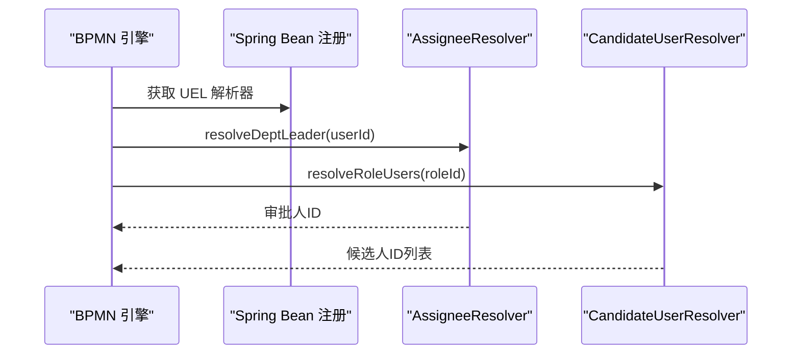
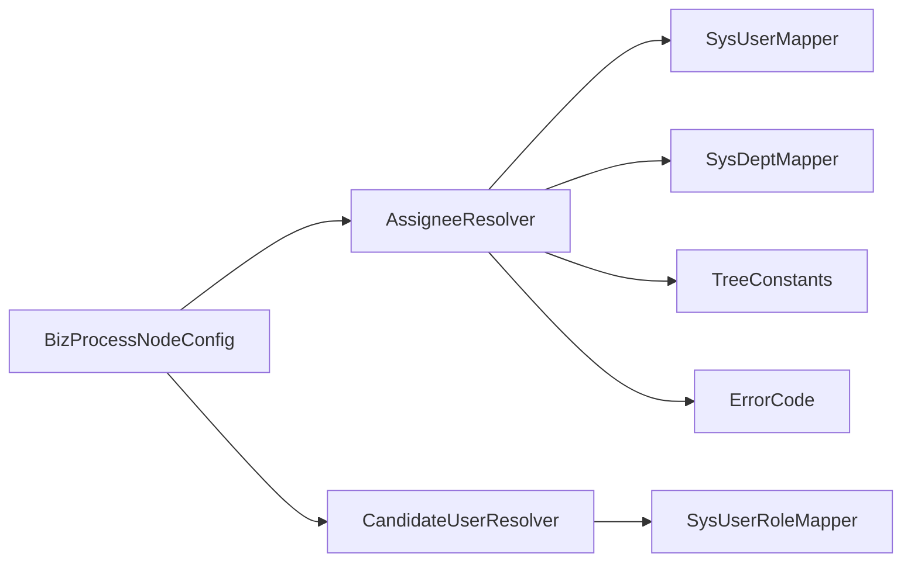

# 动态候选人解析

<cite>
**本文引用的文件**
- [AssigneeResolver.java](file://oa-approval/src/main/java/com/oa/admin/approval/resolver/AssigneeResolver.java)
- [CandidateUserResolver.java](file://oa-approval/src/main/java/com/oa/admin/approval/resolver/CandidateUserResolver.java)
- [AssigneeResolverTest.java](file://oa-approval/src/test/java/com/oa/admin/approval/resolver/AssigneeResolverTest.java)
- [CandidateUserResolverTest.java](file://oa-approval/src/test/java/com/oa/admin/approval/resolver/CandidateUserResolverTest.java)
- [SysUser.java](file://oa-system/src/main/java/com/oa/admin/system/entity/SysUser.java)
- [SysDept.java](file://oa-system/src/main/java/com/oa/admin/system/entity/SysDept.java)
- [SysRole.java](file://oa-system/src/main/java/com/oa/admin/system/entity/SysRole.java)
- [SysUserRole.java](file://oa-system/src/main/java/com/oa/admin/system/entity/SysUserRole.java)
- [SysUserMapper.java](file://oa-system/src/main/java/com/oa/admin/system/mapper/SysUserMapper.java)
- [SysDeptMapper.java](file://oa-system/src/main/java/com/oa/admin/system/mapper/SysDeptMapper.java)
- [SysUserRoleMapper.java](file://oa-system/src/main/java/com/oa/admin/system/mapper/SysUserRoleMapper.java)
- [TreeConstants.java](file://oa-common/src/main/java/com/oa/admin/common/constant/TreeConstants.java)
- [ErrorCode.java](file://oa-common/src/main/java/com/oa/admin/common/result/ErrorCode.java)
- [BizProcessNodeConfig.java](file://oa-approval/src/main/java/com/oa/admin/approval/entity/BizProcessNodeConfig.java)
- [FlowableGatewayIntegrationTest.java](file://oa-approval/src/test/java/com/oa/admin/approval/integration/FlowableGatewayIntegrationTest.java)
</cite>

## 目录
1. [简介](#简介)
2. [项目结构](#项目结构)
3. [核心组件](#核心组件)
4. [架构总览](#架构总览)
5. [详细组件分析](#详细组件分析)
6. [依赖关系分析](#依赖关系分析)
7. [性能与缓存策略](#性能与缓存策略)
8. [故障排查指南](#故障排查指南)
9. [结论](#结论)
10. [附录：自定义与扩展指南](#附录自定义与扩展指南)

## 简介
本文件面向“动态候选人解析器”的设计与实现，聚焦于审批人自动分配算法与组织架构集成。文档围绕两个核心解析器展开：AssigneeResolver（审批人解析器）与CandidateUserResolver（候选人集合解析器），解释其在 BPMN UEL 表达式中的调用方式、上下文数据来源（用户、部门、角色）、错误处理与边界条件，并提供复杂场景（多级审批、交叉验证、替代审批人）的策略建议与扩展指南。

## 项目结构
候选解析能力位于审批模块中，通过 Spring 组件暴露给 BPMN 引擎（Flowable）。系统通过 MyBatis-Plus 访问系统模块中的用户、部门、角色与映射表，结合通用常量与错误码进行统一处理。

图表来源
- [AssigneeResolver.java:1-62](file://oa-approval/src/main/java/com/oa/admin/approval/resolver/AssigneeResolver.java#L1-L62)
- [CandidateUserResolver.java:1-31](file://oa-approval/src/main/java/com/oa/admin/approval/resolver/CandidateUserResolver.java#L1-L31)
- [BizProcessNodeConfig.java:1-36](file://oa-approval/src/main/java/com/oa/admin/approval/entity/BizProcessNodeConfig.java#L1-L36)
- [SysUserMapper.java:1-13](file://oa-system/src/main/java/com/oa/admin/system/mapper/SysUserMapper.java#L1-L13)
- [SysDeptMapper.java:1-13](file://oa-system/src/main/java/com/oa/admin/system/mapper/SysDeptMapper.java#L1-L13)
- [SysUserRoleMapper.java:1-13](file://oa-system/src/main/java/com/oa/admin/system/mapper/SysUserRoleMapper.java#L1-L13)
- [SysUser.java:1-27](file://oa-system/src/main/java/com/oa/admin/system/entity/SysUser.java#L1-L27)
- [SysDept.java:1-31](file://oa-system/src/main/java/com/oa/admin/system/entity/SysDept.java#L1-L31)
- [SysUserRole.java:1-19](file://oa-system/src/main/java/com/oa/admin/system/entity/SysUserRole.java#L1-L19)
- [TreeConstants.java:1-12](file://oa-common/src/main/java/com/oa/admin/common/constant/TreeConstants.java#L1-L12)
- [ErrorCode.java:1-45](file://oa-common/src/main/java/com/oa/admin/common/result/ErrorCode.java#L1-L45)

章节来源
- [AssigneeResolver.java:1-62](file://oa-approval/src/main/java/com/oa/admin/approval/resolver/AssigneeResolver.java#L1-L62)
- [CandidateUserResolver.java:1-31](file://oa-approval/src/main/java/com/oa/admin/approval/resolver/CandidateUserResolver.java#L1-L31)
- [BizProcessNodeConfig.java:1-36](file://oa-approval/src/main/java/com/oa/admin/approval/entity/BizProcessNodeConfig.java#L1-L36)

## 核心组件
- AssigneeResolver：负责从 BPMN UEL 表达式中动态解析审批人，支持“部门负责人”和“逐级向上查找部门负责人”，并提供“发起人”解析。
- CandidateUserResolver：负责解析多实例（会签/或签）场景下的候选人集合，基于角色ID返回关联用户ID列表。

章节来源
- [AssigneeResolver.java:14-61](file://oa-approval/src/main/java/com/oa/admin/approval/resolver/AssigneeResolver.java#L14-L61)
- [CandidateUserResolver.java:12-30](file://oa-approval/src/main/java/com/oa/admin/approval/resolver/CandidateUserResolver.java#L12-L30)

## 架构总览
候选解析器通过 BPMN UEL 表达式被流程引擎调用，解析器内部依赖系统模块的数据模型与 Mapper 接口，最终返回审批人或候选人集合。流程节点配置中包含“审批人类型/配置”和“多实例类型/完成比例”等字段，用于控制解析行为。

图表来源
- [AssigneeResolver.java:26-56](file://oa-approval/src/main/java/com/oa/admin/approval/resolver/AssigneeResolver.java#L26-L56)
- [CandidateUserResolver.java:23-29](file://oa-approval/src/main/java/com/oa/admin/approval/resolver/CandidateUserResolver.java#L23-L29)
- [SysUserMapper.java:10-12](file://oa-system/src/main/java/com/oa/admin/system/mapper/SysUserMapper.java#L10-L12)
- [SysDeptMapper.java:10-12](file://oa-system/src/main/java/com/oa/admin/system/mapper/SysDeptMapper.java#L10-L12)
- [SysUserRoleMapper.java:10-12](file://oa-system/src/main/java/com/oa/admin/system/mapper/SysUserRoleMapper.java#L10-L12)

## 详细组件分析

### AssigneeResolver（审批人解析器）
- 职责
  - 解析“部门负责人”作为审批人
  - 支持“逐级向上查找 N 级部门负责人”
  - 提供“流程发起人”作为审批人
- 关键方法
  - resolveDeptLeader(userId)：根据用户所在部门查询部门负责人
  - resolveUpwardDeptLeader(userId, level)：按层级逐级向上查找目标部门负责人
  - resolveInitiator()：返回当前登录用户ID
- 数据来源
  - 用户：SysUser（含 deptId）
  - 部门：SysDept（含 parentId、leaderUserId）
  - 根节点常量：TreeConstants.ROOT_PARENT_ID
- 错误处理
  - 用户不存在或未分配部门
  - 部门不存在或未设置负责人
  - 已到达顶级部门仍继续向上
  - 目标部门不存在或未设置负责人
- 复杂度
  - 单次解析为 O(1) 查询；逐级向上解析最多为 O(level)

图表来源
- [AssigneeResolver.java:38-56](file://oa-approval/src/main/java/com/oa/admin/approval/resolver/AssigneeResolver.java#L38-L56)
- [TreeConstants.java:6-11](file://oa-common/src/main/java/com/oa/admin/common/constant/TreeConstants.java#L6-L11)
- [ErrorCode.java:33-40](file://oa-common/src/main/java/com/oa/admin/common/result/ErrorCode.java#L33-L40)

章节来源
- [AssigneeResolver.java:26-60](file://oa-approval/src/main/java/com/oa/admin/approval/resolver/AssigneeResolver.java#L26-L60)
- [AssigneeResolverTest.java:46-98](file://oa-approval/src/test/java/com/oa/admin/approval/resolver/AssigneeResolverTest.java#L46-L98)
- [SysUser.java:16-26](file://oa-system/src/main/java/com/oa/admin/system/entity/SysUser.java#L16-L26)
- [SysDept.java:18-30](file://oa-system/src/main/java/com/oa/admin/system/entity/SysDept.java#L18-L30)
- [TreeConstants.java:6-11](file://oa-common/src/main/java/com/oa/admin/common/constant/TreeConstants.java#L6-L11)
- [ErrorCode.java:33-40](file://oa-common/src/main/java/com/oa/admin/common/result/ErrorCode.java#L33-L40)

### CandidateUserResolver（候选人集合解析器）
- 职责
  - 在多实例（会签/或签）场景下，根据角色ID返回所有关联用户的ID列表
- 关键方法
  - resolveRoleUsers(roleId)：查询 sys_user_role 中指定角色的所有用户ID
- 数据来源
  - 角色-用户映射：SysUserRole
- 复杂度
  - O(k)，k 为角色绑定的用户数量

图表来源
- [CandidateUserResolver.java:17-30](file://oa-approval/src/main/java/com/oa/admin/approval/resolver/CandidateUserResolver.java#L17-L30)
- [SysUserRoleMapper.java:10-12](file://oa-system/src/main/java/com/oa/admin/system/mapper/SysUserRoleMapper.java#L10-L12)
- [SysUserRole.java:12-18](file://oa-system/src/main/java/com/oa/admin/system/entity/SysUserRole.java#L12-L18)

章节来源
- [CandidateUserResolver.java:23-29](file://oa-approval/src/main/java/com/oa/admin/approval/resolver/CandidateUserResolver.java#L23-L29)
- [CandidateUserResolverTest.java:27-50](file://oa-approval/src/test/java/com/oa/admin/approval/resolver/CandidateUserResolverTest.java#L27-L50)
- [SysUserRole.java:12-18](file://oa-system/src/main/java/com/oa/admin/system/entity/SysUserRole.java#L12-L18)

### BPMN 集成与上下文
- UEL 表达式调用
  - AssigneeResolver 暴露为 bean 名称 assigneeResolver，可在 BPMN 中以 ${assigneeResolver.resolveXxx(...)} 调用
  - CandidateUserResolver 暴露为 bean 名称 candidateUserResolver，可在 BPMN 中以 ${candidateUserResolver.resolveRoleUsers(roleId)} 调用
- 流程节点配置
  - BizProcessNodeConfig 包含 assigneeType、assigneeConfig、multiInstanceType、completionRatio 等字段，用于控制审批人解析与多实例行为
- 集成测试
  - 通过注册测试桩（mock）bean，验证 BPMN 与解析器的交互

图表来源
- [FlowableGatewayIntegrationTest.java:35-69](file://oa-approval/src/test/java/com/oa/admin/approval/integration/FlowableGatewayIntegrationTest.java#L35-L69)
- [BizProcessNodeConfig.java:26-32](file://oa-approval/src/main/java/com/oa/admin/approval/entity/BizProcessNodeConfig.java#L26-L32)

章节来源
- [FlowableGatewayIntegrationTest.java:35-69](file://oa-approval/src/test/java/com/oa/admin/approval/integration/FlowableGatewayIntegrationTest.java#L35-L69)
- [BizProcessNodeConfig.java:26-32](file://oa-approval/src/main/java/com/oa/admin/approval/entity/BizProcessNodeConfig.java#L26-L32)

## 依赖关系分析
- 组件内聚与耦合
  - AssigneeResolver 依赖用户、部门 Mapper 与树常量、错误码，职责单一且内聚
  - CandidateUserResolver 仅依赖角色-用户 Mapper，内聚性高
- 外部依赖
  - Spring 组件装配（@Component、@RequiredArgsConstructor）
  - MyBatis-Plus Mapper 接口
  - Flowable BPMN 引擎（通过 UEL 表达式间接调用）

图表来源
- [AssigneeResolver.java:23-24](file://oa-approval/src/main/java/com/oa/admin/approval/resolver/AssigneeResolver.java#L23-L24)
- [CandidateUserResolver.java:21](file://oa-approval/src/main/java/com/oa/admin/approval/resolver/CandidateUserResolver.java#L21)
- [BizProcessNodeConfig.java:26-32](file://oa-approval/src/main/java/com/oa/admin/approval/entity/BizProcessNodeConfig.java#L26-L32)

章节来源
- [AssigneeResolver.java:23-24](file://oa-approval/src/main/java/com/oa/admin/approval/resolver/AssigneeResolver.java#L23-L24)
- [CandidateUserResolver.java:21](file://oa-approval/src/main/java/com/oa/admin/approval/resolver/CandidateUserResolver.java#L21)
- [BizProcessNodeConfig.java:26-32](file://oa-approval/src/main/java/com/oa/admin/approval/entity/BizProcessNodeConfig.java#L26-L32)

## 性能与缓存策略
- 查询路径
  - AssigneeResolver：单次用户查询 + 部门查询；逐级向上查询最多为 O(level)
  - CandidateUserResolver：一次角色-用户映射查询，结果集大小为 k
- 缓存建议
  - 用户-部门-负责人映射：按用户ID缓存用户与部门信息，减少重复查询
  - 部门-负责人映射：按部门ID缓存 leaderUserId，避免重复读取
  - 角色-用户映射：按 roleId 缓存用户ID列表，注意角色成员变更时失效
- 并发与一致性
  - 使用带过期时间的本地缓存或分布式缓存（如 Redis）
  - 对于高并发场景，建议在解析器层增加读写锁或使用原子更新策略
- 批量优化
  - 对同一批流程实例的多次解析，优先复用已解析结果
  - 对角色-用户映射采用批量预热策略

[本节为通用性能建议，不直接分析具体文件]

## 故障排查指南
- 常见错误与定位
  - 用户不存在或未分配部门：检查用户表与部门ID
  - 部门不存在或未设置负责人：检查部门表与负责人字段
  - 已到达顶级部门仍继续向上：检查树结构与根节点标识
  - 目标部门不存在或未设置负责人：检查逐级上查的目标部门
- 单元测试参考
  - AssigneeResolverTest：覆盖部门负责人、逐级向上、顶部越界等场景
  - CandidateUserResolverTest：覆盖角色用户列表为空与非空场景
- BPMN 集成问题
  - 确认 UEL 表达式正确拼写与 bean 名称一致
  - 确认 Spring 上下文中已注册解析器 bean

章节来源
- [AssigneeResolverTest.java:46-98](file://oa-approval/src/test/java/com/oa/admin/approval/resolver/AssigneeResolverTest.java#L46-L98)
- [CandidateUserResolverTest.java:27-50](file://oa-approval/src/test/java/com/oa/admin/approval/resolver/CandidateUserResolverTest.java#L27-L50)
- [ErrorCode.java:33-40](file://oa-common/src/main/java/com/oa/admin/common/result/ErrorCode.java#L33-L40)

## 结论
动态候选人解析器通过简洁的接口与明确的上下文，实现了与组织架构的深度集成。AssigneeResolver 提供了灵活的审批人解析能力，支持逐级向上与部门负责人两种常见模式；CandidateUserResolver 则满足多实例场景下的候选人集合需求。配合流程节点配置与 BPMN UEL 表达式，系统能够以较低耦合实现复杂的审批路由与决策。

[本节为总结性内容，不直接分析具体文件]

## 附录：自定义与扩展指南

### 自定义候选人解析器
- 新增解析器步骤
  - 创建新的解析器类，标注为 Spring 组件（如 @Component("myResolver")）
  - 在 BPMN 中通过 ${myResolver.xxx(...)} 调用
  - 在流程节点配置中，将 assigneeType 设为 expression，并在 assigneeConfig 中提供表达式字符串
- 扩展点建议
  - 支持“岗位/职级/工龄”等维度的候选人筛选
  - 支持“交叉验证”：如财务复核、合规审核等
  - 支持“替代审批人”：当负责人不可用时的备选策略

### 复杂场景策略
- 多级审批
  - 使用逐级向上解析，结合节点配置的完成比例，实现分层审批
- 交叉验证
  - 将候选集合解析为多个角色的交集或并集，再结合 BPMN 的网关进行分流/合并
- 替代审批人
  - 在解析器中引入“代理/替岗”规则，优先返回替代者，否则回退至默认规则

### 数据模型与字段说明
- 用户：SysUser（包含 deptId）
- 部门：SysDept（包含 parentId、leaderUserId）
- 角色：SysRole（包含 dataScope）
- 角色-用户映射：SysUserRole
- 流程节点配置：BizProcessNodeConfig（包含 assigneeType、assigneeConfig、multiInstanceType、completionRatio）

章节来源
- [SysUser.java:16-26](file://oa-system/src/main/java/com/oa/admin/system/entity/SysUser.java#L16-L26)
- [SysDept.java:18-30](file://oa-system/src/main/java/com/oa/admin/system/entity/SysDept.java#L18-L30)
- [SysRole.java:15-25](file://oa-system/src/main/java/com/oa/admin/system/entity/SysRole.java#L15-L25)
- [SysUserRole.java:12-18](file://oa-system/src/main/java/com/oa/admin/system/entity/SysUserRole.java#L12-L18)
- [BizProcessNodeConfig.java:26-32](file://oa-approval/src/main/java/com/oa/admin/approval/entity/BizProcessNodeConfig.java#L26-L32)