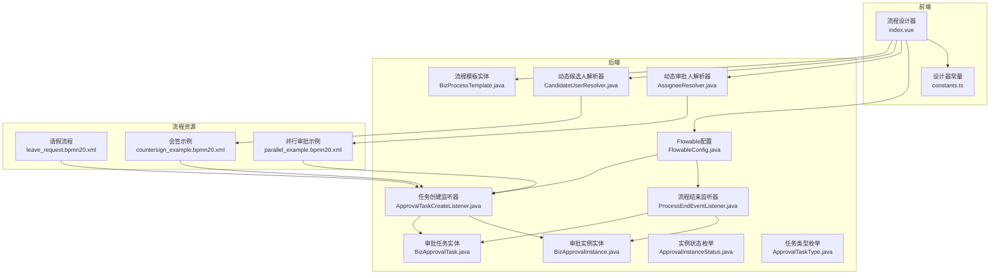
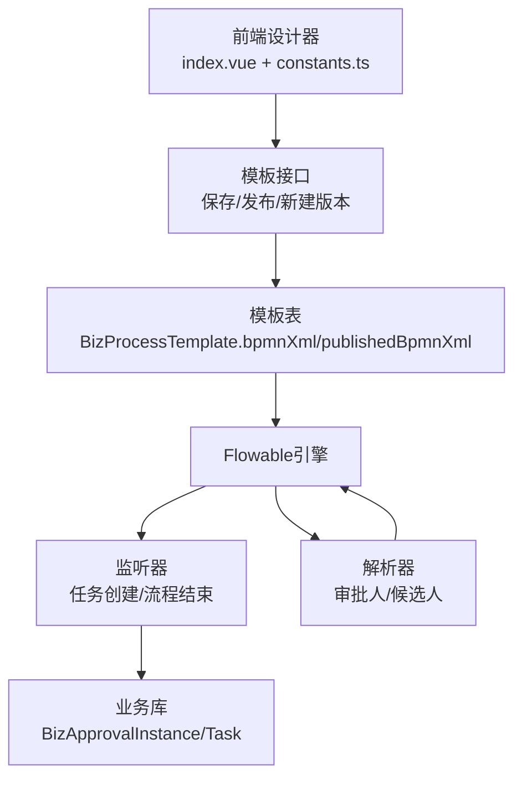
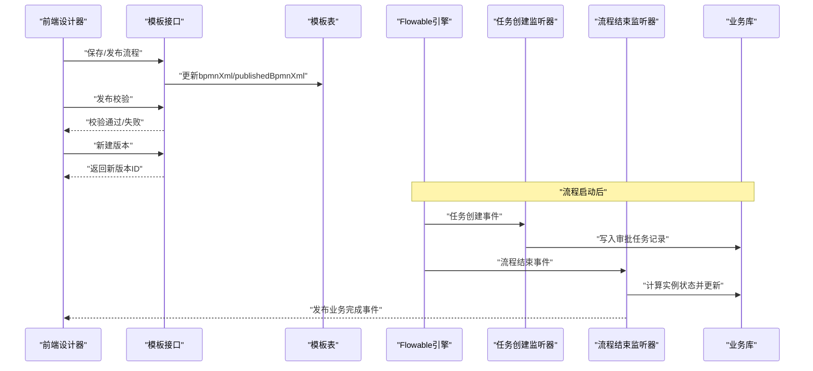
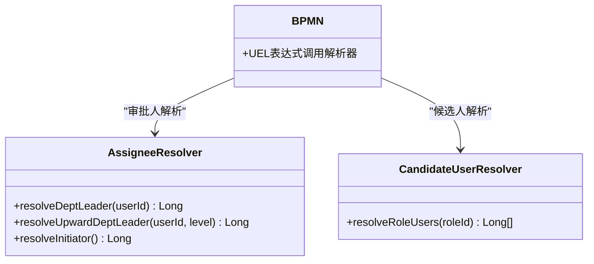
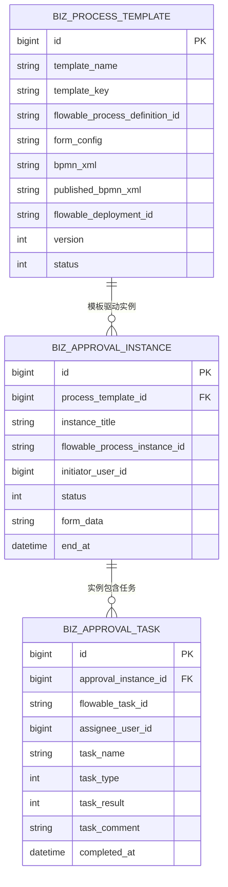
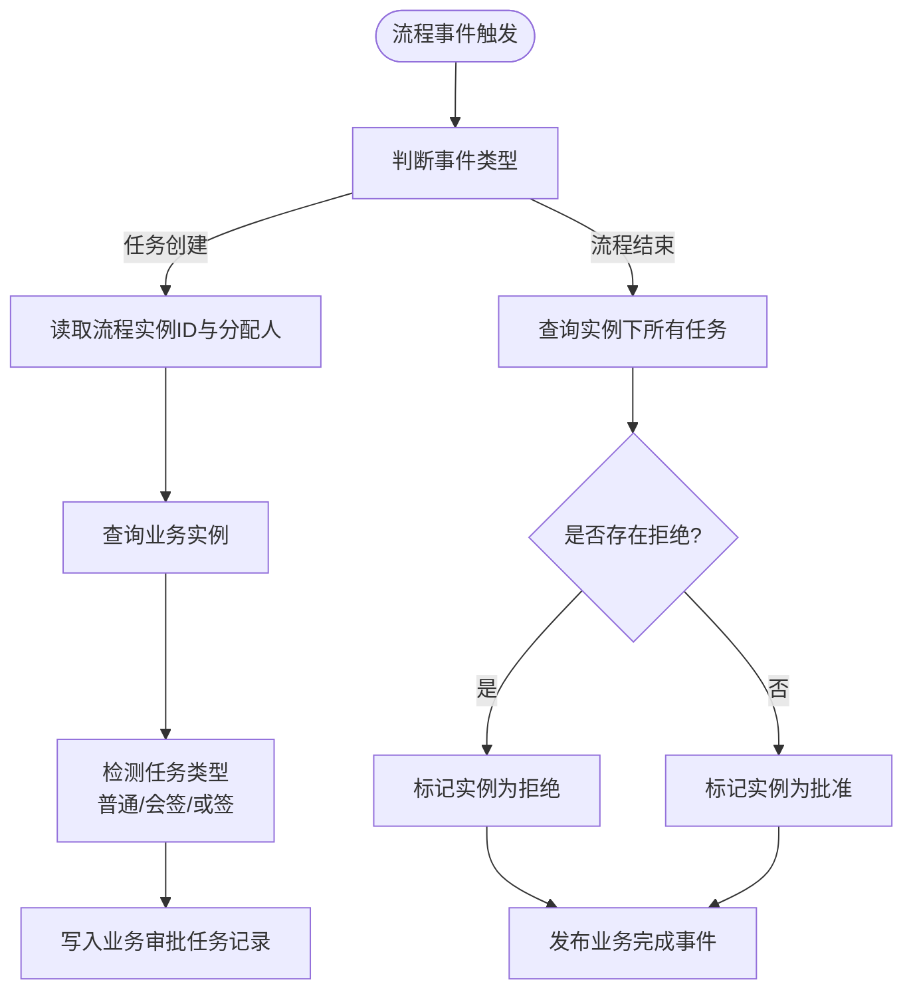
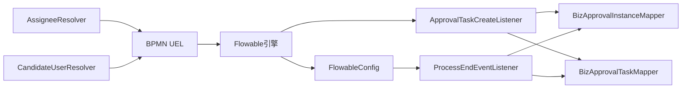

# 工作流设计

<cite>
**本文引用的文件**
- [FlowableConfig.java](file://oa-approval/src/main/java/com/oa/admin/approval/config/FlowableConfig.java)
- [ApprovalTaskCreateListener.java](file://oa-approval/src/main/java/com/oa/admin/approval/listener/ApprovalTaskCreateListener.java)
- [ProcessEndEventListener.java](file://oa-approval/src/main/java/com/oa/admin/approval/listener/ProcessEndEventListener.java)
- [AssigneeResolver.java](file://oa-approval/src/main/java/com/oa/admin/approval/resolver/AssigneeResolver.java)
- [CandidateUserResolver.java](file://oa-approval/src/main/java/com/oa/admin/approval/resolver/CandidateUserResolver.java)
- [BizProcessTemplate.java](file://oa-approval/src/main/java/com/oa/admin/approval/entity/BizProcessTemplate.java)
- [BizApprovalInstance.java](file://oa-approval/src/main/java/com/oa/admin/approval/entity/BizApprovalInstance.java)
- [BizApprovalTask.java](file://oa-approval/src/main/java/com/oa/admin/approval/entity/BizApprovalTask.java)
- [ApprovalInstanceStatus.java](file://oa-approval/src/main/java/com/oa/admin/approval/enums/ApprovalInstanceStatus.java)
- [ApprovalTaskType.java](file://oa-approval/src/main/java/com/oa/admin/approval/enums/ApprovalTaskType.java)
- [index.vue（流程设计器）](file://oa-ui/src/views/approval/template/designer/index.vue)
- [constants.ts（设计器常量）](file://oa-ui/src/bpmn/constants.ts)
- [leave_request.bpmn20.xml](file://oa-app/src/main/resources/processes/leave_request.bpmn20.xml)
- [countersign_example.bpmn20.xml](file://oa-app/src/main/resources/processes/countersign_example.bpmn20.xml)
- [parallel_example.bpmn20.xml](file://oa-app/src/main/resources/processes/parallel_example.bpmn20.xml)
</cite>

## 目录
1. [引言](#引言)
2. [项目结构](#项目结构)
3. [核心组件](#核心组件)
4. [架构总览](#架构总览)
5. [详细组件分析](#详细组件分析)
6. [依赖分析](#依赖分析)
7. [性能考虑](#性能考虑)
8. [故障排查指南](#故障排查指南)
9. [结论](#结论)
10. [附录](#附录)

## 引言
本文件面向OA审批管理系统的工作流设计与实现，围绕BPMN 2.0流程建模规范与Flowable工作流引擎的集成展开，系统性阐述审批流程设计原则（串行审批、并行审批、条件分支、会签/或签）、流程监听器与事件处理策略、动态候选人解析器与组织架构集成、流程设计器使用指南与最佳实践，并提供流程版本管理、流程监控与性能优化策略，以及从简单到复杂的流程设计案例与实现参考。

## 项目结构
系统采用前后端分离架构，后端基于Spring Boot与Flowable集成，提供流程引擎配置、监听器、动态解析器、业务实体与服务；前端提供可视化流程设计器，支持节点类型、审批人类型、多实例类型配置与流程发布校验。

图表来源
- [index.vue（流程设计器）:1-324](file://oa-ui/src/views/approval/template/designer/index.vue#L1-L324)
- [constants.ts（设计器常量）:1-95](file://oa-ui/src/bpmn/constants.ts#L1-L95)
- [FlowableConfig.java:1-31](file://oa-approval/src/main/java/com/oa/admin/approval/config/FlowableConfig.java#L1-L31)
- [ApprovalTaskCreateListener.java:1-89](file://oa-approval/src/main/java/com/oa/admin/approval/listener/ApprovalTaskCreateListener.java#L1-L89)
- [ProcessEndEventListener.java:1-80](file://oa-approval/src/main/java/com/oa/admin/approval/listener/ProcessEndEventListener.java#L1-L80)
- [AssigneeResolver.java:1-62](file://oa-approval/src/main/java/com/oa/admin/approval/resolver/AssigneeResolver.java#L1-L62)
- [CandidateUserResolver.java:1-31](file://oa-approval/src/main/java/com/oa/admin/approval/resolver/CandidateUserResolver.java#L1-L31)
- [BizProcessTemplate.java:1-29](file://oa-approval/src/main/java/com/oa/admin/approval/entity/BizProcessTemplate.java#L1-L29)
- [BizApprovalInstance.java:1-33](file://oa-approval/src/main/java/com/oa/admin/approval/entity/BizApprovalInstance.java#L1-L33)
- [BizApprovalTask.java:1-35](file://oa-approval/src/main/java/com/oa/admin/approval/entity/BizApprovalTask.java#L1-L35)
- [ApprovalInstanceStatus.java:1-29](file://oa-approval/src/main/java/com/oa/admin/approval/enums/ApprovalInstanceStatus.java#L1-L29)
- [ApprovalTaskType.java:1-27](file://oa-approval/src/main/java/com/oa/admin/approval/enums/ApprovalTaskType.java#L1-L27)
- [leave_request.bpmn20.xml:1-30](file://oa-app/src/main/resources/processes/leave_request.bpmn20.xml#L1-L30)
- [countersign_example.bpmn20.xml:1-32](file://oa-app/src/main/resources/processes/countersign_example.bpmn20.xml#L1-L32)
- [parallel_example.bpmn20.xml:1-38](file://oa-app/src/main/resources/processes/parallel_example.bpmn20.xml#L1-L38)

章节来源
- [index.vue（流程设计器）:1-324](file://oa-ui/src/views/approval/template/designer/index.vue#L1-L324)
- [constants.ts（设计器常量）:1-95](file://oa-ui/src/bpmn/constants.ts#L1-L95)

## 核心组件
- 流程引擎配置：通过实现EngineConfigurationConfigurer向Flowable注册全局事件监听器，确保流程生命周期事件可被统一处理。
- 任务创建监听器：在任务创建时写入业务审批任务记录，识别普通、会签、或签等多实例任务类型。
- 流程结束监听器：在流程执行实体事件中计算最终实例状态，发布业务完成事件。
- 动态审批人解析器：根据发起人与组织架构解析部门主管、上级部门主管、发起人本人等。
- 动态候选人解析器：按角色解析候选用户集合，用于多实例并行收集意见或会签/或签。
- 业务实体与枚举：模板、实例、任务三类核心实体及状态/类型枚举，支撑流程运行期数据持久化与状态机。

章节来源
- [FlowableConfig.java:1-31](file://oa-approval/src/main/java/com/oa/admin/approval/config/FlowableConfig.java#L1-L31)
- [ApprovalTaskCreateListener.java:1-89](file://oa-approval/src/main/java/com/oa/admin/approval/listener/ApprovalTaskCreateListener.java#L1-L89)
- [ProcessEndEventListener.java:1-80](file://oa-approval/src/main/java/com/oa/admin/approval/listener/ProcessEndEventListener.java#L1-L80)
- [AssigneeResolver.java:1-62](file://oa-approval/src/main/java/com/oa/admin/approval/resolver/AssigneeResolver.java#L1-L62)
- [CandidateUserResolver.java:1-31](file://oa-approval/src/main/java/com/oa/admin/approval/resolver/CandidateUserResolver.java#L1-L31)
- [BizProcessTemplate.java:1-29](file://oa-approval/src/main/java/com/oa/admin/approval/entity/BizProcessTemplate.java#L1-L29)
- [BizApprovalInstance.java:1-33](file://oa-approval/src/main/java/com/oa/admin/approval/entity/BizApprovalInstance.java#L1-L33)
- [BizApprovalTask.java:1-35](file://oa-approval/src/main/java/com/oa/admin/approval/entity/BizApprovalTask.java#L1-L35)
- [ApprovalInstanceStatus.java:1-29](file://oa-approval/src/main/java/com/oa/admin/approval/enums/ApprovalInstanceStatus.java#L1-L29)
- [ApprovalTaskType.java:1-27](file://oa-approval/src/main/java/com/oa/admin/approval/enums/ApprovalTaskType.java#L1-L27)

## 架构总览
系统以Flowable为核心，后端负责流程引擎配置、监听器与解析器，前端提供流程设计器与属性面板，流程资源以BPMN XML形式存储于数据库模板表中，运行时由Flowable加载执行。

图表来源
- [index.vue（流程设计器）:157-227](file://oa-ui/src/views/approval/template/designer/index.vue#L157-L227)
- [constants.ts（设计器常量）:29-66](file://oa-ui/src/bpmn/constants.ts#L29-L66)
- [BizProcessTemplate.java:1-29](file://oa-approval/src/main/java/com/oa/admin/approval/entity/BizProcessTemplate.java#L1-L29)
- [FlowableConfig.java:20-29](file://oa-approval/src/main/java/com/oa/admin/approval/config/FlowableConfig.java#L20-L29)
- [ApprovalTaskCreateListener.java:25-64](file://oa-approval/src/main/java/com/oa/admin/approval/listener/ApprovalTaskCreateListener.java#L25-L64)
- [ProcessEndEventListener.java:34-63](file://oa-approval/src/main/java/com/oa/admin/approval/listener/ProcessEndEventListener.java#L34-L63)
- [AssigneeResolver.java:26-60](file://oa-approval/src/main/java/com/oa/admin/approval/resolver/AssigneeResolver.java#L26-L60)
- [CandidateUserResolver.java:23-29](file://oa-approval/src/main/java/com/oa/admin/approval/resolver/CandidateUserResolver.java#L23-L29)

## 详细组件分析

### 流程引擎配置与事件监听
- 配置方式：实现EngineConfigurationConfigurer，向SpringProcessEngineConfiguration注入全局事件监听器列表。
- 监听器注册：将ProcessEndEventListener加入事件监听队列，确保流程结束事件被处理。
- 事件处理：ProcessEndEventListener在ExecutionEntity事件中查询业务实例与任务结果，推导最终状态并发布业务完成事件。

图表来源
- [FlowableConfig.java:20-29](file://oa-approval/src/main/java/com/oa/admin/approval/config/FlowableConfig.java#L20-L29)
- [ProcessEndEventListener.java:34-63](file://oa-approval/src/main/java/com/oa/admin/approval/listener/ProcessEndEventListener.java#L34-L63)
- [ApprovalTaskCreateListener.java:25-64](file://oa-approval/src/main/java/com/oa/admin/approval/listener/ApprovalTaskCreateListener.java#L25-L64)

章节来源
- [FlowableConfig.java:1-31](file://oa-approval/src/main/java/com/oa/admin/approval/config/FlowableConfig.java#L1-L31)
- [ProcessEndEventListener.java:1-80](file://oa-approval/src/main/java/com/oa/admin/approval/listener/ProcessEndEventListener.java#L1-L80)
- [ApprovalTaskCreateListener.java:1-89](file://oa-approval/src/main/java/com/oa/admin/approval/listener/ApprovalTaskCreateListener.java#L1-L89)

### 动态候选人解析器与组织架构集成
- 审批人解析器（AssigneeResolver）
  - 解析部门主管：基于当前用户所在部门的主管ID。
  - 解析上级部门主管：按层级向上查找目标部门主管。
  - 获取发起人：从登录上下文获取当前用户ID。
- 候选人解析器（CandidateUserResolver）
  - 按角色ID查询所有拥有该角色的用户ID列表，用于多实例集合。
- 在BPMN中通过UEL表达式调用上述解析器方法，实现动态审批人与候选人解析。

图表来源
- [AssigneeResolver.java:26-60](file://oa-approval/src/main/java/com/oa/admin/approval/resolver/AssigneeResolver.java#L26-L60)
- [CandidateUserResolver.java:23-29](file://oa-approval/src/main/java/com/oa/admin/approval/resolver/CandidateUserResolver.java#L23-L29)
- [parallel_example.bpmn20.xml:16-21](file://oa-app/src/main/resources/processes/parallel_example.bpmn20.xml#L16-L21)
- [countersign_example.bpmn20.xml:13-16](file://oa-app/src/main/resources/processes/countersign_example.bpmn20.xml#L13-L16)

章节来源
- [AssigneeResolver.java:1-62](file://oa-approval/src/main/java/com/oa/admin/approval/resolver/AssigneeResolver.java#L1-L62)
- [CandidateUserResolver.java:1-31](file://oa-approval/src/main/java/com/oa/admin/approval/resolver/CandidateUserResolver.java#L1-L31)
- [parallel_example.bpmn20.xml:1-38](file://oa-app/src/main/resources/processes/parallel_example.bpmn20.xml#L1-L38)
- [countersign_example.bpmn20.xml:1-32](file://oa-app/src/main/resources/processes/countersign_example.bpmn20.xml#L1-L32)

### 业务实体与状态机
- 实体关系
  - BizProcessTemplate：模板元数据与BPMN XML存储。
  - BizApprovalInstance：流程实例，关联模板与业务表单数据。
  - BizApprovalTask：任务级记录，映射Flowable任务与业务审批任务。
- 状态机
  - 实例状态：待审批、已批准、已拒绝、已撤回、已取消。
  - 任务类型：普通、会签、或签。
- 监听器在流程结束时依据任务结果推导实例最终状态并持久化。

图表来源
- [BizProcessTemplate.java:1-29](file://oa-approval/src/main/java/com/oa/admin/approval/entity/BizProcessTemplate.java#L1-L29)
- [BizApprovalInstance.java:1-33](file://oa-approval/src/main/java/com/oa/admin/approval/entity/BizApprovalInstance.java#L1-L33)
- [BizApprovalTask.java:1-35](file://oa-approval/src/main/java/com/oa/admin/approval/entity/BizApprovalTask.java#L1-L35)
- [ApprovalInstanceStatus.java:11-16](file://oa-approval/src/main/java/com/oa/admin/approval/enums/ApprovalInstanceStatus.java#L11-L16)
- [ApprovalTaskType.java:11-14](file://oa-approval/src/main/java/com/oa/admin/approval/enums/ApprovalTaskType.java#L11-L14)

章节来源
- [BizProcessTemplate.java:1-29](file://oa-approval/src/main/java/com/oa/admin/approval/entity/BizProcessTemplate.java#L1-L29)
- [BizApprovalInstance.java:1-33](file://oa-approval/src/main/java/com/oa/admin/approval/entity/BizApprovalInstance.java#L1-L33)
- [BizApprovalTask.java:1-35](file://oa-approval/src/main/java/com/oa/admin/approval/entity/BizApprovalTask.java#L1-L35)
- [ApprovalInstanceStatus.java:1-29](file://oa-approval/src/main/java/com/oa/admin/approval/enums/ApprovalInstanceStatus.java#L1-L29)
- [ApprovalTaskType.java:1-27](file://oa-approval/src/main/java/com/oa/admin/approval/enums/ApprovalTaskType.java#L1-L27)

### 流程监听器与事件处理策略
- 任务创建监听器：在任务创建事件中，读取流程实例ID与分配人，查询业务实例，检测任务类型（普通/会签/或签），写入业务审批任务记录。
- 流程结束监听器：在流程执行实体事件中，查询该实例下所有任务结果，若存在任一拒绝，则实例标记为拒绝，否则为批准；同时发布业务完成事件供后续通知或回调使用。

图表来源
- [ApprovalTaskCreateListener.java:25-87](file://oa-approval/src/main/java/com/oa/admin/approval/listener/ApprovalTaskCreateListener.java#L25-L87)
- [ProcessEndEventListener.java:34-63](file://oa-approval/src/main/java/com/oa/admin/approval/listener/ProcessEndEventListener.java#L34-L63)

章节来源
- [ApprovalTaskCreateListener.java:1-89](file://oa-approval/src/main/java/com/oa/admin/approval/listener/ApprovalTaskCreateListener.java#L1-L89)
- [ProcessEndEventListener.java:1-80](file://oa-approval/src/main/java/com/oa/admin/approval/listener/ProcessEndEventListener.java#L1-L80)

### 流程设计器使用指南与最佳实践
- 节点与属性
  - 节点类型：开始事件、结束事件、用户任务、排他/并行网关。
  - 审批人类型：固定用户、部门主管、上级部门主管、角色、发起人、自定义表达式。
  - 多实例类型：普通、会签、或签，分别对应不同的完成条件。
- 设计器功能
  - 保存：生成BPMN XML并同步节点配置。
  - 发布：发布前进行流程校验，发布后模板进入只读状态。
  - 新建版本：基于现有模板创建新版本，便于迭代。
  - 自动保存：30秒间隔自动保存未发布模板。
- 最佳实践
  - 使用排他网关与条件表达式实现条件分支。
  - 并行网关配合分支与合并，实现并行审批。
  - 多实例任务结合候选人解析器与完成条件，实现会签/或签。
  - 为每个用户任务配置任务监听器，确保业务任务记录完整。

章节来源
- [index.vue（流程设计器）:1-324](file://oa-ui/src/views/approval/template/designer/index.vue#L1-L324)
- [constants.ts（设计器常量）:21-84](file://oa-ui/src/bpmn/constants.ts#L21-L84)

### 流程版本管理、监控与性能优化
- 版本管理
  - 模板表包含version字段，发布后锁定修改，通过“新建版本”创建新版本继续编辑。
  - 发布模板与草稿模板分别存储XML，避免覆盖。
- 监控
  - 流程结束监听器发布业务完成事件，可用于审计日志与通知推送。
  - 实例与任务实体提供查询接口，支持仪表盘统计与趋势分析。
- 性能优化
  - 合理使用并行网关与多实例，避免过深嵌套导致并发压力过大。
  - 任务监听器仅做必要持久化，避免重逻辑。
  - 审批人/候选人解析器应走缓存与索引优化，减少数据库访问。

章节来源
- [BizProcessTemplate.java:1-29](file://oa-approval/src/main/java/com/oa/admin/approval/entity/BizProcessTemplate.java#L1-L29)
- [ProcessEndEventListener.java:58-60](file://oa-approval/src/main/java/com/oa/admin/approval/listener/ProcessEndEventListener.java#L58-L60)

### 流程设计案例与实现示例
- 串行审批（请假流程）
  - 两段用户任务串联，分别由直接主管与上级领导审批。
  - 用户任务配置任务监听器，确保任务记录建立。
- 并行审批（HR与财务并行）
  - 使用并行网关分叉两条分支，分别由HR与财务审批，再汇聚判断是否全部通过。
  - 审批人通过解析器动态获取部门主管与上级部门主管。
- 条件分支（排他网关+条件表达式）
  - 使用排他网关根据变量值分流至不同路径，如金额阈值、假期类型等。
- 会签/或签
  - 会签：所有候选人都必须同意。
  - 或签：任一候选人同意即可。
  - 结合完成条件与排他网关，形成“全部通过/任一通过”的判定。

章节来源
- [leave_request.bpmn20.xml:1-30](file://oa-app/src/main/resources/processes/leave_request.bpmn20.xml#L1-L30)
- [parallel_example.bpmn20.xml:1-38](file://oa-app/src/main/resources/processes/parallel_example.bpmn20.xml#L1-L38)
- [countersign_example.bpmn20.xml:1-32](file://oa-app/src/main/resources/processes/countersign_example.bpmn20.xml#L1-L32)

## 依赖分析
- 组件耦合
  - 流程引擎配置与监听器解耦，通过事件总线连接。
  - 解析器与BPMN通过UEL表达式耦合，不直接依赖Flowable内部API。
  - 业务实体与监听器通过Mapper解耦，便于单元测试与替换。
- 外部依赖
  - Flowable Spring Boot Starter与事件系统。
  - Sa-Token用于获取当前登录用户ID。
  - MyBatis-Plus用于实体持久化。

图表来源
- [FlowableConfig.java:18-29](file://oa-approval/src/main/java/com/oa/admin/approval/config/FlowableConfig.java#L18-L29)
- [ProcessEndEventListener.java:30-32](file://oa-approval/src/main/java/com/oa/admin/approval/listener/ProcessEndEventListener.java#L30-L32)
- [ApprovalTaskCreateListener.java:22-23](file://oa-approval/src/main/java/com/oa/admin/approval/listener/ApprovalTaskCreateListener.java#L22-L23)
- [AssigneeResolver.java:19-24](file://oa-approval/src/main/java/com/oa/admin/approval/resolver/AssigneeResolver.java#L19-L24)
- [CandidateUserResolver.java:17-21](file://oa-approval/src/main/java/com/oa/admin/approval/resolver/CandidateUserResolver.java#L17-L21)

## 性能考虑
- 监听器轻量化：仅做必要持久化与状态计算，避免阻塞事件线程。
- 查询优化：对流程实例ID、任务ID、用户ID建立索引，减少查询耗时。
- 并发控制：合理设置并行度与超时时间，避免大量多实例任务造成数据库压力。
- 缓存策略：对常用组织架构信息与角色用户集合进行缓存，降低解析器调用成本。

## 故障排查指南
- 任务未创建或分配人为空
  - 检查任务监听器是否正确配置，确认分配人是否为空。
  - 参考：[ApprovalTaskCreateListener.java:29-32](file://oa-approval/src/main/java/com/oa/admin/approval/listener/ApprovalTaskCreateListener.java#L29-L32)
- 流程结束状态异常
  - 检查流程结束监听器是否触发，确认任务结果是否正确写入。
  - 参考：[ProcessEndEventListener.java:34-63](file://oa-approval/src/main/java/com/oa/admin/approval/listener/ProcessEndEventListener.java#L34-L63)
- 审批人/候选人解析失败
  - 检查解析器参数与组织架构数据完整性，确认用户与部门关系。
  - 参考：[AssigneeResolver.java:26-56](file://oa-approval/src/main/java/com/oa/admin/approval/resolver/AssigneeResolver.java#L26-L56)，[CandidateUserResolver.java:23-29](file://oa-approval/src/main/java/com/oa/admin/approval/resolver/CandidateUserResolver.java#L23-L29)
- 发布校验失败
  - 使用设计器内置校验，修复BPMN结构与属性配置后再发布。
  - 参考：[index.vue（流程设计器）:185-216](file://oa-ui/src/views/approval/template/designer/index.vue#L185-L216)

章节来源
- [ApprovalTaskCreateListener.java:29-32](file://oa-approval/src/main/java/com/oa/admin/approval/listener/ApprovalTaskCreateListener.java#L29-L32)
- [ProcessEndEventListener.java:34-63](file://oa-approval/src/main/java/com/oa/admin/approval/listener/ProcessEndEventListener.java#L34-L63)
- [AssigneeResolver.java:26-56](file://oa-approval/src/main/java/com/oa/admin/approval/resolver/AssigneeResolver.java#L26-L56)
- [CandidateUserResolver.java:23-29](file://oa-approval/src/main/java/com/oa/admin/approval/resolver/CandidateUserResolver.java#L23-L29)
- [index.vue（流程设计器）:185-216](file://oa-ui/src/views/approval/template/designer/index.vue#L185-L216)

## 结论
本系统以Flowable为核心，结合动态解析器与监听器机制，实现了灵活可扩展的OA审批工作流。通过流程设计器与BPMN XML模板管理，支持从简单串行到复杂并行、条件分支与会签/或签等多模式流程设计。配合完善的实体状态机、事件发布与版本管理策略，满足企业级审批系统的稳定性与可维护性需求。

## 附录
- BPMN示例文件位置
  - [请假流程:1-30](file://oa-app/src/main/resources/processes/leave_request.bpmn20.xml#L1-L30)
  - [会签示例:1-32](file://oa-app/src/main/resources/processes/countersign_example.bpmn20.xml#L1-L32)
  - [并行审批示例:1-38](file://oa-app/src/main/resources/processes/parallel_example.bpmn20.xml#L1-L38)
- 前端设计器常量与节点配置
  - [设计器常量:21-84](file://oa-ui/src/bpmn/constants.ts#L21-L84)
  - [设计器页面:1-324](file://oa-ui/src/views/approval/template/designer/index.vue#L1-L324)