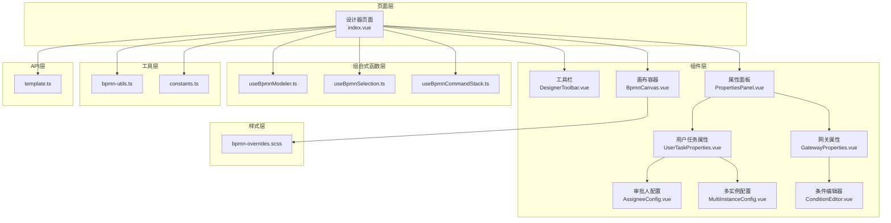
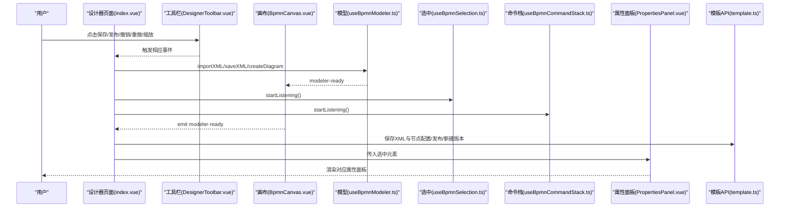
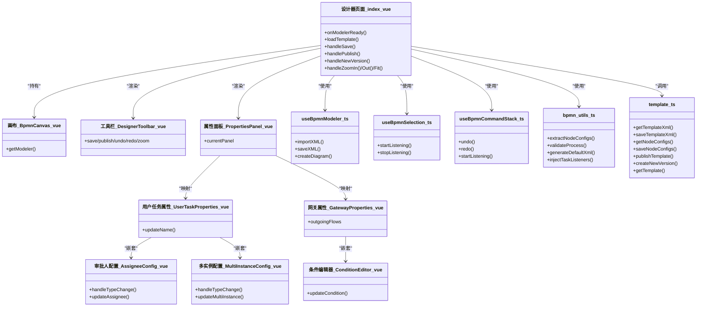
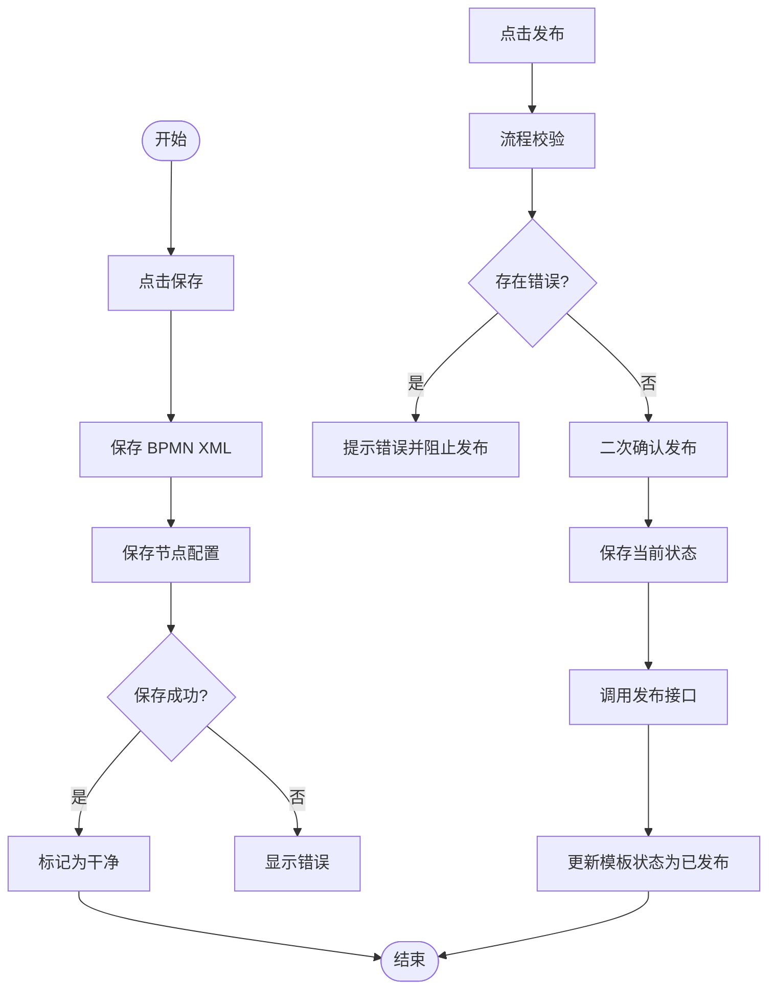

# 流程设计器

<cite>
**本文引用的文件**
- [index.vue](file://oa-ui/src/views/approval/template/designer/index.vue)
- [BpmnCanvas.vue](file://oa-ui/src/views/approval/template/designer/components/BpmnCanvas.vue)
- [DesignerToolbar.vue](file://oa-ui/src/views/approval/template/designer/components/DesignerToolbar.vue)
- [PropertiesPanel.vue](file://oa-ui/src/views/approval/template/designer/components/PropertiesPanel.vue)
- [UserTaskProperties.vue](file://oa-ui/src/views/approval/template/designer/components/panels/UserTaskProperties.vue)
- [GatewayProperties.vue](file://oa-ui/src/views/approval/template/designer/components/panels/GatewayProperties.vue)
- [AssigneeConfig.vue](file://oa-ui/src/views/approval/template/designer/components/panels/AssigneeConfig.vue)
- [MultiInstanceConfig.vue](file://oa-ui/src/views/approval/template/designer/components/panels/MultiInstanceConfig.vue)
- [ConditionEditor.vue](file://oa-ui/src/views/approval/template/designer/components/panels/ConditionEditor.vue)
- [bpmn-utils.ts](file://oa-ui/src/bpmn/bpmn-utils.ts)
- [constants.ts](file://oa-ui/src/bpmn/constants.ts)
- [useBpmnModeler.ts](file://oa-ui/src/composables/bpmn/useBpmnModeler.ts)
- [useBpmnSelection.ts](file://oa-ui/src/composables/bpmn/useBpmnSelection.ts)
- [useBpmnCommandStack.ts](file://oa-ui/src/composables/bpmn/useBpmnCommandStack.ts)
- [template.ts](file://oa-ui/src/api/template.ts)
- [bpmn-overrides.scss](file://oa-ui/src/styles/bpmn-overrides.scss)
- [package.json](file://oa-ui/package.json)
</cite>

## 目录
1. [简介](#简介)
2. [项目结构](#项目结构)
3. [核心组件](#核心组件)
4. [架构总览](#架构总览)
5. [组件详解](#组件详解)
6. [依赖关系分析](#依赖关系分析)
7. [性能考量](#性能考量)
8. [故障排查指南](#故障排查指南)
9. [结论](#结论)
10. [附录](#附录)

## 简介
本文件为流程设计器的前端实现文档，基于 Vue 3 + TypeScript 技术栈，采用 bpmn-js 作为 BPMN 画布引擎，结合组合式函数与属性面板组件，构建了可编辑、可验证、可扩展的流程模板设计器。系统支持节点拖拽、连线连接、缩放平移、撤销重做、自动保存、流程校验、XML 导入导出、版本管理以及与后端模板管理的集成。

## 项目结构
流程设计器位于前端工程的审批模块下，采用“页面 + 组件 + 组合式函数 + 工具函数 + 样式”的分层组织方式：
- 页面层：设计器主页面负责编排工具栏、画布、属性面板，并协调状态与交互。
- 组件层：BpmnCanvas、DesignerToolbar、PropertiesPanel 及其子面板（UserTaskProperties、GatewayProperties、AssigneeConfig、MultiInstanceConfig、ConditionEditor）构成可视化与配置界面。
- 组合式函数层：useBpmnModeler、useBpmnSelection、useBpmnCommandStack 封装 bpmn-js 的生命周期、选中状态与命令栈。
- 工具层：bpmn-utils 提供 BPMN 模型读取、校验、默认 XML 生成、监听器注入等能力。
- API 层：template.ts 定义与后端模板管理相关的接口调用。
- 样式层：bpmn-overrides.scss 覆盖 bpmn-js 默认样式，适配中文标签与交互风格。

图表来源
- [index.vue:1-324](file://oa-ui/src/views/approval/template/designer/index.vue#L1-L324)
- [BpmnCanvas.vue:1-107](file://oa-ui/src/views/approval/template/designer/components/BpmnCanvas.vue#L1-L107)
- [DesignerToolbar.vue:1-132](file://oa-ui/src/views/approval/template/designer/components/DesignerToolbar.vue#L1-L132)
- [PropertiesPanel.vue:1-80](file://oa-ui/src/views/approval/template/designer/components/PropertiesPanel.vue#L1-L80)
- [UserTaskProperties.vue:1-50](file://oa-ui/src/views/approval/template/designer/components/panels/UserTaskProperties.vue#L1-L50)
- [GatewayProperties.vue:1-98](file://oa-ui/src/views/approval/template/designer/components/panels/GatewayProperties.vue#L1-L98)
- [AssigneeConfig.vue:1-172](file://oa-ui/src/views/approval/template/designer/components/panels/AssigneeConfig.vue#L1-L172)
- [MultiInstanceConfig.vue:1-175](file://oa-ui/src/views/approval/template/designer/components/panels/MultiInstanceConfig.vue#L1-L175)
- [ConditionEditor.vue:1-143](file://oa-ui/src/views/approval/template/designer/components/panels/ConditionEditor.vue#L1-L143)
- [useBpmnModeler.ts:1-98](file://oa-ui/src/composables/bpmn/useBpmnModeler.ts#L1-L98)
- [useBpmnSelection.ts:1-39](file://oa-ui/src/composables/bpmn/useBpmnSelection.ts#L1-L39)
- [useBpmnCommandStack.ts:1-59](file://oa-ui/src/composables/bpmn/useBpmnCommandStack.ts#L1-L59)
- [bpmn-utils.ts:1-231](file://oa-ui/src/bpmn/bpmn-utils.ts#L1-L231)
- [constants.ts:1-95](file://oa-ui/src/bpmn/constants.ts#L1-L95)
- [template.ts:1-51](file://oa-ui/src/api/template.ts#L1-L51)
- [bpmn-overrides.scss:1-130](file://oa-ui/src/styles/bpmn-overrides.scss#L1-L130)

章节来源
- [index.vue:1-324](file://oa-ui/src/views/approval/template/designer/index.vue#L1-L324)
- [package.json:1-38](file://oa-ui/package.json#L1-L38)

## 核心组件
- 设计器页面（index.vue）
  - 负责初始化模型、监听命令栈变化、处理保存/发布/新建版本、自动保存、缩放控制、XML 预览与路由回退。
  - 通过组合式函数 useBpmnModeler、useBpmnSelection、useBpmnCommandStack 管理状态与交互。
  - 与 API 模块 template.ts 协作进行模板 XML 与节点配置的持久化。
- 画布容器（BpmnCanvas.vue）
  - 基于 bpmn-js Modeler/Viewer 创建画布，支持只读模式切换、容器自适应与事件发射。
- 工具栏（DesignerToolbar.vue）
  - 提供撤销/重做、缩放、保存、发布、返回列表、新建版本、XML 预览等功能按钮。
- 属性面板（PropertiesPanel.vue）
  - 根据选中元素类型动态渲染对应属性面板，支持空态展示。
- 用户任务属性（UserTaskProperties.vue）
  - 提供节点名称编辑、审批人配置、多实例配置等。
- 网关属性（GatewayProperties.vue）
  - 提供节点名称编辑、条件分支配置，从模板表单配置中提取字段用于条件表达式插入。
- 审批人配置（AssigneeConfig.vue）
  - 支持多种审批人类型（固定用户、部门主管、上级部门主管、角色、发起人、自定义表达式），并生成对应的 UEL 表达式。
- 多实例配置（MultiInstanceConfig.vue）
  - 支持普通、会签、或签三种多实例类型，动态生成完成条件表达式。
- 条件编辑器（ConditionEditor.vue）
  - 编辑序列流的条件表达式，支持从模板表单字段快速插入。

章节来源
- [index.vue:52-287](file://oa-ui/src/views/approval/template/designer/index.vue#L52-L287)
- [BpmnCanvas.vue:11-79](file://oa-ui/src/views/approval/template/designer/components/BpmnCanvas.vue#L11-L79)
- [DesignerToolbar.vue:67-94](file://oa-ui/src/views/approval/template/designer/components/DesignerToolbar.vue#L67-L94)
- [PropertiesPanel.vue:23-49](file://oa-ui/src/views/approval/template/designer/components/PropertiesPanel.vue#L23-L49)
- [UserTaskProperties.vue:33-48](file://oa-ui/src/views/approval/template/designer/components/panels/UserTaskProperties.vue#L33-L48)
- [GatewayProperties.vue:34-87](file://oa-ui/src/views/approval/template/designer/components/panels/GatewayProperties.vue#L34-L87)
- [AssigneeConfig.vue:70-160](file://oa-ui/src/views/approval/template/designer/components/panels/AssigneeConfig.vue#L70-L160)
- [MultiInstanceConfig.vue:60-158](file://oa-ui/src/views/approval/template/designer/components/panels/MultiInstanceConfig.vue#L60-L158)
- [ConditionEditor.vue:41-115](file://oa-ui/src/views/approval/template/designer/components/panels/ConditionEditor.vue#L41-L115)

## 架构总览
流程设计器采用“页面 + 组件 + 组合式函数 + 工具 + API + 样式”的分层架构，核心交互链路如下：

图表来源
- [index.vue:93-107](file://oa-ui/src/views/approval/template/designer/index.vue#L93-L107)
- [DesignerToolbar.vue:80-91](file://oa-ui/src/views/approval/template/designer/components/DesignerToolbar.vue#L80-L91)
- [BpmnCanvas.vue:39-65](file://oa-ui/src/views/approval/template/designer/components/BpmnCanvas.vue#L39-L65)
- [useBpmnModeler.ts:16-81](file://oa-ui/src/composables/bpmn/useBpmnModeler.ts#L16-L81)
- [useBpmnSelection.ts:7-21](file://oa-ui/src/composables/bpmn/useBpmnSelection.ts#L7-L21)
- [useBpmnCommandStack.ts:34-48](file://oa-ui/src/composables/bpmn/useBpmnCommandStack.ts#L34-L48)
- [PropertiesPanel.vue:45-49](file://oa-ui/src/views/approval/template/designer/components/PropertiesPanel.vue#L45-L49)
- [template.ts:16-46](file://oa-ui/src/api/template.ts#L16-L46)

## 组件详解

### 1) BPMN 画布实现原理
- 初始化与只读模式
  - 在 mounted 生命周期中根据是否只读创建 BpmnViewer 或 BpmnModeler 实例，并设置容器与 Moddle 扩展。
  - 通过 ResizeObserver 监听容器尺寸变化，触发 canvas.resized 以保持画布正确渲染。
- 事件与生命周期
  - 通过 modeler-ready 事件向上层传递实例，便于后续导入 XML、保存 XML、创建空白图等。
- 样式覆盖
  - 通过 bpmn-overrides.scss 调整画布背景、节点高亮、标签字体、缩放控件位置、最小地图位置等，提升中文使用体验。

章节来源
- [BpmnCanvas.vue:39-77](file://oa-ui/src/views/approval/template/designer/components/BpmnCanvas.vue#L39-L77)
- [bpmn-overrides.scss:1-130](file://oa-ui/src/styles/bpmn-overrides.scss#L1-L130)

### 2) 工具栏组件设计与功能
- 功能按钮
  - 撤销/重做：依赖命令栈状态，仅在可执行时可用。
  - 缩放：放大、缩小、适应视口。
  - 保存/发布：保存当前 XML 与节点配置；发布前进行流程校验。
  - 新建版本：创建模板新版本并跳转到新 ID。
  - XML 预览：导出当前 XML 并弹窗显示。
  - 返回列表：离开前提示未保存更改。
- 状态联动
  - 与页面状态模板名称、状态、保存中状态联动，动态禁用/启用按钮。

章节来源
- [DesignerToolbar.vue:13-63](file://oa-ui/src/views/approval/template/designer/components/DesignerToolbar.vue#L13-L63)
- [index.vue:157-247](file://oa-ui/src/views/approval/template/designer/index.vue#L157-L247)

### 3) 属性面板与实时更新机制
- 动态面板映射
  - 根据选中元素的业务对象类型映射到对应属性面板（开始/结束事件、用户任务、网关）。
- 实时更新
  - 用户任务名称、网关名称、条件表达式、审批人类型与配置、多实例配置等均通过调用 bpmn-js 的 modeling 与 moddle 接口实时更新模型。
- 数据绑定
  - 使用 Element Plus 表单组件双向绑定，配合 updateProperties/updateModdleProperties 写入 BPMN 元素。

章节来源
- [PropertiesPanel.vue:37-49](file://oa-ui/src/views/approval/template/designer/components/PropertiesPanel.vue#L37-L49)
- [UserTaskProperties.vue:44-48](file://oa-ui/src/views/approval/template/designer/components/panels/UserTaskProperties.vue#L44-L48)
- [GatewayProperties.vue:60-64](file://oa-ui/src/views/approval/template/designer/components/panels/GatewayProperties.vue#L60-L64)
- [ConditionEditor.vue:77-107](file://oa-ui/src/views/approval/template/designer/components/panels/ConditionEditor.vue#L77-L107)
- [AssigneeConfig.vue:147-159](file://oa-ui/src/views/approval/template/designer/components/panels/AssigneeConfig.vue#L147-L159)
- [MultiInstanceConfig.vue:126-157](file://oa-ui/src/views/approval/template/designer/components/panels/MultiInstanceConfig.vue#L126-L157)

### 4) BPMN 模型操作 API 封装与工具函数
- useBpmnModeler.ts
  - 提供 importXML、saveXML、createDiagram、getModeler 等方法，封装 bpmn-js 的导入/导出/创建与错误处理。
- useBpmnSelection.ts
  - 订阅 selection.changed 事件，维护选中元素状态。
- useBpmnCommandStack.ts
  - 订阅 commandStack.changed 事件，维护撤销/重做状态。
- bpmn-utils.ts
  - extractNodeConfigs：遍历元素注册表，抽取用户任务、网关、开始/结束事件的节点配置。
  - validateProcess：对开始事件、结束事件、用户任务、网关进行完整性与连通性校验。
  - generateDefaultXml：生成默认 BPMN XML。
  - injectTaskListeners：为用户任务注入审批监听器。
- constants.ts
  - 定义节点类型、审批人类型、多实例类型、状态映射等常量。

章节来源
- [useBpmnModeler.ts:7-97](file://oa-ui/src/composables/bpmn/useBpmnModeler.ts#L7-L97)
- [useBpmnSelection.ts:4-38](file://oa-ui/src/composables/bpmn/useBpmnSelection.ts#L4-L38)
- [useBpmnCommandStack.ts:4-58](file://oa-ui/src/composables/bpmn/useBpmnCommandStack.ts#L4-L58)
- [bpmn-utils.ts:56-231](file://oa-ui/src/bpmn/bpmn-utils.ts#L56-L231)
- [constants.ts:1-95](file://oa-ui/src/bpmn/constants.ts#L1-L95)

### 5) 高级功能实现方案
- 流程验证
  - validateProcess 对开始/结束事件、用户任务、网关进行规则校验，返回错误列表并在发布前阻断。
- 导入导出
  - importXML/saveXML 与 API 层 getTemplateXml/saveTemplateXml 协同，实现模板 XML 的读写。
- 版本控制
  - createNewVersion 创建新版本并跳转至新 ID；发布后模板状态置为已发布，工具栏显示“新建版本”按钮。
- 自动保存
  - 监听命令栈变化标记脏状态，定时器周期性保存，避免意外丢失。

章节来源
- [bpmn-utils.ts:132-215](file://oa-ui/src/bpmn/bpmn-utils.ts#L132-L215)
- [index.vue:125-142](file://oa-ui/src/views/approval/template/designer/index.vue#L125-L142)
- [index.vue:157-183](file://oa-ui/src/views/approval/template/designer/index.vue#L157-L183)
- [index.vue:218-227](file://oa-ui/src/views/approval/template/designer/index.vue#L218-L227)
- [index.vue:109-123](file://oa-ui/src/views/approval/template/designer/index.vue#L109-L123)

### 6) 与后端流程模板管理的集成
- 接口定义
  - getTemplateXml/saveTemplateXml/getNodeConfigs/saveNodeConfigs/publishTemplate/createNewVersion/getTemplate/updateTemplate/deleteTemplate
- 数据同步策略
  - 保存：同时提交 BPMN XML 与节点配置，确保模型与业务配置一致。
  - 发布：先校验，再保存，最后发布，发布后模板状态更新且工具栏按钮切换。
  - 新版本：创建新版本后路由跳转，保证编辑上下文隔离。

章节来源
- [template.ts:16-50](file://oa-ui/src/api/template.ts#L16-L50)
- [index.vue:185-216](file://oa-ui/src/views/approval/template/designer/index.vue#L185-L216)

## 依赖关系分析

图表来源
- [index.vue:52-287](file://oa-ui/src/views/approval/template/designer/index.vue#L52-L287)
- [BpmnCanvas.vue:11-79](file://oa-ui/src/views/approval/template/designer/components/BpmnCanvas.vue#L11-L79)
- [DesignerToolbar.vue:67-94](file://oa-ui/src/views/approval/template/designer/components/DesignerToolbar.vue#L67-L94)
- [PropertiesPanel.vue:23-49](file://oa-ui/src/views/approval/template/designer/components/PropertiesPanel.vue#L23-L49)
- [UserTaskProperties.vue:33-48](file://oa-ui/src/views/approval/template/designer/components/panels/UserTaskProperties.vue#L33-L48)
- [GatewayProperties.vue:34-87](file://oa-ui/src/views/approval/template/designer/components/panels/GatewayProperties.vue#L34-L87)
- [AssigneeConfig.vue:70-160](file://oa-ui/src/views/approval/template/designer/components/panels/AssigneeConfig.vue#L70-L160)
- [MultiInstanceConfig.vue:60-158](file://oa-ui/src/views/approval/template/designer/components/panels/MultiInstanceConfig.vue#L60-L158)
- [ConditionEditor.vue:41-115](file://oa-ui/src/views/approval/template/designer/components/panels/ConditionEditor.vue#L41-L115)
- [useBpmnModeler.ts:7-97](file://oa-ui/src/composables/bpmn/useBpmnModeler.ts#L7-L97)
- [useBpmnSelection.ts:4-38](file://oa-ui/src/composables/bpmn/useBpmnSelection.ts#L4-L38)
- [useBpmnCommandStack.ts:4-58](file://oa-ui/src/composables/bpmn/useBpmnCommandStack.ts#L4-L58)
- [bpmn-utils.ts:56-231](file://oa-ui/src/bpmn/bpmn-utils.ts#L56-L231)
- [template.ts:16-50](file://oa-ui/src/api/template.ts#L16-L50)

## 性能考量
- 画布自适应
  - 使用 ResizeObserver 监听容器尺寸变化，避免频繁重绘；仅在容器尺寸变化时触发 canvas.resized。
- 命令栈监听
  - 仅在需要时启动事件监听，销毁时停止监听，减少内存占用与事件风暴。
- 自动保存节流
  - 通过脏状态与定时器控制保存频率，避免高频 IO；发布与保存流程中增加 loading 状态，防止重复提交。
- 模板信息异步加载
  - 模板基础信息加载不影响核心流程，采用容错处理，避免阻塞画布初始化。
- 样式覆盖
  - 通过覆盖类名而非内联样式，降低样式计算成本，提升渲染性能。

章节来源
- [BpmnCanvas.vue:53-60](file://oa-ui/src/views/approval/template/designer/components/BpmnCanvas.vue#L53-L60)
- [useBpmnSelection.ts:23-31](file://oa-ui/src/composables/bpmn/useBpmnSelection.ts#L23-L31)
- [index.vue:109-123](file://oa-ui/src/views/approval/template/designer/index.vue#L109-L123)
- [index.vue:144-155](file://oa-ui/src/views/approval/template/designer/index.vue#L144-L155)
- [bpmn-overrides.scss:1-130](file://oa-ui/src/styles/bpmn-overrides.scss#L1-L130)

## 故障排查指南
- 画布不显示或空白
  - 检查容器是否存在与尺寸是否有效；确认 modeler-ready 是否触发；查看控制台是否有 importXML 错误。
- 保存失败
  - 确认 saveXML 是否返回 XML；检查 saveTemplateXml/saveNodeConfigs 请求是否成功；查看错误消息提示。
- 发布失败
  - validateProcess 是否返回错误；保存是否成功；发布接口是否报错。
- 选中元素不更新
  - 确认 selection.changed 事件是否被订阅；确保只选择单一元素。
- 命令栈不可撤销/重做
  - 检查 commandStack.changed 事件是否被订阅；确认命令栈状态是否更新。
- 审批人/多实例配置未生效
  - 确认 modeling.updateModdleProperties/updateProperties 是否被调用；检查扩展属性是否写入到 businessObject。

章节来源
- [BpmnCanvas.vue:39-77](file://oa-ui/src/views/approval/template/designer/components/BpmnCanvas.vue#L39-L77)
- [index.vue:157-183](file://oa-ui/src/views/approval/template/designer/index.vue#L157-L183)
- [index.vue:185-216](file://oa-ui/src/views/approval/template/designer/index.vue#L185-L216)
- [useBpmnSelection.ts:7-21](file://oa-ui/src/composables/bpmn/useBpmnSelection.ts#L7-L21)
- [useBpmnCommandStack.ts:34-48](file://oa-ui/src/composables/bpmn/useBpmnCommandStack.ts#L34-L48)
- [AssigneeConfig.vue:147-159](file://oa-ui/src/views/approval/template/designer/components/panels/AssigneeConfig.vue#L147-L159)
- [MultiInstanceConfig.vue:126-157](file://oa-ui/src/views/approval/template/designer/components/panels/MultiInstanceConfig.vue#L126-L157)

## 结论
该流程设计器以 bpmn-js 为核心，结合 Vue 3 组合式函数与属性面板组件，实现了从画布渲染、节点编辑、连线配置到属性实时更新的完整闭环。通过统一的工具函数与 API 封装，系统具备良好的可扩展性与可维护性。建议后续可在节点库扩展、快捷键支持、批量操作与审计日志方面进一步增强。

## 附录
- 关键流程图：保存与发布流程

图表来源
- [index.vue:157-183](file://oa-ui/src/views/approval/template/designer/index.vue#L157-L183)
- [index.vue:185-216](file://oa-ui/src/views/approval/template/designer/index.vue#L185-L216)
- [bpmn-utils.ts:132-215](file://oa-ui/src/bpmn/bpmn-utils.ts#L132-L215)