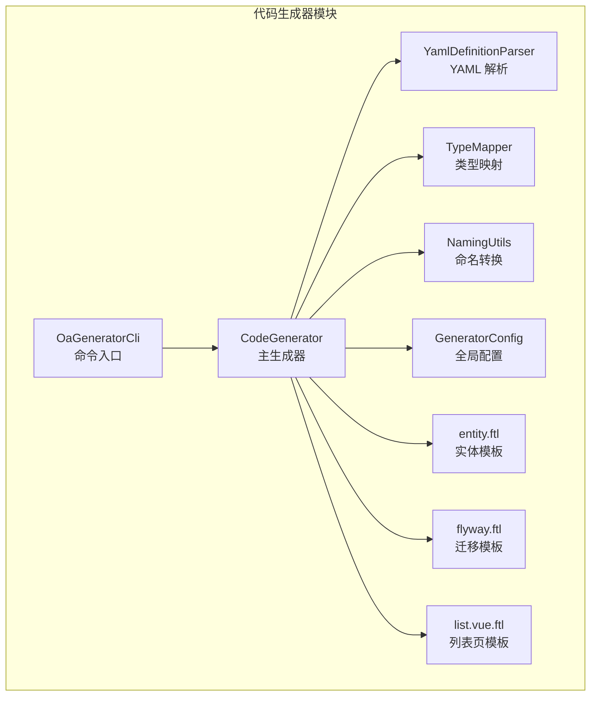
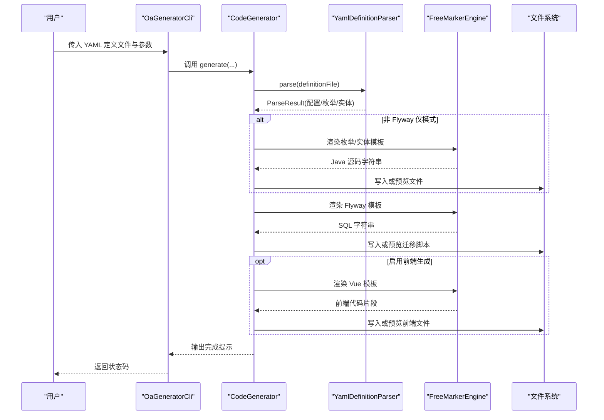
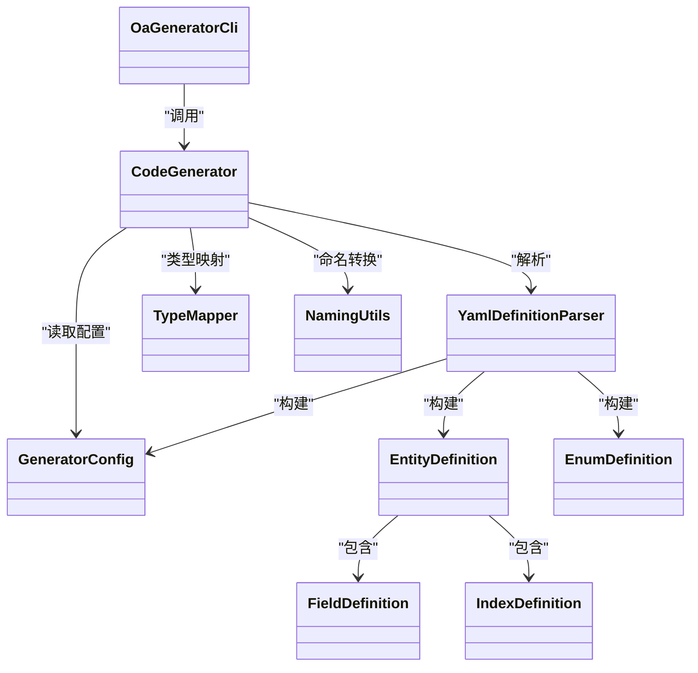
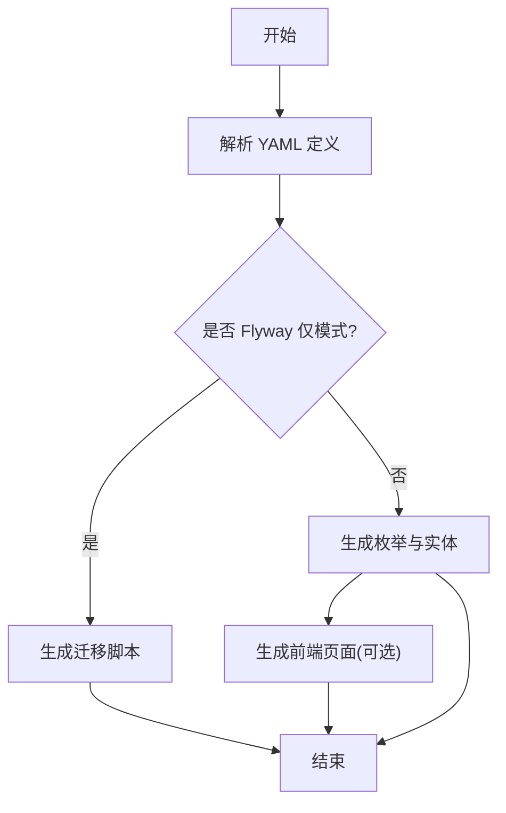

# 代码生成器

<cite>
**本文引用的文件**
- [OaGeneratorCli.java](file://oa-generator/src/main/java/com/oa/admin/generator/OaGeneratorCli.java)
- [CodeGenerator.java](file://oa-generator/src/main/java/com/oa/admin/generator/engine/CodeGenerator.java)
- [YamlDefinitionParser.java](file://oa-generator/src/main/java/com/oa/admin/generator/parser/YamlDefinitionParser.java)
- [EntityDefinition.java](file://oa-generator/src/main/java/com/oa/admin/generator/model/EntityDefinition.java)
- [EnumDefinition.java](file://oa-generator/src/main/java/com/oa/admin/generator/model/EnumDefinition.java)
- [FieldDefinition.java](file://oa-generator/src/main/java/com/oa/admin/generator/model/FieldDefinition.java)
- [IndexDefinition.java](file://oa-generator/src/main/java/com/oa/admin/generator/model/IndexDefinition.java)
- [NamingUtils.java](file://oa-generator/src/main/java/com/oa/admin/generator/util/NamingUtils.java)
- [TypeMapper.java](file://oa-generator/src/main/java/com/oa/admin/generator/parser/TypeMapper.java)
- [GeneratorConfig.java](file://oa-generator/src/main/java/com/oa/admin/generator/config/GeneratorConfig.java)
- [entity.ftl](file://oa-generator/src/main/resources/templates/entity.ftl)
- [flyway.ftl](file://oa-generator/src/main/resources/templates/flyway.ftl)
- [list.vue.ftl](file://oa-generator/src/main/resources/templates/vue/list.vue.ftl)
- [leave-request.yaml](file://generators/leave-request.yaml)
- [README.md](file://README.md)
</cite>

## 目录
1. [简介](#简介)
2. [项目结构](#项目结构)
3. [核心组件](#核心组件)
4. [架构总览](#架构总览)
5. [详细组件分析](#详细组件分析)
6. [依赖关系分析](#依赖关系分析)
7. [性能与可扩展性](#性能与可扩展性)
8. [使用指南：YAML DSL 语法](#使用指南yml-dsl-语法)
9. [使用指南：CLI 命令与参数](#使用指南cli-命令与参数)
10. [完整代码生成流程](#完整代码生成流程)
11. [模板引擎与自定义模板](#模板引擎与自定义模板)
12. [生成代码结构与命名规范](#生成代码结构与命名规范)
13. [常见使用场景示例](#常见使用场景示例)
14. [故障排除与调试](#故障排除与调试)
15. [结论](#结论)

## 简介
本指南面向需要使用 OA 代码生成器的开发者，系统讲解 YAML DSL 定义语法（实体、字段、枚举、索引等），CLI 命令参数与用法，以及从 YAML 到最终代码输出的完整流程。同时提供模板引擎使用方法、自定义模板创建、生成代码结构与命名规范、常见场景示例及故障排除建议。

## 项目结构
- 代码生成器位于 oa-generator 模块，包含解析器、模板引擎、生成器、模型与工具类。
- generators 目录提供示例 YAML 定义文件。
- 生成的代码默认输出到目标 Maven 模块的 src/main/java 下对应包结构。
- 前端页面模板位于 oa-generator/src/main/resources/templates/vue/，可在启用 --frontend 时生成。

图表来源
- [OaGeneratorCli.java:12-76](file://oa-generator/src/main/java/com/oa/admin/generator/OaGeneratorCli.java#L12-L76)
- [CodeGenerator.java:22-63](file://oa-generator/src/main/java/com/oa/admin/generator/engine/CodeGenerator.java#L22-L63)
- [YamlDefinitionParser.java:23-49](file://oa-generator/src/main/java/com/oa/admin/generator/parser/YamlDefinitionParser.java#L23-L49)
- [TypeMapper.java:9-66](file://oa-generator/src/main/java/com/oa/admin/generator/parser/TypeMapper.java#L9-L66)
- [NamingUtils.java:6-62](file://oa-generator/src/main/java/com/oa/admin/generator/util/NamingUtils.java#L6-L62)
- [GeneratorConfig.java:8-19](file://oa-generator/src/main/java/com/oa/admin/generator/config/GeneratorConfig.java#L8-L19)
- [entity.ftl:1-63](file://oa-generator/src/main/resources/templates/entity.ftl#L1-L63)
- [flyway.ftl:1-21](file://oa-generator/src/main/resources/templates/flyway.ftl#L1-L21)
- [list.vue.ftl:1-144](file://oa-generator/src/main/resources/templates/vue/list.vue.ftl#L1-L144)

章节来源
- [README.md:137-222](file://README.md#L137-L222)

## 核心组件
- 命令行入口：负责解析 CLI 参数并调用生成器。
- 生成器：协调解析、模板渲染、文件写入或预览。
- 解析器：将 YAML DSL 解析为内部模型（配置、枚举、实体、字段、索引）。
- 类型映射：将 YAML 类型映射为 Java 类型与导入。
- 命名工具：驼峰与蛇形命名互转。
- 模板：FreeMarker 模板用于生成 Java、SQL、Vue 页面。
- 模型：描述 YAML DSL 的数据结构。

章节来源
- [OaGeneratorCli.java:19-76](file://oa-generator/src/main/java/com/oa/admin/generator/OaGeneratorCli.java#L19-L76)
- [CodeGenerator.java:22-63](file://oa-generator/src/main/java/com/oa/admin/generator/engine/CodeGenerator.java#L22-L63)
- [YamlDefinitionParser.java:23-49](file://oa-generator/src/main/java/com/oa/admin/generator/parser/YamlDefinitionParser.java#L23-L49)
- [TypeMapper.java:9-66](file://oa-generator/src/main/java/com/oa/admin/generator/parser/TypeMapper.java#L9-L66)
- [NamingUtils.java:6-62](file://oa-generator/src/main/java/com/oa/admin/generator/util/NamingUtils.java#L6-L62)

## 架构总览
下图展示从 CLI 到模板渲染与文件输出的整体流程。

图表来源
- [OaGeneratorCli.java:51-74](file://oa-generator/src/main/java/com/oa/admin/generator/OaGeneratorCli.java#L51-L74)
- [CodeGenerator.java:27-63](file://oa-generator/src/main/java/com/oa/admin/generator/engine/CodeGenerator.java#L27-L63)
- [YamlDefinitionParser.java:34-49](file://oa-generator/src/main/java/com/oa/admin/generator/parser/YamlDefinitionParser.java#L34-L49)

## 详细组件分析

### 命令行接口（CLI）
- 参数说明
  - definitionFile：必填，YAML 定义文件路径
  - -p/--project：项目根目录，默认当前目录
  - -m/--target-module：目标 Maven 模块，默认 oa-app
  - --dry-run：仅预览，不写文件
  - --flyway-only：只生成 Flyway 迁移脚本
  - --frontend：同时生成 Vue 3 前端页面
  - --entity：逗号分隔的实体名过滤器，仅生成指定实体
- 行为：调用 CodeGenerator 执行生成，并在异常时打印错误与返回非零状态码。

章节来源
- [OaGeneratorCli.java:21-49](file://oa-generator/src/main/java/com/oa/admin/generator/OaGeneratorCli.java#L21-L49)
- [OaGeneratorCli.java:51-74](file://oa-generator/src/main/java/com/oa/admin/generator/OaGeneratorCli.java#L51-L74)

### 生成器（CodeGenerator）
- 主要职责
  - 解析 YAML → 生成配置、枚举、实体集合
  - 生成枚举、实体（含 DTO、VO、Mapper、Service、ServiceImpl、Controller）
  - 生成 Flyway 迁移脚本（按版本号排序）
  - 可选生成 Vue 前端页面与路由片段
  - 支持 dry-run 预览
- 输出位置
  - Java 源码：targetModule/src/main/java/<包路径>/<子目录>
  - 迁移脚本：targetModule/src/main/resources/db/migration
  - 前端：oa-ui/src/views/<模块>/ 与 oa-ui/src/api/

章节来源
- [CodeGenerator.java:27-63](file://oa-generator/src/main/java/com/oa/admin/generator/engine/CodeGenerator.java#L27-L63)
- [CodeGenerator.java:65-114](file://oa-generator/src/main/java/com/oa/admin/generator/engine/CodeGenerator.java#L65-L114)
- [CodeGenerator.java:116-133](file://oa-generator/src/main/java/com/oa/admin/generator/engine/CodeGenerator.java#L116-L133)
- [CodeGenerator.java:158-203](file://oa-generator/src/main/java/com/oa/admin/generator/engine/CodeGenerator.java#L158-L203)

### YAML 解析器（YamlDefinitionParser）
- 解析阶段
  - global → GeneratorConfig（模块、表前缀、作者、基础包）
  - enums → EnumDefinition（名称、类型、枚举值）
  - entities → EntityDefinition（表名、注释、字段、索引）
- 校验
  - 字段类型合法性（基于 TypeMapper）
  - 实体引用的枚举必须存在
  - 表名与列名推导：显式优先，否则使用表前缀 + 驼峰转蛇形

章节来源
- [YamlDefinitionParser.java:41-49](file://oa-generator/src/main/java/com/oa/admin/generator/parser/YamlDefinitionParser.java#L41-L49)
- [YamlDefinitionParser.java:51-63](file://oa-generator/src/main/java/com/oa/admin/generator/parser/YamlDefinitionParser.java#L51-L63)
- [YamlDefinitionParser.java:65-97](file://oa-generator/src/main/java/com/oa/admin/generator/parser/YamlDefinitionParser.java#L65-L97)
- [YamlDefinitionParser.java:99-125](file://oa-generator/src/main/java/com/oa/admin/generator/parser/YamlDefinitionParser.java#L99-L125)
- [YamlDefinitionParser.java:127-133](file://oa-generator/src/main/java/com/oa/admin/generator/parser/YamlDefinitionParser.java#L127-L133)
- [YamlDefinitionParser.java:135-159](file://oa-generator/src/main/java/com/oa/admin/generator/parser/YamlDefinitionParser.java#L135-L159)
- [YamlDefinitionParser.java:168-174](file://oa-generator/src/main/java/com/oa/admin/generator/parser/YamlDefinitionParser.java#L168-L174)
- [YamlDefinitionParser.java:176-190](file://oa-generator/src/main/java/com/oa/admin/generator/parser/YamlDefinitionParser.java#L176-L190)
- [YamlDefinitionParser.java:192-202](file://oa-generator/src/main/java/com/oa/admin/generator/parser/YamlDefinitionParser.java#L192-L202)

### 模型与工具
- 实体模型：EntityDefinition 提供各类命名（Mapper/Service/Controller/DTO/VO 名称）、资源路径、可搜索字段等
- 字段模型：FieldDefinition 描述字段类型、SQL 类型、是否可空、默认值、注释、是否可搜索、枚举引用、JSON 格式化等
- 索引模型：IndexDefinition 描述索引名、列集合、唯一性
- 枚举模型：EnumDefinition 描述枚举类型、值集合、是否带标签、是否整型
- 命名工具：camelToSnake、snakeToCamel、capitalize、uncapitalize
- 类型映射：TypeMapper 提供 YAML 类型到 Java 类型的映射、导入、简单类型名、有效类型集

章节来源
- [EntityDefinition.java:12-65](file://oa-generator/src/main/java/com/oa/admin/generator/model/EntityDefinition.java#L12-L65)
- [FieldDefinition.java:9-29](file://oa-generator/src/main/java/com/oa/admin/generator/model/FieldDefinition.java#L9-L29)
- [IndexDefinition.java:10-15](file://oa-generator/src/main/java/com/oa/admin/generator/model/IndexDefinition.java#L10-L15)
- [EnumDefinition.java:10-23](file://oa-generator/src/main/java/com/oa/admin/generator/model/EnumDefinition.java#L10-L23)
- [NamingUtils.java:11-60](file://oa-generator/src/main/java/com/oa/admin/generator/util/NamingUtils.java#L11-L60)
- [TypeMapper.java:11-64](file://oa-generator/src/main/java/com/oa/admin/generator/parser/TypeMapper.java#L11-L64)

### 模板与渲染
- 实体模板：生成继承 BaseEntity 的实体类，自动导入所需类型，处理 JSON 格式化、LocalDateTime/LocalDate/BigDecimal 等
- 迁移模板：根据实体字段生成 CREATE TABLE 语句，包含索引与通用审计字段
- Vue 列表页模板：生成列表、搜索、分页、增删改操作，自动根据可搜索字段生成控件与宽度

章节来源
- [entity.ftl:1-63](file://oa-generator/src/main/resources/templates/entity.ftl#L1-L63)
- [flyway.ftl:1-21](file://oa-generator/src/main/resources/templates/flyway.ftl#L1-L21)
- [list.vue.ftl:1-144](file://oa-generator/src/main/resources/templates/vue/list.vue.ftl#L1-L144)

## 依赖关系分析
- CLI 依赖生成器；生成器依赖解析器、类型映射、命名工具、模板引擎与 Flyway 版本解析器。
- 模型之间松耦合，通过生成器组装；模板通过 FreeMarker 渲染，数据来自生成上下文。

图表来源
- [OaGeneratorCli.java:3-6](file://oa-generator/src/main/java/com/oa/admin/generator/OaGeneratorCli.java#L3-L6)
- [CodeGenerator.java:3-25](file://oa-generator/src/main/java/com/oa/admin/generator/engine/CodeGenerator.java#L3-L25)
- [YamlDefinitionParser.java:3-10](file://oa-generator/src/main/java/com/oa/admin/generator/parser/YamlDefinitionParser.java#L3-L10)
- [TypeMapper.java:9-19](file://oa-generator/src/main/java/com/oa/admin/generator/parser/TypeMapper.java#L9-L19)
- [NamingUtils.java:6-10](file://oa-generator/src/main/java/com/oa/admin/generator/util/NamingUtils.java#L6-L10)
- [GeneratorConfig.java:8-18](file://oa-generator/src/main/java/com/oa/admin/generator/config/GeneratorConfig.java#L8-L18)
- [EntityDefinition.java:12-18](file://oa-generator/src/main/java/com/oa/admin/generator/model/EntityDefinition.java#L12-L18)
- [EnumDefinition.java:10-14](file://oa-generator/src/main/java/com/oa/admin/generator/model/EnumDefinition.java#L10-L14)
- [FieldDefinition.java:9-19](file://oa-generator/src/main/java/com/oa/admin/generator/model/FieldDefinition.java#L9-L19)
- [IndexDefinition.java:10-14](file://oa-generator/src/main/java/com/oa/admin/generator/model/IndexDefinition.java#L10-L14)

## 性能与可扩展性
- 解析与渲染均为内存操作，复杂度与实体数量线性相关。
- 可扩展点
  - 新增模板：在 templates 目录添加新 ftl，生成器中注册渲染逻辑
  - 新增类型映射：在 TypeMapper 中扩展映射规则
  - 新增命名策略：在 NamingUtils 中扩展命名转换函数
  - 新增校验规则：在解析器中增加字段或实体层面的校验

[本节为通用指导，无需列出具体文件来源]

## 使用指南：YAML DSL 语法

### 全局配置（global）
- module：模块名，决定生成包名与迁移脚本描述
- tablePrefix：表名前缀，实体未显式指定表名时生效
- author：作者，用于生成文件头部注释
- basePackage：基础包名，默认 com.oa.admin；最终包名为 basePackage.module

章节来源
- [YamlDefinitionParser.java:52-62](file://oa-generator/src/main/java/com/oa/admin/generator/parser/YamlDefinitionParser.java#L52-L62)
- [GeneratorConfig.java:15-17](file://oa-generator/src/main/java/com/oa/admin/generator/config/GeneratorConfig.java#L15-L17)

### 枚举定义（enums）
- 键：枚举类名
- type：枚举类型，缺省 int
- values：枚举值列表
  - code：枚举值编码
  - label：显示标签（可选）
- 生成：一个 Java 枚举类，带类型与值集合

章节来源
- [YamlDefinitionParser.java:65-97](file://oa-generator/src/main/java/com/oa/admin/generator/parser/YamlDefinitionParser.java#L65-L97)
- [EnumDefinition.java:10-23](file://oa-generator/src/main/java/com/oa/admin/generator/model/EnumDefinition.java#L10-L23)

### 实体定义（entities）
- 每个实体以键值对形式出现，键为实体类名，值为属性对象
- 属性
  - tableName：表名，缺省由 tablePrefix + 驼峰转蛇形生成
  - comment：实体注释
  - fields：字段数组
  - indexes：索引数组
- 字段属性
  - name/type/sqlType：字段名、YAML 类型、SQL 类型
  - nullable/defaultValue/comment：可空、默认值、注释
  - searchable：是否作为查询条件
  - enum：引用的枚举类名
  - jsonFormat：是否标注 JSON 时间格式化
- 索引属性
  - name/columns/unique：索引名、列集合、唯一性

章节来源
- [YamlDefinitionParser.java:99-125](file://oa-generator/src/main/java/com/oa/admin/generator/parser/YamlDefinitionParser.java#L99-L125)
- [YamlDefinitionParser.java:135-159](file://oa-generator/src/main/java/com/oa/admin/generator/parser/YamlDefinitionParser.java#L135-L159)
- [YamlDefinitionParser.java:176-190](file://oa-generator/src/main/java/com/oa/admin/generator/parser/YamlDefinitionParser.java#L176-L190)
- [EntityDefinition.java:12-18](file://oa-generator/src/main/java/com/oa/admin/generator/model/EntityDefinition.java#L12-L18)
- [FieldDefinition.java:10-20](file://oa-generator/src/main/java/com/oa/admin/generator/model/FieldDefinition.java#L10-L20)
- [IndexDefinition.java:10-15](file://oa-generator/src/main/java/com/oa/admin/generator/model/IndexDefinition.java#L10-L15)

### 示例参考
- 参考 generators/leave-request.yaml，包含枚举与实体定义、字段与索引配置

章节来源
- [leave-request.yaml:1-74](file://generators/leave-request.yaml#L1-L74)

## 使用指南：CLI 命令与参数

### 基本用法
- 预览生成内容（不写文件）
  - java -jar oa-generator/target/oa-generator-*.jar generators/your-module.yaml --dry-run
- 正式生成
  - java -jar oa-generator/target/oa-generator-*.jar generators/your-module.yaml

### 参数详解
- definitionFile：必填，YAML 定义文件路径
- -p/--project：项目根目录，默认当前目录
- -m/--target-module：目标 Maven 模块，默认 oa-app
- --dry-run：仅预览，不写文件
- --flyway-only：只生成 Flyway 迁移脚本
- --frontend：同时生成 Vue 3 前端页面
- --entity：逗号分隔的实体名过滤器，仅生成指定实体

章节来源
- [OaGeneratorCli.java:21-49](file://oa-generator/src/main/java/com/oa/admin/generator/OaGeneratorCli.java#L21-L49)
- [README.md:202-212](file://README.md#L202-L212)

## 完整代码生成流程
- 输入：YAML DSL 文件
- 解析：YamlDefinitionParser 将 YAML 转换为配置、枚举、实体集合
- 生成：
  - 枚举：渲染 enum.ftl，输出到 <模块包>/enums
  - 实体：渲染 entity.ftl、dto、vo、mapper、service、serviceImpl、controller
  - 迁移：渲染 flyway.ftl，输出到 db/migration，按版本号排序
  - 前端：渲染 vue 模板，输出到 oa-ui/views/<模块> 与 api
- 输出：控制台打印生成路径或预览内容；完成后打印后续步骤提示

图表来源
- [CodeGenerator.java:45-54](file://oa-generator/src/main/java/com/oa/admin/generator/engine/CodeGenerator.java#L45-L54)
- [YamlDefinitionParser.java:34-49](file://oa-generator/src/main/java/com/oa/admin/generator/parser/YamlDefinitionParser.java#L34-L49)

## 模板引擎与自定义模板
- 引擎：FreeMarker
- 数据模型：ctx（包含 config、entity、enums、packageName、flywayVersion、flywayDescription、allEntities 等）
- 类型映射工具：TypeMapperStaticMethods（提供 getSimpleJavaType/getImport）
- 自定义步骤
  - 在 templates 目录新增 .ftl 模板
  - 在 CodeGenerator 中注册渲染与输出逻辑
  - 通过 ctx 访问数据模型字段进行渲染

章节来源
- [CodeGenerator.java:135-144](file://oa-generator/src/main/java/com/oa/admin/generator/engine/CodeGenerator.java#L135-L144)
- [CodeGenerator.java:216-224](file://oa-generator/src/main/java/com/oa/admin/generator/engine/CodeGenerator.java#L216-L224)
- [entity.ftl:1-63](file://oa-generator/src/main/resources/templates/entity.ftl#L1-L63)
- [flyway.ftl:1-21](file://oa-generator/src/main/resources/templates/flyway.ftl#L1-L21)
- [list.vue.ftl:1-144](file://oa-generator/src/main/resources/templates/vue/list.vue.ftl#L1-L144)

## 生成代码结构与命名规范
- 包名：basePackage.module（默认 com.oa.admin.leave）
- 子目录：entity、dto、vo、mapper、service、service/impl、controller
- 文件命名
  - 实体：Xxx.java
  - DTO：XxxCreateDTO.java、XxxUpdateDTO.java、XxxQueryDTO.java
  - VO：XxxVO.java
  - Mapper：XxxMapper.java
  - Service：XxxService.java、XxxServiceImpl.java
  - Controller：XxxController.java
- 资源路径：实体名转蛇形（如 LeaveRequest → leave_request）

章节来源
- [EntityDefinition.java:20-58](file://oa-generator/src/main/java/com/oa/admin/generator/model/EntityDefinition.java#L20-L58)
- [NamingUtils.java:11-26](file://oa-generator/src/main/java/com/oa/admin/generator/util/NamingUtils.java#L11-L26)

## 常见使用场景示例

### 快速生成请假模块的 CRUD 代码
- 准备 YAML：参考 generators/leave-request.yaml
- 预览：java -jar ... generators/leave-request.yaml --dry-run
- 生成：java -jar ... generators/leave-request.yaml
- 后续：更新 @MapperScan、权限种子数据、前端路由与菜单

章节来源
- [leave-request.yaml:1-74](file://generators/leave-request.yaml#L1-L74)
- [README.md:141-150](file://README.md#L141-L150)
- [CodeGenerator.java:205-214](file://oa-generator/src/main/java/com/oa/admin/generator/engine/CodeGenerator.java#L205-L214)

### 仅生成数据库迁移脚本
- 使用 --flyway-only，跳过 Java 代码生成，直接输出迁移 SQL

章节来源
- [OaGeneratorCli.java:38-40](file://oa-generator/src/main/java/com/oa/admin/generator/OaGeneratorCli.java#L38-L40)
- [CodeGenerator.java:45-50](file://oa-generator/src/main/java/com/oa/admin/generator/engine/CodeGenerator.java#L45-L50)

### 生成前端页面与路由
- 使用 --frontend，生成 Vue 列表页、表单对话框、API 封装与路由片段（需复制片段到前端路由文件）

章节来源
- [OaGeneratorCli.java:42-44](file://oa-generator/src/main/java/com/oa/admin/generator/OaGeneratorCli.java#L42-L44)
- [CodeGenerator.java:52-54](file://oa-generator/src/main/java/com/oa/admin/generator/engine/CodeGenerator.java#L52-L54)
- [CodeGenerator.java:158-203](file://oa-generator/src/main/java/com/oa/admin/generator/engine/CodeGenerator.java#L158-L203)
- [list.vue.ftl:1-144](file://oa-generator/src/main/resources/templates/vue/list.vue.ftl#L1-L144)

## 故障排除与调试
- YAML 语法错误
  - 现象：解析失败或报错
  - 处理：检查缩进、键名拼写、枚举引用是否存在
- 字段类型非法
  - 现象：抛出非法参数异常，提示有效类型集
  - 处理：将字段 type 修改为支持的类型（如 String、Integer、Long、BigDecimal、Boolean、LocalDate、LocalDateTime、Text）
- 枚举引用未定义
  - 现象：实体字段引用了不存在的枚举类名
  - 处理：在 enums 中定义对应枚举，或修正字段 enum 引用
- 仅预览模式
  - 现象：控制台输出生成内容但不写文件
  - 处理：确认 --dry-run 是否误用；移除该参数后重新执行
- 生成后遗漏步骤
  - 现象：运行时报找不到 Mapper 或路由缺失
  - 处理：按生成器提示补充 @MapperScan、权限种子数据、前端路由与菜单

章节来源
- [YamlDefinitionParser.java:168-174](file://oa-generator/src/main/java/com/oa/admin/generator/parser/YamlDefinitionParser.java#L168-L174)
- [YamlDefinitionParser.java:192-202](file://oa-generator/src/main/java/com/oa/admin/generator/parser/YamlDefinitionParser.java#L192-L202)
- [CodeGenerator.java:146-156](file://oa-generator/src/main/java/com/oa/admin/generator/engine/CodeGenerator.java#L146-L156)
- [CodeGenerator.java:205-214](file://oa-generator/src/main/java/com/oa/admin/generator/engine/CodeGenerator.java#L205-L214)

## 结论
本指南提供了 OA 代码生成器的完整使用路径：从 YAML DSL 定义到 CLI 参数、模板渲染与文件输出。遵循本文档的语法与流程，可高效生成后端 CRUD 代码与数据库迁移脚本，并可选生成前端页面。遇到问题时，可依据“故障排除与调试”章节定位与修复。