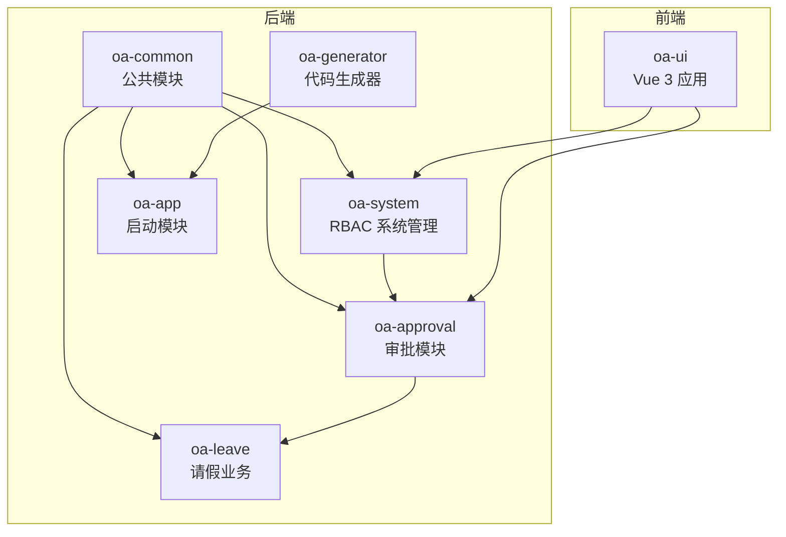
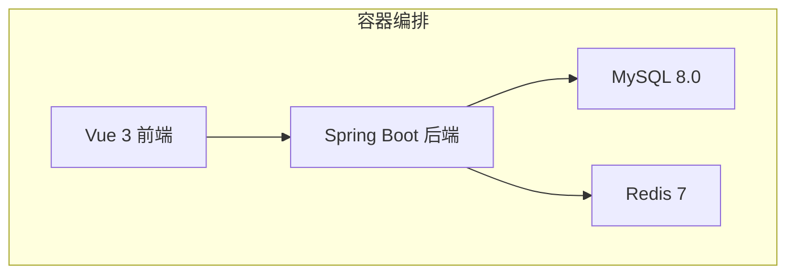
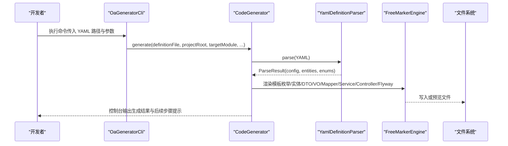
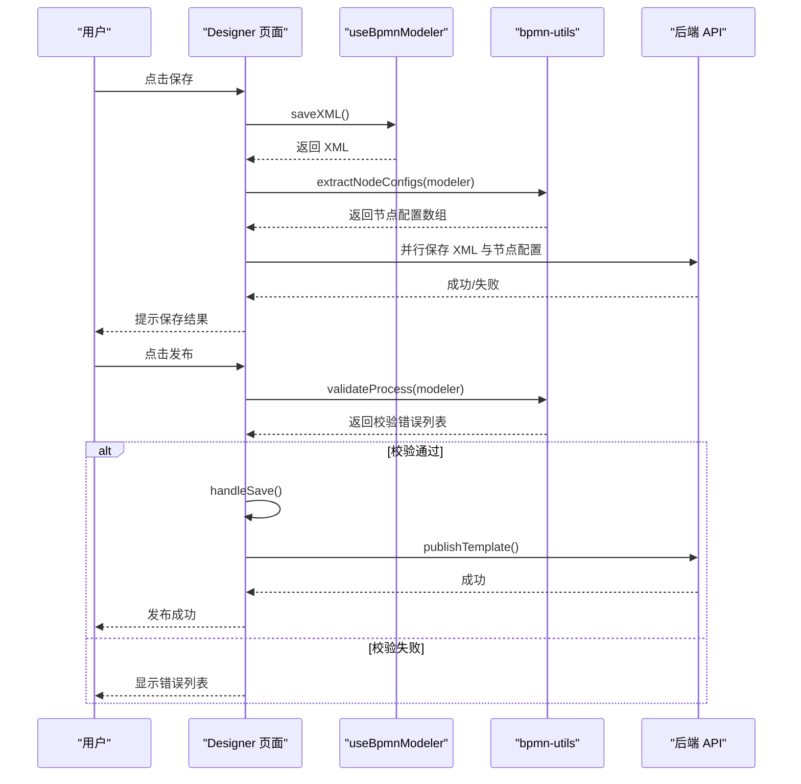
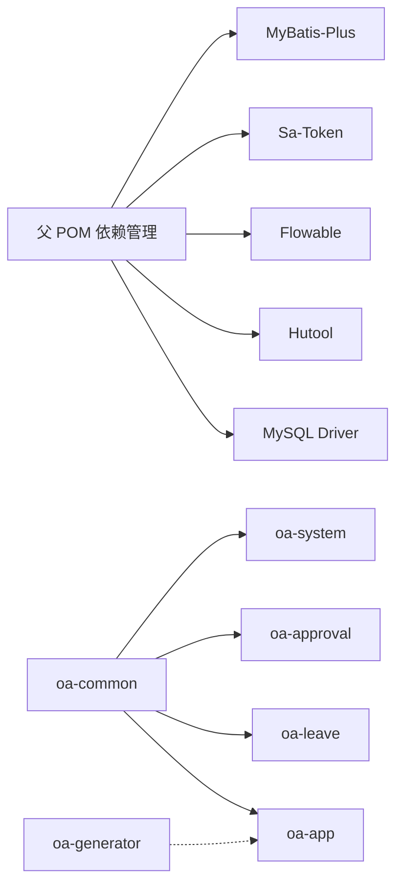

# 开发工具

<cite>
**本文引用的文件**
- [README.md](file://README.md)
- [pom.xml](file://pom.xml)
- [docker-compose.yml](file://docker-compose.yml)
- [oa-generator/src/main/java/com/oa/admin/generator/OaGeneratorCli.java](file://oa-generator/src/main/java/com/oa/admin/generator/OaGeneratorCli.java)
- [oa-generator/src/main/java/com/oa/admin/generator/engine/CodeGenerator.java](file://oa-generator/src/main/java/com/oa/admin/generator/engine/CodeGenerator.java)
- [oa-generator/src/main/java/com/oa/admin/generator/parser/YamlDefinitionParser.java](file://oa-generator/src/main/java/com/oa/admin/generator/parser/YamlDefinitionParser.java)
- [oa-generator/src/main/java/com/oa/admin/generator/model/EntityDefinition.java](file://oa-generator/src/main/java/com/oa/admin/generator/model/EntityDefinition.java)
- [oa-generator/src/main/java/com/oa/admin/generator/config/GeneratorConfig.java](file://oa-generator/src/main/java/com/oa/admin/generator/config/GeneratorConfig.java)
- [generators/leave-request.yaml](file://generators/leave-request.yaml)
- [oa-generator/src/main/resources/templates/controller.ftl](file://oa-generator/src/main/resources/templates/controller.ftl)
- [oa-generator/src/main/resources/templates/flyway.ftl](file://oa-generator/src/main/resources/templates/flyway.ftl)
- [oa-generator/src/main/resources/templates/vue/list.vue.ftl](file://oa-generator/src/main/resources/templates/vue/list.vue.ftl)
- [oa-generator/src/test/java/com/oa/admin/generator/engine/CodeGeneratorCrudStackTest.java](file://oa-generator/src/test/java/com/oa/admin/generator/engine/CodeGeneratorCrudStackTest.java)
- [oa-ui/src/views/approval/template/designer/index.vue](file://oa-ui/src/views/approval/template/designer/index.vue)
- [oa-ui/src/composables/bpmn/useBpmnModeler.ts](file://oa-ui/src/composables/bpmn/useBpmnModeler.ts)
- [oa-ui/src/bpmn/bpmn-utils.ts](file://oa-ui/src/bpmn/bpmn-utils.ts)
- [oa-ui/package.json](file://oa-ui/package.json)
</cite>

## 目录
1. [简介](#简介)
2. [项目结构](#项目结构)
3. [核心组件](#核心组件)
4. [架构总览](#架构总览)
5. [详细组件分析](#详细组件分析)
6. [依赖分析](#依赖分析)
7. [性能考虑](#性能考虑)
8. [故障排查指南](#故障排查指南)
9. [结论](#结论)
10. [附录](#附录)

## 简介
本指南面向 OA 审批管理系统的开发者，聚焦以下目标：
- 代码生成器：YAML DSL 定义语法、CLI 命令参数、模板与输出产物说明
- 流程设计器：操作指南、设计规范与前端实现要点
- 开发环境配置与调试：本地与容器化启动、IDE 推荐与调试技巧
- 质量保障：代码规范检查、单元测试与集成测试实践
- IDE 配置与效率工具：插件与工作流优化
- 性能分析与调试：后端与前端调试工具与方法
- 持续集成与自动化部署：配置思路与落地建议
- 最佳实践：高效开发工作流与质量保障策略

## 项目结构
该工程采用多模块 Maven 架构，包含公共模块、系统管理、审批、业务模块、启动模块与代码生成器模块；前端采用 Vue 3 + Vite；后端基于 Spring Boot 3 + Flowable。

图表来源
- [pom.xml:21-28](file://pom.xml#L21-L28)
- [README.md:48-61](file://README.md#L48-L61)

章节来源
- [README.md:48-61](file://README.md#L48-L61)
- [pom.xml:21-28](file://pom.xml#L21-L28)

## 核心组件
- 代码生成器（oa-generator）：以 YAML DSL 描述实体与枚举，自动生成后端 CRUD 代码与 Flyway 迁移脚本，并可选生成前端页面骨架。
- 流程设计器（oa-ui）：基于 bpmn-js 的可视化流程设计界面，支持保存、发布、自动保存、XML 预览、节点配置提取与流程校验。
- 审批模块（oa-approval）：集成 Flowable，提供审批模板、实例、任务、抄送、审计日志等能力。
- 系统模块（oa-system）：RBAC 权限体系（用户/角色/权限/部门），配合 Sa-Token 实现接口级鉴权。
- 启动模块（oa-app）：整合 Flyway 迁移、Flowable 配置与应用入口。

章节来源
- [README.md:137-222](file://README.md#L137-L222)
- [pom.xml:44-113](file://pom.xml#L44-L113)

## 架构总览
后端通过 Spring Boot 启动，使用 MyBatis-Plus、Sa-Token、Flowable、Flyway 等技术栈；前端通过 Vite 构建，使用 Element Plus、Pinia、Vue Router；Docker Compose 提供一键部署。

图表来源
- [docker-compose.yml:1-66](file://docker-compose.yml#L1-L66)

章节来源
- [docker-compose.yml:1-66](file://docker-compose.yml#L1-L66)
- [README.md:118-129](file://README.md#L118-L129)

## 详细组件分析

### 代码生成器（YAML DSL 与 CLI）
- YAML DSL 语法要点
  - global：模块名、表前缀、作者、基础包名
  - enums：枚举定义，含类型与值集合（code/label）
  - entities：实体定义，含表名、注释、字段列表（名称、类型、SQL 类型、是否可空、默认值、注释、是否可搜索、枚举引用、JSON 格式）、索引列表
- CLI 命令参数
  - 必填：定义文件路径
  - 可选：项目根目录、目标模块（默认 oa-app）、仅预览、仅生成 Flyway、生成前端、按实体过滤
- 输出产物
  - 后端：枚举类、实体、DTO（创建/更新/查询）、VO、Mapper、Service、ServiceImpl、Controller、Flyway SQL
  - 前端：列表页、表单对话框、API 封装、路由片段（需手动加入主路由）

图表来源
- [oa-generator/src/main/java/com/oa/admin/generator/OaGeneratorCli.java:52-70](file://oa-generator/src/main/java/com/oa/admin/generator/OaGeneratorCli.java#L52-L70)
- [oa-generator/src/main/java/com/oa/admin/generator/engine/CodeGenerator.java:27-63](file://oa-generator/src/main/java/com/oa/admin/generator/engine/CodeGenerator.java#L27-L63)
- [oa-generator/src/main/java/com/oa/admin/generator/parser/YamlDefinitionParser.java:34-49](file://oa-generator/src/main/java/com/oa/admin/generator/parser/YamlDefinitionParser.java#L34-L49)

章节来源
- [README.md:141-222](file://README.md#L141-L222)
- [generators/leave-request.yaml:1-74](file://generators/leave-request.yaml#L1-L74)
- [oa-generator/src/main/java/com/oa/admin/generator/OaGeneratorCli.java:21-49](file://oa-generator/src/main/java/com/oa/admin/generator/OaGeneratorCli.java#L21-L49)
- [oa-generator/src/main/java/com/oa/admin/generator/engine/CodeGenerator.java:27-63](file://oa-generator/src/main/java/com/oa/admin/generator/engine/CodeGenerator.java#L27-L63)
- [oa-generator/src/main/java/com/oa/admin/generator/parser/YamlDefinitionParser.java:40-49](file://oa-generator/src/main/java/com/oa/admin/generator/parser/YamlDefinitionParser.java#L40-L49)

#### YAML DSL 字段与类型映射
- 字段类型支持：String、Integer、Long、BigDecimal、Boolean、LocalDate、LocalDateTime、Text
- 字段属性：name、type、sqlType、nullable、defaultValue、comment、searchable、enum、jsonFormat、column
- 表名推导：若未显式指定，使用全局表前缀 + 实体名转下划线
- 列名推导：若未显式指定，使用字段名转下划线

章节来源
- [README.md:213-216](file://README.md#L213-L216)
- [oa-generator/src/main/java/com/oa/admin/generator/parser/YamlDefinitionParser.java:127-133](file://oa-generator/src/main/java/com/oa/admin/generator/parser/YamlDefinitionParser.java#L127-L133)
- [oa-generator/src/main/java/com/oa/admin/generator/parser/YamlDefinitionParser.java:161-166](file://oa-generator/src/main/java/com/oa/admin/generator/parser/YamlDefinitionParser.java#L161-L166)

#### 生成器模板与产物
- 控制器模板：统一 RESTful 接口、分页返回、权限注解、资源路径由实体名推导
- Flyway 模板：按实体生成建表语句与索引，包含通用字段 created_at/updated_at/deleted
- 前端模板：列表页、表单对话框、API 封装、路由片段（需手动合并到主路由）

章节来源
- [oa-generator/src/main/resources/templates/controller.ftl:14-56](file://oa-generator/src/main/resources/templates/controller.ftl#L14-L56)
- [oa-generator/src/main/resources/templates/flyway.ftl:1-21](file://oa-generator/src/main/resources/templates/flyway.ftl#L1-L21)
- [oa-generator/src/main/resources/templates/vue/list.vue.ftl:1-144](file://oa-generator/src/main/resources/templates/vue/list.vue.ftl#L1-L144)

### 流程设计器（前端 BPMN 设计）
- 主要功能
  - 工具栏：保存、发布、撤销/重做、缩放、XML 预览、新建版本、返回
  - 画布：BPMN 图形渲染与编辑
  - 属性面板：元素属性配置（只读状态随模板发布状态变化）
  - 自动保存：定时保存未发布且脏数据
  - 发布校验：流程完整性校验（开始/结束事件、连线数量、网关分支数）
- 关键实现
  - useBpmnModeler：封装 bpmn-js Modeler/Viewer，提供导入/导出 XML、创建空白图、缩放等
  - bpmn-utils：提取节点配置、流程校验、注入监听器、生成默认 XML
  - 设计器页面：加载模板、保存/发布、版本管理、离开确认

图表来源
- [oa-ui/src/views/approval/template/designer/index.vue:157-216](file://oa-ui/src/views/approval/template/designer/index.vue#L157-L216)
- [oa-ui/src/composables/bpmn/useBpmnModeler.ts:40-50](file://oa-ui/src/composables/bpmn/useBpmnModeler.ts#L40-L50)
- [oa-ui/src/bpmn/bpmn-utils.ts:56-94](file://oa-ui/src/bpmn/bpmn-utils.ts#L56-L94)
- [oa-ui/src/bpmn/bpmn-utils.ts:132-215](file://oa-ui/src/bpmn/bpmn-utils.ts#L132-L215)

章节来源
- [oa-ui/src/views/approval/template/designer/index.vue:1-324](file://oa-ui/src/views/approval/template/designer/index.vue#L1-L324)
- [oa-ui/src/composables/bpmn/useBpmnModeler.ts:1-98](file://oa-ui/src/composables/bpmn/useBpmnModeler.ts#L1-L98)
- [oa-ui/src/bpmn/bpmn-utils.ts:1-231](file://oa-ui/src/bpmn/bpmn-utils.ts#L1-L231)

### 测试与质量保障
- 单元测试
  - 代码生成器 CRUD 堆栈测试：验证 DTO/VO、控制器、Service、Service 实现生成是否包含枚举引用与分页逻辑
- 集成测试
  - 审批模块集成测试：网关与流程相关场景
- 前端测试
  - Vitest：运行测试、监听模式、覆盖率

章节来源
- [oa-generator/src/test/java/com/oa/admin/generator/engine/CodeGeneratorCrudStackTest.java:20-73](file://oa-generator/src/test/java/com/oa/admin/generator/engine/CodeGeneratorCrudStackTest.java#L20-L73)
- [oa-ui/package.json:10-13](file://oa-ui/package.json#L10-L13)

## 依赖分析
- 依赖管理
  - MyBatis-Plus、Sa-Token、Flowable、Hutool、MySQL Connector/J 等版本在父 POM 中集中管理
- 模块依赖
  - 公共模块被系统、审批、业务模块复用；启动模块聚合 Flyway 与配置；生成器独立模块

图表来源
- [pom.xml:44-113](file://pom.xml#L44-L113)
- [pom.xml:21-28](file://pom.xml#L21-L28)

章节来源
- [pom.xml:44-113](file://pom.xml#L44-L113)
- [pom.xml:21-28](file://pom.xml#L21-L28)

## 性能考虑
- 后端
  - 使用 MyBatis-Plus LambdaQueryWrapper 进行条件查询与分页，避免 N+1 查询
  - Flowable 引擎配置与任务监听器按需启用，减少不必要的事件开销
- 前端
  - 列表页按需渲染列宽与控件类型，减少 DOM 重绘
  - 使用自动保存降低频繁网络请求，但注意控制保存频率与并发
- 数据库
  - Flyway 迁移脚本中为高频查询字段建立索引，避免全表扫描

[本节为通用指导，无需特定文件来源]

## 故障排查指南
- 代码生成器
  - YAML 类型非法：确保字段类型在支持列表内
  - 枚举引用未定义：实体字段引用的枚举必须在 enums 中声明
  - Flyway 版本冲突：生成器会根据现有迁移脚本计算下一个版本号，确保命名规范一致
- 流程设计器
  - 导入失败：检查 BPMN XML 是否完整、是否包含必需元素（开始/结束事件）
  - 发布失败：先执行保存，再进行发布；发布前确保流程校验通过
- 环境问题
  - Docker 服务未启动：确认 MySQL/Redis/前后端容器健康状态
  - 端口占用：调整 docker-compose 映射端口或释放占用端口

章节来源
- [oa-generator/src/main/java/com/oa/admin/generator/parser/YamlDefinitionParser.java:168-174](file://oa-generator/src/main/java/com/oa/admin/generator/parser/YamlDefinitionParser.java#L168-L174)
- [oa-generator/src/main/java/com/oa/admin/generator/parser/YamlDefinitionParser.java:192-202](file://oa-generator/src/main/java/com/oa/admin/generator/parser/YamlDefinitionParser.java#L192-L202)
- [docker-compose.yml:16-20](file://docker-compose.yml#L16-L20)
- [docker-compose.yml:49-51](file://docker-compose.yml#L49-L51)

## 结论
本指南提供了 OA 审批管理系统开发工具的完整使用说明：从 YAML DSL 定义到后端代码与前端页面的自动生成，从流程设计器的使用到开发环境与测试实践，再到性能与部署建议。遵循本文档可显著提升开发效率与代码质量。

[本节为总结性内容，无需特定文件来源]

## 附录

### 开发环境配置与调试
- 前置依赖
  - Java 21+、Node.js 18+、Docker + Docker Compose
- 一键启动
  - 运行初始化脚本，使用 docker compose 启动全部服务
- 调试技巧
  - 后端：通过 IDE 启动 oa-app 模块，设置断点于 Controller/Service 层
  - 前端：Vite 开发服务器热更新，结合浏览器开发者工具定位问题
  - 数据库：通过 MySQL 容器访问，查看 Flyway 迁移与业务表状态

章节来源
- [README.md:20-46](file://README.md#L20-L46)
- [docker-compose.yml:1-66](file://docker-compose.yml#L1-L66)

### IDE 配置与插件推荐
- Java
  - Lombok 注解支持、Spring Boot 插件、Maven 视图
- TypeScript/Vue
  - Vue Language Features、ESLint 插件、Volar
- Git
  - 提交前执行 ESLint、单元测试与覆盖率检查

[本节为通用指导，无需特定文件来源]

### 代码规范检查与测试
- 后端
  - 使用 Maven 编译插件，确保源码兼容 Java 17
- 前端
  - ESLint 脚本：npm run lint
  - 单测：npm run test / test:watch / test:coverage
- 生成器测试
  - 单元测试验证 DTO/VO、控制器、Service 生成内容

章节来源
- [pom.xml:115-129](file://pom.xml#L115-L129)
- [oa-ui/package.json:10-13](file://oa-ui/package.json#L10-L13)
- [oa-generator/src/test/java/com/oa/admin/generator/engine/CodeGeneratorCrudStackTest.java:20-73](file://oa-generator/src/test/java/com/oa/admin/generator/engine/CodeGeneratorCrudStackTest.java#L20-L73)

### 性能分析与调试工具
- 后端
  - Spring Boot Actuator（如启用）用于监控与指标导出
  - Flowable 管理界面查看流程实例与任务状态
- 前端
  - Vue DevTools、浏览器性能面板分析渲染与网络请求
  - Vite 构建产物分析（bundle visualizer）

[本节为通用指导，无需特定文件来源]

### 持续集成与自动化部署
- CI/CD 建议
  - Maven 构建与测试：mvn clean verify
  - 前端构建与测试：npm run build / npm run test:coverage
  - Docker 镜像构建：分别构建后端与前端镜像，Compose 运行
- 部署
  - 使用 docker-compose.yml 部署至生产环境，配置环境变量覆盖数据库与缓存地址

章节来源
- [docker-compose.yml:1-66](file://docker-compose.yml#L1-L66)
- [README.md:118-129](file://README.md#L118-L129)

### 最佳实践
- 使用 YAML DSL 驱动的代码生成器，保持数据模型与后端代码一致性
- 流程设计遵循“单一职责”与“清晰分支”，发布前务必校验
- 前端页面与路由按模块化组织，生成器输出作为起点，手动补充业务细节
- 严格遵守分层架构：Controller -> Service -> Mapper -> Entity/DTO/VO
- 使用 Flyway 进行数据库演进管理，确保迁移脚本可重复执行

[本节为通用指导，无需特定文件来源]