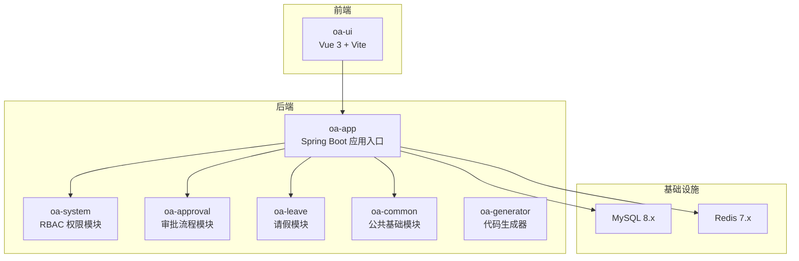
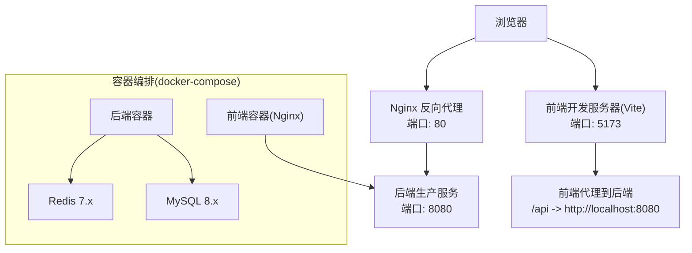
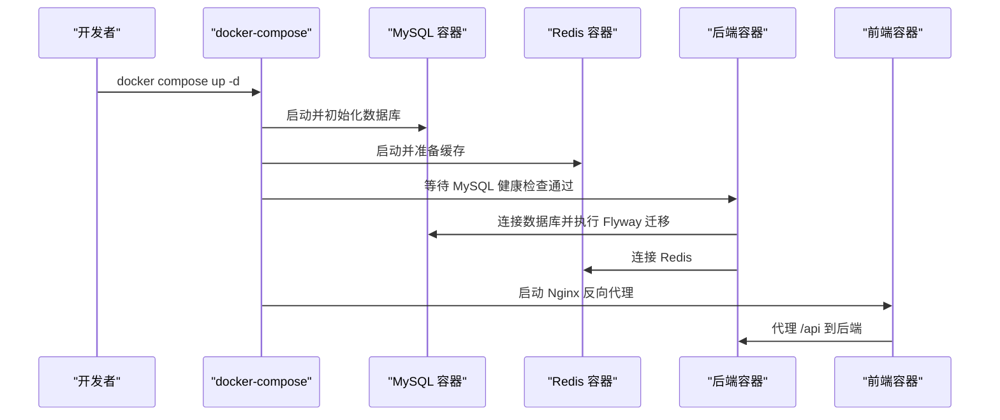
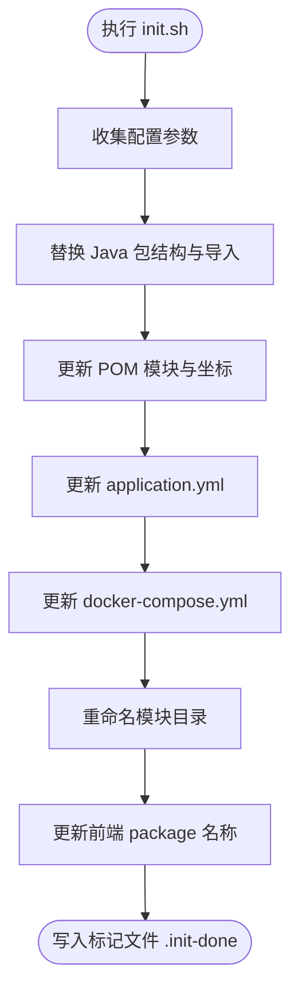
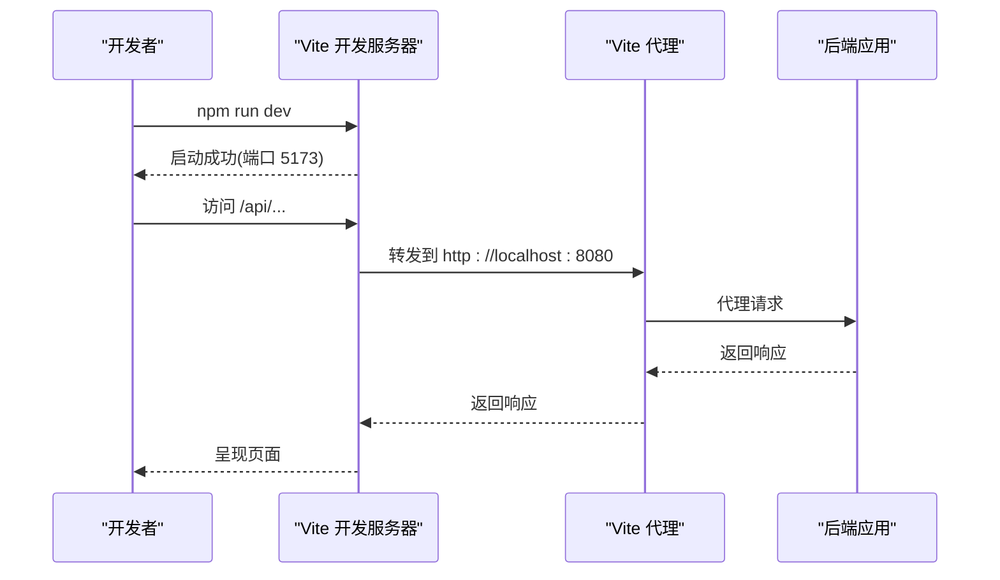
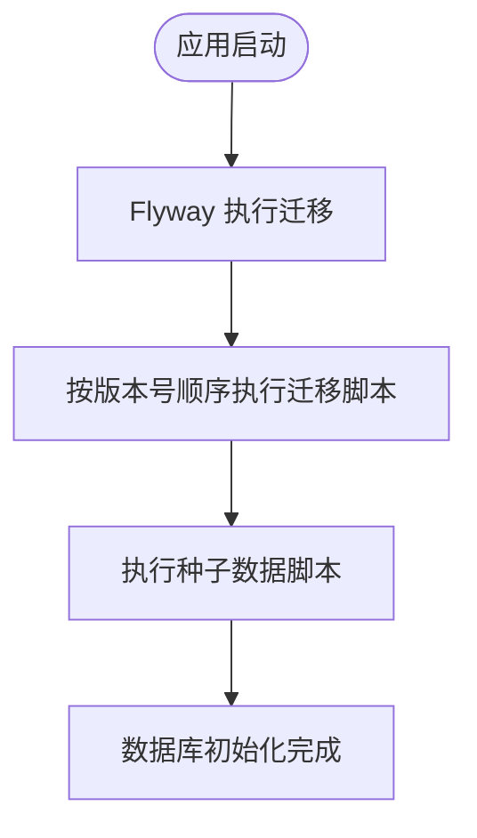
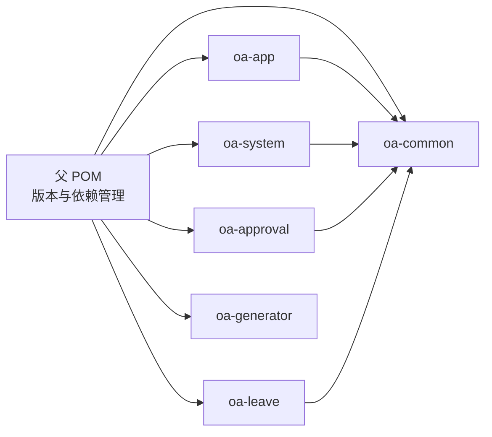

# 开发环境配置

<cite>
**本文档引用的文件**
- [README.md](file://README.md)
- [pom.xml](file://pom.xml)
- [docker-compose.yml](file://docker-compose.yml)
- [Dockerfile](file://Dockerfile)
- [init.sh](file://init.sh)
- [application.yml](file://oa-app/src/main/resources/application.yml)
- [OaAdminApplication.java](file://oa-app/src/main/java/com/oa/admin/OaAdminApplication.java)
- [package.json](file://oa-ui/package.json)
- [vite.config.ts](file://oa-ui/vite.config.ts)
- [nginx.conf](file://oa-ui/nginx.conf)
- [V1__init_sys_tables.sql](file://oa-app/src/main/resources/db/migration/V1__init_sys_tables.sql)
- [V3__seed_data.sql](file://oa-app/src/main/resources/db/migration/V3__seed_data.sql)
- [SaTokenConfig.java](file://oa-system/src/main/java/com/oa/admin/system/config/SaTokenConfig.java)
- [FlowableConfig.java](file://oa-approval/src/main/java/com/oa/admin/approval/config/FlowableConfig.java)
- [MyBatisPlusAutoFillHandler.java](file://oa-common/src/main/java/com/oa/admin/common/config/MyBatisPlusAutoFillHandler.java)
- [tsconfig.json](file://oa-ui/tsconfig.json)
</cite>

## 目录
1. [简介](#简介)
2. [项目结构](#项目结构)
3. [核心组件](#核心组件)
4. [架构总览](#架构总览)
5. [详细组件分析](#详细组件分析)
6. [依赖关系分析](#依赖关系分析)
7. [性能考虑](#性能考虑)
8. [故障排除指南](#故障排除指南)
9. [结论](#结论)
10. [附录](#附录)

## 简介
本指南面向需要在本地搭建与开发 OA 审批管理平台的工程师，涵盖 JDK、Node.js、MySQL、Redis 等依赖的安装与配置；提供 Docker 一键部署的完整流程（镜像构建、容器启动、环境变量配置）；给出 IDE（IntelliJ IDEA、VS Code）配置建议与插件推荐；总结 Maven 与 npm 依赖管理最佳实践；说明开发服务器启动与调试配置、热重载与开发模式设置；提供数据库初始化与种子数据加载方法；最后包含常见环境问题排查与性能优化建议。

## 项目结构
该工程采用多模块 Maven 结构，包含后端公共模块、系统管理、审批流程、请假模块、应用启动模块以及代码生成器模块；前端使用 Vue 3 + TypeScript + Vite；通过 docker-compose 提供一键部署，包含 MySQL、Redis、后端与前端服务。

图表来源
- [pom.xml:21-28](file://pom.xml#L21-L28)
- [docker-compose.yml:1-66](file://docker-compose.yml#L1-L66)

章节来源
- [README.md:48-61](file://README.md#L48-L61)
- [pom.xml:21-28](file://pom.xml#L21-L28)

## 核心组件
- 后端技术栈：Spring Boot 3.5.x、MyBatis-Plus 3.5.x、Sa-Token 1.44.0、Flowable 7.2.0、Flyway 数据库迁移、MySQL 8.x、Redis 7.x
- 前端技术栈：Vue 3 + TypeScript + Vite 6.x、Element Plus、Pinia、bpmn-js
- 构建与打包：Maven 多模块聚合、Docker 多阶段构建、Nginx 静态资源服务

章节来源
- [README.md:5-19](file://README.md#L5-L19)
- [pom.xml:30-42](file://pom.xml#L30-L42)

## 架构总览
系统采用前后端分离架构，后端通过 Spring Boot 提供 RESTful API，前端通过 Vite 开发服务器提供热重载，生产环境由 Nginx 提供静态资源与反向代理。

图表来源
- [vite.config.ts:30-38](file://oa-ui/vite.config.ts#L30-L38)
- [nginx.conf:11-16](file://oa-ui/nginx.conf#L11-L16)
- [docker-compose.yml:31-61](file://docker-compose.yml#L31-L61)

## 详细组件分析

### 本地依赖安装与配置

- JDK 21+（或兼容 Java 17）
  - 设置 JAVA_HOME，确保 Maven 使用正确的 Java 版本
  - Maven 父 POM 中默认使用 Java 17，若使用 JDK 21，请根据实际环境调整

- Node.js 18+
  - 建议使用 nvm 管理 Node 版本，确保与项目要求一致

- MySQL 8.x
  - 初始化数据库与用户，确保字符集为 utf8mb4
  - 项目使用 Flyway 自动执行迁移脚本

- Redis 7.x
  - 用于会话缓存与状态存储，注意持久化配置

章节来源
- [README.md:22-27](file://README.md#L22-L27)
- [pom.xml:31-33](file://pom.xml#L31-L33)
- [application.yml:4-35](file://oa-app/src/main/resources/application.yml#L4-L35)

### Docker 一键部署

- 镜像构建
  - 后端：基于 maven:3.9-eclipse-temurin-17 构建，多模块打包到 oa-app 模块
  - 前端：基于 node:22-alpine 构建，使用 npm run build，运行时使用 nginx:alpine 提供静态服务

- 容器启动
  - 使用 docker-compose up -d 启动 MySQL、Redis、后端、前端
  - 端口映射：MySQL 13306:3306、Redis 16379:6379、后端 18080:8080、前端 180:80

- 环境变量配置
  - 后端支持通过环境变量覆盖数据库与 Redis 连接信息
  - 建议在宿主机设置 MYSQL_ROOT_PASSWORD、SPRING_DATASOURCE_PASSWORD 等变量

图表来源
- [docker-compose.yml:1-66](file://docker-compose.yml#L1-L66)
- [Dockerfile:1-22](file://Dockerfile#L1-L22)

章节来源
- [docker-compose.yml:1-66](file://docker-compose.yml#L1-L66)
- [Dockerfile:1-22](file://Dockerfile#L1-L22)
- [README.md:29-46](file://README.md#L29-L46)

### 项目初始化脚本 init.sh
- 交互式配置包名、端口、数据库名、密码、MySQL/Redis 端口
- 替换 Java 包结构与测试包结构中的旧包名
- 更新 POM 模块名与目录名、application.yml、docker-compose.yml
- 保持种子数据中的管理员密码不变（BCrypt 已加密）

图表来源
- [init.sh:96-222](file://init.sh#L96-L222)

章节来源
- [init.sh:1-238](file://init.sh#L1-L238)

### IDE 配置与插件推荐

- IntelliJ IDEA
  - 插件推荐：Lombok、MyBatis Log、Rainbow Brackets、String Manipulation、Statistic
  - Maven 项目直接导入，勾选“Use plugin registry”以启用自动插件发现
  - 设置 JDK 17 或 JDK 21，Maven 项目编码 UTF-8
  - 运行配置：为 OaAdminApplication 创建 Spring Boot 启动配置，设置 VM Options（如必要）

- VS Code
  - 插件推荐：ESLint、Vetur/Volar、TypeScript Importer、Bracket Pair Colorizer、Settings Sync
  - 前端工作区：打开根目录，使用内置终端执行 npm 脚本
  - 建议启用 EditorConfig、Prettier、TSLint（如需）

章节来源
- [pom.xml:115-129](file://pom.xml#L115-L129)
- [tsconfig.json:1-24](file://oa-ui/tsconfig.json#L1-L24)

### Maven 与 npm 依赖管理最佳实践

- Maven
  - 使用父 POM 的 dependencyManagement 锁定版本，避免子模块版本漂移
  - 优先使用 spring-boot-starter-parent 提供的插件配置
  - 构建时使用 -pl oa-app -am 仅构建应用模块，加速 CI/CD

- npm
  - 使用 package-lock.json 固定依赖版本
  - 开发时使用 npm run dev，构建时使用 npm run build
  - 测试使用 npm run test 与 npm run test:coverage

章节来源
- [pom.xml:44-113](file://pom.xml#L44-L113)
- [package.json:6-14](file://oa-ui/package.json#L6-L14)

### 开发服务器启动与调试

- 后端
  - 直接运行 OaAdminApplication.main() 启动 Spring Boot 应用
  - application.yml 支持通过环境变量覆盖数据库与 Redis 连接
  - Sa-Token 拦截器对 /api/v1/** 路径进行登录校验

- 前端
  - 使用 npm run dev 启动 Vite 开发服务器，默认端口 5173
  - 通过代理将 /api 请求转发至后端 8080 端口
  - 生产构建使用 npm run build，使用 Nginx 提供静态服务

图表来源
- [vite.config.ts:30-38](file://oa-ui/vite.config.ts#L30-L38)
- [SaTokenConfig.java:16-23](file://oa-system/src/main/java/com/oa/admin/system/config/SaTokenConfig.java#L16-L23)

章节来源
- [OaAdminApplication.java:11-18](file://oa-app/src/main/java/com/oa/admin/OaAdminApplication.java#L11-L18)
- [application.yml:45-54](file://oa-app/src/main/resources/application.yml#L45-L54)
- [vite.config.ts:30-38](file://oa-ui/vite.config.ts#L30-L38)

### 热重载与开发模式

- 前端热重载
  - Vite 默认开启文件监听与热更新，修改源码后浏览器自动刷新
  - 代理配置确保 API 请求转发到后端

- 后端热重载
  - Spring Boot DevTools（可选）可实现类变更热重启
  - 建议在开发环境中启用日志输出与断点调试

章节来源
- [vite.config.ts:1-40](file://oa-ui/vite.config.ts#L1-L40)

### 数据库初始化与种子数据

- Flyway 迁移
  - 启动时自动执行 classpath:db/migration 下的 SQL 脚本
  - 基线迁移启用，占位符替换关闭

- 种子数据
  - V3__seed_data.sql 初始化管理员用户、部门、角色与权限
  - 审批模板示例（请假审批）插入到 biz_process_template

图表来源
- [application.yml:25-29](file://oa-app/src/main/resources/application.yml#L25-L29)
- [V1__init_sys_tables.sql:1-84](file://oa-app/src/main/resources/db/migration/V1__init_sys_tables.sql#L1-L84)
- [V3__seed_data.sql:1-90](file://oa-app/src/main/resources/db/migration/V3__seed_data.sql#L1-L90)

章节来源
- [application.yml:25-29](file://oa-app/src/main/resources/application.yml#L25-L29)
- [V1__init_sys_tables.sql:1-84](file://oa-app/src/main/resources/db/migration/V1__init_sys_tables.sql#L1-L84)
- [V3__seed_data.sql:1-90](file://oa-app/src/main/resources/db/migration/V3__seed_data.sql#L1-L90)

### 安全与权限配置

- Sa-Token
  - 全局拦截器对 /api/v1/** 路径进行登录校验
  - 例外路径包含登录与注册接口
  - Token 名称为 satoken，超时与并发策略按配置设定

- Flowable
  - Spring Boot Starter 自动装配流程引擎
  - 注册自定义事件监听器（如流程结束事件）

- MyBatis-Plus 自动填充
  - 自动填充创建时间与更新时间字段

章节来源
- [SaTokenConfig.java:16-23](file://oa-system/src/main/java/com/oa/admin/system/config/SaTokenConfig.java#L16-L23)
- [FlowableConfig.java:20-29](file://oa-approval/src/main/java/com/oa/admin/approval/config/FlowableConfig.java#L20-L29)
- [MyBatisPlusAutoFillHandler.java:14-23](file://oa-common/src/main/java/com/oa/admin/common/config/MyBatisPlusAutoFillHandler.java#L14-L23)

## 依赖关系分析

图表来源
- [pom.xml:21-28](file://pom.xml#L21-L28)

章节来源
- [pom.xml:21-28](file://pom.xml#L21-L28)

## 性能考虑
- 数据库连接池
  - HikariCP 连接池参数可调：最大池大小、最小空闲、连接超时、空闲超时、最大生存时间
  - 建议根据并发与硬件资源调整，避免连接泄漏检测阈值过小导致误报

- 缓存与会话
  - Redis 作为 Sa-Token 会话存储，建议开启持久化与合理内存上限
  - 生产环境建议使用集群与哨兵模式

- 前端构建
  - 生产构建开启压缩与 Tree Shaking，减少包体积
  - 使用 CDN 加速静态资源（可选）

- 后端优化
  - 启用必要的日志级别，避免生产环境过多 DEBUG 日志
  - 合理设置 JVM 参数与 GC 策略

章节来源
- [application.yml:10-24](file://oa-app/src/main/resources/application.yml#L10-L24)
- [README.md:118-129](file://README.md#L118-L129)

## 故障排除指南

- 启动失败：数据库连接异常
  - 检查 SPRING_DATASOURCE_URL、用户名、密码是否正确
  - 确认 MySQL 容器健康状态与端口映射

- 启动失败：Redis 连接异常
  - 检查 SPRING_DATA_REDIS_HOST 与 PORT 是否匹配
  - 确认 Redis 容器已启动且无权限问题

- 前端无法访问后端 API
  - 检查 Vite 代理配置是否指向后端 8080 端口
  - 确认防火墙与端口映射未阻断

- Flyway 迁移失败
  - 查看迁移脚本语法与表结构是否冲突
  - 确认 Flyway locations 配置正确

- 管理员登录失败
  - 默认密码为 BCrypt 哈希后的 admin123，首次登录请修改密码
  - 检查 Sa-Token 配置与拦截器是否生效

章节来源
- [docker-compose.yml:42-48](file://docker-compose.yml#L42-L48)
- [application.yml:4-35](file://oa-app/src/main/resources/application.yml#L4-L35)
- [vite.config.ts:30-38](file://oa-ui/vite.config.ts#L30-L38)
- [V3__seed_data.sql:5-7](file://oa-app/src/main/resources/db/migration/V3__seed_data.sql#L5-L7)
- [SaTokenConfig.java:16-23](file://oa-system/src/main/java/com/oa/admin/system/config/SaTokenConfig.java#L16-L23)

## 结论
通过本指南，您可以在本地快速搭建并运行 OA 审批管理平台。推荐优先使用 Docker 一键部署以减少环境差异带来的问题；在开发阶段结合 Vite 热重载与 Spring Boot 调试能力提升效率；生产部署时关注数据库连接池、Redis 缓存与前端静态资源优化。遇到问题时，可依据故障排除指南逐项排查。

## 附录

### 环境变量一览
- SPRING_DATASOURCE_URL：数据库连接 URL
- SPRING_DATASOURCE_USERNAME：数据库用户名
- SPRING_DATASOURCE_PASSWORD：数据库密码
- SPRING_DATA_REDIS_HOST：Redis 主机地址
- SPRING_DATA_REDIS_PORT：Redis 端口

章节来源
- [README.md:118-129](file://README.md#L118-L129)
- [application.yml:4-35](file://oa-app/src/main/resources/application.yml#L4-L35)