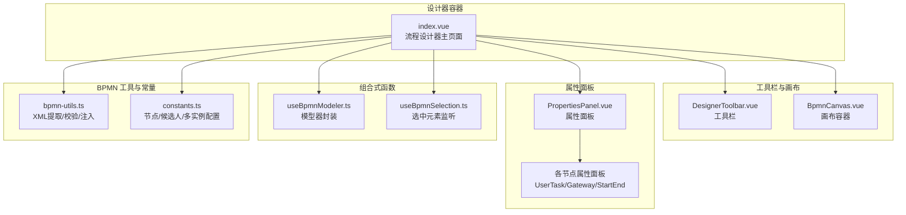
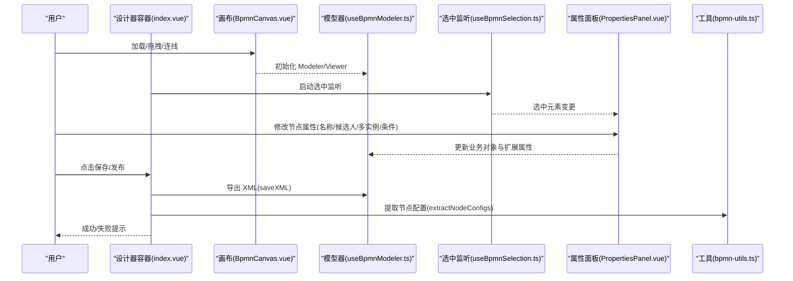
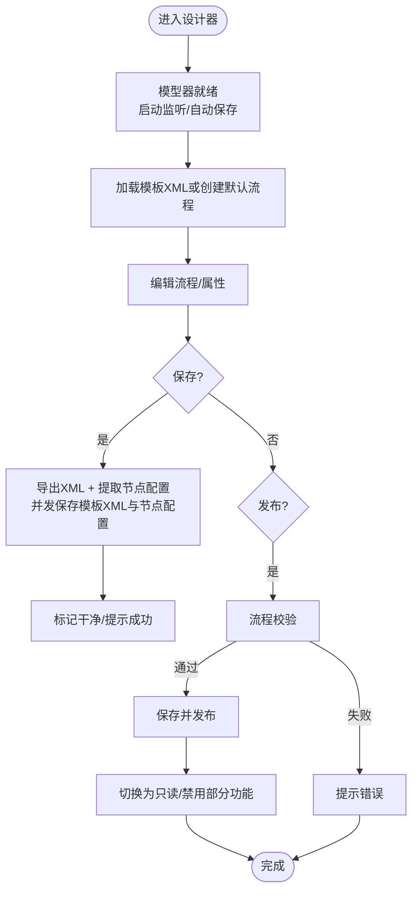
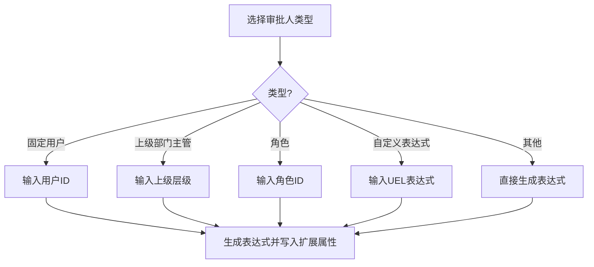
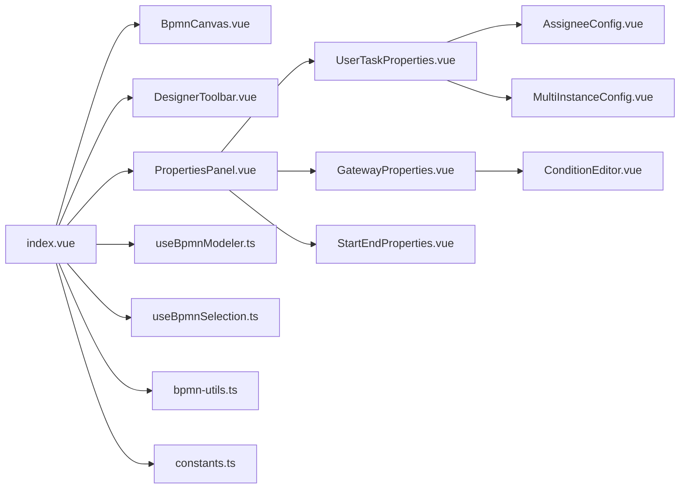

# 流程设计器

<cite>
**本文引用的文件**
- [README.md](file://README.md)
- [index.vue](file://oa-ui/src/views/approval/template/designer/index.vue)
- [DesignerToolbar.vue](file://oa-ui/src/views/approval/template/designer/components/DesignerToolbar.vue)
- [BpmnCanvas.vue](file://oa-ui/src/views/approval/template/designer/components/BpmnCanvas.vue)
- [PropertiesPanel.vue](file://oa-ui/src/views/approval/template/designer/components/PropertiesPanel.vue)
- [UserTaskProperties.vue](file://oa-ui/src/views/approval/template/designer/components/panels/UserTaskProperties.vue)
- [GatewayProperties.vue](file://oa-ui/src/views/approval/template/designer/components/panels/GatewayProperties.vue)
- [AssigneeConfig.vue](file://oa-ui/src/views/approval/template/designer/components/panels/AssigneeConfig.vue)
- [MultiInstanceConfig.vue](file://oa-ui/src/views/approval/template/designer/components/panels/MultiInstanceConfig.vue)
- [ConditionEditor.vue](file://oa-ui/src/views/approval/template/designer/components/panels/ConditionEditor.vue)
- [StartEndProperties.vue](file://oa-ui/src/views/approval/template/designer/components/panels/StartEndProperties.vue)
- [useBpmnModeler.ts](file://oa-ui/src/composables/bpmn/useBpmnModeler.ts)
- [useBpmnSelection.ts](file://oa-ui/src/composables/bpmn/useBpmnSelection.ts)
- [bpmn-utils.ts](file://oa-ui/src/bpmn/bpmn-utils.ts)
- [constants.ts](file://oa-ui/src/bpmn/constants.ts)
</cite>

## 目录
1. [简介](#简介)
2. [项目结构](#项目结构)
3. [核心组件](#核心组件)
4. [架构总览](#架构总览)
5. [详细组件分析](#详细组件分析)
6. [依赖关系分析](#依赖关系分析)
7. [性能与可用性](#性能与可用性)
8. [故障排查指南](#故障排查指南)
9. [结论](#结论)
10. [附录：设计步骤与最佳实践](#附录设计步骤与最佳实践)

## 简介
本指南面向审批流程设计人员与前端使用者，系统讲解基于 BPMN 的流程设计器，涵盖 BPMN 基础概念（节点、连接线、网关）、设计器界面布局与工具栏功能、画布操作、属性面板与节点配置、从创建到保存发布的完整流程、节点配置项（用户任务、服务任务、并行/排他网关等）、条件表达式与候选人配置、以及最佳实践与常见问题排查。

## 项目结构
设计器位于前端模块中，采用 Vue 3 + TypeScript + bpmn-js 构建，核心由“设计器容器 + 画布 + 工具栏 + 属性面板 + 多个节点属性面板”组成，并通过组合式函数封装对 bpmn-js 的调用。

图示来源
- [index.vue:1-324](file://oa-ui/src/views/approval/template/designer/index.vue#L1-L324)
- [DesignerToolbar.vue:1-132](file://oa-ui/src/views/approval/template/designer/components/DesignerToolbar.vue#L1-L132)
- [BpmnCanvas.vue:1-107](file://oa-ui/src/views/approval/template/designer/components/BpmnCanvas.vue#L1-L107)
- [PropertiesPanel.vue:1-80](file://oa-ui/src/views/approval/template/designer/components/PropertiesPanel.vue#L1-L80)
- [UserTaskProperties.vue:1-50](file://oa-ui/src/views/approval/template/designer/components/panels/UserTaskProperties.vue#L1-L50)
- [GatewayProperties.vue:1-98](file://oa-ui/src/views/approval/template/designer/components/panels/GatewayProperties.vue#L1-L98)
- [AssigneeConfig.vue:1-172](file://oa-ui/src/views/approval/template/designer/components/panels/AssigneeConfig.vue#L1-L172)
- [MultiInstanceConfig.vue:1-175](file://oa-ui/src/views/approval/template/designer/components/panels/MultiInstanceConfig.vue#L1-L175)
- [ConditionEditor.vue:1-143](file://oa-ui/src/views/approval/template/designer/components/panels/ConditionEditor.vue#L1-L143)
- [StartEndProperties.vue:1-31](file://oa-ui/src/views/approval/template/designer/components/panels/StartEndProperties.vue#L1-L31)
- [useBpmnModeler.ts:1-98](file://oa-ui/src/composables/bpmn/useBpmnModeler.ts#L1-L98)
- [useBpmnSelection.ts:1-39](file://oa-ui/src/composables/bpmn/useBpmnSelection.ts#L1-L39)
- [bpmn-utils.ts:1-231](file://oa-ui/src/bpmn/bpmn-utils.ts#L1-L231)
- [constants.ts:1-95](file://oa-ui/src/bpmn/constants.ts#L1-L95)

章节来源
- [README.md:48-61](file://README.md#L48-L61)
- [index.vue:1-324](file://oa-ui/src/views/approval/template/designer/index.vue#L1-L324)

## 核心组件
- 设计器容器：负责加载模板、导入/导出 XML、保存节点配置、发布流程、撤销/重做、缩放、自动保存、离开确认等。
- 画布容器：根据是否只读选择 Viewer 或 Modeler，挂载 bpmn-js，响应容器尺寸变化。
- 工具栏：提供返回、撤销/重做、缩放、XML 预览、保存/发布、新建版本等操作。
- 属性面板：根据选中元素类型动态渲染对应面板（开始/结束、用户任务、网关）。
- 节点属性面板：
  - 用户任务：审批人配置（多种类型）、多实例配置（普通/会签/或签）。
  - 网关：条件分支编辑（基于模板表单字段生成下拉）。
  - 开始/结束：基础名称配置。
- 组合式函数：封装模型器生命周期、导入/保存 XML、创建默认流程；封装选中元素监听。
- 工具与常量：节点类型映射、候选人类型与表达式模板、多实例类型、流程校验、XML 注入监听器、默认 XML 生成。

章节来源
- [index.vue:52-324](file://oa-ui/src/views/approval/template/designer/index.vue#L52-L324)
- [DesignerToolbar.vue:1-132](file://oa-ui/src/views/approval/template/designer/components/DesignerToolbar.vue#L1-L132)
- [BpmnCanvas.vue:1-107](file://oa-ui/src/views/approval/template/designer/components/BpmnCanvas.vue#L1-L107)
- [PropertiesPanel.vue:1-80](file://oa-ui/src/views/approval/template/designer/components/PropertiesPanel.vue#L1-L80)
- [UserTaskProperties.vue:1-50](file://oa-ui/src/views/approval/template/designer/components/panels/UserTaskProperties.vue#L1-L50)
- [GatewayProperties.vue:1-98](file://oa-ui/src/views/approval/template/designer/components/panels/GatewayProperties.vue#L1-L98)
- [AssigneeConfig.vue:1-172](file://oa-ui/src/views/approval/template/designer/components/panels/AssigneeConfig.vue#L1-L172)
- [MultiInstanceConfig.vue:1-175](file://oa-ui/src/views/approval/template/designer/components/panels/MultiInstanceConfig.vue#L1-L175)
- [ConditionEditor.vue:1-143](file://oa-ui/src/views/approval/template/designer/components/panels/ConditionEditor.vue#L1-L143)
- [StartEndProperties.vue:1-31](file://oa-ui/src/views/approval/template/designer/components/panels/StartEndProperties.vue#L1-L31)
- [useBpmnModeler.ts:1-98](file://oa-ui/src/composables/bpmn/useBpmnModeler.ts#L1-L98)
- [useBpmnSelection.ts:1-39](file://oa-ui/src/composables/bpmn/useBpmnSelection.ts#L1-L39)
- [bpmn-utils.ts:1-231](file://oa-ui/src/bpmn/bpmn-utils.ts#L1-L231)
- [constants.ts:1-95](file://oa-ui/src/bpmn/constants.ts#L1-L95)

## 架构总览
设计器采用“容器 + 画布 + 工具栏 + 属性面板”的分层结构，数据流围绕 BPMN XML 与节点扩展属性展开：用户在画布上绘制节点与连线，属性面板实时更新元素属性（含 Flowable 扩展），保存时同时持久化 BPMN XML 与节点配置，发布前进行流程完整性校验。

图示来源
- [index.vue:93-286](file://oa-ui/src/views/approval/template/designer/index.vue#L93-L286)
- [BpmnCanvas.vue:39-77](file://oa-ui/src/views/approval/template/designer/components/BpmnCanvas.vue#L39-L77)
- [useBpmnModeler.ts:16-50](file://oa-ui/src/composables/bpmn/useBpmnModeler.ts#L16-L50)
- [useBpmnSelection.ts:7-31](file://oa-ui/src/composables/bpmn/useBpmnSelection.ts#L7-L31)
- [PropertiesPanel.vue:45-49](file://oa-ui/src/views/approval/template/designer/components/PropertiesPanel.vue#L45-L49)
- [bpmn-utils.ts:56-94](file://oa-ui/src/bpmn/bpmn-utils.ts#L56-L94)

## 详细组件分析

### 设计器容器（index.vue）
- 负责：模板加载与信息获取、模型器就绪回调、命令栈监听、自动保存、保存/发布/新建版本、缩放控制、离开确认。
- 关键行为：
  - 模型器就绪后启动选中与命令栈监听，绑定 dirty 标记。
  - 自动保存：每间隔时间检查脏状态并触发保存。
  - 发布前执行流程校验，弹窗确认后先保存再发布。
  - 画布只读模式下禁止撤销/重做与保存按钮。
- 与 API 的交互：模板 XML、节点配置、模板信息、发布与新建版本。

图示来源
- [index.vue:93-216](file://oa-ui/src/views/approval/template/designer/index.vue#L93-L216)
- [bpmn-utils.ts:132-215](file://oa-ui/src/bpmn/bpmn-utils.ts#L132-L215)

章节来源
- [index.vue:52-324](file://oa-ui/src/views/approval/template/designer/index.vue#L52-L324)

### 画布容器（BpmnCanvas.vue）
- 负责：按只读状态选择 Viewer 或 Modeler；注入 Flowable Moddle 扩展；监听容器尺寸变化以刷新画布；暴露 getModeler 供父组件使用。
- 注意：首次挂载时异步等待容器渲染后再创建实例。

章节来源
- [BpmnCanvas.vue:1-107](file://oa-ui/src/views/approval/template/designer/components/BpmnCanvas.vue#L1-L107)

### 工具栏（DesignerToolbar.vue）
- 功能：返回、撤销/重做、缩放、XML 预览、保存、发布、新建版本。
- 状态：根据模板状态显示草稿/已发布标签；已发布时禁用撤销/重做与保存。

章节来源
- [DesignerToolbar.vue:1-132](file://oa-ui/src/views/approval/template/designer/components/DesignerToolbar.vue#L1-L132)

### 属性面板（PropertiesPanel.vue）
- 动态渲染：根据选中元素的 $type 映射到对应面板（开始/结束、用户任务、排他/并行网关）。
- 空状态：未选中元素时显示提示。

章节来源
- [PropertiesPanel.vue:1-80](file://oa-ui/src/views/approval/template/designer/components/PropertiesPanel.vue#L1-L80)

### 用户任务属性（UserTaskProperties.vue）
- 字段：节点 ID、节点名称、审批人配置、多实例配置。
- 名称更新：通过建模 API 更新业务对象属性。

章节来源
- [UserTaskProperties.vue:1-50](file://oa-ui/src/views/approval/template/designer/components/panels/UserTaskProperties.vue#L1-L50)

### 审批人配置（AssigneeConfig.vue）
- 支持类型：指定用户、部门主管、上级部门主管、角色、发起人、自定义表达式。
- 表达式模板：根据所选类型生成 Flowable UEL 表达式，写入扩展属性。
- 解析逻辑：初次加载时优先从扩展属性读取，其次从旧版 assignee 字段推断。

图示来源
- [AssigneeConfig.vue:136-160](file://oa-ui/src/views/approval/template/designer/components/panels/AssigneeConfig.vue#L136-L160)
- [constants.ts:29-66](file://oa-ui/src/bpmn/constants.ts#L29-L66)

章节来源
- [AssigneeConfig.vue:1-172](file://oa-ui/src/views/approval/template/designer/components/panels/AssigneeConfig.vue#L1-L172)
- [constants.ts:1-95](file://oa-ui/src/bpmn/constants.ts#L1-L95)

### 多实例配置（MultiInstanceConfig.vue）
- 类型：普通、会签、或签。
- 会签/或签参数：集合表达式、元素变量、完成比例/条件。
- 写入：通过建模 API 创建 MultiInstanceLoopCharacteristics 并写入扩展属性。

章节来源
- [MultiInstanceConfig.vue:1-175](file://oa-ui/src/views/approval/template/designer/components/panels/MultiInstanceConfig.vue#L1-L175)
- [constants.ts:68-84](file://oa-ui/src/bpmn/constants.ts#L68-L84)

### 网关属性（GatewayProperties.vue）
- 字段：节点 ID、节点名称。
- 出口条件：遍历 outgoing 流，为每条连线渲染条件编辑器。
- 表单字段：从模板表单配置中解析字段，用于条件表达式快速插入。

章节来源
- [GatewayProperties.vue:1-98](file://oa-ui/src/views/approval/template/designer/components/panels/GatewayProperties.vue#L1-L98)

### 条件编辑器（ConditionEditor.vue）
- 输入：条件表达式文本框，支持点击下拉插入表单字段。
- 写入：通过建模 API 创建 FormalExpression 并写入 sequenceFlow 的 conditionExpression。

章节来源
- [ConditionEditor.vue:1-143](file://oa-ui/src/views/approval/template/designer/components/panels/ConditionEditor.vue#L1-L143)

### 开始/结束事件属性（StartEndProperties.vue）
- 字段：节点 ID、节点名称。
- 名称更新：通过建模 API 更新业务对象属性。

章节来源
- [StartEndProperties.vue:1-31](file://oa-ui/src/views/approval/template/designer/components/panels/StartEndProperties.vue#L1-L31)

### 组合式函数
- useBpmnModeler：封装 importXML/saveXML/createDiagram/getModeler，统一处理加载/保存/创建默认流程与错误。
- useBpmnSelection：订阅 selection.changed 事件，维护当前选中元素。

章节来源
- [useBpmnModeler.ts:1-98](file://oa-ui/src/composables/bpmn/useBpmnModeler.ts#L1-L98)
- [useBpmnSelection.ts:1-39](file://oa-ui/src/composables/bpmn/useBpmnSelection.ts#L1-L39)

### BPMN 工具与常量
- constants.ts：节点类型、候选人类型、多实例类型、状态映射。
- bpmn-utils.ts：默认 XML 生成、节点配置提取、流程校验、注入任务监听器。

章节来源
- [constants.ts:1-95](file://oa-ui/src/bpmn/constants.ts#L1-L95)
- [bpmn-utils.ts:1-231](file://oa-ui/src/bpmn/bpmn-utils.ts#L1-L231)

## 依赖关系分析
- 组件耦合：
  - 设计器容器与画布、工具栏、属性面板强耦合，通过事件与状态传递协作。
  - 属性面板与各节点面板松耦合，通过类型映射动态选择。
- 外部依赖：
  - bpmn-js Modeler/Viewer、Moddle 扩展（Flowable）。
  - Element Plus UI 组件库。
- 数据依赖：
  - 模板信息（状态/名称）、表单配置（用于网关条件字段下拉）。
  - 节点扩展属性（Flowable assignee/assigneeType/assigneeConfig、loopCharacteristics、conditionExpression）。

图示来源
- [index.vue:1-324](file://oa-ui/src/views/approval/template/designer/index.vue#L1-L324)
- [PropertiesPanel.vue:37-49](file://oa-ui/src/views/approval/template/designer/components/PropertiesPanel.vue#L37-L49)

章节来源
- [index.vue:1-324](file://oa-ui/src/views/approval/template/designer/index.vue#L1-L324)

## 性能与可用性
- 自动保存：定时检查脏状态，避免长时间未保存导致丢失。
- 画布缩放：限制最大/最小比例，提供“适应视图”快捷操作。
- 画布尺寸：ResizeObserver 监听容器变化，及时刷新画布。
- 流程校验：发布前进行完整性校验，减少运行期风险。
- 只读模式：发布后禁用编辑，避免误改。

章节来源
- [index.vue:86-123](file://oa-ui/src/views/approval/template/designer/index.vue#L86-L123)
- [BpmnCanvas.vue:53-62](file://oa-ui/src/views/approval/template/designer/components/BpmnCanvas.vue#L53-L62)
- [bpmn-utils.ts:132-215](file://oa-ui/src/bpmn/bpmn-utils.ts#L132-L215)

## 故障排查指南
- 无法导入/保存 XML
  - 检查模型器实例是否存在，确认导入/保存调用路径。
  - 查看控制台错误与警告。
  - 参考：[useBpmnModeler.ts:16-50](file://oa-ui/src/composables/bpmn/useBpmnModeler.ts#L16-L50)
- 选中元素为空
  - 确认事件总线已启动，确保 selection.changed 事件被监听。
  - 参考：[useBpmnSelection.ts:7-31](file://oa-ui/src/composables/bpmn/useBpmnSelection.ts#L7-L31)
- 发布失败
  - 先保存，再执行发布；若校验失败，根据提示修复流程。
  - 参考：[index.vue:185-216](file://oa-ui/src/views/approval/template/designer/index.vue#L185-L216)，[bpmn-utils.ts:132-215](file://oa-ui/src/bpmn/bpmn-utils.ts#L132-L215)
- 条件表达式无效
  - 确认表达式语法正确，使用 FormalExpression 写入。
  - 参考：[ConditionEditor.vue:77-107](file://oa-ui/src/views/approval/template/designer/components/panels/ConditionEditor.vue#L77-L107)
- 候选人表达式未生效
  - 检查扩展属性是否写入 assignee/assigneeType/assigneeConfig。
  - 参考：[AssigneeConfig.vue:147-160](file://oa-ui/src/views/approval/template/designer/components/panels/AssigneeConfig.vue#L147-L160)
- 多实例未生效
  - 确认 loopCharacteristics 是否存在且 completionCondition/body 正确。
  - 参考：[MultiInstanceConfig.vue:126-158](file://oa-ui/src/views/approval/template/designer/components/panels/MultiInstanceConfig.vue#L126-L158)

## 结论
该设计器以 bpmn-js 为核心，结合 Flowable 扩展与 Vue 组合式函数，提供了从画布到属性面板的完整流程设计体验。通过严格的流程校验、自动保存与只读发布机制，保障了流程设计的可靠性与可追溯性。配合丰富的节点配置能力（候选人、多实例、条件分支），能够满足复杂审批场景的需求。

## 附录：设计步骤与最佳实践

### BPMN 基础概念与规范
- 节点类型
  - 开始事件：流程起点，必须有出口连线。
  - 结束事件：流程终点，必须有入口连线。
  - 用户任务：人工审批节点，支持候选人配置与多实例。
  - 网关：分支决策，排他网关（互斥分支）与并行网关（并行分支）。
- 连接线
  - 顺序流（Sequence Flow）：连接相邻节点，标注条件表达式（网关出口）。
- 网关配置
  - 至少两个出口；排他网关建议提供互斥条件，避免死锁。

章节来源
- [bpmn-utils.ts:132-215](file://oa-ui/src/bpmn/bpmn-utils.ts#L132-L215)

### 界面布局与工具栏功能
- 左侧：返回列表、模板名称与状态标签。
- 中间：撤销/重做、缩放（放大/缩小/适应）。
- 右侧：XML 预览、保存/发布、新建版本（已发布时）。
- 画布：支持拖拽、连线、缩放、右键上下文菜单。
- 属性面板：根据选中元素动态展示对应配置项。

章节来源
- [DesignerToolbar.vue:1-132](file://oa-ui/src/views/approval/template/designer/components/DesignerToolbar.vue#L1-L132)
- [PropertiesPanel.vue:1-80](file://oa-ui/src/views/approval/template/designer/components/PropertiesPanel.vue#L1-L80)

### 流程设计步骤（从创建到保存发布）
- 新建流程
  - 进入设计器，若无模板则创建默认流程（包含开始/结束事件与默认连线）。
  - 参考：[index.vue:125-142](file://oa-ui/src/views/approval/template/designer/index.vue#L125-L142)，[useBpmnModeler.ts:52-81](file://oa-ui/src/composables/bpmn/useBpmnModeler.ts#L52-L81)
- 绘制节点与连线
  - 使用工具栏中的节点工具在画布上绘制开始/结束事件、用户任务、网关。
  - 连接相邻节点为顺序流。
- 配置节点属性
  - 选中节点打开属性面板，配置名称、候选人、多实例、条件等。
  - 参考：各节点属性面板组件。
- 保存草稿
  - 导出 XML 并提取节点配置，同时保存至后端。
  - 参考：[index.vue:157-183](file://oa-ui/src/views/approval/template/designer/index.vue#L157-L183)，[bpmn-utils.ts:56-94](file://oa-ui/src/bpmn/bpmn-utils.ts#L56-L94)
- 发布流程
  - 发布前进行流程校验，通过后保存并标记为已发布，切换为只读。
  - 参考：[index.vue:185-216](file://oa-ui/src/views/approval/template/designer/index.vue#L185-L216)，[bpmn-utils.ts:132-215](file://oa-ui/src/bpmn/bpmn-utils.ts#L132-L215)

### 节点类型配置要点
- 用户任务
  - 候选人配置：支持指定用户、部门主管、上级部门主管、角色、发起人、自定义表达式。
  - 多实例：普通、会签、或签；会签支持完成比例与集合表达式。
  - 参考：[AssigneeConfig.vue:1-172](file://oa-ui/src/views/approval/template/designer/components/panels/AssigneeConfig.vue#L1-L172)，[MultiInstanceConfig.vue:1-175](file://oa-ui/src/views/approval/template/designer/components/panels/MultiInstanceConfig.vue#L1-L175)
- 网关
  - 排他/并行网关：至少两个出口；为每个出口配置互斥/并行条件。
  - 条件表达式：支持从模板表单字段快速插入。
  - 参考：[GatewayProperties.vue:1-98](file://oa-ui/src/views/approval/template/designer/components/panels/GatewayProperties.vue#L1-L98)，[ConditionEditor.vue:1-143](file://oa-ui/src/views/approval/template/designer/components/panels/ConditionEditor.vue#L1-L143)
- 开始/结束事件
  - 设置名称，保证流程入口/出口清晰。
  - 参考：[StartEndProperties.vue:1-31](file://oa-ui/src/views/approval/template/designer/components/panels/StartEndProperties.vue#L1-L31)

### 条件表达式设置方法
- 在网关出口连线的属性面板中输入 UEL 表达式，支持从表单字段下拉插入。
- 常见格式：布尔表达式、比较运算符、变量引用。
- 参考：[ConditionEditor.vue:77-107](file://oa-ui/src/views/approval/template/designer/components/panels/ConditionEditor.vue#L77-L107)

### 候选人配置
- 固定用户：直接输入用户 ID。
- 部门主管：自动解析为发起人直属部门主管。
- 上级部门主管：可配置上级层级。
- 角色：输入角色 ID，解析为该角色下的所有用户。
- 发起人：审批人为流程发起人本人。
- 自定义表达式：输入 UEL 表达式，系统生成最终表达式写入扩展属性。
- 参考：[constants.ts:29-66](file://oa-ui/src/bpmn/constants.ts#L29-L66)，[AssigneeConfig.vue:136-160](file://oa-ui/src/views/approval/template/designer/components/panels/AssigneeConfig.vue#L136-L160)

### 最佳实践
- 流程完整性：确保每个用户任务都有入口与出口；网关至少两个出口。
- 条件明确：排他网关的条件应互斥且穷尽，避免流程卡死。
- 候选人合理：优先使用角色或组织解析，减少硬编码用户 ID。
- 多实例审慎：会签完成比例与集合表达式需与业务一致。
- 发布前校验：务必通过流程校验，避免运行期异常。
- 自动保存：保持良好网络环境，避免长时间离线导致未保存。

章节来源
- [bpmn-utils.ts:132-215](file://oa-ui/src/bpmn/bpmn-utils.ts#L132-L215)