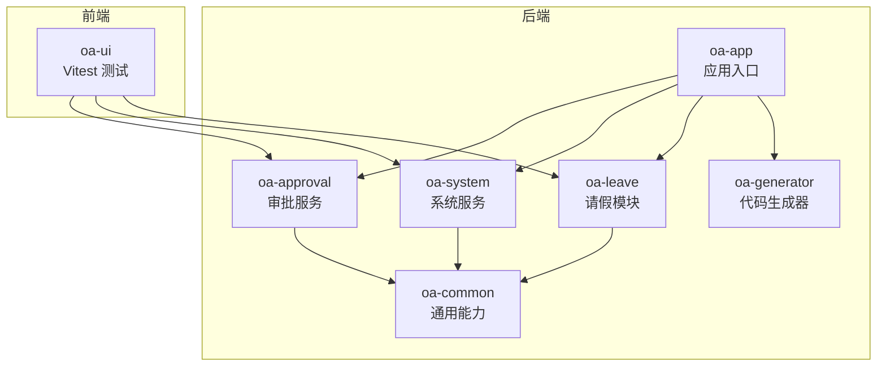
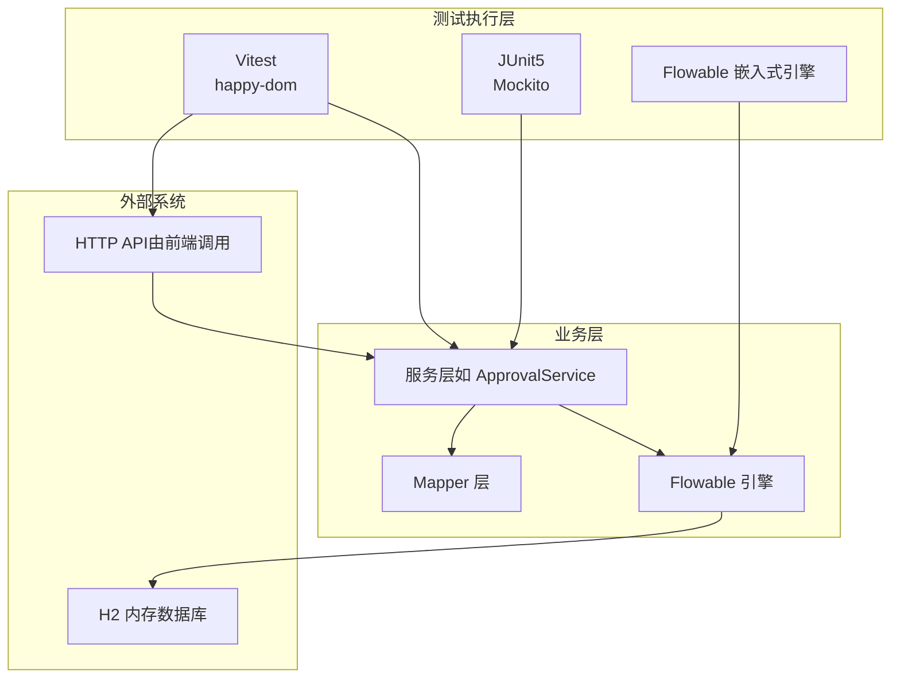
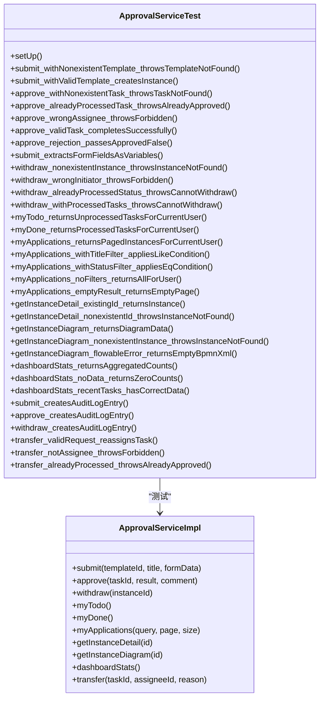
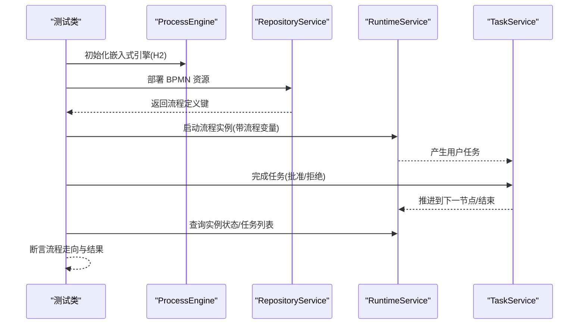
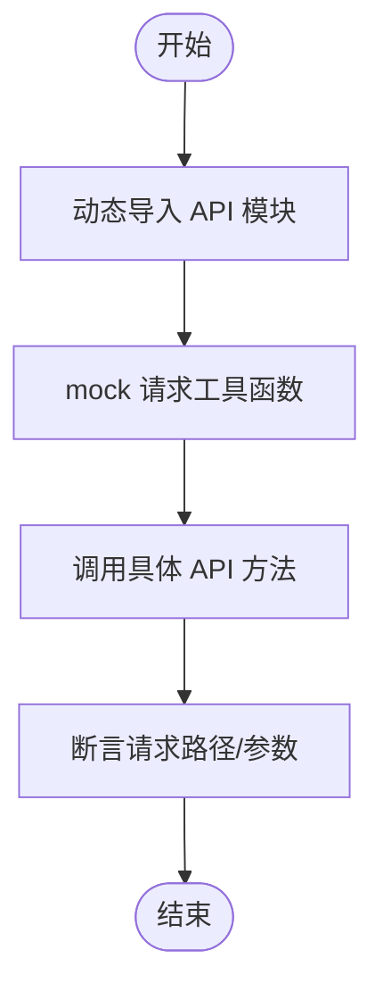
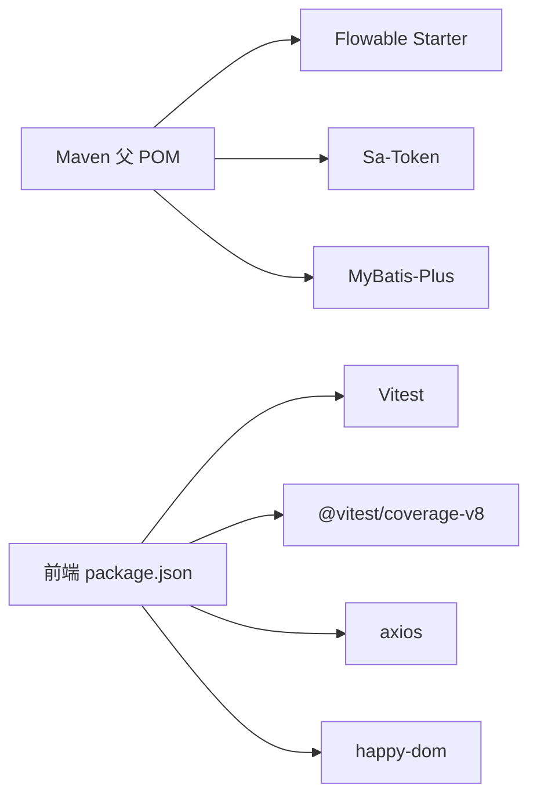

# 测试工具

<cite>
**本文引用的文件**
- [pom.xml](file://pom.xml)
- [vitest.config.ts](file://oa-ui/vitest.config.ts)
- [package.json](file://oa-ui/package.json)
- [ApprovalServiceTest.java](file://oa-approval/src/test/java/com/oa/admin/approval/service/ApprovalServiceTest.java)
- [FlowableGatewayIntegrationTest.java](file://oa-approval/src/test/java/com/oa/admin/approval/integration/FlowableGatewayIntegrationTest.java)
- [AuthServiceTest.java](file://oa-system/src/test/java/com/oa/admin/system/service/AuthServiceTest.java)
- [RTest.java](file://oa-common/src/test/java/com/oa/admin/common/result/RTest.java)
- [approval.test.ts](file://oa-ui/src/api/approval.test.ts)
- [request.test.ts](file://oa-ui/src/utils/request.test.ts)
- [bpmn-composables.test.ts](file://oa-ui/src/composables/bpmn/bpmn-composables.test.ts)
- [leave_request.bpmn20.xml](file://oa-approval/src/test/resources/processes/leave_request.bpmn20.xml)
</cite>

## 目录
1. [简介](#简介)
2. [项目结构](#项目结构)
3. [核心组件](#核心组件)
4. [架构总览](#架构总览)
5. [详细组件分析](#详细组件分析)
6. [依赖分析](#依赖分析)
7. [性能考虑](#性能考虑)
8. [故障排查指南](#故障排查指南)
9. [结论](#结论)
10. [附录](#附录)

## 简介
本指南面向本项目的测试体系，覆盖后端单元测试与集成测试（含 Flowable 工作流）、前端 Vitest 单元测试与组件测试、测试数据准备与清理、覆盖率统计与报告、性能与压力测试方法、测试自动化与 CI/CD 集成建议，以及测试调试与最佳实践。内容以仓库现有实现为依据，结合可操作的步骤与图示，帮助开发者快速上手并规范化测试流程。

## 项目结构
项目采用多模块 Maven 结构，前端位于 oa-ui，后端按功能拆分为多个模块（oa-common、oa-system、oa-approval、oa-leave、oa-app、oa-generator）。测试分布于各模块的 test 目录中，遵循“按模块+按类型”的组织方式：单元测试（Mockito/JUnit5）与集成测试（嵌入式 Flowable 引擎 + H2 内存数据库）在后端；前端使用 Vitest + happy-dom 运行环境进行组件与 API 测试。

**图表来源**
- [pom.xml:21-28](file://pom.xml#L21-L28)

**章节来源**
- [pom.xml:21-28](file://pom.xml#L21-L28)

## 核心组件
- 后端测试框架与依赖管理
  - JUnit5 + Mockito：用于单元测试与模拟外部依赖。
  - Flowable 嵌入式引擎 + H2：用于 BPMN 流程集成测试。
  - Maven 依赖统一管理，确保版本一致性。
- 前端测试框架与运行环境
  - Vitest + happy-dom：轻量 DOM 环境，支持 Vue 组件与 API 层测试。
  - 覆盖率收集：@vitest/coverage-v8。
- 公共响应体与异常处理测试
  - 对统一返回体与异常处理逻辑进行断言验证，保证前后端契约一致。

**章节来源**
- [pom.xml:30-112](file://pom.xml#L30-L112)
- [package.json:24-36](file://oa-ui/package.json#L24-L36)
- [vitest.config.ts:16-21](file://oa-ui/vitest.config.ts#L16-L21)

## 架构总览
下图展示了测试层与业务层的交互关系，以及测试数据与外部系统的边界。

**图表来源**
- [FlowableGatewayIntegrationTest.java:26-43](file://oa-approval/src/test/java/com/oa/admin/approval/integration/FlowableGatewayIntegrationTest.java#L26-L43)
- [ApprovalServiceTest.java:61-104](file://oa-approval/src/test/java/com/oa/admin/approval/service/ApprovalServiceTest.java#L61-L104)
- [vitest.config.ts:16-21](file://oa-ui/vitest.config.ts#L16-L21)

## 详细组件分析

### 后端单元测试：ApprovalServiceTest
该测试类对审批服务的关键行为进行验证，包括提交、审批、撤回、待办/已办查询、实例详情与流程图渲染、仪表盘统计、审计日志记录、任务转办等。通过 Mockito 模拟 Mapper、Flowable 服务与审计服务，并使用静态桩（MockedStatic）模拟登录上下文。

**图表来源**
- [ApprovalServiceTest.java:61-104](file://oa-approval/src/test/java/com/oa/admin/approval/service/ApprovalServiceTest.java#L61-L104)
- [ApprovalServiceTest.java:140-172](file://oa-approval/src/test/java/com/oa/admin/approval/service/ApprovalServiceTest.java#L140-L172)
- [ApprovalServiceTest.java:214-231](file://oa-approval/src/test/java/com/oa/admin/approval/service/ApprovalServiceTest.java#L214-L231)

**章节来源**
- [ApprovalServiceTest.java:140-278](file://oa-approval/src/test/java/com/oa/admin/approval/service/ApprovalServiceTest.java#L140-L278)
- [ApprovalServiceTest.java:280-491](file://oa-approval/src/test/java/com/oa/admin/approval/service/ApprovalServiceTest.java#L280-L491)
- [ApprovalServiceTest.java:493-582](file://oa-approval/src/test/java/com/oa/admin/approval/service/ApprovalServiceTest.java#L493-L582)
- [ApprovalServiceTest.java:616-658](file://oa-approval/src/test/java/com/oa/admin/approval/service/ApprovalServiceTest.java#L616-L658)
- [ApprovalServiceTest.java:683-752](file://oa-approval/src/test/java/com/oa/admin/approval/service/ApprovalServiceTest.java#L683-L752)
- [ApprovalServiceTest.java:754-800](file://oa-approval/src/test/java/com/oa/admin/approval/service/ApprovalServiceTest.java#L754-L800)

### 集成测试：Flowable 工作流网关测试
该测试使用嵌入式 Flowable 引擎与 H2 内存数据库，部署 BPMN 资源，验证不同网关（独占/并行/会签/或签）与拒绝路径的行为。通过注册测试替身 Bean 替换真实解析器与监听器，确保流程变量与路由逻辑可被精确控制。

**图表来源**
- [FlowableGatewayIntegrationTest.java:26-43](file://oa-approval/src/test/java/com/oa/admin/approval/integration/FlowableGatewayIntegrationTest.java#L26-L43)
- [FlowableGatewayIntegrationTest.java:95-104](file://oa-approval/src/test/java/com/oa/admin/approval/integration/FlowableGatewayIntegrationTest.java#L95-L104)
- [FlowableGatewayIntegrationTest.java:108-134](file://oa-approval/src/test/java/com/oa/admin/approval/integration/FlowableGatewayIntegrationTest.java#L108-L134)
- [FlowableGatewayIntegrationTest.java:138-169](file://oa-approval/src/test/java/com/oa/admin/approval/integration/FlowableGatewayIntegrationTest.java#L138-L169)
- [FlowableGatewayIntegrationTest.java:173-211](file://oa-approval/src/test/java/com/oa/admin/approval/integration/FlowableGatewayIntegrationTest.java#L173-L211)
- [FlowableGatewayIntegrationTest.java:215-249](file://oa-approval/src/test/java/com/oa/admin/approval/integration/FlowableGatewayIntegrationTest.java#L215-L249)
- [FlowableGatewayIntegrationTest.java:253-268](file://oa-approval/src/test/java/com/oa/admin/approval/integration/FlowableGatewayIntegrationTest.java#L253-L268)

**章节来源**
- [FlowableGatewayIntegrationTest.java:26-86](file://oa-approval/src/test/java/com/oa/admin/approval/integration/FlowableGatewayIntegrationTest.java#L26-L86)
- [FlowableGatewayIntegrationTest.java:95-104](file://oa-approval/src/test/java/com/oa/admin/approval/integration/FlowableGatewayIntegrationTest.java#L95-L104)
- [FlowableGatewayIntegrationTest.java:108-134](file://oa-approval/src/test/java/com/oa/admin/approval/integration/FlowableGatewayIntegrationTest.java#L108-L134)
- [FlowableGatewayIntegrationTest.java:138-169](file://oa-approval/src/test/java/com/oa/admin/approval/integration/FlowableGatewayIntegrationTest.java#L138-L169)
- [FlowableGatewayIntegrationTest.java:173-211](file://oa-approval/src/test/java/com/oa/admin/approval/integration/FlowableGatewayIntegrationTest.java#L173-L211)
- [FlowableGatewayIntegrationTest.java:215-249](file://oa-approval/src/test/java/com/oa/admin/approval/integration/FlowableGatewayIntegrationTest.java#L215-L249)
- [FlowableGatewayIntegrationTest.java:253-268](file://oa-approval/src/test/java/com/oa/admin/approval/integration/FlowableGatewayIntegrationTest.java#L253-L268)

### 前端测试：API 与拦截器
- API 层测试：对审批相关 API 的请求路径、参数与分页参数进行断言，通过 mock 请求工具函数验证 HTTP 调用是否正确。
- 请求拦截器测试：验证令牌注入、业务码校验、401 清理与跳转等行为。
- 组合式函数测试：对 BPMN 编辑器相关的组合式函数（选择元素、命令栈、模型器初始化）进行事件驱动的状态断言。

**图表来源**
- [approval.test.ts:18-29](file://oa-ui/src/api/approval.test.ts#L18-L29)
- [approval.test.ts:31-41](file://oa-ui/src/api/approval.test.ts#L31-L41)
- [approval.test.ts:67-89](file://oa-ui/src/api/approval.test.ts#L67-L89)
- [approval.test.ts:107-125](file://oa-ui/src/api/approval.test.ts#L107-L125)
- [approval.test.ts:136-143](file://oa-ui/src/api/approval.test.ts#L136-L143)

**章节来源**
- [approval.test.ts:1-154](file://oa-ui/src/api/approval.test.ts#L1-L154)
- [request.test.ts:51-97](file://oa-ui/src/utils/request.test.ts#L51-L97)
- [bpmn-composables.test.ts:12-104](file://oa-ui/src/composables/bpmn/bpmn-composables.test.ts#L12-L104)
- [bpmn-composables.test.ts:115-207](file://oa-ui/src/composables/bpmn/bpmn-composables.test.ts#L115-L207)
- [bpmn-composables.test.ts:266-283](file://oa-ui/src/composables/bpmn/bpmn-composables.test.ts#L266-L283)

### 公共响应体与异常处理测试
- 统一返回体 R 的构造与字段断言，确保成功/失败、数据封装、时间戳范围符合预期。
- 异常处理测试覆盖常见错误码与消息映射，保障前后端一致的错误语义。

**章节来源**
- [RTest.java:12-72](file://oa-common/src/test/java/com/oa/admin/common/result/RTest.java#L12-L72)

### 系统服务测试：认证服务
- 登录失败、禁用用户、登出、当前用户信息脱敏与未授权场景均通过断言覆盖。
- 使用静态桩模拟登录上下文，隔离外部依赖。

**章节来源**
- [AuthServiceTest.java:46-101](file://oa-system/src/test/java/com/oa/admin/system/service/AuthServiceTest.java#L46-L101)

## 依赖分析
- 后端依赖
  - Flowable Spring Boot Starter：提供流程引擎与集成能力。
  - Sa-Token：提供登录上下文与鉴权能力，测试中通过静态桩模拟。
  - MyBatis-Plus：数据访问层，配合 Mockito 验证 SQL 行为。
- 前端依赖
  - Vitest + happy-dom：DOM 环境与测试运行时。
  - @vitest/coverage-v8：覆盖率收集。
  - axios：网络请求，通过 mock 实现可控的 HTTP 行为。

**图表来源**
- [pom.xml:92-97](file://pom.xml#L92-L97)
- [pom.xml:80-90](file://pom.xml#L80-L90)
- [pom.xml:68-78](file://pom.xml#L68-L78)
- [package.json:24-36](file://oa-ui/package.json#L24-L36)

**章节来源**
- [pom.xml:30-112](file://pom.xml#L30-L112)
- [package.json:24-36](file://oa-ui/package.json#L24-L36)

## 性能考虑
- 单元测试
  - 使用 Mock 隔离外部依赖，避免真实数据库与网络开销。
  - 对热点方法（如审批流程变量提取、分页查询）进行边界条件与复杂度验证。
- 集成测试
  - 嵌入式 Flowable + H2 内存库，减少资源占用；仅在必要时加载完整 BPMN 资源。
  - 控制并发任务数量，避免长时间阻塞。
- 前端测试
  - 使用 happy-dom 减少浏览器启动成本；对异步逻辑使用 nextTick 确保 DOM 更新完成。
- 覆盖率
  - 使用 Vitest 覆盖率插件生成报告，关注关键分支与异常路径。

[本节为通用指导，无需特定文件引用]

## 故障排查指南
- Flowable 集成测试常见问题
  - 流程变量未传递：检查启动流程时传入的变量映射与 BPMN 中表达式是否一致。
  - 任务监听器/解析器未生效：确认嵌入式引擎配置中已注册测试替身 Bean。
  - H2 连接异常：检查 JDBC URL 与驱动配置，确保内存库生命周期与测试阶段匹配。
- 前端拦截器问题
  - 令牌未注入：确认本地存储中的 token 键名与拦截器约定一致。
  - 401 处理：检查路由跳转目标与错误提示逻辑。
- 单元测试失败
  - Mock 不生效：确认使用动态 import 或在 beforeEach 中重置模块。
  - 静态桩失效：确保在 try-with-resources 中正确释放静态桩作用域。

**章节来源**
- [FlowableGatewayIntegrationTest.java:35-40](file://oa-approval/src/test/java/com/oa/admin/approval/integration/FlowableGatewayIntegrationTest.java#L35-L40)
- [request.test.ts:51-97](file://oa-ui/src/utils/request.test.ts#L51-L97)
- [approval.test.ts:18-29](file://oa-ui/src/api/approval.test.ts#L18-L29)

## 结论
本项目测试体系覆盖后端单元与集成测试、前端组件与 API 测试，配合统一的响应体与异常处理验证，形成较为完整的质量保障闭环。通过 Mock 与嵌入式引擎，测试具备高稳定性与可重复性；通过覆盖率与断言设计，能够有效发现逻辑缺陷与边界问题。建议在持续集成中开启覆盖率报告与测试失败阻断，确保代码质量稳步提升。

[本节为总结性内容，无需特定文件引用]

## 附录

### 测试数据准备与清理
- 后端
  - 使用嵌入式 H2 数据库，测试结束后关闭引擎释放资源。
  - 在测试类中使用 @BeforeEach 注册流程资源与初始数据。
- 前端
  - 使用 Vitest 的 beforeEach 与 vi.resetModules 清理拦截器与缓存。
  - 通过 localStorage.clear 清理认证状态。

**章节来源**
- [FlowableGatewayIntegrationTest.java:81-86](file://oa-approval/src/test/java/com/oa/admin/approval/integration/FlowableGatewayIntegrationTest.java#L81-L86)
- [request.test.ts:42-49](file://oa-ui/src/utils/request.test.ts#L42-L49)

### 测试覆盖率统计与报告
- 前端
  - 使用脚本命令运行覆盖率：在 package.json 中定义 test:coverage。
  - 配置文件启用覆盖率收集与输出格式。
- 后端
  - 可在 Maven 中引入 JaCoCo 插件生成覆盖率报告（建议在 CI 中启用）。

**章节来源**
- [package.json:11-13](file://oa-ui/package.json#L11-L13)
- [vitest.config.ts:16-21](file://oa-ui/vitest.config.ts#L16-L21)

### 性能测试与压力测试方法
- 后端
  - 使用 JMH 或 Spring Boot Actuator 指标监控关键服务方法的吞吐与延迟。
  - 集成测试中批量启动流程实例，观察任务分配与历史查询性能。
- 前端
  - 使用 Vitest 的计时断言评估组件渲染与事件处理性能。
  - 对高频 API 调用进行批量请求压测，观察拦截器与缓存命中情况。

[本节为通用指导，无需特定文件引用]

### 测试自动化与 CI/CD 集成
- 建议流水线步骤
  - 依赖安装：后端使用 Maven，前端使用 npm ci。
  - 单元测试：后端 mvn test，前端 npm run test。
  - 集成测试：后端集成 Flowable/H2，前端 Vitest。
  - 覆盖率：前端使用 npm run test:coverage，后端可配置 JaCoCo。
  - 报告归档：上传测试报告与覆盖率文件至制品库。
- 触发策略
  - Pull Request 自动触发基础测试；主干推送触发全量集成测试。

[本节为通用指导，无需特定文件引用]

### 测试调试与问题定位技巧
- 后端
  - 使用 Mockito.verify 与 verifyNoInteractions 精确定位调用链。
  - 对异常路径使用 assertThrows 并断言错误码与消息。
- 前端
  - 对异步逻辑使用 await/nextTick，确保 DOM 与状态更新完成。
  - 通过 vi.clearAllMocks 与 resetModules 避免跨用例污染。

**章节来源**
- [ApprovalServiceTest.java:147-150](file://oa-approval/src/test/java/com/oa/admin/approval/service/ApprovalServiceTest.java#L147-L150)
- [bpmn-composables.test.ts:26-55](file://oa-ui/src/composables/bpmn/bpmn-composables.test.ts#L26-L55)

### 测试最佳实践与团队协作规范
- 命名与组织
  - 测试类命名与被测类一一对应，按功能模块划分包结构。
- 断言与期望
  - 使用明确的断言消息与最小化期望，聚焦关键行为。
- Mock 与替身
  - 优先使用 Mockito；对外部系统使用替身或桩对象。
- 覆盖率与回归
  - 设定覆盖率门槛，优先补齐异常路径与边界条件。
- 文档与示例
  - 在测试中保留注释与示例，便于新成员快速理解。

[本节为通用指导，无需特定文件引用]